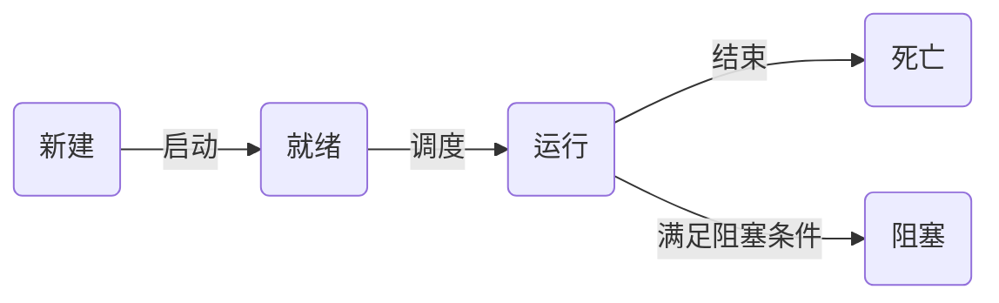
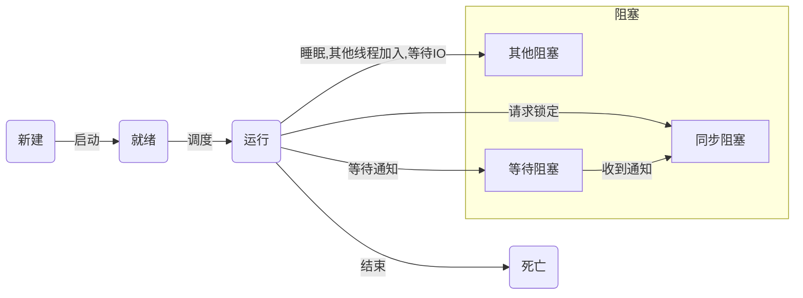
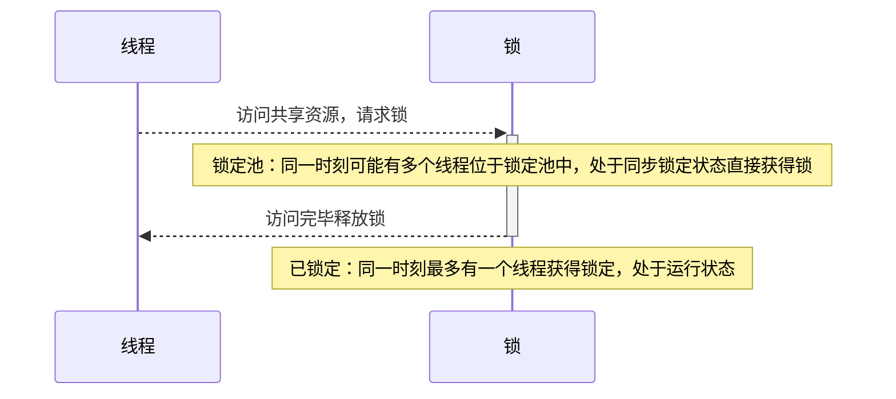

# Python分布式计算

## 一、Python多进程与多线程

### 1.1 线程基础

线程有5种状态：新建、就绪、运行、死亡、阻塞



**线程运行和阻塞状态的转换**

阻塞有三种情况： 

- 同步阻塞是指处于竞争锁定的状态，线程请求锁定时将进入这个状态，一旦成功获得锁定又恢复到运行状态； 
- 等待阻塞是指等待其他线程通知的状态，线程获得条件锁定后，调用“等待”将进入这个状态，一旦其他线程发出通知，线程将进入同步阻塞状态，再次竞争条件锁定； 
- 而其他阻塞是指调用time.sleep()、anotherthread.join()或等待IO时的阻塞，这个状态下线程不会释放已获得的锁定。





#### 1.1.1 线程同步（锁）

多线程的优势在于可以同时运行多个任务。但是当线程需要共享数据时，可能存在数据不同步的问题。考虑这样一种情况：一个列表里所有元素都是0，线程"set"从后向前把所有元素改成1，而线程"print"负责从前往后读取列表并打印。那么，可能线程"set"开始改的时候，线程"print"便来打印列表了，输出就成了一半0一半1，这就是数据的不同步。为了避免这种情况，引入了锁的概念。

锁有两种状态——锁定和未锁定。每当一个线程比如"set"要访问共享数据时，必须先获得锁定；如果已经有别的线程比如"print"获得锁定了，那么就让线程"set"暂停，也就是同步阻塞；等到线程"print"访问完毕，释放锁以后，再让线程"set"继续。经过这样的处理，打印列表时要么全部输出0，要么全部输出1，不会再出现一半0一半1的尴尬场面。线程与锁的交互如下图所示：




#### 1.1.2 线程通信（条件变量）

然而还有另外一种尴尬的情况：列表并不是一开始就有的；而是通过线程"create"创建的。如果"set"或者"print" 在"create"还没有运行的时候就访问列表，将会出现一个异常。使用锁可以解决这个问题，但是"set"和"print"将需要一个无限循环——他们不知道"create"什么时候会运行，让"create"在运行后通知"set"和"print"显然是一个更好的解决方案。于是，引入了条件变量。

条件变量允许线程比如"set"和"print"在条件不满足的时候（列表为None时）等待，等到条件满足的时候（列表已经创建）发出一个通知，告诉"set" 和"print"条件已经有了，你们该起床干活了；然后"set"和"print"才继续运行。

### 1.2 threading库

thread提供了低级别的、原始的线程以及一个简单的锁。由于thread提供的线程功能不多，无法在主线程结束后继续运行，不提供条件变量等等原因，一般不使用thread模块，这里就不多介绍了。

threading基于Java的线程模型设计。锁（Lock）和条件变量（Condition）在Java中是对象的基本行为（每一个对象都自带了锁和条件变量），而在Python中则是独立的对象。Python Thread提供了Java Thread的行为的子集；没有优先级、线程组，线程也不能被停止、暂停、恢复、中断。Java Thread中的部分被Python实现了的静态方法在threading中以模块方法的形式提供。

| 类型                        | 说明                                       |
| ------------------------- | ---------------------------------------- |
| threading模块提供的类           | Thread, Lock, Rlock, Condition, [Bounded]Semaphore, Event, Timer, local |
| threading.currentThread() | 返回当前的线程变量                                |
| threading.enumerate()     | 返回一个包含正在运行的线程的list。正在运行指线程启动后、结束前，不包括启动前和终止后的线程。 |
| threading.activeCount()   | 返回正在运行的线程数量，与len(threading.enumerate())有相同的结果。 |

#### 1.2.1 Thread

Thread是线程类，与Java类似，有两种使用方法，直接传入要运行的方法或从Thread继承并覆盖run

**构造方法：**Thread(group=None, target=None, name=None,args=(), kwargs={}) 

- group: 线程组，目前还没有实现，库引用中提示必须是None； 
- target: 要执行的方法； 
- name: 线程名； 
- args/kwargs: 要传入方法的参数。

**实例方法** 

- isAlive(), 返回线程是否在运行
- get/setName(name): 获取/设置线程名
- is/setDaemon(bool): 获取/设置是否守护线程。初始值从创建该线程的线程继承。当没有非守护线程仍在运行时，程序将终止。 
- start(): 启动线程
- join([timeout]): 阻塞当前上下文环境的线程，直到调用此方法的线程终止或到达指定的timeout（可选参数）

```python
# encoding: UTF-8
import threading
 
# 方法1：将要执行的方法作为参数传给Thread的构造方法
def func():
    print 'func() passed to Thread'
 
t = threading.Thread(target=func)
t.start()
 
# 方法2：从Thread继承，并重写run()
class MyThread(threading.Thread):
    def run(self):
        print 'MyThread extended from Thread'
 
t = MyThread()
t.start()

```

#### 1.2.2  Lock

Lock（指令锁）是可用的最低级的同步指令。Lock处于锁定状态时，不被特定的线程拥有。Lock包含两种状态——锁定和非锁定，以及两个基本的方法。可以认为Lock有一个锁定池，当线程请求锁定时，将线程至于池中，直到获得锁定后出池。==池中的线程处于状态图中的同步阻塞状态==。

**构造方法：Lock()**

**实例方法：** 

- acquire([timeout]): 使线程进入同步阻塞状态，尝试获得锁定。
- release(): 释放锁。使用前线程必须已获得锁定，否则将抛出异常。

```python
 encoding: UTF-8
import threading
import time
 
data = 0
lock = threading.Lock()
 
def func():
    global data
    print '%s acquire lock...' % threading.currentThread().getName()
    # 调用acquire([timeout])时，线程将一直阻塞，
    # 直到获得锁定或者直到timeout秒后（timeout参数可选）。
    # 返回是否获得锁。
    if lock.acquire():
        print '%s get the lock.' % threading.currentThread().getName()
        data += 1
        time.sleep(2)
        print '%s release lock...' % threading.currentThread().getName()
        
        # 调用release()将释放锁。
        lock.release()
 
t1 = threading.Thread(target=func)
t2 = threading.Thread(target=func)
t3 = threading.Thread(target=func)
t1.start()
t2.start()
t3.start()
```

#### 1.2.3 可重入锁（RLock）

RLock（可重入锁）是一个可以被同一个线程请求多次的同步指令。RLock使用了“拥有的线程”和“递归等级”的概念，处于锁定状态时，RLock被某个线程拥有。拥有RLock的线程可以再次调用acquire()，释放锁时需要调用release()相同次数。可以认为RLock包含一个锁定池和一个初始值为0的计数器，每次成功调用 acquire()/release()，计数器将+1/-1，为0时锁处于未锁定状态。

**构造方法：RLock()** 

**实例方法：** 

- acquire([timeout]): 使线程进入同步阻塞状态，尝试获得锁定。
- release(): 释放锁。使用前线程必须已获得锁定，否则将抛出异常。

```python
# encoding: UTF-8
import threading
import time
 
rlock = threading.RLock()
 
def func():
    # 第一次请求锁定
    print '%s acquire lock...' % threading.currentThread().getName()
    if rlock.acquire():
        print '%s get the lock.' % threading.currentThread().getName()
        time.sleep(2)
        
        # 第二次请求锁定
        print '%s acquire lock again...' % threading.currentThread().getName()
        if rlock.acquire():
            print '%s get the lock.' % threading.currentThread().getName()
            time.sleep(2)
        
        # 第一次释放锁
        print '%s release lock...' % threading.currentThread().getName()
        rlock.release()
        time.sleep(2)
        
        # 第二次释放锁
        print '%s release lock...' % threading.currentThread().getName()
        rlock.release()
 
t1 = threading.Thread(target=func)
t2 = threading.Thread(target=func)
t3 = threading.Thread(target=func)
t1.start()
```

#### 1.2.4 条件变量（Condition）

Condition（条件变量）通常与一个锁关联。需要在多个Contidion中共享一个锁时，可以传递一个Lock/RLock实例给构造方法，否则它将自己生成一个RLock实例。可以认为，除了Lock带有的锁定池外，Condition还包含一个等待池，池中的线程处于等待阻塞状态，直到另一个线程调用notify()/notifyAll()通知；得到通知后线程进入锁定池等待锁定。

**构造方法：Condition(Lock/RLock)**

**实例方法：**

- acquire([timeout])/release():  调用关联的锁的相应方法。
- wait([timeout]): 调用这个方法将使线程进入Condition的等待池等待通知，并释放锁。使用前线程必须已获得锁定，否则将抛出异常。 
- notify():  调用这个方法将从等待池挑选一个线程并通知，收到通知的线程将自动调用acquire()尝试获得锁定（进入锁定池）；其他线程仍然在等待池中。调用这个方法不会释放锁定。使用前线程必须已获得锁定，否则将抛出异常。 
- notifyAll():  调用这个方法将通知等待池中所有的线程，这些线程都将进入锁定池尝试获得锁定。调用这个方法不会释放锁定。使用前线程必须已获得锁定，否则将抛出异常。

```python
# encoding: UTF-8
import threading
import time
 
# 商品
product = None
# 条件变量
con = threading.Condition()
 
# 生产者方法
def produce():
    global product
    
    if con.acquire():
        while True:
            if product is None:
                print 'produce...'
                product = 'anything'
                
                # 通知消费者，商品已经生产
                con.notify()
            # 等待通知
            con.wait()
            time.sleep(2)
 
# 消费者方法
def consume():
    global product
    
    if con.acquire():
        while True:
            if product is not None:
                print 'consume...'
                product = None
                
                # 通知生产者，商品已经没了
                con.notify()
            
            # 等待通知
            con.wait()
            time.sleep(2)
 
t1 = threading.Thread(target=produce)
t2 = threading.Thread(target=consume)
t2.start()
t1.start()
```

#### 1.2.5 信号量（ Semaphore/BoundedSemaphore）

Semaphore（信号量）是计算机科学史上最古老的同步指令之一。Semaphore管理一个内置的计数器，每当调用acquire()时-1，调用release() 时+1。计数器不能小于0；当计数器为0时，acquire()将阻塞线程至同步锁定状态，直到其他线程调用release()。基于这个特点，Semaphore经常用来同步一些有“访客上限”的对象，比如连接池。

BoundedSemaphore 与Semaphore的唯一区别在于前者将在调用release()时检查计数器的值是否超过了计数器的初始值，如果超过了将抛出一个异常。

**构造方法：Semaphore(value=1) value是计数器的初始值**

**实例方法：** 

- acquire([timeout]): 请求Semaphore。如果计数器为0，将阻塞线程至同步阻塞状态；否则将计数器-1并立即返回。
- release(): 释放Semaphore，将计数器+1，如果使用BoundedSemaphore，还将进行释放次数检查。release()方法不检查线程是否已获得 Semaphore。

```python
# encoding: UTF-8
import threading
import time
 
# 计数器初值为2
semaphore = threading.Semaphore(2)
 
def func():
    # 请求Semaphore，成功后计数器-1；计数器为0时阻塞
    print '%s acquire semaphore...' % threading.currentThread().getName()
    if semaphore.acquire():
        
        print '%s get semaphore' % threading.currentThread().getName()
        time.sleep(4)
        
        # 释放Semaphore，计数器+1
        print '%s release semaphore' % threading.currentThread().getName()
        semaphore.release()
 
t1 = threading.Thread(target=func)
t2 = threading.Thread(target=func)
t3 = threading.Thread(target=func)
t4 = threading.Thread(target=func)
t1.start()
t2.start()
t3.start()
t4.start()
 
time.sleep(2)
 
# 没有获得semaphore的主线程也可以调用release
# 若使用BoundedSemaphore，t4释放semaphore时将抛出异常
print 'MainThread release semaphore without acquire'
semaphore.release()
```

#### 1.2.6 事件（Event）

Event（事件）是最简单的线程通信机制之一：一个线程通知事件，其他线程等待事件。Event内置了一个初始为False的标志，当调用set()时设为True，调用clear()时重置为 False。wait()将阻塞线程至等待阻塞状态。Event其实就是一个简化版的 Condition。Event没有锁，无法使线程进入同步阻塞状态。

**构造方法：Event()**

**实例方法：** 

- isSet(): 当内置标志为True时返回True。
- set(): 将标志设为True，并通知所有处于等待阻塞状态的线程恢复运行状态。
- clear(): 将标志设为False
- wait([timeout]): 如果标志为True将立即返回，否则阻塞线程至等待阻塞状态，等待其他线程调用

```python
# encoding: UTF-8
import threading
import time
 
event = threading.Event()
 
def func():
    # 等待事件，进入等待阻塞状态
    print '%s wait for event...' % threading.currentThread().getName()
    event.wait()
    
    # 收到事件后进入运行状态
    print '%s recv event.' % threading.currentThread().getName()
 
t1 = threading.Thread(target=func)
t2 = threading.Thread(target=func)
t1.start()
t2.start()
 
time.sleep(2)
 
# 发送事件通知
print 'MainThread set event.'
event.set()

```

#### 1.2.7 Timer

Timer（定时器）是Thread的派生类，用于在指定时间后调用一个方法。

**构造方法：Timer(interval, function, args=[], kwargs={})**

- interval: 指定的时间 
- function: 要执行的方法 
- args/kwargs: 方法的参数

**实例方法：** Timer从Thread派生，没有增加实例方法

```python
# encoding: UTF-8
import threading
 
def func():
    print 'hello timer!'
timer = threading.Timer(5, func)
timer.start()
```

#### 1.2.8 local

local是一个小写字母开头的类，用于管理 thread-local（线程局部的）数据。对于同一个local，线程无法访问其他线程设置的属性；线程设置的属性不会被其他线程设置的同名属性替换。可以把local看成是一个“线程-属性字典”的字典，local封装了从自身使用线程作为 key检索对应的属性字典、再使用属性名作为key检索属性值的细节。

```python
# encoding: UTF-8
import threading
 
local = threading.local()
local.tname = 'main'
 
def func():
    local.tname = 'notmain'
    print local.tname
 
t1 = threading.Thread(target=func)
t1.start()
t1.join()
 
print local.tname
```

```python
#encoding: UTF-8
import threading
 
alist = None
condition = threading.Condition()
 
def doSet():
    if condition.acquire():
        while alist is None:
            condition.wait()
        for i in range(len(alist))[::-1]:
            alist[i] = 1
        condition.release()
 
def doPrint():
    if condition.acquire():
        while alist is None:
            condition.wait()
        for i in alist:
            print i,
        print
        condition.release()
 
def doCreate():
    global alist
    if condition.acquire():
        if alist is None:
            alist = [0 for i in range(10)]
            condition.notifyAll()
        condition.release()
 
tset = threading.Thread(target=doSet,name='tset')
tprint = threading.Thread(target=doPrint,name='tprint')
tcreate = threading.Thread(target=doCreate,name='tcreate')
tset.start()
tprint.start()
tcreate.start()
```

### 1.3 multiprocessing库

Unix/Linux操作系统提供了一个`fork()`系统调用，它非常特殊。普通的函数调用，调用一次，返回一次，但是`fork()`调用一次，返回两次，因为操作系统自动把当前进程（称为父进程）复制了一份（称为子进程），然后，分别在父进程和子进程内返回。子进程永远返回`0`，而父进程返回子进程的ID。这样做的理由是，一个父进程可以fork出很多子进程，所以，父进程要记下每个子进程的ID，而子进程只需要调用`getppid()`就可以拿到父进程的ID。

Python的`os`模块封装了常见的系统调用，其中就包括`fork`，可以在Python程序中轻松创建子进程：

```python
# multiprocessing.py
import os

print 'Process (%s) start...' % os.getpid()
pid = os.fork()
if pid==0:
    print 'I am child process (%s) and my parent is %s.' % (os.getpid(), os.getppid())
else:
    print 'I (%s) just created a child process (%s).' % (os.getpid(), pid)

#Process (876) start...
#I (876) just created a child process (877).
#I am child process (877) and my parent is 876.
```

于Windows没有`fork`调用，上面的代码在Windows上无法运行。由于Python是跨平台的，自然也应该提供一个跨平台的多进程支持。`multiprocessing`模块就是跨平台版本的多进程模块。`multiprocessing`模块提供了一个`Process`类来代表一个进程对象，下面的例子演示了启动一个子进程并等待其结束：

```python
from multiprocessing import Process
import os

# 子进程要执行的代码
def run_proc(name):
    print 'Run child process %s (%s)...' % (name, os.getpid())

if __name__=='__main__':
    print 'Parent process %s.' % os.getpid()
    p = Process(target=run_proc, args=('test',)) #创建进程
    print 'Process will start.'
    p.start()  # 启动进程
    p.join()   # 等待子进程结束后再继续往下运行，通常用于进程间的同步
    print 'Process end.'
```

**全局解释器锁GIL**

GIL全称为Global Interpreter Lock，全局解释器锁并不是Python的特性，它是实现Python解释器（CPython）时所引入的概念。GIL是一把全局排它锁同一时刻只有一个线程在运行。GIL的存在会对多线程的效率的影响，甚至几乎等于Python是个单线程程序。multiprocessing库的出现很大程度上是为了弥补threading因为GIL而低效的缺陷。它完整的复制了一套threading所提供的接口，唯一不同的是它使用了多进程而不是多线程每一个进程有自己的独立GIL，因此就不会出现进程之间的GIL争抢。

**进程池Pool** 

如果要启动大量的子进程，可以用进程池的方式批量创建子进程。

```python
from multiprocessing import Pool
import os, time, random

def long_time_task(name):
    print 'Run task %s (%s)...' % (name, os.getpid())
    start = time.time()
    time.sleep(random.random() * 3)
    end = time.time()
    print 'Task %s runs %0.2f seconds.' % (name, (end - start))

if __name__=='__main__':
    print 'Parent process %s.' % os.getpid()
    p = Pool()
    for i in range(5):
        p.apply_async(long_time_task, args=(i,))
    print 'Waiting for all subprocesses done...'
    p.close()
    p.join()
    print 'All subprocesses done.'
```

对`Pool`对象调用`join()`方法会等待所有子进程执行完毕，调用`join()`之前必须先调用`close()`，调用`close()`之后就不能继续添加新的`Process`了。

请注意输出的结果，task `0`，`1`，`2`，`3`是立刻执行的，而task `4`要等待前面某个task完成后才执行，这是因为`Pool`的默认大小在我的电脑上是4，因此，最多同时执行4个进程。这是`Pool`有意设计的限制，并不是操作系统的限制。如果改成：p = Pool(5)。由于`Pool`的默认大小是CPU的核数，如果你不幸拥有8核CPU，你要提交至少9个子进程才能看到上面的等待效果。

**进程间通信Queue** 

`Process`之间肯定是需要通信的，操作系统提供了很多机制来实现进程间的通信。Python的`multiprocessing`模块包装了底层的机制，提供了`Queue`、`Pipes`等多种方式来交换数据。

```python
#以Queue为例，在父进程中创建两个子进程，一个往Queue里写数据，一个从Queue里读数据
rom multiprocessing import Process, Queue
import os, time, random

# 写数据进程执行的代码:
def write(q):
    for value in ['A', 'B', 'C']:
        print 'Put %s to queue...' % value
        q.put(value)
        time.sleep(random.random())

# 读数据进程执行的代码:
def read(q):
    while True:
        value = q.get(True)
        print 'Get %s from queue.' % value

if __name__=='__main__':
    # 父进程创建Queue，并传给各个子进程：
    q = Queue()
    pw = Process(target=write, args=(q,))
    pr = Process(target=read, args=(q,))
    # 启动子进程pw，写入:
    pw.start()
    # 启动子进程pr，读取:
    pr.start()
    # 等待pw结束:
    pw.join()
    # pr进程里是死循环，无法等待其结束，只能强行终止:
    pr.terminate()
```

在Unix/Linux下，`multiprocessing`模块封装了`fork()`调用，使我们不需要关注`fork()`的细节。由于Windows没有`fork`调用，因此，`multiprocessing`需要“模拟”出`fork`的效果，父进程所有Python对象都必须通过pickle序列化再传到子进程去，所有，如果`multiprocessing`在Windows下调用失败了，要先考虑是不是pickle失败了。

## 二、Python函数式编程

函数式编程的三大特性：

- **immutable data 不可变数据** ， 像Clojure一样，默认上变量是不可变的，如果你要改变变量，你需要把变量copy出去修改。这样一来，可以让你的程序少很多Bug。因为，程序中的状态不好维护，在并发的时候更不好维护。
- **first class functions**，让函数就像变量一样来使用，函数可以像变量一样被创建，修改，并当成变量一样传递，返回或是在函数中嵌套函数。
- **尾递归优化**，使用尾递归优化技术——每次递归时都会重用stack，这样一来能够提升性能。当然，这需要语言或编译器的支持。Python就不支持。

函数式编程的好处：

- **parallelization 并行** ，在并行环境下，各个线程之间不需要同步或互斥；
- **lazy evaluation 惰性求值** ，这个需要编译器的支持。表达式不在它被绑定到变量之后就立即求值，而是在该值被取用的时候求值。语句如*x:=expression;* (把一个表达式的结果赋值给一个变量)明显的调用这个表达式被计算并把结果放置到 *x* 中，但是先不管实际在 *x* 中的是什么，直到通过后面的表达式中到 *x* 的引用而有了对它的值的需求的时候，而后面表达式自身的求值也可以被延迟，最终为了生成让外界看到的某个符号而计算这个快速增长的依赖树。`Spark`的`RDD`上的Transforms就是利用这一特性。
- **determinism 确定性** ，确定性的意思就是像数学那样 f(x) = y ，这个函数无论在什么场景下，都会得到同样的结果，这个我们称之为函数的确定性。确定性的意思就是像数学那样 f(x) = y ，这个函数无论在什么场景下，都会得到同样的结果，这个我们称之为函数的确定性。

函数式编程的技术

- **map & filter & reduce** ，这样的代码是在描述要干什么，而不是怎么干

```
"""
filter(func, seq)：对seq中的item依次执行func(item)，执行结果为True的Item组成一个List/String/Tuple(取决于seq的类型)
map(func, seq)：对seq中的元素item依次执行func(item)，执行结果组成一个List返回；
Reduce(func, seq, starting_value)：对seq中的item顺序迭代调用func(item1, item2)，如果starting_value不为空，作为func(starting_value, item1)依次调用。
"""
squares = map(lambda x: x * x, range(9))
print squares
# 输出 [0, 1, 4, 9, 16, 25, 36, 49, 64]

# 求数组中正数的平均值
positive_num = filter(lambda x: x>0, num)
average = reduce(lambda x,y: x+y, positive_num) / len( positive_num )
```

- **pipeline** ，把函数实例成一个一个的action，把一组action放到一个数组或是列表中，然后把数据传给这个action list，数据就像一个pipeline一样顺序地被各个函数所操作，最终得到我们想要的结果。

```python
class Pipe(object):
    def __init__(self, func):
        self.func = func
 
    def __ror__(self, other):
        def generator():
            for obj in other:
                if obj is not None:
                    yield self.func(obj)
        return generator()
 
@Pipe
def even_filter(num):
    return num if num % 2 == 0 else None
 
@Pipe
def multiply_by_three(num):
    return num*3
 
@Pipe
def convert_to_string(num):
    return 'The Number: %s' % num
 
@Pipe
def echo(item):
    print item
    return item
 
def force(sqs):
    for item in sqs: pass
 
nums = [1, 2, 3, 4, 5, 6, 7, 8, 9, 10]
 
force(nums | even_filter | multiply_by_three | convert_to_string | echo)
```

- **recursing 递归** ，递归最大的好处就简化代码，他可以把一个复杂的问题用很简单的代码描述出来。`注意`：递归的精髓是描述问题，而这正是函数式编程的精髓。

- **currying** ，把一个函数的多个参数分解成多个函数， 然后把函数多层封装起来，每层函数都返回一个函数去接收下一个参数这样，可以简化函数的多个参数。

```python
#把函数当成变量来用，关注于描述问题而不是怎么实现
def inc(x):
    def incx(y):
        return x+y
    return incx
 
inc2 = inc(2)
inc5 = inc(5)
print inc2(5) # 输出 7
print inc5(5) # 输出 10
```

- **higher order function 高阶函数** ，高阶函数就是函数当参数，把传入的函数做一个封装，然后返回这个封装函数，现象上就是函数传进传出。


>  describe what to do, rather than how to do it
>
>  把以前的过程式的编程范式叫做 [Imperative Programming](http://en.wikipedia.org/wiki/Imperative_programming) (指令式编程)，而把函数式的这种范式叫做 [Declarative Programming](http://en.wikipedia.org/wiki/Declarative_programming) ( 声明式编程)


## 三、Python使用Hadoop分布式计算库mrjob

Hadoop是Apache开源组织的一个分布式计算开源框架，`核心设计十是`：MapReduce和HDFS（Hadoop Distributed File System）。


**MapReduce思想：** 任务的分解与结果的汇总。


**基于Linux管道的MapReducer**

```python
#mapper.py
import sys
for line in sys.stdin:
    ls = line.split()
    for word in line:
        if len(word.strip()) != 0:
            print(word + ',' + str(1))

#reducer.py
import sys
word_dict = {}
for line in sys.stdin:
    ls = line.split(',')
    word_dict.setdefault(ls[0], 0)
    word_dict[ls[0]] += int(ls[1])
    
for word in word_dict:
    print(word, word_dict[word])

#运行 cat wordcount.input | python mapper.py | python reducer.py | sort -k 2r
```

**Hadoop Streaming & mrjob**

Hadoop有Java和Streaming两种方式来编写MapReduce任务：

- Java的优点是计算效率高，并且部署方便，直接打包成一个jar文件就行；
- Hadoop Streaming是Hadoop提供的一个编程工具，它允许用户使用任何可执行文件或者脚本文件作为Mapper和Reducer。

mrjob实质上就是在Hadoop Streaming的命令行上包了一层，有了统一的Python界面，无需再去直接调用Hadoop Streaming命令。

````python
from mrjob.job import MRJob
class MRWordCount(MRJob):
    def mapper(self, _, line):
        yield "char", len(line)
        yield "words", len(line.split())
        yield "lines", 1
        
    def reducer(self, key, values):
        yield key, sum(values)
if __name__ == "__main__":
    MRWordCount.run()
````

## 四、Python使用Spark分布式计算库PySpark

Spark是基于map、reduce算法实现的分布式计算框架，与Hadoop不同的是：

- Spark的中间输出和结果输出可以保存在`内存`中，从而不需要读写HDFS；
- Spark能更好地用于数据挖掘与机器学习等需要迭代的map、reduce算法中。


Spark可以直接对HDFS进行数据的读写，同样支持Spark on YARN。Spark可以与MapRedeuce运行于同集群中，共享存储资源与计算。

### 4.1  弹性分布式数据集RDD（Resilient Distributed Datasets）

RDD可以看做是一个变量，不可变的，经过序列化的数据结构。特点如下：

- 集群节点上不可变，已分区对象；
- 可序列化；
- 可以控制存储级别（内存，磁盘等）来进行复用；

计算特性：

1. 血统（lineage）不可变，每次变换生成新的RDD，来源可追溯。RDD的生产方式：`文件读取、来自父RDD`
2. 惰性计算lazy evaluation，因为RDD的不可变性，RDD之间的变换关系是保存RDD中的，这样可以从最后一个RDD找到其源RDD，只在action需要输出时才根据依赖关系找到最初的RDD并进行计算。`保证计算结果是可预估的，准确的。`


| RDD算子(操作)      | 说明                                       |
| -------------- | ---------------------------------------- |
| Transformation | map(f: T=>U) : RDD[T] => RDD[U]               filter(f: T=>Bool) : RDD[T] => RDD[T]              flatmap(f: T=> Seq[U]) : RDD[T] => RDD[U]          groupByKey() : RDD[(K,V)] => RDD[(K, Seq[V])]        reduceByKey(f: (V,V) =>V) : RDD[(K, V)] => RDD[(K, V)] |
| Actions        | count() : RDD[T] => Long        reduce(f: (T, T) => T) : RDD[T] => T    collect() : RDD[T] => Seq[T] save(path:String) : output RDD to storage    ==在输出(Actions)时才会根据保存的关系找到最初的RDD并依次进行计算== |


==注意：AB CDE是并没有计算的，只是记录了计算逻辑在内存中，直到在F才会从头进行计算，并记录结果。==

```python
# PySpark实现WorldCount
import sys
form operator import add
form pyspark import SparkContext

sc = SparkContext()

lines = sc.textFile("stormfswords.csv")
counts = lines.flatmap(lambda x: x.split(',')).map(lambda x: (x, 1)).reduceByKey(add)

output = counts.collect()
output = filter(lambda x: not x[0].isnumeric(), sorted(output, key=lambda x: x[1], reverse=True))

sc.stop()W
```
