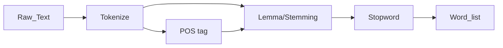
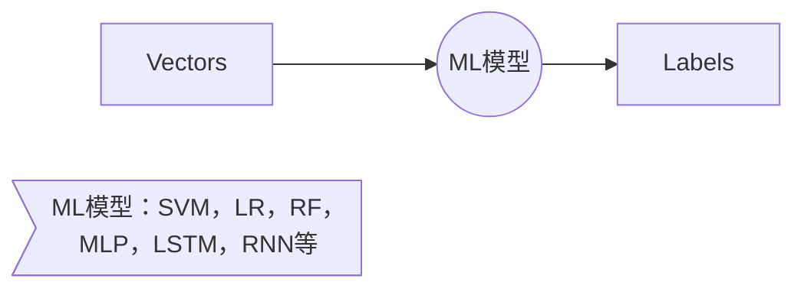

# 自然语言处理库nltk 

## NLTK（Natural Language Toolkit）

### 1. [NLTK](http://www.nltk.org/)的安装

```
安装  pip install -U nltk
引入  import nltk
下载语料库 nltk.download()
```

Python上著名的⾃然语⾔处理库、⾃带语料库，词性分类库、⾃带分类，分词，等等功能。NLTK的应用：文本提取、词汇切分、词频分析、词袋分析、情感分析。

#### 1.1 nltk的主要模块

| 模块                          | 功能                                  |
| --------------------------- | ----------------------------------- |
| nltk.corpus                 | corpus(语料库)，用于训练算法                  |
| nltk.tokenize, nltk.stem    | Tokenizers(分词), Stemmers            |
| nltk.collocations           | t-test, chi-squared, mutual-info    |
| nltk.tag                    | n-gram, backoff, Brill, HMM, TnT    |
| nltk.classify, nltk.cluster | Decision tree, Naive bayes, K-means |
| nltk.chunk                  | Regex, n-gram, named entity         |
| nltk.parsing                | Parsing                             |
| nltk.sem, nltk.interence    | Semantic interpretation             |
| nltk.metrics                | Evaluation metrics                  |
| nltk.probability            | Probability & Estimation            |
| nltk.app, nltk.chat         | Applicatons                         |

####1.2 中英文NLTK的区别

NLTK不支持中文，分词方法：启发式（Heuristic）、机器学习/统计方法（HMM马尔科夫链，CRF）

- 启发式，对照字典，假设有一本新华字典，利用长度优先的方式找到最长的在字典中出现的词，那么它就是我认为的中文上一个有意义的词。
- 机器学习/统计方法，斯坦福大学的CoreNLP在做，包含中文。

```http
#中文分词资料
#结巴分词的github主页
https://github.com/fxsjy/jieba
#基于python的中⽂分词的实现及应⽤
http://www.cnblogs.com/appler/archive/2012/02/02/2335834.html
#对Python中⽂分词模块结巴分词算法过程的理解和分析
http://ddtcms.com/blog/archive/2013/2/4/69/jieba-fenci-suanfa-lijie/
#Penn Chinese Treebank Tag Set
http://blog.csdn.net/neutblue/article/details/7375085
```

**社交语言中的分词**：一种方式是频繁更新语料库，收率最新出现的词。但是对于_拯救 @某⼈, 表情符号, URL, #话题符号_ 这些特殊的词语使用通常的分词器是没有办法区分的。

```python
from nltk.tokenize import word_tokenize
tweet = 'RT @angelababy: love you baby! :D http://ah.love #168cm'
print(word_tokenize(tweet))
# ['RT', '@', 'angelababy', ':', 'love', 'you', 'baby', '!', ':',
# ’D', 'http', ':', '//ah.love', '#', '168cm']
```

**社交网络语言中的分词器--[正则表达式](http://www.regexlab.com/zh/regref.htm )** 

```python
import re
emoticons_str = r"""
	(?:              #表示优先级
		[:=;] # 眼睛
		[oO\-]? # ⿐⼦
		[D\)\]\(\]/\\OpP] # 嘴
	)"""
regex_str = [
	emoticons_str,
	r'<[^>]+>', # HTML tags
	r'(?:@[\w_]+)', # @某⼈
	r"(?:\#+[\w_]+[\w\'_\-]*[\w_]+)", # 话题标签
	r'http[s]?://(?:[a-z]|[0-9]|[$-_@.&amp;+]|[!*\(\),]|(?:%[0-9a-f][0-9a-f]))+',
	# URLs
	r'(?:(?:\d+,?)+(?:\.?\d+)?)', # 数字
	r"(?:[a-z][a-z'\-_]+[a-z])", # 含有 - 和 ‘ 的单词
	r'(?:[\w_]+)', # 其他
	r'(?:\S)' # 其他
]

tokens_re = re.compile(r'(' + '|'.join(regex_str) + ')', re.VERBOSE | re.IGNORECASE)
emoticon_re = re.compile(r'^' + emoticons_str + '$', re.VERBOSE | re.IGNORECASE)
def tokenize(s):
	return tokens_re.findall(s)
#小写用于归一性，这个因为表情:D需要先处理，因此先分词后再小写
def preprocess(s, lowercase=False): 
	tokens = tokenize(s)
if lowercase:
	tokens = [token if emoticon_re.search(token) else token.lower() for token in tokens]
return tokens

tweet = 'RT @angelababy: love you baby! :D http://ah.love #168cm'
print(preprocess(tweet))
# ['RT', '@angelababy', ':', 'love', 'you', 'baby',
# ’!', ':D', 'http://ah.love', '#168cm']
```

**词型归一化**

Inflection变化: walk => walking => walked  ==不影响词性== 

derivation 引申: nation (noun) => national (adjective) => nationalize (verb)  ==影响词性==

归一化有两种：Stemming词干提取、Lemmatization词型归一

- Stemming 词⼲提取：⼀般来说，就是把不影响词性的inflection的⼩尾巴砍掉；例如： walking 砍ing = walk，walked 砍ed = walk 
- Lemmatization 词形归⼀：把各种类型的词的变形，都归为⼀个形式；例如：went 归⼀ = go ，are 归⼀ = be 

```python
from nltk.stem.porter import PorterStemmer
porter_stemmer = PorterStemmer()
porter_stemmer.stem('maximum')
u'maximum'
porter_stemmer.stem('presumably')
u'presum’
porter_stemmer.stem('multiply')
u'multipli'
porter_stemmer.stem('provision')
u'provis'

from nltk.stem.lancaster import LancasterStemmer
lancaster_stemmer = LancasterStemmer()
lancaster_stemmer.stem('maximum')
'maxim'
lancaster_stemmer.stem('presumably')
'presum'
lancaster_stemmer.stem('presumably')
'presum'

from nltk.stem import SnowballStemmer
snowball_stemmer = SnowballStemmer('english')
snowball_stemmer.stem('maximum')
u'maximum'
snowball_stemmer.stem('presumably')
u'presum'

from nltk.stem.porter import PorterStemmer
p = PorterStemmer()
p.stem('went')
'went'
p.stem('wenting')
'went
```

```python
from nltk.stem import WordNetLemmatizer
wordnet_lemmatizer = WordNetLemmatizer()
wordnet_lemmatizer.lemmatize('dogs')
u'dog'
>>> wordnet_lemmatizer.lemmatize('churches')
u'church'
>>> wordnet_lemmatizer.lemmatize('aardwolves')
u'aardwolf'
>>> wordnet_lemmatizer.lemmatize('abaci')
u'abacus'
>>> wordnet_lemmatizer.lemmatize('hardrock')
'hardrock'

#
#Lemma的小问题
# 若在文本上有一个人名为Went，那么若使用词型归一化，这会变为动词go，这就不符合词义了。
#解决方法是：为了更准确使用Lemma，需要先给句子标上POS（Part Of Speech type）
#
# ⽊有POS Tag，默认是NN 名词
>>> wordnet_lemmatizer.lemmatize('are')
'are'
>>> wordnet_lemmatizer.lemmatize('is')
'is'
# 加上POS Tag
>>> wordnet_lemmatizer.lemmatize('is', pos='v')
u'be'
>>> wordnet_lemmatizer.lemmatize('are', pos='v')
u'be'

# NLTK标注POS Tag
>>> import nltk
>>> text = nltk.word_tokenize('what does the fox say')
>>> text
['what', 'does', 'the', 'fox', 'say']
>>> nltk.pos_tag(text)
[('what', 'WDT'), ('does', 'VBZ'), ('the', 'DT'), ('fox', 'NNS'), ('say', 'VBP')]
```

**[Stopword停止词](http://www.ranks.nl/stopwords )**

>⼀千个HE有⼀千种指代,，⼀千个THE有⼀千种指事 

停止词对于注重理解⽂本『意思』的应⽤场景来说歧义太多 

```python
#⾸先记得在console⾥⾯下载⼀下词库或者 nltk.download(‘stopwords’)
from nltk.corpus import stopwords
# 先token⼀把，得到⼀个word_list
# ...
# 然后filter⼀把
filtered_words =
[word for word in word_list if word not in stopwords.words('english')]
```

#### 1.3 文本处理流水线




 什么是自然语言处理？就是将自然语言转化为机器数据，计算机能够处理向量，矩阵。文本处理让我得到什么？


#### 1.4 NLTK在NLP上的应用

##### 1.4.1 情感分析

```python
"""sentiment dictionary
单词     打分
like      1
good      2
bad      -2
terrible -3

关键词打分机制，例如：AFINN-111 http://www2.imm.dtu.dk/pubdb/views/publication_details.php?id=6010
"""
sentiment_dictionary = {}
for line in open('data/AFINN-111.txt')
word, score = line.split('\t')
sentiment_dictionary[word] = int(score)
# 把这个打分表记录在⼀个Dict上以后
# 跑⼀遍整个句⼦，把对应的值相加
total_score = sum(sentiment_dictionary.get(word, 0) for word in words)
# 有值就是Dict中的值，没有就是0
# 于是你就得到了⼀个 sentiment score

"""
这种方式太Too Young Too Simple
显然这个⽅法太Naive
新词怎么办？
特殊词汇怎么办？
更深层次的玩意⼉怎么办？
"""
#配上ML的情感分析
from nltk.classify import NaiveBayesClassifier
# 随⼿造点训练集
s1 = 'this is a good book'
s2 = 'this is a awesome book'
s3 = 'this is a bad book'
s4 = 'this is a terrible book'
def preprocess(s):
# Func: 句⼦处理
# 这⾥简单的⽤了split(), 把句⼦中每个单词分开
# 显然 还有更多的processing method可以⽤
	return {word: True for word in s.lower().split()}
# return⻓这样:
# {'this': True, 'is':True, 'a':True, 'good':True, 'book':True}
# 其中, 前⼀个叫fname特征, 对应每个出现的⽂本单词;
# 后⼀个叫fval, 指的是每个⽂本单词对应的值。
# 这⾥我们⽤最简单的True,来表示,这个词『出现在当前的句⼦中』的意义。
# 当然啦, 我们以后可以升级这个⽅程, 让它带有更加⽜逼的fval, ⽐如 word2vec
# 把训练集给做成标准形式
training_data = [[preprocess(s1), 'pos'], [preprocess(s2), 'pos'],
	[preprocess(s3), 'neg'],
	[preprocess(s4), 'neg']]
# 喂给model吃
model = NaiveBayesClassifier.train(training_data)
# 打出结果
print(model.classify(preprocess('this is a good book')))
#真实例子 http://www.cs.cornell.edu/people/pabo/movie-review-data/

#先把数据都读进来，欧美文档通常用latin-1编码
pos_data = []
with open('PATH_TO_rt-polarity-pos.txt', encoding='latin-1') as f:
	for line in f:
		pos_data.append([preprocess(line), 'pos'])
neg_data = []
with open('PATH_TO_rt-polarity-neg.txt', encoding='latin-1') as f:
	for line in f:
		neg_data.append([preprocess(line), 'neg'])

# 把测试集和训练集分开
training_data = pos_data[:4000]+neg_data[:4000]
testing_data = pos_data[4000:]+neg_data[4000:]
# 引⼊model
model = NaiveBayesClassifier.train(training_data)
# 试试活⼉
print(model.classify(preprocess('this is a bad movie')))
```

==练习==：我们刚刚的preprocess func仅仅只是把句⼦断开。根据我们讲的，这个⽅法显然不够准确。 使⽤如下流程处理原始⽂本 （主要就是改改Preprocess这个Func） 

1. Tokenize原始⽂本（⽤正则表达式处理twitter的⽅法） 
2. 带pos tag的lemma
3. 去除stopwords

套⽤进Movie-Review-Data的代码，看看测试集跑下来准确率的区别。

##### 1.4.2 文本相似度

用元素频率表示文本特征

| we   | you  | he   | work | happy | are  |
| ---- | ---- | ---- | ---- | ----- | ---- |
| 1    | 0    | 3    | 0    | 1     | 1    |
| 1    | 0    | 2    | 0    | 1     | 1    |
| 0    | 1    | 0    | 1    | 0     | 0    |

**余弦定理判断相似性** 

两个向量的夹角越小则相似度更大。

上面例子中可以用向量表示：A=(1, 0, 3, 0, 1, 1) B=(1, 0, 2, 0, 1, 1) C=(0, 1, 0, 1, 0, 0)，则通过余弦定理计算夹角


$$
similarity = cos(\theta) =\frac{A*B}{|A|*|B|}\qquad
$$
**频率统计** 

```python
import nltk
from nltk import FreqDist
# 做个词库先
corpus = 'this is my sentence ' \
'this is my life ' \
'this is the day'
# 随便tokenize⼀下
# 显然, 正如上⽂提到,
# 这⾥可以根据需要做任何的preprocessing:
# stopwords, lemma, stemming, etc.
tokens = nltk.word_tokenize(corpus)
print(tokens)
# 得到token好的word list
# ['this', 'is', 'my', 'sentence',
# 'this', 'is', 'my', 'life', 'this',
# 'is', 'the', 'day']

# 借⽤NLTK的FreqDist统计⼀下⽂字出现的频率
fdist = FreqDist(tokens)
# 它就类似于⼀个Dict
# 带上某个单词, 可以看到它在整个⽂章中出现的次数
print(fdist['is'])
# 3
# 此刻, 我们可以把最常⽤的50个单词拿出来
standard_freq_vector = fdist.most_common(50)
size = len(standard_freq_vector)
print(standard_freq_vector)
# [('is', 3), ('this', 3), ('my', 2),
# ('the', 1), ('day', 1), ('sentence', 1),
# ('life', 1)

# Func: 按照出现频率⼤⼩, 记录下每⼀个单词的位置
def position_lookup(v):
	res = {}
	counter = 0
	for word in v:
		res[word[0]] = counter
		counter += 1
	return res
# 把标准的单词位置记录下来
standard_position_dict = position_lookup(standard_freq_vector)
print(standard_position_dict)
# 得到⼀个位置对照表
# {'is': 0, 'the': 3, 'day': 4, 'this': 1,
# 'sentence': 5, 'my': 2, 'life': 6}

# 这时, 如果我们有个新句⼦:
sentence = 'this is cool'
# 先新建⼀个跟我们的标准vector同样⼤⼩的向量
freq_vector = [0] * size
# 简单的Preprocessing
tokens = nltk.word_tokenize(sentence)
# 对于这个新句⼦⾥的每⼀个单词
for word in tokens:
	try:
		# 如果在我们的词库⾥出现过
		# 那么就在"标准位置"上+1
		freq_vector[standard_position_dict[word]] += 1
	except KeyError:
		# 如果是个新词
		# 就pass掉
		continue
print(freq_vector)
# [1, 1, 0, 0, 0, 0, 0]
# 第⼀个位置代表 is, 出现了⼀次
# 第⼆个位置代表 this, 出现了⼀次
```


##### 1.4.3 文本分类(广告推荐)

**TF, Term Frequency** ： 衡量⼀个term在⽂档中出现得有多频繁。


$$
TF(t) = \frac{(t出现在⽂档中的次数) } {(⽂档中的term总数)}\qquad
$$
**IDF, Inverse Document Frequency**： 衡量⼀个term有多重要。有些词出现的很多，但是明显不是很有卵⽤。⽐如’is'， ’the‘， ’and‘之类的。用向量表达自然语言是为了让不同的含义的句子能用非常明确的向量表达出来，这是NLP的目标。为了平衡(或减弱不重要的词)，我们把罕见的词的重要性（权值，weight）搞⾼，把常见词的重要性搞低。TF-IDF就是表词的出现频率，是经过归一化的权值。目的是不让结果是频率单调增加的。


$$
IDF(t) = log_e(\frac{⽂档总数}{含有t的⽂档总数})   \\

TF-IDF = TF * IDF
$$

```python
"""
例子：TF-IDF
⼀个⽂档有100个单词，其中单词baby出现了3次。那么 TF(baby) = (3/100) = 0.03
现在我们如果有10M的⽂档， baby出现在其中的1000个⽂档中。那么， IDF(baby) = log(10,000,000 / 1,000) = 4
所以， TF-IDF(baby) = TF(baby) * IDF(baby) = 0.03 * 4 = 0.12
"""
from nltk.text import TextCollection
# ⾸先, 把所有的⽂档放到TextCollection类中。
# 这个类会⾃动帮你断句, 做统计, 做计算
corpus = TextCollection(['this is sentence one',
		'this is sentence two',
		'this is sentence three'])
# 直接就能算出tfidf
# (term: ⼀句话中的某个term, text: 这句话)
print(corpus.tf_idf('this', 'this is sentence four'))
# 0.444342
# 同理, 怎么得到⼀个标准⼤⼩的vector来表示所有的句⼦?
# 对于每个新句⼦
new_sentence = 'this is sentence five'
# 遍历⼀遍所有的vocabulary中的词:
for word in standard_vocab:
	print(corpus.tf_idf(word, new_sentence))
# 我们会得到⼀个巨⻓(=所有vocab⻓度)的向量
```

**得到向量后应该怎么处理了？ --> ML**




ML用于将相同长度的向量、矩阵进行分组，分类，加上标签等操作。


### 2. NLTK的使用

#### 2.1 语料库

```python
from nltk.corpus import brown #布朗大学提供的语料库
brown.categories()
['adventure', 'belles_lettres', 'editorial',
'fiction', 'government', 'hobbies', 'humor',
'learned', 'lore', 'mystery', 'news', 'religion',
'reviews', 'romance', 'science_fiction']
len(brown.sents())
57340
len(brown.words())
1161192
```

#### 2.2 Tokenize分词

```python
import nltk
sentence = "hello, world"
tokens = nltk.word_tokenize(sentence)
tokens
['hello', ‘,', 'world']
```
