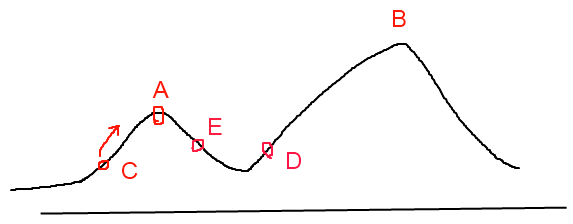

## 启发式优化方法

> A **heuristic** is the art and science of discovery and invention. The word comes from the same Greek root as "eureka" meaning "to find". A heuristic for a given problem is a way of directing your attention fruitfully to a solution. It is different from an algorithm in that a heuristic merely serves as a rule-of-thumb or guideline, as opposed to an invariant procedure. Heuristics may not always achieve the desired outcome, but can be extremely valuable to problem-solving processes. Good heuristics can dramatically reduce the time required to solve a problem by eliminating the need to consider unlikely possibilities or irrelevant states. As such, it is particularly useful to those in the process of discovery and the are constantly rethinking their strategies in the face of a stubborn unknown.

启发式方法[^3]指人在解决问题时所采取的一种根据经验规则进行发现的方法。其特点是在解决问题时,利用过去的经验,选择已经行之有效的方法，而不是系统地、以确定的步骤去寻求答案。启发式优化方法种类繁多，包括经典的模拟退火方法[^2]、遗传算法[^2]、蚁群算法以及粒子群算法等等。还有一种特殊的优化算法被称之`多目标优化算法`，它主要针对同时优化多个目标（两个及两个以上）的优化问题，这方面比较经典的算法有NSGAII算法[^5]、MOEA/D算法以及人工免疫算法等。

**经典例子： 驾驶汽车到某人家**

算法实现步骤：沿167 号高速公路往南行至Puyallup；从South Hill Mall 出口出来后往山上开4.5 英里；在一个杂物店旁边的红绿灯路口右转，接着在第一个路口左转；从左边褐色大房子的车道进去，就是North Cedar 路714 号。

启发式方法步骤：找出上一次我们寄给你的信，照着信上面的寄出地址开车到这个镇；到了之后你问一下我们的房子在哪里。这里每个人都认识我们——肯定有人会很愿意帮助你的；如果你找不到人，那就找个公共电话亭给我们打电话，我们会出来接你。

算法和启发式方法之间的差别在于其距离最终解决办法的间接程度：算法直接给你解决问题的指导，而启发式方法则告诉你该如何发现这些指导信息，或者至少到哪里去寻找它们。`启发式算法的难点`是建立符合实际问题的一系列启发式规则。`启发式算法的优点`在于它比盲目型的搜索法要高效，一个经过仔细设计的启发函数，往往在很快的时间内就可得到一个搜索问题的最优解，对于NP问题，亦可在多项式时间内得到一个较优解

### 1. 模拟退火算法（Simulated Annealing, SA）

模拟退火算法[^9]的思想借鉴于物体逐渐降温的物理现象。当物理温度很高的时候，内能比较大，固体的内部粒子处于快速无序运动；当温度慢慢降低的过程中，物体的内能减小，粒子的慢慢趋于有序，此时液体开始冷凝与结晶；最终在常温状态时达到基态，物体内能达到最小，粒子最为稳定。

模拟退火算法是基于`蒙特卡洛(Metropolis)`思想设计的近似求解最优化问题的方法。如果降温过程太快，会导致不是最低能态的非晶形。而缓缓降温使得物体中的分子有足够的时间安顿位置，逐渐达到最低能态，系统最安稳。

**模拟退火算法与贪婪算法**

例如爬山法[^7]是一种贪婪的方法，对于一个优化问题，其求解过程如下图所示

其目标是要找到函数的最大值，若初始化时，初始点的位置在C处，则会寻找到附近的局部最大值A点处，由于A点出是一个局部最大值点，故对于爬山法来讲，该算法无法跳出局部最大值点。若初始点选择在D处，根据爬山法，则会找到全部最大值点B。这一点也说明了这样基于贪婪的爬山法是否能够取得全局最优解与初始值的选取由很大的关系。

而模拟退火算法在搜索过程中引入了随机因素，模拟退火算法会以一定概率接受一个比当前解要差的解，而这个解有可能跳出这个局部最优而达到全局最优解。例如当前解为A，若接收解D继续搜索则会得到一个全局最优解。

**蒙特卡洛准则** 

根据`蒙特卡洛`观察，粒子在温度T时区域平衡的概率为$e^{- \frac{E_{new} - E_{old}}{(kT)}}$ ，其中E为温度T时的内能，$E_{new} - E_{old}$ 为内能改变量，k为$Boltzman$ 常数，则`蒙特卡洛准则`表示为
$$
P = 
\begin{cases}
1 \qquad \qquad  \qquad if E_{new} \lt E_{old} \\
e^{- \frac{E(x_{new}) -  E(x_{old})}{kT}} \quad if E_{new} \ge E_{old}
\end{cases}
$$
在温度为T时，由当前状态old产生新状态new，两者的能量分别为$E_{old}、E_{new}$ 

1. 若$E_{new} \lt E_{old}$ ，则接受新状态，否则计算概率；

2. 出现的能量差为$\triangle E = E_{new} - E_{old}$ 的降温概率为$P(\triangle E)$ ，则有
   $$
   P(\triangle E) = e^{- \frac{\triangle E}{k T}}，k为常数，\triangle E = E_{new} - E_{old} \ge0
   $$
   若P(∆E)大于[0,1]区间内的随机数。则仍旧接受新状态new为当前状态；若不成立则保留old为当前状态，当中k为玻尔兹曼常数。T为系统温度。

   此时，P和T正相关。由于$\triangle E \ge 0$ ，因此$ - \frac{\triangle E}{kT} < 0$ ，所以$P(\triangle E )$的函数取值范围是[0,1] 。随着温度T的降低，$P(\triangle E )$会逐渐降低。公式的含义：温度越高，出现一次能量差为$\triangle E$ 的降温的概率就越大；温度越低，则出现降温的概率就越小。

**基于模拟退火算法求解组合优化**

我们将一次向较差解的移动看做一次`温度跳变`过程，我们以概率$P(\triangle E )$来接受这样的移动。也就是说，在用模拟退火模拟组合优化问题时，将内能E模拟为目标函数值 *f*，温度T演化成控制参数 *t*，即得到解组合优化问题的模拟退火演算法：由初始解 *i* 和控制参数初值 *t* 开始，对当前解重复“产生新解→计算目标函数差→接受或丢弃”的迭代，并逐步衰减 *t* 值，算法终止时的当前解即为所得近似最优解，这是基于蒙特卡罗迭代求解法的一种启发式随机搜索过程。退火过程由冷却进度表(Cooling Schedule)控制，包括控制参数的初值 *t* 及其衰减因子Δ*t* 、每个 *t* 值时的迭代次数L和停止条件S。

- 若$f(y_{i+1}) \lt f(y_{i})$  ，即移动后得到更优解，则总是接受该移动；
- 若$f(y_{i+1}) \ge f(y_{i})$  ，即移动后的解比当前解要差，则以一定的概率接受移动，而且这个概率随着时间推移逐渐降低（逐渐降低才能趋向稳定）相当于上图中，从B移向BC之间的小波峰时，每次右移（即接受一个更糟糕值）的概率在逐渐降低。如果这个坡特别长，那么很有可能最终我们并不会翻过这个坡。如果它不太长，这很有可能会翻过它，这取决于衰减 *t* 值的设定。

**算法流程** 

模拟退火算法从某一较高的温度出发，这个温度称为初始温度，伴随着温度参数的不断下降，算法中的解趋于稳定，但是，可能这样的稳定解是一个局部最优解，此时，模拟退火算法中会以一定的概率跳出这样的局部最优解，以寻找目标函数的全局最优解。如上图中所示，若此时寻找到了A点处的解，模拟退火算法会以一定的概率跳出这个解，如跳到了D点重新寻找，这样在一定程度上增加了寻找到全局最优解的可能性。

**随机模拟退火算法** 

**确定模拟退火算法** 

**例子：求解函数最小值** 

$$
f(x) = 6x^7 + 8x^6 + 7x^3 + 5x^2 -xy \\
s.t. \quad 0 \le x \le 100 \\
对于\forall y，求f(x)的最小值。
$$

---

[^1]: http://www.cnblogs.com/maybe2030/p/4665837.html
[^2]: [数学模型--现代优化算法（启发式算法）](http://blog.csdn.net/qq_34861102/article/details/77103062)
[^3]: [什么是启发式（heuristic）?](https://www.cnblogs.com/sddai/p/5644011.html)
[^4]: [启发式搜索算法: A*](http://blog.csdn.net/yangdelong/article/details/1572030)
[^5]: [进化算法](http://www.cnblogs.com/maybe2030/p/4665837.html)
[^6]: [模拟退火法、神经网络、遗传算法](http://blog.csdn.net/qq_34861102/article/details/77806124)
[^7]: [优化算法-模拟退化算法](http://blog.csdn.net/google19890102/article/details/45395257)
[^8]: [模式识别：模拟退火算法的设计与实现](http://www.cnblogs.com/lytwajue/p/7196445.html)
[^9]: [模拟退火算法](http://www.cnblogs.com/ranjiewen/p/6084052.html)

