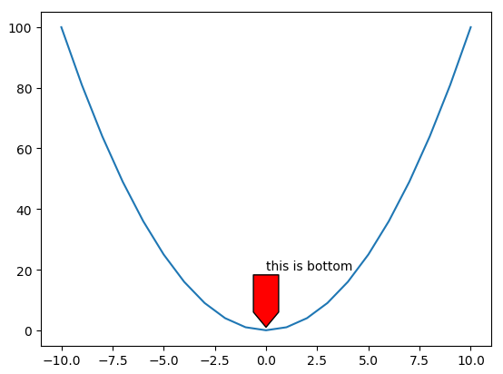
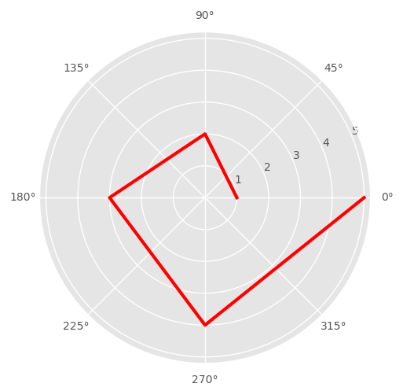

# 第一章 Matplotlib核心概念及原理

## 1、Maplotlib核心概念

matplotlib是基于Python语言的开源项目，旨在为Python提供一个数据绘图包。实际上，matplotlib的对象体系严谨而有趣，为使用者提供了巨大的发挥空间。用户在熟悉了核心对象之后，可以轻易的定制图像。matplotlib的对象体系也是计算机图形学的一个优秀范例。matplotlib使用numpy进行数组运算，并调用一系列其他的Python库来实现硬件交互。matplotlib的核心是一套由对象构成的绘图API。

**函数式绘图 VS OOP方式绘图**

matplotlib是受MATLAB的启发构建的。MATLAB是数据绘图领域广泛使用的语言和工具。MATLAB语言是面向过程的。利用函数的调用，MATLAB中可以轻松的利用一行命令来绘制直线，然后再用一系列的函数调整结果。matplotlib有一套完全仿照MATLAB的函数形式的绘图接口，在matplotlib.pyplot模块中。这套函数接口方便MATLAB用户过度到matplotlib包。函数编程的缺点如下：

-  增加了一层“函数”调用，降低了效率；
-  隶属关系被函数掩盖，整个matplotlib包是由一系列有组织有隶属关系的对象构成的。函数掩盖了原有的隶属关系，将事情变得复杂；
-  细节被函数掩盖，pyplot并不能完全复制对象体系的所有功能，图像的许多细节调中最终还要回到对象；
-  每件事情都可以有至少两种方式完成，用户很容易混淆；

因此对于开发者来对为了能够更好的利用matplotlib的优势和性能，采用OOP方式进行绘图就更加必要了。使用matplotlib进行OOP绘图的例子如下

```python
from matplotlib.figure import Figure
from matplotlib.backends.backend_agg import FigureCanvasAgg as FigureCanvas

fig = Figure()
canvas= FigureCanvas(fig)
ax= fig.add_axes([.1, .1, .8, .8])

line = ax.plot([0,1], [0,1])
ax.set_title('straight line')
ax.set_xlabel('x value')
ax.set_ylabel('y value')

canvas.print_figure('demo.jpg', dpi=400)
```

**图形对象** 

在Matplotlib中`整个图像`为一个`Figure` 对象，在Figure对象中可以包含一个或者多个`Axes` 对象，每个Axes对象都是一个拥有自己坐标系统的的`绘图区域` 。可以将Figure理解为一个窗口，而而Axes才是真正的图。那么一个坐标系统Axes包含哪些内容呢，如下图所示：


其中Title为图的标题，Axis为坐标轴（x坐标、y坐标），Axis Label为坐标轴标注（x坐标、y坐标），Tick为刻度线（x坐标、y坐标），Tick Label为刻度注释。隶属关系如下图所示：

``` 
                    figure
                      ||
                     Axes
                      ||
        ################################ 
        ||        ||       ||         ||
       xaxis     yaxis    title      data
        ||        ||
      #######   #######
      ||   ||   ||   ||
     tick label label tick
      ||               ||
   tick label        tick label  
```

data是数据绘图的关键部分，也就是数据本身的图形化显示，但是必须和xaxis, yaxis, title一起，才能真正构成一个绘图区域axes。一个单纯的，无法读出刻度的线是没有意义的。xaxis, yaxis, title合起来构成了数据的辅助部分（data guide）。上面的每个对象，无论是Line2D, Text还是Figure，它们都来自于一个叫做`Artist的基类`

Artists分为简单类型和容器类型两种。简单类型的Artists为标准的绘图元件，例如Line2D、 Rectangle、 Text、AxesImage 等等。而容器类型则可以包含许多简单类型的Artists，使它们组织成一个整体，例如Axis、 Axes、Figure等。Artist处理所有的高层结构，例如处理图表、文字和曲线等的绘制和布局。通常我们只和Artist打交道，而不需要关心底层的绘制细节。直接使用Artists创建图表的标准流程如下:

1. 创建Figure对象；
2. 用Figure对象创建一个或者多个轴Axes或者子图Subplot对象（add_axes, add_subplots）；
3. 调用Axis等对象的方法创建各种简单的类型的Artist实例；
4. 调用Canvas实现画图或者输出保存；

`Canvas` 对象代表真正进行绘图的后端（bakend），`Artist` 只是在程序逻辑上的绘图，它必须连接后端绘图程序才能真正在屏幕上绘制出来或保存为文件。`可以将Canvas理解为绘图的物理（硬件）实现` 。在面向对象语言中，可以很容易找到上面的相应对象，例如：Figure.axes[0].xaxis就能找到x轴的坐标对象。因此可以看出一个Figure实例就是一张完整图形。对于每一个`Artist实例都有一个findobj()方法` 来显示该对象所包含的所有下层对象。

**坐标**  

坐标是计算机绘图的基础。计算机屏幕是由一个个像素点构成的。想要在屏幕上显示图像，计算机必须告诉屏幕每个像素点上显示什么。所以，最贴近硬件的坐标体系是以像素为单位的坐标体系。我们可以通过具体说明像素位置来标明显示器上的某一点。这叫做``显示坐标(display coordinate)``，以像素为单位。然而，像素坐标不容易被纳入绘图逻辑。相同的程序，在不同的显示器上就要调整像素值，以保证图像不变形。所以一般情况下，还会有``图像坐标``和``数据坐标``。

``图像坐标``将一张图的左下角视为原点，将图像的x方向和y方向总长度都看做1。x方向的0.2就是指20%的图像在x方向的总长，y方向0.8的长度指80%的y方向总长。(0.5, 0.5)是图像的中点，(1, 1)指图像的右上角。比如下面的程序，我们在使用``add_axes``时，传递的参数中，前两个元素为axes的左下角在``figure图像坐标``上的位置，后两个元素指axes在fig的图像坐标上x方向和y方向的长度。fig的图像坐标称为``Figure坐标``，储存在变量``fig.transFigure`` 中。

类似的，每个Axes，比如ax1，有属于自己的图像坐标。它以ax1绘图区域总长作为1，称为``Axes坐标`` ，存储在变量``ax1.transAxes`` 中。(0.5, 0.5)就表示在Axes的中心。Axes坐标和Figure坐标原理相似，只是所用的基准区域不同。

如果绘制的是具体数据，那么数据坐标符合我们的需求。如果绘制的是标题这样的附加信息，那么Axes坐标符合符合我们的需求。如果是整个图像的注解，那么Figure坐标更符合需求。``每一个Artist对象都有一个transform属性，用于查询和改变所使用的坐标系统``。如果为显示坐标，transform属性为None。

```python
from matplotlib.figure import Figure
from matplotlib.backends.backend_agg import FigureCanvasAgg as FigureCanvas

fig    = Figure()
canvas = FigureCanvas(fig)

# first axes
#add_axes 前两个元素为axes的左下角在figure图像坐标上的位置
#         后两个元素指axes在fig的图像坐标上x方向和y方向的长度
ax1    = fig.add_axes([0.1, 0.1, 0.2, 0.2])
line,  = ax1.plot([0,1], [0,1])
ax1.set_title("ax1")

# second axes
ax2    = fig.add_axes([0.4, 0.3, 0.4, 0.5])
sca    = ax2.scatter([1,3,5],[2,1,2])
ax2.set_title("ax2")

canvas.print_figure('demo.jpg')
```


## 2、matplotlib库

### 2.1. matplotlib库的安装

seaborn也是一种画图的库

```
pip install -U matplotlib
```

### 2.2 可视化理论  

> 知道画什么，比知道怎么画更重要！！！可视化是一种很严肃的事情，和机器学习是一样重要！！
>
> 可视化不是锦上添花，而是一种工具，通过可视的形式进行人机交互的行为，从而进行数据分析的一个有效工具。

可视化什么东西？做可视化之前需要清楚要解决什么问题？可视化不是锦上添花，而是一种工具，通过可视的形式进行人机交互的行为，从而进行数据分析的一个有效工具。==有很多事，机器不是很擅长，尤其是视觉，让人来干人擅长的，机器干机器擅长的事情，这种结合是可视化的根本所在。== 可视化是一个有效的数据分析方法。

> 可视化的原则：KISS(Keep It Simple Stupid)；尽量不要用3D（没法交互，有数据冗余）；

图的长度若是出现了，它们的比例就必须准确，WRONG SCALE是常出现的问题，可以通过log取对数或者缩小图的比例，但是不能出现比例错。

#### 2.2.1 可视化理论

> The Purpose of Data Visualization is to Convey Information to People.     ---- Pat Haranhan, Stanford


可视化的设计原则，也成为编码方式（Visual Encoding）

- 位置
- 大小，图元素大小
- 纹理
- 颜色，颜色的深浅
- 方向，用于表示梯度，例如：磁场的可视化；
- 形状，

对于二维图使用位置进行编码，例如年龄和身高，若有第三个维度年薪，可以利用第三个维度（点大小、颜色深浅）进行编码

一些可视化的场景

- 文本可视化：字云（Word Cloud，用字的大小表示字出现的频率），Theme Flow（按照时间维度），Sentiment Visualization（情感可视化，输入一句话，给这句话打分0~1，越小表示消极，越高表示积极，可用颜色的深浅表示这种积极或消极颜色图）
- 时序数据可视化：与时间有关，以时间为维度画图，例如：金融数据
- 高维数据可视化：除了降维、聚类，==平行坐标==能够处理任何维度的数据并将其可视化。笛卡尔坐标系中只有两个坐标，现在可以将x轴画成平行的做干个坐标(x1, x2, x3, ...)，那么由这n个x轴上的对应点连接起来的一条线即为对应的一条高维度数据。
- 机器学习相关可视化
- 社交网络图可视化
- 科学可视化，高性能计算中用的到，例如：台风、云的移动如何渲染，通过高性能计算就可以完成。
- 交互，可视化产品可以给不同的人有不同的交互，不同的人从中可以读到不同的内容。

[d3js](https://d3js.org/)中提供了很多可视化图形的layout，很有启发意义。

##3、Matplotlib基本元素

###3.1 颜色和样式

**颜色** 

1. 八种內建颜色

   | 颜色缩写 | 说明  | 颜色缩写 | 说明    |
   | -------- | ----- | -------- | ------- |
   | b        | blue  | m        | magenta |
   | g        | green | y        | yellow  |
   | r        | red   | k        | black   |
   | c        | cyan  | w        | white   |

2. 灰色阴影，color='0.5'，表示用灰度画图，大小表示颜色深浅；

3. 十六进制，color='#FF00FF'

4. RGB元组，color=(0.1, 0.2, 0.3)，

**点和线样式**

当只指定style时$plt.plot(y, 'D')$，只显示点，不会显示线。而若使用marker指定样式$plt.plot(y, marker='D')$时，会在线上显示指定的样式。

| 线型       | 说明                   | 线型            | 说明                            |
| ---------- | ---------------------- | --------------- | ------------------------------- |
| -          | solid line、实线       | --              | dashed line、虚线               |
| -.         | dash-dot line、点划线  | :               | dotted line、点线               |
| 样式       | 说明                   | 样式            | 说明                            |
| .          | point marker           | ,               | pixel marker                    |
| v\|^\|<\|> | （倒\|下\|左\|右）三角 | o、s、p、H、1-4 | 圆、长方形、五角型、六角形、tri |
| *、+ 、x   | 星、加号               | x、D、d、\|、_  | 叉标记、钻石标记、竖线、横线    |

**样式字符创** ：将颜色、点型、线形写成一个字符创。例如：'cx--'、'mo:'、'kp-'

###3.2 pyplot和面向对象画图函数

pyplot简单易用，交互使用时，可以根据命令实时作图，但底层定制能力不足。面向对象方式，接近Matplotlib基础和底层的方式，定制能力强而且是Matplotlib的精髓。

####3.2.1**子图subplot** 

```python
import matplotlib.pyplot as plt
# 创建Figure实例，即创建画布
fig = plt.figure() 

# 在fig上添加子图
# 参数：子图总行数、子图总列数、子图位置(初始位置为1)
# 返回Axes实例
ax = fig.add_subplot(111)
ax.plot(x,y)
```

####3.2.2**多图figure** 

subplot是在一个画布中产生多个子图，而多图在多个画布上创建图。

```python
import matplotlib.pyplot as plt
# 创建Figure实例，即创建画布
fig1 = plt.figure() 
ax11 = fig1.add_subplot(111)
ax11.plot(x,y)

fig2 = plt.figure() 
ax21 = fig1.add_subplot(111)
ax21.plot(x,y)
```

####3.2.3**网格：grid** 

网格作为整张图的背景，方便对图进行观察

```python
import matplotlib.pyplot as plt
# 方式1
x, y = [1,2,3,4,5], [2,4,6,6,10]
plt.plot(x,y)
plt.grid(True, color='r',linewidth='2', linestyle='--')

# 方式2 面向对象方式，不会上面那样实时效果，即不能修改并立即生效设置
fig = plt.figure()
ax = fig.add_subplot(111)
ax.grid(color='r',linewidth='2', linestyle='--')
```

####3.2.4**图例：legend**

```python
import matplotlib.pyplot as plt
#方式1 pyploy方式
x, y = [1,2,3,4,5], [2,4,6,6,10]
plt.plot(x,y,label='Normal')
plt.plot(x,y,label='fast')
# loc：图例位置，[1,2,3,4]对应右上角、左上角、左下角、右下角
# ncol: 图例有几列，当图例过多时可以分列
plt.legend(loc='1', ncol=1)
# plt.plot(x,y)
# plt.plot(x,y)
# plt.legend(['Normal', 'Fast'], loc='1', ncol=1)

#方式2 面向对象方式
fig = plt.figure()
ax = fig.add_subplot(111)
l, = ax.plot(x,x)
ax.legend(['Normal'])

#l.set_label('Normal')
#ax.legend()
```

####3.2.5**坐标轴的范围：axis、xlim、ylim** 

```python
#方式 1
# 返回坐标范围
x_min, x_max, y_min, y_max = plt.axis()
# 设置坐标范围
plt.axis([-5, 5, 6, 60])

#方式2
x_min, y_max=plt.xlim()
y_min, y_max=plt.ylim()
plt.xlim([-5,5]) = plt.xlim(xmin=-5, xmax=5)
plt.ylim([6,60]) = plt.xlim(ymin= 6, ymax=60)
```

####3.2.6**坐标轴刻度：locator_params** 

```python
"""
面向对象方式
"""
plt.plot(x,x)
# 获取当前的坐标轴
ax = plt.gca（）
# 设置x、y轴刻度数
ax.locator_params(nbins=20)
# 只调整x轴或y轴的刻度密度
ax.locator_params('x', nbins=15)
ax.locator_params('y', nbins=10)

"""
日期刻度的调整
"""
import matplotlib as mpl
import matplotlib.pyplot as plt
import datetime
import numpy
start , stop = datetime.datetime(2018,3,1), datetime.datetime(2019,3,1)
delta = datetime.timedelta(days=1)

dates= mpl.dates.drange(start, stop, delta)
y = np.random.rand(len(dates))
fig = plt.figure()
ax = fig.add_subplot(111)
ax.plot_date(dates, y, linestyle='-', marker='o')

# 调整时间显示格式
dfmt = mpl.dates.DateFormatter('%Y-%m')
ax.xaxis.set_major_formatter(dfmt)

# 日期刻度显示重合，自适应调整日期刻度
fig.autofmt_xdate()
plt.show()
```

####3.2.7**添加坐标轴：twinx、twiny** 

```python
"""
方式1
"""
x = np.arange(2, 20, 1)
y1 = x * x
y2 = np.exp(x)
# 双坐标轴

plt.plot(x, y1)
plt.twinx()
plt.plot(x, y2, 'r')
plt.show()

"""
方式2: 面向对象方式
"""
fig = plt.figure()
ax1 = fig.add_subplot(111)
ax1.plot(x, y1)
ax1.set_ylabel('Y1')

ax2 = ax1.twinx()
ax2.set_ylabel('Y2')
ax2.plot(x, y2, 'r')

ax1.set_xlabel('Compare Y1 and Y2')
plt.show()
```

####3.2.8**注释：annotate** 

```python
x = np.arange(-10, 11, 1)
y = x * x
plt.plot(x, y)
# xy：要注释的点
# xytext：注释文本的起始坐标
# arrowprops：定义注释的形状
plt.annotate("this is bottom", xy=(0, 1), xytext=(0,20), 
            arrowprops=dict(
            	facecolor='r', # 箭头的颜色
                frac=.2, # 箭头占长度的百分比
                headwidth=20, # 箭头的宽度
                width=20, #箭身的宽度
            ))

plt.show()
```



####3.2.9**文字：text**

```python
x = np.arange(-10, 11, 1)
y = x * x
plt.plot(x, y)
# 参数：x坐标、y坐标、文字
# style= normal、italic
# weight=[0-1000]
# size：字体大小
# color：字体颜色
# family：设置字体
# bbox：将文字圈起来
plt.text(0, 10, r'$function:y=x^2$', family='fantasy', 
         weight=500, bbox=dict(
         	facecolor='r',
            alpha=0.4
         ))
plt.show()
```

####3.2.10**区域填充：fill、fill_between** 

```python
x = np.linspace(0, 5 * np.pi, 1000)
y1 = np.sin(x)
y2 = np.sin(2*x)

#添加透明度后，重复的颜色会加深
plt.plot(x, y1)
plt.fill(x, y1, 'b', alpha=.4)
plt.plot(x, y2)
plt.fill(x, y2, 'r', alpha=.4)
plt.show()

"""
面向对象方式
"""
fig = plt.figure()
ax = fig.add_subplot(111)
ax.plot(x, y1, 'b-', x, y2, 'r--')
#ax.fill_between(x, y1, y2, facecolor='blue', alpha=.4)
# interpoloate=True，采用插值对空白处填充颜色，对于离散点有的地方是没有y值，这些区域默认不填充。
ax.fill_between(x, y1, y2, where=y1>=y2, facecolor='blue', alpha=.4,interpoloate=True)
ax.fill_between(x, y1, y2, where=y1<y2, facecolor='yellow', alpha=.4, interpoloate=True)
plt.show()
```

####3.2.11**形状：patches** 

```python
import matplotlib.patches as mpatches

fig, ax = plt.subplots()

xy1 = np.array([0.2, 0.2])
# 圆心位置、半径
circle = mpatches.Circle(xy1, 0.2)
ax.add_patch(circle)

#长方形左下角位置
xy2 = np.array([0.2, 0.8])
# 左下角位置、宽、高
rect = mpatches.Rectangle(xy2, .2, .1)
ax.add_patch(rect)

#多边形
xy3 = np.array([0.8, 0.2])
# 中心位置、边数、半径
polygon = mpatches.RegularPolygon(xy3, 5, 0.1, color='g')
ax.add_patch(polygon)

# 椭圆
xy4=np.array([.8, .8])
#圆心、长直径、短直径
ellipse = mpatches.Ellipse(xy4, .4, .2, color='y')
ax.add_patch(ellipse)

# x、y轴比例相等
plt.axis('equal')
plt.show()
```

####3.2.12**样式：plt.style.use** 

```python
"""
Matplotlib中提供了美化的方法
"""
# 所有可用样式
plt.style.available 
plt.style.use('ggplot')

fig, axes = plt.subplots(ncols=2, nrows=2)
ax1, ax2, ax3, ax4 = axes.ravel()

x, y = np.random.normal(size=(2, 100))
ax1.plot(x, y, 'o')

# matplotlib默认的颜色循环数
x = np.arange(10)
y = np.arange(10)
ncolors = len(plt.rcParams['axes.color_cycle'])
shift = np.linspace(0, 10, ncolors)
for s in shift:
    ax2.plot(x, y+s, '-')

x = np.arange(5)
y1, y2, y3 = np.random.randint(1, 25, size=(3,5))
width=.25
ax3.bar(x, y1, width)
ax3.bar(x +width, y2, width, color=plt.rcParams['axes.color_cycle'][1])
ax3.bar(x + 2 * width, y3, width, color=plt.rcParams['axes.color_cycle'][2])

for i, color in enumerate(plt.rcParams['axes.color_cycle']):
    xy = np.random.normal(size=2)
    ax4.add_patch(plt.Circle(xy, radius=.3, color=color))
ax4.axis('equal')
plt.show()

```

####3.2.13**极坐标** 

```python
# 坐标
r = np.arange(1, 6, 1)
theta = [0,np.pi / 2, np.pi, np.pi * 3 / 2, np.pi * 2]

ax = plt.subplot(111, projection='polar')
ax.plot(theta, r, color='r', linewidth=3)
ax.grid(True)
plt.show()
```




## 4、Matplotlib函数式API的使用

```python
# -*- coding: utf-8 -*-
from __future__ import division
from numpy.random import randn
import numpy as np
import os
import matplotlib.pyplot as plt
np.random.seed(12345)
plt.rc('figure', figsize=(10, 6))
from pandas import Series, DataFrame
import pandas as pd
np.set_printoptions(precision=4)

get_ipython().magic(u'matplotlib inline')
get_ipython().magic(u'pwd')

#####matplotlib创建图表
plt.plot([1,2,3,2,3,2,2,1])
plt.show()

plt.plot([4,3,2,1],[1,2,3,4])
plt.show()

#更多简单的图形
x = [1,2,3,4]
y = [5,4,3,2]

plt.figure()

plt.subplot(2,3,1)
plt.plot(x, y)

plt.subplot(232)
plt.bar(x, y)

plt.subplot(233)
plt.barh(x, y)

plt.subplot(234)
plt.bar(x, y)
y1 = [7,8,5,3]
plt.bar(x, y1, bottom=y, color = 'r')

plt.subplot(235)
plt.boxplot(x)

plt.subplot(236)
plt.scatter(x,y)

plt.show()


#####figure与subplot
#figure对象
fig = plt.figure()

ax1 = fig.add_subplot(2, 2, 1)
ax2 = fig.add_subplot(2, 2, 2)
ax3 = fig.add_subplot(2, 2, 3)
plt.show()

from numpy.random import randn
plt.plot(randn(50).cumsum(), 'k--')
fig.show()

#创建figure同时创建指定数目的subplot
#axes为subplots对象ndarray数组，例如：axes[0,1]为第二张图
fig, axes = plt.subplots(2, 3)
axes[1,0].plot(range(10), randn(10),'b--')

#调整subplot周围的间距
#wspace、hspace调整plots之间的距离
plt.subplots_adjust(left=None, bottom=None, right=None, top=None,
                wspace=None, hspace=None)
#
#subplots(nrows, ncols, sharex, sharey, **fig_kw)
#指定要创建的图像的行数和列数，
#sharex|y表示所有子图是否共享x或y轴
#创建一个figure和一组subplots
fig, axes = plt.subplots(2, 2, sharex=True, sharey=True)
for i in range(2):
    for j in range(2):
        axes[i, j].hist(randn(500), bins=50, color='k', alpha=0.5)
plt.subplots_adjust(wspace=0, hspace=0)

#####matplotlib基本设置
#颜色、标记和线型
plt.figure()
plt.plot(x,y,linestyle='--',color='g')
plt.plot(randn(30).cumsum(), 'ko--')
plt.plot(randn(30).cumsum(),color='k',linestyle='dashed',marker='o')
plt.close('all')

data = randn(30).cumsum()
plt.plot(data, 'k--', label='Default')
plt.plot(data, 'k-', drawstyle='steps-post', label='steps-post')
plt.legend(loc='best')

#设置标题、轴标签、刻度以及刻度标签
fig = plt.figure(); 
ax = fig.add_subplot(1, 1, 1)
ax.plot(randn(1000).cumsum())
#设置子图的x轴刻度
ticks = ax.set_xticks([0, 250, 500, 750, 1000])
#设置子图x轴刻度对应的标签
labels = ax.set_xticklabels(['one', 'two', 'three', 'four', 'five'],
                            rotation=30, fontsize='small')
#设置子图的标题
ax.set_title('My first matplotlib plot')
#设置子图x轴坐标的名称
ax.set_xlabel('Stages')

#添加图例，方法1：通过label标识图例
fig = plt.figure(); ax = fig.add_subplot(1, 1, 1)
ax.plot(randn(1000).cumsum(), 'k', label='one')
ax.plot(randn(1000).cumsum(), 'k--', label='two')
ax.plot(randn(1000).cumsum(), 'k.', label='three')
ax.legend(loc='best')

#注释以及在subplot上绘图
from datetime import datetime
fig = plt.figure()
ax = fig.add_subplot(1, 1, 1)

data = pd.read_csv('d:/data/spx.csv', index_col=0, parse_dates=True)
spx = data['SPX']
spx.plot(ax=ax, style='k-')

#对于峰值数据添加注释
crisis_data = [
    (datetime(2007, 10, 11), 'Peak of bull market'),
    (datetime(2008, 3, 12), 'Bear Stearns Fails'),
    (datetime(2008, 9, 15), 'Lehman Bankruptcy')
]

for date, label in crisis_data:
    #Annotate the point xy with text
    ax.annotate(label, xy=(date, spx.asof(date) + 50),
                xytext=(date, spx.asof(date) + 200),
                arrowprops=dict(facecolor='black'),
                horizontalalignment='left', verticalalignment='top')

ax.set_xlim(['1/1/2007', '1/1/2011'])
ax.set_ylim([600, 1800])

ax.set_title('Important dates in 2008-2009 financial crisis')

fig = plt.figure()
ax = fig.add_subplot(1, 1, 1)

rect = plt.Rectangle((0.2, 0.75), 0.4, 0.15, color='k', alpha=0.3)
circ = plt.Circle((0.7, 0.2), 0.15, color='b', alpha=0.3)
pgon = plt.Polygon([[0.15, 0.15], [0.35, 0.4], [0.2, 0.6]],
                   color='g', alpha=0.5)
ax.add_patch(rect)
ax.add_patch(circ)
ax.add_patch(pgon)


#图表的保存
fig.savefig('figpath.svg')
#dpi：每英寸的点数，分辨率
#bbox_inches是否有边框
fig.savefig('figpath.png', dpi=400, bbox_inches='tight')

from io import BytesIO
buffer = BytesIO()
plt.savefig(buffer)
plot_data = buffer.getvalue()

#matplotlib配置
plt.rc('figure', figsize=(10, 10))
font_options={'family':'monospace',
              'weight':'bold','size':'small'}
plt.rc('font',**font_options)

#####pandas中的绘图函数

#线图
s = Series(np.random.randn(10).cumsum(), index=np.arange(0, 100, 10))
s.plot()
df = DataFrame(np.random.randn(10, 4).cumsum(0),
               columns=['A', 'B', 'C', 'D'],
               index=np.arange(0, 100, 10))
df.plot()
#展示图形
plt.show()

#柱形图
fig, axes = plt.subplots(2, 1)
data = Series(np.random.rand(16), index=list('abcdefghijklmnop'))
data.plot(kind='bar', ax=axes[0], color='k', alpha=0.7)
data.plot(kind='barh', ax=axes[1], color='k', alpha=0.7)

df = DataFrame(np.random.rand(6, 4),
               index=['one', 'two', 'three', 'four', 'five', 'six'],
               columns=pd.Index(['A', 'B', 'C', 'D'], name='Genus'))
df.plot(kind='bar')
plt.figure()
df.plot(kind='barh', stacked=True, alpha=0.5)
```

