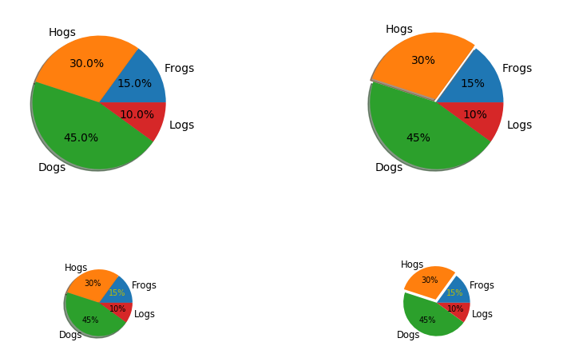

# 第二章 [Matplotlib](https://matplotlib.org/api/index.html)库的使用

##一、 [折线图](https://matplotlib.org/api/_as_gen/matplotlib.pyplot.plot.html#matplotlib.pyplot.plot)

```python
from matplotlib import pyplot as plt
from numpy.random import randn

# matplotlib.pyplot.rc(*args, **kwargs)设置默认值
plt.rc('figure', figsize=(10, 6)) #设置默认的图的宽、高

#创建一个figure对象，代表画布
fig = plt.figure()
ax1 = fig.add_subplot(2, 2, 1)
#在figure对象上添加一个subplot返回一个subplot对象
ax2 = fig.add_subplot(2, 2, 2)
ax2.hist(randn(100), bins=20, color='k',alpha=.3)
ax3 = fig.add_subplot(2, 2, 3)
fig.show()


#从正态分布中生成随机随机矩阵，random.randn(d0,d1, ...)
#ndarray.cumsum(axis=None)返回沿某一轴的累加和
#默认将矩阵伸展为数组后进行累加
#例如：a=[1,2,3] a.cumsum() = [1, 1+2, 1+2+3]
plt.plot(randn(50).cumsum(), 'k--', label='line 1')
plt.legent() # 显示小标题
plt.show()
```

**构造函数： plot(x, y, style, label, linewidth, x2, y2, style2, ...)** 

- x, x2, y ,y2 ... 表示图中对应的多组坐标， plot(y, 'g-')，x可以省略，默认只有y值，x值会用y值的个数作为坐标值。

- style表示折线的类型和颜色，常用的颜色和类型如下表所示

  | 颜色   | 说明      | 线型                     | 说明                               |
  | ---- | ------- | ---------------------- | -------------------------------- |
  | b    | blue    | -                      | solid line                       |
  | g    | green   | --                     | dashed line                      |
  | r    | red     | -.                     | dash-dot line                    |
  | c    | cyan    | :                      | dotted line                      |
  | m    | magenta | .                      | point marker                     |
  | y    | yellow  | ,                      | pixel marker                     |
  | k    | black   | o、v\|^\|<\|>、s、p、H、1-4 | 圆、（倒\|下\|左\|右）三角、长方形、五角型、六角形、tri |
  | w    | white   | *、+、x、D、d、\|、_         | 星、加号、叉标记、钻石标记、竖线、横线              |

- label表示线的legend

- linewidth表示线的粗细

**构造函数： plot_date(x, y, style, label, linewidth, x2, y2, style2, ...)** 

- 对于x轴为时间的折线图，需要使用plot_date

- 同时在numpy中加载时间数据时，需要采用如下方式进行转换

  ```python
  import matplotlib.dates as mdate
  import matplotlib.pyplot as plt
  import numpy as np
  date, open_price = np.loadtxt('1.csv', delimeter=',', converters={0:mdates.strpdate2num('%m/%d%Y')}, skiprows=1, usecols=(0,1), unpack=True)

  plt.plot_date(date, open_price, 'b-')
  plt.show()
  ```

### 1.1 范例1


```python
import numpy as np
import matplotlib.pyplot as plt

#arange(start, stop, step, dbtype=None)
t = np.arange(-1, 2, .01)
s = np.sin(2 * np.pi * t)
#画出折线图
plt.plot(t, s)
plt.axvline(x=0, ymin=0.75, linewidth=8, color='#1f77b4')
#添加水平线默认y=0的线横跨x轴范围  axhline(y=0, xmin=0, xmax=1)
plt.axhline(linewidth=8, color='#d62728')
#添加水平线y=1横跨x轴范围
plt.axhline(y=1)

#添加竖直线x=1横跨y轴范围 axvline(x=0, ymin=0, ymax=1)
plt.axvline(x=1)
#添加竖直线x=0, 指定y轴下限位0.75
plt.axvline(x=0, ymin=0.75, linewidth=8, color='#1f77b4')

#添加水平直线y=0.5，x轴范围是[0.25, 0.75]
plt.axhline(y=.5, xmin=0.25, xmax=0.75)

#添加水平或垂直长方形 axhspan|axvspan(ymin, ymax, xmin=0, xmax=1)
plt.axhspan(0.25, 0.75, facecolor='0.5', alpha=0.5)
plt.axvspan(1.25, 1.55, facecolor='#2ca02c', alpha=0.5)
#指定 [xmin, xmax, ymin, ymax]
plt.axis([-1, 2, -1, 2])
plt.show()
```

### 1.2 范例2


```python
import numpy as np
import matplotlib.pyplot as plt
# useful for `logit` scale
from matplotlib.ticker import NullFormatter

np.random.seed(19680801)

#normal(loc=0.0, scale=1.0, size=None)
#loc: center of distribution
#scale: width of distribution
y = np.random.normal(loc=0.5, scale=0.4, size=1000)
y = y[(y > 0) & (y < 1)]
y.sort()
x = np.arange(len(y))

#plot with various axes scales, figure(num)
plt.figure(1)

#线型曲线
#subplot(nrows, ncols, index)
#subplot(221) = subplot(2, 2, 1)
plt.subplot(221)
plt.plot(x, y)
#设置y轴显示坐标时的格式：linear、log、symlog、logit
plt.yscale('linear')
plt.title('linear')
plt.grid(True)

#log
plt.subplot(222)
plt.plot(x, y)
plt.yscale('log')
plt.title('log')
plt.grid(True)

#symmetric log
plt.subplot(223)
plt.plot(x, y - y.mean())
plt.title('symlog')
plt.grid(True)

#logit
plt.subplot(224)
plt.plot(x, y)
plt.yscale('logit')
plt.title('logit')
plt.grid(True)

# Format the minor tick labels of the y-axis into empty strings with
# `NullFormatter`, to avoid cumbering the axis with too many labels.
plt.gca().yaxis.set_minor_formatter(NullFormatter())
# Adjust the subplot layout, because the logit one may take more space
# than usual, due to y-tick labels like "1 - 10^{-3}"
plt.subplots_adjust(top=0.92, bottom=0.08, left=0.10, right=0.95, hspace=0.25,
                    wspace=0.35)
plt.show()
```

### 1.3 范例3


```python
import numpy as np
import matplotlib.pyplot as plt
import matplotlib.text as text

a = np.arange(0, 3, .02)
b = np.arange(0, 3, .02)
c = np.exp(a)
d = c[::-1]

#Create a figure and a set of subplots
fig, ax = plt.subplots()
plt.plot(a, c, 'k--', a, d, 'k:', a, c+d, 'k')
plt.legend(("Model length", "Data length", "Total message length"), loc='upper center', shadow=True)
plt.ylim([-1, 20])
plt.grid(True)
plt.xlabel('Model complexity--->')
plt.ylabel('Message length--->')
plt.title('Minimum Message Length')

def func(x):
    return hasattr(x, 'set_color') and not hasattr(x, 'set_facecolor')

for o in fig.findobj(func):
    o.set_color('blue')
    
for o in fig.findobj(text.Text):
    o.set_fontstyle('italic')
plt.show()
```


## 二、散点图（scatter diagram)

**函数：scatter(x, y, s=None, c=None,marker='o', alpha=1)** ，用于观察两个变量的相关性。

- x,y：输入数据
- s：用于标注不同形状的大小，默认是s=20，表示图形面积的大小，例如若要直径扩大10倍，这里需要乘以100。可是标量或数组，默认为$rcParams['lines.markersize'] ^ 2$
- c：各部分颜色，默认为c='b'，使用RGB标颜色
- marker 散点的形状，默认为marker='o'圆形
- alpha透明度，默认为alpha=1，作用是：当透明度为0.5时，重合的图形颜色会加深。

### 2.1 范例1


```python
import numpy as np
import matplotlib.pyplot as plt

np.random.seed(20180102)
N = 50
#rand(matrix)返回指定维度的矩阵，随机数范围[0,1]
x = np.random.rand(N)
y = np.random.rand(N)
colors = np.random.rand(N)
# 0 to 15 point radii
area = np.pi * (15 * np.random.rand(N)) ** 2

plt.scatter(x, y, s=area, c=colors, alpha=0.5)
plt.show()
#------------------指定marker为显示形状-----------------------
x = np.arange(0.0, 50.0, 2.0)
y = x ** 1.3 + np.random.rand(*x.shape) * 30.0
#x.shape是一个元组
s = np.random.rand(*x.shape) * 800 + 500

plt.scatter(x, y, s, c="g", alpha=0.5, marker=r'$\clubsuit$',
            label="Luck")
plt.xlabel("Leprechauns")
plt.ylabel("Gold")
plt.legend(loc=2)
plt.show()
```

### 2.2 范例2


```python
import numpy as np
import matplotlib.pyplot as plt

np.random.seed(20180102)
N = 100
r0 = 0.6
x = 0.9 * np.random.rand(N)
y = 0.9 * np.random.rand(N)
area = np.pi * (10 * np.random.rand(N)) ** 2
colors = np.sqrt(area)
r = np.sqrt(x*x + y*y)

#masked_where(condition, a, copy=True)
#Return a as an array masked where condition is True
#a = [0, 1, 2, 3]
#ma.masked_where(a <= 2, a)
#masked_array(data = [-- -- -- 3],
#             mask = [ True  True  True False],
#             fill_value=999999)
area1 = np.ma.masked_where(r < r0, area)
area2 = np.ma.masked_where(r >= r0, area)

plt.scatter(x, y, s=area1, c=colors, marker='^')
plt.scatter(x, y, s=area2, c=colors, marker='o')

#显示不同区域的界限
theta = np.arange(0, np.pi / 2, .01)
plt.plot(r0*np.cos(theta), r0*np.sin(theta))

plt.show()
```

### 2.3 范例3


```python
import numpy as np
import matplotlib.pyplot as plt

np.random.seed(20180102)

x = np.random.rand(10)
y = np.random.rand(10)
z = np.sqrt(x**2 + y**2)

plt.subplot(321)
plt.scatter(x, y, s=80, c=z, marker='>')

plt.subplot(322)
plt.scatter(x, y, s=80, c=z, marker=(5, 0))

verts = list(zip([-1., 1., 1., -1.], [-1., 1., 1., -1.]))
plt.subplot(323)
plt.scatter(x, y, s=80, c=z, marker=(verts, 0))
#plt.scatter(x, y, s=80, c=z, marker=None, verts=verts)

plt.subplot(324)
plt.scatter(x, y, s=80, c=z, marker=(5, 1))

plt.subplot(325)
plt.scatter(x, y, s=80, c=z, marker='+')

plt.subplot(326)
plt.scatter(x, y, s=80, c=z, marker=(5, 2))

plt.show()
```

## 三、饼状图（Pie Graph）

**函数：pie(x, labels=None, colors=None, explode=None, autopct=None)**

- x：进行绘图的序列
- labels：饼图的各部分标签
- colors：饼图的各部分颜色，使用RGB标颜色
- explode：需要突出的块状序列
- autopct：饼图占比的显示格式，%.2f：保留两位小数

### 3.1 范例1



```python
import numpy as np
import matplotlib.pyplot as plt
from matplotlib.gridspec import GridSpec

labels = ['Frogs', 'Hogs', 'Dogs', 'Logs']
fracs = [15, 30, 45, 10]
explode = [0, 0.05, 0, 0]

the_grid = GridSpec(2, 2)
plt.subplot(the_grid[0,0], aspect=1)
plt.pie(fracs, labels=labels, autopct="%1.1f%%", shadow=True)

plt.subplot(the_grid[0,1], aspect=1)
plt.pie(fracs, labels=labels, explode=explode, autopct="%.0f%%", shadow=True)

plt.subplot(the_grid[1,0], aspect=1)
patches, texts, autotexts = plt.pie(fracs, labels=labels, \
                                    autopct="%.0f%%", shadow=True, \
                                   radius=0.5)

# Make the labels on the small plot easier to read.
for i in texts:
    i.set_size('smaller')
for i in autotexts:
    i.set_size('x-small')
autotexts[0].set_color('y')

plt.subplot(the_grid[1,1], aspect=1)
patches, texts, autotexts = plt.pie(fracs, explode=explode, \
                                   labels=labels, autopct="%.0f%%", \
                                   shadow=False, radius=0.5)
for t in texts:
    t.set_size('smaller')
for t in autotexts:
    t.set_size('x-small')
autotexts[0].set_color('y')

plt.show()
```

## 四、柱状图（Bar Graph）

**函数：bar(left, height, width=.8, bottom, color, align='center')    barh(bottom, width, height=.8, left, color, align='center')** ，用于表示不同类别数据的对比，通常用于小数据的展示 

- left为x轴、bottom：要显示的序列
- height：y轴的数值序列，也是柱状图的高度，一般是需要展示的数据
- width：柱形图的宽度，一般设置为1
- color：柱形图填充颜色

bar函数定义的一个长方形区域（left, right, bottom, top）为：$(x - \frac{width}{2}, x + \frac{width}{2}, bottom, bottom + height)$

barh函数定义的一个长方形区域（left, right, bottom, top）为：$(left, left + width, y - \frac{height}{2}, y + \frac{height}{2})$

```python
# 画两条并列的条形图
import matplotlib.pyplot as plt
import numpy as np 
salesA = [52,55,63,78]
salesB = [34,67,89,52]
index  = np.arange(len(salesA))
bar_width = 0.3

plt.bar(index, salesA, bar_width, color='b')
plt.bar(index+bar_width, salesB, bar_width, color='r')
plt.show()

# 画简单的层叠图
plt.bar(index, salesA, bar_width, color='b')
plt.bar(index, salesB, bar_width,bottom=salesA, color='r')
plt.show()
```

### 4.1 范例1：系统监控


```python
import time
import matplotlib.pyplot as plt
import numpy as np

def get_mem(t):
    return 100 * (0.5 + .5 * np.sin(0.5 * np.pi * t))
def get_cpu(t):
    return 100 * (0.5 + 0.5 * np.sin(0.2 * np.pi * (t - 0.25)))
def get_net(t):
    return 100 * (0.5 + 0.5 * np.sin(0.7 * np.pi * (t - 0.1)))
def get_stats(t):
    return get_mem(t), get_cpu(t), get_net(t)

fig, ax = plt.subplots()
ind = np.arange(1, 4)

#显示图形，但是不阻塞
plt.show(block=False)

pm, pc, pn = plt.bar(ind, get_stats(0))
pm.set_facecolor('r')
pc.set_facecolor('g')
pn.set_facecolor('b')
ax.set_xticks(ind)
ax.set_xticklabels(['Memory', 'CPU', 'Bandwidth'])
ax.set_ylim([0, 100])
ax.set_ylabel('Percent usage')
ax.set_title('System Monitor')

start = time.time()
for i in range(200):
    m, c, n = get_stats(i / 10.0)
    
    pm.set_height(m)
    pc.set_height(c)
    pn.set_height(n)
    
    #ask the canvas to re-draw itself the next time it
    #has a chance
    #For most of the GUI backends this adds an event to the queue
    #of the GUI frameworks event loop.
    fig.canvas.draw_idle()
    try:
        # make sure that the GUI framework has a chance to run its event loop
        # and clear any GUI events.  This needs to be in a try/except block
        # because the default implementation of this method is to raise
        # NotImplementedError
        fig.canvas.flush_events()
    except NotImplementedError:
        pass
stop = time.time()
print("{fps:.1f} frames per second".format(fps=200 / (stop - start)))
```

### 4.2 范例2：Stacked Bar堆叠条形图


```python
import numpy as np
import matplotlib.pyplot as plt

N = 5
men_means = (20, 35, 30, 35, 27)
women_means = (25, 32, 34, 20, 25)
men_std = (2, 3, 4, 1, 2)
women_std = (3, 5, 2, 3, 3)

ind = np.arange(N)
width = 0.35 # len of bars

p1 = plt.bar(ind, men_means, width, yerr=men_std)
p2 = plt.bar(ind, women_means, width, bottom=men_means, yerr=women_std)

plt.ylabel('Scores')
plt.title('Scores by group and gender')
plt.xticks(ind, ['G1', 'G2', 'G3', 'G4', 'G5'])
plt.yticks(np.arange(0, 81, 10))
plt.legend((p1[0], p2[0]), ('Men', 'Women'))
plt.show()
```

### 4.3 范例3：柱状图中显示表格


```python
import numpy as np
import matplotlib.pyplot as plt

data = [[ 66386, 174296,  75131, 577908,  32015],
        [ 58230, 381139,  78045,  99308, 160454],
        [ 89135,  80552, 152558, 497981, 603535],
        [ 78415,  81858, 150656, 193263,  69638],
        [139361, 331509, 343164, 781380,  52269]]

columns = ('Freeze', 'Wind', 'Flood', 'Quake', 'Hail')
rows = ['%d year' % x for x in (100, 50, 20, 10, 5)]

values = np.arange(0, 2500, 500)
value_increment = 1000

# Get some pastel shades for the colors
# @linspace(start, stop, num=50) 
#    Return evenly spaced numbers over a specified interval
#  BuPu =>  white, light blue, dark purple
colors = plt.cm.BuPu(np.linspace(0, 0.5, len(rows)))
n_rows = len(data)

index = np.arange(len(columns)) + 0.3
bar_width = 0.4

# Initialize the vertical-offset for the stacked bar chart.
y_offset = np.zeros(len(columns))

# Plot bars and create text labels for the table
cell_text = []
for row in range(n_rows):
    plt.bar(index, data[row], bar_width, bottom=y_offset, color=colors[row])
    y_offset = y_offset + data[row]
    cell_text.append(['%1.1f' % (x / 1000.0) for x in y_offset])
# Reverse colors and text labels to display the last value at the top.
colors = colors[::-1]
cell_text.reverse()

#Add a table at the bottom of the axes
the_table = plt.table(cellText=cell_text,
                      rowLabels=rows,
                      rowColours=colors,
                      colLabels=columns,
                      loc='bottom')
# Adjust layout to make room for the table:
plt.subplots_adjust(left=0.2, bottom=0.2)

plt.ylabel("Loss in ${0}'s".format(value_increment))
plt.yticks(values * value_increment, ['%d' % val for val in values])
plt.xticks([])
plt.title('Loss by Disaster')
plt.show()
```

## 五、直方图（histgram）

用一系列等宽不等高的长方形来绘制，宽度表示数据范围的间隔，高度表示在给定间隔内数据出现的频率，变化的高度形态表示数据的**分布情况** 。*条形图是显示不连续的不同类别的图；而直方图用于显示连续的同一类别的图。*

**函数：hist(x, bins=None, colors=None, normed=False, cumulative=False)** 

- x：需要进行绘制的向量
- color：直方图的分组个数，默认为'b'
- bins：设置直方图的分组个数
- normed：是否对数据进行标准化（转化为出现频率而不是个数），默认为False
- cumulative：设置是否累计计数，默认是False

### 5.1 范例1


```python
import numpy as np
import matplotlib.pyplot as plt

# Fixing random state for reproducibility
np.random.seed(19680801)

mu, sigma = 100, 15
x = mu + sigma * np.random.randn(10000)

# the histogram of the data
#@n：
#@bins：返回所有bins的范围，有nBins + 1个值
#@patches：
n, bins, patches = plt.hist(x, 50, normed=1, facecolor='g', alpha=0.75)


plt.xlabel('Smarts')
plt.ylabel('Probability')
plt.title('Histogram of IQ')
#
#text(x, y, s)
#(x, y)坐标， s显示是文本
#
plt.text(60, .025, r'$\mu=100,\ \sigma=15$')
plt.axis([40, 160, 0, 0.03])
plt.grid(True)
plt.show()
```

### 5.2 范例2


```
import matplotlib.pyplot as plt
import numpy as np

# Fixing random state for reproducibility
np.random.seed(19680801)

# create some data to use for the plot
dt = 0.001
t = np.arange(0.0, 10.0, dt)
r = np.exp(-t[:1000] / 0.05)  # impulse response
x = np.random.randn(len(t))
s = np.convolve(x, r)[:len(x)] * dt  # colored noise

# the main axes is subplot(111) by default
plt.plot(t, s)
plt.axis([0, 1, 1.1 * np.min(s), 2 * np.max(s)])
plt.xlabel('time (s)')
plt.ylabel('current (nA)')
plt.title('Gaussian colored noise')

# this is an inset axes over the main axes
# axes(rect, facecolor='w')
# rect = [left, bottom, width, height]
a = plt.axes([.65, .6, .2, .2], facecolor='k')
n, bins, patches = plt.hist(s, 400, normed=1)
plt.title('Probability')
plt.xticks([])
plt.yticks([])

# this is another inset axes over the main axes
a = plt.axes([0.2, 0.6, .2, .2], facecolor='k')
plt.plot(t[:len(r)], r)
plt.title('Impulse response')
plt.xlim(0, 0.2)
plt.xticks([])
plt.yticks([])

plt.show()
```
