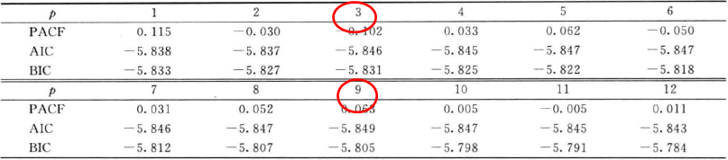
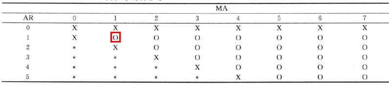

##第四章 平稳序列建模

###4.1 平稳性检验

对于给定序列首选需要进行序列平稳性检验[^2]，常用方法是ADF单位根 [^1]检验

###4.2 自回归模型AR预测

AR(p)模型为
$$
y_t = a_0 + \sum_{i=1}^{p}a_iy_{t-i} + \epsilon_t，其中i \in [1, p] \\
\{\epsilon_t\} 为均值为0，方差为\sigma^2的白噪声序列
$$
**AR(p)性质**
$$
期望 E(y_t)  = \frac{a_0}{1 - a_1 - a_2 - ... - a_p} \\
方差Var(y_t) = \frac{\sigma^2}{1 - a_1^2 -a_2^2 - .. -a_p^2} \\
$$
滞后算子为L，AR(p)的自相关函数满足
$$
(1 - a_1 L - a_2 L^2 - ... - a_p L^p) \rho_l \quad l \gt 0 
$$
`平稳性性要求 ：特征根的模都小于1`

####4.2.1 AR(p)的定阶

**方法1： 利用偏自相关函数PACF**

考虑如下AR模型
$$
y_t = \phi_{0,1} + \phi_{1,1} y_{t-1} + \epsilon_{1t} \\
y_t = \phi_{0,2} + \phi_{1,2} y_{t-1} + \phi_{2,2} y_{t-2} + \epsilon_{2t} \\
y_t = \phi_{0,3} + \phi_{1,3} y_{t-1} + \phi_{2,3} y_{t-2} + \phi_{3,3} y_{t-3} + \epsilon_{3t} \\
y_t = \phi_{0,4} + \phi_{1,4} y_{t-1} + \phi_{2,4} y_{t-2} + \phi_{3,4} y_{t-3} + \phi_{4,4} y_{t-4} + \epsilon_{4t} \\
...
$$
有上述方程可以知道，AR(p)的PACF函数满足P阶截尾。

**方法2：利用信息准则函数**

信息准则有

- 赤池信息准则（AIC） 
  $$
  AIC(l) = ln(\widetilde{\sigma^2_l}) + \frac{2l}{T}
  $$

- 施瓦茨—贝叶斯信息准则（BIC） 
  $$
  BIC(l) = ln(\widetilde{\sigma^2_l}) + \frac{l \ ln(T)}{T}
  $$

`选择标准：AIC或BIC值最小时的阶数为p的值。`

上面的例子中可以选择3阶或9阶，或者根据PACF找到一个合适的P阶值

####4.2.2 参数估计与残差检验

参数估计：最小二乘法

残差序列：$ \hat{\epsilon_t} = y_t - \hat{y_t}$

拟合优度，优度越接近于1说明拟合效果越好。
$$
R^2 = 1 - \frac{残差平方和}{总误差平方和} = 1 - \frac{\sum_{t=p+1}^{T} \hat{\epsilon_t}^2}{\sum_{t=p+1}^{T}(y_t - \overline{y_t})^2}
$$
调整的拟合优度
$$
Adj(R^2) = 1 -\frac{残差的方差}{y_t的方差} = 1 - \frac{\hat{\sigma^2_a}}{\hat{\sigma^2_y}}
$$

####4.2.3 范例

###4.3 滑动平均模型MA预测

MA(q)模型
$$
y_t = \sum_{i=0}^{q} \beta_i \epsilon_{t-i} ，其中\beta_0 = 1\\
Var(y_t) = (1 + \beta_1^2 + \beta_2^2 + ... + \beta_q^2) \sigma^2 \\
\rho_k = 
\begin{cases}
\frac{-\beta_k + \beta_1 \beta_{k+1} + \beta_2 \beta_{k+2} + ... + \beta_{q-k} \ beta_q}{1 + \beta_1^2 +\beta_2^2 + ... + \beta_q^2} \\
0 \ qquad k > q
\end{cases}
$$

####4.3.1 MA(q)的定阶

`方法：自相关函数ACF` ，MA(q)模型的ACF函数是q步截尾。

例如模型$y_t = \epsilon_t + \beta_1 \epsilon_{t-1}+ \beta_3 \epsilon_{t-3} + \beta_9 \epsilon_{t-9}$的ACF函数图如下

####4.3.2 模型估计

`条件似然法(Conditional Likelihood Method)` 

`精确似然法(Exact Likelihood Method)`

###4.4 自回归滑动平均模型ARMA预测

ARMA(p,q)模型
$$
y_t = a_0 + \sum_{i=1}^{p} a_i y_{t-i} + \sum_{i=0}^{q}\beta_i \epsilon_{t-i}
$$

####4.4.1 ARMA(p,q)的定阶

`方法：推广的自相关函数(EACF)` ，有'O'组成的三角形，最左上角的'O'的位置即为对用p，q的阶数。例如下图是ARMA(1,1)模型的EACF，其中'X'表示非零，'O'表示零，而'X'代表零或者非零。

下面例子中'O'在最左上角，表示该过程是白噪声过程，不适合做分析。

---

[^1]: [单位根检验](https://baike.baidu.com/item/%E5%8D%95%E4%BD%8D%E6%A0%B9%E6%A3%80%E9%AA%8C/5574482?fr=aladdin) 
[^2]: [Python中StatsModels做单位根检验](https://segmentfault.com/a/1190000005149283)

