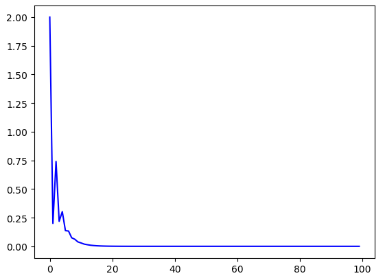
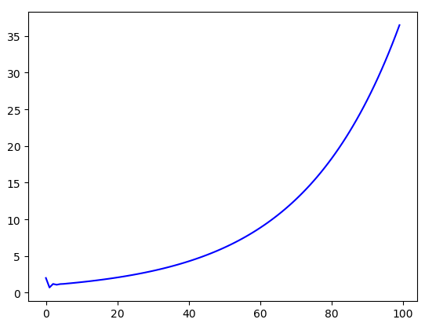
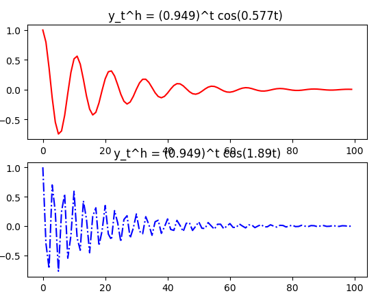

#时间序列分析基础

什么是时间序列？

时间序列的研究内容和方法？ ----按照模型公式用于预测？预测的结果（定量）都是有条件的，在一定范围内是有效的。

时间序列分析应用？质量控制，经济预测，异常检测，气象预报，探测矿产等，用定量的方法控制质量。最有价值的应用就是别人没做过，自己是首创。

什么是科学？科学就是解释现象？解释的未必是真理，你解释（假设）的未必正确，需要不断通过实践检验、修正你的解释。

##第一章 差分方程

**时间序列模型一般原理**：时间序列通常可以分解为``趋势性``、``季节性``、``循环或周期性``和``无规律性``（干扰项）这四项。前三项具有可预测性，第四项对前三项有干扰性。如果干扰或波动大小可以被估计，那么时间序列的预测是可以进行的。例如：菜的价格会有波动，不同地方价格不动，但是差别不会超过1元，那么这个价格就是可以预测的。

假设条件不变或条件是已知的，种黄瓜的人数确定，那么可以预测明年的收成，假设结果误差不超过10%。若不考虑波动是可以精确预测的。例子：

- 趋势项方程：$T_t = 1 + 0.1t$  ，$T_t$ 为t期的趋势性成分
- 周期性方程：$S_t = 16sin(\frac{t \pi }{6})$ ，$S_t$ 为t期周期性成分 
- 无规律性方程：$I_t = 0.7I_{t-1} +\epsilon_t$ ，第一项前后自相关，$I_t$ 

**差分方程**：是将变量表示为该变量滞后值、时间和其他变量的函数，可以表示为$\triangledown y_t = f(y_{t-1, \ t, \ x_t, \ \epsilon_t, ....})$ ，按照定义，前面三个成分方程都是差分方程。差分方程定义依赖两条：

1. 差分的定义，$\triangledown y_t = y_t - y_{t-1} $ 就是差分方程，数学定义为$\triangledown y_t = f(t_{t-1}, x, t)$ 在添加一个波动项$\epsilon_t$ 就可；
2. 满足方程的定义；

例子：随机游走（随机漫步） 
$$
y_{t+1} = y_t + \epsilon_{t+1} \quad \rightarrow \quad \triangle y_{t+1} = \epsilon_{t+1} \\
推广随机游走模型：添加一个常数项和线性项 \\
 \triangle  y_{t+1} = a_0 + bx + \epsilon_{t+1} \tag{1}
$$
###1.1 结构方程和诱导方程 

将差分方程拆分成独立的单方程模型是很有用的，例如：随机形式的萨缪尔森经典模型
$$
y_t = c_t + i_t \\
c_t = a y_{t-1} + \epsilon_{ct},  \quad 0 \lt a \lt 1 \\
i_t = \beta(c_t - c_{t-1}) + \epsilon_{it}， \quad \beta \gt 0 \tag{2}
$$
其中$y_t, c_t, i_t$ 分别表示t期的实际GDP，消费和投资。$\epsilon_{ct}， \epsilon_{it}$ 分别是消费和投资的随机干扰项，均值为0，$\alpha，\beta$ 是待估参数。第三个方程表示加速原理，即在消费增长必定带来新的投资支出前提下，投资支出等于消费变动的一定倍数。这是一个`结构方程` ，因为它表明两个当期内变量$i_t和c_t$ 之间满足某个约束条件或系统结构。

`诱导方程`（可以被推导出来的方程）是将当期变量表示为该变量滞后值、其他内生变量的滞后值（系统内部变量）、外生变量的当期值（外部变量）和外生变量的过去值、以及扰动项的函数。诱导方程并不唯一。
$$
c_t = a y_{t-1} + \epsilon_{ct},  \quad 0 \lt a \lt 1  \\
i_t = \beta(c_t - c_{t-1}) + \epsilon_{it}， \quad \beta \gt 0 \\
\downarrow  一式带入二式\\
i_t = \beta(ay_{t-1} + \epsilon_{ct} - ay_{t-2} + \epsilon_{c(t-1)}) + \epsilon_{it} \quad (诱导方程) \tag{3}
$$
###1.2 差分方程

差分方程：$\triangle y_{t+h} = f(t+h) - f(t) = y_{t+h} - y_{t}$ ，当h=1时为一阶差分。

一阶差分
$$
\triangle y_t = f(t) - f(t-1) = y_t - y_{t-1} \\
\triangle y_{t + 1} =  f(t+1) - f(t) = y_{t+1}- y_{t} \tag{4}\\
$$
可以从一阶差分得到二阶差分
$$
\triangle^2 y_t = \triangle (\triangle y) = \triangle ( y_t - y_{t-1})  = (y_t - y_{t-1}) - (y_{t-1} - t_{t - 2}) \\
= y_t - 2y_{t-1} + y_{t-2} \tag{5}
$$
n阶差分为$(\triangle ^n)$

**差分方程形式** 

考虑n阶常系数线性差分方程， 其一般形式可以写为
$$
y_t = a_0 + \sum_{i=1}^{n}a_iy_{t-i} + x_i \tag{6}
$$
其中$x_i$ 为**推动过程** ，可以是时间、其他变量的当期值或滞后值、随机干扰项的任意函数。$\{x_t\}$ 的一个重要特例是
$$
x_t = \sum_{i=1}^{\propto} \beta_i \epsilon_{t-i} \tag{7}
$$
其中$\beta_i$ 为常数，序列$epsilon_{t}$ 不是$y_t$ 的函数，于是认为$\{ \epsilon_t\}$ 只不过是一个为取定外生变量的序列。令$\beta = 1, \beta_1=\beta_2=...=0$ ，得到自回归方程
$$
y_t = a_0 + a_1 y_{t-1} + a_2 y_{t-2} + ... + a_m y_{t-n} + \epsilon_t \quad 自回归方法 \tag{8}
$$
###1.3 差分方程的解

差分方程的解是将未知项$y_t$ 表示为序列$\{ x_t \}$ 中的元素和t（也和序列$\{ y_t\}$ 的一些给定值即初始条件）的一个已知函数，使得代入到差分方程之后，满足方程式。

例子1：$\triangle y_t = 2 或者y_t = y_{t-1} + 2$ , 可以知道$y_t = 2t+c$  为该方程的解（采用迭代法求解）。

例子2：考虑无规律性方程$I_t = 0.7I_{t-1} + \epsilon_{t}$ 的解，该一阶差分方程的解为$I_t = \sum_{i=1}^{\propto} \epsilon_{t-i}$

####1.3.1 迭代法

迭代法分为向前迭代和向后迭代。通过对y的诱导方程进行迭代，有可能得到整个y序列的解。更具初始条件不同，可以采用不同的迭代方法。

1. 初始条件已知的迭代

   考虑初始条件y0已知的一阶差分方程$y_t = a_0 + a_1y_{t-1} + \epsilon_t$ ,

   `向前迭代`
   $$
   y_1=a_0 + a_1y_0 + \epsilon_t \\
   y_2 = a_0 + a_1y_1+\epsilon_2=a_0+a_1(a_0+a_1y_0+\epsilon_1) +\epsilon_2\\
   =a_0+a_0a_1+a_1^2y_0+a_1\epsilon_1 + \epsilon_2 \\
   y_3=a_0+a_1y_2+\epsilon_3 = ... =(a_0 + a_0a_1+a_0a_1^2) + \\
   a_1^3y_0 + (a_1^2\epsilon_1 + a_1\epsilon_2+\epsilon_3) \\
   \ \\
   y_t = a_0 \sum_{i=0}^{t-1}a_1^i + a_1^ty_0 + \sum_{i=0}^{t-1}a_1^i\epsilon_{t-i}（几何级数求和）\tag{9}
   $$
   类似可以用后向迭代求得$y_t$ 的通解

2. 初始条件未知的迭代（无限向后迭代）

   初始条件y0未知时，上式求得解释未知的，即不是一阶差分方差的解，因此需要对其继续向后迭代，得到
   $$
   y_t = a_0 \sum_{i=0}^{t-1}a_1^i + a_1^ty_0 + \sum_{i=0}^{t-1}a_1^i\epsilon_{t-i} \\
   =a_0 \sum_{i=0}^{t-1}a_1^i + a_1^t(a_0+a_1y_{-1} + \epsilon_0) +  \sum_{i=0}^{t-1}a_1^i\epsilon_{t-i}  \\
   =a_0 \sum_{i=0}^{t}a_1^i + a_1^{t+1}y_{-1} + \sum_{i=0}^{t}a_1^i\epsilon_{t-i} \\
   ... \\
   =a_0 \sum_{i=0}^{t+m-1}a_1^i + a_1^{t+m}y_{-m} + \sum_{i=0}^{t+m-1}a_1^i\epsilon_{t-i} \tag{10}
   $$
   上述方程式一个级数的展开、，若$|a_1| \lt 1$ ，则当$m \rightarrow \propto$ 时。得到一阶差分方程的一个解为
   $$
   y_t = \frac{a_0}{1-a_1} + \sum_{i=0}^{\propto}a_1^i \epsilon_{t-i} \tag{11}
   $$
   
   容易验证，对于任何常数A， 
   $$
   y_t =Aa_1^t+ \frac{a_0}{1-a_1} + \sum_{i=0}^{\propto}a_1^i \epsilon_{t-i} \tag{12}
   $$
   也是一阶差分方程的解

3. 两种迭代法的混合解

   由于上述解带有一个任意常数A，所以他可以用来确定初始条件已知的差分方程的解，令t=0，则得到A的值为
   $$
   A=y_0 - \frac{a_0}{1-a_1} - \sum_{i=0}^{\propto}a_1^i\epsilon_{-i} \tag{13}
   $$
   将A带入原式中就得到初始条件已知时的一阶差分方程的一个解
   $$
   y_t=\frac{a_0}{1-a_1} + [y_0 - \frac{a_0}{1-a_1}]a_1^t + \sum{i=0}{t-1}a_1i\epsilon{t-i} \tag{14}
   $$
   这个解与1中的是等价的

**非收敛序列（收敛性）**

- 当$|a_1| \lt 1$ ,则(10)收敛到(11)
- 当$|a_1|  \gt 1$ ,则(10)不收敛或发散，但只要给出初始条件y0，则可使用(10)或(12)中的解
- 当$|a_1| =1 $ ，一阶差分方程可以写为$y_t=a_0+y_{t-1} + \epsilon_t$ 使用迭代法可以得到$y_t=a_0t + \sum_{i=1}^{t}\epsilon_i + y_0$ 。当初始条件y0给定时，后者是前者的解；若没有初始条件，则后者可以使不收敛或发散的，y0又未知所以不是前者差分方程的解。

PS：针对时间序列分析，若预测方程的系数$|a_1| \lt 1$ 则方程的解是稳定的，收敛的，就可以预测；否则就无法预测。解的稳定性取决于系数是大于1还是小于1。

`推广` ：对于二次差分方程，如何求解，如何判断解是否稳定？如此推广到其他高阶差分方程。

####1.3.2 备选解法

对于一般的差分方程$y_t=a_0 +\sum_{i=1}^{n}a_ty_{t-i} +x_t$ ，当阶数n较高时，迭代法就不适用的，为此可以使用其他备选解法。

1. 齐次方程

   差分方程中常数项a0和推动过程项$x_t$ 都不出现时，就得到齐次差分方程为
   $$
   y_t=\sum_{i=1}^{n}a_iy_{t-i}  \tag{15}
   $$
   齐次方程解的一个性质是：若$y_t^h$ （h是一个记号，表示为方程的一个解）是齐次方程的一个解，则对于任意常数A，$A y_t^h$ 也是齐次方程的一个解。

2. 一阶差分方程的备选解法

   考虑一阶差分方程$y_t=a_0+a_1y_{t-1}+x_t$ ，则得到一阶齐次方程$y_t=a_1y_{t-1}$ ，显然恒零序列$y_t=y_{t-1}=....=0$ 是齐次方程的一个解，另外当初始条件y非零且已知时，$y_t^h=a_1^i y_0$ 也是它的一个解。两者都包含在一阶齐次方程的通解$y_t=Ay_t^{h}$ 中A为任意常数。若$y_t^p$ 是一阶差分方程的一个特解，则该差分方程的通解为
   $$
   y_t = y_t^p + Ay_t^h = y_t^p + Aa_1^ty_0 ，其中A=1-\frac{y_0^p}{y_0} \tag{16}
   $$

3. 一般差分方程的解法

   对于一般差分方程，其求解方法通常为

   - 建立齐次方程，求出它的n个齐次解，$y_t^{h_1},y_t^{h_2},...,y_t^{h_n}$
   - 求出差分方程的一个特解$y_t^p$ 
   - 通解为所有齐次解的线性组合与特解之和，$y_t=y_t^p + \sum_{i=1}^{n}A_i y_i^{h_i}$ 
   - 将初始条件带入通解中，确定线性组合的系数$A_1,A_2,...,A_n$

###1.4 解齐次差分方程 

对于一般n(线性)解差分方程
$$
y_t=a_0 +\sum_{i=1}^{n}a_ty_{t-i} +x_t \tag{17}
$$

1. 解一阶齐次差分方程

   一阶齐次差分方程$y_t=a_1y_{t-1} $的解形式为$y_t=Aa_1^t$，其中A为任意常数

2. 解二阶齐次差分方程

   一般二阶齐次方程$y_t - a_1y_{t-1}-a_2y_{t-2}=0 $ ，猜想其齐次解如一阶一样具有相同形式$y^h_t=Aa^t$，其中a待定，A为任意常数，带入二阶齐次差分方程得：
   $$
   Aa^t -a_1Aa^{t-1} - a_2Aa^{t-2} = 0 \tag{18}
   $$
   消去A和$a^{t-2}$之后得 ，得到关于a的一元二次方程
   $$
   a^2-a_1a-a_2 = 0 \tag{19}
   $$
   称为`特征方程`，对应方程的解称为`特征解` 。根据一元二次方程求特征根为
   $$
   a_1,a_2=\frac{a_1 \pm \sqrt{a_1^2+4a_2}}{2}=\frac{a_1 \pm \sqrt{d}}{2} \tag{20}
   $$
   其中 $d=a_1^2+4a_2$为判别式，于是$A_1(a_1)^t，A_2(a_2)^t$都是二阶差分方程的解，其中$A_1，A_2$为任意常数其它之和
   $$
   y_t^h = A_1(a_1)^t + A_2(a_2)^t \tag{21}
   $$
    为二阶差分方程的齐次解，但是接的性质取决于特征根$a_1,a_2$和判别式d。

   ​

**情况1：判别式 $a_1^2+4a_2 \gt 0$** 

此时，a1和a2为两个不同的实数特征根，当a1或a2的绝对值大于1时，则二阶差分方程的齐次解就趋于发散。

例子1：$y_t = 0.2y_{t-1} + 0.35y_{t-2}$
$$
a_1,a_2 = \frac{a_1 \pm \sqrt{a_1^2+4a_2}}{2} = \frac{0.2 \pm \sqrt{0.2^2 + 4 * 0.35}}{2} \\
=\frac{0.2 \pm \sqrt{1.44}}{2} = 0.7，-0.5
$$
则齐次解为
$$
y_t^h = A_1(0.7)^t + A_2(-0.5)^t
$$
查看其解的轨迹可以知道，随着时间 t的增大，解趋近于零。

例子2：$y_t=  0.7y_{t-1} + 0.35y_{t-2}$

同样可以求得$a_1，a_2 = 1.037，-0.337$ ,则其次解为
$$
y_t^h = A_1(1.037)^t + A_2(-0.337)^t
$$
查看此解的轨迹可以看出随时间t的增大，解发散。

**情形2：判别式$d=a_1^2+4a_2=0$**

此时，a1和a2为两个重根，$a_1=a_2=\frac{a_1}{2}$ ，除了$A_1(\frac{a_1}{2})^t$ 是一个解之外，可以验证$A_2t(\frac{a_1}{2})^t$ 是另一个解。于是得到齐次解
$$
y_t^h = A_1(\frac{a_1}{2})^t +A_2t(\frac{a_1}{2})^t，其中A_1，A_2为任意常数
$$
显然当$a_1 \ge 2$ 时，解就发散；当$a_1 \lt 2$ 时，解就收敛。

**情形3：判别式$d=a_1^2+4a_2 \lt 0$**

此时$a_2 \lt -\frac{a_1^2}{4} \lt 0$ ，a1和a2为两个共轭的虚数特征根，记
$$
a_1=\frac{a_1 + i \sqrt{-d}}{2}，a_2=\frac{a_1 - i \sqrt{-d}}{2}，其中i=\sqrt{-1} \\
令r=(-a_2)^{\frac{1}{2}}，使得满足cos(\theta) = \frac{a_1}{2(-a_2)^{\frac{1}{2}}}，则有 \\
a_1 = r[cos(\theta) + i \ sin(\theta)]，a_2=r[cos(\theta) - i \ sin(\theta)] \\
由De \ Moivre定理可以得到：\\
(a_1)^t = r^t[cos(\theta) + i \ sin(\theta)]，(a_2)^t=r^t[cos(\theta) - i \ sin(\theta)] \\
注意齐次解表达式为：y_t^h=A_1(a_1)^t + A_2(a_2)^t \\
因为y_t^h是实数，a_1,a_2是复数，所以A_1，A_2必为复数，假设 \\
A_1= B_1[cos(B_2) + i \ sin(B_2)]，A_2=B_1[cos(B_2) - i \ sin(B_2)] \\
其中B_1，B_2均为任意实数，可以计算出 \\
A_1(a_1)^t = B_1r^t[cos(t \theta + B_2) + i \ sin(t \theta + B_2)] \\
A_2(a_2)^t = B_1r^t[cos(t \theta + B_2) - i \ sin(t \theta + B_2)] \\
因此可以得到齐次解为：y_t^h = \beta_1r^tcos(t \theta + \beta_2)，其中\beta_1，\beta_2为任意常数
$$
三角函数表达式说明了齐次解在时间路径上像波浪一样，其波动频率取决于$\theta$ 的大小，而解的稳定性则由$r=(-a_2)^{\frac{1}{2}}$ 的值是否小于1或a2是否大于-1所决定。由于$a_2 \lt -\frac{a_1^2}{4} \lt 0$ ，所以

1. 当$r=(-a_2)^{\frac{1}{2}} = 1，即a_2=-1$ ，则波动的增幅不变；
2. 当$r=(-a_2)^{\frac{1}{2}} \lt 1，即-1 \lt a_2 \lt 0$ ，则波动呈递减趋势；
3. 当$r=(-a_2)^{\frac{1}{2}} \gt 1，即a_2 \lt -1 $ ，则波动呈发散趋势；

例子：$y_t =1.6y_{t-1} - 0.9y_{t-2}$ 
$$
其判别式d=a_1^2+4a_2 = 1.6^2-4 * 0.9 = -1.04 \lt 0，\\
令r=(-a_2)^{\frac{1}{2}} = 0.9^{\frac{1}{2}} \approx 0.949 \\
cos(\theta) = \frac{a_1}{2(-a_2)^{\frac{1}{2}}} = \frac{1.6}{2 * 0.949} = 0.843，\theta=0.567 \\
齐次解为：y_t^h = \beta_1(0.949)^t cos(0.577t + \beta_2) \\
取\beta_1=1，\beta_2=0，则随着\theta值增大，波动频率加快。
$$

注1：实数解可以看成是虚部为0的复数；

注2：常数解或特征根为1的情形可以不在稳定性条件的考虑范围之内，本身他是一个稳定解。

注3：二阶齐次差分方程又可以表示为递推方程$ y_t-a_1y_{t-1} = a_2(y_{t-1} - a_1y_{t-2})$ （有韦达定理得a1+a2和a1a2的值），其中a1，a2为两个特征根，当其中一个特征根a1=1时，则可以表示为$y_t-y_{t-1} = a_2(y_{t-1} - y_{t-2})$ ，此时存在一个常数解。当两个特征根a1=a2=1时，则可以表示为$y_t-y_{t-1} = y_{t-1} - y_{t-2}$ ，此时除了一个常数解，还有一个线性解（类似等差数列）。

##  

## 第二章 高阶差分方程

> 从欣赏的角度学习（结果怎么这么漂亮，推导那么完整）

考虑n阶齐次方程
$$
y_t - \sum_{i=1}^{n}a_iy_{t-i} = 0
$$
假设每一个齐次解具有形式$y_t^k = Aa^t$ ，其中A为任意常数，带入上面的式子可以得到
$$
Aa^t - \sum_{i=1}^{n}a_iAa^{t-i}，两边除以Aa^{t-n}\\
a^n - a_1a^{n-1}-a_2a^{n-2} - ... - a_n = 0
$$
n阶多项式有n个根，记这n个特征根分别为$a_1,a_2,a_3,...,a_n$，$a_t$ 可以为实数或复数，复数根则成对出现，相互共轭。稳定性条件要求除了为1的单特征根（对应常数解），其他特征根的绝对值都小于1或在单位圆之内；否则解将发散。

**齐次解的表达形式** 

1. 所有特征根都是相异实根，此时解的表达式为
   $$
   y_t^h = A_1a_1^t + A_2a_2^t + ... + A_na_n^t，其中A_1~A_n为任意常数，给定n个初始条件就可以求出它们的具体值
   $$

2. 所有特征根都是实根，但有m（小于等于n）个重根，
   $$
   设重根为a_1=a_2=...=a_m，则有m个重根产生的解为\\
   A_1a_1^t + A_2ta_1^t + ... + A_mt^{m-1}a_m^t，其中A_1~A_m为任意常数
   $$
   假设互不相同 的特征根有s个，则齐次方程的通解就等于则s个不同特征根所产生的解之和，其中包含有n个参数。给定n个初始条件，就可以确定则n个参数的具体值。

3. 一些特征根为复根，此时它们共轭出现，记一对共轭根为$a \pm i \theta$ ，则有这对共轭根所产生的解为
   $$
   A(a+i \theta)^t +A_2(a - i \theta)^t，其中A_1,A_2为任意常数，转换为极坐标，可写成 \\
   \beta_1 r^t cos(\theta t + \beta_2)，其中\beta_1,\beta_2为任意常数
   $$
   于是齐次差分方程的通解就等于所有不同实根或复特征根所产生的解之和；其中含有n个参数。给定n个初始条件，就可以确定则n个参数的具体取值。

**稳定性条件** 

稳定性判别条件，注意到$\sum_{i=1}^{n}a_i = 1 - (1 - a_1)...(1 - a_n)$ ，则可以证明

- 所有特征根都位于单位圆内的必要条件为$\sum_{i=1}^{n}a_i \lt 1$ 

- 所有特征根都位于单位圆内的充分条件为$\sum_{i=1}^{n}|a_i| \lt 1$ 

- 若$\sum_{i=1}^{n}a_i = 1$ ，则至少有一个特征根等于1，包含一个或多个等于1的特征根序列称为单位根序列。此时，n阶差分方程的解可能发散或不稳定；

- 对于三阶方程，稳定条件可以写为
  $$
  1-a_1-a_2-a_3 \gt 0 \\
  1+a_1-a_2+a_3 \gt 0 \\
  1-a_1a_3+a_2-a_3^2 \gt 0 \\
  3+a_1+a_2-3a_3 \gt 0 \ 或 \ 3-a_1+a_2+3a_3 \gt 0
  $$

**求解确定性过程的特解** 

本文介绍推动过程$\{x_t\}$ 为确定项的求解方法

1. $x_t = 0$ 
   $$
   此时，差分方程为y_t = a_0 + a_1y_{t-1} + a_2y_{t-2} + ... + a_ny_{t-n} \\
   令解的形式为常数y_t = c，带入上式可以得到\\
   c = \frac{a_0}{1- a_1 - a_2 - ... - a_n}，(1- a_1 - a_2 - ... - a_n) \ne 0
   $$
   若$(1- a_1 - a_2 - ... - a_n)= 0$ 则${y_t}$ 是一个单位根序列，其齐次解已包含常数解，此时，除非$a_0=0$ 否则常数解就无效，而应该考虑线性特解$y_t^p=ct$ 把其带入差分方程可以得到
   $$
   c = \frac{a_0}{a_1+2a_2+...+na_n}，(a_1+2a_2+...+na_n) \ne 0
   $$
   若$a_1+2a_2+...+na_n = 0 $ ，则继续尝试使用$y_t^p = ct^2, ct^3,...,ct^n$ 作为解，对于n阶方程，这些解总会有一个会是特解。

2. 对于$x_t=bd^{rt}$ ，其中b，d和r都为常数，r为增长率，此时，差分方程的形式为
   $$
   y_t = a_0 + a_1y_{t-1} + .... + a_ny_{t-n} + bd^{rt} \\
   考虑一阶方程y_t = a_0 + a_1y_{t-1} + bd^{rt} ，令解形式为y_t^p = c_0 + c_1d^{rt} ，其中c_0,c_1为待定常数\\
   带入差分方程可得：c_0 + c_1d^{rt} = a_0 + a_1[c_0 + c_d^{r(t-1)}] + bd^{rt}，使两队对应相等，取 \\
   c_0 = \frac{a_0}{1-a_1}，c_1 = \frac{bd^{r}}{d^r-a_1} \\
   因此特解为：y_t^p =  \frac{a_0}{1-a_1} +  \frac{bd^{r}}{d^r-a_1}d^{rt}
   $$
   当$|d^r| \lt 1$ 时，该特解将收敛于$\frac{a_0}{1-a_1}$ ，若分母为零即$a_1=1或a_1=d^r$ ，则使用1中技巧求解，例如：

   当$a_1=1$ ，尝试使用$y_t^h = ct + c_1d^{rt}$ ,带入差分方程求解c和c1带入就可求得特解。同理当$a_1=d^r$ 时，令$y_t^h=c+c_1td^{rt}$ 带入差分方程求解c和c1。对于高阶方程同样使用类似方法求解。

3.  $x=bt^d$ 幂函数，其中b，d为正常数
   $$
   y_t = a_0 + a_1y_{t-1} + .... + a_ny_{t-n} + bd^{rt} \\
   其解的一般形式为y_t^p=c_0 + c_1t + c_2t^2 + ... + c_dt^d
   $$
   ​

**求随机性过程的特定系数法** 

本文介绍推动过程为随机项求特解的待定系数法，因这种特定系数法可能无解，所以称他为挑战解。

1. 只带一个随机项的一阶差分方程
   $$
   y_t=a_0+a_1y_t+\epsilon_t，令挑战解为y^t = b_0 + b_1t + \sum_{i-0}^{\propto}a_i \epsilon_i，其中b_0,b_1,a_i均为待定系数，带入差分方程求解
   $$
   ​

2. 带连个随机项的一阶差分方程

3. 高阶方程，

