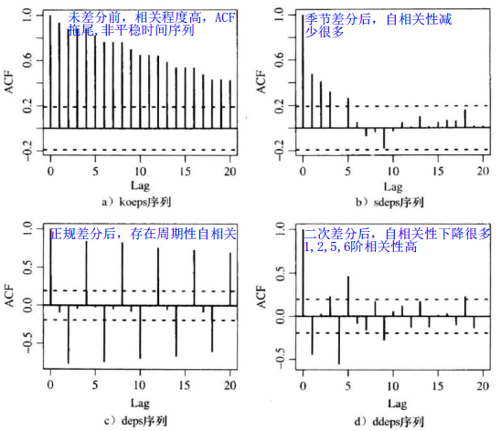
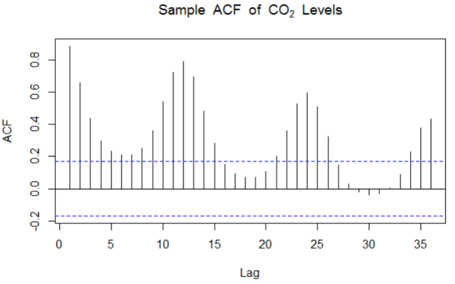
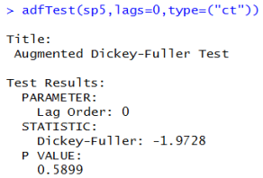

##第5章 非平稳时间序列建模

对于不平稳的时间序列有两种分析方法

1. 时间序列确定性分析；
2. 时间序列随机分析，ARMA模型属于时间序列随机分析的一部分。

###5.1 时间序列分解

**Cramer分解定理** ：任何一个时间序列$\{y_t\}$ 都可以分解为两个部分，一部分是由多项式决定的确定性趋势成分，另一部分是平稳的零均值误差成分，即
$$
y_t = \mu_t + \epsilon_t \\
确定趋势\mu_t = \sum_{j=0}^{d} \beta_j t^j \\
随机项 \epsilon_t = \varphi(L)a_t
$$
其中$d < \infty，\beta_1,\beta_2,...,\beta_d$ 为常数系数，$\{a_t\}$ 为一个零均值白噪声序列，L为延迟算子，且满足
$$
E(\epsilon_t) = E(\varphi(L)a_t) = \varphi(L)E(a_t) = 0 \\
E(y_t) = E(\mu_t) = E(\sum_{j=0}^{d} \beta_j t^j) = \sum_{j=0}^{d}\beta_j t^j
$$
**确定性因素分解**

时间序列分析中的因素主要有

1. 长期趋势变动；
2. 循环变动，若循环变动有固定周期则将其归纳到季节性变动中；若循环变动没有固定周期将其归纳到长期趋势中；
3. 季节性变动；
4. 随机波动，除了上述变动的其他所有随机因素构成的变动；

因此在确定性分析中，将序列分解为三大因素

1. 长期趋势（包括长期趋势和无固定周期循环波动）；
2. 季节性变化（包括季节变化和稳定周期的循环波动）；
3. 随机波动；

确定性时间序列分析的目的就是：

1. 克服其他因素影响，单纯测量某个确定性因素对时间序列的影响;
2. 推断确定性因素之间的相互作用，以及其对时间序列的综合影响；

**确定性时间序列分析方法** 

1. 平滑预测法
2. 趋势预测法
3. 分解分析法

###5.2 长期趋势分析与预测

用于长期趋势分析与预测的方法主要由平滑法和趋势拟合法。其中平滑法分为三大类：`移动平滑法`，`加权移动平滑法`，`指数平滑法`。因为每一种方法都是要消除由于时间序列不规则成分所引起的随机波动，所以被称为**平滑法** 。平滑法适用于时间序列在一定的时间内取值比较稳定，序列之间的差异主要是随机波动所引起的，这个时候就可以使用平滑法。

当时间序列可能呈现长期趋势且不能使用平滑法通过均值拟合时，需要采用**趋势拟合法** 找到均值和时间的线性关系，常用的趋势拟合法有：`线性拟合`、`曲线拟合`。

####5.2.1 平滑法

`移动平均法`是一种简单平滑预测技术，其基本思想是根据时间序列资料、逐项推移，依次计算包含一定项数的时序平均值，以反映长期趋势。 

**1. 简单移动平滑SMA** 

计算公式为
$$
\hat{y_{t+1}} = \frac{y_t + y_{t-1} + ... ++ y_{1}}{t}
$$
`代码实现` 

**2. 加权移动平滑WMA** 

针对不同的时间点给予不同的权重，例如最近时间的数据权值大一点，时间距离源远的数据有效性越低。

计算公式为
$$
\hat{y_{t+1}} = \sum_{i=1}^{t} w_i y_i ，其中w_i > 0 \quad \sum w_i = 1
$$
`代码实现` 

**3. 指数加权移动平滑EWMA** 

**K期移动平均法**

只计算前k期的平均值，计算公式为
$$
\hat{y_{t+1}} = \frac{y_{t} +y_{t-1} + ... + y_{t-k+1}}{k}
$$
`代码实现` 

**指数平滑法** 

特殊的加权平滑法，默认是时间越久远影响就越小，`一次指数平滑法`为
$$
F_{t+1} = a Y_t + (1-a)F_t ，其中第一项为真实值，后者为预测值\\
\downarrow \\
y_{t+1} = \sum_{i=0}^{t} a (1-a)^i y_{t-i}
$$
平滑系数a表示真实和预测值占用的权重，其取值分类如下

| 取值范围     | 说明                       |
| ------------ | -------------------------- |
| $[0.1, 0.3)$ | 观测值是一个稳定的水平发展 |
| $[0.3, 0.5)$ | 观测值波动较大             |
| $[0.5, 0.8]$ | 观测值波动较大             |

`代码实现` 

   

####5.2.2 趋势拟合法

简单移动平滑法会把数据当成随机变动，这样数据均值就会显得非常平稳。因此若数据有明显趋势的情况下，用均值进行平滑结果是有问题的。因此采用线性拟合和非线性拟合对均值进行拟合。

**对均值进行线性拟合** 
$$
\mu_t = \beta_0 + \beta_1 t \qquad \qquad \quad\\
\ \\
\hat{\beta_1} = \frac{\sum_{t=1}^{n}(y_t - \overline{y})(t-\overline{t})}{\sum_{t=1}^{n}(t - \overline{t})^2} \\ 
\hat{\beta_0} = \overline{y_t} - \hat{\beta_1} \overline{t} \qquad \qquad \qquad
$$
**对均值进行非线性拟合** 

`二次曲线拟合` 
$$
\mu_t = a + b t + c t^2 \\
\ \\
y_t = a + b t + c t^2 + \epsilon_t \\
E(\epsilon_t) = 0，Var(\epsilon_t) = \sigma^2_{\epsilon} 
$$

`指数曲线拟合` 
$$
\mu_t = ab^t \\
y_t = ab^t + \epsilon_t \\
E(\epsilon_t) = 0，Var(\epsilon_t) = \sigma^2_{\epsilon}
$$

###5.3 季节趋势分析与预测

####5.3.1 确定性季节趋势

**1. 季节均值法**

季节性或周期性趋势
$$
\mu_t = 
\begin{cases} 
\beta_1 \qquad t=1,13,25,... \\
\beta_2 \qquad t=2,14,26,... \\
... \\
\beta_{12} \qquad t=12,24,26,... \\
\end{cases}
$$

**2. 余弦趋势法**

余弦趋势
$$
\mu_t = \beta cost(2 \pi f t + \phi) \\
根据三角恒等式得到 \\
\beta cost(2 \pi f t + \phi) = \beta_1 cos(2 \pi f t) + \beta_2 sin(2 \pi f t) \\
其中 \beta = \sqrt{\beta_1^2 +\beta_2^2}，\phi = atan(-\frac{\beta_2}{\beta_1}) \\
\beta_1 = \beta cos(\phi)，\beta_2 = \beta sin(\phi)
$$

**3. 季节指数水平法**

单纯考虑季节变动因素，没有考虑长期趋势。季节指数水平法预测模型
$$
y_{ij} = \overline{y} * s_j + \epsilon_{ij}
$$
其中$y_{ij}$ 是第i年的第j个月(或季节)的观测值，$\overline{y}$ 为时间序列的平均水平（可以是上一年或两年或全部数据的平均值），$s_j$ 为第j个月季节指数，$\epsilon_{ij}$为随机波动。 

`算法步骤`

1. 求各年平均数，假设有两年数据，求每年12个月中每个月份的平均值。
2. 求各月对该年平均数比率，每个月中每天的实际值比上该年该月的平均值。
3. 计算季节比率$s_j$ ，$s_j$ 为样本中每年相同月份的比率的平均值，例如：$s_1$ 为两年数据中一月份的比率的平均值。
4. 根据季节指数水平法预测。

**4. 季节指数趋势法**

既考虑季节变动，也考虑长期趋势

####5.3.2 随机季节模型

**季节差分** 

差分分为两种：`正规差分`、`季节差分`。其中`正规差分`用来消除普通时间序列的非平稳行；`季节差分`用来消除季节波动。周期的s的季节差分为
$$
一阶季节差分 \quad \nabla_s y_t = y_t - y_{t-s} \qquad \qquad \qquad \ \ \qquad \qquad \\
二阶季节差分 \quad \nabla_s^2 = \nabla_s y_t - \nabla_s y_{t-1} = y_t - 2y_{t-s} + y_{t - 2s}
$$
例子：可口可乐公司股票从1983年第1季度到2009年第3季度每股季度盈利 

由上图可知，时间序列数据存在季节波动以及上升的趋势波动，因此需要两次差分，第一次正规差分消除上升趋势影响，第二次做季节差分消除季节波动。下图是对时间序列数据求ACF图后的结果，其中‘koeps’是对数盈利，‘deps’是一阶差分序列，‘sdeps’是季节差分序列，‘ddeps’表示正规差分和季节差分后的序列。

下图还是经过差分处理后的时间序列数据图

**平稳季节ARMA模型** 

季节周期为s的Q阶季节MA(Q)模型
$$
y_t = \epsilon_t + \Phi_1 \epsilon_{t-s} + \Phi_2 \epsilon_{t-2s} + ... + \Phi_Q \epsilon_{t-Qs}
$$
季节周期为s的P阶季节AR(P)模型
$$
y_t = \Theta_1 y_{t-s} + \Theta_2 y_{t-2s} + ... + \Theta_P y_{t-Ps}  + \epsilon_t
$$
考虑s=12的MA(1)模型，则有
$$
y_t = \epsilon_t + \beta e_{t-12} \\
cov(y_t, y_{t-1}) = cov(\epsilon_t - \beta \epsilon_{t-12}, \epsilon_{t-1} - \beta \epsilon_{t-13}) = 0 \\
cov(y_t, y_{t-12}) =cov(\epsilon_t - \beta \epsilon_{t-12}, \epsilon_{t-12} - \beta \epsilon_{t-24}) = - \beta \sigma^2_{\epsilon} \\
$$
**加法季节ARMA模型** 

AR(p) + MA(q)

**乘法季节ARMA模型** 

季节周期为s的乘法季节模型$ARMA(p,q) * (P,Q) = AR(p)AR(P) + MA(q)MA(Q)$ ，模式是AR特征多项式为$\phi(x) \Phi(x)$ ，MA特征多项式为$\theta(x) \Theta(x)$ 的模型，其中
$$
\begin{cases}
y_t = 1 - \phi_1 L + \phi_2 L^{2} + ... + \phi_P  L^{P}\\
y_t = 1 - \Phi_1 L^{s} + \Phi_2 L^{2s} + ... + \Phi_P  L^{Ps}\\
\end{cases}
\ \\
\begin{cases}
y_t = 1 - \theta_1 L - \theta_2 L^2 - ... - \theta_p L^{q}   \\
y_t = 1 - \Theta_1 L^{s} - \Theta_2 L^{2s} - ... - \Theta_Q L^{Qs}   \\
\end{cases}
$$
例子1：考虑一个MA模型，其特征多项式为
$$
(1 - \theta L)(1 - \Theta L^{12})
$$
则MA模型为
$$
y_t = \epsilon_t - \theta \epsilon_{t-1} - \Theta \epsilon_{t-12} + \theta \Theta \epsilon_t-{13}
$$
例子2：考虑ARMA(0,1)*(1,0)模型，s=12的特征多项式为
$$
y_t = \Phi y_{t-12} + \epsilon_t - \theta \epsilon_{t-1}  	\\ 
特征方程为 (1 - \Phi L^{12}) y_t= (1 - \theta) \epsilon_t \\
\downarrow \\
ARMA(0,1) * (1,0)_{s=12}
$$

####5.3.3 非平稳季节模型ARIMA模型 

过程$\{y_t\}$ 称为季节周期为s，非季节（规则的）阶数为p，d和q，季节阶数为P，D和Q的`乘法季节ARIMA模型` ，前提是差分序列
$$
W_t  =\nabla^d \nabla^D_s y_t
$$
满足某季节周期为s的$ARMA(p,q)*(P,Q)_s$ 模型，$\{y_t\}$ 称为季节周期为s的$ARIMA(p,d,q)*(P,D,Q)_s$模型。

例子：加拿大北部地区的月二氧化碳含量

**1. 模型识别** 

**2. 模型拟合**

**3. 模型检验**

**4. 预测**
$ARIMA(0,1,1) * (0,1,1)_{s=12}$模型为
$$
\nabla y_t = (1 - \theta L)(1 - \Theta L^{12}) \epsilon_t \\
y_t - y_{t-1} = \epsilon_t - \theta \epsilon_{t-1} - \Theta \epsilon_{t-12} + \theta \Theta  \epsilon_{13} \\
\downarrow \\
y_t  =\hat{y_{t-1}} +  \epsilon_t - \theta \epsilon_{t-1} - \Theta \epsilon_{t-12} + \theta \Theta  \epsilon_{13} \\
$$

###5.4 非平稳时间序列模型ARIMA

如何识别时间序列是否是平稳的？`单位根检验`，在特征方程中，特征根要都小于1才是稳定的，而单位根就是特征根为1的根称为单位根，`单位根存在的时间序列是不稳定的`。非平稳时间序列分为两类：

1. `趋势非平稳`，时间序列呈现非平稳是因为它有一个确定的趋势(线性趋势、曲线趋势)，使得其变成非平稳的。
2. `差分非平稳`，非平稳的情况不是由于确定性趋势引起的，而是由随机性趋势引起的。

若是趋势非平稳则使用趋势拟合法建立模型，若是差分非平稳则使用ARIMA模型。通过差分可以将趋势非平稳、差分非平稳装换为平稳时间序列，选择哪个模型要视情况而定。但是小样本数据时，无法区分趋势非平稳和差分非平稳，则使用ARIMA模型。

**单位根识别趋势非平稳和差分非平稳** 

通过单位根检验可以区分时间序列数据是趋势非平稳还是差分非平稳。首先需要通过单位根检验判断时间序列是不是非平稳的；若是非平稳的，则通过将单位根的lags阶数设置为0来判断非平稳时间序列是趋势非平稳还是差分非平稳。

第一步：通过单位根判断时间序列是非平稳的。

P值大于0.05，则不能拒绝原假设，即存在单位根，时间序列数据是非平稳的。

第二步：将阶数设置为0（假设趋势非平稳时的阶数为0），即假设不存在趋势非平稳。若P值(<0.05)拒绝原假设则说明是趋势非平稳；若阶数为0，P值不拒绝原假设则说明是差分非平稳的。即当lags=0且p值很小时，即拒绝原假设，并且lags=p是不拒绝原假设，则说明该数据是趋势非平稳的。反之，数据还是差分非平稳的。

上述例子中当lags=0时，P-Value=0.5899表示不拒绝原假设，说明测试数据是差分非平稳的。

####5.4.1 ARIMA(p,d,q)模型

考虑非平稳AR(1)模型，当特征根 $a=3 ，|a| > 1$时的情况
$$
y_t = \alpha y_{t-1} + \epsilon_t，\alpha=3 \\
\downarrow \\
y_t = \epsilon_t + 3 \epsilon_{t-1}+ 3^2 \epsilon_{t-2} + ...  + 3^{t-1} \epsilon_{1} + 3^t y_0
$$
从上式可以看出，非平稳的白噪声时间越久影响越来越大，而平稳的AR模型，时间越久白噪声影响越小。AR(1)模型的方差和协方差为，其中求协方差时，因为不同时间的白噪声间协方差为0，因此只剩下自身各自的协方差。
$$
Var(y_t) = (1 + 3 + 3^2 + ... + 3^{t-1}) \sigma^2_{\epsilon} = \frac{1}{8}(9^t - 1)\sigma^2_{\epsilon} \\
cov(y_t, y_{t-k}) = cov( \epsilon_t + 3 \epsilon_{t-1}+ 3^2 \epsilon_{t-2} + ...  + 3^{t-1} \epsilon_{1} + 3^t y_0 \ , \epsilon_{t-k} + 3 \epsilon_{t-k-1} \\ 
+ 3^2 \epsilon_{t-k-2} + ...  + 3^{t-k-1} \epsilon_{1} + 3^{t-k} y_0) \\
=cov(3^k e_{t-k}, e_{t-k}) + cov(3^{k+1} e_{t-k-1}, 3 e_{t-k-1}) + ... + cov(3^{t-1} e_1 , 3^{t-k-1}  e_1) \\
= (3^k + 3^{k+2}+ 3^{k+4} + ... + 3^{2t -k -2}) \sigma^2_{\epsilon} \\
= 3^k (1 + 9 + 9^2 + ... + 9^{t-k-1}) \sigma^2_{\epsilon} \\
= 3^k \frac{1 - 9^{t-k}}{1- 9} \sigma^2_{\epsilon} \\
=\frac{3^k}{8} (9^{t-k} -1 ) \sigma^2_{\epsilon} \\
可以知道corr自相关系数指数增长接近于1
$$
实际特征根为3的情况不容易出现，为了考虑当特征根为1时的AR(1)模型
$$
y_t = y_{t-1} + \epsilon_t \\
y_t = \epsilon_{t} + \epsilon_{t-1}+ ... + \epsilon_{1} + y_0 \\
\ \\
Var(y_t) = t \sigma_{\epsilon}^2 \\
cov(y_t, y_{t-k}) = cov(\epsilon_{t} + \epsilon_{t-1}+ ... + \epsilon_{1} + y_0, \epsilon_{t-k} + \epsilon_{t-k-1} + ... + \epsilon_{1} + y_0) \\
= cov(\epsilon_{t-k}, \epsilon_{t-k}) + cov(\epsilon_{t-k-1}, \epsilon_{t-k-1}) + ... + cov(\epsilon_{1}, \epsilon_{1}) \\
= (t-k) \sigma_{\epsilon}^2 \\
corr(y_t, t_{t-k}) = \frac{t-k}{\sqrt{t} \sqrt{t-k}} \quad 线性增长
$$
从上述分析可以知道，非平稳的AR(1)模型拖尾，而平稳的AR(1)是1阶结尾的。AR(1)的时间序列图如下所示

从上图可以看出，特征根为1的非平稳AR(1)模型不是线性趋势平稳序列，而是由于噪声造成的趋势，且是非平稳的。因此仅仅从图中判断时间序列是趋势平稳序列是不准确的，因此需要经过验证才能确定模型。

**差分处理非平稳时间序列** 

由于实际数据是离散的，没法像连续数据那样求导，因此通过差分进行平稳化处理。差分通常用于处理非平稳时间序列，`没做一次差分，数据就会少一个，n次差分后会很少n个数据`，差分有两类

1. 正规差分
   $$
   一阶正规差分 \quad \nabla y_t = y_t - t_{t-1} \\
   二阶正规差分 \quad \nabla^2 y_t = \nabla y_t - \nabla y_{t-1} = y_t - 2y_{t-1} + y_{t-2}
   $$

2. 季节差分，其中s为周期，针对季节波动、稳定周期波动。
   $$
   一阶季节差分 \quad \nabla_s y_t = y_t - y_{t-s} \\
   二阶季节差分 \quad \nabla_s^2 = \nabla_s y_t - \nabla_s y_{t-1} = y_t - 2y_{t-s} + y_{t - 2s}
   $$

`过差分` 

过度差分会出现过差分现象，例如对于随机游动，一次差分后
$$
\nabla y_t = y_t - y_{t-1} = \epsilon_t
$$
是一个白噪声过程，两次差分后得到MA(1)模型
$$
\nabla^2 y_t = \epsilon_t - \epsilon_{t-1}
$$
此时就是过差分，因此出现了新的模型，需要对模型求解额外的参数。过差分后的缺点是

- 需要估计不必要的参数；
- 会产生模型不可逆的情况，这样就没有办法做超前预测或得到的超前预测不准确；
- 模型复杂，比较难解释同时在会推时比较费力。

**ARIMA(p, d, q)模型** 

如果一个时间序列$\{y_t\}$ 的d阶差分$y_t = \nabla^d y_t$ 是一个平稳的时间序列，且服从$ARMA(p,q)$模型，则称$y_t$ 服从$ARIMA(p,d,q)$模型。称时间序列$\{y_t\}$ 是`差分平稳时间序列`。

考虑$ARIMA(0,1,1)$模型
$$
\nabla y_t = y_t - y_{t-1} = \epsilon_t + \beta \epsilon_{t-1} \\
y_t = y_{t-1} + \epsilon_t + \beta \epsilon_{t-1} \\
= \epsilon_t + (1+\beta) \epsilon_{t-1} + ... + \beta \epsilon_{0} + y_0 \\
Var(y_t) = [1 + \beta^2+(1+\beta)^2 t] \sigma^2_{\epsilon} \\
cov(y_t, y_{t-k}) = 1 + \beta + \beta^2 + (1+\beta)^2(t-k) \\
corr =  \sqrt{\frac{t-k}{t}}
$$
若两个时间序列相距比较近，则相关性很大，若时间相距很远则相关性很小。因此ARIMA(0,1,1)是拖尾的。

同理考虑模型$ARIMA(1,1,0)$ 
$$
\nabla y_t = \alpha \nabla y_{t-1} + \epsilon_t ，其中|\alpha| < 1\\
\downarrow \\
y_t - y_{t-1} = \alpha(y_{t-1} - y_{t-2}) + \epsilon_t \\
y_t = (1+\alpha) y_{t-1} - \alpha y_{t-2} + \epsilon_t
$$
`ARIMA模型中的常数项`
$$
W_t - \mu = \alpha_1 (W_{t-1}- \mu) + \alpha_2 (W_{t-2}- \mu) +... + \alpha_p (W_{t-p}- \mu) \\
+ \epsilon_t + \beta_1 \epsilon_{t-1} + \beta_2 \epsilon_{t-2} + ... + + \beta_q \epsilon_{t-q} \\

W_t = \theta_0 + \alpha_1 W_{t-1} + \alpha_2 W_{t-2} +... + \alpha_p W_{t-p} 
+ \epsilon_t + \beta_1 \epsilon_{t-1}  + ... + + \beta_q \epsilon_{t-q} \\
\downarrow  两边取期望\\
\mu = \frac{\theta_0}{1 - \alpha_1- \alpha_2 - ... - \alpha_p} \\
\theta_0 = \mu (1 - \alpha_1- \alpha_2 - ... - - \alpha_p)
$$

####5.4.2 对数变换和幂变换

 有时候不一定需要差分运算，而只通过函数变化就可能将原数据变为平稳的时间序列。常用的变换有：对数变换、幂变换。

**对数变换** 

什么时候使用对数变换？标准差随着t的增大而增大。
$$
E(y_t) = \mu_t ，\sqrt{Var(y_t)} = \mu_t \sigma \\
E[log(y_t)] \approx log(\mu_t)，Var(log(y_t)) \approx \sigma^2 \\
log(y_t) \approx log(\mu_t) + \frac{y_t - \mu_t}{\mu_t}
$$

**幂变换** 

给定待确定参数$\lambda$ ，变换为
$$
g(y) = 
\begin{cases}
\frac{y^{\lambda - 1}}{\lambda} \quad \lambda \ne 0 \\
logy \quad \lambda = 0
\end{cases}
$$
对于正值数据有用，对于负数或零需要做修改。

如何确定$\lambda$ 的值？BoxCox.ar函数采用极大似然法对数据进行构图，如下，可以知道比较适合幂变换。

由上图可以知道确定$\lambda=0.5$ ，若此时数据是平稳的，则可以使用ACF和PACF确定p或q的阶数。
$$
确定模型的p，q阶数 \\
acf(hare^{.5})  \qquad pacf(hare^{.5})
$$
确定p，q的阶数后，就可以通过检验残差判断模型的好坏。若模型残差是一个白噪声，说明模型拟合非常好。