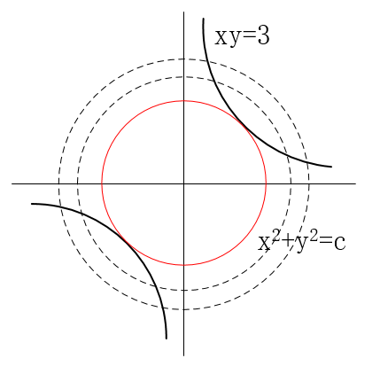
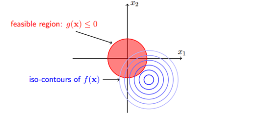
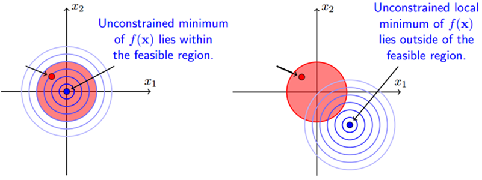
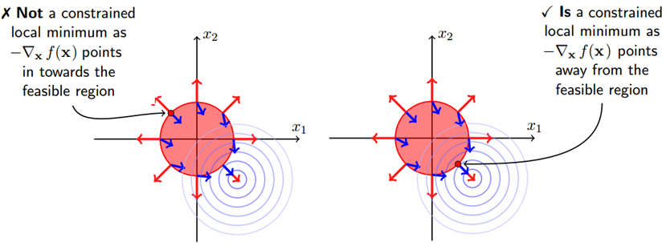
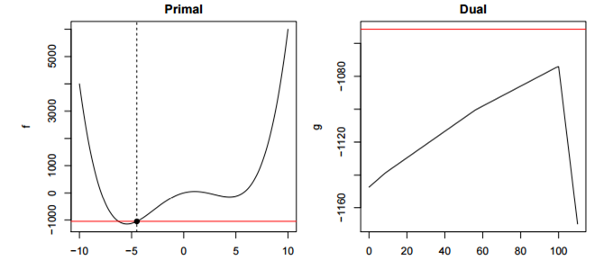

##最优方法（[`scipy.optimize`](https://docs.scipy.org/doc/scipy/reference/tutorial/optimize.html) ）

最优化方法分为无约束优化、约束优化方法。其中梯度下降法、牛顿法、共轭方向共轭梯度法，而约束优化算法最常用的就是拉格朗日乘数法。

###1.1 梯度下降法（Gradient Descent）

当目标函数是凸函数时，梯度下降法的解是全局解。一般情况下，其解不保证是全局最优解，梯度下降法的速度也未必是最快的。梯度下降法的优化思想是用当前位置负梯度方向作为搜索方向，因为该方向为当前位置的最快下降方向，所以也被称为是”最速下降法“。梯度下降法在接近最优解的区域收敛速度明显变慢，利用梯度下降法求解需要很多次的迭代。

牛顿法的缺点：1. 靠近极小值时收敛速度减慢，如下图所示；2 . 直线搜索时可能会产生一些问题；3. 可能会“之字形”地下降。

例子：对于一个线性回归（Linear Logistics）模型，假设h(x)是要拟合的函数，$J(\theta)$ 为损失函数，$\theta$ 是参数，要迭代求解的值，$\theta$ 求解出来了，最终要拟合的函数$h(\theta)$ 就求出来的。
$$
h(\theta) = \sum_{j=0}^{n}\theta_jx_j ，其中n为特征个数\\
J(\theta) = \frac{1}{2m} \sum_{i=1}^{m}(y_i - h_{\theta}(x^i))^2，其中m为训练集样本个数 \\
梯度向量 \ grad(J(\theta_1, \theta_2, ..., \theta_n)) = \bigtriangledown J(\theta_1, \theta_2, ..., \theta_n) \\
= (\frac{\partial{J(\theta)}}{\partial{\theta_1}}, \frac{\partial{J(\theta)}}{\partial{\theta_2}}, ... \frac{\partial{J(\theta)}}{\partial{\theta_n}})\\ 
沿梯度方向函数变化最快的方向！
$$
**(1). 批量梯度下降法(Batch Gradient Descent，BGD)**

1. 将$J(\theta)$ 对$\theta$ 求偏导，得到每个$\theta$ 对应的梯度
   $$
   \frac{\partial{J(\theta)}}{\partial{\theta_j}} =  - \frac{1}{m}\sum_{i=1}^{m}(y_i - h_{\theta}(x^i))x_j^i
   $$

2. 需要最小化损失函数，所以按每个参数$\theta$ 的`梯度负方向`，来更新每个$\theta$ `(问题： 为什么梯度方向变化值为下一个要更新的值！如何计算！)`
   $$
   \theta_j' = \theta_j +\frac{1}{m}\sum_{i=1}^{m}(y_i - h_{\theta}(x^i))x_j^i
   $$

3. 从上面公式可以注意到，它得到的是一个全局最优解，但是每迭代一步，都要用到训练集所有的数据，如果m很大，那么可想而知这种方法的迭代速度会相当的慢。所以，这就引入了另外一种方法——随机梯度下降。

　对于批量梯度下降法，样本个数m，x为n维向量，一次迭代需要把m个样本全部带入计算，迭代一次计算量为$m * n^2$

**(2). 随机梯度下降法(Random Gradient Descent，RGD)** 

1. 将损失函数写成如下形式，则其中对应的是训练集中每个样本的粒度
   $$
   J(\theta) = \frac{1}{m} \sum_{i=1}^{m} \frac{1}{2}(y^i - h_{\theta}(x^i))^2 = \frac{1}{m} \sum_{i=1}^{m} cos \ t(\theta, (x^i, y^i)) \\
   cos \ t(\theta, (x^i, y^i)) = \frac{1}{2}(y^i - h_{\theta}(x^i))^2
   $$

2. 对$\theta$ 求偏导，得到对应的梯度用于更新$\theta$ 
   $$
   \theta_j' = \theta_j +(y^i - h_{\theta}(x^i))x_j^i
   $$
   随机梯度下降是通过每个样本来迭代更新一次，如果样本量很大的情况（例如几十万），那么可能只用其中几万条或者几千条的样本，就已经将theta迭代到最优解了，对比上面的批量梯度下降，迭代一次需要用到十几万训练样本，一次迭代不可能最优，如果迭代10次的话就需要遍历训练样本10次。但是，RGD伴随的一个问题是噪音较BGD要多，使得RGD并不是每次迭代都向着整体最优化方向。

3. 随机梯度下降每次迭代只使用一个样本，迭代一次计算量为$n^2$，当样本个数m很大的时候，随机梯度下降迭代一次的速度要远高于批量梯度下降方法。两者的关系可以这样理解：随机梯度下降方法以损失很小的一部分精确度和增加一定数量的迭代次数为代价，换取了总体的优化效率的提升。增加的迭代次数远远小于样本的数量。

`总结`

批量梯度下降---最小化所有训练样本的损失函数，使得最终求解的是全局的最优解，即求解的参数是使得风险函数最小，但是对于大规模样本问题效率低下。

随机梯度下降---最小化每条样本的损失函数，虽然不是每次迭代得到的损失函数都向着全局最优方向， 但是大的整体的方向是向全局最优解的，最终的结果往往是在全局最优解附近，适用于大规模训练样本情况。

###1.2 牛顿法和拟牛顿法（Newton's method & Quasi-Newton Methods）

**(1) 牛顿法（Newton's method）**

牛顿法是一种在实数域和复数域上近似求解方程的方法。方法使用函数f (x)的泰勒级数的前面几项来寻找方程f (x) = 0的根。牛顿法最大的特点就在于它的收敛速度很快。

首先，选择一个接近函数 f (x)零点的$x_0$ ，计算相应的$f(x_0)$ 和切线斜率$f'(x_0)$ ，然后计算穿过点$(x_0, \ f(x_0))$ 并且斜率为$f'(x_0)$ 的直线与x轴交点的x坐标，即求解方程
$$
x \cdot f'(x_0) + f(x_0) - x_0 \cdot f'(x_0) = 0
$$
将新求得的x坐标命名为$x_1$ ，通常$x_1$ 会比$x_0$ 更接近方程$f(x)=0$的解，然后就可以用$x_1$ 进行下一轮的迭代，迭代公式如下所示
$$
x_{n+1} = x_n + \frac{f(x_n)}{f'(x_n)}
$$
已证明，如果$f'(x)$ 是连续的并且待求的`零点x孤立`的，那么在零点周围存在一个区域，只要初始值$x_0$ 位于这个邻近区域内，那么牛顿法必定`收敛`。若$f'(x) \ne 0$ ，那么牛顿法将具有平方收敛性能，即每迭代一次，牛顿结果的有效数字增加一倍。由于牛顿法是基于当前位置的切线来确定下一次的位置，所以牛顿法又被很形象地称为是"切线法"。牛顿法的搜索路径（二维情况）如下图所示

`牛顿法与梯度下降效率对比` 

从本质上去看，牛顿法是二阶收敛，梯度下降是一阶收敛，所以牛顿法就更快。如果更通俗地说的话，比如你想找一条最短的路径走到一个盆地的最底部，梯度下降法每次只从你当前所处位置选一个坡度最大的方向走一步，牛顿法在选择方向时，不仅会考虑坡度是否够大，还会考虑你走了一步之后，坡度是否会变得更大。所以，可以说牛顿法比梯度下降法看得更远一点，能更快地走到最底部。（牛顿法目光更加长远，所以少走弯路；相对而言，梯度下降法只考虑了局部的最优，没有全局思想。）

　　根据wiki上的解释，从几何上说，牛顿法就是用一个二次曲面去拟合你当前所处位置的局部曲面，而梯度下降法是用一个平面去拟合当前的局部曲面，通常情况下，二次曲面的拟合会比平面更好，所以牛顿法选择的下降路径会更符合真实的最优下降路径。其中红色为牛顿法的迭代路径，绿色为梯度下降的迭代路径。

`牛顿法的优缺点总结`

- 优点：二阶收敛，收敛速度快；
- 缺点：牛顿法是一种迭代算法，每一步都需要求解目标函数的Hessian矩阵的逆矩阵，计算比较复杂。

上述（1）中的牛顿法采用求根方式得到，对于最优化问题其极值点处有一个特性：在极值点处函数的一阶导数为0，因此可以在一阶导数处利用牛顿法通过迭代方式求最优解（求一阶导数对应函数的根），我们也可以通过函数在$x_k$ 点进行二阶泰勒展开
$$
f(x) = f(x_k) + f'(x_k)(x - x_k) + \frac{1}{2}f''(x_k)(x - x_k)^2 \\
\downarrow \\
\frac{f(x) - f(x_k)}{x - x_k} = f'(x_k) + f''(x_k)(x - x_k)
\downarrow  \\
当x  \rightarrow x_k时，f'(x) = f'(x_k) + f''(x_k)(x - x_k)，假定点x_{k+1}是一阶导数的根，则有 \\
f'(x_k + 1) = f'(x_k) + f''(x_k)(x_{k+1} - x_k) = 0 \\
\downarrow \\
x_{k+1} = x_k - \frac{f'(x_k)}{f''(x_k)}
$$
因此我们得到了一个不断更新x迭代求得最优解的方法。以上是针对单变量求得的结果，对多变量就要引入雅克比矩阵（[Jacobian](http://jacoxu.com/?p=146)）和海森矩阵（[Hessian](http://jacoxu.com/?p=146)），雅克比矩阵为函数对各自变量的一阶导数，海森矩阵为函数对自变量的二次微分。
$$
令x = (x_1, x_2, ..., x_n)多元变量构成行向量，则f(x)为对应的函数值，则对f一阶求导 \\
雅克比矩阵 \ J_f(x_1, x_2, ..., x_n) = \frac{\partial (y_1, y_2, ..., y_m) }{\partial (x_1, x_2, ..., x_n) } = 
\left[ \begin{matrix}
\frac{\partial y_1}{\partial x_1} & \frac{\partial y_1}{\partial x_2} & ... & \frac{\partial y_1}{\partial x_n} \\
\frac{\partial y_2}{\partial x_1} & \frac{\partial y_2}{\partial x_2} & ... & \frac{\partial y_2}{\partial x_n} \\
... & ... & ... & ... \\
\frac{\partial y_m}{\partial x_1} & \frac{\partial y_m}{\partial x_2} & ... & \frac{\partial y_m}{\partial x_n} \\
\end{matrix}\right] \\
\quad \\
海森矩阵 \  \ H(x_1, x_2, ..., x_n) = \frac{\partial f }{\partial x } = 
\left[ \begin{matrix}
\frac{\partial^2 f}{\partial^2 x_1} & \frac{\partial^2 f}{\partial x_1 \partial x_2 } & ... & \frac{\partial f}{\partial x_1 \partial x_n} \\
\frac{\partial^2 f}{\partial x_2 \partial x_1} & \frac{\partial^2 f}{\partial^2 x_2 } & ... & \frac{\partial f}{\partial x_2 \partial x_n} \\
... & ... & ... & ... \\
\frac{\partial^2 f}{\partial x_n \partial x_1} & \frac{\partial^2 f}{\partial x_n \partial x_2 } & ... & \frac{\partial^2 f}{ \partial^2 x_n} \\
\end{matrix}\right] \\
$$

$$
例1： y_1 = x_1,  \ y_2=5x_3, \ y_3 = 4x_2^2 - 2x_3, \  y_4 = x_3sin(x_1), 则对应的雅克比矩阵为 \\
J_f(x_1, x_2, x_3) =
\left[ \begin{matrix}
\frac{\partial y_1}{\partial x_1} & \frac{\partial y_1}{\partial x_2} &\frac{\partial y_1}{\partial x_3}  \\
\frac{\partial y_2}{\partial x_1} & \frac{\partial y_2}{\partial x_2} &\frac{\partial y_2}{\partial x_3}  \\
\frac{\partial y_3}{\partial x_1} & \frac{\partial y_3}{\partial x_2} &\frac{\partial y_3}{\partial x_3}  \\
\frac{\partial y_4}{\partial x_1} & \frac{\partial y_4}{\partial x_2} &\frac{\partial y_4}{\partial x_3} \\
\end{matrix}\right]  = 
\left[ \begin{matrix}
1 & 0&0 \\
0 & 0&5  \\
0 & 8x_2 &-2  \\
x_3 cos(x_1) & 0 &xin(x_2)  \\
\end{matrix}\right] \\
例子2：f(x) = x_1^2 + 2x_1x_2 + 3x_2^2 + 4x_1 + 5x_2 + 6，则对应的海森矩阵为 \\
H(x_1, x_2) = \frac{\partial f }{\partial x } = 
\left[ \begin{matrix}
\frac{\partial^2 f}{\partial^2 x_1} & \frac{\partial^2 f}{\partial x_1 \partial x_2 }  \\
\frac{\partial^2 f}{\partial x_2 \partial x_1} & \frac{\partial^2 f}{\partial^2 x_2 }  \\
\end{matrix}\right] = 
\left[ \begin{matrix}
2 & 2  \\
2 &  6 \\
\end{matrix}\right] \\
$$

对于高维函数，其一阶导数为雅克比矩阵，记为$J_f(x)$。其二阶导数就变为了一个海森矩阵，记为$H(x)$  ，则牛顿迭代公式就变为
$$
x_{k+1} = x_k - \frac{f'(x_k)}{f''(x_k)} \\
\downarrow \\
x_{k+1} = x_k - H^{-1}_k\cdot g_k ，\quad(令 g_k = J_f(x_k))\\
$$
上述的牛顿法需要计算Hessian矩阵的逆矩阵，运算复杂度太高，在动辄百亿、千亿量级特征的大数据时代，模型训练耗时太久。当$H_{k}$ 为正定时，$H_{k}^{-1}$ 也为正定，可以保证牛顿法搜索的方向是向下搜索。当目标函数是二次函数时，由于二次泰勒展开函数与原目标函数不是近似而是完全相同的二次式，海森矩阵就退化成一个常数矩阵，从任意点出发，只需一步迭代就可达到f(x)的极小值。因此牛顿法具有`二次收敛性` ；对于非二次函数，若函数的二次性态较强，或迭代点金进入极小点邻域，则其收敛速度也是很快。

原始牛顿法由于迭代公式中没有步长因子，而是定步长迭代，对于非二次型目标函数，会使函数值上升出现$f(x_{k+1})  \gt  f(x_k)$ 的情况，说明牛顿法不能保证函数值稳定下降，严重情况下会因为迭代点序列$\{x_k\}$ 发散而导致计算失败。

**阻尼牛顿法** 

阻尼牛顿法每次迭代的方向仍采用牛顿方向 $d_k = - H^{-1}_k \cdot g_k$ ，但是每次迭代需沿此方向做一维搜索（linear search），需要最优步长因子$\lambda_k$ 
$$
\lambda_k = arg \  min_{\lambda \in R} \ f(x_k + \lambda \ d_k)
$$
`阻尼牛顿算法`

1. 给定初始值$x_0$ 和进度阈值$\epsilon$ ，并令k=0
2. 计算$g_k$ 和$H_k$
3. 若$||g_k|| \lt \epsilon$ ，则停止迭代；否则确定搜索方向$d_k = -H^{-1}_k \cdot g_k$
4. 利用最优步长因子$\lambda_k$ ，得到$x_{k+1} = x_k + \lambda_k \ d_k$
5. 令k=k+1，转至步2

**(2) 拟牛顿法（Quasi-Newton Methods）**

拟牛顿法是`求解非线性优化问题`最有效的方法之一。拟牛顿法的本质思想不用二阶偏导数而构造出可以近似海森矩阵逆的正定对称阵，在`拟牛顿条件`下优化目标函数。从而简化了运算的复杂度。

拟牛顿法和最速下降法一样只要求每一步迭代时知道目标函数的梯度。通过测量梯度的变化，构造一个目标函数的模型使之足以产生超线性收敛性。这类方法大大优于最速下降法，尤其对于困难的问题。另外，因为拟牛顿法不需要二阶导数的信息，所以有时比牛顿法更为有效。如今，优化软件中包含了大量的拟牛顿算法用来解决无约束，约束，和大规模的优化问题。

特点：1. 只需用到函数的一阶梯度，而Newton法用到二阶Hessian阵；2. 下降算法，故全局收敛；3. 不需求矩阵逆，计算量小；4. 一般可达到超线性收敛，速度快；5. 有二次终结性。

。常用的拟牛顿法有DFP算法和BFGS算法

**拟牛顿条件/方程（割线方程）** 

提出用来近似的矩阵应该满足的条件，为其提供理论指导。下面用B表示对海森矩阵H本身的近似，而用D表示对海森矩阵的逆$H^{-1}$ 的近似，满足$B \approx H, \ D \approx H^{-1}$ 。设经过k+1次迭代后得到$x_{k+1}$ ,此时将目标函数f(x)在$x_{k+1}$ 附近的泰勒展开，取二阶近似得到
$$
f(x) \approx f(x_{k+1}) + \triangledown f(x_{k+1})  (x - x_{k+1}) + \frac{1}{2}  (x - x_{k+1})^T \triangledown^2 f(x_{k+1}) (x - x_{k+1}) \\
 \triangledown f(x) \approx\ \triangledown  f(x_{k+1}) + H_{k+1} \cdot (x -x_{k+1})    \quad (两边同时作用梯度算子 \triangledown) \\
  g_{k+1} - g_k \approx H_{k+1} \cdot (x_{k+1} - x_k)   \quad (取x = x_k，并整理) \\
 令 s_k = x_{k+1} - x_k， \ y_k = g_{k+1} - g_k ，代入可以得到 \\
 \downarrow \\
 y_k \approx H_{k+1} \cdot s_k \quad 或  \quad s_k \approx H^{-1}_{k+1} \cdot y_k   \tag{1}\\
 (拟牛顿条件)
$$
**DFP(Davidon-Fletcher-Powell)**

算法核心是通过迭代方法对$H^{-1}_{k+1}$ 做近似，迭代公式为
$$
D_{k+1} = D_k + \Delta D_k, k=0,1,2,...，其中D_0=I 且  \Delta D_k为正交阵 \tag{2}
$$
其中$\Delta D_k$ 为待定矩阵，假设待定矩阵的形式为
$$
\Delta D_k = \alpha \ u \ u^T + \beta \ v \ v^t \tag{3}
$$
其中$\alpha，\beta$ 为待定系数，$u, \ v \in R^N$ 为待定向量，从形式上看，这种待定公式保证了$\Delta D_k$ `对称性` 。将（3）代入（2）并结合（1）式可以得到
$$
s_k = D_{k+1}  \cdot y_k = (D_k + \alpha \ u\ u^T + \beta \ v \ v^t) \cdot y_k \\
= D_k \ y_k + \alpha \ u \ u^T \ y_k + \beta \ v  \ v^T \ y_k \\
= D_k \ y_k + (\alpha \ u^T \ y_k) \ u + (\beta \ v^T \ y_k) \ v  \ ,  (括号中的两个都是数)  \\
\quad \\
令 \alpha \ u^T \ y_k =1， \quad \beta \ v^T \ y_k = -1 可以得到(u, v为待定)：\\ 
\alpha = \frac{1}{u^T \ y_k}，\beta = - \frac{1}{v^T \ y_k}，代入上式s_k得到：
\quad \\
u - v  =s_k - D_k \ y_k，则可直接令u = s_k , \  v=D_k \ y_k，则有 \\
\quad \\
\alpha = \frac{1}{s_k^T \ y_k}，\beta = - \frac{1}{(D_k \ y_k)^T \ y_k} = -\frac{1}{ y_k^T \ D_k \ y_k} \tag{4}
$$
将（4）是计算出来的$\alpha， \beta$ 结果代入（3）式就可以得到校正矩阵$\Delta D_k$ 
$$
\Delta D_k =  \frac{s_k \ s_k^T}{s_k^T \ y_k} -\frac{D_k \ y_k  \ y_k^T \ D_k}{ y_k^T \ D_k \ y_k} \\
\quad \\
则D_k 的修正公式为：D_{k+1} = D_k +  \frac{s_k \ s_k^T}{s_k^T \ y_k} -\frac{D_k \ y_k  \ y_k^T \ D_k}{ y_k^T \ D_k \ y_k}
$$
DEP算法步骤

1. 给定初始值$x_0$ 和进度阈值$\epsilon$ ，并令$D_0 = I, k=0$ ；
2. 确定搜索方向为$d_k = - D_k \cdot g_k$
3. 利用阻尼牛顿法得到的步长因子$\lambda_k$ ，令$s_k = \lambda_k \ d_k, \quad x_{k+1} = x_k + s_k$ ；
4. 若$||g_k+1|| \lt \epsilon$ ，则算法结束
5. 计算$y_k = g_{k+1} - g_k$
6. 计算$D_{k+1} = D_k +  \frac{s_k \ s_k^T}{s_k^T \ y_k} -\frac{D_k \ y_k  \ y_k^T \ D_k}{ y_k^T \ D_k \ y_k}$ 
7. 令k = k + 1，转到步骤2

**DEP算法举例**
$$
用DEP算法求解 f(x_1, x_2) = 10x_1^2 + x_2^2？
\quad \\
 取初始值 x^{(1)} = \left [ \begin{matrix}  \frac{1}{10} \\ 1 \end{matrix}   \right]， H^{(1)} = I \ (单位矩阵)， \triangledown f(x) = \left [ \begin{matrix}  20x_1 \\ 2x_2 \end{matrix}   \right]，d=-H \triangledown f(x) \\

s^{(k)} = x_{k+1} - s_k，\quad y^{(k)} =  \triangledown f(x^{k+1}) - \triangledown f(x^{k})  ，计算过程如下：\\
\begin{matrix}
k & x_{(k)} & \triangledown f(x^{k}) & H^{(k)} & d^{(k))} & \lambda_k & s^{(k)} & y^{(k)} \\
1 & \left [ \begin{matrix}  \frac{1}{10} \\ 1 \end{matrix}   \right] & \left [ \begin{matrix} 2 \\ 2 \end{matrix}   \right] & \left [ \begin{matrix}  1 & 0 \\0 &  1 \end{matrix}   \right] &  \left [ \begin{matrix} -2 \\ -2 \end{matrix}   \right]  & -\frac{1}{11} &   \left [ \begin{matrix} -\frac{2}{10} \\ -\frac{2}{10} \end{matrix}   \right] & \left [ \begin{matrix} -\frac{40}{11} \\ -\frac{4}{11} \end{matrix}   \right] \\

2 & \left [ \begin{matrix}  -\frac{9}{110} \\ \frac{9}{11}  \end{matrix}   \right] & \left [ \begin{matrix} -\frac{18}{11} \\ \frac{18}{11}  \end{matrix}   \right] & \frac{1}{2222} \left [ \begin{matrix}  123 &-119\\-119&2301 \end{matrix}   \right] &  \left [ \begin{matrix} 1\\ -10\end{matrix}   \right]  & -\frac{9}{110}& \\

3 & \left [ \begin{matrix}  0 \\ 0 \end{matrix}   \right] & \left [ \begin{matrix} 0 \\ 0 \end{matrix}   \right]  & 停\\

\end{matrix}

\quad \\
第一步： d^{(1)} = -H^{(1)} \triangledown f(x^{(1)}) = \left [ \begin{matrix} -2 \\ -2 \end{matrix}   \right]，x^{(1)}+\lambda d^{(1)} = \left [ \begin{matrix}  \frac{1}{10} & -2\lambda \\1 &  -2\lambda \end{matrix}   \right] ，\\
一维搜索： \begin{cases}  min f(x^{(1)} + \lambda d^{(1)}) = 10(\frac{1}{10} - 2\lambda)^2 + (1-2\lambda)^2 \\ s.t. \quad \lambda \ge 0 \end{cases}，\\
求f(x^{(1)} + \lambda d^{(1)}) 的驻点：f' = 40(\frac{1}{10} - 2\lambda)^2 -4 (1-2\lambda) = 0 \rightarrow \lambda = \frac{1}{11} \\
于是x^{(2)} = x^{(1)} + \lambda_1 d^{(1)} = (-\frac{9}{110} , \frac{9}{11} )^T \\

\quad \\
第二步：\triangledown f(x^{(2)}) = (-\frac{18}{11} , \frac{18}{11} )^T ，s^{(1)} = x^{(2)} - x^{(1)} = (-\frac{2}{11} , -\frac{2}{11}  )^T，\\
y^{(1)} = \triangledown f(x^{(2)}) - \triangledown f(x^{(1)})  =  (-\frac{40}{11} , \frac{4}{11} )^T ，\\
H^{(2)} =H^{(1)} +  \frac{s^{(1)} \ (s^{(1)})^T}{(s^{(1)})^T \ y^{(1)}} -\frac{H^{(1)} \ y^{(1)} \ (y^{(1)})^T \ H^{(1)}}{ (y^{(1)})^T \ H^{(1)} \ y^{(1)}} \\
(s^{(1)})^T \ y^{(1)} = \frac{8}{11}，H^{(1)} \ y^{(1)}= y^{(1)}， (y^{(1)})^T \ H^{(1)} \ y^{(1)}=\frac{1616}{121} \\
s^{(1)} \ (s^{(1)})^T = \left [ \begin{matrix}  \frac{4}{121} & \frac{4}{121} \\\frac{4}{121} &  \frac{4}{121} \end{matrix}   \right] ，H^{(1)} \ y^{(1)} \ (y^{(1)})^T \ H^{(1)} = \left [ \begin{matrix}  \frac{1600}{121} & \frac{160}{121} \\\frac{160}{121} &  \frac{16}{121} \end{matrix}   \right] \\
H^{(2)} =   \left [ \begin{matrix}  1 & 0 \\0 &  1 \end{matrix}   \right]  +   \frac{1}{22} \left [ \begin{matrix}  1 & 1 \\1 &  1 \end{matrix}   \right]  - \frac{1}{101} \left [ \begin{matrix}  100 & 10 \\10 &  1 \end{matrix}   \right]  = \frac{1}{2222}  \left [ \begin{matrix}  123 & -119 \\-119 &  2301 \end{matrix}   \right]  \\
d^{(2)} = - H^{(2)} \triangledown f(x^{(2)}) =\frac{4356}{2222} \left [ \begin{matrix} 1 \\ -10 \end{matrix}   \right]，取d^{(2)} = \left [ \begin{matrix} 1 \\ -10 \end{matrix}   \right] \ (与长度无关) \\
min f(x^{(2)} + \lambda_2 d^{(2)}) = 10(-\frac{9}{110} + \lambda)^2 + (\frac{9}{11} - 10 \lambda)^2，求驻点：\lambda_2 = \frac{9}{110} \\
x^{(3)} = x^{(2)} + \lambda_2 d^{(2)} = (0, 0)^T \\

\quad \\
第三步：\triangledown f(x^{(3)}) =(0, 0)^T 停止，x^{\star} =(0, 0)^T
$$

###1.3 共轭方向与共轭梯度法

####1.3.1 共轭方向法

共轭方向法是介于最速下降法与牛顿法之间的一个方法，它仅需利用一阶导数信息，但克服了最速下降法收敛慢（有锯齿现像）的缺点，又避免了牛顿法需要存储和计算Hessen矩阵并求逆的缺点，共轭梯度法不仅是解决大型线性方程组最有用的方法之一，也是解大型非线性最优化最有效的算法之一。 在各种优化算法中，共轭梯度法是非常重要的一种。其优点是所需存储量小，具有步收敛性，稳定性高，而且不需要任何外来参数。

由于一般目标函数在最优点附近呈现为二次函数，因此可以设想一个算法对于二次函数比较有效，就可能对一般函数也有较好效果。`共轭方向法是在研究对称正定二次函数`的基础上提出来的。
$$
(P_{0})^T Q P_{1} = 0，则称P_0和P_1为Q的共轭向量；\\
当Q为单位向量时，有(P_{0})^T P_{1} = 0，所以“共轭”是“正交”的推广。
$$
对于二次正定函数，从任意点$x_0$出发，沿任意下降方向$P_0$作直线搜索得到$x_1$，再从$x_1$出发，沿与$P_0$共轭的方向$P_1$作直线搜索，即可得到f(x)的极小点。当一组向量$P_i，i \in [0, n-1]$ 为Q的共轭向量时，从任意点出发，依次沿着$P_0，P_1，...，P_{n-1}$ 方向做直线搜索，经过n次迭代必定收敛于正定二次函数的极小值点。

**直线搜索算法** 
$$
\begin{cases}
f(X_k + t_kP_k) = min f(X_k + tP_k) \\
X_{k+1} = X_k + t_kP_k
\end{cases}，为确定最优步长t_k，令 \frac{\partial f(x_{k+1})}{\partial t} = 0求得t_k
$$

**Gram-Schmidt方法产生一组关于Q的共轭向量**
$$
取线性无关的向量组V_0，V_1，...，V_{n-1}，例如取n个坐标轴的单位向量，
\\令P_0 = V_0，则有 P_{k+1} = V_{k+1} - \sum_{j=0}^{k} \frac{P_j^T Q V_{k+1}}{P_j^T Q P_j} P_j
$$

上述方法是针对目标函数为正定二次函数的，对于一般非二次函数，可以通过二次近似
$$
f(X) \approx f(X^{\star}) + \triangledown f(x^{\star})^T(X - X^{\star}) + \frac{1}{2}(X-X^{\star})^T \triangledown^2f(X^{\star})(X-X^{\star})
$$
上述等式为f(x)在极小点$X_{\star}$ 的近似，$\triangledown^2 f(X^{\star})$ 位Hessen矩阵，相当于Q，由于$X^{\star}$ 未知，但当$x_0$ 充分接近于$X^{\star}$ 时，可以用$\triangledown^2 f(X^{0})$ 近似替代$\triangledown^2 f(X^{\star})$ ，从而构造共轭向量。

理论与实践证明，将二次收敛算法用于非二次的目标函数，亦有很好的效果，但迭代次数不一定保证有限次，即对非二次n维目标函数经n步共轭方向一维搜索不一定就能达到极小点。在这种情况下，为了找到极小点，可用泰勒级数将该函数在极小点附近展开，略去高于二次的项之后即可得该函数的二次近似。实际上很多的函数都可以用二次函数很好地近似，甚至在离极小点不是很近的点也是这样。故用二次函数近似代替非二次函数来处理的方法不仅在理论分析上是重要的，而且在工程实际应用中也是可取的。

####1.3.2 共轭梯度法（Conjugate Gradient）

共轭梯度法是共轭方向法的一种延伸，初始共轭向量$P_0$由初始迭代点$X_0$处的负梯度$-g_0$来给出。以后的$P_k$由当前迭代点的负梯度与上一个共轭向量的线性组合来确定
$$
P_{k+1} = -g_{k+1} + a_k P_k ，a_k = \frac{||g_{k+1}||^2}{||g_{k}||}，g_o = \triangledown f(X_0)
$$
对于非二次函数的优化问题，迭代次数不止n次，但共轭方向只有n个。当迭代n次后，可以把$P_n$重新置为最开始的$P_0$，其他的变量按原方法更新。

其中绿色为梯度下降法，红色代表共轭梯度法。

###1.4 解决约束优化问题——拉格朗日乘数法[^1]（Lagrange Multiplier Method）

作为一种优化算法，拉格朗日乘子法主要用于解决约束优化问题，它的基本思想就是通过引入拉格朗日乘子来将含有`n个变量`和`k个约束条件`的约束优化问题转化为含有（n+k）个变量的无约束优化问题。拉格朗日乘子背后的数学意义是其为约束方程梯度线性组合中每个向量的系数。

如何将一个含有n个变量和k个约束条件的约束优化问题转化为含有（n+k）个变量的无约束优化问题？拉格朗日乘数法从数学意义入手，通过引入拉格朗日乘子建立极值条件，对n个变量分别求偏导对应了n个方程，然后加上k个约束条件（对应k个拉格朗日乘子）一起构成包含了（n+k）变量的（n+k）个方程的方程组问题，这样就能根据求方程组的方法对其进行求解。
$$
约束优化问题:min/max a function f(x,y,z), \\
where \ x,y,z \ are \ not \  independent \  and \ g(x,y,z)=0 \\
min/max f(x, y, z) \quad s.t. \quad  g(x, y, z) = 0
$$
例子：求双曲线$xy=3$上离圆点最近的点

该问题是典型的约束优化问题，其数学模型为
$$
min f(x, y) = x^2 + y^2 \quad s.t. \quad xy=3
$$
最简单的一个解法就是通过约束条件将其中的一个变量用另外一个变量进行替换，然后代入优化的函数就可以求出极值。这里我们采用拉格朗日乘数法思想进行求解。如下图所示，当双曲线与圆相切时，切点到原点的距离最短。当f(x,y)的等高线与g(x,y)相切时，我们就可以得到上述优化问题的一个极值（需要进一步计算确定是极大值还是会极小值）。

现在问题转化为求当f(x,y)和g(x,y)相切时，x和y的值是多少？如果两个曲线相切，那么它们的切线相同，即法向量是平行的$\triangledown f // \triangledown g$ ,有两向量平行可以得到$\triangledown f = \lambda* \triangledown g$ ，这时就将原有的约束优化问题转化为了一种对偶的无约束的优化问题。
$$
原问题（约束优化问题）：min f(x,y) = x^2 + y^2 \quad s.t. \quad xy=3 \\
对偶问题（无约束方程组问题）：\triangledown f = \lambda* \triangledown \rightarrow f_x = \lambda * g_x，f_y = \lambda * g_y，xy=3 \\
\downarrow \\
2x=\lambda * x，2y = \lambda * y，xy=3 \\
解的 \lambda=2、\lambda=-2，当\lambda=2时，(x ,y) = (\pm \sqrt{3}, \pm \sqrt{3})；当\lambda=-2时，无解
$$
上述问题通过引入拉格朗日乘子$\lambda$ 将原来的约束优化问题转化为无约束方程组问题。

####1.4.1 等式约束优化问题

求函数$z=f(x, y)$ 在满足$\varphi (x,y)=0$ 下的极值条件，可以转化为函数$F(x, y, \lambda) = f(x,y) + \lambda \varphi (x, y)$的无条件极值问题。

如上图所示，绿线标出的是约束$g(x,y)=c$ 的点的轨迹，蓝线是$f(x,y)$ 的等高线，箭头表示斜率，和等高线的法线平行。从图中可以看到在最优解处，f和g的斜率平行，既有
$$
\triangledown [f(x,y) + \lambda (g(x,y)-1)] = 0，\lambda \ne 0
$$
一旦求出$\lambda$ 值，将其套入下式，就可求出在无约束极值和极值所对应的点
$$
F(x,y) = f(x,y) + \lambda(g(x,y) - c)
$$
新方程F(x,y)在达到极值时与f(x,y)相等，因为F(x,y)达到极值时g(x,y)-c中等于0。上述式子取得极小值时其导数为0，即$\triangledown f(x) + \triangledown \sum \lambda_i g_i(x) = 0$ 也就是说f(x)与g(x)梯度共线。

 **例子1**

给定椭球$\frac{x^2}{a^2} + \frac{y^2}{b^2} + \frac{z^2}{b^2} = 1$ ，求这个椭球的内接长方体的最大体积。即求在条件$\frac{x^2}{a^2} + \frac{y^2}{b^2} + \frac{z^2}{b^2} = 1$ 下，求$f(x, y, z)=8xyz$ 的最大值。

通过`朗格朗日乘数法` 将问题转化为
$$
F(x, y, z, \lambda) = f(x,y,z) + \lambda \varphi(x, y, z) = 8xyz -\lambda (\frac{x^2}{a^2} + \frac{y^2}{b^2} + \frac{z^2}{b^2}-1)
$$
对$F(x,y,x,\lambda)$ 求偏导
$$
\frac{\partial F(x,y,z,\lambda)}{\partial x} = 8yz +\frac{2 \lambda x}{a^2} = 0 \\
\frac{\partial F(x,y,z,\lambda)}{\partial y} = 8xz +\frac{2 \lambda y}{a^2} \\
\frac{\partial F(x,y,z,\lambda)}{\partial z} = 8xy +\frac{2 \lambda z}{a^2} \\
\frac{\partial F(x,y,z,\lambda)}{\partial \lambda} = \frac{x^2}{a^2} + \frac{y^2}{b^2} + \frac{z^2}{b^2}-1 = 0 \\
前三个方程，得到bx=ay和az=cx，代入第四个方程解得：\\
x=\frac{\sqrt{3}}{3}a \quad y=\frac{\sqrt{3}}{3}b \quad z=\frac{\sqrt{3}}{3}c \\
代入解得最大体积为：V_{max}=f(\frac{\sqrt{3}}{3}a, \frac{\sqrt{3}}{3}b,\frac{\sqrt{3}}{3}c) =  \frac{8\sqrt{3}}{9}abc
$$
**例子2** 

拉格朗日乘数法对一般多元函数在多个附加条件下的条件极值问题也适用。求离散分布的最大熵。
$$
离散分布熵f(p_1, p_2, ..., p_n) = - \sum_{k=1}^{n} p_k log_2 p_k，\\
约束为 \ g(p_1, p_2,...,p_n) = \sum_{k=1}^{n} p_k = 1 \\
根据拉格朗日乘数法，设 \\
F(p_1, p_2, ..., p_n, \lambda) = f(p_1, p_2, ..., p_n) + \lambda[g(p_1, p_2,...,p_n) - 1] \\
对所有p_k求偏导，得 \\
\frac{\partial}{\partial p_k}(-\sum_{k=1}^{n}p_k log_2p_k + \lambda(\sum_{k=1}^{n}p_k - 1)) = 0 \\
\downarrow 计算出n个等式的微分\\
-(\frac{1}{ln 2} + log_2p_k) + \lambda = 0，则说明所有的p_k都相等，\\
解得p_k=\frac{1}{n}使得均匀分布可得到最大熵值
$$

#### 1.4.2 不等式约束优化问题与KKT条件

上述讨论的问题均为等式约束优化问题，但等式约束并不足以描述人们面临的问题，不等式约束比等式约束更为常见，大部分实际问题的约束都是不超过多少时间，不超过多少人力，不超过多少成本等等。所以有几个科学家拓展了拉格朗日乘数法，增加了KKT条件之后便可以用拉格朗日乘数法来求解不等式约束的优化问题了。考虑如下不等式约束问题
$$
min_{x} f(x) \quad s.t. \ g(x) \le 0 \\
对应的Lagrangian为：L(x, \lambda) = f(x) + \lambda g(x)
$$
此时，可行解必须落在约束区域g(x)之内，下图是目标函数的等高线与约束

有图可见，可行解x只能在g(x) < 0或者g(x)=0的区域里取得

- 当可行解 x 落在 g(x)<0的区域内，此时直接极小化 f(x)；
- 当可行解 x 落在 g(x)=0 即边界上，此时等价于等式约束优化问题；

当约束区域包含目标函数原有的的可行解时，此时加上约束可行解扔落在约束区域内部，对应 g(x)<0 的情况，这时约束条件不起作用；当约束区域不包含目标函数原有的可行解时，此时加上约束后可行解落在边界 g(x)=0上。下图分别描述了两种情况，右图表示加上约束可行解会落在约束区域的边界上。

以上两种情况就是说，要么可行解落在约束边界上即得 g(x)=0，要么可行解落在约束区域内部（此时约束不起作用，另 λ=0 消去约束即可），所以无论哪种情况都会得到：$\lambda g(x)=0$ ；还有一个问题是 λ 的取值，在等式约束优化中，约束函数与目标函数的梯度只要满足平行即可，而在不等式约束中则不然，若 λ≠0，这便说明 可行解 x是落在约束区域的边界上的，这时可行解应尽量靠近无约束时的解，所以在约束边界上，目标函数的负梯度方向应该远离约束区域朝向无约束时的解，此时正好可得`约束函数的梯度方向`与`目标函数的负梯度方向`应`相同`：
$$
- \triangledown_x f(x) = \lambda \triangledown_x g(x)
$$
上式需要满足的要求是拉格朗日乘子 λ>0，这个问题可以举一个形象的例子，假设你去爬山，目标是山顶，但有一个障碍挡住了通向山顶的路，所以只能沿着障碍爬到尽可能靠近山顶的位置，然后望着山顶叹叹气，这里山顶便是目标函数的可行解，障碍便是约束函数的边界，此时的梯度方向一定是指向山顶的，与障碍的梯度同向，下图描述了这种情况 :

因此， **对于不等式约束，只要满足一定的条件，依然可以使用拉格朗日乘子法解决，这里的条件便是 KKT 条件** ，不等式约束优化问题模型
$$
min_{x}f(x) \ s.t. g_j(x) \le 0 ，h_i(x) =0，其中i=1,2,...,m；j=1,2,...,n \\
对应的Lagrangian无约束优化问题：\\
L(x,\lambda, \mu) = f(x) + \sum_{i=1}^m \lambda_i h_i(x) + \sum_{j=1}^n\mu_j g_j(x) \\
$$
**KKT条件是指在满足一些有规则的条件下, 一个非线性规划(Nonlinear Programming)问题能有最优化解法的一个必要和充分条件.** 这是一个广义化拉格朗日乘数的成果. 一般地, 一个最优化数学模型的列标准形式参考开头的式子, 所谓Karush-Kuhn-Tucker 最优化条件，就是最优点$x^{\star}$必须满足下面的条件

1. $\frac{\partial L(x, \lambda, \mu)}{\partial x}|_{x=x^{\star}} = 0，\triangledown f(x^{\star}) + \sum_{j=1} \ \mu_j \ \triangledown g_j(x^{\star}) +\sum_{i=1} \ \lambda_i \ \triangledown h_i(x^{\star}) = 0$ ，其中$\triangledown$ 为梯度算子拉格朗日取得可行解的必要条件；
2. 不等式约束条件满足$\mu_i \ge 0，\mu_j g_j(x^{\star}) = 0，j=1,2,...,n$ ，又称为松弛互补条件；
3. 满足$g_j(x^{\star}) \le 0，h_i(x^{\star}) = 0，i \in [1,m]，j \in [1,n]$ ，称为初始的约束条件

第一项表明在最优点$x^{\star}$, $\triangledown f$必须是$\triangledown g_i$和$\triangledown h_j$的线性組合, $\mu_i$和$\lambda_j$都叫作拉格朗日乘子； 所不同的是不等式限制条件有方向性, 所以每一个$\mu_i$都必须大于或等于零, 而等式限制条件没有方向性，所以$\lambda_j$没有符号的限制, 其符号要视等式限制条件的写法而定。KKT条件第三项是说最优点$x^{\star}$必须满足所有等式及不等式限制条件, 也就是说最优点必须是一个可行解。下面通过例子说明K

KKT条件是拉格朗日乘子法的泛化，如果我们把等式约束和不等式约束一并纳入进来则表现为
$$
\begin{cases}
L(x, \lambda,\mu) = f(x) + \sum_{i=1}^m \lambda_i h_i(x) + \sum_{j=1}^n \mu_j g_j(x) = 0 \\
\lambda_i \ne 0 \\
h_i(x) = 0 \\
\mu_j \ge 0 \\
g_j(x) \le 0
\end{cases}
$$

####1.4.3 拉格朗日对偶[^2] 

在优化理论中，目标函数 f(x)会有多种形式：如果目标函数和约束条件都为变量 x 的线性函数, 称该问题为**线性规划**； 如果目标函数为二次函数, 约束条件为线性函数, 称该最优化问题为**二次规划**; 如果目标函数或者约束条件均为非线性函数, 称该最优化问题为**非线性规划**。每个线性规划问题都有一个与之对应的**对偶问题**，对偶问题有非常良好的性质，以下列举几个

- 对偶问题的对偶是原问题；
- 无论原始问题是否是凸的，对偶问题都是凸优化问题；
- 对偶问题可以给出原始问题一个下界；
- 当满足一定条件时，原始问题与对偶问题的解是完全等价的；

比如下边这个例子，虽然原始问题非凸，但是对偶问题是凸的
$$
min_{x}(x^4 - 50x^2 + 100x) \quad s.t. \quad x \ge 4.5
$$

**原始问题** 

首先给出不等式约束优化问题
$$
min_{x} f(x) \quad s.t. \quad h_i(x) = 0，g_j(x) \le 0，i \in [1,m]，j \in [1,n]
$$
定义Lagrangian为
$$
L(x, \lambda, \mu) = f(x) + \sum_{i}^{m} \lambda_i h_i(x) + \sum_{j=1}^{n} \mu_j g_j(x)
$$
根据上式得到一个	结论
$$
f(x) = max_{\lambda \mu;\mu_j \ge 0} L(x, \lambda, \mu) \gt L(x, \lambda, \mu)
$$
因为满足约束条件的 x会使得 $h_i(x)=0 $ ，因此去掉第二项；而$g_j(x) \le 0$ 并且$\mu_j \ge 0$ ，因此有$\mu_j g_j(x) \le 0$ ，所以最大值只能在它们取得零时得到，这个时候只剩下f(x)。反之，如果有任意一个约束条件不满足，则只需令其相应的乘子$\rightarrow + \propto$ ，则得到$L(x, \lambda, \mu)\rightarrow + \propto$ ，这样会导致问题无解，因此必须满足约束条件。经过这样一转变，约束都融合到了一起而得到如下的无约束的优化目标：
$$
min_{x} f(x) = min_{x} \ max_{\lambda \mu;\mu_j \ge 0} \ L(x, \lambda, \mu)
$$
**对偶问题** 

上式与原优化目标等价，将之称作原始问题 , 将原始问题的解记做$p^{\star}$，如此便把带约束问题转化为了无约束的原始问题，其实只是一个形式上的重写，方便找到其对应的对偶问题。首先为对偶问题定义一个**对偶函数（dual function）**
$$
D(\lambda, \mu) = min_{x} L(x,\lambda, \mu )
$$
有了对偶函数就可给出对偶问题了，与原始问题的形式非常类似，只是把 min 和 max 交换了一下
$$
max_{\lambda \mu;\mu_j \ge 0} \ min_{x} \  L(x, \lambda, \mu)
$$
然后定义对偶问题的最优解即关于$\lambda，\mu$的函数
$$
d^{\star} =max_{\lambda \mu;\mu_j \ge 0} \ D(\lambda ,\mu)
$$
对偶问题和原始问题的最优解并不相等，而是满足的如下关系
$$
d^{\star} \le p^{\star}
$$
直观地，可以理解为最小里的最大的那个要比最大的中最小的那个要大。具体的证明过程如下：
$$
对偶问题与原始问题的关系：\\
D(\lambda, \mu) =min_{x} L(x,\lambda, \mu ) \le L(x, \lambda, \mu) \le max_{\lambda \mu;\mu_j \ge 0} \  L(x, \lambda, \mu) =f(x) \\
\downarrow D(\lambda, \mu) \le f(x)\\
d^{\star}=max_{\lambda \mu;\mu_j \ge 0} \ D(\lambda ,\mu) \le min_{x}f(x) = p^{\star} \\
通过对偶性，为原问题引入一个下界p^{\star} \ge d^{\star}
$$
这个性质便叫做**弱对偶性（weak duality）**，对于所有优化问题都成立，即使原始问题非凸。这里还有两个概念： $f(x)–D(\lambda,\mu)$ 叫做对偶间隔（duality gap）， $p^∗–d^∗$叫做最优对偶间隔（optimal duality gap）。无论原始问题是什么形式，对**偶问题总是一个凸优化的问题**，这样对于那些难以求解的原始问题 （甚至是 NP 问题），均可以通过转化为偶问题，通过优化这个对偶问题来得到原始问题的一个下界， 与弱对偶性相对应的有一个**强对偶性（strong duality）** ，强对偶即满足
$$
d^{\star}=p^{\star}
$$
强对偶是一个非常好的性质，**因为在强对偶成立的情况下，可以通过求解对偶问题来得到原始问题的解**，在 SVM 中就是这样做的。当然并不是所有的对偶问题都满足强对偶性 ，在 SVM 中是直接假定了强对偶性的成立，其实只要满足一些条件，强对偶性是成立的，比如说 **Slater 条件与KKT条件。**

**Slater条件**
$$
若原始问题为凸优化问题，且存在严格满足约束条件的点x，\\
这里的“严格”是指g_j(x) \le 0严格取到"\lt"，即存在x满足g_j(x) \lt 0,j \in [1,n]，\\
则存在x^{\star}，\lambda^{\star}，\mu^{\star}使得x^{\star}是 \\
原始问题的解，\lambda^{\star}，\mu^{\star}是对偶问题的解，且满足： \\
\qquad p^{\star} = d^{\star} = L(x^{\star}，\lambda^{\star}，\mu^{\star})
$$
也就是说如果原始问题是凸优化问题并且满足 Slater 条件的话，那么强对偶性成立。需要注意的是，这里只是指出了强对偶成立的一种情况，并不是唯一的情况。例如，对于某些非凸优化的问题，强对偶也成立。SVM 中的原始问题 是一个凸优化问题（二次规划也属于凸优化问题），Slater 条件在 SVM 中指的是存在一个超平面可将数据分隔开，即数据是线性可分的。当数据不可分时，强对偶是不成立的，这个时候寻找分隔平面这个问题本身也就是没有意义了，所以对于不可分的情况预先加个 kernel 就可以了。

**KKT条件**

假设$x^{\star}，\lambda^{\star}，\mu^{\star}$分别是原始问题（并不一定是凸的）和对偶问题的最优解，且满足强对偶性，则相应的极值的关系满足
$$
f(x^{\star}) = d^{*} = p^{*} = D(\lambda^{*}， \mu^{*}) \\
=min_{x}f(x)+\sum_{i=1}^{m}\lambda_i^{*} h_i(x)+\sum_{j=1}^{n}\mu_j^{*} g_i(x) \\
\le f(x^{*}) + \sum_{i=1}^{m}\lambda_i^{*} h_i(x)+\sum_{j=1}^{n}\mu_j^{*} g_i(x) \le f(x^{*})
$$
这里第一个不等式成立是因为 $x^∗$为 $L(x,\lambda^∗,\mu^∗)$ 的一个极大值点，最后一个不等式成立是因为$h_i(x^∗)=0$ ,且 $g_j(x^∗) \le 0，\mu_j \ge 0$，（ $\mu_j \ge 0$是原始问题的约束条件）因此这一系列的式子里的不等号全部都可以换成等号。根据公式还可以得到两个结论:

1. 第一个不等式成立是因为 $x^∗$为 $L(x,\lambda^∗,\mu^∗)$ 的一个极大值点，由此可得
   $$
   \triangledown_{x^*} L(x, \lambda^∗,\mu^∗) = 0
   $$

2. 第二个不等式成立，因为原始问题的约束条件$\mu^*_jg_j(x^*) \le 0$ ，由此可得
   $$
   \mu^*_jg_j(x^*) = 0，j \in [1,n]
   $$
   也就是说如果$\mu^*_j \gt 0$ ，则必定有$g_i(x^*) =0 $ ；反过来，如果$g_i(x^*) \lt 0$ 那么可以得到$\mu^*_j = 0$ ，即
   $$
   \begin{cases}
   \mu_j^* \gt 0 \rightarrow \ g_j(x^*) = 0 \\
   g_j(x^*) \lt 0 \rightarrow \ \mu_j^* = 0
   \end{cases}
   $$

上述条件组合在一起就是KKT条件
$$
\begin{cases}
L(x, \lambda,\mu) = f(x) + \sum_{i=1}^m \lambda_i h_i(x) + \sum_{j=1}^n \mu_j g_j(x) = 0 \\
\lambda_i \ne 0 \\
h_i(x) = 0 \\
\mu_j \ge 0 \\
g_j(x) \le 0
\end{cases}
$$
**任何满足强对偶性的优化问题，只要其目标函数与约束函数可微，任一对原始问题与对偶问题的解都是满足 KKT 条件的**。即满足强对偶性的优化问题中，若 $x^∗$为原始问题的最优解，$\lambda^∗,\mu^∗$为对偶问题的最优解，则可得 $x^∗,\lambda^∗,\mu^∗$满足 KKT 条件。

>For any optimization problem with differentiable objective and constraint functions for which strong duality obtains, any pair of primal and dual optimal points must satisfy the KKT conditions. 

上面只是说明了必要性，当满足原始问题为凸优化问题时，充分性也是满足的，也就是说当原始问题是凸优化问题,且存在$x^∗,\lambda^∗,\mu^∗$ 满足 KKT 条件，那么它们分别是原始问题和对偶问题的极值点并且强对偶性成立，证明如下

首先，原始问题是凸优化问题，固定$\lambda^∗,\mu^∗$之后对偶问题 $D(\lambda^∗,\mu^∗)$也是一个凸优化问题，$x^∗$ 是 $L(x,\lambda^∗,\mu^∗)$的极值点:
$$
D(\lambda^*, \mu^*) = min_{x} L(x, \lambda^*, \mu^*) = L(x^*,\lambda^*, \mu^*) \\
=f(x^*) +  \sum_{i=1}^m \lambda_i^* h_i(x^*) + \sum_{j=1}^n \mu_j^* g_j(x^*) = f(x^*)
$$
最后一个式子是根据 KKT 条件中的$ h_i(x)=0​$与 $\mu_jg_j(x)=0​$得到的。这样一来，就证明了对偶间隔为零，也就是说，强对偶成立。 所以当原始问题为凸优化问题时，书中原话为

> For any *convex* optimization problem with differentiable objective and constraint functions, any points that satisfy the KKT conditions are primal and dual optimal, and have zero duality gap.

总结一下。本文介绍了对偶的基本概念，对于一个约束优化问题，找到其对偶问题，当弱对偶成立时，可以得到原始问题的一个下界。而如果强对偶成立，则可以直接求解对偶问题来解决原始问题。 SVM 就是这样的。对偶问题由于性质良好一般比原始问题更容易求解，在 SVM 中通过引入对偶问题可以将问题表示成数据的内积形式从而使得 kernel trick 的应用更加自然）。此外，还有一些情况会同时求解对偶问题与原始问题 ，比如在迭代求解的过程中，通过判断对偶间隔的大小，可以得出一个有效的迭代停止条件。

**例子1** 

考虑一下非线性优化问题P
$$
max \ 3x_1 + 4x_2  \qquad \qquad \qquad \quad\\
s.t. \quad x_1^2+x_2^2 \le 25，x_1,x_2 \ge 0
$$
求解对应的拉格朗日对偶（Lagrangian dual）问题。

对偶问题是对拉格朗日乘子函数求`最小值`不是对x的函数求最大值。

首先将问题转化为标准的朗格朗日问题
$$
min  \ \ -3x_1 - 4x_2  \qquad \qquad \qquad \\
s.t. \quad x_1^2+x_2^2 \le 25，x_1,x_2 \ge 0
$$
然后根据拉格朗日乘数法可以得到拉格朗日函数
$$
L(x_1, x_2, \mu_1, \mu_2, \mu_3)  = -3x_1-4x_2 -\mu_1(x_1^2+x_2^2 - 25) + \mu_2 x_1 + \mu_3 x_3
$$
其中拉格朗日乘子$\mu_1,\mu_2,\mu_3$ 均为非负的，则

上述问题时凸优化问题，可以得到
$$
 f(x) = max_{\mu_1，\mu_2，\mu_3}L(x_1, x_2, \mu_1, \mu_2, \mu_3) ，其中\mu_1, \mu_2, \mu_3  \ge 0\\
 min_{x_1,x_2}f(x) = min_{x_1,x_2}max_{\mu_1，\mu_2，\mu_3}L(x_1, x_2, \mu_1, \mu_2, \mu_3)
$$
对偶函数为
$$
g(\mu_1,\mu_2,\mu_3) = max_{x_1,x_2} 3x_1+4x_2 -\mu_1(x_1^2+x_2^2 - 25) + \mu_2 x_1 + \mu_3 x_3
$$
因此可以得到对偶问题
$$
minimize \quad   \ g(\mu_1,\mu_2,\mu_3) \\
subject \ to \quad   \mu_1,\mu_2,\mu_3  \ge 0
$$

----

[^1]: [拉格朗日乘数法](http://www.cnblogs.com/maybe2030/p/4946256.html)
[^2]: [拉格朗日对偶问题](http://www.cnblogs.com/ooon/p/5723725.html) 