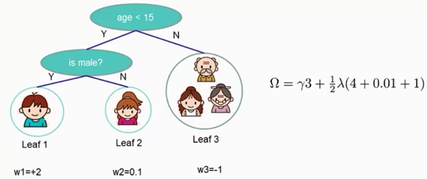
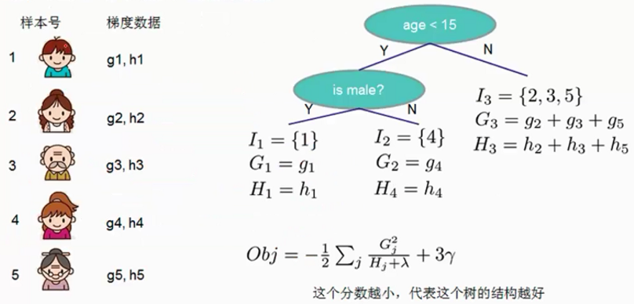
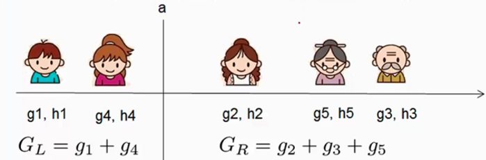
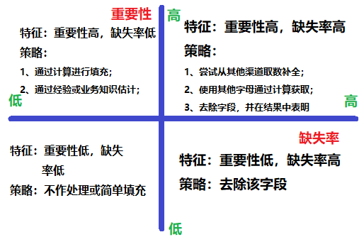
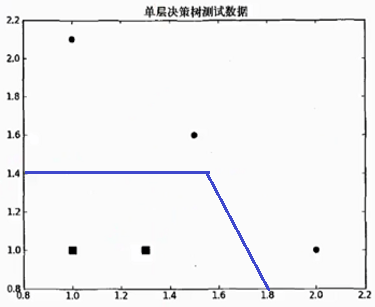
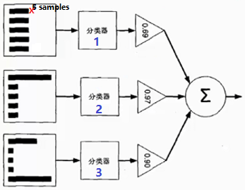
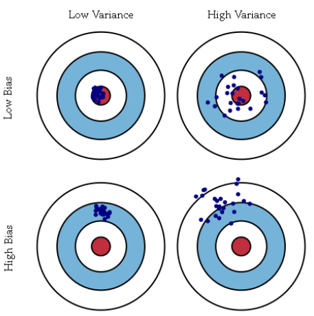

#Boosting提升算法

##1. 提升算法原理

提升是一个机器学习技术，可以用于回归和分类问题，它每一步产生一个弱预测模型，并加权累加到总模型中，如果每一步的弱预测模型生成都是依据损失函数的**梯度方向**，则称之为**梯度提升(Gradient boosting)**，其中梯度提升中的学习步长就是对应弱分类器的权值。提升的理论意义：如果一个问题存在弱分类器，则可以通过提升的办法得到强分类器。梯度提升算法首先给定一个目标损失函数，它的定义域是所有可行的**弱函数集合(基函数)**，然后通过迭代选择一个**负梯度方向**上的基函数来逐渐逼近局部最小值。

给定输入向量x和输出变量y组成的若干训练样本$(x_1,y_1),(x_2,y_2),...,(x_n,y_n)$，目标是找到近似函数$\hat{F(\vec{x})}$，使得损失函数$L(y, F(\vec{x}))$的损失值最小，常用的损失函数有
$$
L(y,F(\vec{x})) = \frac{1}{2}(y - F(\vec{x}))^2 \qquad L(y,F(\vec{x})) = |y - F(\vec{x})|
$$
其中假定$F(\vec{x})$是一族基函数$f_i(\vec{x})$的加权和，即有若干弱分类器构成的强分类器
$$
F(\vec{x}) = \sum_{i=1}^{M}\gamma_i f_i(\vec{x}) + const
$$

1. 均方误差作为损失函数时，最优函数为$F^*(\vec{x})$为

$$
F^*(\vec{x}) = \underset{F}{arg \ min} E_{(x,y)}[L(y, F(\vec{x}))]
$$

​	**证明** 对于$F(\vec{x})=\underset{\gamma}{arg \ min}\sum_{i=1}^{m}L(y_i, \gamma)$，则其最优解为$\gamma^* = \frac{1}{m}\sum_{i=1}^{m}\gamma_i$

2. 绝对值误差作为损失函数时，最优函数为$L(y, F(\vec{x}))$的中位数

   **证明** 给定样本$x_1,x_2,...,x_n$，计算$\mu^*=arg \ min \sum_{i=1}^{n}|x_i - \mu|$ ，为方便推导，由于样本顺序无关，假定样本是递增排序的，则有$J(\mu) = \sum_{i=1}^{n}|x_i - \mu| = \sum_{i=1}^{k}(\mu - x_i) + \sum_{i=k+1}^{n}(x_i - \mu)$，对$J(\mu)$求偏导可以得到$\frac{\partial J(\mu)}{\partial \mu} = \sum_{i=1}^{k}(1) + \sum_{i=k+1}^{n}(-1) = 0$，从而，前k个样本数目与后n-k个样本数目相同，即$\mu$为中位数。

**梯度提升算法推导**

梯度提升算法寻找最优解$F(\vec{x})$，使得损失函数在训练集上的期望最小，一般解法是通过**贪心算法**，假设当前已使用m-1个基函数构成了模型$F_{m-1}(\vec{x})$，当前迭代次数为i，现需要加入$f(\vec{x})$弱分类器，则为得到最优模型$F_m(\vec{x})$则需要求解
$$
F_m(\vec{x}) = F_{m-1}(\vec{x}) + \underset{f \in H}{arg \ min} \sum_{i=1}^{n}L(y_i, F_{m-1}(\vec{x_i}) + f(\vec{x_i}))
$$
即希望加入新的基函数之后，能够使得总的损失值降到最低。但用贪心算法在每次选择最优基函数$f$时任然困难，为此引入**梯度下降法**近似计算，将样本带入基函数$f$得到$f(\vec{x_1}),f(\vec{x_2}),...,f(\vec{x_n})$则$L$退化为向量$L(y_1,f(\vec{x_1})),...,L(y_n,f(\vec{x_n}))$，则有
$$
F_m(\vec{x}) = F_{m-1}(\vec{x}) - \gamma_m \sum_{i=1}^{n}\triangledown_f L(y_i, F_{m-1}(\vec{x_i}))
$$
其中权值$\gamma$为梯度下降的步长，使用**线性搜索**求最优步长
$$
\gamma_m = \underset{\gamma}{arg \ min}\sum_{i=1}^{n}L(y_i, F_{m-1}(\vec{x_i}) - \gamma \cdot \triangledown_f L(y_i, F_{m-1}(\vec{x_i})))
$$
**提升算法流程**

1. 初始给定模型为常数$F_0(\vec{x}) = \underset{\gamma}{arg \min}\sum_{i=1}^{n}L(y_i, \gamma)$
2. 对于m = 1 到M
   1. 计算**伪残差(pseudo residuals)**$r_{im}=[\frac{\partial{L(y_i, F(\vec{x_i}))}}{\partial{F(\vec{x_i})}}]_{F(\vec{x}) = F_{m-1}(\vec{x})}$，其中i=1,2,..,n
   2. 使用数据$\{(\vec{x_i}, r_{im})\}_{i=1}^{n}$计算**拟合残差**的基函数$f_m(x)$，即采用弱分类器进行训练得到最优弱分类器；
   3. 计算步长(一维优化问题)，$\gamma_m = \underset{\gamma}{arg \min}\sum_{i=1}^{m}L(y_i, F_{m-1}(\vec{x_i}) - \gamma \cdot f_m(\vec{x_i}))$ 
   4. 更新模型$F_m(\vec{x}) = F_{m-1}(\vec{x}) - \gamma_m \cdot f_m(\vec{x_i})$


##2. 梯度提升决策树GBDT


##3. xgboost基本原理

设预测值$\hat{y_i} = \sum_j w_j x_{ij}$为样本与权值的线性组合，使用均方误差作为目标函数$L(y_i，\hat{y_i})=(y_i - \hat{y_i})^2$，我们希望目标函数的值越小越好。对于一个样本可以计算其损失值，对于一组样本得到一组损失值，我们希望得到的损失值的均值最小，则最优函数为$F^*(x) = arg \ min E_{x,y} [L(y, F(x))]$，即求样本损失值得期望最小。

**集成算法**表示为
$$
\hat{y_i} = \sum_{k=1}^K f_k(x_i)，f_k \in F，其中F表示模型或分类器的集合
$$
当使用一个分类预测的效果不是很好时，我们希望通过使用集成算法从分类器集合中再拿一个分类器进行组合，那么选择的这个分类的前提是加入的这个分类器能够使得预测效果更好，即每加一个模型进行集成时得到的模型效果时候在逐步提升。xgboost算法中就是逐个添加模型集成，使得添加模型后的算法效果在一直提升。
$$
\hat{y_i}^{(0)} = 0 \qquad \\
\hat{y_i}^{(1)} = f_1(x_i) = \hat{y_i}^{(0)} + f_1(x_i) \\
\hat{y_i}^{(2)} = f_1(x_i) + f_2(x_i) = \hat{y_i}^{(1)} + f_2(x_i) \\
...\\
\underbrace{\hat{y_i}^{(t)}}_{第t轮模型预测} =\sum_{k=1}^{t} f_k(x_i) =\underbrace{ \hat{y_i}^{(t-1)}}_{保留前t-1轮的模型预测} +\underbrace{f_t(x_i)}_{加入一个新模型} \\
$$
**正则化惩罚项**

模型自身也有惩罚项，例如针对决策树模型，叶子节点个数不能太多，容易出现过拟合。在xgboost中的惩罚项为，其中$\lambda$为惩罚力度，$\Omega(f_t)$为正则化惩罚项
$$
\Omega(f_t) = \gamma \cdot \underbrace{T_t}_{叶节点数} + \frac{1}{2} \lambda \underbrace{\sum_{j=1}^{T} w^2_i}_{w的L2模平方}
$$


现在就剩下一个问题，我们如何选择每一轮加入什么f呢？答案是非常直接的，选取一个f使得目标函数尽量最大的降低，目标就是找到$f_t$来优化$Obj^{(t)}$目标函数。
$$
Obj^{(t)} = \sum_{i=1}^{n}L(y_i, \hat{y_i}^{(t)}) + \sum_{i=1}^{t} \Omega(f_i)  \qquad \qquad \qquad  \qquad \ \ \ \ \\
=\sum_{i=1}^{n} L(y_i, \hat{y_i}^{(t-1)} + f_t(x_i)) + \Omega(f_t) + constant \qquad  \quad \ \ \ \\
= \sum_{i=1}^{n}(y_i - (\hat{y_i}^{(t-1)} + f_t(x_i)))^2+ \Omega(f_t) + constant \qquad \ \  \ \\
= \sum_{i=1}^{n}[\underbrace{2(\hat{y_i}^{(t-1)} - y_i)}_{残差} f_t(x_i) + f_t(x_i)^2] + \Omega(f_t) + constant \\
$$
这里我们要计算一个梯度提升的决策树，我们又可以称之为残差决策树。 

xgboost做的工作？假设往银行借钱且能从银行借到$y=1000$的，银行建立了一个决策系统，假设用决策树表示，第一颗决策树计算的结果是能借给我950，那么真实值与预测值之间的残差/损失值为50；然后决策系统有加了一颗树且加了这颗树看到上一次残差为50，通过计算这棵树得到的结果是950 + 30=980；加第三棵树计算上一结果残差为20，进步缩小残差为5，得到预测结果为980+15=995。这就是xgboost的基本原理，加入模型后使得最终预测结果的残差最小。

**目标函数的求解**

目标函数：$Obj^{(t)} =\sum_{i=1}^{n} L(y_i, \hat{y_i}^{(t-1)} + f_t(x_i)) + \Omega(f_t) + constant $

用泰勒展开近似目标函数$f(x+\Delta x) \approx f(x) + f'(x)\Delta x + \frac{1}{2} f''(x) \Delta x^2$可以得到
$$
Obj^{(t)} \approx \sum_{i=1}^{n} L(y_i, \hat{y_i}^{(t-1)} + f_t(x_i)) + \Omega(f_t) + constant \qquad \qquad \\
= \sum_{i=1}^{n}[   L(y_i, \hat{y_i}^{(t-1)})  + g_i f_t(x_i) + \frac{1}{2} h_i f_t^2(x_i)] + \Omega(f_t) + constant \\
\Downarrow L(y_i, \hat{y_i}^{(t-1)}) 常数项 \\
=  \sum_{i=1}^{n}[ g_i f_t(x_i) + \frac{1}{2} h_i f_t^2(x_i)] + \Omega(f_t) + constant  \qquad \qquad  \qquad  \quad \\

g_i = \frac{\partial  L(y_i, \hat{y_i}^{(t-1)})}{\partial \hat{y_i}^{(t-1)}} \qquad h_i = \frac{\partial^2  L(y_i, \hat{y_i}^{(t-1)})}{\partial ^2\hat{y_i}^{(t-1)}} \\
$$
将惩罚项带入化简后的目标函数中，将在样本上的遍历转换为在叶子节点上的遍历
$$
Obj^{(t)} \approx  \sum_{i=1}^{n}[ g_i f_t(x_i) + \frac{1}{2} h_i f_t^2(x_i)] + \Omega(f_t)   \ （样本上遍历） \\
=  \sum_{i=1}^{n}[ g_i w_{q(x_i)} + \frac{1}{2} h_i w^2_{q(x_i)} ] + \gamma T + \lambda \frac{1}{2} \sum^T_{j=1} w_j^2 \ （样本上遍历） \\
\Downarrow 按照落在相同叶节点的不同样本累加进行替换\\
=  \sum_{j=1}^{T} [ (\sum_{i \in I_j} g_i) w_j + \frac{1}{2}(\sum_{i \in I_j }h_i + \lambda) w_j^2] + \gamma T \ （叶子节点上遍历） \\
\Downarrow G_j = \sum_{i \in I_j} g_i \qquad  H_j = \sum_{i \in I_j }h_i  \\
=\sum_{j=1}^{T} [ G_j w_j + \frac{1}{2}(H_j + \lambda) w_j^2] + \gamma T  \qquad \qquad \qquad \qquad \qquad \qquad \\
$$
求目标函数$Obj^{(t)}$在权值参数$w_j$为何值时目标函数值最小，只需要对其进行一阶求导即可得到$w_j$的值
$$
\frac {\partial J(f_t)}{ \partial w_j} = G_j + (H_j + \lambda) w_j = 0 \Rightarrow w_j =  -\frac{G_j}{H_j + \lambda}
$$
带入目标函数可以得到
$$
J(f_t) = - \frac{1}{2} \sum_{j=1}^{T}\frac{G^2_j}{H_j + \lambda} + \gamma T
$$
$J(f_t)$代表了当我们指定一个树的结构时，我们在目标上面最多减少多少。我们可以称之为结构分数(Structure Score)。可以认为这个就是类似基尼系数一样更加一般的对于树结构进行打分的函数。

**范例** 打分函数的计算方式如下图所示，有三个叶子节点$I_1，I_2，I_3$，其中$I_1$上有1号样本，$I_2$上有4号样本，$I_3$上有2,3,5号样本



通过上述推导的函数可以作为代替信息增益、基尼系数用于判断是否拆分子树的标准。通过将拆分前的结构分数减去拆分后的结构分数得到信息增益为
$$
Gain = \frac{1}{2} [\frac{G_L^2}{H_L + \lambda} + \frac{G_R^2}{H_R + \lambda} - \frac{(G_L + G_R)^2}{G_L + G_R + \lambda}] - \gamma
$$
对于每一次扩展，如何高效地枚举所有的分割呢？借鉴ID3/ID4.5/CART的做法，使用贪心算法：

1. 对于某个可行划分，计算划分后的$J(f_t)$;
2. 对于所有可行划分，选择$J(f_t)$降低最小的分割点；



总结：xgboost算法可以得到一个求损失函数的公式，我们就能够计算每一个样本的损失函数值是多少，这样就可以用损失函数值建立模型，即该如何切分节点。

##4. xgboost使用



```python
from numpy import loadtxt
from xgboost import XGBClassifier
from xgboost import plog_importance
from sklearn.model_selection import train_test_split
from sklearn.metrics import accuracy_score

datasets = loadtxt('pima-indians-diabetes.csv', delimiter=',')

# split data into X and y
X = datasets[:, 0:8]
Y = datasets[:, 8]

# split data into train and test sets
seed = 7
test_size = 0.33
X_train, X_test, Y_trian, Y_test = train_test_split(X,Y, test_size=test_size, trandom_state=seed)

# fit model no training data
model  = XGBClassifier()
model.fit(X_train, Y_trian)

# 显示每个特征的重要程度
plog_importance(model)
pyplot.show()
"""
在
early_stopping_rounds： 连续多少次 loss值没有减少
eval_metrics： 指定loss评估函数
eval_set：每加入一个模型都用该数据进行测试
verbose：打印详细信息
"""
# eval_set = [(X_test, Y_test)]
# model.fit(X_train, Y_trian, early_stopping_rounds=10, eval_metrics='logloss',eval_set=eval_set, verbose=True)

# make predictions for test data
y_pred = model.predict(X_test)
predicitions = [round(value) for value in y_pred]

# evaluate predictions
accuracy = accuracy_score(Y_test, predicitions)
print("Accuracu: %.2f%%" % (accuracy * 100.0))
```

**xgboost参数调节**

```python
from numpy import loadtxt
from xgboost import XGBClassifier 
from sklearn.model_selection import GridSearchCV
from sklearn.model_selection import StratifiedFold
"""
常见的参数
1、learning_rate，基本是0.1以下
2、xgboost采用树模型建立，因此需要指定树的参数
    max_depth、min_child_wight、subsample、colsample_bytree、gamma
3、正则化参数，lambda、alpha
"""
dataset = loadtxt('pima-indians-diabetes.csv', delimiter=',')

X = dataset[:, 0:8]
Y = dataset[:, 8]
model = XGBClassifier(
    learning_rate = 0.001, # 学习率
    n_estimators = 1000,   # 模型个数
    max_depth = 5,         # 树的最大深度
    min_child_weight = 1,  # 叶节点最小权重系数
    gamma = 0,             # 惩罚项中的系数，通常取比较小的值
    subsample = 0.8,       # 建立树模型时，随机选择80%个样本
    colsample_bytree = 0.8,# 选特征时，随机选择80%建立模型 
    objective = 'binart:logistic', # 损失函数
    nthread = 4,           # 线程数
    scale_pos_weight = 1,  # 若样本是不均衡，可以均衡样本
    seed = 27              # 随机种子
)

# grid search
learning_rate = [0.0001, 0.001, 0.01, 0.2,0.3]
param_grid = dict(learning_rate=learning_rate)
kfold = StratifiedFold(n_splits=10, shuffle=True, random_state=7)
grid_search = GridSearchCV(model, param_grid, scoring='neg_log_loss', n_jobs=1, cv=kfold)
grid_result = grid_search.fit(X, Y)

# summariz results
print('Best: %f using %s' % (grid_result.best_score_, grid_result.best_params_))
means = grid_result.cv_results_['mean_test_score']
params = grid_result.cv_results_['params']
for mean, param in zip(means, params):
    print('%f with: %r' % (mean, param))
```

##5. Adaboost

Adaboost（Adaptive Boosting，自适应增强）有Yoav Freund 和Robert Schapire在1995年提出。它的自适应在于：前一个基本分类器分错的样本会得到加强，加权后的全体样本再次被用来训练下一个基本分类器。同时，在每一轮中加入一个新的弱分类器，直到达到某个预定的足够小的错误率或达到预先指定的最大迭代次数。

考虑下面两组数据，若采用单层决策树对其进行分割，无论在哪里换一天线都不能将数据完全分开，那么能不能切两刀实现数据分类呢！Adaboost就是将多个弱分类器集成在一起实现分类。



**Adaboost原理**

如下图所示，通过分类器1训练5个样本得到一个模型，但是我们之后其中有一个样本分类错误，那么下一次再用这些样本进行训练时，这个错误的样本就需要尤为关注。为此，我们在下一次训练时对样本添加权重，将这个错误的样本的权重增加，其他样本由于分类正确将其权重较小，然后将其在分类器2中进行训练，训练结束后在检查有哪些样本分类错误的，在增加错误的样本权重，调小分类正确的样本权重，如此反复使用多个弱分类器训练样本，每个分类器使用的样本权重都是不一样的。在训练结束后，通过交叉验证得到每个分类器的得分，分类器表现好打分就高，下图中三个分类器的得分或精度分别为0.69、0.97、0.90，那么得到最终的模型为：$0.69*Model1 + 0.97*Model2 + 0.90*Model3$

训练过程如下：

1. 初始化训练数据的权值分布，如果有n个样本，则每一个训练样本最开始时都被赋予相同的权重$\frac{1}{N}$；
2. 训练弱分类器。具体训练过程中，如果某个样本点已经被准确地分类，那么在构造下一个训练集中，它的权重就被降低；相反，如果某个样本点没有被准确分类，那么它的权重就得到提高。然后，权重更新过的样本集被用于训练下一个分类器，整个训练过程如此迭代进行下去；
3. 将各个训练得到的弱分类器组合成强分类器。各个弱分类器的训练过程结束后，加大分类误差率小的弱分类器的权重，使其在最终的分类函数中起着较大决定作用，而降低分类误差率大的弱分类器权重，使其在最终的分类函数中起着较小的决定作用。即误差率低的弱分类器在最终分类器中占的权重较大，否则较小。



**Adaboost算法流程**

给定一个训练数据集$T=\{(x_1,y_1), (x_2,y_2),...(x_n,y_n)\}$，其中实例$x \in X$，而实例空间$X \in R^n$，$yi$ 属于标记集合 $\{-1, +1\}$ ，Adaboost的目的就是从训练数据中学习一系列弱分类器或基本分类器，然后将这些弱分类器组合成一个强分类器。

1. 初始化训练数据的权值分布。每一个训练样本最开始时都被赋予相同的权重$\frac{1}{N}$
   $$
   D_1 = \{w_{11},w_{12},w_{13},...w_{1N}\}，w_{1i} = \frac{1}{N}，i=1,2,3,...,N
   $$

2. 进行多轮迭代，用$m=1,2,...M$表示迭代的轮次

   1. 使用具有权值分布的$D_m$训练数据集学习，得到基本分类器
      $$
      G_m(x)：X \rightarrow \{-1, +1\}
      $$

   2. 计算$G_m(x)$在训练数据集上的分类误差率
      $$
      e_m = P(G_m(x_i) \ne y_i) = \sum_{i=1}^{N} w_{mi} I(G_m(x_i) \ne y_i)
      $$
      有上式可知，$G_m(x)$在训练数据集上的**误差率$e_m$**就是被$G_m(x)$误分类样本的权值之和。

   3. 计算$G_m(x)$的系数，$a_m$表示$G_m(x)$在最终分类器中的重要程度，目的是得到基本分类器在最终分类器中所占的权重
      $$
      a_m = \frac{1}{2} log\frac{1-  e_m}{e_m}
      $$
      有上式可知，$e_m \le \frac{1}{2}$时，$a_m \ge 0$，且$a_m$随着$e_m$的减小而增大，意味着分类误差越小的基本分类器在最终分类器中作用越大。

   4. 更新训练数据集的权重分布，目的是得到样本的新的权值分布，用于下一轮迭代
      $$
      D_{m+1} = \{w_{m+1,1},w_{m+1,2},w_{m+1,3},...,w_{m+1,N}\} \\
      w_{m+1,i} = \frac{w_{m,i}}{Z_m} exp(-a_m y_i G_m(x_i))，i=1,2,...,N
      $$
      使得被基本分类器$G_m(x)$误差分类样本的权值增大，而被正确分类样本的权值减小，这就使得Adaboost能够“聚集于”那些较难分的样本上，其中$Z_m$为**规范化因子**，使得$D_{m+1}$成为一个概率分布：
      $$
      Z_m = \sum_{i=1}^{N} w_{m,i} exp(-a_m y_i G_m(x_i))
      $$

3. 组合各个弱分类器$f(x)=\sum_{1}^{M}a_mG_m(x)$，从而得到最终的分类器
   $$
   G(x) = sign(f(x)) = sign(\sum_{1}^{M}a_m G_m(x))
   $$


Adaboost算法可以看做是采用指数损失函数的提升算法，训练误差以指数速率下降，Adaboost算法不需要事先知道下界具有自适应性，它能自适应弱分类器的训练误差率。

**Adaboost算法举例**
$$
\begin{matrix}
X & 0 & 1& 2&3&4&5&6&7&8&9\\
Y&1&1&1&-1&-1&-1&1&1&1&-1\\
\end{matrix}
$$
【迭代过程1】

对于m=1，在权值分布为$D_1=\{0.1,0.1,0.1,0.1,0.1,0.1,0.1,0.1,0.1,0.1\}$的训练数据上，经过计算可以得到：

1. **阈值v=2.5**时误差率为0.3，即$x<2.5$时取1，$x>2.5$时取-1，**则6,7,8分错**，错误率为0.3；
2. **阈值v=5.5**时误差率最低为0.4，$x<5.5$时取1，$x>5.5$时取-1，**则3,4,5,6,7,8分错**，误差率为0.6大于0.5，不可取。故令$x>5.5$时取1，$x<5.5$时取-1，**则0,1,2,9**分错，误差率为0.4；
3. **阈值v=8.5**时误差率最低为0.3，$x<8.5$时取1，$x>8.5$时取-1，**则3,4,5分错**，误差率为0.3；

所以无论阈值取2.5还是8.5，总得分错3个样本，故可取其中任意一个如2.5，弄成第一个基本分类器为
$$
G_1(x) = \begin{cases} 
1   \ \ \ \qquad x < 2.5 \\
-1 \qquad x >2.5 \\
\end{cases}
$$
从而得到$G_1(x)$在训练数据集上的误差率为被$G_1(x)$误分类样本的权重之和$e_1=P(G_1(x_i) \ne y_i) = 3 * 0.1 = 0.3$，然后根据误差率$e_1$计算$G_1$的系数
$$
a_1 = \frac{1}{2} log \frac{1 - e_1}{e_1} = 0.4236
$$
这个$a_1$代表$G_1(x)$在最终的分类函数中所占的权重为0.4236，接下来更新训练数据的权值分布，用于下一轮迭代
$$
D_{m+1} = \{w_{m+1,1},w_{m+1,2},w_{m+1,3},...,w_{m+1,N}\} \\
w_{m+1,i} = \frac{w_{m,i}}{Z_m} exp(-a_m y_i G_m(x_i))，i=1,2,...,N
$$
第一轮迭代后，最后得到各个数据新的权值分布为
$$
D_2=\{0.0715, 0.0715, 0.0715, 0.0715, 0.0715, 0.0715, 0.1666,0.1666,0.1666,0.0715\}
$$
由此可以看出，因为样本中是数据$6,7,8$被$G_1(x)$分错了，所以它们的权值有之前的0.1增加到了0.1666，反之其他数据皆被分正确，所以它们的权值皆由之前的0.1减小为0.0715。

分类函数$f_1(x) = a_1 * G_1(x) = 0.4236 * G_1(x)$，此时得到第一个基本分类器$sign(f_1(x))$在训练数据集上有3个误分类点。

从上述第一轮的整个迭代过程可以看出：被误分类样本的权值之和影响误差率，误差率影响基本分类器在最终分类器所占的权重。

【迭代过程2】

对于m=2，在权值分布为$D_2=\{0.0715, 0.0715, 0.0715, 0.0715, 0.0715, 0.0715, 0.1666,0.1666,0.1666,0.0715\}$的训练数据上，经过计算可以得到：

1. **阈值v=2.5**时误差率为0.1666\*3，即$x<2.5$时取1，$x>2.5$时取-1，**则6,7,8分错**，错误率为0.1666*3；
2. **阈值v=5.5**时误差率最低为0.0715\*4，x>5.5$时取1，$x<5.5$时取-1，**则0,1,2,9**分错，误差率为0.0715*4；
3. **阈值v=8.5**时误差率最低为0.0715\*3，$x<8.5$时取1，$x>8.5$时取-1，**则3,4,5分错**，误差率为0.0715\*3；

所以阈值取8.5，误差率最低，故第二个基本分类器为
$$
G_2(x) = \begin{cases} 
1   \ \ \ \qquad x < 8.5 \\
-1 \qquad x >8.5 \\
\end{cases}
$$
计算$G_2(x)$的系数为
$$
a_2 = \frac{1}{2} log \frac{1 - e_2}{e_2} = 0.6496
$$
更新训练数据的权值分布为
$$
D_3=\{0.0455, 0.0455, 0.0455, 0.1667, 0.1667, 0.1667, 0.1060,0.1060,0.1060,0.0455\}
$$
【迭代过程3】

经过计算可以得到阈值取5.5，误差率最低，故第三个基本分类器为
$$
G_3(x) = \begin{cases} 
1   \ \ \ \qquad x < 5.5 \\
-1 \qquad x >5.5 \\
\end{cases}
$$
计算$G_3(x)$的系数为
$$
a_3 = \frac{1}{2} log \frac{1 - e_3}{e_3} = 0.7514
$$
更新训练数据的权值分布为
$$
D_4=\{0.125, 0.125, 0.125, 0.102, 0.102, 0.102, 0.065,0.065,0.065,0.125\}
$$
【最终结果】

通过组合前面分类器得到强分类器为
$$
G(x) = sign[a_1 * G_1(x) + a_2 * G_2(x)+ a_3 * G_3(x)] \\
= sign[0.4236 * G_1(x) + 0.6496 * G_2(x)+ 0.7514 * G_3(x)]
$$


##6. 偏差与方差

给定数据D，自变量x的相应真实值为y(x)，预测值为$h_{\theta}(x, D)$，使用平方误差作为目标函数：$E_D[y(x) - h_{\theta}(x, D)]^2$，则
$$
E_D[y(x) - h_{\theta}(x, D)]^2 = E_D[y(x) - E_D[y(x)] + E_D[y(x)] - h_{\theta}(x, D)]^2 \\
= E_D[ \{y(x) - E_D[y(x)]  \}^2 +  \{E_D[y(x)] - h_{\theta}(x, D)\}^2 + 2\{y(x) \\- E_D[y(x)]\}\{ E_D[y(x)] - h_{\theta}(x, D) \}] \\
\Downarrow  E\{ y(x) - E_D[y(x)\} = 0 \\
=  E_D[ \{y(x) - E_D[y(x)]  \}^2 +  \{E_D[y(x)] - h_{\theta}(x, D)\}^2] \qquad \quad  \ \  \ \\
=\underbrace{E_D[\{  y(x) - E_D[y(x)]\}^2]}_{方差Var} + \underbrace{\{E_D[y(x)] - h_{\theta}(x, D)\}^2}_{偏差Bias^2} \qquad \quad \ \ \ 
$$
如下图所示，圆心为完美预测的模型，蓝色点代表某个模型的学习结果，距离靶心越远，准确率越低。**低偏差表示离圆心近，高偏差表示距离圆心圆。高方差表示学习结果分散，低方差表示学习结果集中。** 



- Bagging能够减少训练**方差Variance**，对于不剪枝的决策树、神经网络等学习器有良好的集成效果；
- Boosting能够减少**偏差Bias**，能够基于泛化能力较弱的学习起器构造强学习器；


