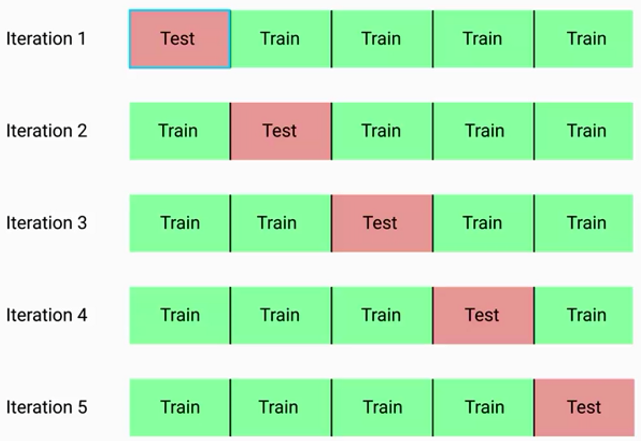
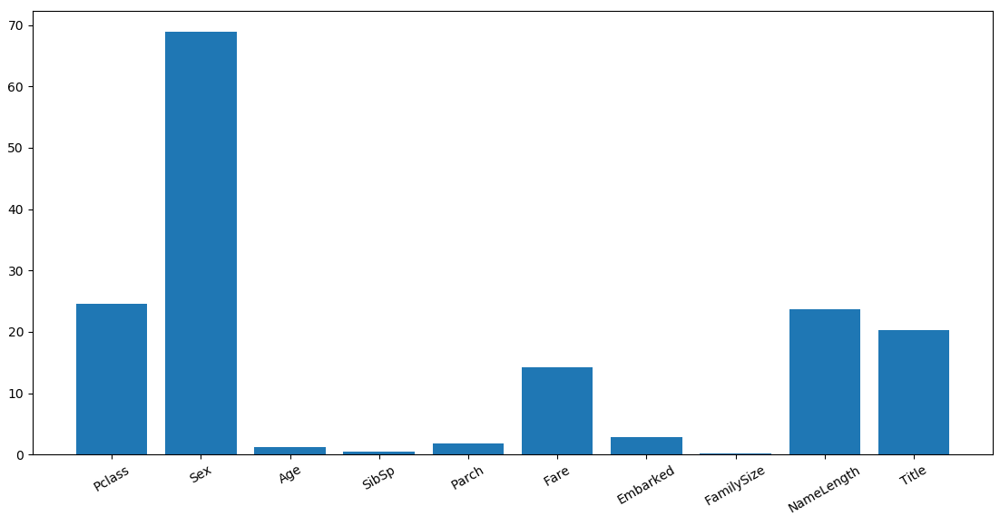

#Sklearn建模与评估

##一、简单线性回归

```python
import pandas as pd 
import matplotlib.pyplot as plt 

columns = ['mpg', 'cylinders', 'displacement', 'horsepower', 'weight', 'acceleration', 'model year','origin', 'car name' ]
cars = pd.read_table(r'G:\data\auto-mpg.data', names=columns, delim_whitespace=True)
# print(cars)

# 查看特征与结果的关系
# fig = plt.figure()
# ax1 = fig.add_subplot(2,1,1)
# ax2 = fig.add_subplot(2,1,2)
# cars.plot("weight", "mpg", kind="scatter", ax=ax1)
# cars.plot("acceleration", "mpg",kind="scatter", ax=ax2)
# plt.show()

# 使用scikit-learn库建立回归模型
from sklearn.linear_model import LinearRegression
lr = LinearRegression()

#
#输入：X为N*M的矩阵，N为样本个数n_samples，M为特征个数m_features
#输入：Y为样本标签值，单标签（预测结果只有一个值，为列向量）和双标签（预测出来的结果不止一个，为矩阵）
lr.fit(cars[['weight']], cars['mpg'])
# lr.fit(cars['weight'], cars['mpg']) 
pred = lr.predict(cars[['weight']])

# plt.scatter(cars['weight'], cars['mpg'], c='r')
# plt.plot(cars['weight'], pred, c='b')
# plt.show()

# 衡量模型的好坏：
#     均方误差MSE，Mean Squared Error = 1/n sum[(y' - y)**2] 
#     预测值与真实值之间的均方误差
from sklearn.metrics import mean_squared_error
mse = mean_squared_error(pred, cars['mpg'])
sqrt_mse = mse ** (.5)
print('MSE: %f \nsqrt(MSE): %f'  % (mse, sqrt_mse))
```

##二、简单逻辑回归

```python
import pandas as pd 
import matplotlib.pyplot as plt 
import numpy as np

admissions = pd.read_csv(r'G:\data\admissions.csv', na_filter=True)
print(admissions.head())
# plt.scatter(admissions['gpa'], admissions['admit'])
# plt.show()

#逻辑回归
# sigmoid(x) = 1 / (1 + exp(-x))
def sigmoid(x):
    return 1 / (1 + np.exp(x))

# sigmod函数图
x = np.linspace(-6, 6, 50, dtype=np.float)
y = sigmoid(x)
# plt.plot(x, y)
# plt.show()

from sklearn.linear_model import LogisticRegression
model = LogisticRegression()
model.fit(admissions[['gpa']], admissions['admit'])
pred_prob = model.predict_proba(admissions[['gpa']])
fitted_labels = model.predict(admissions[['gpa']])
# plt.scatter(admissions['gpa'], pred_prob[:, 1])
# plt.show()

admissions['pred_labels'] = fitted_labels
print(admissions)

#不能仅仅通过精度评判模型？实际上精度不靠谱
admissions['actual_labels'] = admissions['admit']
matched = admissions['actual_labels'] == admissions['pred_labels']
correct_pred = admissions[matched]
precision = len(correct_pred) / float(len(admissions))
print('precision: %f' % precision)
```

| Prediction  | Observation           |                       |
| ----------- | --------------------- | --------------------- |
|             | Admitted(1)           | Rejected(0)           |
| Admitted(1) | True Positive (TP)，  | False Positive (FP)， |
| Rejected(0) | False Negative (FN)， | True Negative (TN)，  |

假如某个班级有男生80人，女生20人，共计100人。目标是找出所有女生。现在某人挑出50人，其中20人是女生，另外还错误的把30个男生也当作女生挑选出来了。

|            | 相关，正类                           | 无关，负类                           |
| ---------- | ------------------------------------ | ------------------------------------ |
| 被检索到   | TP，正类判定为正类，确实是女生       | FP，负类判定为正类，男生被判定为女生 |
| 未被检索到 | FN，正类判定为负类，女生被判定为男生 | TN，负类判定为负类，男生被判定为男生 |

通过上述表格，可以清楚的得到：TP=20，FP=30，FN=0，TN=50

**True Positive Rate(Sensitivity)**

TPR指标衡量模型检测正例的效果，例如用模型检测病人是否患癌症，TP表示患病的人被正确的检测出来了，而FN则是患病的人被认为是正常的，这时候结果就严重的，在这个问题上需要考虑TPR，否则好多人会因为这个模型而受难。
$$
TPR =  \frac{True  \ Positives}{True \  Positives + False \  Nagetives}
$$
**True Negative Rate**

TNR指标衡量模型检测负例例的效果，例如用模型检测病人是否患癌症，TP是没患癌症的人被正确的检测出来了，TN是没患病的人被检测出来患有癌症。
$$
TNR = \frac{True \ Negative}{False \ Positive + True \ Negative}
$$
为什么说精度经常是不准确的、有欺骗性？例如有100个样本，其中有90个样本是属于1这个类别，而10个样本属于0这个类别，让分类器预测，假设模型全部预测为1类别，则精度也有90%，因此精度在样本非常不平衡的条件下是非常不准确的。很多情况下需要衡量TPR、TNR指标。

```python
true_positive_filter = (admissions['pred_labels'] == 1) & (admissions['actual_labels'] == 1)
true_positives = len(admissions[true_positive_filter])
false_negative_filter = (admissions['pred_labels'] == 0) & (admissions['actual_labels'] == 1)
false_negatives = len(admissions[false_negative_filter])

sensitivity = true_positives / (true_positives + false_negatives)

# 过拟合：在训练数据表现很好，在测试数据表现很差！
# ROC曲线，综合查看fpr，tpr的值
from sklearn import metrics
pred_probs = model.predict_proba(admissions[['gpa']])
# threshold：
fpr, tpr, thresholds = metrics.roc_curve(admissions['actual_labels'], pred_probs)
# 画出ROC曲线
# plt.plot(fpr, tpr)
# plt.show()

# 希望ROC的横轴和纵轴都趋近于1。ROC曲线表现模型预测正例和预测负例的综合效果
from sklearn.metrics import roc_auc_score
auc_score = roc_auc_score(test['actual_labels'], tests_probs[:, 1])
# 得分值越接近于1，模型效果越好。
print(auc_score)
```

##三、交叉验证

样本数据是要划分为训练集、测试集，那么存在一种情况导致切分后数据分布不均衡，例如在测试集中存在异常点比较多或训练集中异常点比较多，这就导致在训练模型是得到的结果不会很准确。如下图所示，将样本集切缝成大小相同的五个部分，如各自有100个数据，取其中的一份作为测试集，其余的4份作为训练集，每一次迭代的训练集和测试集不同，通过交叉的方式训练模型，有训练得到的5个模型共同得出最终的模型（如求5个模型结果的平均值作为最终结果），这种训练模型的方式称为交叉验证。



```python
# 交叉验证，数据集的拆分
# 取一部分作为训练数据，一部分作为测试数据
# 过拟合：在训练数据表现很好，在测试数据表现很差！
shuffled_index = np.random.permutation(admissions.index)
shuffled_admissions = admissions.loc[shuffled_index]
admissions = shuffled_admissions.reset_index()
admissions.ix[0:128,   "fold"] = 1
admissions.ix[129:257, "fold"] = 2
admissions.ix[257:386, "fold"] = 3
admissions.ix[387:514, "fold"] = 4
admissions.ix[515:644, "fold"] = 5
admissions['fold'] = admissions['fold'].astype('int')
```

**Sklearn库做交叉验证**

sklearn.model_selection.KFold(n_folds=3, shuffle=False, random_state=None)

- n_folds：需要将观测集切分成几份
- shuffle：是否随机排列观测集
- random_state：shuffle=True时，指定随机排列观测集的random seed

```python
from sklearn.linear_model import LogisticRegression
from sklearn.model_selection import KFold
from sklearn.model_selection import cross_val_score

admissions = pd.read_csv(r'G:\data\admissions.csv', na_filter=True)
admissions['actual_labels'] = admissions['admit']
admissions = admissions.drop('admit', axis=1)
kf = KFold(5, shuffle=True, random_state=8)
lr = LogisticRegression()

accurates = cross_val_score(lr, admissions[['gpa']], admissions['actual_labels'], scoring='roc_auc', cv=kf)
# array([0.70175439, 0.5023511 , 0.60750507, 0.59722222, 0.67074074])
average_accuracy = sum(accurates) / len(accurates)
#  0.6159147034200947
```

##四、多类别问题

目前为止提到的分类算法都是针对二分类问题求解的，假设有A、B、C三个类别，如何使用逻辑回归结果呢？这里介绍一种方法$one \ vs \ all$思想，如将三分类问题转换为多个二分类问题

| 分解问题 | 正例    | 负例           |
| -------- | ------- | -------------- |
| 1        | A为正例 | B、C都作为负例 |
| 2        | B为正例 | A、C都作为负例 |
| 3        | C为正例 | A、B都作为负例 |

这样就让分类器计算出当前样本分别作为A、B、C正例时的概率，那个概率高就将当前样本作为哪一类。

一个特征用列向量表示，例如year的取值有96、97、98、99，则其对应的列向量在pandas中用$pandas.get_dummies$的到结果如下

| dummy表示 | 96   | 97   | 98   | 99   |
| --------- | ---- | ---- | ---- | ---- |
| 96        | 1    | 0    | 0    | 0    |
| 97        | 0    | 1    | 0    | 0    |
| 98        | 0    | 0    | 1    | 0    |
| 99        | 0    | 0    | 0    | 1    |

```python
from sklearn.linear_model import LogisticRegression
import pandas as pd 
import matplotlib.pyplot as plt 
import numpy as np 

columns = ['mpg', 'cylinders', 'displacement', 'horsepower', 'weight', 'acceleration', 'model year','origin', 'car name' ]
cars = pd.read_table(r'G:\data\auto-mpg.data', names=columns, delim_whitespace=True)
dummy_cylinders = pd.get_dummies(cars['cylinders'])
dummy_cylinders.columns = ['cyl_%s' % col for col in dummy_cylinders.columns]
cars = pd.concat([cars, dummy_cylinders], axis=1)

dummy_years = pd.get_dummies(cars['model year'])
dummy_years.columns = ['year_%s' % col for col in dummy_years.columns]
cars = pd.concat([cars, dummy_years], axis=1)

cars = cars.drop('cylinders', axis=1)
cars = cars.drop('model year', axis=1)

# 划分测试集、训练集
shuffled_rows = np.random.permutation(cars.index)
shuffled_cars = cars.iloc[shuffled_rows]
highest_train_row = int(cars.shape[0] * .70)
train = shuffled_cars.iloc[0:highest_train_row]
test  = shuffled_cars.iloc[highest_train_row:]

# 做三分类的任务，采用 one vs all方法
# 获取三个类别
unique_origins = cars['origin'].unique()
unique_origins.sort()

models = {}
features = [c for c in train.columns if c.startswith('cyl') or c.startswith('year')]
#['cyl_3', 'cyl_4', 'cyl_5', 'cyl_6', 'cyl_8', 'year_70', 'year_71',
# 'year_72', 'year_73', 'year_74', 'year_75', 'year_76', 'year_77',
# 'year_78', 'year_79', 'year_80', 'year_81', 'year_82']

# 进行三次二分类
for origin in unique_origins:
    model = LogisticRegression()

    X_train = train[features]
    # orgin对应的类别为正例，其他类别为负例
    y_train = train['origin'] == origin

    model.fit(X_train, y_train)
    models[origin] = model

# 验证模型
testing_probs = pd.DataFrame(columns=unique_origins)
for origin in unique_origins:
    X_test = test[features]
    # compute probability of observation being  in 
    testing_probs[origin] = models[origin].predict_proba(X_test)[:, 1]

#            1         2         3
#0    0.960009  0.051576  0.012579
#1    0.972115  0.023798  0.024272
#2    0.887651  0.035832  0.099203
#3    0.885822  0.100457  0.076915
#4    0.852663  0.051005  0.097233
```

##五、随机森林建模

```python
from sklearn.linear_model import LinearRegression
from sklearn.model_selection import cross_val_score
from sklearn.model_selection import KFold
import matplotlib.pyplot as plt 
import pandas as pd 
import numpy as np 
import time

titanic = pd.read_csv(r'G:\data\titanic.csv')
titanic.describe()
#       PassengerId    Survived      Pclass         Age       SibSp  \
#count   891.000000  891.000000  891.000000  714.000000  891.000000
#       Parch        Fare
#        891.000000  891.000000

#Age数据出现丢失，为na，用均值填充
titanic['Age'] = titanic['Age'].fillna(titanic['Age'].median())
#       PassengerId    Survived      Pclass         Age       SibSp  \
#count   891.000000  891.000000  891.000000  891.000000  891.000000
#mean    446.000000    0.383838    2.308642   29.361582    0.523008
#std     257.353842    0.486592    0.836071   13.019697    1.102743
#            Parch        Fare
#count  891.000000  891.000000
#mean     0.381594   32.204208

#对字符串，Sex、Embarked(上船地点)列，pandas是无法处理的，需要将其转换为数值量
#
titanic.loc[titanic['Sex'] == 'male', 'Sex'] = 0 
titanic.loc[titanic['Sex'] == 'female', 'Sex'] = 1 
# Embarked也存在控制，这里用众数填充
titanic['Embarked'].unique()
titanic['Embarked'] = titanic['Embarked'].fillna('S')
titanic.loc[titanic['Embarked'] == 'S', 'Embarked'] = 0 
titanic.loc[titanic['Embarked'] == 'C', 'Embarked'] = 1 
titanic.loc[titanic['Embarked'] == 'Q', 'Embarked'] = 2 
#       PassengerId    Survived      Pclass         Sex         Age  \
#count   891.000000  891.000000  891.000000  891.000000  891.000000
#            SibSp       Parch        Fare    Embarked
#count  891.000000  891.000000  891.000000  891.000000
# 要传递给模型的特征
predictors = ['Pclass', 'Sex', 'Age', 'SibSp', 'Parch', 'Fare', 'Embarked']
# initialize model
alg = LinearRegression()

# Generate cross validation folds for the titanic dataset, It return the row
# indices corresponding to train and test. We set random_state to ensure we get
# the splits every time we run it
kf = KFold(n_splits=3, random_state=1)

predictions = []
for train, test in kf.split(titanic):
    train_predictors = (titanic[predictors].iloc[train, :])
    train_target = titanic['Survived'].iloc[train]

    alg.fit(train_predictors, train_target)
    test_predictions = alg.predict(titanic[predictors].iloc[test, :])
    predictions.append(test_predictions)
# print(predictions)

# The predictions are in three separate numpy arrays. Concatenate them into one.
# We concatnate them on axis 0, as they only have one axis.
predictions = np.concatenate(predictions, axis=0)

# Map predictions to outcomes (Only possible outcomes are 1 and 0)
predictions[predictions > 0.5] = 1
predictions[predictions <= .5] = 0
accuracy = sum(predictions[predictions == titanic["Survived"]]) / len(predictions)
print(accuracy)
# 0.2615039281705948

from sklearn.linear_model import LogisticRegression
alg = LogisticRegression(random_state=1)
scores = cross_val_score(alg, titanic[predictors], titanic['Survived'], cv=3)
print(scores, scores.mean())
#[0.78451178 0.78787879 0.79124579] 0.7878787878787877

# 使用随机森林改进模型，通常是分类任务的首选
from sklearn.ensemble import RandomForestClassifier
# 树的高度过高会导致过拟合现象
alg = RandomForestClassifier(
    random_state=1,
    n_estimators=10,     # number of trees we want to make
    min_samples_split=2, # minimum number of rows we need to make a split
    min_samples_leaf=1   # 叶子节点最少样本个数
)
kf = KFold(n_splits=3, shuffle=True, random_state=1)
scores = cross_val_score(alg, titanic[predictors], titanic['Survived'], cv=kf)
print(scores, scores.mean())
# [0.77104377 0.79461279 0.82154882] 0.7957351290684626

# 树的高度过高会导致过拟合现象
alg = RandomForestClassifier(
    random_state=1,
    n_estimators=50,     # number of trees we want to make
    min_samples_split=4, # minimum number of rows we need to make a split
    min_samples_leaf=2   # 叶子节点最少样本个数
)
kf = KFold(n_splits=3, shuffle=True, random_state=1)
scores = cross_val_score(alg, titanic[predictors], titanic['Survived'], cv=kf)
print(scores, scores.mean())
# [0.78787879 0.83164983 0.85858586] 0.8260381593714926

"""
# 当模型优化的差不多时，还想要提高准确度，那么应该怎么进行呢？
# 达到瓶颈后，需要回过头来看数据、数据特征提取有用的特征或数据量来继续优化
"""
# 提取新的特征
titanic['FamilySize'] = titanic['SibSp'] + titanic['Parch']
# 假设名字长度与是否逃生成功有关！！
titanic['NameLength'] = titanic['Name'].apply(lambda x: len(x))

# 假设人名的称呼：Mr,Miss,Master等于结果有关，将其添加为新的特征“Title”
import re

def get_title(name):
    title_search = re.search(r' ([A-Za-z]+)\.', name)
    if title_search:
        return title_search.group(1)
    return ""
titles = titanic['Name'].apply(get_title)
print(pd.value_counts(titles))

# 将称呼映射称为数值
title_map = {
    'Mr': 1,  'Miss': 2,  'Mrs': 3,  'Master': 4,  'Dr': 5,  'Rev': 6,
    'Major': 7,  'Col': 8,  'Mlle': 9, 'Don': 10,  'Lady': 11,  'Sir': 12,
    'Jonkheer': 13,  'Capt': 14,  'Countess': 15,  'Mme': 16,  'Ms': 17
}
for k, v in title_map.items():
    titles[titles == k] = v
print(pd.value_counts(titles))
titanic['Title'] = titles

"""
随机森林特征重要性分析
如何判断特征是否重要？首选对所有选择特征建立随机森林模型，得出一个errOOB错误率，假设要衡量3号特征的重要性，则把3号特征对应的样本使用例如高斯噪音填充，然后再对其建模后得到一个errOOB错误率，若前后两个errOOB差别不大这说明3号特征不太重要，对结果影响不大！
"""
predictors = ['Pclass', 'Sex', 'Age', 'SibSp', 'Parch', 'Fare', 'Embarked', 'FamilySize', 'NameLength','Title']

# 选出其中比较重要的特征
from sklearn.feature_selection import SelectKBest, f_classif

selector = SelectKBest(f_classif, k=5)
selector.fit(titanic[predictors], titanic['Survived'])

# get the raw p-value for each feature and transform from p-value into score
scores = - np.log10(selector.pvalues_)

# plot the scores, See How 'Pclass', 'Sex', 'Title', 'Fare are the best?
plt.bar(range(len(predictors)), scores)
plt.xticks(range(len(predictors)), predictors, rotation='30')
plt.show()

# pick only for best features
predictors = ['Pclass', 'Sex', 'Title', 'Fare']
alg = RandomForestClassifier(
    random_state=1,
    n_estimators=50, 
    min_samples_split=8,
    min_samples_leaf=4
)
kf = KFold(n_splits=3, shuffle=True, random_state=1)
scores = cross_val_score(alg, titanic[predictors], titanic['Survived'], cv=kf)
print(scores, scores.mean())
```



**多模型组合建模**：例如使用SVM、RandomForest、xgboost多个模型共同决定分类结果，

```python
"""
集成多个模型，综合给出结果
"""
from sklearn.ensemble import RandomForestClassifier
from sklearn.linear_model import LogisticRegression

# 组合两个分类模型
algorithms = [
    [
        RandomForestClassifier(random_state=1, n_estimators=25, max_depth=3), 
        ['Pclass', 'Sex', 'Age', 'SibSp', 'Parch', 'Fare', 'Embarked']
    ],
    [
        LogisticRegression(random_state=1),
        ['Pclass', 'Sex', 'Age', 'SibSp', 'Parch', 'Fare', 'Embarked']
    ]
]

kf = KFold(n_splits=3, random_state=1)
predictions = []
for train, test in kf.split(titanic):
    train_target = titanic['Survived'].iloc[train]
    full_test_predictions = []

    # make predictions for each algorithm for each fold
    for alg, predictors in algorithms:
        alg.fit(titanic[predictors].iloc[train, :], train_target)
        # Select and predict on the test fold
        # the .astype(float) is necessary to convert the dataframe 
        #   to all floats and avoid a sklearn errir
        test_predictions = alg.predict_proba(titanic[predictors].iloc[test, :].astype(float))[:, 1]
        full_test_predictions.append(test_predictions)
    
    # use a simple ensembling scheme: just average the predictions to get the final classification
    test_predictions = (full_test_predictions[0] + full_test_predictions[1]) / 2
    # any value over .5 is assumed to a 1 prediction, and below .5 is a 0 prediciton
    test_predictions[test_predictions > .5] = 1
    test_predictions[test_predictions <= .5] = 0
    predictions.append(test_predictions)

# put all the predictions together into one array
predictions = np.concatenate(predictions, axis=0)

# compute accuracy
accuracy = sum(predictions[predictions == titanic['Survived']]) / len(predictions)
print(accuracy)
```

##六、客户流失预警分析

```python
import pandas as pd
import numpy as np 

churns = pd.read_csv(r'G:\data\chrun.csv')
# print(churns.head())
col_names = churns.columns.tolist()
print(col_names)

"""
预处理
    1、特征提取
    2、字符处理
"""
churn_result = churns['Churn?']
y = np.where(churn_result == 'True.', 1, 0)
print(pd.Series(y).value_counts())
# 0    2850  数据不均衡
# 1     483

to_drop = ['State', 'Area Code', 'Phone', 'Churn?']
churn_feat_space = churns.drop(to_drop, axis=1)

# yes or no has to be converted to boolean values
yes_no_cols = ["Int'l Plan", 'VMail Plan']
churn_feat_space[yes_no_cols] = churn_feat_space[yes_no_cols] == 'yes'
print(churn_feat_space[yes_no_cols])

# Pull out features for future use
features = churn_feat_space.columns

X = churn_feat_space.as_matrix().astype(np.float)
print(X)

"""
预处理
    将特征值归一化或标准化
"""
from sklearn.preprocessing import StandardScaler, Normalizer
scalar = StandardScaler()
X = scalar.fit_transform(X)

print(X)
print('Feature space holds %d observations and %d features' % X.shape)
print('Unique taget labels:', np.unique(y))


"""
数据不均衡处理
"""
from imblearn.over_sampling import SMOTE
sm = SMOTE(random_state=1)
X_oversample, y_oversample = sm.fit_sample(X, y)
print(X_oversample, y_oversample)

"""
划分训练集合测试集
"""
from sklearn.model_selection import train_test_split
X_train, X_test, y_train, y_test = train_test_split(X, y, test_size=0.3, random_state=1)

X_trian_oversample, X_test_oversample, y_train_oversample, y_test_oversample =  \
    train_test_split(X_oversample, y_oversample, test_size=0.3, random_state=1)

"""
选取模型，训练模型
"""
from sklearn.model_selection import KFold, cross_val_score
from sklearn.ensemble import RandomForestClassifier as RFC
from sklearn.neighbors import KNeighborsClassifier as KNN 
from sklearn.svm import SVC

def run_cv(X, y, clf_class, **kwargs):
    kf = KFold(n_splits=5, random_state=1)
    y_pred = y.copy()

    for train_index, test_index in kf.split(y):
        X_train, X_test = X[train_index], X[test_index]
        y_train = y[train_index]

        clf = clf_class(**kwargs)
        clf.fit(X_train, y_train)
        y_pred[test_index] = clf.predict(X_test)
    return y_pred

def accuracy(y_true, y_pred):
    # numpy interprets True and False as 1 and 0
    return np.mean(y_true == y_pred) 

print('Support Vector Machines: ')
print('%.3f' % accuracy(y_train_oversample, run_cv(X_trian_oversample, y_train_oversample, SVC)))
print('Random Forest Classifier: ')
print('%.3f' % accuracy(y_train_oversample, run_cv(X_trian_oversample, y_train_oversample, RFC)))
print('K Nearest Neighour: ')
print('%.3f' % accuracy(y_train_oversample, run_cv(X_trian_oversample, y_train_oversample, KNN)))

"""
实际上我们不关心准确度，而是想要看recall召回率，对于那些流失的客户我们没有预测出来是我们需要关心的。
mAP：是为了解决Precision、Recall、F-measure的单点值局限性。
我们希望Precision和Recall越高越好！，为此可以求出

"""


"""
应用阈值
    对于流失的用户其概率不同，我们可能希望首先关心那些90%以上会流失的用户，对这些客户优先处理，例如客服打电话挽留。
    因此需要提升优先级，对最有可能流失的用户先做处理。
"""
def run_proba_cv(X, y, cls_class, **kwargs):
    kf = KFold(n_splits=5, random_state=1, shuffle=True)
    y_pred_proba = np.zeros((len(y), 2))

    for train_index, test_index in kf.split(y):
        X_train, X_test = X[train_index], X[test_index]
        y_train = y[train_index]

        clf = cls_class(**kwargs)
        clf.fit(X_train, y_train)
        y_pred_proba[test_index] = clf.predict_proba(X_test)
    return y_pred_proba


import warnings
warnings.filterwarnings('ignore')

# use 10 estimators, so predictions are all multiplies of 0.1
y_pred_proba = run_proba_cv(X_trian_oversample, y_train_oversample, RFC, n_estimators=10)
print(y_pred_proba)

pred_churn = y_pred_proba[:, 1]
is_churn = y_train_oversample == 1
print(is_churn)

# number of times a predicted probablity is assigned to an observation
counts = pd.value_counts(pred_churn)
print(counts)

# calculate true probability
true_prob = {}
for prob in counts.index:
    # numpy interprets True and False as 1 and 0
    true_prob[prob] = np.mean(is_churn[pred_churn == prob])
    true_prob = pd.Series(true_prob)

counts = pd.concat([counts, true_prob], axis=1).reset_index()
counts.columns = ['Pred_prob', 'Count', 'True_prob']
print(counts)
"""
    Pred_prob  Count  True_prob
0         1.0    999   0.997998
1         0.0    673   0.005944
2         0.1    588   0.025510
3         0.9    456   0.986842
4         0.2    381   0.070866
5         0.3    212   0.122642
6         0.8    210   0.900000
7         0.7    134   0.873134
8         0.4    121   0.305785
9         0.5    109   0.532110
10        0.6    107   0.700935
"""
```


***

[^1]: [信息评价指标](https://blog.csdn.net/Lu597203933/article/details/41802155)

