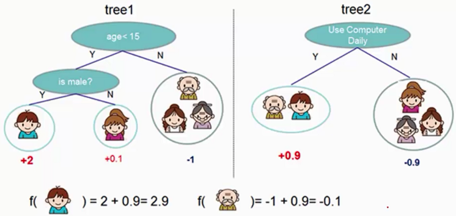
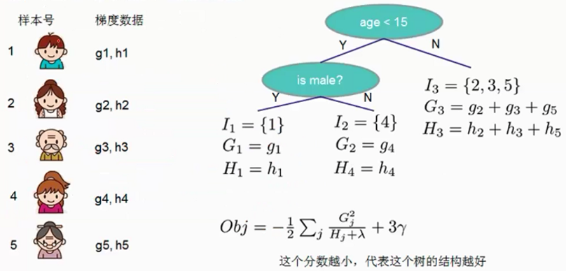
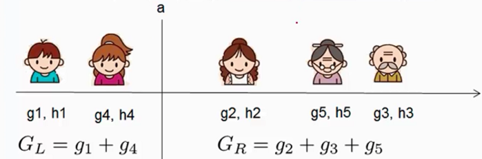

#xgboost

##一、集成算法思想

通常在做一个分类或回归任务的时候，有时使用一个分类器得到的结果并不理想。我们可以集成思想，首先我们有一堆分类器，把这些单一分类器称为弱分类器，通过组合弱分类器得到一个集成的分类器，这样就可以通过集成思想得到一个好的算法。如下图所示，通过使用两个分类器集成一个分类器。



##二、xgboost基本原理

设预测值$\hat{y_i} = \sum_j w_j x_{ij}$为样本与权值的线性组合，使用均方误差作为目标函数$L(y_i，\hat{y_i})=(y_i - \hat{y_i})^2$，我们希望目标函数的值越小越好。对于一个样本可以计算其损失值，对于一组样本得到一组损失值，我们希望得到的损失值的均值最小，则最优函数为$F^*(x) = arg \ min E_{x,y} [L(y, F(x))]$，即求样本损失值得期望最小。

**集成算法**表示为
$$
\hat{y_i} = \sum_{k=1}^K f_k(x_i)，f_k \in F，其中F表示模型或分类器的集合
$$
当使用一个分类预测的效果不是很好时，我们希望通过使用集成算法从分类器集合中再拿一个分类器进行组合，那么选择的这个分类的前提是加入的这个分类器能够使得预测效果更好，即每加一个模型进行集成时得到的模型效果时候在逐步提升。xgboost算法中就是逐个添加模型集成，使得添加模型后的算法效果在一直提升。
$$
\hat{y_i}^{(0)} = 0 \qquad \\
\hat{y_i}^{(1)} = f_1(x_i) = \hat{y_i}^{(0)} + f_1(x_i) \\
\hat{y_i}^{(2)} = f_1(x_i) + f_2(x_i) = \hat{y_i}^{(1)} + f_2(x_i) \\
...\\
\underbrace{\hat{y_i}^{(t)}}_{第t轮模型预测} =\sum_{k=1}^{t} f_k(x_i) =\underbrace{ \hat{y_i}^{(t-1)}}_{保留前t-1轮的模型预测} +\underbrace{f_t(x_i)}_{加入一个新模型} \\
$$
**正则化惩罚项**

模型自身也有惩罚项，例如针对决策树模型，叶子节点个数不能太多，容易出现过拟合。在xgboost中的惩罚项为，其中$\lambda$为惩罚力度，$\Omega(f_t)$为正则化惩罚项
$$
\Omega(f_t) = \gamma \underbrace{T}_{叶子节点个数} + \frac{1}{2} \lambda \sum_{j=1}^{T} w^2_j
$$


现在就剩下一个问题，我们如何选择每一轮加入什么f呢？答案是非常直接的，选取一个f使得目标函数尽量最大的降低，目标就是找到$f_t$来优化$Obj^{(t)}$目标函数。
$$
Obj^{(t)} = \sum_{i=1}^{n}L(y_i, \hat{y_i}^{(t)}) + \sum_{i=1}^{t} \Omega(f_i)  \qquad \qquad \qquad  \qquad \ \ \ \ \\
=\sum_{i=1}^{n} L(y_i, \hat{y_i}^{(t-1)} + f_t(x_i)) + \Omega(f_t) + constant \qquad  \quad \ \ \ \\
= \sum_{i=1}^{n}(y_i - (\hat{y_i}^{(t-1)} + f_t(x_i)))^2+ \Omega(f_t) + constant \qquad \ \  \ \\
= \sum_{i=1}^{n}[\underbrace{2(\hat{y_i}^{(t-1)} - y_i)}_{残差} f_t(x_i) + f_t(x_i)^2] + \Omega(f_t) + constant \\
$$
这里我们要计算一个梯度提升的决策树，我们又可以称之为残差决策树。 

xgboost做的工作？假设往银行借钱且能从银行借到$y=1000$的，银行建立了一个决策系统，假设用决策树表示，第一颗决策树计算的结果是能借给我950，那么真实值与预测值之间的残差/损失值为50；然后决策系统有加了一颗树且加了这颗树看到上一次残差为50，通过计算这棵树得到的结果是950 + 30=980；加第三棵树计算上一结果残差为20，进步缩小残差为5，得到预测结果为980+15=995。这就是xgboost的基本原理，加入模型后使得最终预测结果的残差最小。

**目标函数的求解**

目标函数：$Obj^{(t)} =\sum_{i=1}^{n} L(y_i, \hat{y_i}^{(t-1)} + f_t(x_i)) + \Omega(f_t) + constant $

用泰勒展开近似目标函数$f(x+\Delta x) \approx f(x) + f'(x)\Delta x + \frac{1}{2} f''(x) \Delta x^2$可以得到
$$
Obj^{(t)} \approx \sum_{i=1}^{n} L(y_i, \hat{y_i}^{(t-1)} + f_t(x_i)) + \Omega(f_t) + constant \qquad \qquad \\
= \sum_{i=1}^{n}[   L(y_i, \hat{y_i}^{(t-1)})  + g_i f_t(x_i) + \frac{1}{2} h_i f_t^2(x_i)] + \Omega(f_t) + constant \\
\Downarrow L(y_i, \hat{y_i}^{(t-1)}) 常数项 \\
=  \sum_{i=1}^{n}[ g_i f_t(x_i) + \frac{1}{2} h_i f_t^2(x_i)] + \Omega(f_t) + constant  \qquad \qquad  \qquad  \quad \\

g_i = \frac{\partial  L(y_i, \hat{y_i}^{(t-1)})}{\partial \hat{y_i}^{(t-1)}} \qquad h_i = \frac{\partial^2  L(y_i, \hat{y_i}^{(t-1)})}{\partial ^2\hat{y_i}^{(t-1)}} \\
$$
将惩罚项带入化简后的目标函数中，将在样本上的遍历转换为在叶子节点上的遍历
$$
Obj^{(t)} \approx  \sum_{i=1}^{n}[ g_i f_t(x_i) + \frac{1}{2} h_i f_t^2(x_i)] + \Omega(f_t)   \ （样本上遍历） \\
=  \sum_{i=1}^{n}[ g_i w_{q(x_i)} + \frac{1}{2} h_i w^2_{q(x_i)} ] + \gamma T + \lambda \frac{1}{2} \sum^T_{j=1} w_j^2 \ （样本上遍历） \\
=  \sum_{j=1}^{T} [ (\sum_{i \in I_j} g_i) w_j + \frac{1}{2}(\sum_{i \in I_j }h_i + \lambda) w_j^2] + \gamma T \ （叶子节点上遍历） \\
\Downarrow G_j = \sum_{i \in I_j} g_i \qquad  H_j = \sum_{i \in I_j }h_i  \\
=\sum_{j=1}^{T} [ G_j w_j + \frac{1}{2}(H_j + \lambda) w_j^2] + \gamma T  \qquad \qquad \qquad \qquad \qquad \qquad \\
$$
求目标函数$Obj^{(t)}$在权值参数$w_j$为何值时目标函数值最小，只需要对其进行一阶求导即可得到$w_j$的值
$$
\frac {\partial J(f_t)}{ \partial w_j} = G_j + (H_j + \lambda) w_j = 0 \Rightarrow w_j =  -\frac{G_j}{H_j + \lambda}
$$
带入目标函数可以得到
$$
Obj = - frac{1}{2} \sum_{j=1}^{T}\frac{G^2_j}{H_j + \lambda} + \gamma T
$$
Obj代表了当我们指定一个树的结构时，我们在目标上面最多减少做少。我们可以称之为结构分数(Structure Score)。可以认为这个就是类似基尼系数一样更加一般的对于树结构进行打分的函数。

**范例**

打分函数的计算方式如下图所示，有三个叶子节点$I_1，I_2，I_3$，其中$I_1$上有1号样本，$I_2$上有4号样本，$I_3$上有2,3,5号样本， 



通过上述推导的函数可以作为代替信息增益、基尼系数用于判断是否拆分子树的标准。通过将拆分前的结构分数减去拆分后的结构分数得到信息增益为
$$
Gain = \frac{1}{2} [\frac{G_L^2}{H_L + \lambda} + \frac{G_R^2}{H_R + \lambda} - \frac{(G_L + G_R)^2}{G_L + G_R + \lambda}] - \gamma
$$
对于每一次扩展，如何高效地枚举所有的分割呢？假设我们要枚举所有$x < a$这样的条件，对于某个特定的分割$a$我们要计算$a$左边和右边的导数和。



总结：xgboost算法可以得到一个求损失函数的公式，我们就能够计算每一个样本的损失函数值是多少，这样就可以用损失函数值建立模型，即该如何切分节点。


##三、xgboost使用

```python
from numpy import loadtxt
from xgboost import XGBClassifier
from xgboost import plog_importance
from sklearn.model_selection import train_test_split
from sklearn.metrics import accuracy_score

datasets = loadtxt('pima-indians-diabetes.csv', delimiter=',')

# split data into X and y
X = datasets[:, 0:8]
Y = datasets[:, 8]

# split data into train and test sets
seed = 7
test_size = 0.33
X_train, X_test, Y_trian, Y_test = train_test_split(X,Y, test_size=test_size, trandom_state=seed)

# fit model no training data
model  = XGBClassifier()
model.fit(X_train, Y_trian)

# 显示每个特征的重要程度
plog_importance(model)
pyplot.show()
"""
在
early_stopping_rounds： 连续多少次 loss值没有减少
eval_metrics： 指定loss评估函数
eval_set：每加入一个模型都用该数据进行测试
verbose：打印详细信息
"""
# eval_set = [(X_test, Y_test)]
# model.fit(X_train, Y_trian, early_stopping_rounds=10, eval_metrics='logloss',eval_set=eval_set, verbose=True)

# make predictions for test data
y_pred = model.predict(X_test)
predicitions = [round(value) for value in y_pred]

# evaluate predictions
accuracy = accuracy_score(Y_test, predicitions)
print("Accuracu: %.2f%%" % (accuracy * 100.0))
```

**xgboost参数调节**

```python
from numpy import loadtxt
from xgboost import XGBClassifier 
from sklearn.model_selection import GridSearchCV
from sklearn.model_selection import StratifiedFold

"""
常见的参数
1、learning_rate，基本是0.1以下
2、xgboost采用树模型建立，因此需要指定树的参数
    max_depth、min_child_wight、subsample、colsample_bytree、gamma
3、正则化参数，lambda、alpha
"""


dataset = loadtxt('pima-indians-diabetes.csv', delimiter=',')

X = dataset[:, 0:8]
Y = dataset[:, 8]

model = XGBClassifier(
    learning_rate = 0.001, # 学习率
    n_estimators = 1000,   # 模型个数
    max_depth = 5,         # 树的最大深度
    min_child_weight = 1,  # 叶节点最小权重系数
    gamma = 0,             # 惩罚项中的系数，通常取比较小的值
    subsample = 0.8,       # 建立树模型时，随机选择80%个样本
    colsample_bytree = 0.8,# 选特征时，随机选择80%建立模型 
    objective = 'binart:logistic', # 损失函数
    nthread = 4,           # 线程数
    scale_pos_weight = 1,  # 若样本是不均衡，可以均衡样本
    seed = 27              # 随机种子
)

# grid search
learning_rate = [0.0001, 0.001, 0.01, 0.2,0.3]
param_grid = dict(learning_rate=learning_rate)
kfold = StratifiedFold(n_splits=10, shuffle=True, random_state=7)
grid_search = GridSearchCV(model, param_grid, scoring='neg_log_loss', n_jobs=1, cv=kfold)
grid_result = grid_search.fit(X, Y)

# summariz results
print('Best: %f using %s' % (grid_result.best_score_, grid_result.best_params_))
means = grid_result.cv_results_['mean_test_score']
params = grid_result.cv_results_['params']
for mean, param in zip(means, params):
    print('%f with: %r' % (mean, param))

```

##四、Adaboost

Adaboost（Adaptive Boosting，自适应增强）有Yoav Freund 和Robert Schapire在1995年提出。它的自适应在于：前一个基本分类器分错的样本会得到加强，加权后的全体样本再次被用来训练下一个基本分类器。同时，在每一轮中加入一个新的弱分类器，直到达到某个预定的足够小的错误率或达到预先指定的最大迭代次数。

考虑下面两组数据，若采用单层决策树对其进行分割，无论在哪里换一天线都不能将数据完全分开，那么能不能切两刀实现数据分类呢！Adaboost就是将多个弱分类器集成在一起，


