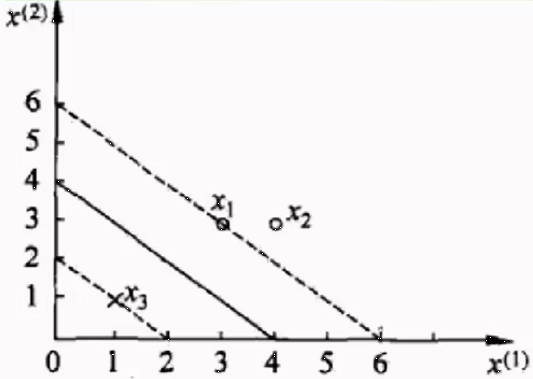
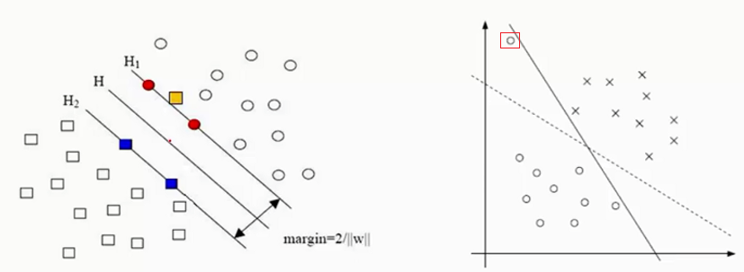
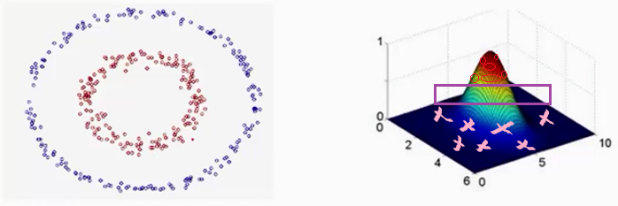
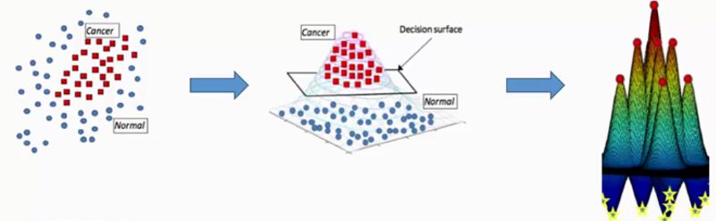

##支持向量机（SVM）

### 一、 SVM的从无到有

对于给定的一组数据我们找到一组$h(x)$，称其线性/超平面分类器(Linear/Hyperplane Classifier) ，其中每一组线性分类器都能够分类给定数据。
$$
h(x) = sign(w^T x)
$$

而对于给定的样本数据，我们希望找到一条线能够将$\times$和$\circ$分开，如下图所示，我找到了三条线能够将数据分开。则我们找到了三组参数能够满足条件，但是我们应取找其中的哪一组参数作为最终结果呢？

选取哪一组参数，有没有什么标准呢？这里我们可以把$\times$和$\circ$都看做是雷，我们希望画一个安全区出来，它能够距离雷区越远越好，如下图所示，第一条线距离雷区太近了，而第二组线则距离$\times$和$\circ$ 雷区稍微远点，但第三组线距离$\times$和$\circ$雷区最远。我们`首先找到一组距离雷越远越好的线，然后通过查看距离所选择直线最近的雷到直线的距离d，选择其中d最大的那条直线作为最优解`。

也可以通过决策面方式，查看分离$\times$和$\circ$的效果，如下图所示，可以看到第三组安全区域最大。对于给定的样本数据点，在进行切分的时候，我们希望容错能力越强越好，例如对于第一组曲线，当有一个$\times$数据点(黄色)落在直线周围时，有可能就会将其划分为$\circ$这个类别。而对于第三组，即使有一个$\times$数据点(黄色)落在直线周围，任然会将其分类为$\times$这个类别。因此我们希望`决策边界越胖越好，这样它的容错能力更强，分辨能力也就更强` ，最后模型表现效果就会更好。 

 因此我们提出一个问题希望能够找到分离样本数据的直线，并且其决策边界越胖越好。**问题描述**为
$$
max_{w} \quad fatness(w) \\
s.t. \quad w \ classifies \ every \  (x_n, y_n) \ correctly \ \\
fatness(w) = min_{n=1,2,...,N} \ distance(x_n, w)
$$
其中我们称$fatness$ 为边界(Margin)，而$correctness \ y_n  = sign(w^T x_n)$ ，**目标是：find largest-margin separating hyperplane**

**计算样本点到直线的距离**

考虑平面$Ax + By + Cz + D = 0$ ，求平面外一点$Q(x_0,y_0,z_0)$ 到平面的距离d。如下图所示，任取平面内一点$P(x, y, z)$ 连接$PQ$ ，过P做平面的法向量$\vec{n}=(A,B,C)$ ，可以知道Q到平面的距离d恰是PQ在法向量n上的投影长度。，则有

$$
d = ||\vec{PQ}|| \cdot cos \theta = \frac{||\vec{n}||}{||\vec{n}||} \cdot ||\vec{PQ}|| \cdot cos \theta = \frac{\vec{PQ} \cdot \vec{n}}{||\vec{n}||} \\
=\frac{A(x_0 - x) + B(y_0 - y) + C(z_0 -z) }{\sqrt{A^2 + B^2 + C^2}} \\
=\frac{Ax_0 + By_0 + Cz_0 - (Ax + By + Cz) }{\sqrt{A^2 + B^2 + C^2}} \\
=\frac{|Ax_0 + By_0 + Cz_0 + D|}{\sqrt{A^2 + B^2 + C^2}} （保证结果为正）
$$
假设平面(hyperplane)$w^Tx + b = 0$ ，则样本点$x$ 到平面的距离可以表示为
$$
dist(x, b, w) = \frac{1}{||w||} |w^T + b|
$$
**支持向量机推导**

假设数据集$(x1, y1)，(x_2, y_2)，...，(x_n, y_n)$ ，其中x表示特征值，而y表示label值。在支持向量机中，为方便推导，对label进行了如下假设：y所表示的样本类别分为$+1，-1$ 
$$
\begin{cases}
当x为正例时，y= + 1 \\
当x为负例时，y=-1
\end{cases}
$$
构造的决策边界为：$y(x) = w^T \Phi(x) + b$ ，其中$\Phi(x)$是对输入样本x的一个变换，==在后面讨论== ，这里可以直接看做是x

则通过上式可以得到预测值$y(x)$ ，而用$y_i$表示真实值，现在对预测值进行如下判断，从而得出预测值与真实值的乘积是恒大于零的。
$$
 \begin{cases}
y(x_i) > 0 \Leftrightarrow y_i = +1 \\
y(x_i) < 0 \Leftrightarrow y_i = -1 \\
\end{cases} 
\Rightarrow y_i \cdot y(x_i) > 0
$$

**支持向量机的目标**：找到一条直线(w、b)，其中w称为权重参数，使得离该线最近的点能够最远，即$argmax(w,b)$ 使得$min\{最近的点到该线的距离\}$

因为点到平面的距离有一个绝对值，在计算时不方便，因此通过`预测值与真实值的乘积是恒大于零的` ，可以得到如下公式
$$
\frac{y_i \cdot (w^T \cdot \Phi(x_i) + b)}{||w||}
$$
则支持向量机的目标函数可以写为
$$
arg \ max_{w,b}\{ \frac{1}{||w||} min_{i} [y_i \cdot (w^T \cdot \Phi(x_i) + b] \}
$$
含义是首先我们希望能够找到最近点距离直线的平均最小，然后希望找到一组参数$\{w,b\}$能够使这个最小距离越大越好。	对于找到的一条直线$H$ ，可以通过对这条线进行缩放，例如调解一下$w或b$ 值对直线进行位置进行缩放，如下图所示。

对于线$(w,b)$ 可以通过放缩使得其结果值$|Y| \ge1$，希望得到 $y_i \cdot (w^T \cdot \Phi(x_i) + b) \ge 1$，则$min_{i} [y_i \cdot (w^T \cdot \Phi(x_i) + b] = 1$，因此目标函数就变为
$$
arg \ max _{w,b} \frac{1}{||w||}
$$
**求解SVM目标函数** 
$$
max_{w,b} \ \frac{1}{||w||} \\
s.t. \quad y_i \cdot (w^T \cdot \Phi(x_i) + b) \\
\Downarrow \\
min_{w,b} \ \frac{1}{2} w^2 \\
s.t. \quad y_i \cdot (w^T \cdot \Phi(x_i) + b) \\
$$
对于非约束优化问题采用朗格朗日乘子求解，拉格朗日乘子法的标准格式为
$$
min \ f(x) \\
s.t. \quad g_i(x) \le 0，i=1,...,m
$$
因此可以通过转换得到上述目标函数，其中$\frac{1}{2}w^2$是为了方便计算。则可以得到朗格朗日函数
$$
L(w,b,\alpha) = \frac{1}{2} ||w||^2 - \sum_{i=1}^{n} \alpha_i(y_i \cdot(w^T \cdot \Phi(x_i)  +b) - 1) \\
对偶问题：min_{w,b} \  max_{\alpha} \ L(w,b,\alpha) \Rightarrow max_{\alpha} \ min_{w,b} L(w,b,\alpha)
$$
分别对w和b求偏导，分别得到两个条件
$$
\frac{\partial L}{\partial w} = 0 \Rightarrow w = \sum_{i=1}^{n} \alpha_i y_i \Phi(x_i) \\
\frac{\partial L}{\partial b} = 0 \Rightarrow 0 = \sum_{i=1}^{n}\alpha_i y_i \qquad \quad
$$
将求得的结果带入拉格朗日函数中，可得
$$
L(w,b,\alpha) = \frac{1}{2} ||w||^2 - \sum_{i=1}^{n} \alpha_i(y_i \cdot(w^T \cdot \Phi(x_i)  +b) - 1) \\
= \frac{1}{2}w^Tw - w^T \sum_{i=1}^{n} \alpha_i y_i \Phi(x_i) - b\sum_{i=1}^{n} \alpha_i y_i + \sum_{i=1}^{n} \alpha_i  \qquad \\
= \sum_{i=1}^{n} \alpha_i -  \frac{1}{2}( \sum_{i=1}^{n} \alpha_i y_i \Phi(x_i))^T( \sum_{i=1}^{n} \alpha_i y_i \Phi(x_i)) \qquad \qquad \\
= \sum_{i=1}^{n}\alpha_i - \frac{1}{2} \sum_{i,j=1}^{n} \alpha_i \alpha_j y_i y_j \Phi^T(x_i) \Phi(x_j) \qquad \qquad \qquad \quad   \\
$$
则就得到$min_{w,b} L(w,b,\alpha)$的求解，下一步需要继续对$\alpha$求极大值，根据拉格朗日定义将其转换为标准式
$$
max_{\alpha}  \ \{  \sum_{i=1}^{n}\alpha_i - \frac{1}{2} \sum_{i,j=1}^{n} \alpha_i \alpha_j y_i y_j \Phi^T(x_i) \Phi(x_j) \} \\
 s.t. \qquad \sum_{i=1}^{n}\alpha_i y_i = 0 \\
\alpha_i \ge 0 \quad i=1，...，n \\
\Downarrow \\
min_{\alpha} \ \{ \frac{1}{2} \sum_{i,j=1}^{n} \alpha_i \alpha_j y_i y_j \Phi^T(x_i) \Phi(x_j) -  \sum_{i=1}^{n}\alpha_i \} \\
 s.t. \qquad \sum_{i=1}^{n}\alpha_i y_i = 0 \\
\alpha_i \ge 0 \quad i=1，...，n \\
$$
**范例：如何求$\alpha$ ，为什么称为支持向量机？?**

已知一个如图所示的训练数据集，其正例点是$x_1=(3,3)^T，x_2=(4,3)^T$ ，负例点是$x_3=(1,1)^T$ ，试求最大间隔分离超平面。

样本为：$x_1(3,3,1)、x_2(4,3,1)、x_3(1,1,-1)$ 

求解：
$$
\frac{1}{2} \sum_{i=1}^{n} \sum_{j=1}^{n} \alpha_i \alpha_j y_i y_j (x_i \cdot x_j) -  \sum_{i=1}^{n}\alpha_i \\
a_1 + a_2 - a_3 = 0 \\
a_i \ge 0 \quad i=1,2,3
$$
将样本数据带入可以得到
$$
\frac{1}{2}(18a_1^2 + 25a_2^2 + 2a_3^2 + 42a_1 a_2 - 12 a_1 a_3 - 14 a_2 a_3) - a_1 - a_2 - a_3
$$
将$a_1 + a_2 = a_3$ 带入上式，然后分别对$a_1，a_2$ 求偏导后得到解
$$
(1) a_1 = 1.5，a_2 = -1，不满足a_i \ge 0，i=1,2,3 \qquad \qquad  \qquad  \qquad  \qquad \\
(2)a_1 = 0，a_2 = \frac{2}{13}，满足a_i \ge 0，i=1,2,3，带入原式得L(a)=-0.153 \\
(3)a_1 = 0.25，a_2 = 0，满足a_i \ge 0，i=1,2,3，带入原式得L(a)=-0.25 \\
$$
则最小值在$a = (0.25,0,0.25)$ 处取得，将$a$值带入下式可以求得$w^*，b^*$ 
$$
w^* = \sum_{i=1}^{n}a_i y_i x_i  \Rightarrow w_1 = w_2 = 0.5 \\
b^* = y_i - \sum_{i=1}^{n} a_i y_i (x_i \cdot x_i) \Rightarrow b=-2 \\
$$
因此也就求出了这条决策边界线，如下图所示

因此$a = (0.25,0,0.25)$ 中$a_2=0$表示在构建平面的过程中只用到了$x_1，x_3$ 这两个点，因此在构建支持向量机时是通过一些点把点给支撑出来的，而支持向量就是$x_1，x_3$，而$x_2$ 就不是，所谓支持向量就是那些距离决策边界最近的样本点，因为在构建边界时仅仅需要考虑那些最近的点就行了，而其他点不许考虑。

**软间隔、松弛因子：假设|Y|>1是否太严格？**

上述结果是基于假设 $y_i \cdot (w^T \cdot \Phi(x_i) + b) \ge 1$，如下图所示，基于该假设我们得到的是`实线`，是为了满足图中上方圆圈而不得不调整得到的结果，而这个实线的表现结果没有图中`虚线`表现好，并且最近的$\times$和$\circ$距离实线的距离也变小了。 那么支持向量机能不能具有具有一定容错性，允许一些异常样本点。因此引入软间隔(soft margin)概念。

为了解决上述为，引入松弛因子$\epsilon_i$ ，则假设条件变为$y_i \cdot (w^T \cdot \Phi(x_i) + b) \ge 1 - \epsilon_i$ ，对应的目标函数也变为
$$
min \{ \frac{1}{2}||w||^2 + C \sum_{i=1}^{n} \epsilon_i \}
$$
设松弛因子的系数为$C$ ，其含义

1. 当C趋近于无穷大时，若要目标函数最小，则松弛因子就得最小，则意味着分类严格不能有错误；
2. 当C趋近于很小时，则松弛因子的大小就影响不大，这意味着可以有更大的错误容忍；

则该目标函数对应的拉格朗日函数为
$$
L(w,b,\epsilon,\alpha,\mu) = \frac{1}{2}||w||^2 + C \sum_{i=1}^{n} \epsilon_i - \sum_{i=1}^{n} \alpha_i (y_i(w x_i + b) - 1 + \epsilon_i) - \sum_{i=1}^{n} \mu_i \epsilon_i \\
\Downarrow \\
w = \sum_{i=1}^{n} \alpha_i y_i \Phi(x_i) \\
0 = \sum_{i=1}^{n} \alpha_i y_i \\
C - \alpha_i - \mu_i = 0 \\
\Downarrow 带入原式\\
max \{ \sum_{i=1}^{n} \alpha_i - \frac{1}{2} \sum_{i=1}^{n} \sum_{j=1}^{n}a_i a_j y_i y_j (x_i \cdot x_i)  \} \\
s.t. \quad \sum_{i=1}^{n} \alpha_i y_i =0 \quad C - \alpha_i - \mu_i = 0 \\
\alpha_i \ge 0 \quad \mu_i \ge 0 \quad 0 \le \alpha_i \le C \\
\Downarrow 对偶问题\\
min \{\frac{1}{2} \sum_{i=1}^{n} \sum_{j=1}^{n}a_i a_j y_i y_j (x_i \cdot x_i)  - \sum_{i=1}^{n} \alpha_i \} \\
s.t. \quad  \sum_{i=1}^{n} \alpha_i y_i =0 \quad 0 \le \alpha_i \le C
$$
**支持向量机核变换**

如下图所示，若想要将其中的两类点给分开，正常情况下是通过直线切一刀，但是在这里却无法通过一次切分得到结果。左图中点实在二维平面中，我们可以将其映射到高维空间，如右图所示，可以对应的点映射到不同的维度中，这样我们在中间找一个平面就能切分这两类点。`低维不可分，SVM可以将其转换为高维可分的`。

假设我们有两个数据$x=(x_1,x_2,x_3)；y=(y_1,y_2,y_3)$，此时在3D空间已经不能对其进行线性划分了，那么通过一个函数将数据映射到更高维的空间，比如9维的话，那么$f(x)=(x_1x_1,x_1x_1,x_1x_3,x_2x_1,x_2x_2,x_2x_3,x_3x_1,x_3x_2,x_3x_3)$，由于需要计算内积，所以在新的数据在9维空间，需要计算$<f(x),f(y)>$ 的内积，需要花费时间复杂度为$O(n^2)$，例如，令$x=(1,2,3)；y=(4,5,6)$ ，那么$f(x)=(1,2,3,2,4,6,3,6,9)，f(y)=(16,20,24,20,25,36,24,30,36)$ ，此时
$$
<f(x),f(y)> = 16 + 40 + 72 + 40 + 100 + 180 + 72 +180 +324 = 1024
$$
但是若将维数扩大到一个非常大数时候，计算起来可就不是一点时间问题了，但是可以发现
$$
K(x,y) = (<x, y>)^2 = <f(x), f(y)>\\
K(x,y) = (4 + 10 + 18)^2 = 32^2 = 1024
$$
两者相等，但是$K(x,y)$计算起来却比$<f(x),f(y)>$ 简单的多，计算效率大幅度提高，$K(x,y)$ 的时间复杂度为$O(n)$ ，所以使用核函数的好处就是，可以在一个低维空间去完成高维度(或无限维度)样本内积的计算，比如$K(x,y)$3D空间对比$<f(x),f(y)>$ 的9D空间。

高斯核函数
$$
K(X,Y) = exp\{ - \frac{||X - Y||^2}{2 \sigma^2}\}
$$
通过高斯核函数，将下图数据由低维步可分装换为高维可分后，如下所示，这样就能够通过中间的一个平面进行分割。

  

****

[^1]: [支持向量机]()

