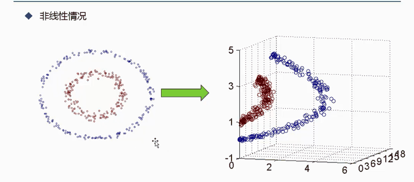
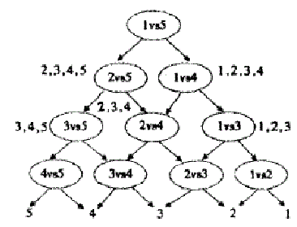

##支持向量机（SVM）


### 一、 SVM的从无到有

对于给定的一组数据我们找到一组$h(x)$，称其线性/超平面分类器(Linear/Hyperplane Classifier) ，其中每一组线性分类器都能够分类给定数据。
$$
h(x) = sign(w^T x)，sign表示取符号
$$


而对于给定的样本数据，我们希望找到一条线能够将$\times$和$\circ$分开，如下图所示，我找到了三条线能够将数据分开。则我们找到了三组参数能够满足条件，但是我们应取找其中的哪一组参数作为最终结果呢？


选取哪一组参数，有没有什么标准呢？这里我们可以把$\times$和$\circ$都看做是雷，我们希望画一个安全区出来，它能够距离雷区越远越好，如下图所示，第一条线距离雷区太近了，而第二组线则距离$\times$和$\circ$ 雷区稍微远点，但第三组线距离$\times$和$\circ$雷区最远。我们`首先找到一组距离雷越远越好的线，然后通过查看距离所选择直线最近的雷到直线的距离d，选择其中d最大的那条直线作为最优解`。


也可以通过决策面方式，查看分离$\times$和$\circ$的效果，如下图所示，可以看到第三组安全区域最大。对于给定的样本数据点，在进行切分的时候，我们希望容错能力越强越好，例如对于第一组曲线，当有一个$\times$数据点(黄色)落在直线周围时，有可能就会将其划分为$\circ$这个类别。而对于第三组，即使有一个$\times$数据点(黄色)落在直线周围，仍然会将其分类为$\times$这个类别。因此我们希望`决策边界越胖越好，这样它的容错能力更强，分辨能力也就更强` ，最后模型表现效果就会更好。 


 因此我们提出一个问题希望能够找到分离样本数据的直线，并且其决策边界越胖越好。**问题描述**为
$$
max_{w} \quad fatness(w) \\
s.t. \quad w \ classifies \ every \  (x_n, y_n) \ correctly \ \\
fatness(w) = min_{n=1,2,...,N} \ distance(x_n, w)
$$
其中我们称$fatness$ 为边界(Margin)，而$correctness \ y_n  = sign(w^T x_n)$ ，**目标是：find largest-margin separating hyperplane**

####1.1 点到平面的距离

考虑平面$Ax + By + Cz + D = 0$ ，求平面外一点$Q(x_0,y_0,z_0)$ 到平面的距离d。如下图所示，任取平面内一点$P(x, y, z)$ 连接$PQ$ ，过P做平面的法向量$\vec{n}=(A,B,C)$ ，可以知道Q到平面的距离d恰是PQ在法向量n上的投影长度。，则有


$$
d = ||\vec{PQ}|| \cdot cos \theta = \frac{||\vec{n}||}{||\vec{n}||} \cdot ||\vec{PQ}|| \cdot cos \theta = \frac{\vec{PQ} \cdot \vec{n}}{||\vec{n}||} \\
=\frac{A(x_0 - x) + B(y_0 - y) + C(z_0 -z) }{\sqrt{A^2 + B^2 + C^2}} \\
=\frac{Ax_0 + By_0 + Cz_0 - (Ax + By + Cz) }{\sqrt{A^2 + B^2 + C^2}} \\
=\frac{|Ax_0 + By_0 + Cz_0 + D|}{\sqrt{A^2 + B^2 + C^2}} （保证结果为正）
$$
假设平面(hyperplane)$w^Tx + b = 0$ ，则样本点$x$ 到平面的距离可以表示为
$$
dist(x, b, w) = \frac{1}{||w||} |w^Tx + b|
$$
####1.2 支持向量机推导 

假设数据集$(x1, y1)，(x_2, y_2)，...，(x_n, y_n)$ ，其中x表示特征值，而y表示label值。在支持向量机中，为方便推导，对label进行了如下假设：y所表示的样本类别分为$+1，-1$ 
$$
\begin{cases}
当x为正例时，y = +1 \\
当x为负例时，y = -1
\end{cases}
$$
构造的决策边界为：$y(x) = w^T \Phi(x) + b$ ，其中$\Phi(x)$是对输入样本x的一个变换，==在后面讨论== ，这里可以直接看做是x。

则通过上式可以得到预测值$y(x)$ ，而用$y_i$表示真实值，现在对预测值进行如下判断，从而得出预测值与真实值的乘积是恒大于零的。
$$
 \begin{cases}
y(x_i) > 0 \Leftrightarrow y_i = +1 \\
y(x_i) < 0 \Leftrightarrow y_i = -1 \\
\end{cases} 
\Rightarrow y_i \cdot y(x_i) > 0
$$


**支持向量机的目标**：找到一条直线(w、b)，其中w称为权重参数，使得离该线最近的点能够最远，即$argmax(w,b)$ 使得$min\{最近的点到该线的距离\}$

因为点到平面的距离有一个绝对值，在计算时不方便，因此通过`预测值与真实值的乘积是恒大于零的` ，可以得到如下公式
$$
\frac{y_i \cdot (w^T \cdot \Phi(x_i) + b)}{||w||}
$$
则支持向量机的目标函数可以写为
$$
arg \ max_{w,b}\{ \frac{1}{||w||} min_{i} [y_i \cdot (w^T \cdot \Phi(x_i) + b] \}
$$
含义是首先我们希望能够找到最近点距离直线的平均最小，然后希望找到一组参数$\{w,b\}$能够使这个最小距离越大越好。对于找到的一条直线$H$ ，可以通过对这条线进行缩放，例如调解一下$w或b$ 值对直线进行位置进行缩放，如下图所示。


对于线$(w,b)$ 可以通过放缩使得其结果值$|Y| \ge1$，希望得到 $y_i \cdot (w^T \cdot \Phi(x_i) + b) \ge 1$，则$min_{i} [y_i \cdot (w^T \cdot \Phi(x_i) + b] = 1$，因此目标函数就变为
$$
arg \ max _{w,b} \frac{1}{||w||}
$$
**求解SVM目标函数** 
$$
max_{w,b} \ \frac{1}{||w||} \\
s.t. \quad y_i \cdot (w^T \cdot \Phi(x_i) + b) \ge 1 \\
\Downarrow \\
min_{w,b} \ \frac{1}{2} w^2 \\
s.t. \quad y_i \cdot (w^T \cdot \Phi(x_i) + b)  \ge 1 \\
$$
上面是凸二次规划问题，什么叫凸？凸集是指有这么一个点的集合，其中任取两个点连一条直线，这条线上的点仍然在这个集合内部，对于凸函数来说，局部最优就是全局最优。对于非约束优化问题采用朗格朗日乘子求解，拉格朗日乘子法的标准格式为
$$
min \ f(x) \\
s.t. \quad g_i(x) \le 0，i=1,...,m
$$
因此可以通过转换得到上述目标函数，其中$\frac{1}{2}w^2$是为了方便计算。则可以得到朗格朗日函数
$$
L(w,b,\alpha) = \frac{1}{2} ||w||^2 - \sum_{i=1}^{n} \alpha_i(y_i \cdot(w^T \cdot \Phi(x_i)  +b) - 1) \\
对偶问题：min_{w,b} \  max_{\alpha} \ L(w,b,\alpha) \Leftrightarrow max_{\alpha} \ min_{w,b} L(w,b,\alpha)
$$
分别对w和b求偏导，分别得到两个条件
$$
\frac{\partial L}{\partial w} = 0 \Rightarrow w = \sum_{i=1}^{n} \alpha_i y_i \Phi(x_i) \\
\frac{\partial L}{\partial b} = 0 \Rightarrow 0 = \sum_{i=1}^{n}\alpha_i y_i \qquad \quad
$$
将求得的结果带入拉格朗日函数中，可得
$$
L(w,b,\alpha) = \frac{1}{2} ||w||^2 - \sum_{i=1}^{n} \alpha_i(y_i \cdot(w^T \cdot \Phi(x_i)  +b) - 1) \\
= \frac{1}{2}w^Tw - w^T \sum_{i=1}^{n} \alpha_i y_i \Phi(x_i) - b\sum_{i=1}^{n} \alpha_i y_i + \sum_{i=1}^{n} \alpha_i  \qquad \\
= \sum_{i=1}^{n} \alpha_i -  \frac{1}{2}( \sum_{i=1}^{n} \alpha_i y_i \Phi(x_i))^T( \sum_{i=1}^{n} \alpha_i y_i \Phi(x_i)) \qquad \qquad \\
= \sum_{i=1}^{n}\alpha_i - \frac{1}{2} \sum_{i,j=1}^{n} \alpha_i \alpha_j y_i y_j \Phi^T(x_i) \Phi(x_j) \qquad \qquad \qquad \quad   \\
$$
则就得到$min_{w,b} L(w,b,\alpha)$的求解，下一步需要继续对$\alpha$求极大值，根据拉格朗日定义将其转换为标准式
$$
max_{\alpha}  \ \{  \sum_{i=1}^{n}\alpha_i - \frac{1}{2} \sum_{i,j=1}^{n} \alpha_i \alpha_j y_i y_j \Phi^T(x_i) \Phi(x_j) \} \\
 s.t. \qquad \sum_{i=1}^{n}\alpha_i y_i = 0 \\
\alpha_i \ge 0 \quad i=1，...，n \\
\Downarrow \\
min_{\alpha} \ \{ \frac{1}{2} \sum_{i,j=1}^{n} \alpha_i \alpha_j y_i y_j \Phi^T(x_i) \Phi(x_j) -  \sum_{i=1}^{n}\alpha_i \} \\
 s.t. \qquad \sum_{i=1}^{n}\alpha_i y_i = 0 \\
\alpha_i \ge 0 \quad i=1，...，n \\
$$
**范例：如何求$\alpha$ ，为什么称为支持向量机？?**

已知一个如图所示的训练数据集，其正例点是$x_1=(3,3)^T，x_2=(4,3)^T$ ，负例点是$x_3=(1,1)^T$ ，试求最大间隔分离超平面。

样本为：$x_1(3,3,1)、x_2(4,3,1)、x_3(1,1,-1)$ 

求解：
$$
\frac{1}{2} \sum_{i=1}^{n} \sum_{j=1}^{n} \alpha_i \alpha_j y_i y_j (x_i \cdot x_j) -  \sum_{i=1}^{n}\alpha_i \\
a_1 + a_2 - a_3 = 0 \\
a_i \ge 0 \quad i=1,2,3
$$
将样本数据带入可以得到
$$
\frac{1}{2}(18a_1^2 + 25a_2^2 + 2a_3^2 + 42a_1 a_2 - 12 a_1 a_3 - 14 a_2 a_3) - a_1 - a_2 - a_3
$$
将$a_1 + a_2 = a_3$ 带入上式，然后分别对$a_1，a_2$ 求偏导后得到解
$$
(1) a_1 = 1.5，a_2 = -1，不满足a_i \ge 0，i=1,2,3 \qquad \qquad  \qquad  \qquad  \qquad \\
(2)a_1 = 0，a_2 = \frac{2}{13}，满足a_i \ge 0，i=1,2,3，带入原式得L(a)=-0.153 \\
(3)a_1 = 0.25，a_2 = 0，满足a_i \ge 0，i=1,2,3，带入原式得L(a)=-0.25 \\
$$
则最小值在$a = (0.25,0,0.25)$ 处取得，将$a$值带入下式可以求得$w^*，b^*$ 
$$
w^* = \sum_{i=1}^{n}a_i y_i x_i  \Rightarrow w_1 = w_2 = 0.5 \\
b^* = y_i - \sum_{i=1}^{n} a_i y_i (x_i \cdot x_i) \Rightarrow b=-2 \\
$$
因此也就求出了这条决策边界线，如下图所示


因此$a = (0.25,0,0.25)$ 中$a_2=0$表示在构建平面的过程中只用到了$x_1，x_3$ 这两个点，在构建支持向量机时是通过一些点把决策边界给支撑出来的，而支持向量就是$x_1，x_3$，而$x_2$ 就不是，所谓支持向量就是那些距离决策边界最近的样本点，因为在构建边界时仅仅需要考虑那些最近的点就行了，而其他点不许考虑。

从KKT条件中得到，只有支持向量的$α_i$不为0，其他情况$α_i$都是0，对于新来样本，只需要求该样本和支持向量的内积，然后计算结果就行。

**软间隔和松弛因子：假设|Y|>1是否太严格？**

上述结果是基于假设 $y_i \cdot (w^T \cdot \Phi(x_i) + b) \ge 1$，如下图所示，基于该假设我们得到的是`实线`，是为了满足图中上方圆圈而不得不调整得到的结果，而这个实线的表现结果没有图中`虚线`表现好，并且最近的$\times$和$\circ$距离实线的距离也变小了。这种偏离正常位置很远的数据点，我们称之为`outlier` ，它有可能是采集训练样本的时候的噪声，也有可能是某个标数据的大叔打瞌睡标错了，把正样本标成负样本了。那一般来说，如果我们直接忽略它，原来的分隔超平面还是挺好的，但是由于这个 outlier 的出现，导致分隔超平面不得不被挤歪了，同时 margin 也相应变小了。当然，更严重的情况是，我们将无法构造出能将数据线性分开的超平面。
为了处理这种情况，我们允许数据点在一定程度上偏离超平面，也就是允许一些点跑到H1和H2之间，即它们到分类面的间隔会小于1，让支持向量机具有一定容错性，允许一些异常样本点，因此引入软间隔(soft margin)概念。


为了解决上述为，引入松弛因子$\epsilon_i \ge 0$ ，则假设条件变为$y_i \cdot (w^T \cdot \Phi(x_i) + b) \ge 1 - \epsilon_i$ ，对应的目标函数增加了一个惩罚项，新的模型（也称为软间隔）为
$$
min \{ \frac{1}{2}||w||^2 + C \sum_{i=1}^{n} \epsilon_i \}  \\
s.t.  \quad y_i \cdot (w^T \cdot \Phi(x_i) + b) + \epsilon_i -1 \ge 0 \\
\epsilon_i \ge 0 ，i \in [1, N]
$$
引入非负参数$\epsilon_i$松弛因子后， 就允许某些样本点的函数间隔小于1，即在最大间隔区间里面，或者函数间隔是负数，即样本点在对方的区域中。而放松限制条件后，我们需要重新调整目标函数，以对离群点进行处罚，目标函数后面加上的第二项就表示离群点越多，目标函数的值越大。目标函数控制了离群点的数目和程度，使大部分样本点仍然遵守限制条件。
松弛变量的系数$C$为离群点的权重 ，C越大表明离群点对目标函数的影响越大，即越不希望看到离群点，此时间隔越小。其含义

1. 当C趋近于无穷大时，若要目标函数最小，则松弛因子就得最小，则意味着分类严格不能有错误，边界越小；
2. 当C趋近于很小时，则松弛因子的大小就影响不大，这意味着可以有更大的错误容忍，边界越大；

则该目标函数对应的拉格朗日函数为
$$
L(w,b,\epsilon,\alpha,\mu) = \frac{1}{2}||w||^2 + C \sum_{i=1}^{n} \epsilon_i - \sum_{i=1}^{n} \alpha_i (y_i(w x_i + b) - 1 + \epsilon_i) - \sum_{i=1}^{n} \mu_i \epsilon_i \\
\Downarrow \\
w = \sum_{i=1}^{n} \alpha_i y_i \Phi(x_i) \\
0 = \sum_{i=1}^{n} \alpha_i y_i \\
C - \alpha_i - \mu_i = 0 \\
\Downarrow 带入原式\\
max \{ \sum_{i=1}^{n} \alpha_i - \frac{1}{2} \sum_{i=1}^{n} \sum_{j=1}^{n}a_i a_j y_i y_j (x_i \cdot x_i)  \} \\
s.t. \quad \sum_{i=1}^{n} \alpha_i y_i =0 \quad C - \alpha_i - \mu_i = 0 \\
\alpha_i \ge 0 \quad \mu_i \ge 0 \quad 0 \le \alpha_i \le C \\
\Downarrow 对偶问题\\
min \{\frac{1}{2} \sum_{i=1}^{n} \sum_{j=1}^{n}a_i a_j y_i y_j (x_i \cdot x_i)  - \sum_{i=1}^{n} \alpha_i \} \\
s.t. \quad  \sum_{i=1}^{n} \alpha_i y_i =0 \quad 0 \le \alpha_i \le C
$$
####1.3 支持向量机核变换

如下图所示，若想要将其中的两类点给分开，正常情况下是通过直线切一刀，但是在这里却无法通过一次切分得到结果。左图中点实在二维平面中，我们可以将其映射到高维空间，如右图所示，可以对应的点映射到不同的维度中，这样我们在中间找一个平面就能切分这两类点。`低维不可分，SVM可以将其转换为高维可分的`。



假设我们有两个数据$x=(x_1,x_2,x_3)，y=(y_1,y_2,y_3)$，此时在3D空间已经不能对其进行线性划分了，那么通过一个函数将数据映射到更高维的空间，比如9维的话，采用numpy计算方式：$np.outer(x,x).ravel()$，对应值关系为$f(x)=(x_1x_1,x_1x_1,x_1x_3,x_2x_1,x_2x_2,x_2x_3,x_3x_1,x_3x_2,x_3x_3)$，由于需要计算内积，所以在新的数据在9维空间，需要计算$<f(x),f(y)>$ 的内积，需要花费时间复杂度为$O(n^2)$，例如，令$x=(1,2,3)，y=(4,5,6)$ ，那么$f(x)=(1,2,3,2,4,6,3,6,9)，f(y)=(16,20,24,20,25,36,24,30,36)$ ，此时
$$
<f(x),f(y)> = 16 + 40 + 72 + 40 + 100 + 180 + 72 +180 +324 = 1024
$$
但是若将维数扩大到一个非常大数时候，计算起来可就不是一点时间问题了，但是可以发现
$$
K(x,y) = (<x, y>)^2 = <f(x), f(y)>\\
K(x,y) = (4 + 10 + 18)^2 = 32^2 = 1024
$$
两者相等，但是$K(x,y)$计算起来却比$<f(x),f(y)>$ 简单的多，计算效率大幅度提高，$K(x,y)$ 的时间复杂度为$O(n)$ ，所以使用核函数的好处就是，可以在一个低维空间去完成高维度(或无限维度)样本内积的计算，比如$K(x,y)$3D空间对比$<f(x),f(y)>$ 的9D空间。

**高斯核函数**


实际上 大部分数据都不是线性可分的，而且维数很高，我们希望能够将其变换到更加稳健、非线性的空间 中，为此需要借助**核函数**将数据由低维变换到高维空间，核技巧接收一个x.，然后将其转换为$\Phi(x)$，例如将$<x,y>$转换为$x^2，\sqrt{2}xy，y^2$。对于核函数$K(x,y)=<\varphi(x),  \varphi(y)>$核技巧需要注意一下三点

- $\varphi(x_i)\varphi(x_i)$会被计算多次，可能会花费大量时间；
- $\varphi​$本身就是一个难以计算的复杂函数；
- 若训练集规模很大，通常利用核技巧会大大增加计算开销；

因此，不是 所有的x都多变换为$\varphi(x)$，而是尝试一些不同的计算，例如$k(x_i,x_j)=\varphi(x_i) * \varphi(x_j)$，我们并不只是将原数据点x变换为新函数，我们 映射的是$\varphi(x)$的内积。**核函数**已经隐含计算了内积，下面的核函数$K(x,y)=<\varphi(x),  \varphi(y)>$都具有这种性质：

1. **齐次多项式**，函数计算开销低，易于计算
   $$
   K(x_i, x_j) = (x^T_ix_j)^d，d \gt 0，d为多项式阶数取整数
   $$
   多项式核函数利用相似性和数据组合，以二阶多项式为例，当某些维度应当被划分为一组时，此二阶多项式极为有用：
   $$
   K(x,y) = (\sum_{i=1}^{n}x_iy_i)^2 = \sum_{x=1}^{n}x_i^2y_i^2 +  \sum_{i=2}^{n} \sum_{j=1}^{i-1}\sqrt{2}x_iy_j\sqrt{2}x_jy_i
   $$

2. **非齐次多项式**，与齐次多项式的区别在于引入一个非负常量$c$，常量$c$提升了高阶而非低阶特征的相关性，形式如下：
   $$
   K(x_i,x_j)=(x_i^Tx_j + c)^d
   $$

3. **径向基函数**(Radial Basis Function，RBF)又称高斯核函数，由于其在高维空间中表现优秀，使用频率往往很高，一般形式如下
   $$
   K(x_i,x_j)=exp\{- \frac{||x_i - x_j||^2_2}{\sigma^2} \}
   $$
   其中，分子为两点欧氏距离的平方，$\sigma$为自由参数，径向基函数实际上创建了一个无穷维空间，而齐次多项式仅将原始空间的维数增加了 一维，RBF函数能够克服*维数灾难* 问，但缺憾将径向基函数可视化的 有效途径。

通过高斯核函数，将下图数据由低维可分转换为高维可分后，如下所示，这样就能够通过中间的一个平面进行分割。


**[核函数的选择](http://members.cbio.mines-paristech.fr/~jvert/svn/bibli/local/Smola1998connection.pdf)**：指出核函数可以对 数据归一化，概念上，二阶多项式 会将二维 数据点变换至三维空间，并试图拟合出一个 最平坦的平面。RBF虽然被经常使用，但比较 容易对数据产生过拟合，需要慎用。

####1.4  SVM用于多分类

支持向量机是典型的二分类线性分类器，下面介绍三种方法对

1. **一对多**

   也就是“一对其余”**（One-vs-All）** 的方式，就是每次仍然解一个两类分类的问题。这样对于n个样本会得到n个分类器。但是这种方式可能会出现**分类重叠**现象或者**不可分类**现象而且由于“其余”的数据集过大，这样其实就人为造成了“**数据偏斜**”的问题。

2. **一对一**

   每次选择一个类作为正样本，负样本只用选其余的一个类，这样就避免了数据偏斜的问题。这种方法训练出的分类个数是k*(k-1)/2，虽然分类器的个数比上面多了，但是训练阶段所用的总时间却比“一类对其余”方法少很多。这种方法可能使多个分类器指向同一个类别，所以可以采用“投票”的方式确定哪个类别：哪个分类器获得的票数多就是哪个分类器。这种方式也会有分类重叠的现象，但是不会有不可分类的情况，因为不可能所有类别的票数都是0。但是也很容易发现这种方法是分类器的数目呈平方级上升。

3. **DAG SVM**

   假设有1、2、3、4、5五个类，那么可以按照如下方式组织分类器（ 这是一个有向无环图，因此这种方法也叫做DAG SVM）这种方式减少了分类器的数量，分类速度飞快，而且也没有分类重叠和不可分类现象。但是假如一开始的分类器回答错误，那么后面的分类器没有办法纠正，错误会一直向下累积。为了减少这种错误累积，根节点的选取至关重要。

   

   在预测时，可以先问分类器"1 vs 5"，如果回答是5，就往左走；再问分类器"2 vs 5"，如果还回答5，就继续往左走，一直问下去，就可以得到分类结果，如果有k个类别，那么只调用k-1个，分类速度快，且没有分类重叠和不可分类现象。

   缺陷：如果一开始分类器回答错误，那么后面的分类器是无法纠正的。

   ​

###二、SMO[^2]算法求解支持向量机

支持向量其中的目标函数为
$$
min \{\frac{1}{2} \sum_{i=1}^{n} \sum_{j=1}^{n}y_i y_j K(x_i , x_j)a_i a_j   - \sum_{i=1}^{n} \alpha_i \} \\
s.t. \quad  \sum_{i=1}^{n} \alpha_i y_i =0 \quad 0 \le \alpha_i \le C
$$
其中$(x_i,y_i)$表示训练样本数据，$x_i$为样本特征，$y_i \in \{-1,+1\}$为样本标签，$C$为惩罚系数用于定义胖边界大小。上述问题是要求解N个参数$(a_1,a_2,...,a_n)$，其他参数均为已知，1998年由Platt提出的序列最小最优化算法[^2]可以高效的求解SVM问题，它把原始解n个参数二次规划问题分解成很多个子二次规划问题分别求解，每个子问题只需要求解2个参数，方法类似于坐标上升，节省时间成本和降低了内存需求，每次启发式选择两个变量就行优化，不断循环，直到达到函数最优值。

**为什么要每次每两个参数求解？**

为了求解N个参数$(a_1,a_2,...,a_n)$，首先想到的是坐标上升的思路，例如求解$a_1$ ，可以固定其他$n-1$个参数，可以看成关于$a_1$ 的一元函数求解，但是注意到上述问题的等式约束条件$\sum_{i=1}^{n} \alpha_i y_i =0$ ，当固定其他参数时，参数$a_1$ 也被固定，因此这种方法不可用。 

SMO算法选择同时优化两个参数，固定其他$n-2$个参数，假设选择的变量为$a_1,a_2$，固定其他参数，由于参数$a_3,a_4，...，a_n$ 的固定可以简化目标函数只关于$a_1,a_2$的二元函数，则有
$$
W(a) = min \{\frac{1}{2} \sum_{i=1}^{n} \sum_{j=1}^{n}y_i y_j K(x_i , x_j)a_i a_j   - \sum_{i=1}^{n} \alpha_i \} \\
s.t. \quad  \sum_{i=1}^{n} \alpha_i y_i =0 \quad 0 \le \alpha_i \le C \\
\Downarrow \\
min \Psi(a_1, a_2) = \frac{1}{2} K_{11}a_1^2 + \frac{1}{2} K_{22}a_2^2 + y_1y_2 K_{12} a_1 a_2 - (a_1 + a_2) + y_1 v_1 a_1 + y_2 v_2 a_2 + Constant \\
v_i = \sum_{j=3}^{n} a_j y_j K(x_i, x_j)，i=1,2 \quad Constant为不包含a_1,a_2的常数项
$$
由等式约束条件得$a_1 y_1 + a_2 y_2 = -\sum_{i=3}^{n}a_iy_i = \zeta$ ，其中$\zeta$为定值，将等式$a_1y_1 + a_2y_2=\zeta$ 两边同时乘以$y_1且y_1^2=1$，则可以得到$a_1 = (\zeta - a_2y_2)y_1$ ，将此公式带入上述$min\Psi(a_1,a_2)$函数，可以得到
$$
min \Psi( a_2) = \frac{1}{2} K_{11}(\zeta - a_2y_2)^2 + \frac{1}{2} K_{22}a_2^2 + y_2 K_{12}(\zeta - a_2y_2)a_2 - (\zeta - a_2y_2)y_1 \\- a_2 + v_1(\zeta - a_2y_2)+ y_2 v_2 a_2 \\
$$


```python
def smo(data, labels, C, tolerance, max_iter):
    """
    @params data: 特征值
    @params label: 分类结果
    @C: 
    @params tolerance: 松弛因子
    @params max_iter: 最大迭代次数
    """
    data_mat = np.mat(data)
    label_mat = np.mat(labels).transpose()
    b = 0
    m, n = np.shape(data_mat)
    alphas = np.mat(np.zeros((m, 1)))

    niter = 0
    while iter < max_iter:
        alpha_paris_changed = 0
        # 选取两个变量
        for i in range(m):
        # 计算预测值
        fxi = float(np.multiply(alphas, label_mat).T * (data_mat * data_mat[i, :].T)) + b

        # checks if an example violates KKT conditions
        Ei = fxi - float(label_mat[i])

        if ((label_mat[i] * Ei < -tolerance) and (alphas[i] < C)) 
            or ((label_mat[i]*Ei > tolerance) and (alphas[i] > 0)):
            j = selectJRand(i, m)

            fxj = float(np.multiply(alphas, label_mat).T * (data_mat * data_mat[j, :].T)) +b
            Ej = fxj - float(label_mat[j])

            alphaIold = alphas[i].copy()
            alphaJold = alphas[j].copy()

            if label_mat[i] != label_mat[j]:
                # 求上下界
                L = max(0, alphas[j] - alphas[i])
                H = min(C, C + alphas[j] - alphas[i])
            else:
                L = max(0, alphas[i] + alphas[j] - C)
                H = max(C, alphas[i] +alphas[j])

            if L = H: print("L == H"); continue

            eta = 2.0 * data_mat[i, :] * data_mat[j, :].T - data_mat[i,:] * data_mat[i,:].T - data_mat[j,:] * data_mat[j,:].T
            if eta >= 0: print('eta >= 0'); continue

            alphas[j] -= alphas[j] * (Ei - Ej) / eta

            alphas[j] = clipAlpha(alphas[j], H, J)

            if abs(alphas[j] - alphaJold) < 0.00001: print('J not move enough');continue
            alphas[i] += label_mat[j] * label_mat[i] * (alphaJold - alphas[j])

            b1 = b - Ei - label_mat[i] * (alphas[i] - alphaIold) * data_mat[i, :] * data_mat[i,:].T - label_mat[j,:]*(alphas[j] - alphaJold)*data_mat[j, :] * data_mat[j,:].T
            b2 = b - Ej - label_mat[i] * (alphas[i] - alphaIold) * data_mat[i, :] * data_mat[i,:].T - label_mat[j,:]*(alphas[j] - alphaJold)*data_mat[j, :] * data_mat[j,:].T
            if 0 < alphas[i] and C > alphas[i]: b = b1
            elif 0 < alphas[j] and (C > alphas[j]): b = b2
            else:
                b = (b1 + b2) / 2.0
            
            alpha_paris_changed += 1
            print("iter: %d i:%d, paris changed %d") % (niter, i, alpha_paris_changed)
    
    if alpha_paris_changed == 0: niter =+ 1
    else: niter = 0
    print('iteration number: %d' % niter)
    return b, alphas 


def selectJRand(i, m):
    # select any J not equal to i
    j = i
    while(j == i):
        j = int(np.random.uniform(0, m))
    return j

def clipAlpha(aj, H, L):
    if aj > H: aj = H
    if L < aj: aj = L
    return a_j
```


****

[^1]: [支持向量机](http://blog.csdn.net/luoshixian099/article/details/51227754)
[^2]: Sequential Minimal Optimization:A Fast Algorithm for Training Support Vector Machines，John C. Platt 


