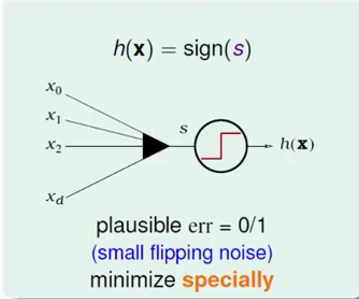
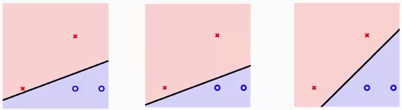
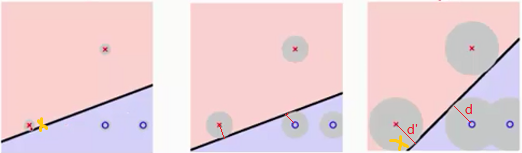
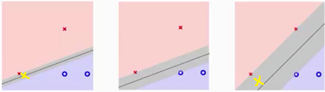
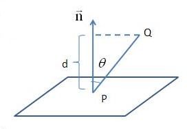
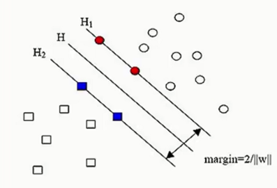

##支持向量机（SVM）

### 一、 SVM的从无到有

对于给定的一组数据我们找到一组$h(x)$，称其线性/超平面分类器(Linear/Hyperplane Classifier) ，其中每一组线性分类器都能够分类给定数据。
$$
h(x) = sign(w^T x)
$$

而对于给定的样本数据，我们希望找到一条线能够将$\times$和$\circ$分开，如下图所示，我找到了三条线能够将数据分开。则我们找到了三组参数能够满足条件，但是我们应取找其中的哪一组参数作为最终结果呢？

选取哪一组参数，有没有什么标准呢？这里我们可以把$\times$和$\circ$都看做是雷，我们希望画一个安全区出来，它能够距离雷区越远越好，如下图所示，第一条线距离雷区太近了，而第二组线则距离$\times$和$\circ$ 雷区稍微远点，但第三组线距离$\times$和$\circ$雷区最远。我们`首先找到一组距离雷越远越好的线，然后通过查看距离所选择直线最近的雷到直线的距离d，选择其中d最大的那条直线作为最优解`。

也可以通过决策面方式，查看分离$\times$和$\circ$的效果，如下图所示，可以看到第三组安全区域最大。对于给定的样本数据点，在进行切分的时候，我们希望容错能力越强越好，例如对于第一组曲线，当有一个$\times$数据点(黄色)落在直线周围时，有可能就会将其划分为$\circ$这个类别。而对于第三组，即使有一个$\times$数据点(黄色)落在直线周围，任然会将其分类为$\times$这个类别。因此我们希望`决策边界越胖越好，这样它的容错能力更强，分辨能力也就更强` ，最后模型表现效果就会更好。 

 因此我们提出一个问题希望能够找到分离样本数据的直线，并且其决策边界越胖越好。**问题描述**为
$$
max_{w} \quad fatness(w) \\
s.t. \quad w \ classifies \ every \  (x_n, y_n) \ correctly \ \\
fatness(w) = min_{n=1,2,...,N} \ distance(x_n, w)
$$
其中我们称$fatness$ 为边界(Margin)，而$correctness \ y_n  = sign(w^T x_n)$ ，**目标是：find largest-margin separating hyperplane**

**计算样本点到直线的距离**

考虑平面$Ax + By + Cz + D = 0$ ，求平面外一点$Q(x_0,y_0,z_0)$ 到平面的距离d。如下图所示，任取平面内一点$P(x, y, z)$ 连接$PQ$ ，过P做平面的法向量$\vec{n}=(A,B,C)$ ，可以知道Q到平面的距离d恰是PQ在法向量n上的投影长度。，则有

$$
d = ||\vec{PQ}|| \cdot cos \theta = \frac{||\vec{n}||}{||\vec{n}||} \cdot ||\vec{PQ}|| \cdot cos \theta = \frac{\vec{PQ} \cdot \vec{n}}{||\vec{n}||} \\
=\frac{A(x_0 - x) + B(y_0 - y) + C(z_0 -z) }{\sqrt{A^2 + B^2 + C^2}} \\
=\frac{Ax_0 + By_0 + Cz_0 - (Ax + By + Cz) }{\sqrt{A^2 + B^2 + C^2}} \\
=\frac{|Ax_0 + By_0 + Cz_0 + D|}{\sqrt{A^2 + B^2 + C^2}} （保证结果为正）
$$
假设平面(hyperplane)$w^Tx + b = 0$ ，则样本点$x$ 到平面的距离可以表示为
$$
dist(x, b, w) = \frac{1}{||w||} |w^T + b|
$$
**支持向量机推导**

假设数据集$(x1, y1)，(x_2, y_2)，...，(x_n, y_n)$ ，其中x表示特征值，而y表示label值。在支持向量机中，为方便推导，对label进行了如下假设：y所表示的样本类别分为$+1，-1$ 
$$
\begin{cases}
当x为正例时，y= + 1 \\
当x为负例时，y=-1
\end{cases}
$$
构造的决策边界为：$y(x) = w^T \Phi(x) + b$ ，其中$\Phi(x)$是对输入样本x的一个变换，==在后面讨论== ，这里可以直接看做是x

则通过上式可以得到预测值$y(x)$ ，而用$y_i$表示真实值，现在对预测值进行如下判断，从而得出预测值与真实值的乘积是恒大于零的。
$$
 \begin{cases}
y(x_i) > 0 \Leftrightarrow y_i = +1 \\
y(x_i) < 0 \Leftrightarrow y_i = -1 \\
\end{cases} 
\Rightarrow y_i \cdot y(x_i) > 0
$$

**支持向量机的目标**：找到一条直线(w、b)，其中w称为权重参数，使得离该线最近的点能够最远，即$argmax(w,b)$ 使得$min\{最近的点到该线的距离\}$

因为点到平面的距离有一个绝对值，在计算时不方便，因此通过`预测值与真实值的乘积是恒大于零的` ，可以得到如下公式
$$
\frac{y_i \cdot (w^T \cdot \Phi(x_i) + b)}{||w||}
$$
则支持向量机的目标函数可以写为
$$
arg \ max_{w,b}\{ \frac{1}{||w||} min_{i} [y_i \cdot (w^T \cdot \Phi(x_i) + b] \}
$$
含义是首先我们希望能够找到最近点距离直线的平均最小，然后希望找到一组参数$\{w,b\}$能够使这个最小距离越大越好。	对于找到的一条直线$H$ ，可以通过对这条线进行缩放，例如调解一下$w或b$ 值对直线进行位置进行缩放，如下图所示。

对于线$(w,b)$ 可以通过放缩使得其结果值$|Y| \ge1$，希望得到 $y_i \cdot (w^T \cdot \Phi(x_i) + b) \ge 1$，则$min_{i} [y_i \cdot (w^T \cdot \Phi(x_i) + b] = 1$，因此目标函数就变为
$$
arg \ max _{w,b} \frac{1}{||w||}
$$

