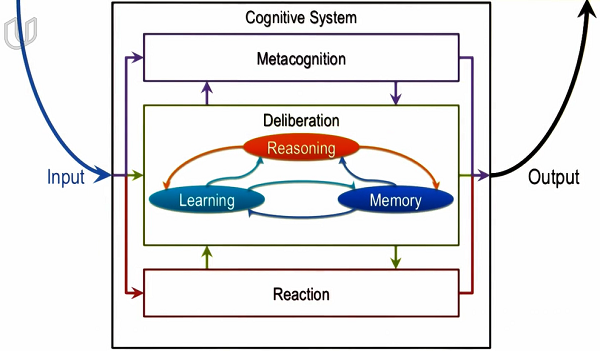

##机器学习 

机器学习主要源自于**人工智能**和**数据科学**，机器学习的核心是建立数据模型，然后依据一些度量标准来验证模型或相互比较。人工智能是要创造出与人类一样的机器，这个方向上又分为不同学派，其中就包括关注与构建人类一样思考的认知系统，而机器学习主要关注的是制造能够自主动作的机器而不管其是否能够像人类一样思考。

**人工智能简介**

人工智能中有需要解决的难题，这里列举主要的5个难题：

1. Intelligent Agents have limited resources(little computational resources processing speend, memory size), AI problems are computationally intractable. How can we get AI agents to give us near real time performance on many interesting problems?
2. All computation is local, but problems have global constrains. How can we get AI agents to address global problems using local computation?
3. Computation logic is fundamentally deductive(演绎逻辑), but many AI problems are abductive(溯因性) or inductive(归纳性) in their nature. How can we get AI agents to address abductive or inductive problems?
4. The world is dynamic, knowledge is limited, but am AI agent must always begin with what it already knows. How can an AI agent ever address a new problem?
5.   Problem solving, reasoning, and learning are complex, but explanation and justification(解释和证明) add to the complexity. How can we get an AI agent to erver explain ot justify it's decisions?

人工智能问题的一些特征：

1. Data arrives incrementally not all the data comes right at the beginning(不是一开始就出现所有数据).

2. Problems often have  a recurring pattern, the same kinds of problems occur again and again. 

3. Problems occur at many different levels of abstraction. 

4. many interesting AI problems are computationally intractable(通过计算难以解决).

5. The world is dynamic, it's constantly changing but knowledge of the world is relative to static.

6. The world is open ended(外界开放式的), but knowledge of the world is relatively limited.

那么问题就变成我们如何能设计出AI智能体(AI agents)来解决具有这些特征的AI问题。有关人工智能Sebatian有另外一种描述：人工智能是计算机软件中不确定性管理(uncertainty management)的技术，即人工智能学科要解决的问题是在你不知道怎么办，该做些什么，有很多原因会导致计算机程序中的不确定性，可能是传感器限制(无法准确告诉你人工智能系统以外的情况)；也可能是你的对手采取迷惑性的行为让你无法了解其真实意图；也可能是随机环境例如在你玩骰子，其随机性导致你无法准确预测出其结果；也可能是迟缓(laziness)，也许你能计算出当前情况，但是计算机程序运行太慢而无法计算出来；也可能是因为完全无知(Plain Ignorance)，许多人对发生的事情一无所知，他们可以知道但只是不关心。所有这些都是不确定性的原因，而人工智能这门科学就是用来处理不确定性以及在决策中管理这些不确定性，从某个角度来说这就是人工智能和机器学习的真谛，即设计一个程序来处理不确定性的输入。

那么通过人工智能的特点，我们应该如何判定一个问题是不是属于人工智能问题呢？考虑一下几个问题，看一下它们是不是人工智能问题或者哪些问题你会通过构建AI agents来解决：

- Answering questions on Jeopardy
- Configuring the dimensions for the basement of a new house
- Tying shoelaces
- Deciding on a route to a new destination
- Making sense of a news broadcast
- Designing a robot that walks on water
- Establishing whether a flower pot can used as a drinking cup
- Deciding whether or not a new animal is a bird

人工智能的目标是重现人类智慧，因此上面所有问题都是人工智能问题，需要针对每一个问题设计出一个AI agents来解决。例如：IBM设计的程序Watson参加过智力竞赛节目Jeopardy，若要设计出Watson AI agents，则它必须能够完成四件基本事情：读懂提示、搜索知识库、确定准确答案、按照问题形式对答案进行润色。基于知识的人工智能有三种基本过程：学习(learning)、记忆(memory)和推理(reasoning)，三者紧密联系。

学习可能获得某些问题的正确答案并将答案存在某个地方，也可能获得错误的答案则一旦它学到正确的答案也会将其存在在某个地方。学习的知识必须存放在记忆中的某处，若需要利用知识进行推理，则必须从记忆某处调出这些知识，因此记忆用于存放学习到的知识同时提供推理所需要的知识。学习后能够推理，推理的结果通常促进更多的学习；学习后可将成果存在记忆中，但需要记忆中的知识才能学习，知道的越多学到的就越多；推理需要用到记忆中的知识，推理的结果也会存在记忆中，因此这三个过程密切相关，这三个过程合在一起称为**Deliberation Process**。Deliberation Process包含在基于知识的AI Agent的总体架构中。AI agent的总体架构如下所示，输入表现为对外界的感知，输出表现为在外界中的行为，AI agent中有大量Deliberation Process将感知的信息映射为行动

**人工智能的四个学派**

为了更好的理解人工智能，下图对比不同人工智能思想学派，竖轴分为$thinking \longleftrightarrow acting$，例如当驾驶汽车时是在现实世界中行动，当计划行车路线时是在思考世界。横轴分为$optimally \longleftrightarrow like \ humans$，人具有多种功能且拥有robust intelligence，这种智能相对于任何一项任务无需为最佳但它的适应性很广，能有效完成非常多的任务，而另一端$optimally$能够以最佳方式完成给定任务。通过给定维度得到四种AI agents，从左上角开始逆针依次是：**以最佳方式思考的主体**、**以最佳方式行动的主体**、**像人一样行动的主体**及**像人类一样思考的主体**。基于知识的人工智能属于像人类一样思考这一维度。为了更好理解四个维度，下图中分别列出了对应的实例，许多机器学习算法分析大量数据并确定数据的规律模式，这些算法以最佳方式思考但并不一定像人类那样思考；飞机自动驾驶仪会以最佳方式行动；即兴表演的机器人能随着播放的音乐起舞，它们行动同时行为又像人类一样；语义网是新一代Web技术，能够让Web理解不同的页面和页面上的信息，属于向人类一样思考的主体。

无人驾驶汽车属于像人类一样行动的主体，下面给出四个例子，分别给出其对应于上述的哪一个象限？

- Roomba(automated vacuum) $\rightarrow act \ optimally$
- C-3PO(Star Wars) $\rightarrow act \ like \ humans$
- Siri(Apple virtual assistant) $\rightarrow thinking \ like humans$
- Google Maps(route navigation) $\rightarrow act  \ optimally$

**数据科学**

数据科学的大部分工作是研究数据模式，然后对原因提出假设(hypothesizing a cause)。什么是数据科学家，下图给出了解释：数据科学家掌握了多种不同的技能，数据科学家了解数学和统计学知识使得他们能够在海量数据中找出引人关注的见解，同时还具备编程技能通过代码建立统计模型并从不同数据源中获取数据，此外，他们还知道如何提出正确的问题并将问题转换为全面的分析，分析完成后，他们运用沟通技巧以人们易于理解的方式报告他们的发现。总之，数据科学家能够对庞大的数据集执行复杂的分析，在完成分析后他们还能编制信息图以将发现传递给其他人。

**机器学习**

**监督学习**可以看做是函数逼近(Function Approximation)，在得到确定的模型或函数后，就能够对其进行**泛化**，这是机器学习中的基本问题，其中的原理是**归纳偏差(Inductive Bias)**，所有的机器学习都与归纳(Induction)而非演绎(Deduction)有关。归纳就是从具体到普遍，而演绎则相反是从普遍规则得出具体实例，类似推理。AI技术最初与演绎推理、逻辑编程有关，它们中有明确的规则，只需要演绎那些直接从这些规则产生的事情，例如某件事类似于A意味着B是一条规则，则给出A就得出B，这就是演绎。

**演绎法(Deduction)、归纳法(Induction)和溯因法(Abduction)**

如上图所示，为了理解规则、原因和结果的关系，看如下规则Rule：若阴天，就会下雨。则阴天就是原因Cause，下雨就是结果Effect。另一个例子：规则是Bob讨厌Joe，则只要Joe走进来Bob就会离开，原因是Joe走进来，结果是Bob离开。

- **Deduciton**：Given the rule and the case, deduce the effect.
- **Induction**：Given a cause and an effect, induce a rule.
- **Abduction**：Given a rule and an effect, abduce a case.

演绎法具有**保真性(Truth Preserving)**，即若规则是真，原因也为真则结果一定为真。归纳法和溯因法不具有保真性，从具体推导一般结论不一定正确，这就是方法的难点所在。演绎、归纳和溯因是推理的三种基本形式，现实中我们通过对贯彻的数据使用溯因法找到其可能原因，在找出原因后通过归纳得出一个原则，最后通过归纳出的规则利用演绎法预测行的数据，循环使用溯因、归纳、演绎就可对数进行分析。在机器学习中主要使用归纳，拿出一些数据推测其中存在的因果关系，然后归纳出规则，而规则需要有因果关系，因此规则的正确性就是关联。

**非监督学习** 是关于描述(compact description)，它涉及到获取一组数据然后弄清楚如何通过这样或那样的方式分割数据。将描述看做是非监督学习，而将监督学习看做是函数逼近，则可以先通过非监督学习进行信息压缩，然后通过函数逼近得到有效结果。

学习概念和构建模型是机器学习的核心，下面介绍机器学习的基本要素以便能够更好的区分不同的机器学习算法：

| 要素                   | 关键概念                                                     |
| ---------------------- | ------------------------------------------------------------ |
| WHAT is been learnded? | Parameters, Structure, Hidden Concepts(不同客户喜欢不同类型电影) |
| WHAT FROM              | 不同机器学习关注的目标信息不同，监督学习中有样本和标记，而非监督学习则缺少目标标记，而增强学习中主体通过反馈进行学习，并从环境中评估结果中例如：well done or that works |
| WHAT FOR?              | prediction, Diagnosis, Summarization                         |
| HOW to learn?          | passive(学习主体是观察者对数据本身无影响), active, online(数据生成的同时进行学习), offline(数据生成后再进行学习) |
| OUTPUTS                | classification, regression                                   |
| DETAILS                | 生成法(generative, model data as generally as possible), 判别法(discriminative, seeks to distinguish data) |

## 模型评估和验证

机器学习的的最终目标是获得可以不断学习和改进的数据模型，本质上，机器学习根据以前样本中的数据进行推理。

###中心测量方法(Measures of Center)

**众数(Mode)**：众数用于描述数据的集中趋势。偏斜分布的样本众数出现在偏斜处，均匀分布没有众数，而存在两个或多个明显清晰的趋势分布视为**多峰分布**是存在多个众数的，例如女性鞋码为7而男性鞋码为9。而针对分类数据，众数是出现在X轴上最高频率处的任何值。众数是可用于描述任何数据类型，数据集中的所有分值不一定会影响众数，若从总体中取出若干组样本，从中找到每个样本的众数，这些众数将会将相同？(错，众数随样本不同而不同)，众数不存在计算公式。我们无法利用一个等式来描述众数，这就是为什么经常使用平均数。

**平均值(Mean)**将其全部数值考虑进去，能都用一个公式进行描述。均值的特性：1. 分布中的所有数据都会影响平均值；2. 取自相同总体的多个样本具有相同均值；3. 样本均值可用于对样本所来自的总体进行推论。当样本中有异常值时，均值是具有**误导性的**，会将平均值拉向异常值方向，造成**偏斜分布**，这就使得这个均值不具有代表性。众数不会受到异常值的影响，而平均值则会受异常值影响很大。

**中位数(Median)**那么应该怎么做才能让中位数称为有用的，能够实际代表数据的统计值呢？将数据排序，然后删除第一个和最后一个数字，然后依次删除第二个，导数第二个，直到最后剩下一个或俩个。含有异常值的中位数会受到影响，但是影响不会像平均值那样大。

###离散趋势分析

当两个分布均值、中位数、总数相同时，例如都是高斯分布，那么应该如何比较这两组数据呢？可以通过查看不同分布的**离散程度**，那么应该如何衡量数据的分散程度呢？可以通过对比两组数据的最大值和最小值之差来判断它们之间的范围$Range=\{max - min\}$来判断数据的离散程度，然而当新数据加入的时候这个范围有时候是会变化的，这个值域不包括细节信息仅仅是两个数据的基础上得到的，这种极端值不可能代表分布中的其余值。特别的，当存在异常值时，就会使得这个值域异常的小或大，因此值域不可能准确地代表数据的差异性，特别是在异常值存在时。

**Cutting off tails **统计学中处理异常值的一种方式是忽略分布中的上尾和下尾。忽略尾部是指忽略掉较低的25%(**四分位**)和较高的25%()，例如假设有8个数据值，忽略掉最小的$8*0.25=2$个以及最大的$8*0.25=2$个，只关心中间的数值。通常称$Q1$为**第一个四分数**，则总共有$Q1、Q2、Q3、Q4$这四个四分位数，其中$Q2$就是中位数(Median)。而**四分位差**($Interquatile \ Range, IQR$)为：$Q3 - Q1$，有关$IQR$相关题目如下，判断正确与否：

- 约50%的数据属于IQR $\checkmark$，特别是大数据集中；
- IQR受到数据集中每个值的影响$\times$，不会受到所有数据的影响；
- IQR不受异常值的影响$\checkmark$

**异常值(Outlier)** 在**统计学**上有专门的方法计算一个值是否是异常值，如果一个值小于第一个四分位数减去1.5倍的$IQR$，或者这个值大于第三个四分位数加上1.5倍的$IQR$，则称之为异常值。
$$
Outlier \lt Q1 - 1.5*IQR \quad || \quad Outlier \gt Q3 + 1.5*IQR
$$
**箱线图(Box Plot)** 箱线图结合最大值、最小值以及四分位数和四分位差，将这些元素放在一个单元统一展示，如图所示。

那么有一个问题是：平均值是否总是在Q1和Q3之间？答案是否，虽然通常情况下是的，如下面的例子，可以求出平均值为8.62，但是Q3=3。
$$
0, 1, 1/, \quad 1, 2, 2/, \quad \underbrace{2}_{Q2}, 2, 2, \underbrace{3}_{Q3}/,\quad 3, 3, 90 \\
mean = 8.62
$$
从上面可以知道，值域和IQR都无法将所有数据考虑进来，两个完全不同的数据集也可以有相同的IQR，例如正态分布，双峰分布和均匀分布，因此IQR并不能满足我们对数据集的信息提取需求。我们需要一个数值既能够反映数据分布，又可以将所有数据考虑进来，从而反映出数据的差异性。

**偏差(Deviaton from Mean)**：$(x_i - \overline{x})$，**离差平方和**(Sum of Square，SS)：$\sum_i^N(x_i - \overline{x})^2$，**方差**(Deviation)：$\sigma^2 =\frac{1}{N} \sum_i^N(x_i -\overline{x})^2$，方差与离差平方和的关系及其几何意义如下图所示，其中橙色矩形的面积就是方差的值。对于有单位的数据方差的单位则是原来单位的平方，为此需要使用**标准差**(Standard Deviation，SD)：$\sigma = \sqrt{\frac{1}{N}(x_i - \overline{x})^2}$，这样的到数据就与样本数据单位一致了。

**SD的重要性** 事实证明，在正态分布中$平均值=中位数=众数$，同时这些统计量位于分布的中心，标准差具有重要意义，大约68%的数据与平均值的偏差不超过1个标准差，而有95%的数据与平均值的偏差不超过2个标准差。实际上我们可以粗略估计与平均值存在任意标准差偏差的数据的规模，因为已有科学家把对应的结果给计算出来的，我们只需要查表即可。

**贝塞尔校正(Bessel's Correction)** 通常抽样中会低估了总体中差异性的数量，因为抽样往往是总体居于中间的值，特别是在正态分布中多数值居于中间位置，因此当我们从正态分布的总体中抽样时，多数值也在附近。因为多数值在这个区域类，因此抽样中的差异性将少于整个总体的差异性，为了纠正这个现象，我们使用贝塞尔校正系数，把标准差中的除以N替换为除以N-1得到样本的标准差为：$s = \sqrt{\frac{1}{N-1}(x_i - \overline{x})^2}$，用s表示修正后的标准差，除以N-1可以让标准差稍稍大一点以符合总体标准差。通常使用**样本标准差(Sample Standard Deviation)**估算真实总体标准差$\sigma$，在计算样本标准差和估算总体标准差时是有区别的，具体如下例所示：
$$
Samples：5 、 2、1、0、7 \qquad \overline{x} =3 \\
Square \ Deviation：4、1 、4、9、16 \\
Sum \ of \ Squares： \sum(x_i -\overline{x}) = 34 \\
Standard \ Deviation \ of \ Sample = \sqrt{\frac{34}{5}} \\
Standart \ Deviation \ of \ Population \approx  \sqrt{\frac{34}{5-1}} = \sqrt{\frac{34}{4}}
$$

###分类指标和回归指标

在构建机器学习模型时，我们首先要选择性能指标，然后测试模型的表现如何。在可以选择性能指标之前，首先务必要认识到，机器学习研究的是如何学习根据数据进行预测。对于监督式机器学习，我们将重点关注那些创建分类或创建预测回归类型的已标记数据。

此外，在测试模型时，也务必要将数据集分解为训练数据和测试数据。如果不区分训练数据集和测试数据集，则在评估模型时会遇到问题，因为它已经看到了所有数据。我们需要的是独立的数据集，以确认模型可以很好地泛化，而不只是泛化到训练样本。

在分类中，我们想了解模型隔多久正确或不正确地识别新样本一次。而在回归中，我们可能更关注模型的预测值与真正值之间差多少。对于分类，我们处理的是根据离散数据进行预测的模型，预测结果评价指标有**准确率**、**精确率**、**召回率**和**F分数**。对于回归，评价指标有**平均绝对误差**和**均方误差**。

**准确率(Precision)**被描述为在特定类的所有项中正确分类或标记的项的数量。举例而言，如果教室里有 15 个男孩和 16 个女孩，人脸识别软件能否正确识别所有男孩和所有女孩？如果此软件能识别 10 个男孩和 8 个女孩，则它识别男孩和女孩的准确率分别为 66% 和 50%：
$$
Accuracy = \frac{no. \ of \ items \ in \ a \ class \ labeled \  correctly}{all \ items \ in \ that \ class}
$$
**准确率的缺陷** 

1. 对于有偏分布(skewed data)的数据不适用，例如有很多数据点，其中一小部分归入一类而其余很多归入其他类中，例如上万人员中寻找涉嫌欺诈而身缠法律诉讼的人，这里准确率就不太适用，因为其中一类数据很少；
2. 准确性不能很好的制定出你想要的结果，准确度可能并非正确的指标。例如目标是猜测涉嫌欺诈而身缠法律诉讼的人或者目标是猜测无法律诉讼缠身的人；

**混淆矩阵(Confusion Matrix)** 

| Prediction  | Observation           |                       |
| ----------- | --------------------- | --------------------- |
|             | Admitted(1)           | Rejected(0)           |
| Admitted(1) | True Positive (TP)，  | False Positive (FP)， |
| Rejected(0) | False Negative (FN)， | True Negative (TN)，  |

假如某个班级有男生80人，女生20人，共计100人。目标是找出所有女生。现在某人挑出50人，其中20人是女生，另外还错误的把30个男生也当作女生挑选出来了。

|            | 相关，正类                           | 无关，负类                           |
| ---------- | ------------------------------------ | ------------------------------------ |
| 被检索到   | TP，正类判定为正类，确实是女生       | FP，负类判定为正类，男生被判定为女生 |
| 未被检索到 | FN，正类判定为负类，女生被判定为男生 | TN，负类判定为负类，男生被判定为男生 |

通过上述表格，可以清楚的得到：TP=20，FP=30，FN=0，TN=50

**True Positive Rate(Sensitivity)** TPR指标衡量模型检测正例的效果，例如用模型检测病人是否患癌症，TP表示患病的人被正确的检测出来了，而FN则是患病的人被认为是正常的，这时候结果就严重的，在这个问题上需要考虑TPR，否则好多人会因为这个模型而受难。

$$
TPR =  \frac{True  \ Positives}{True \  Positives + False \  Nagetives}
$$
**True Negative Rate** TNR指标衡量模型检测负例例的效果，例如用模型检测病人是否患癌症，TP是没患癌症的人被正确的检测出来了，TN是没患病的人被检测出来患有癌症。

$$
TNR = \frac{True \ Negative}{False \ Positive + True \ Negative}
$$
为什么说精度经常是不准确的、有欺骗性？例如有100个样本，其中有90个样本是属于1这个类别，而10个样本属于0这个类别，让分类器预测，假设模型全部预测为1类别，则精度也有90%，因此精度在样本非常不平衡的条件下是非常不准确的。**查全率(Recall)和查准率(Precision)** 查全率为预测为正例(TP)占所有观测值的比例(TP+FN)，而查准率为预测值为TP占所有预测为正例值的比例(TP + FP)。

**偏差、方差与特征数量**

