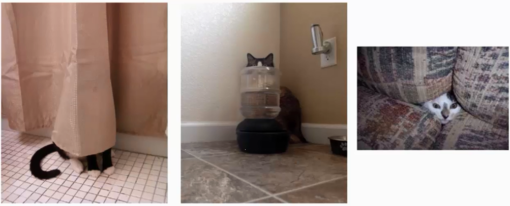
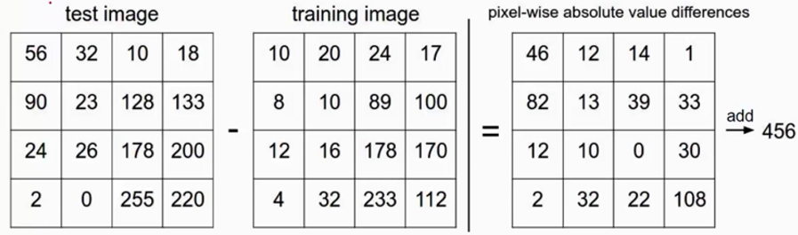
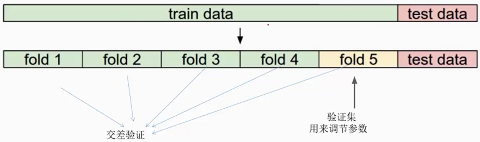

##神经网络

什么是人工智能？感知+理解==>具有决策的能力。

> 学习的能力，才是职能的本质

大数据时代造就了人工智能的发展，使得机器有了学习的能力，进而推动的人工智能的发展。深度学习在90年代就已经出现了，那个时代计算能力太慢，为被人所熟知。2012年一位牛人使用卷积神经网络在[IMAGENET](www.image-net.org)上比赛分类图片得到效果要比机器学习高十几个百分点，至此以后卷积神经网络一炮打响。首先需要了解神经网络，然后再转向深度学习。

为什么人工智能的技术这么厉害？

将以前的机器学习算法进行改进，深度学习和机器学习有什么关系？机器学习领域是非常庞大的，在庞大的机器学习算法中有一类算法叫做神经网络，学者将神经网络进行了扩展和改进，使得神经网络变得扩大一些，加入更多的细节，利用这个扩大的神经网络能够让我们需要预测、分类的效果更好。下图是百度深度学习研究院的ppt，当数据规模小的时候，深度学习和传统人工智能算法差别不大，当数据规模增加时深度学习算法的效果就比传统人工智能算法要好。


###图像分类：计算机视觉核心任务

深度学习和计算机视觉关系密切，一张图像在计算机中被表示为三维组的形式，每个像素的值从0到255（值越大，表示该像素点越亮）。例如：300\*100\*3，其中300、100可以分别看成是高、宽，图像是有颜色通道的，彩色图有三种颜色通道RGB，因这个RGB通道就是第三个维度，即每一点像素是由三个通道的颜色叠加而形成的。

相同物体在不同角度、不同亮度、物体形态的改变、部分遮蔽、汇入等的情况下如何识别并检测出来




深度学习的步骤，与机器学习是一样的

1. 收集大量数据并给定标签；
2. 训练一个分类器；
3. 测试，评估

###K-近邻分类算法

如下图所示，根据K值不同得到不同的结果

- 如果K=3，绿色远点的最近的3个邻居是2个红色的小三角和1个蓝色的小正方形，少数服从多数，基于统计的方法，判定绿色的这个待分类点属于红色的三角形一类。
- 如果k=5，绿色圆点的最近的5个邻居是2个红色小三角和3个蓝色正方形，还是少数服从多数，基于统计的方法，哦安定绿色的这个待分类点属于蓝色的正方形一类。


**K-近邻算法描述**

1. 计算已知类别数据集中的点与当前未知类别属性数据集中的点的距离；
2. 按照距离依次排序；
3. 选取与当前点距离最小的K个点；
4. 确定前K个点所在类别的出现频率；
5. 返回前K个点出现频率最高的类别作为当前点预测分类；

KNN算法本身简单有效，它是一种lazy-learning算法，分类器不需要使用训练集进行训练，训练时间复杂度为0。KNN分类的计算复杂度和训练集中的文档数目成正比，即如果训练集中文档总数为N，那么KNN的分类时间复杂度为O(N)。

K值得选择，距离度量和分类决策规则是该算法的三个基本要素。

问题：该算法在分类时有个主要的不足是，当样本不平衡时，如一个类的样本容量很大，而其他类样本容量很小时，有可能导致当输入一个新样本上时，该样本的K个邻居中大容量样本占多数？解决办法是不同的样本给予不同权重。

数据集：CIFAR-10

**对于图像数据如何计算距离**
$$
L1 \ Distance：d_1(I_1, I_2) = \sum_p|I_1^p - I_2^p|
$$
这种方式计算距离时，我们也把背景考虑进来的，因此在使用K-近邻时，由于背景噪声的影响会导致结果不准确，因此使用K-近邻计算图片相似度的结果不会很好，是不能使用的，因此常用的方法是神经网络。



```python
import numpy as np
class NearestNeighor:
    def __init__(self):
        pass
    def trai(self, X, y):
        """
        X is N*D where each row is an example. Y is 1-dimesion of size N
        """
        self.Xtr = X
        self.Ytr = y
    def predict(self, X):
        """
        X is N*D where each row is an example we wish to predict label for
        """
        num_test = X.shape[0]
        # make sure that the output type matches the input type
        Ypred = np.zeros(num_test, dtype=self.dtype)
        
        for i in range(num_test):
            # find the nearest trainging image to the i'th test image
            # usig the L1 distance(sum of absolute value different)
            distaces = np.sum(np.abs(self.Xtr - X[i, :]), axis=1)
            min_index = np.argmin(distaces)
            Ypred[i] = self.Ytr[min_index]
        return Ypred
```

**超参数**

这里的距离参数在训练模型时是可以改变的，通过选择不同的距离公式得到不同的距离，称这些可变参数为超参数。如下使用两种方式计算距离
$$
L1（Manhattan）distance：d_1(I_1, I_2) = \sum_p|I_1^p - I_2^p| \\
L2（Euclidean）distance：d_2(I_1, I_2) = \sqrt{\sum_p(I_1^p - I_2^p)^2}
$$
问题：

1. 对于距离如何设定？
2. 对于K近邻的K该如何选择？
3. 如果有的话，其他的超参数该怎么设定呢？

错误的想法是将划分的训练集和测试集多次使用找到最佳参数，事实上测试集非常宝贵，只能在最终验证参数时使用。正确的方式是通过*交叉验证* 找到最优参数。如下图所示，首先将原始数据拆分为训练集和测试集，然后对训练集进行拆分将其中的一份作为验证集。例如：将训练集拆分成5份，其中fold5作为验证集用来调节模型的参数，其他4份作为训练集，则通过多次训练，第一次：<fold1,fold2,fold3,fold4>作为训练集，<fold5>作为验证集，第二次：<fold1,fold3,fold5,fold4>作为训练集，<fold2>作为验证集，第三次：<fold2,fold5,fold1,fold4>作为训练集，<fold3>作为验证集，...如此循环进行多次，用来找到最佳参数，交叉采用不同数据训练的原因是数据有可能不纯，存在有一块或几块数据可能有问题可能存在误差值、异常值导致训练结果偏高或偏低，而采用不同方式交叉训练，将不同训练得到的参数求平均可以消除偏高或偏低的情况，这样得到的模型就比较科学、平均化不至于产生极端效果。



