#第一章 回归算法

回归分析是利用已知样本产生拟合方程，从而对未知数据(连续)进行预测。回归分析分为一元回归、多元回归和广义回归。有关一元回归、多元回归详细内容参考[ML中概率统计的第二课]。**多重共线性**和**变量选择**是回归问题中的两大疑难问题。

根据如何解决多重共线性和变量选择问题，出现了修正回归算法：岭回归、Lasso回归和弹性网。这三个回归需要首先对样本进行中心化、标准化。

| 回归方法  | 目标函数 $\lambda \gt 0 \quad \alpha \in [0, 1]$             | 说明                                         |
| --------- | ------------------------------------------------------------ | -------------------------------------------- |
| 线性回归  | $J(\theta) = \frac{1}{2} \sum_{i=1}^{m}(h_{\theta}(x^{(i)}) - y^{(i)})^2$ | 高阶拟合参数$\theta$时会不稳定同时参数值过大 |
| 岭回归    | $J(\theta) = \frac{1}{2} \sum_{i=1}^{m}(h_{\theta}(x^{(i)}) - y^{(i)})^2 + \lambda \sum_{j=1}^{n} \theta_j^2$ | L2-norm正则项(防止$\theta$过大，导致过拟合)  |
| LASSO回归 | $J(\theta) = \frac{1}{2} \sum_{i=1}^{m}(h_{\theta}(x^{(i)}) - y^{(i)})^2 + \lambda \sum_{j=1}^{n} |\theta_j|$ | L1-norm正则项(防止$\theta$过大，导致过拟合)  |
| 弹性网    | $J(\theta) = \frac{1}{2} \sum_{i=1}^{m}(h_{\theta}(x^{(i)}) - y^{(i)})^2 + \lambda(\alpha\sum_{j=1}^{n} |\theta_j| + (1-\alpha) \sum_{j=1}^{n} \theta_j^2)$ |                                              |


##1. 线性回归[^1]


$$
h_{\theta}(x) = \theta_0 +\theta_1 x_1 + ... + \theta_n x_n = \sum_{i=0}^{n}\theta_i x_i = \theta^T x，其中x_0=1 \\
$$
预测值与真实值得关系：$y^{{i}} = \theta^T x^{(i)} + \epsilon^{(i)}$，由中心极限定理可知，在样本足够多的情况下，假设误差是独立同分布，则误差服从均值为0(通过调整截距$\theta_0$使均值恒为零)，方差为$\sigma^2$的高斯分布，即有：
$$
\epsilon^{(i)} = y^{(i)} - \theta^T x^{(i)} \\
p(\epsilon^{(i)}) = \frac{1}{\sqrt{2 \pi} \sigma} exp(- \frac{(\epsilon^{(i)})^2}{2 \sigma^2}) \\

p(y^{(i)} | x^{(i)}； \theta) = \frac{1}{\sqrt{2 \pi} \sigma} exp(- \frac{(y^{(i)} - \theta^T x^{(i)} )^2}{2 \sigma^2})
$$
$p(y^{(i)} | x^{(i)}； \theta) $中$\theta$ 为要求出的参数值，表示需要找到$\theta$ 值与$x^{(i)}$ 的组合后得到的预测值接近$y^{(i)}$ 的概率，概率值越大$\theta$ 参数越好。如何求出$\theta$ ?利用最大似然函数求出，对于所有样本来说，当概率值最大值时的$\theta$ 求法为
$$
L(\theta)  = \prod_{i=1}^m p(y^{(i)} | x^{(i)}； \theta) =  \prod_{i=1}^m  \frac{1}{\sqrt{2 \pi} \sigma} exp(- \frac{(y^{(i)} - \theta^T x^{(i)} )^2}{2 \sigma^2}) \\
l(\theta) = logL(\theta) = \sum_{i=1}^{m} log[\frac{1}{\sqrt{2 \pi} \sigma} exp(- \frac{(y^{(i)} - \theta^T x^{(i)} )^2}{2 \sigma^2}) ] \\
= m \cdot log\frac{1}{\sqrt{2 \pi} \sigma} - \frac{1}{\sigma^2} \cdot \frac{1}{2}\sum_{i=1}^{m}(y^{(i)} - \theta^T x^{(i)})^2 \\
$$

若要使$l(\theta)$最大，则上式后半部分的越小越好，则可以得到目标函数$J(\theta) = \frac{1}{2} \sum_{i=1}^{m}(h_{\theta}(x^{(i)}) - y^{(i)})^2$。

**方法1：利用矩阵逆求解$\theta$**

根据目标函数$J(\theta)$求$\theta$，假设将M个N维的样本组成矩阵x，即x的每一行对应一个样本，每一列对样本的维度(**通常还有一维常数项，全为1**)。则有：
$$
J(\theta) = \frac{1}{2} \sum_{i=1}^{m}(h_{\theta}(x^{(i)}) - y^{(i)})^2 = \frac{1}{2}(x\theta  - y)^T( x \theta - y)  \qquad \qquad  \qquad  \qquad \\
\triangledown J(\theta) = \triangledown [\frac{1}{2}(\theta^T x^T - y^T)( x \theta - y)] 
= \triangledown [\theta^T x^T x \theta - \theta^T x^T y - y^T x \theta + y^Ty] \\
=\frac{1}{2}[2x^Tx\theta - x^Ty - (y^Tx)^T] （矩阵求导） \qquad \qquad \qquad \ \ \ \  \ \  \\
= x^Tx\theta - x^Ty = 0 \qquad \qquad \qquad \qquad \qquad \quad  \qquad \qquad  \qquad  \ \\
\Downarrow 若矩阵(x^Tx)^{-1}可逆 \\
\theta = (x^Tx)^{-1} x^T y \qquad
$$

**Moore-Penrose广义逆矩阵**

若A为非奇异矩阵，则线性方程组$Ax=b$的解为$x=(A^TA)^{-1}A^Tb$，从方程解的直观意义上可以定义$A^{+}=(A^TA)^{-1}A^T$，则若A为可逆方阵则$A^+ = A^{-1}$；若A为矩阵(非方阵)时，称$A^+$为A的广义逆。A的广义逆同时SVD奇异值分解可以求得，对于矩阵$A_{m \times n}$，则它的SVD分解为：$A = U \cdot \Sigma \cdot V^T$，则A的广义逆为：$A^+=V \cdot \Sigma \cdot U^T$

**方法2：利用梯度下降求解$\theta$**
$$
\frac{\partial J(\theta)}{\partial \theta} =  (x\theta - y) \cdot x =  error  \cdot x\\
\theta 更新公式：\theta = \theta - \alpha \cdot  error \cdot x
$$

##2. 逻辑回归和梯度下降[^2]

逻辑回归实际上做了一个分类的事，通常逻辑回归适用于做二元分类。


S型函数
$$
g(z) = \frac{1}{1 + e^{-z}} \\
g'(x) = \frac{e^{-x}}{(1 + e^{-x})^2} = \frac{1}{1 + e^{-x}}  \cdot \frac{e^{-x}}{1 + e^{-x}} \\ =  \frac{1}{1 + e^{-x}}  \cdot (1-  \frac{1}{1 + e^{-x}}) = g(x)(1 - g(x))
$$
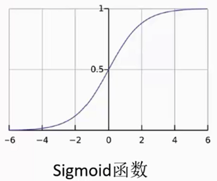

sigmoid函数能够将任何一个实数映射要[0,1]区间上，看做成一个概率值。

逻辑斯特回归实际上是将预测值$\theta^Tx$ 作为输入通过Sigmoid函数转换为概率值，实际上是将预测值用做分类任务。

$$
h_{\theta}(x) = g(\theta^T x) = \frac{1}{1 + e^{-\theta^Tx}}
$$

逻辑回归用于进行二分类
$$
P(y=1|x;\theta) = h_{\theta}(x) \\
P(y=0|x;\theta) = 1 - h_{\theta}(x) \\
p(y|x;\theta) = (h_{\theta}(x))^y(1- h_{\theta}(x))^{(1-y)} 求x,\theta的组合使得y值最接近 \\
L(\theta) = p(y|x:\theta) = \prod_{i=1}^{m}p(y^{(i)}|x^{(i)};\theta) =\prod_{i=1}^{m} (h_{\theta}(x^{(i)}))^{y^{(i)}}(1- h_{\theta}(x^{(i)}))^{(1-y^{(i)})} \\
l(\theta) = logL(\theta) = \sum_{i=1}^{m} y^{(i)}logh(x^{(i)}) + (1 - y^{(i)}) log(1- h(x^{(i)}))
$$
但是此时通过求导等于零时得到不到对应$\theta$ 的解的，因此可以通过==梯度下降==方法 

##3. 岭回归

**广义线性模型需要解决的问题**

多元线性模型的矩阵模型可以表示为$Y_{n,1} = X_{n,p} \beta_{p,1} + \epsilon_{n,1}$ ，则求解参数$\beta$的估计值$\hat{\beta}$的最小二乘函数为
$$
Q(\beta) = (y - X \beta)^T(y - X \beta)
$$
则求解此函数达到最小值时的$\beta$为$\hat{\beta}=(X^TX)^{-1} X^T y$，其中$(X^TX)^{-1} X^T$为矩阵X的广义逆，因此可以看出若多元线性方程中出现线性相关方程，则$(X^TX)^{-1}$为$p \times p$的矩阵且$p \le n$时就不是满秩的，$X^TX$就不是可逆的，则就没有办法求逆矩阵这就是**多重共线性问题**。若$(X^TX)^{-1}$为$p \times p$的矩阵且$p \gt n$时，即变量比样本多，矩阵的秩最多为n，而$n \lt p$的则此时$X^TX$也是不可逆的。因此得出**广义线性模型的奇异性：**

1. 当出现多重共线性时，出行奇异性；
2. 当变量比样本多时，出现奇异性；

**岭回归（Ridge Regression, RR）**

1962年有Heer首先提出，1970年后他与肯纳德合作进一步发展了该方法。**前提条件**：首先对数据做标准化，为了记号方便，标准化后的学习集仍然用x表示。
$$
\hat{\beta}(k) = (x^Tx +k I)^{-1}x^Ty，k为岭参数，\hat{\beta}为岭回归估计
$$
上述解对应的最小二乘函数也就发生改变，添加这一项后，对应的等价模型需要添加一个**惩罚函数项**或**扰动项**，为
$$
\hat{\beta}^{ridge} =  \underset{\beta}{arg \ min} \{ \sum_{i=1}^{N}(y_i - \beta_0 - \sum_{j=1}^{p}x_{ij}\beta_j)^2 + k\sum_{j=1}^{p}\beta_j^2 \} \\
\Downarrow 等价于\\
\hat{\beta}^{ridge} =  \underset{\beta}{arg \ min} \{ \sum_{i=1}^{N}(y_i - \beta_0 - \sum_{j=1}^{p}x_{ij}\beta_j)^2 \} \\
s.t. \quad \sum_{j=1}^{p}\beta_j^2 \le t
$$
对上述求最小值就可以得到$\hat{\beta}$的岭回归估计。如下图所示，为岭回归的几何意义：其中RSS为$\beta_1$和$\beta_2$的残差平方和，在图中表现为抛物面，满足$\beta_1^2 + \beta_2^2 \le t$，为圆构成的平面，这个平面一直向上扩展直到与抛物面有一个交点，这个交点就是我们要求出的$\beta_1、\beta_2$，这个点满足约束条件同时使得残差方程取得最小值。

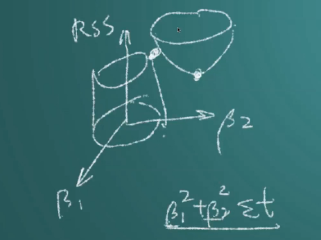

**估计族**

1. 当岭参数为0时，得到最小二乘解；
2. 当岭参数趋向更大时，岭回归系数估计趋向于0；因为要求解最小二乘函数的最小值，惩罚函数的值是恒大于0的，因此当岭参数值越大时，岭回归系数估就会变小并趋近于0。

因为岭参数k不是唯一确定的，所以我们得到的岭回归估计$\hat{\beta(k)}$实际是回归参数$\beta$的一个估计族。例如 

**岭回归估计的性质**

**性质1：** $\hat{\beta(k)}$是回归参数$\beta$的有偏估计
$$
E[\hat{\beta(k)}] = E[(X^TX + kI)^{-1}X^Ty] = (X^TX + kI)^{-1}X^T E[y] =  (X^TX + kI)^{-1}X^T X
$$
显然只有当k=0时，$E[\hat{\beta(k)}]=\beta$；当$k \ne 0$时，$\hat{\beta(k)}$是$\beta$的有偏估计。因此岭回归是一种先天不足的一种计算手段，它只是为了解决多重共线性问题而采取的权宜之计。**岭回归一般会使得残差平方和RSS变大，但是会使得系数检验变好。**

**性质2：**在岭参数k与y无关常数时，$\hat{\beta(k)}=(X^TX + kI)^{-1}X^Ty$是最小二乘估计$\hat{\beta}$的一个线性变换，也是y的线性函数。
$$
\hat{\beta(k)} = (X^TX + kI)^{-1}X^Ty = (X^TX + kI)^{-1}X^TX(X^TX)^{-1}X^Ty = (X^TX + kI)^{-1}X^TX\hat{\beta}
$$
因此，岭估计$\hat{\beta(k)}$是最小二乘估计$\hat{\beta}$的一个线性变换，根据定义$\hat{\beta(k)}=(X^TX + kI)^{-1}X^Ty$知$\hat{\beta(k)}$也是y的线性函数。需要注意的是：实际应用中，由于岭参数k总是要通过数据来确定，因而k也依赖与y，因此本质上说$\hat{\beta(k)}$并非$\hat{\beta}$的线性变换，也不是y的线性函数。

**性质3：**对任意$k \gt 0$，$||\hat{\beta}|| \ne 0$，总有$||\hat{\beta(k)}|| \le ||\hat{\beta}||$，说明$\hat{\beta(k)}$向量可以看成有$\hat{\beta}$进行某种向原点的压缩。

**性质4：**以MSE表示估计向量的均方误差，则存在$k \gt 0$，使得$MSE(\hat{\beta(k)}) \lt MSE(\hat{\beta})$

**岭迹图**

岭迹图的主要用途就是解决多重共线性问题。如下图所示，当k很小时，系数趋于无穷；当k增加时系数趋于稳定，则可以判定此时回归方程存在多重共线性问题。通常k值取出现转折点附近的值。

- 当不存在奇异性时，岭迹应该是稳定的逐渐趋向于0
- 通过岭迹图观察岭估计的情况，可以判断出应该剔除哪些变量；例如当系数在岭迹图中一直都是趋近于0的，就可以忽略对应变量。但是通常用岭迹图用于剔除变量这个用途不是很广泛。

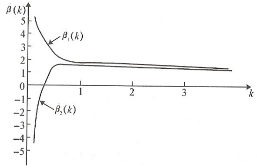

**岭参数$k或\lambda$的一般选择原则**

1. k应该选在各回归系数的岭估计值基本稳定；
2. 用最小二乘估计时符号不合理的回归系数，其岭估计的符号变得合理；
3. 回归系数没有不合乎实际意义的绝对值；
4. 残差平方和政增大不太多，k值越大残差平方和越大，因此k值应该在岭估计值稳定后但不要太大的位置；

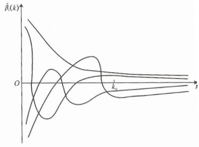

**k值求法：方差扩大因子法**

方差扩大因子$c_{ij}$度量了多重共线性的严重程度，计算岭估计$\hat{\beta(k)}$的协方差矩阵得到
$$
D(\hat{\beta(k)}) = cov(\hat{\beta(k)}, \hat{\beta(k)}) = cov((X^TX + kI)^{-1}X^Ty，(X^TX + kI)^{-1}X^Ty) \\
= (X^TX + kI)^{-1}X^T \ \  cov(y, y) \  \ (X^TX + kI)^{-1}X^T  \qquad  \quad  \ \\
= \sigma^2 (X^TX + kI)^{-1}X^T X(X^TX+kI)^{-1} \qquad   \qquad  \qquad  \quad  \ \\
= \sigma^2(c_{jj}{k}) \qquad  \qquad  \qquad  \qquad  \qquad  \qquad  \qquad  \qquad  \qquad  \qquad 
$$
其中矩阵$C_{ij}(k)$的对角元$c_{ij}(k)$就是岭估计的方差扩大因子，当$c_{ij}(k)$随着k的增大而减少。 **选择k使得所有方差扩大因子$c_{ij}(k) \le 10$**

**范例**

空气污染问题。 Mcdonald和Schwing曾研究死亡率不空气污染、气候以及社会经济状况等因素癿关系。考虑了15个解释变量，收集了60组样本数据。

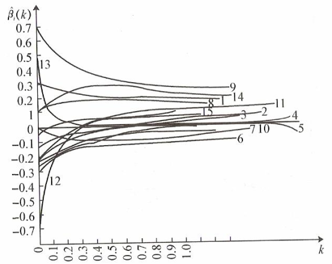

**岭迹分析：**把15个回归系数癿岭迹画到图中，我们可看到，当k=0.20时岭迹大体上达到稳定。按照岭迹法，应取k=0.2。 若用方差扩大因子法，因k=0.18时，方差扩大因子接近于1，当k在0.02～0.08时，方差扩大因子小于10，故应建议在此范围选取k。 由此也看到不同的方法选取k值是不同的。 因此，可以看出岭回归的很大缺点是k值没有统一的衡量标准。

**选取变量（主观性太强，通常不实用）：**在用岭回归进行变量选择时，因为从岭迹看到自变量x4,x7,x10,x11和x15有较稳定且绝对值比较小的岭回归系数，根据变量选择癿第一条原则，这些自变量可以去掉。 又因为自变量x12和x13癿岭回归系数很不稳定，且随着k的增加很快趋于零，根据上面的第二条原则这些自变量也应该去掉。再根据第三条原则去掉变量x3和x5。 这个问题最后剩癿变量是x1，x2，x6，x8，x9，x14。  

##4. LASSO回归

**岭回归的问题**：1. 岭参数计算太多，差异太大，不知道取哪个值，o((⊙﹏⊙))o；2. 根据岭迹图进行变量筛选，主观性强，随意性太大；3. 岭回归返回的模型（如果没有经过变量筛选）包含所有的特征，本身不筛选特征，因此得到的模型复杂。

Tibshirani(1996)提出了Lasso(The Least Absolute Shrinkage and Selectionator operator)算法，通过构造一个一阶惩罚函数获得一个精炼的模型（岭回归使用的是二阶惩罚函数），通过最终确定一些指标（变量）的系数为零（岭回归估计系数等于0的机会微乎其微，造成筛选变量困难），进行**变量筛选**，所以得到模型解释力很强。LASSO擅长处理具有**多重共线性**的数据以及做**变量筛选**，**LASSO和岭回归一样是有偏估计**。
$$
\hat{\beta}^{ridge} =  \underset{\beta}{arg \ min} \{ \sum_{i=1}^{N}(y_i - \beta_0 - \sum_{j=1}^{p}x_{ij}\beta_j)^2 + k\sum_{j=1}^{p}|\beta_j| \} \\
\Downarrow 等价于\\
\hat{\beta}^{ridge} =  \underset{\beta}{arg \ min} \{ \sum_{i=1}^{N}(y_i - \beta_0 - \sum_{j=1}^{p}x_{ij}\beta_j)^2 \} \\
s.t. \quad \sum_{j=1}^{p}|\beta_j| \le t
$$
**为什么LASSO能直接筛选特征(变量)？**

如下右图所示，当红色椭圆线扩散至于圆形相切时，切点就是岭估计系数所在的位置，因此要在圆周找到一点使得回归系数为零很困难（除非找到坐标轴上的点），这就是为什么岭回归无法用来筛选变量的原因。而使用LASSO回归的惩罚函数是一阶的，因此可以得到其约束区域为矩形，如下左图所示，当红色椭圆线扩散时，其接触到矩形的顶点的概率很大（此时不可导，无法用积分算出，使用**最小角回归**），这样一些变量的系数就为零，**保证稀疏解，忽略一些不重要的特征**，从而能够实现变量的筛选。

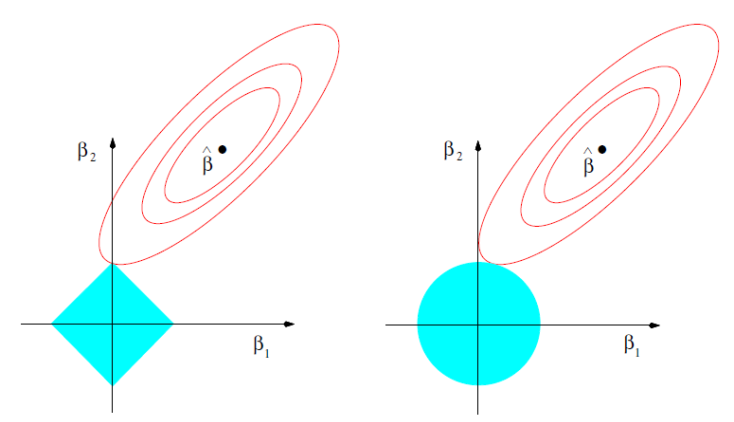

**一般化模型Lq-norm** 

当$q < 1$时，函数就是凹的没有办法采用凸优化求解，因此低于1时通常是不考虑的。
$$
\hat{\beta}^{ridge} =  \underset{\beta}{arg \ min} \{ \sum_{i=1}^{N}(y_i - \beta_0 - \sum_{j=1}^{p}x_{ij}\beta_j)^2 + k\sum_{j=1}^{p}|\beta_j|^{q} \}
$$
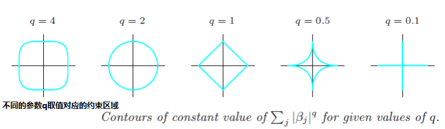

**弹性网**

Zou and Hastie (2005)提出elasticnet，目前弹性网是目前最好的一种收缩方法，在处理多重共线性、筛选变量时非常高效，并且损失精度不会太多。elasticnet将惩罚函数改写为：
$$
\lambda \sum_{j=1}^{p}(\alpha \beta_j^2 + (1- \alpha)|\beta_j|)
$$
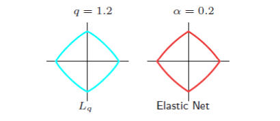

**最小角回归（Least Angel Regression,LAR）**

Efron于2004年提出了一种变量选择的方法，类似于向前逐步回归(Forward Stepwise)的形式，是LASSO回归的一种高效解法。LAR算法是用于解决传统线性回归最小二乘法问题的的方法，而Efron发现LAR描述回归问题解得过程与LASSO的路径是非常相似的，因此提出LAR算法求解LASSO。

向前逐步回归(Forward Stepwise)不同点在于，Forward Stepwise每次都是根据选择的变量子集，完全拟合出线性模型，计算出RSS，再设计统计量（如AIC）对较高的模型复杂度作出惩罚，而LAR是每次先找出和因变量相关度最高的那个变量, 再沿着LSE的方向一点点调整这个predictor癿系数，在这个过程中，这个变量和残差癿相关系数会逐渐减小，等到这个相关性没那么显著癿时候，就要选进新的相关性最高的变量，然后重新沿着LSE的方向进行变动。而到最后，所有变量都被选中，就和LSE相同了。

**相关系数的几何意义** 

对于向量$\vec{x}$和$\vec{y}$，将其标准化处理后得到$||x||=||y||=1$，且将对应样本归一化使得$D(x)=D(y)=1,E(x)=E(y)=0$则有相关系数定义可以知道
$$
\rho = \frac{cov(x,y)}{\sqrt{D(x) D(y))}} = cov(x,y)=E[x - E(x)]E[y-E(y)] = E(x)E(y) = \vec{x} \cdot \vec{y}
$$
而向量的内积为$\vec{x} \cdot \vec{y} = ||x|| \cdot ||y|| \cdot cos \theta = cos\theta= \rho$，因此**当样本数据中心化，向量标准化处理后，相关系数就是向量夹角的余弦**。当两个向量相似或重合时，夹角为0，此时相关系数为1，两个向量高度相关。

**LAR算法流程[^3]**

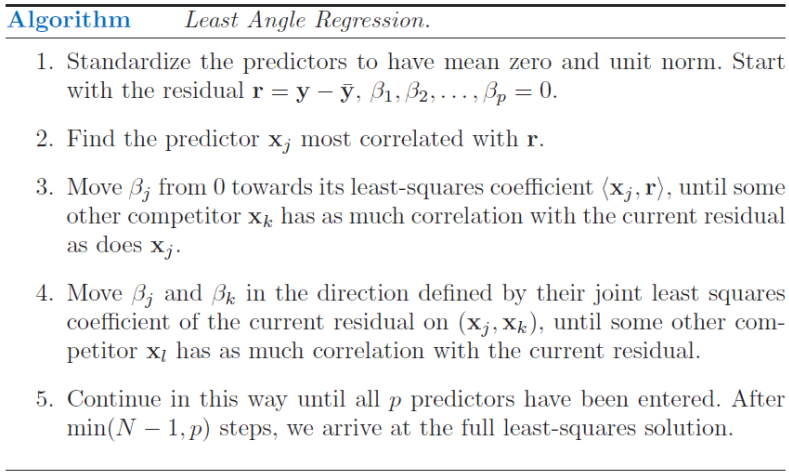

**算法说明：** 如下图所示，样本向量有$x_1、x_2、y$，其中向量$x_1、x_2$向量张成为一个平面，最小二乘解就是从向量y到平面的垂直直线与平面的交点。

$x_i$与残差向量的相关系数LAR第一步从变量中选择一个变量，使得它与残差变量的相关系数是最大的，开始时还没有残差向量，所以假设残差向量为y，在$x_1、x_2、x_3、...$中找一个向量与y向量相关系数最大，即向量夹角应该是最小的。假设$x_1$与y的夹角是最小的，此时由y和$x_1$构建的回归方程的最小二乘解为向量y到向量$x_1$的垂线，垂直点为d，则d就是此时回归方程的解。从原点开始沿着$x_1$方向游走直到垂直点d，此时残差向量（游走的点与y构成的向量）与$x_1$之间的夹角逐步增大到90度，即相关系数逐渐改变到最终为0。

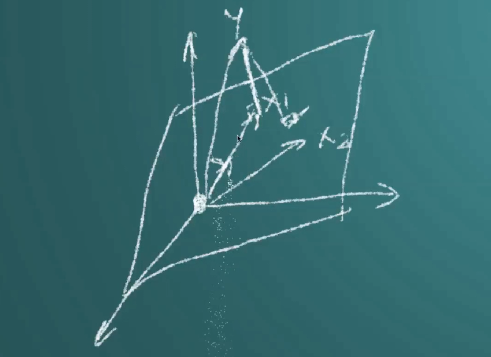

在游走过程中，逐步添加其他变量，添加的这个变量$x_i$满足：$x_1$与残差向量的相关系数、$x_i$与残差向量的相关系数是一样的，设$x_2$满足条件，这时把$x_2$向量加进去，添加进去新变量后，游走的前进方向就需要更新。设此时游走点为D，则沿D点做与向量$x_2$平行的线，取$x_1$与平行线的角平分线，接下来就顺着这个角平分线前进。如此反复，直到把所有的变量加进去同时前进到一个点，这个点就是残差向量与其他所有样本向量的相关系数都为0，也就是说残差向量垂直于所有的加入的向量$x_1、x_2、...$，即残差向量垂直于平面，此时的点就是最优解，最小二乘解。

为什么沿着角平分线？当确定回归方程是由两个变量$x_1、x_2$确定时，此时的最小二乘解就是y与$x_1、x_2$构成的平面的垂直点，这个点肯定是位于这个角平分线上，并且残差向量与该角平分线是垂直的。

为什么叫最小角回归？当游走时候，走的角平分线，走的方向一定是与其他变量的夹角之和最小。走角平分线的作用是在游走过程中残差向量与加入的向量之间的夹角都是一样的，即相关系数保持一样。

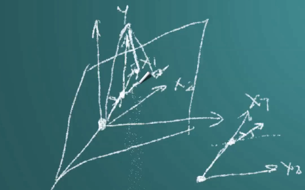

下图可以解释LAR算法逐个添加变量的过程，其中$L_1 \  Arc$就是绝对值弧长即游走的距离，开始有6个变量，首先都与y做相关系数的计算，将最大相关系数对应的变量加入进去，这里是v2，然后沿着圆点、游走过程中向量v6的相关系数与v2相关系数相同，此时将v6加入。沿着最小角方向（角平分线方向）游走，此时v2和v6的相关系数共同变化，直到v4变量的相关系数相同，加入v4变量，如此反复，直到加入最后的v1变量，达到最小二乘解。**最小二乘的几何意义**：残差向量与所有变量的相关系数都为0。

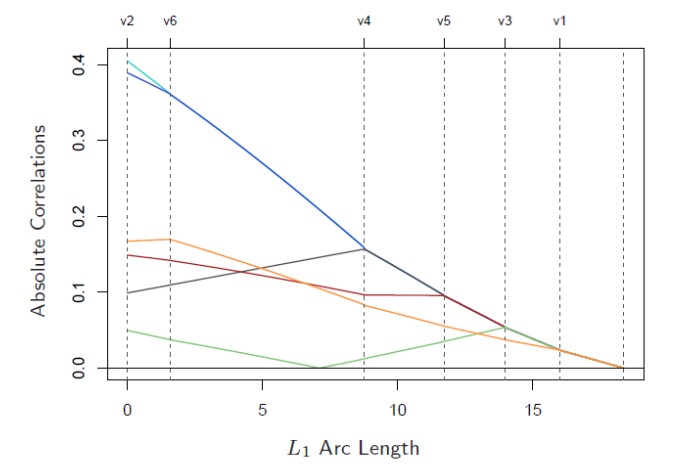

**为什么LAR的过程与LASSO过程高度相似区别在哪？**

LAR描述回归问题解得过程与LASSO的路径是非常的如下图所示，左图是LAR算法描述其逐个把变量加进去的过程，而右图是LASSO的变量淘汰过程，从右往左走看变量逐步被淘汰。

**相似性背景**

LASSO的求解方程为$R(\beta) = \frac{1}{2}||yt - X\beta||_2^2 + \lambda ||\beta||_1$，对方程求导，得到驻点满足方程$X_j^T(y-X\beta)=\lambda \ sign(\beta_j) \quad $其中$\forall j \in \beta$ sign为符号函数：大于零时取1，小于零时取1，等于零时取0。解这个驻点满足的方程就能求出LASSO的解。

LAR求解是沿着角平分线方法进行，任意变量$X_j$与残差向量的内积为相关系数，$X_j^T(y-X\beta)=\gamma \cdot s_j$，其中$s_j \in \{1,-1\}$，对比LASSO驻点方程与LAR相关系数方程，可以看出两者非常相似，因此两个是大致相同的。

不同点在于当两者的符号不同的表现出的结果就不同，符号相同时表现出的结果是相同的。因此**需要对LAR算法进行一下修正后才能将其应用于LASSO的求解**。==解释为什么出线符号差异？==

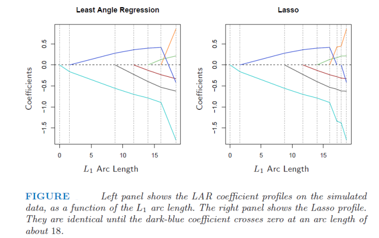

为此提出了修正LAR算法[^3]

若加入的变量其系数为零，在游走过程中该变量的相关系数又再一次变为零，则将该变量给丢弃，重新计算角度执行。

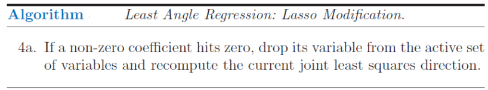

##5. 多分类：Softmax回归


## 案例：信用卡欺诈

###1. 数据导入数据分布

```python
import pandas as pd 
import matplotlib.pyplot as plt 
import numpy as np 

# 数据是已经提取好特征的数据
data = pd.read_csv(r'G:\data\creditcard.csv')
# print(data.head())

# Class分类为：0，1，认为0为正例，1为负例
# 样本特点：绝大部分为正例，只有少数部分为负样本
count_classes = pd.value_counts(data['Class'], sort=True).sort_index()
#0    284315
#1       492
#Name: Class, dtype: int64
count_classes.plot(kind='bar')
plt.title('Fraud Class Hist')
plt.xlabel('Class')
plt.ylabel('Frequency')
# plt.show()
```

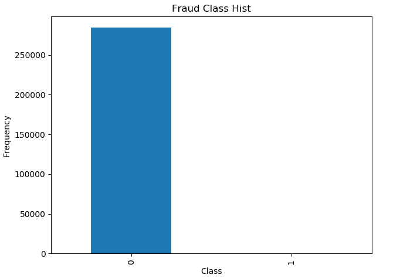

###2. 数据分布不均的处理方法之下采样

```python
"""
对于数据分布极度不均的情况应该如何处理？这里有两种常用的解决方案：
    1. 过采样，采用样本生成策略，将其中样本量少的类别调整为与其他类别数据一样多。
        例如，这里生成1类别的样本，增加到284315。（同样多）
    2. 下采样，采用样本抽取策略，从其中样本量多的中抽取一部分，与其他类别数据一样少。
        例如，这里要0，1这两类样本的数目都会492，即从0类样本中取出492个。（同样少）
这两种类型，哪一种策略好一些？

机器学习对样本特征值的要求？
    要求特征值得变化区间相同，对特征值做归一化或标准化，让不同特征的重要程度是相当的。因此对于取值范围过大的特征值，学习算法会认为这个特征值大的重要程度也大。更
"""
from sklearn.preprocessing import StandardScaler
# 标准化特征值
data['normAmount'] = StandardScaler().fit_transform(data['Amount'].values.reshape(-1, 1))

"""
下采样方法
"""
X = data.loc[:, data.columns != 'Class']
y = data.loc[:, data.columns == 'Class']

# 计算异常样本数量
number_records_fraud = len(data[data.Class == 1])
# 获取异常样本对应的索引
fraud_indices = np.array(data[data.Class == 1].index)
# 获取正常样本对应的索引
normal_indices = data[data.Class == 0].index
# 随机从正常样本中选取与异常样本数量相同的样本
random_normal_indices = np.random.choice(normal_indices, number_records_fraud, replace=False)
random_normal_indices = np.array(random_normal_indices)
# 合并下采样得到的相同数量的负例、正例
under_sample_indices = np.concatenate([fraud_indices, random_normal_indices])
# 下采样样本数据
under_sample_data = data.iloc[under_sample_indices, :]

X_undersample = under_sample_data.iloc[:, under_sample_data.columns != 'Class']
y_undersample = under_sample_data.iloc[:, under_sample_data.columns == 'Class']
print("Total number of resampled data: {0}, of which normal sample number: \
         {1}, fraud sample number: {2}".format(len(under_sample_data), len(random_normal_indices), len(fraud_indices)))
```


###3. 模型建立与交叉验证

```python
"""
交叉验证
 实际上是一个求稳的操作，需要模型表现稳定，或者寻找合适参数时使用。
"""
from sklearn.model_selection import train_test_split
# 需要对原始数据集进行拆分，在模型训练完成后进行测试使用
X_train, X_test, y_trian, y_test = train_test_split(X, y, test_size=.33, random_state=1)
# 用于训练模型，模型训练完成后，需要使用原始数据进行测试
X_train_undersample, X_test_undersample, y_trian_undersample, y_tes_undersample = \
    train_test_split(
        X_undersample, 
         y_undersample, 
         test_size=.33, 
         random_state=1)
"""
建立模型
模型的评估标准
    1、精度，有时候不是很准确，特别是样本数据不均衡或预测结果错误会产生很大影响时，例如：检测并病人是否患病！
    2、召回率/查全率（recall），根据目标制定衡量标准，例如我们目标是检查得癌症的人，我们可以通过查看得癌症的10个病人中，
        模型检查不来了几个，若检查出来2个，则recall=2/10，从提高召回率来提升模型。
        TPR = TP / (TP + FN)
"""
from sklearn.linear_model import LogisticRegression
from sklearn.model_selection import KFold, cross_val_score
from sklearn.metrics import confusion_matrix, recall_score, classification_report

def print_kfold_scores(x_train, y_train):
    kf = KFold(n_splits=5, shuffle=False)
    # 正则化惩罚项参数，最速下降法中的theta参数浮动（变换）需要稳定，否则会出现过拟合。
    # 对于从theta波动较大的情况添加惩罚项。
    # 惩罚项：
    #   1. l2正则化： 表示损失函数后加上1/2*w^2，其中W为权重参数，惩罚项惩罚的是权重参数
    #   2. l1正则化： 表示损失函数后加上|w|
    # C就是该惩罚项的系数，表示惩罚的粒度。
    c_params = [0.001, 0.01, 0.1, 1, 10, 100, 1000]

    result_table = pd.DataFrame(
        index= range(len(c_params), 2), 
        columns=['C_parameter', 'Mean recall score'], 
        dtype=(float, float))
    result_table['C_parameter'] = c_params

    j = 0
    for c_param in c_params:
        print('---------------------------------------')
        print('C Parameter: ', c_param)
        print('---------------------------------------\n')

        recall_scores = []
        for niter, indices in enumerate(kf.split(y_train), start=1):
            # 建立模型，采用惩罚粒度，和惩罚项策略
            lr = LogisticRegression(C= c_param, penalty='l1')

            lr.fit(
                x_train.iloc[indices[0], :],
                y_train.iloc[indices[0], :].values.ravel()
            )
            # 取交叉验证中的验证集
            y_pred_undersample = lr.predict(x_train.iloc[indices[1], :].values)

            recall_acc = recall_score(y_train.iloc[indices[1],:].values, y_pred_undersample)
            recall_scores.append(recall_acc)
            print('Iteration: ',niter, 'Recall Score = ', recall_acc)
        
        result_table.ix[j, 'Mean recall score'] = np.mean(recall_scores)
        j += 1
        print('Mean recall score: ', np.mean(recall_scores))
    print(result_table)

    best_c = result_table.iloc[result_table['Mean recall score'].idxmax()]['C_parameter']
    print('****************************************************************************')
    print('Best model to choose from cross validation is with C parameter = ', best_c)
    print('***************************************************************************')

    return best_c

best_c = print_kfold_scores(X_train_undersample, y_trian_undersample)
```

###4. 混淆矩阵与下样本的负作用

**模型评估标准：召回率（recall）**

| Prediction  | Observation           |                       |
| ----------- | --------------------- | --------------------- |
|             | Admitted(1)           | Rejected(0)           |
| Admitted(1) | True Positive (TP)，  | False Positive (FP)， |
| Rejected(0) | False Negative (FN)， | True Negative (TN)，  |

假如某个班级有男生80人，女生20人，共计100人。目标是找出所有女生。现在某人挑出50人，其中20人是女生，另外还错误的把30个男生也当作女生挑选出来了。

|            | 相关，正类                           | 无关，负类                           |
| ---------- | ------------------------------------ | ------------------------------------ |
| 被检索到   | TP，正类判定为正类，确实是女生       | FP，负类判定为正类，男生被判定为女生 |
| 未被检索到 | FN，正类判定为负类，女生被判定为男生 | TN，负类判定为负类，男生被判定为男生 |

通过上述表格，可以清楚的得到：TP=20，FP=30，FN=0，TN=50

**True Positive Rate(Sensitivity)**

TPR指标衡量模型检测正例的效果，例如用模型检测病人是否患癌症，TP表示患病的人被正确的检测出来了，而FN则是患病的人被认为是正常的，这时候结果就严重的，在这个问题上需要考虑TPR，否则好多人会因为这个模型而受难。
$$
TPR =  \frac{True  \ Positives}{True \  Positives + False \  Nagetives}
$$
**True Negative Rate**

TNR指标衡量模型检测负例例的效果，例如用模型检测病人是否患癌症，TP是没患癌症的人被正确的检测出来了，TN是没患病的人被检测出来患有癌症。
$$
TNR = \frac{True \ Negative}{False \ Positive + True \ Negative}
$$
为什么说精度经常是不准确的、有欺骗性？例如有100个样本，其中有90个样本是属于1这个类别，而10个样本属于0这个类别，让分类器预测，假设模型全部预测为1类别，则精度也有90%，因此精度在样本非常不平衡的条件下是非常不准确的。很多情况下需要衡量TPR、TNR指标。

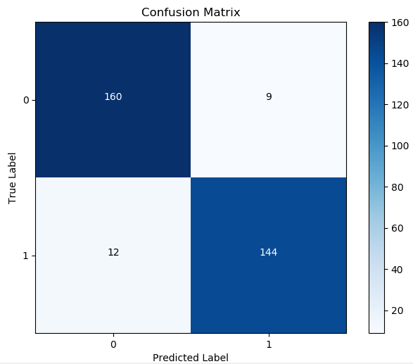

```python
"""
混淆矩阵：x轴表示预测试，y轴表示观测值，可以通过混淆举证算出精度，召回率。
y轴
| (0, 0)表示TN，(0, 1)表示FP
|
| (1, 0)表示FN，(1, 1)表示TP
-----------------------------> x轴
"""
import itertools

lr = LogisticRegression(C=best_c, penalty='l1')
lr.fit(X_train_undersample, y_trian_undersample.values.ravel())
y_pred_undersample = lr.predict(X_test_undersample.values)

# 画出混淆矩阵
cnf_matrix = confusion_matrix(y_tes_undersample, y_pred_undersample)
np.set_printoptions(precision=2)
print('Recall metrix in the testing dataset:', cnf_matrix[1,1] / (cnf_matrix[1, 0] + cnf_matrix[1,1]))

def plot_confusion_matrix(cm, classes, title='Confusion Matrix', cmap=plt.cm.Blues):
    plt.imshow(cm, interpolation='nearest', cmap=cmap)
    plt.title(title)
    plt.colorbar()
    tick_marks = np.arange(len(classes))
    plt.xticks(tick_marks, classes, rotation=0)
    plt.yticks(tick_marks, classes)

    thresh = cm.max() / 2.
    for i, j in itertools.product(range(cm.shape[0]), range(cm.shape[1])):
        plt.text(j, i, cm[i, j], horizontalalignment='center', color='white' if cm[i,j] > thresh else 'black')
    
    plt.tight_layout()
    plt.ylabel('True Label')
    plt.xlabel('Predicted Label')

# plot non-normalized confusionmatrix
class_names = [0, 1]
plt.figure()
plot_confusion_matrix(cnf_matrix, classes=class_names, title='Confusion Matrix')
plt.show()
```

**TNR过大**，下图是针对原始数据的样本进行预测，这里(0,1)表示FP，即没有问题的数据采用该模型预测出来了问题，这里的值不影响召回率，但是误杀了太多！！这个是**下采样的负作用**。

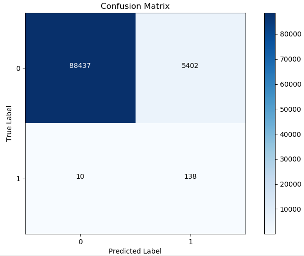

```python
"""
基于下采样建立的模型在原始数据集上进行预测
"""
lr = LogisticRegression(C=best_c, penalty='l1')
lr.fit(X_train_undersample, y_trian_undersample.values.ravel())
y_pred = lr.predict(X_test.values)

# 画出混淆矩阵
cnf_matrix = confusion_matrix(y_test, y_pred)
np.set_printoptions(precision=2)
print('Recall metrix in the testing dataset:', cnf_matrix[1,1] / (cnf_matrix[1, 0] + cnf_matrix[1,1]))

# plot non-normalized confusionmatrix
class_names = [0, 1]
plt.figure()
plot_confusion_matrix(cnf_matrix, classes=class_names, title='Confusion Matrix')
plt.show()
```

### 5. 逻辑回归阈值对结果的影响

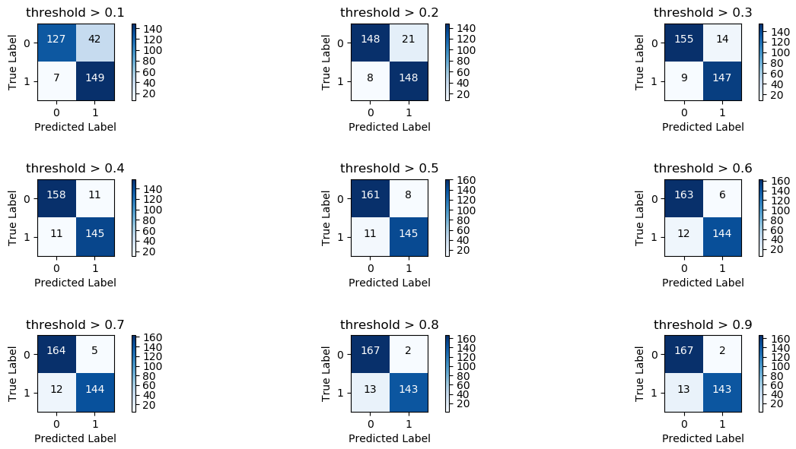

```python
"""
逻辑回归阈值对结果的影响
在sigmoid函数中将>0.5认为是1，我们希望预测结果大于0.6时才将预测结果认为是1，因此需要调整阈值实现。
"""
lr = LogisticRegression(C=best_c, penalty='l1')
lr.fit(X_train_undersample, y_trian_undersample.values.ravel())
y_pred_undersample_proba = lr.predict_proba(X_test_undersample.values)

thresholds = [0.1, 0.2, 0.3, 0.4, 0.5, 0.6, 0.7, 0.8, 0.9]
# plt.figure(figsize=(10, 10))

j = 1
for i in thresholds:
    y_test_predictions_high_recall = y_pred_undersample_proba[:, 1] > i
    plt.subplot(3, 3, j)

    cnf_matrix = confusion_matrix(y_test_undersample, y_test_predictions_high_recall)
    np.set_printoptions(precision=2)

    print("Recall Metrix in test datasets: ", cnf_matrix[1, 1] / (cnf_matrix[1,1] + cnf_matrix[1, 0]))
    class_names = [0, 1]
    plot_confusion_matrix(cnf_matrix, classes=class_names, title='threshold > 0.%d' % j)
    j += 1
plt.tight_layout()
plt.show()
```

###6. 数据分布不均匀处理方法之过采样（SMOTE算法）

通过上面第4节的分析可以知道**下采样的负作用**会导致误差率很高，即负例被预测为正例。

**SMOTE样本生成策略**

1. 对于少数类中每一个样本x，以欧式距离为标准计算它到少数类样本集中所有样本的距离，得到其K近邻；

2. 根据样本不平衡比例设置一个采样比例以确定采样倍率N，对于每一个少数类样本X，从其k近邻中随机选择若干样本，假设选择的近邻为$xn$；

3. 对于每一个随机选出的近邻$xn$，分别与原样本按照如下的公式构建新的样本
   $$
   X_{new} = X_i + rand(0, 1) \times d，其中d=(\widetilde{X}- X)为欧式距离
   $$


如下图所示，其中星型样本量比较少，假设$k=6$, 且$x_i$到其他六个点距离分别为$d_1,d_2,...,d_6$，则依次将距离带入公式$x_{new} = x_i + rand(0,1) \times d_j, j=1,2,...,6$中即可得到6个新的点。

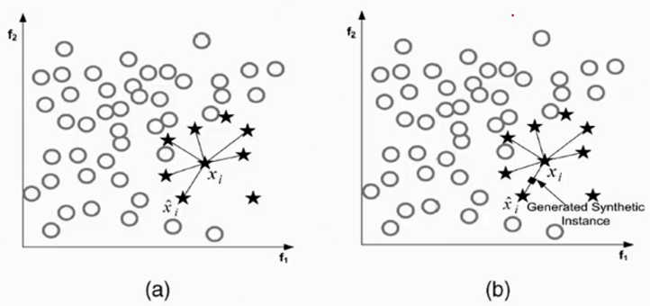

**使用SMOTE算法需要安装imblearn模块** 

```
pip install -U imblearn
```

**使用SMOTE算法生成数据**：只能在训练集上生成，测试集上要原封不动。

```python
from sklearn.linear_model import LogisticRegression
from sklearn.model_selection import train_test_split
from imblearn.over_sampling import SMOTE
import matplotlib.pyplot as plt 
import pandas as pd 
import numpy as np 

# 数据是已经提取好特征的数据
data = pd.read_csv(r'G:\data\creditcard.csv')
# print(data.head())

columns = data.columns
# The label "Class" is in the last column, simply remove it to obtain features column
features_columns = columns.delete(len(columns) - 1)

features = data[features_columns]
labels = data['Class']

features_train, features_test, labels_train, labels_test = \
    train_test_split(
        features, labels, 
        test_size=0.2, random_state=0)

# 过采样，只需要对训练集生成样本，而对于测试集保持原封不动！！
oversampler = SMOTE(random_state=0)
# 此函数完成后就会生成相应的数据
os_features, os_labels = oversampler.fit_sample(features_train, labels_train)
os_features, os_labels = pd.DataFrame(os_features), pd.DataFrame(os_labels)

# 获取最优惩罚项系数
best_c = print_kfold_scores(os_features, os_labels)
"""
   C_parameter  Mean recall score
0        0.001           0.927782
1        0.010           0.934018
2        0.100           0.935148
3        1.000           0.935212
4       10.000           0.935368
5      100.000           0.935383
6     1000.000           0.935286
"""
```

接下来采用第3、4、5节中方法对测试数据进行分析，通过查看该模型的召回率、和误杀率可以知道，过采样的召回率与下采样的召回率相比稍微低了一些，但过采样的误杀率却大大降低了，过采样模型整体的准确度提升了。

**总结**：当数据不平衡时，能尽量多使用数据就尽量多使用，因此采用**过采样**策略是首选，数据越多对于建立模型越有利。

##案例：信用贷款


```python
import pandas as pd 

# 该数据有145个特征
data = pd.read_csv(r'G:\data\LoanStats3a.csv', skiprows=1)
print(data.index)

# 去除空行，没有用的特征列
half_count = len(data) / 2
data = data.dropna(thresh=half_count, axis=1)
# data = data.drop(['desc', 'url'], axis=1)
# data.to_csv('load_2007.csv', index=False)
data.drop_duplicates()

"""
特征预处理
    1、去除不重要的特征
    2、识别Label特征列：loan_status
"""
data  = data.drop(['funded_amnt', 'funded_amnt_inv', 'grade', 'sub_grade'], axis=1)

# 将label值转换为数值类型
data = data[(data['loan_status'] == 'Fully Paid') | (data['loan_status'] == 'Charged Off')]
status_replace = {
    'loan_status': {
        'Fully Paid': 1,
        'Charged Off': 0
    }
}
data = data.replace(status_replace)
# print(data['loan_status'].value_counts())

#把所有特征中值是一样的列删除
origin_cols = data.columns
drop_cols = []
for col in origin_cols:
    col_series = data[col].dropna().unique()
    if len(col_series) == 1:
        drop_cols.append(col)
print(drop_cols)
data = data.drop(drop_cols, axis=1)

"""
1、缺失值，若缺失值数量比较少直接去掉即可，若是很多可以考虑将这个列去掉；
2、字符值处理，
"""
null_counts = data.isnull().sum()
print(null_counts)

# 查看特征类型，有23个字符型的需要处理
print(data.dtypes.value_counts())
# object     23
# float64    16
# int64       1

object_columns_df = data.select_dtypes(include=['object'])
print(object_columns_df.iloc[0])
# term                         36 months
# int_rate                        10.65%
# emp_title                          NaN
# emp_length                   10+ years
# home_ownership                    RENT
cols = ['home_ownership', 'emp_length', '']


"""
    目标是：利润最大化
    要求： 高recall率，低fall out率
    recall   = TPR = TP / (TP + FN)
    fall out = FPR = FP / (TN + FP)
    当recall和fall out都非常高，这样结果不准确，问题是在于样本不均衡，需要采用下样本或过样本进行处理后再训练模型。
"""

# 给回归模型添加权重项
from sklearn.linear_model import LogisticRegression
from sklearn.model_selection import KFold, cross_val_score
from sklearn.metrics import confusion_matrix

penalty = {
    0: 10,
    1: 1
}
lr = LogisticRegression(class_weight=penalty)
kf = KFold(n_splits=3, random_state=1)
# pred = cross_val_score(lr, features, target, cv=kf)
# pred = pd.Series(pred)
# tn, fp, fn, tp = confusion_matrix(y_true, y_pred)
```

##模型优化方法

1. we can tweak the penalties further.
2. we can try models other than a random forest and logistic regression;
3. we can use some of the columns we discarded to generate better features;
4. we can ensemble multiple models to get more accurate predictions.
5. we can tune the parameters of the algorithm to achieve higher performance.

***

[^1]: [机器学习知识体系之线性回归](https://www.cnblogs.com/wdsunny/p/6362582.html)
[^2]: [线性回归,逻辑回归与梯度下降]()https://www.cnblogs.com/futurehau/p/6105011.html
[^3]: The Elements of Statistical Learning(2nd)

