#第三章 分类算法（分类器）

问题1：像R、Matlab、SAS等能能够处理大数据吗？能够用在生产环境吗？R、Matlab、SASS等主要是实验室工具，是用来建模的，主要用于研发模型；模型研发出来之后，实现方式可以使用C、Java等实现。例如：我们在实验室通过试管（R、Matlab）研制新的配方，在完成研制后，我们需要厂房进行集中大量生产，试想一下不可能在厂房使用大量试管生产新药。R、Matlab不适合处理大数据，当数据量到达百万级别时，处理起来已经很吃力了，因为R需要将数据加载到内存中，因此内存受限导致无法处理大量数据。虽然可以结合Hadoop使用R分析，但是这仅仅是一个数据接口；也有一些增强工具能够使R直接处理硬盘数据，例如：Oracle上的R软件可以在数据库中处理，但是大数据实际上会达到百亿级别，这种处理方式还是会很慢，而真正互联网上的大数据分析这是海量数据。

**处理大数据建模的方法**：1. 大数据变小数据抽样(聚类场景不适用)；2. 利用分布式集群结合并行算法；3. 降低问题精度，提高算法速度(例如求社交网络中完全子图，改为求满足一定度的子图)。

问题2：分类（判别分析）与聚类有什么差别？ 前者是有监督的有学习集，后者是无监督的无学习集。

**常见分类模型与算法**

| 分类算法        | 分类算法   |
| --------------- | ---------- |
| 线性判别法      | 距离判别法 |
| 贝叶斯分类器    | 决策树     |
| 支持向量机(SVM) | 神经网络   |

##3.1  线性判别法

**原理：**用一条直线来划分学习集，将学习集分别在直线的两侧，然后根据待测点在直线的哪一边决定它的分类。对于线性不可分的情况，

##3.2 距离判别法

**原理：**计算待测点与各类的距离（马氏距离），取最短者为其所属分类 

##3.3 K近邻（KNN）

如下图所示，根据K值不同得到不同的结果

- 如果k=3，绿色远点的最近的3个邻居是2个红色的小三角和1个蓝色的小正方形，少数服从多数，基于统计的方法，判定绿色的这个待分类点属于红色的三角形一类。
- 如果k=5，绿色圆点的最近的5个邻居是2个红色小三角和3个蓝色正方形，还是少数服从多数，基于统计的方法，哦安定绿色的这个待分类点属于蓝色的正方形一类。


**K-近邻算法描述**

1. 计算已知类别数据集中的点与当前未知类别属性数据集中的点的距离(欧式距离)；
2. 按照距离依次排序；
3. 选取与当前点距离最小的K个点；
4. 确定前K个点所在类别的出现频率；
5. 返回前K个点出现频率最高的类别作为当前点预测分类；

KNN算法本身简单有效，它是一种lazy-learning算法，分类器不需要使用训练集进行训练，训练时间复杂度为0。KNN分类的计算复杂度和训练集中的文档数目成正比，即如果训练集中文档总数为N，那么KNN的分类时间复杂度为O(N)。

K值得选择，距离度量和分类决策规则是该算法的三个基本要素。

**问题**：该算法在分类时有个主要的不足是，当样本不平衡时，如一个类的样本容量很大，而其他类样本容量很小时，有可能导致当输入一个新样本上时，该样本的K个邻居中大容量样本占多数？解决办法是**不同的样本给予不同权重**。

```python
import numpy as np
class NearestNeighor:
    def __init__(self):
        pass
    def trai(self, X, y):
        """
        X is N*D where each row is an example. Y is 1-dimesion of size N
        """
        self.Xtr = X
        self.Ytr = y
    def predict(self, X):
        """
        X is N*D where each row is an example we wish to predict label for
        """
        num_test = X.shape[0]
        # make sure that the output type matches the input type
        Ypred = np.zeros(num_test, dtype=self.dtype)
        
        for i in range(num_test):
            # find the nearest trainging image to the i'th test image
            # usig the L1 distance(sum of absolute value different)
            distaces = np.sum(np.abs(self.Xtr - X[i, :]), axis=1)
            min_index = np.argmin(distaces)
            Ypred[i] = self.Ytr[min_index]
        return Ypred
```

##3.4 朴素贝叶斯(Naive Bayes, NB)

**朴素贝叶斯的假设**：一个特征出现的概率，与其他特征条件独立(给定y是特征独立)，即给定分类的条件下，特征独立，每个特征同等重要(特征均衡性)。

朴素贝叶斯是基于“特征之间是独立的”这一朴素假设，应用贝叶斯定理的监督学习算法，对于给定特征向量$x_1,x_2,...,x_n$，类别y的概率可以根据贝叶斯公式得到
$$
P(y|x_1,x_2,...,x_n) = \frac{p(x_1,x_2,...,x_n|y)p(y)}{P(x_1,x_2,...,x_n)}
$$
**朴素贝叶斯的推导**

使用朴素的独立性假设可以得到$P(x_i|y, x_1, ..., x_{i-1}, x_{i+1}, ..., x_n) = P(x_i | y)$，则类别y的概率可以简化为
$$
P(y|x_1,x_2,...,x_n) = \frac{p(x_1,x_2,...,x_n|y)p(y)}{P(x_1,x_2,...,x_n)} =  \frac{p(y) \prod_{i=1}^{n}P(x_i|y)}{P(x_1,x_2,...,x_n)} 
$$
在给定样本的前提下，$P(x_1, x_2, ..., x_n)$是常数，所以有$P(x_1, x_2, ..., x_n) \propto P(y)\prod_{i=1}^{n}P(x_i|y)$，从而有
$$
\hat{y} = \underset{y}{arg \ max} P(y) \prod_{i=1}^n P(x_i|y)
$$
**高斯朴素贝叶斯(Gaussian Naive Bayes)**

根据样本使用MAP(Maximum A Posterior)或MLE估计P(y)，建立合理的模型估计$P(x_i|y)$，从而得到样本的类别
$$
\hat{y} = \underset{y}{arg \ max} P(y) \prod_{i=1}^n P(x_i|y)
$$
假设特征服从高斯分布，则有$P(x_i|y)=\frac{1}{\sqrt{2 \pi}\sigma} exp(- \frac{(x_i - \mu_y)^2}{2 \sigma_y^2})$，参数$\sigma_y,\mu_y$可以使用MLE估计出来。

**多项分布朴素贝叶斯(Multinomial Naive Bayes)**

假设特征服从多项分布，从而对于每个类别y，参数为$\theta_y=(\theta_{y1}, \theta_{y2},...,\theta_{yn})$，其中n为特征的数目，$P(x_i|y)$的概率为$\theta_{yi}$，目标函数为$\hat{y} = \underset{y}{arg \ max}P(y)\prod_{i=1}^n P(x_i|y)$，参数$\theta_{y}$使用MLE估计的结果为$\hat{\theta}_{yi}=\frac{N_{yi} + \alpha}{N_y + \alpha \cdot n}，\alpha \ge 0$，假定训练集为T，则有
$$
\begin{cases}
N_{yi} = \sum_{x \in T} x_i \\
N_y = \sum_{i=1}^{|T|}N_{yi}
\end{cases}
$$
其中

- $\alpha=1$称为Laplace平滑
- $\alpha \lt 1$称为Lidstone平滑

**模型比较理论** 

1. 最大似然：最符合观测数据的（即P(D|h)）最有优势；例如：扔一个硬币，观察到的是“正”，根据最大似然估计的方法，我们应该猜测这枚硬币扔出"正"的概率是1，因为这个才是能最大化P(D|h)的那个猜测
2. **奥卡姆剃刀**：P(h)较大的模型有较大的优势；例如：如果平面上有N个点，近似构成一条直线，但绝不精确地位于一条直线上，这时我们即可以用直线拟合，也可以用二阶多项式拟合，也可以用三阶多项式拟合，特别地，用N-1阶多项式便能够保证肯定能完美通过N个数据点（过拟合，把所有点都拟合了），那么这些可能的模型之中到低哪个是最靠谱的？根据奥卡姆剃刀原理，越是高阶的多项式越是不常见，$P(1) > P(2) >> P(n-1)$，因此常用的是1阶、2阶多项式。

**范例：文本分类**

样本为1000封邮件，每个邮件被标记为垃圾邮件或者非垃圾邮件，分类的目标是给定第1001封邮件，确定它是垃圾邮件还是非垃圾邮件。

类别C：垃圾邮件C1，非垃圾邮件C2

词汇表建立方法，记单词数目为N

- 使用现成的单词词典；

- 将所有邮件中出现的单词都统计出来，得到词典

将每个邮件m映射成维度为N的向量$\vec{x}$，若单词$w_i$在邮件m中出现过，则$x_i=1$，否则$x_i=0$，即邮件向量化$m \rightarrow (x_1,x_2,...,x_n)$，有贝叶斯公式可以得到：$P(c|\vec{x})=\frac{P(\vec{x}|c)*P(c)}{P(\vec{x})}$

- 由特征条件独立假设得：$P(\vec{x}|c) = P(x_1,x_2,...,x_n|c) = P(x_1|c)*P(x_2|c)*...*P(x_n|c)$
- 有特征独立假设得：$P(\vec{x}) = P(x_1,x_2,...,x_n)=P(x_1)*P(x_2)*...*P(x_n)$

其中$P(x_i|c_i)$表示在$c_i$的前提下，第i个单词$x_i$出现的概率，$P(x_i)$：在所有样本中，单词$x_i$出现的概率，$P(c_j)$：在所有样本中，邮件类别$c_j$出现的概率。

**拉普拉斯平滑**：避免$\frac{0}{0}$带来的算法异常

$P(x_1|c_1)$：在垃圾邮件c1这个类别中，单词x1出现的概率，x1是待考察的邮件中的某个单词。设$n_1$表示在所有垃圾邮件c1这个类别中，单词x1出现的概率，若没有出现过则$n_1=0$，设n表示所有垃圾邮件的所有文档出现过的单词总数目，则有$P(x_1|c_1) = \frac{n_1}{n}$，则**拉普拉斯平滑**为
$$
P(x_1|c_1) = \frac{n_1 + 1}{n+N}
$$
其中N是所有单词的数目，修正分母是为了保证概率和为1，同理以同样的平滑方案处理$P(x_1)$

**朴素贝叶斯的几点思考**

- 小数乘积下溢怎么办？

- 一个词在样本中出现多次，和一个单词在样本中出现一次，形成的词向量相同？有0/1向量改成频数向量或TF-IDF向量
  $$
  TF\_IDF = \frac{TF}{IDF}
  $$
  其中TF为单词在当前文档的出现频率，IDF为单词在除当前文档以外的其他文档出现的频率。在其他文档中出现该词的频率越小，当前文档出现该词的权重就越大。有时为了防止IDF为0，对其进行拉普拉斯平滑，有时分母对IDF取ln函数，则公式变为：$TF\_IDF = \frac{TF}{ln(IDF +1)}$

- 如何判断两个文档的距离？余弦夹角

- 如何给定合适的超参数$\hat{\theta}_{yi} = \frac{N_{yi} + \alpha}{N_y + \alpha \cdot n}， \alpha \ge 0$？交叉验证

- 朴素贝叶斯是会出现过拟合现象的，为此

##3.5 贝叶斯(Bayes)分类器

贝叶斯要解决的问题：逆向概率问题

- 正向概率：假设袋子里面有N个白球，M个黑球，你伸手进去摸一把，摸出黑球的概率？
- 逆向概率：如果我们事先不知道袋子里面黑白球的比例，而是闭着眼睛摸出一个（或几个）球，观察这些取出来的球的颜色之后，那么我们可以就此对袋子里面的黑白球的比例做出什么推测？

为什么使用贝叶斯？1. 现实世界本身就是不确定的，人类的观察能力是有局限性的；2. 我们日常生活所观察到的只是事情表面上的结果，因此我们需要提供一个猜测。

**范例：** 学校男生60%，女生40%，男生总是穿长裤子，而女生中一半穿长裤子一半穿裙子。

- 正向概率：随机选取一个学生，他穿长裤的概率和穿裙子的概率多大？
- 逆向概率：迎面走来一个穿长裤的学生，只看见他（她）穿的是长裤，而无法确定他的性别，你能够推断出他（她）是女生的概率有多大吗？

假设学校总人数为U

1. 穿长裤的男生人数为：U * P(Boy) * P(Pants|Boy)，其中P(Boy)=0.6，P(Pants|Boy)是条件概率表示所有男生中穿长裤的概率，这里是100%，因为所有男生总是穿长裤。
2. 穿长裤的女生人数为：U * P(Girl) * P(Pants|Girl)，其中P(Girl)=0.4，P(Pants|Girl)表示所有女生中床长裤的概率，这里为50%。

穿长裤的总人数为：U * P(Boy) * P(Pants|Boy) + U * P(Girl) * P(Pants|Girl)

问题：求穿长裤的人中是女生的概率？
$$
P(Girl|Pants) = \frac{U * P(Girl) * P(Pants|Girl) }{ 穿长裤的总数} \\
=\frac{U * P(Girl) * P(Pants|Girl) }{U * P(Boy) * P(Pants|Boy) + U * P(Girl) * P(Pants|Girl)} \\
=\frac{ P(Girl) * P(Pants|Girl) }{P(Boy) * P(Pants|Boy) + P(Girl) * P(Pants|Girl)}
$$


**贝叶斯公式**
$$
条件概率：P(A|B)=\frac{P(AB)}{P(B)} \qquad 全概率公式：P(A) = \sum_i P(A|B_i)P(B_i) \\
\ \\
P(A|B) = \frac{P(B|A)P(A)}{P(B)} 或 P(B_i|A) = \frac{P(A|B_i) P(B_i)}{\sum_j P(A|B_j)P(B_j)} \\
$$

P(A|B)称为**后验概率(Posterior)**表示给定观测样本数据B，假定A成立的概率；P(B|A)称为**似然概率(Likelihood)**；P(A)称为**先验概率(Prior)**表示任意给定样本数据为A的概率；P(B)称为**边缘似然概率(Marginal Likelihood)**。先验概率的计算可以根据大数定理计算，当抽样趋近于无穷时，频率趋近于先验概率。中P(B|A)(A)表示总体A出现的概率，而P(B|A)是在总体A中含有B特征的概率。

**范例：拼写纠正**

我们看到用户输入了一个不存在字典中的单词，我们需要去猜测“这个家伙到底真正想输入的单词是什么”，即我们要求的是：$P(我们猜测他想输入的单词|他实际输入的单词)$。假设用户实际输入的单词记为D即观测数据，我们猜测的有：P(h1|D)，P(h2|D)，...，P(hn|D)，统一为P(h|D)，而由贝叶斯公式可以得到

$$
P(h|D) = \frac{P(h)P(D|h)}{P(D)}
$$
其中P(h)表示单词h在字典中出现的频率，为特定猜测的先验概率。对于不同的具体猜测h1,h2,h3,...，P(D)都是一样的，所以比较P(h1|D)和P(h2|D)的时候，我们可以忽略这个常数。则有
$$
P(h|D) \propto P(h) * P(D|h)，\propto表示正比于
$$
对于给定观测数据，一个猜测是好是坏，取决于“这个猜测本身独立的可能性大小(先验概率，Prior)”和“这个猜测生成我们观测到的数据的可能性大小”。

例如用户输入tlp，到低是top还是tip?这个时候，当最大使然不能做出决定性判断时，先验概率就可以插手进来给出提示“既然你无法决定，那么我告诉你，一般来说top出现的程度高很多，所以更可能他想打的top”。

**拼写检查器实现** 
$$
arg \  maxc \  P(c|w) \rightarrow arg \ maxc \ \frac{P(w|c)P(c)}{P(w)}
$$

- P(c)表示文章中出现一个正确拼写单词c的概率，也就是说，在英文文章中，c出现的概率有多大；
- P(w|c)表示用户想键入c的情况下敲层w的概率，因为这个是代表用户会以多大的概率把c敲错成w；
- arg maxc表用用来枚举所有可能的c并且选取概率最大，即输入一个w，什么样的c词能够使得P(c|w)最大；

```python
import re, collections
# 把语料库中的单词全部抽取出来，装成小写，并且去除单词中间的特殊符号
def word(text):
    return re.findall('[a-z]+', text.lower())
# 计算词频，求出先验概率
def train(features):
    """
    要是遇到从未见过的新词怎么办？假如说一个词拼写完全正确，但是语料库中没有包含这个词，从而这个词永远不会出现在训练集中，于是，我们就要返回这个词的概率为0，这种情况不妙，因为概率为0代表这个事件不可能发生，而我们的概率模型中，我们期望用一个很小概率代表这种情况，即lambda:1，最小出现次数为1。
    """
    model = collections.defaultdict(lambda:1)
    for f in features:
        model[f] += 1
    return model
NWORDS = train(words(open('big.txt').read()))
alphabet = 'abcdefghijklmnopqrstuvwxyz'

# 编辑距离
# 两个词之间编辑距离定义为使用几次插入、删除、交换(相邻两个字母)、替换的操作从一个词变为另一个词。

# 返回所有单词w编辑距离为1的集合
def editsl(word):
    n = len(word)
    return set(
    	[word[0:i] + word[i+1:] for i in range(n)] + # deletion
        [word[0:i] + word[i+1] + word[i] + word[i+2] for i in range(n-1)] + # transpositon
        [word[0:i] + c + word[i+1:] for i in range(n) for c in alphabet]  + # alteration
        [word[0,i] + c + word[i: ] for i in range(n+1) for c in alphate] + # insertion
    ) 

# 返回所有与单词w编辑距离为2的集合
# 优化：在这些编辑距离小于2的集合中间，只把正确的词作为候选词，有许多事是无意义的单词
def edits2(word):
    return set(e2 for e1 in edits1(word) for e2 in alpha)

"""
正常来说把一个元音拼成另一个的概率要大于辅音（人人常把hello打成hella），把单词的第一个字母平措的概率会相对小等。为了简单起边，选择一个简单的方法：编辑距离为1的为正确单词比编辑距离为2的优先级高，而编辑距离为0的正确单词优先级比编辑距离为1的高
"""
def known(words):
    return set(w for w in words if w in NWORDS)

def known_edits2(words):
    return set(e2 for e1 in edits1(word) for e2 in edits1(e1) if e2 in NWORDS)

#如果know(set)为空，candidate就会选取这个集合，而不继续计算后面
def correct(word):
    candidates = known([word]) or known(edits1(word)) or known_edits2(word) or [word]
    # 返回概率最大的单词
    return max(candidate, key=lambda w: NWORDS[w])
```

**模型比较理论** 

1. 最大似然：最符合观测数据的（即P(D|h)）最有优势；例如：扔一个硬币，观察到的是“正”，根据最大似然估计的方法，我们应该猜测这枚硬币扔出"正"的概率是1，因为这个才是能最大化P(D|h)的那个猜测
2. **奥卡姆剃刀**：P(h)较大的模型有较大的优势；例如：如果平面上有N个点，近似构成一条直线，但绝不精确地位于一条直线上，这时我们即可以用直线拟合，也可以用二阶多项式拟合，也可以用三阶多项式拟合，特别地，用N-1阶多项式便能够保证肯定能完美通过N个数据点（过拟合，把所有点都拟合了），那么这些可能的模型之中到低哪个是最靠谱的？根据奥卡姆剃刀原理，越是高阶的多项式越是不常见，$P(1) > P(2) >> P(n-1)$，因此常用的是1阶、2阶多项式。

**范例：垃圾邮件过滤** 

给定一封邮件，判定是否属于垃圾邮件。D表示这封邮件，注意D有N个单词组成，我们用h+来表示垃圾邮件，h-表示正常有奖，则有
$$
P(h+|D) = \frac{P(h+) * P(D | h+)}{P(D)} \\
P(h-|D) = \frac{P(h-) * P(D | h-)}{P(D)} \\
$$
其中P(h+)、P(h-)先验概率可以求出，例如在最近的1W封邮件中，有1000封是垃圾邮件，其余是正常邮件。其中P(D)在对比时是常数，可以去掉不考虑。P(D|h+)表示这封邮件是垃圾邮件并且是有单词D构成的。D里面包含有N个单词d1,d2,...，P(D|h+) = P(d1,d2,..,dn | h+)即在垃圾邮件当中出现跟我们目前这一封信一模一样的概率有多少？(概率极小)，因此对其进行扩展：
$$
P(d1,d2,..,dn | h+) = P(d1|h+) * P(d2|d1,h+) + P(d3|d2,d1,h+) + ...
$$

1. 假设di与di-1是完全条件无关的（==朴素贝叶斯假设特征之间是独立的，互不影响== ），则上式简化为
   $$
   P(d1,d2,..,dn | h+) = P(d1|h+) * P(d2|d1,h+) + P(d3|d2,d1,h+) + ... \\
   = P(d1|h+) * P(d2|h+) + P(d3|h+) + ...
   $$
   实际上单词间是有关系的，但是为了解决问题，我们提出变通的假设，这样就能得到解决方法，但是解决肯定是受影响的。

2. 对于$P(d1|h+) * P(d2|h+) + P(d3|h+) + ...$ ，只要统计di这个单词在垃圾邮件中出现的频率即可。

**范例：贝叶斯公式**

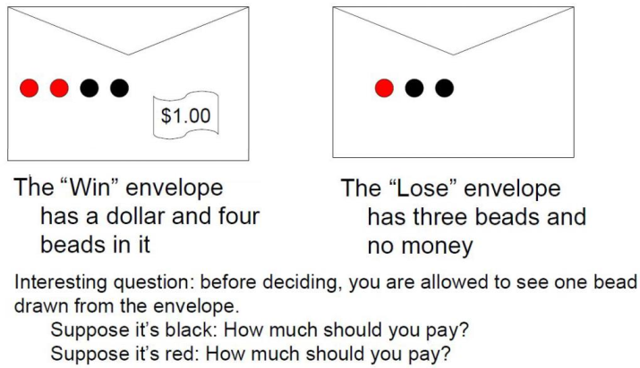

设C1、C2表示左右两个信封，P(R)、P(B)表示摸到红球、黑球的概率，则目标是求P(C1|R) 、P(C1|B)，根据贝叶斯公式可以得到$P(C1|R) = \frac{P(R|C1)P(C1)}{P(R)}$，而根据全概率公式可以得到$P(R)=P(R|C1)*P(C1) + P(R|C2)*P(C2)$

- P(R|C1) = 2/4
- P(R|C2) = 1/3
- P(C1)=P(C2) = 1/2

则可以知道若摸到红球，则该信封有1美元的概率为0.6，而如果摸到黑球，则该信封有1美元的概率为3/7。

**范例：贝叶斯公式**

现有三个箱子，每个箱子各有两块贵金属，三个箱子金银条如下：


现在随机选择一个箱子的其中一块贵金属，发现是金条，请问该箱子中另外一块任然是金条的概率是多少？

设$B=1、2、3$表示选择的箱子，而M表示选择的贵金属，取值有‘G'和'S'，则目标为P(B=1|M='G')，则有全概率公式可以得到$P(B=1|M='G') = \frac{P(M='G'|B=1)P(B=1)}{P(M='G')}$，其中$P(M='G')=\sum_{i=1}^3 P(M='G'|B=i)P(B_i)$ ，而有

-  P(M='G'|B=1) = 1、P(M='G'|B=2) = 0、P(M='G'|B=3) = 1/2
- P(M='G') = 1/3 + 0 + 1/6 = 1/2

则有P(B=1|M='G') = 2/3

##3.6 贝叶斯网络（Bayes Network） 

贝叶斯网络又称为有向无环图模型(Directed Acyclic Graphical Model, DAG)是一种概率图模型，根据概率图的拓扑结构，考察一组随机变量$\{X_1, X_2, ..., X_n\}$及其n组条件概率分布(Conditional Probability Distribution, CPD)的性质。一般而言，贝叶斯网络的有向无环图中的节点表示随机变量，它们可以是可观察到的变量，或隐变量、未知参数等。连接两个节点的箭头代表此两个随机变量是具有因果关系或非条件独立。若两个节点间以一个单箭头连接在一起，两个节点就会产生一个条件概率值。

概率图模型(PGM)分为：马尔科夫网络(无向图，Markov Network)、贝叶斯网络(有向图，Bayes Network)，其中

**每个节点在给定其直接前驱时，条件独立于其非后继**，例如$P(a,b,c)=P(c|a,b)P(b|a)P(a)$ ，则对应下图一个简单的贝叶斯网络为

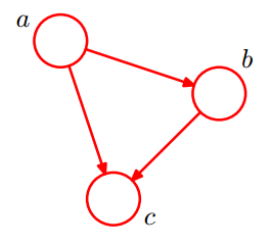

**全连接贝叶斯网络**：每一对节点之间都有边连接，即完全有向无环图，边数为$C_{n}^2$
$$
P(x_1,x_2,...,x_n) = \prod_{i=1}^n P(x_i | x_1,...x_{i-1}) \\
P(x_1,x_2,x_3,x_4) = P(x_4|x_1,x_2,x_3)P(x_3|x_1,x_2)P(x_2|x_1)P(x_1)
$$
**范例1：正常的贝叶斯网络**

如下图所示，下面图中的贝叶斯网络是一般贝叶斯网络，有向图不是完全图，从下图可以直观得出

- x1和x2独立
- x6和x7在给定x4的条件下独立
- x1,x2,...,x7的联合分布为：$P(x_1)P(x_2)P(x_3)P(x_4|x_1,x_2,x_3)P(x_5|x_1,x_3)P(x_6|x_4)P(x_7|x_4,x_5)$，得到联合分布就是$P(x_1,x_2,...,x_7)$的联合概率，有了联合概率后，我们就可以算出任何一个我们想要的概率。例如：要求$P(x_1,x_2,x_3,x_5,x_6|x_7)$的概率，有$P(x_1,x_2,x_3,x_5,x_6|x_7) = \frac{P(x_1,x_2,x_3,x_5,x_6,x_7)}{P(x_7)}$，其中$P(x_1,x_2,x_3,x_5,x_6,x_7)$可以通过$\sum_{x_4}P(x_1,x_2,x_3,x_4,x_5,x_6,x_7)$求得，而$P(x_7) = \sum_{x_1,...,x_7}P(x_1,x_2,...,x_7)$联合概率可以得到$P(x_1,x_2,...,x_7)$的联合概率值

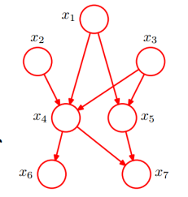

**范例2: 实际贝叶斯网络分析**

如下图所示，呼吸困难特征受到lung cancer和bronchitis的影响，P(D|C,B)的条件概率分布(CPD)，也称为**条件概率表**，如下图所示，则通过贝叶斯网络只需要分析$1+2+2+4+4=13$个情况而不是$2^5$个情况。

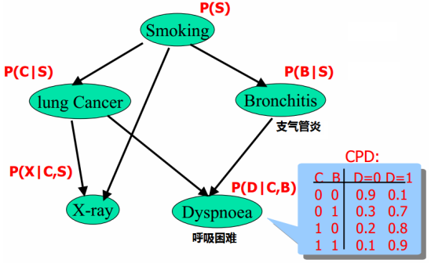

**范例3：贝叶斯网络--警报**

全部随机变量的联合分布为$P(x_1,x_2,...,x_n)=\prod_{i=1}^{n}P(x_i | parent(x_i))$，当有了如下图所示的条件概率表我们就能够算出任何一个情况下的概率取值，例如求$P(j,m,a,\overline{b},\overline{e})$的概率值，表示John和Mary同时打电话，同时报警响起了，但没有外人入侵也没有地震的概率，则可以得到
$$
P(j,m,a,\overline{b},\overline{e}) = P(j|a)P(m|a)P(a|\overline{b},\overline{e})P(\overline{b})P(\overline{e}) \\
=0.9 * 0.7 * 0.001 * 0.999 *0.998 \approx 0.00063
$$
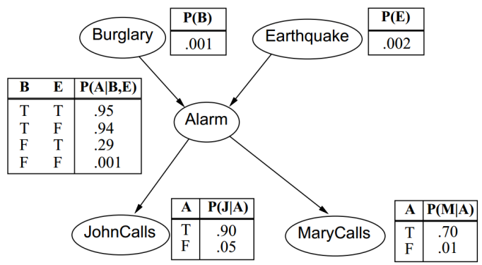

**马尔科夫模型**

马尔科夫模型是特殊的贝叶斯网路，节点形成一条链式网络，如下图所示，其中$A_{i+1}$只与$A_i$有关，而与$A_1,...,A_{i-1}$无关

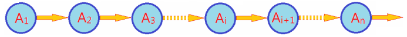

- 伪随机数发生器

  ```c
  return (((holdrand = holdrand * 214013L + 2531011L) >> 16) & 0x7fff)
  ```

- pLSA主题模型

**通过贝叶斯网络判定条件独立**

1. **tail-to-tail条件独立**，根据图模型可得，$P(a,b,c)=P(c)*P(a|c)*P(b|c)$，从而有$\frac{P(a,b,c)}{P(c)} = P(a|c)*P(b|c)$，又$P(a,b|c)=\frac{P(a,b,c)}{P(c)}$，则可以得到$P(a,b|c) = P(a|c)*P(b|c)$，即**在==c给定==的条件下，a、b被阻断(blocked)，a、b是==条件独立==的，反之，若c未知则a与b不条件独立，这种情况称为 tail-to-tail**

   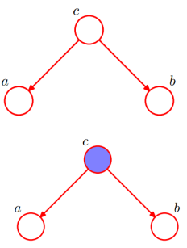

2. **head-to-tail条件独立**，根据图模型可得，$P(a,b,c)=P(c)*P(a|c)*P(b|c)$，给定下图模型，则可以得到
   $$
   P(a,b|c) = \frac{P(a,b,c)}{P(c)} =\frac{P(c)*P(a|c)*P(b|c)}{P(c)} = P(a|c)P(b|c)
   $$
   即**在==c给定==的条件下，a、b被阻断(blocked)，a、b是==条件独立==的，反之，若c未知则a与b不条件独立，这种情况称为 head-to-tail**，该条件是马尔科夫模型的基础，即当给定$A_i$时，$A_{i-1},A_{i+1}$条件独立，有$P(A_{i-1},A_{i+1}|A_i)=P(A_{i-1}|A_i)P(A_{i+1}|A_i)$，若该规则对于任意i成立，则对应的模型就是马尔科夫模型。

   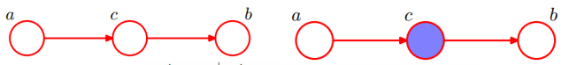

3. **head-to-head独立**，根据图模型可以得到联合概率为，$P(a,b,c)=P(a)P(b)P(c|a,b)$，将等式两边对$c$求积分，则可以得到$\sum_cP(a,b,c) = \sum_{c}P(a)P(b)P(c|a,b) \Rightarrow P(a,b)=P(a)P(b)$，即**在==C未知==的条件下，a、b被阻断(blocked)，a、b是==独立==的。**

   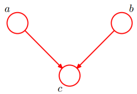

**推广上述结点到结点集：D-Separation(有向分离)**

对于任意的结点集A、B、C，考察所有通过A中任意结点到B中任意结点的路径，若要求A、B条件独立，则需要所有的路径都被阻断(blocked)，即满足下列前提之一：

- A和B的"head-to-tail"型和"tail-to-tail"型路径都通过C；
- A和B的"head-to-head"型路径不通过C以及C的子孙；

如果A、B不满足D-Separation，A、B有时被称为D-connected。如下图有向分离的例子，考虑给定条件时的Gas和Radio独立情况：

1. 给定Battery时，属于"tail-to-tail"型，因此Radio和Gas是独立的；
2. 给定Ignition时，属于"head-to-tail"型，因此Radio和Gas是独立的；
3. 给定Starts时，属于"head-to-head"型，因此Radio和Gas是独立的；
4. 给定Moves时，Radio和Gas的路径没有被Moves阻断(blocked)，因此Radio和Gas不是独立的；

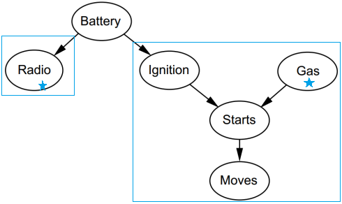

**范例1：有向分离** 

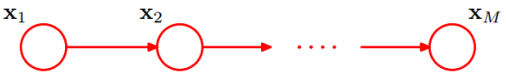

如上图所示，有D-Separation可知，在$X_i$给定的条件下，$X_{i+1}$的分布和$X_1,X_2,...,X_{i-1}$条件独立，即$X_{i+1}$的分布状态只和$X_i$有关，和其他变量条件独立，这种顺次演变的随机过程模型，称为马尔科夫模型，满足
$$
P(X_{i+1} | X_1,X_2, ..., X_{i}) = P(X_{i+1} |X_i)
$$


##3.7 范例：马尔科夫模型

**寻找马航MH370** 2014年3月8日，马来西亚航空公司MH370航班客机凌晨0:41分从吉隆坡飞往北京，凌晨1:19分马航MH370与空管失去联系，凌晨2:14最后一次出现在军事雷达上之后人间消失。可否根据雷达最后消失区域和洋流、大气等因素：判断留尼汪岛是否位于可能区域？残骸漂流到该岛屿的概率有多大。

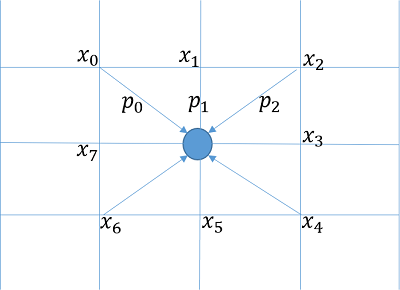

根据上述条件，设区域为网状结构，其中圆点为所求区域，y为残骸漂流到该点的概率，则可以知道圆点出现的残骸的概率与其邻接点有关，则可以得到
$$
y = p_0x_0  +　 p_１x_１ +　p_２x_２ +　 p_３x_３ +　p_４x_４  +  p_５x_５ +  p_６x_６ + p_７x_７ \\
$$
其中$p_i$为第i个邻接点处的残骸漂流到圆点的转移概率，而$x_i$为第i个邻接点出现残骸的概率。写成向量形式为
$$
y = \vec{P} \vec{X}，\vec{p} = [p_0,p_1,...,p_7]^T,\vec{x} = [x_0,x_1,...,x_7]
$$
则第i时刻存在残骸的概率$y_i$可以有第i-1时刻的概率值得到，即有$y^{(i)} = \vec{P}^{(i-1)} \vec{X}^{(i-1)}$，则第i时刻与第$1,2...,i-2$时刻在给定第i-1时刻的概率时是条件独立的，符合马尔科夫模型，对应的过程为马尔科夫过程，模型如下图所示。
$$
\vec{X}^{(0)}  \underset{\vec{P}^{(0)}}{\rightarrow}  \vec{X}^{(1)}  \underset{\vec{P}^{(1)}}{\rightarrow}  \vec{X}^{(2)}  \underset{\vec{P}^{(..)}}{\rightarrow} ... \underset{\vec{P}^{(i-1)}}{\rightarrow}  \vec{X}^{(i)}  \underset{\vec{P}^{(..)}}{\rightarrow} ... \underset{\vec{P}^{(n-1)}}{\rightarrow}  \vec{X}^{(n)} 
$$

```python
# /usr/bin/python
# -*- coding:utf-8 -*-
import numpy as np
import matplotlib.pyplot as plt
import os
from matplotlib import animation
from PIL import Image

def update(f):
    global loc
    if f == 0:
        loc = loc_prime
    next_loc = np.zeros((m, n), dtype=np.float)
    for i in np.arange(m):
        for j in np.arange(n):
            next_loc[i, j] = calc_next_loc(np.array([i, j]), loc, directions)
    loc = next_loc / np.max(next_loc)
    im.set_array(loc)

    # Save
    if save_image:
        if f % 3 == 0:
            image_data = plt.cm.coolwarm(loc) * 255
            image_data, _ = np.split(image_data, (-1, ), axis=2)
            image_data = image_data.astype(np.uint8).clip(0, 255)
            output = '.\\Pic2\\'
            if not os.path.exists(output):
                os.mkdir(output)
            a = Image.fromarray(image_data, mode='RGB')
            a.save('%s%d.png' % (output, f))
    return [im]

def calc_next_loc(now, loc, directions):
    near_index = np.array([(-1, -1), (-1, 0), (-1, 1),
                  (0, -1), (0, 1),
                  (1, -1), (1, 0), (1, 1)])
    directions_index = np.array([7, 6, 5, 0, 4, 1, 2, 3])
    nn = now + near_index
    ii, jj = nn[:, 0], nn[:, 1]
    ii[ii >= m] = 0
    jj[jj >= n] = 0
    return np.dot(loc[ii, jj], directions[ii, jj, directions_index])

if __name__ == '__main__':
    np.set_printoptions(suppress=True, linewidth=300, edgeitems=8)
    np.random.seed(0)

    save_image = False
    # 洋流飘逸规律，概率优势方向
    style = 'Sin'   # Sin/Direct/Random
    m, n = 50, 100
    directions = np.random.rand(m, n, 8)

    if style == 'Direct':
        directions[:,:,1] = 10
    elif style == 'Sin':
        x = np.arange(n)
        y_d = np.cos(6*np.pi*x/n)
        theta = np.empty_like(x, dtype=np.int)
        theta[y_d > 0.5] = 1
        theta[~(y_d > 0.5) & (y_d > -0.5)] = 0
        theta[~(y_d > -0.5)] = 7
        directions[:, x.astype(np.int), theta] = 10
    directions[:, :] /= np.sum(directions[:, :])
    print(directions)

    loc = np.zeros((m, n), dtype=np.float)
    loc[m/2, n/2] = 1
    loc_prime = np.empty_like(loc)
    loc_prime = loc
    fig = plt.figure(figsize=(8, 6), facecolor='w')
    im = plt.imshow(loc/np.max(loc), cmap='coolwarm')
    anim = animation.FuncAnimation(fig, update, frames=300, interval=50, blit=True)
    plt.tight_layout(1.5)
    plt.show()
```

