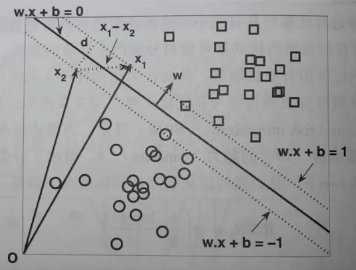
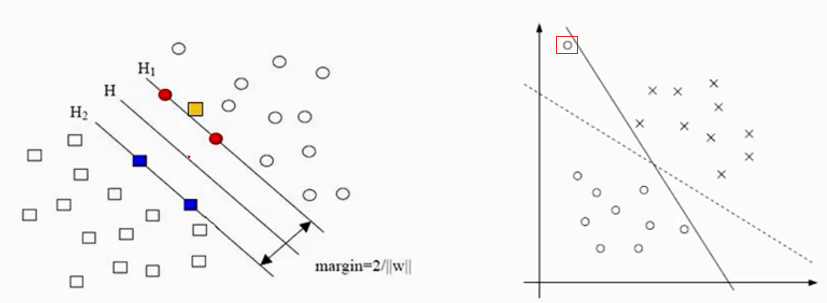
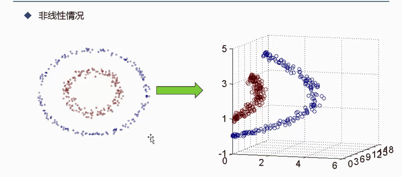
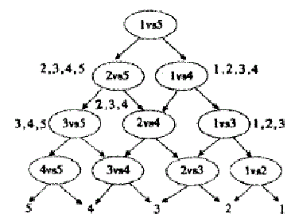

##支持向量机（SVM）

### 一、 SVM的从无到有

对于给定的一组数据我们找到一组$h(x)$，称其线性/超平面分类器(Linear/Hyperplane Classifier) ，其中每一组线性分类器都能够分类给定数据。
$$
h(x) = sign(w^T x)，sign表示取符号
$$

而对于给定的样本数据，我们希望找到一条线能够将$\times$和$\circ$分开，如下图所示，我找到了三条线能够将数据分开。则我们找到了三组参数能够满足条件，但是我们应取找其中的哪一组参数作为最终结果呢？

选取哪一组参数，有没有什么标准呢？这里我们可以把$\times$和$\circ$都看做是雷，我们希望画一个安全区出来，它能够距离雷区越远越好，如下图所示，第一条线距离雷区太近了，而第二组线则距离$\times$和$\circ$ 雷区稍微远点，但第三组线距离$\times$和$\circ$雷区最远。我们`首先找到一组距离雷越远越好的线，然后通过查看距离所选择直线最近的雷到直线的距离d，选择其中d最大的那条直线作为最优解`。

也可以通过决策面方式，查看分离$\times$和$\circ$的效果，如下图所示，可以看到第三组安全区域最大。对于给定的样本数据点，在进行切分的时候，我们希望容错能力越强越好，例如对于第一组曲线，当有一个$\times$数据点(黄色)落在直线周围时，有可能就会将其划分为$\circ$这个类别。而对于第三组，即使有一个$\times$数据点(黄色)落在直线周围，仍然会将其分类为$\times$这个类别。因此我们希望`决策边界越胖越好，这样它的容错能力更强，分辨能力也就更强` ，最后模型表现效果就会更好。 

 因此我们提出一个问题希望能够找到分离样本数据的直线，并且其决策边界越胖越好**（最大边缘超平面，MMH）**。**问题描述**为
$$
max_{w} \quad fatness(w) \\
s.t. \quad w \ classifies \ every \  (x_n, y_n) \ correctly \ \\
fatness(w) = min_{n=1,2,...,N} \ distance(x_n, w)
$$
其中我们称$fatness$ 为边界(Margin)，而$correctness \ y_n  = sign(w^T x_n)$ ，**目标是：find largest-margin separating hyperplane**。

####1.1 点到平面的距离

考虑平面$Ax + By + Cz + D = 0$ ，求平面外一点$Q(x_0,y_0,z_0)$ 到平面的距离d。如下图所示，任取平面内一点$P(x, y, z)$ 连接$PQ$ ，过P做平面的法向量$\vec{n}=(A,B,C)$ ，可以知道Q到平面的距离d恰是PQ在法向量n上的投影长度。，则有

$$
d = ||\vec{PQ}|| \cdot cos \theta = \frac{||\vec{n}||}{||\vec{n}||} \cdot ||\vec{PQ}|| \cdot cos \theta = \frac{\vec{PQ} \cdot \vec{n}}{||\vec{n}||} \\
=\frac{A(x_0 - x) + B(y_0 - y) + C(z_0 -z) }{\sqrt{A^2 + B^2 + C^2}} \\
=\frac{Ax_0 + By_0 + Cz_0 - (Ax + By + Cz) }{\sqrt{A^2 + B^2 + C^2}} \\
=\frac{|Ax_0 + By_0 + Cz_0 + D|}{\sqrt{A^2 + B^2 + C^2}} （保证结果为正）
$$
假设平面(hyperplane)$w^Tx + b = 0$ ，则样本点$x$ 到平面的距离可以表示为
$$
dist(x, b, w) = \frac{1}{||w||} |w^Tx + b|
$$
####1.2 支持向量机推导 

如下图所示，假设分离平面为$w \cdot x + b =0$，那么可以去适当的值使得上方的支持平面为$w \cdot x + b = 1$，而下方的支持平面为$w \cdot x +b = -1$，具体推导如下：

假设经过支持向量$x_1$的平面为$w_0 x_1 + b_1 = 0$，而下方经支持向量$x_2$的平面为$w_0 x_2 + b_2 = 0$，因为两个平面平行，所以法向量可以是一样的。通过上面式子可以得到$x_1 = -\frac{b_1}{w_0}，x_2=-\frac{b_2}{w_0}$，分别带入二元一次方程组
$$
\begin{cases}
w \cdot x + b = 1 \\
w \cdot x + b = -1
\end{cases}
$$
求解方程组既可以得到w和b满足上述方程组。PS：从中可以看出，如果能够求出支持向量$x_1、x_2$，那么就能够求出分离平面了，但实际上支持向量是需要我们求出来的。

如上图所示，从上面式子可以得到
$$
w \cdot (x_1 - x_2) = 2 \Rightarrow ||w|| \cdot ||x_1 - x_2|| \cdot cos \theta = 2 \\
\Downarrow  \\
||x_1 - x_2|| cos \theta = d 为支撑平面的距离d \\
||w|| \cdot d = 2 \quad \\
\Downarrow  \\
d = \frac{2}{||w||}
$$
对于图中的两个类别，我们需要最大两个支撑平面的距离，设当$w \cdot x_i + b \ge 1$时，其类别为$y_i=1$；而当$w \cdot x_i + b \le -1$时，其类别为$y_i=-1$。联合两种情况可以得到**SVM目标函数**为
$$
max_{w} \frac{2}{||w||} \\
s.t. \quad y_i (w \cdot x_i + b) \ge 1，i=1,2,...,n
$$
将上述问题转换为凸优化问题
$$
min_{w} \frac{||w||^2}{2} \\
s.t. \quad y_i (w \cdot x_i + b) \ge 1，i=1,2,...,n
$$
如下图所示，我们称$H_1$和$H_2$为支撑平面（三维空间），支撑平面是成对出现的。SVM目标就是最大化$H_1$和$H_2$之间的距离，我们要求分离平面在$H_1$和$H_2$之间，距离$H_1$和$H_2$距离相等，称$H$为**最优分离平面（决策边界）**。而$H_1$和$H_2$之间的空间称为**隔离地带**。落在支撑平面上的向量称为**支持向量**，而求支持向量的算法称为**支持向量机**。

**求解SVM目标函数** 
$$
min_{w} \frac{||w||^2}{2} \\
s.t. \quad y_i (w \cdot x_i + b) \ge 1，i=1,2,...,n
$$
上面是凸二次规划问题，什么叫凸？凸集是指有这么一个点的集合，其中任取两个点连一条直线，这条线上的点仍然在这个集合内部，对于凸函数来说，局部最优就是全局最优。对于非约束优化问题采用**朗格朗日乘子法**求解，拉格朗日乘子法的标准格式为
$$
min \ f(x) \\
s.t. \quad g_i(x) \le 0，i=1,...,m
$$
因此可以通过转换得到上述目标函数，其中$\frac{1}{2}w^2$是为了方便计算。则可以得到朗格朗日函数
$$
L(w,b,\alpha) = \frac{1}{2} ||w||^2 - \sum_{i=1}^{n} \alpha_i(y_i \cdot(w^T \cdot \Phi(x_i)  +b) - 1) \\
对偶问题：min_{w,b} \  max_{\alpha} \ L(w,b,\alpha) \Leftrightarrow max_{\alpha} \ min_{w,b} L(w,b,\alpha)
$$
分别对w和b求偏导，分别得到两个条件
$$
\frac{\partial L}{\partial w} = 0 \Rightarrow w = \sum_{i=1}^{n} \alpha_i y_i \Phi(x_i) \\
\frac{\partial L}{\partial b} = 0 \Rightarrow 0 = \sum_{i=1}^{n}\alpha_i y_i \qquad \quad
$$
将求得的结果带入拉格朗日函数中，可得
$$
L(w,b,\alpha) = \frac{1}{2} ||w||^2 - \sum_{i=1}^{n} \alpha_i(y_i \cdot(w^T \cdot \Phi(x_i)  +b) - 1) \\
= \frac{1}{2}w^Tw - w^T \sum_{i=1}^{n} \alpha_i y_i \Phi(x_i) - b\sum_{i=1}^{n} \alpha_i y_i + \sum_{i=1}^{n} \alpha_i  \qquad \\
= \sum_{i=1}^{n} \alpha_i -  \frac{1}{2}( \sum_{i=1}^{n} \alpha_i y_i \Phi(x_i))^T( \sum_{i=1}^{n} \alpha_i y_i \Phi(x_i)) \qquad \qquad \\
= \sum_{i=1}^{n}\alpha_i - \frac{1}{2} \sum_{i,j=1}^{n} \alpha_i \alpha_j y_i y_j \Phi^T(x_i) \Phi(x_j) \qquad \qquad \qquad \quad   \\
$$
则就得到$min_{w,b} L(w,b,\alpha)$的求解，下一步需要继续对$\alpha$求极大值，根据拉格朗日定义将其转换为标准式
$$
max_{\alpha}  \ \{  \sum_{i=1}^{n}\alpha_i - \frac{1}{2} \sum_{i,j=1}^{n} \alpha_i \alpha_j y_i y_j \Phi^T(x_i) \Phi(x_j) \} \\
 s.t. \qquad \sum_{i=1}^{n}\alpha_i y_i = 0 \\
\alpha_i \ge 0 \quad i=1，...，n \\
\Downarrow \\
min_{\alpha} \ \{ \frac{1}{2} \sum_{i,j=1}^{n} \alpha_i \alpha_j y_i y_j \Phi^T(x_i) \Phi(x_j) -  \sum_{i=1}^{n}\alpha_i \} \\
 s.t. \qquad \sum_{i=1}^{n}\alpha_i y_i = 0 \\
\alpha_i \ge 0 \quad i=1，...，n \\
$$
**范例：如何求$\alpha$ ，为什么称为支持向量机？?**

已知一个如图所示的训练数据集，其正例点是$x_1=(3,3)^T，x_2=(4,3)^T$ ，负例点是$x_3=(1,1)^T$ ，试求最大间隔分离超平面。

样本为：$x_1(3,3,1)、x_2(4,3,1)、x_3(1,1,-1)$ 

求解：
$$
\frac{1}{2} \sum_{i=1}^{n} \sum_{j=1}^{n} \alpha_i \alpha_j y_i y_j (x_i \cdot x_j) -  \sum_{i=1}^{n}\alpha_i \\
a_1 + a_2 - a_3 = 0 \\
a_i \ge 0 \quad i=1,2,3
$$
将样本数据带入可以得到
$$
\frac{1}{2}(18a_1^2 + 25a_2^2 + 2a_3^2 + 42a_1 a_2 - 12 a_1 a_3 - 14 a_2 a_3) - a_1 - a_2 - a_3
$$
将$a_1 + a_2 = a_3$ 带入上式，然后分别对$a_1，a_2$ 求偏导后得到解
$$
(1) a_1 = 1.5，a_2 = -1，不满足a_i \ge 0，i=1,2,3 \qquad \qquad  \qquad  \qquad  \qquad \\
(2)a_1 = 0，a_2 = \frac{2}{13}，满足a_i \ge 0，i=1,2,3，带入原式得L(a)=-0.153 \\
(3)a_1 = 0.25，a_2 = 0，满足a_i \ge 0，i=1,2,3，带入原式得L(a)=-0.25 \\
$$
则最小值在$a = (0.25,0,0.25)$ 处取得，将$a$值带入下式可以求得$w^*，b^*$ 
$$
w^* = \sum_{i=1}^{n}a_i y_i x_i  \Rightarrow w_1 = w_2 = 0.5 \\
b^* = y_i - \sum_{i=1}^{n} a_i y_i (x_i \cdot x_i) \Rightarrow b=-2 \\
$$
因此也就求出了这条决策边界线，如下图所示

因此$a = (0.25,0,0.25)$ 中$a_2=0$表示在构建平面的过程中只用到了$x_1，x_3$ 这两个点，在构建支持向量机时是通过一些点把决策边界给支撑出来的，而支持向量就是$x_1，x_3$，而$x_2$ 就不是，所谓支持向量就是那些距离决策边界最近的样本点，因为在构建边界时仅仅需要考虑那些最近的点就行了，而其他点不许考虑。

从KKT条件中得到，只有支持向量的$α_i$不为0，其他情况$α_i$都是0，对于新来样本，只需要求该样本和支持向量的内积，然后计算结果就行。

**软间隔和松弛因子：假设|Y|>1是否太严格？**

上述结果是基于假设 $y_i \cdot (w^T \cdot \Phi(x_i) + b) \ge 1$，如下图所示，基于该假设我们得到的是`实线`，是为了满足图中上方圆圈而不得不调整得到的结果，而这个实线的表现结果没有图中`虚线`表现好，并且最近的$\times$和$\circ$距离实线的距离也变小了。这种偏离正常位置很远的数据点，我们称之为`outlier` ，它有可能是采集训练样本的时候的噪声，也有可能是某个标数据的大叔打瞌睡标错了，把正样本标成负样本了。那一般来说，如果我们直接忽略它，原来的分隔超平面还是挺好的，但是由于这个 outlier 的出现，导致分隔超平面不得不被挤歪了，同时 margin 也相应变小了。当然，更严重的情况是，我们将无法构造出能将数据线性分开的超平面。
为了处理这种情况，我们允许数据点在一定程度上偏离超平面，也就是允许一些点跑到H1和H2之间，即它们到分类面的间隔会小于1，让支持向量机具有一定容错性，允许一些异常样本点，因此引入软间隔(soft margin)概念。

为了解决上述为，引入松弛因子$\epsilon_i \ge 0$ ，则假设条件变为$y_i \cdot (w^T \cdot \Phi(x_i) + b) \ge 1 - \epsilon_i$ ，对应的目标函数增加了一个惩罚函数，新的模型（也称为软间隔）为
$$
min \{ \frac{1}{2}||w||^2 + C \sum_{i=1}^{n} \epsilon_i \}  \\
s.t.  \quad y_i \cdot (w^T \cdot \Phi(x_i) + b) + \epsilon_i -1 \ge 0 \\
\epsilon_i \ge 0 ，i \in [1, N]
$$
引入非负参数$\epsilon_i$松弛因子后， 就允许某些样本点的函数间隔小于1，即在最大间隔区间里面，或者函数间隔是负数，即样本点在对方的区域中。而放松限制条件后，我们需要重新调整目标函数，以对离群点进行处罚，目标函数后面加上的第二项就表示离群点越多，目标函数的值越大。目标函数控制了离群点的数目和程度，使大部分样本点仍然遵守限制条件。
松弛变量的系数$C$为离群点的权重 表示对分错的点加入多少惩罚，C越大表明离群点对目标函数的影响越大，即越不希望看到离群点，此时间隔越小。其含义

1. 当C趋近于无穷大时，若要目标函数最小，则松弛因子就得最小，则意味着分类严格不能有错误，边界越小，分错的点就会更少，但过拟合情况可能会比较严重；
2. 当C趋近于很小时，则松弛因子的大小就影响不大，这意味着可以有更大的错误容忍，边界越大，分错的点可能会更多；

则该目标函数对应的拉格朗日函数为
$$
L(w,b,\epsilon,\alpha,\mu) = \frac{1}{2}||w||^2 + C \sum_{i=1}^{n} \epsilon_i - \sum_{i=1}^{n} \alpha_i (y_i(w x_i + b) - 1 + \epsilon_i) - \sum_{i=1}^{n} \mu_i \epsilon_i \\
\Downarrow \\
w = \sum_{i=1}^{n} \alpha_i y_i \Phi(x_i) \\
0 = \sum_{i=1}^{n} \alpha_i y_i \\
C - \alpha_i - \mu_i = 0 \\
\Downarrow 带入原式\\
max \{ \sum_{i=1}^{n} \alpha_i - \frac{1}{2} \sum_{i=1}^{n} \sum_{j=1}^{n}a_i a_j y_i y_j (x_i \cdot x_i)  \} \\
s.t. \quad \sum_{i=1}^{n} \alpha_i y_i =0 \quad C - \alpha_i - \mu_i = 0 \\
\alpha_i \ge 0 \quad \mu_i \ge 0 \quad 0 \le \alpha_i \le C \\
\Downarrow 对偶问题\\
min \{\frac{1}{2} \sum_{i=1}^{n} \sum_{j=1}^{n}a_i a_j y_i y_j (x_i \cdot x_i)  - \sum_{i=1}^{n} \alpha_i \} \\
s.t. \quad  \sum_{i=1}^{n} \alpha_i y_i =0 \quad 0 \le \alpha_i \le C
$$
####1.3 支持向量机核变换

如下图所示，若想要将其中的两类点给分开，正常情况下是通过直线切一刀，但是在这里却无法通过一次切分得到结果。左图中点实在二维平面中，我们可以将其映射到高维空间，如右图所示，可以对应的点映射到不同的维度中，这样我们在中间找一个平面就能切分这两类点，`低维不可分，SVM可以将其转换为高维可分的`。下图中将平面上的点$x、y$映射到三维空间中，例如为$x=x，y=y，z=\sqrt{x^2+y^2}$ ，则原来在平面上的圆会在Z轴上上升，假设蓝色圆由y构成，红色圆由x构成，由于y构成的圆半径大则映射后蓝色圆上升的高度就比红色圆上升的高度大，因此就可以在三维空间通过一个平面将两者分开。

假设我们有两个数据$x=(x_1,x_2,x_3)，y=(y_1,y_2,y_3)$，此时在3D空间已经不能对其进行线性划分了，那么通过一个函数将数据映射到更高维的空间，比如9维的话，采用numpy计算方式：$np.outer(x,x).ravel()$，对应值关系为$f(x)=(x_1x_1,x_1x_1,x_1x_3,x_2x_1,x_2x_2,x_2x_3,x_3x_1,x_3x_2,x_3x_3)$，由于需要计算内积，所以在新的数据在9维空间，需要计算$<f(x),f(y)>$ 的内积，需要花费时间复杂度为$O(n^2)$，这种现象称为**维数灾难**，例如，令$x=(1,2,3)，y=(4,5,6)$ ，那么$f(x)=(1,2,3,2,4,6,3,6,9)，f(y)=(16,20,24,20,25,36,24,30,36)$ ，此时
$$
<f(x),f(y)> = 16 + 40 + 72 + 40 + 100 + 180 + 72 +180 +324 = 1024
$$
但是若将维数扩大到一个非常大数时候，计算起来可就不是一点时间问题了，但是可以发现
$$
K(x,y) = (<x, y>)^2 = <f(x), f(y)>\\
K(x,y) = (4 + 10 + 18)^2 = 32^2 = 1024
$$
两者相等，但是$K(x,y)$计算起来却比$<f(x),f(y)>$ 简单的多，计算效率大幅度提高，$K(x,y)$ 的时间复杂度为$O(n)$ ，所以使用核函数的好处就是，可以在一个低维空间去完成高维度(或无限维度)样本内积的计算，比如$K(x,y)$3D空间对比$<f(x),f(y)>$ 的9D空间。

**高斯核函数**

实际上 大部分数据都不是线性可分的，而且维数很高，我们希望能够将其变换到更加稳健、非线性的空间 中，为此需要借助**核函数**将数据由低维变换到高维空间，核技巧接收一个x.，然后将其转换为$\phi(x)$，例如将$<x,y>$转换为$x^2，\sqrt{2}xy，y^2$。对于核函数$K(x,y)=<\varphi(x),  \varphi(y)>$核技巧需要注意一下三点

- $\varphi(x_i)\varphi(x_i)$会被计算多次，可能会花费大量时间；
- $\varphi​$本身就是一个难以计算的复杂函数；
- 若训练集规模很大，通常利用核技巧会大大增加计算开销；

因此，不是 所有的x都多变换为$\varphi(x)$，而是尝试一些不同的计算，例如$k(x_i,x_j)=\varphi(x_i) * \varphi(x_j)$，我们并不只是将原数据点x变换为新函数，我们 映射的是$\varphi(x)$的内积。**核函数**已经隐含计算了内积，下面的核函数$K(x,y)=<\varphi(x),  \varphi(y)>$都具有这种性质：

1. **齐次多项式**，函数计算开销低，易于计算
   $$
   K(x_i, x_j) = (x^T_ix_j)^d，d \gt 0，d为多项式阶数取整数
   $$
   多项式核函数利用相似性和数据组合，以二阶多项式为例，当某些维度应当被划分为一组时，此二阶多项式极为有用：
   $$
   K(x,y) = (\sum_{i=1}^{n}x_iy_i)^2 = \sum_{x=1}^{n}x_i^2y_i^2 +  \sum_{i=2}^{n} \sum_{j=1}^{i-1}\sqrt{2}x_iy_j\sqrt{2}x_jy_i
   $$

2. **非齐次多项式**，与齐次多项式的区别在于引入一个非负常量$c$，常量$c$提升了高阶而非低阶特征的相关性，形式如下：
   $$
   K(x_i,x_j)=(x_i^Tx_j + c)^d
   $$

3. **径向基函数**(Radial Basis Function，RBF)又称高斯核函数，由于其在高维空间中表现优秀，使用频率往往很高，一般形式如下
   $$
   K(x_i,x_j)=exp\{- \frac{||x_i - x_j||^2_2}{\sigma^2} \}
   $$
   其中，分子为两点欧氏距离的平方，$\sigma$为自由参数，径向基函数实际上创建了一个无穷维空间，而齐次多项式仅将原始空间的维数增加了 一维，RBF函数能够克服*维数灾难* 问，但缺憾将径向基函数可视化的 有效途径。

通过高斯核函数，将下图数据由低维可分转换为高维可分后，如下所示，这样就能够通过中间的一个平面进行分割。

**[核函数的选择](http://members.cbio.mines-paristech.fr/~jvert/svn/bibli/local/Smola1998connection.pdf)**：指出核函数可以对 数据归一化，概念上，二阶多项式 会将二维 数据点变换至三维空间，并试图拟合出一个 最平坦的平面。RBF虽然被经常使用，但比较容易对数据产生过拟合，需要慎用。

####1.4  SVM用于多分类

支持向量机是典型的二分类线性分类器，下面介绍三种方法对

1. **一对多**

   也就是“一对其余”**（One-vs-All）** 的方式，就是每次仍然解一个两类分类的问题。这样对于n个样本会得到n个分类器。但是这种方式可能会出现**分类重叠**现象或者**不可分类**现象而且由于“其余”的数据集过大，这样其实就人为造成了“**数据偏斜**”的问题。

2. **一对一**

   每次选择一个类作为正样本，负样本只用选其余的一个类，这样就避免了数据偏斜的问题。这种方法训练出的分类个数是k*(k-1)/2，虽然分类器的个数比上面多了，但是训练阶段所用的总时间却比“一类对其余”方法少很多。这种方法可能使多个分类器指向同一个类别，所以可以采用“投票”的方式确定哪个类别：哪个分类器获得的票数多就是哪个分类器。这种方式也会有分类重叠的现象，但是不会有不可分类的情况，因为不可能所有类别的票数都是0。但是也很容易发现这种方法是分类器的数目呈平方级上升。

3. **DAG SVM**

   假设有1、2、3、4、5五个类，那么可以按照如下方式组织分类器（ 这是一个有向无环图，因此这种方法也叫做DAG SVM）这种方式减少了分类器的数量，分类速度飞快，而且也没有分类重叠和不可分类现象。但是假如一开始的分类器回答错误，那么后面的分类器没有办法纠正，错误会一直向下累积。为了减少这种错误累积，根节点的选取至关重要。

   

   在预测时，可以先问分类器"1 vs 5"，如果回答是5，就往左走；再问分类器"2 vs 5"，如果还回答5，就继续往左走，一直问下去，就可以得到分类结果，如果有k个类别，那么只调用k-1个，分类速度快，且没有分类重叠和不可分类现象。

   缺陷：如果一开始分类器回答错误，那么后面的分类器是无法纠正的。

   ​

###二、Sequential Minimal Optimization，SMO[^2]算法求解支持向量机

支持向量中的目标函数为
$$
min \{\frac{1}{2} \sum_{i=1}^{n} \sum_{j=1}^{n}y_i y_j K(x_i , x_j)a_i a_j   - \sum_{i=1}^{n} \alpha_i \} \\
s.t. \quad  \sum_{i=1}^{n} \alpha_i y_i =0 \quad 0 \le \alpha_i \le C
$$
其中$(x_i,y_i)$表示训练样本数据，$x_i$为样本特征，$y_i \in \{-1,+1\}$为样本标签，$C$为惩罚系数用于定义胖边界大小。上述问题是要求解N个参数$(a_1,a_2,...,a_n)$，其他参数均为已知，1998年由Platt提出的序列最小最优化算法[^2]可以高效的求解SVM问题，它把原始解n个参数二次规划问题分解成很多个子二次规划问题分别求解，每个子问题只需要求解2个参数，方法类似于坐标上升，节省时间成本和降低了内存需求，每次启发式选择两个变量就行优化，不断循环，直到达到函数最优值。SMO是目前最快的二次规划优化算法，针对线性SVM和数据稀疏时性能更优。

**为什么要每次每两个参数求解？**

为了求解N个参数$(a_1,a_2,...,a_n)$，首先想到的是坐标上升的思路，例如求解$a_1$ ，可以固定其他$n-1$个参数，可以看成关于$a_1$ 的一元函数求解，但是注意到上述问题的等式约束条件$\sum_{i=1}^{n} \alpha_i y_i =0$ ，当固定其他参数时，参数$a_1$ 也被固定，因此这种方法不可用。 

SMO算法选择同时优化两个参数，固定其他$n-2$个参数，假设选择的变量为$a_1,a_2$，固定其他参数，由于参数$a_3,a_4，...，a_n$ 的固定可以简化目标函数只关于$a_1,a_2$的二元函数，则有
$$
W(a) = min \{\frac{1}{2} \sum_{i=1}^{n} \sum_{j=1}^{n}y_i y_j K(x_i , x_j)a_i a_j   - \sum_{i=1}^{n} \alpha_i \} \\
s.t. \quad  \sum_{i=1}^{n} \alpha_i y_i =0 \quad 0 \le \alpha_i \le C \\
\Downarrow \\
min \Psi(a_1, a_2) = \frac{1}{2} K_{11}a_1^2 + \frac{1}{2} K_{22}a_2^2 + y_1y_2 K_{12} a_1 a_2 - (a_1 + a_2) + y_1 v_1 a_1 + y_2 v_2 a_2 + Constant \\
v_i = \sum_{j=3}^{n} a_j y_j K(x_i, x_j)，i=1,2 \quad Constant为不包含a_1,a_2的常数项
$$
由等式约束条件得$a_1 y_1 + a_2 y_2 = -\sum_{i=3}^{n}a_iy_i = \zeta$ ，其中$\zeta$为定值，将等式$a_1y_1 + a_2y_2=\zeta$ 两边同时乘以$y_1且y_1^2=1$，则可以得到$a_1 = (\zeta - a_2y_2)y_1$ ，将此公式带入上述$min\Psi(a_1,a_2)$函数，可以得到
$$
min \Psi( a_2) = \frac{1}{2} K_{11}(\zeta - a_2y_2)^2 + \frac{1}{2} K_{22}a_2^2 + y_2 K_{12}(\zeta - a_2y_2)a_2 - (\zeta - a_2y_2)y_1 \\- a_2 + v_1(\zeta - a_2y_2)+ y_2 v_2 a_2 \\
$$

###2.1 SMO中两个变量的选择

SMO的基本思路是每次只更新两个乘子，迭代获得最终解。

由于$0 \le a_i \le C$，当$a_i=0或C$时参数就为常量，因此以后选择变量时就跳过这些常量参数，选择在$0 \lt a_i \lt C$之间的参数 作为下一次求解的变量。如此反复，直到求解问题。

****

[^1]: [支持向量机](http://blog.csdn.net/luoshixian099/article/details/51227754)
[^2]: Sequential Minimal Optimization:A Fast Algorithm for Training Support Vector Machines，John C. Platt 

