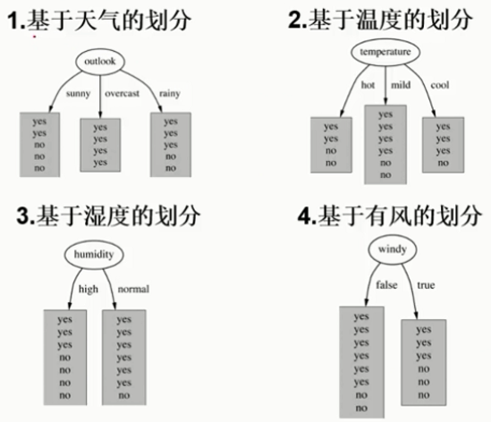
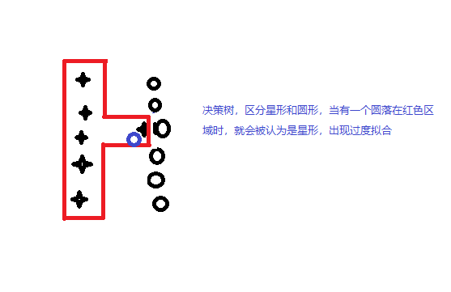
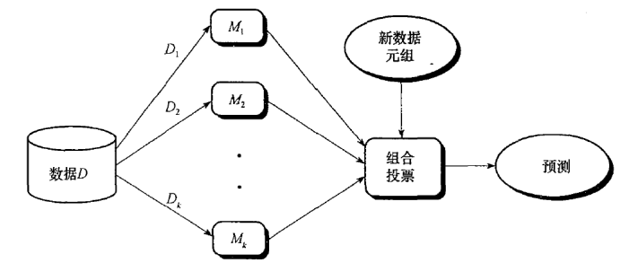
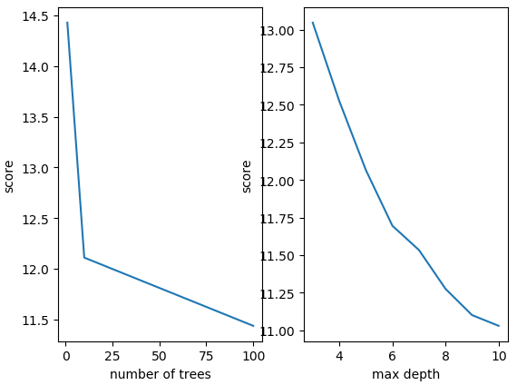

##1. 决策树（Decision Tree）

决策树既能做预测又能做回归。决策树善于除于离散值，可以将连续值转换为离散值后再用决策树进行训练，例如成绩是连续变量，可以通过高、中、低进行离散化。

决策树算法以树状结构表示数据分类的结果，每个决策点实现一个具有离散输出的测试函数记为分支。决策树中的元素：

1. 根节点
2. 非叶节点（决策点），代表测试的条件，对数据属性的测试
3. 叶子节点，代表分类后所获得的分类标记
4. 分支，代表测试的结果


**决策树分为两个阶段** 

1. 训练阶段，从给定公德训练数据集DB，构造一颗决策树，$class=DecisionTree(DB)$
2. 分类阶段，从根节点开始，按照决策树的分类属性逐层往下划分，直到叶节点，获得概念（决策、分类）结果，$y=DecisionTree(x)$


**决策树熵原理** 

熵值表示物体内部的混乱程度，熵值越大，混乱程度越大，越不纯。熵越小，分类效果越好。

假设两个事件x和y相互独立，其两个概率密度为$P(x, y) = P(x) \cdot P(y)$ ，设$H(x)、H(y)$ 分别代表事件x和y事件发生的不确定性。

- P(几率越大) ，则$H(x)$值越小，例如：今天正常上课；
- P(几率越小)，则$H(x)$值越大，例如：今天没翻车； 

$$
熵 = - \sum_{i=1}^{n} P_i log_2(P_i) \\
Gini系数 = Gini(p) = \sum_{k=1}^K p_k (1 - p_k) = 1 - \sum_{k=1}^K p_k^2
$$

例如：A集合内部的数据序列为[1,2,3,1,1,4,5]，而B集合中的序列为[1,2,2,2,2,2,2]，则可以看出A的熵值比B大。

==谁当根节点？== 

构造树的基本思想是随着树的深度的增加，节点的熵迅速降低，熵降低的速度越快越好，即哪些节点的熵值越小且熵值下降速度越快，信息增益越大，这个节点越有可能作为根节点，这样我们有望得到一颗高度最矮的决策树。

**构造决策树的例子：ID3算法**

| outlook  | temperature | humidity | windy | play |
| -------- | ----------- | -------- | ----- | ---- |
| sunny    | hot         | high     | FALSE | no   |
| sunny    | hot         | high     | TRUE  | no   |
| overcast | hot         | high     | FALSE | yes  |
| rainy    | mild        | high     | FALSE | yes  |
| rainy    | cool        | normal   | FALSE | yes  |
| rainy    | cool        | normal   | TRUE  | no   |
| overcast | cool        | normal   | TRUE  | yes  |
| sunny    | mild        | high     | FALSE | no   |
| sunny    | cool        | normal   | FALSE | yes  |
| rainy    | mild        | normal   | FALSE | yes  |
| sunny    | mild        | normal   | TRUE  | yes  |
| overcast | mild        | high     | TRUE  | yes  |
| overcast | hot         | normal   | FALSE | yes  |
| rainy    | mild        | high     | TRUE  | no   |

上述数据量有14行，每个数据有4个特征：outlook、temperature、humidity、windy。那个特征作为根节点呢？

**确定根节点** 根据当前Label值，其中有5个no，9个yes，在历史数据中计算熵值。在没有给定任何天气信息时，根据历史数据，我们只知道新的一天打球的概率为$\frac{9}{14}$ ，不打的概率为$\frac{4}{14}$ ，此时的熵值为
$$
Info(Origin) = -\frac{9}{14} log_2 \frac{9}{14} - \frac{5}{14} log_2 \frac{5}{14} = 0.940
$$
即在历史数据中，什么都没有划分前的熵值为0.940。然后对候选的4个特征分别计算将其作为根节点时，



(1)当outlook作为根节点时，信息熵为多少？

- outlook=sunny时，$\frac{2}{5}$ 的概率打球，$\frac{3}{5}$ 的概率不打球，则Entropy=0.971；
- outlook=overcast时，打球的概率为1，则Entropy=0；
- outlook=rainy时，$\frac{3}{5}$ 的概率打球，$\frac{2}{5}$ 的概率不打球，则Entropy=0.971；

根据历史统计数据outlook取值为sunny、overcast、rainy的概率分别为$\frac{5}{14}，\frac{4}{14}，\frac{5}{14}$，所以当已知变量outlook为根节点是时的信息熵为
$$
Entropy_{outlook} = \frac{5}{14} * 0.971 + \frac{4}{14} * 0 + \frac{5}{14} * 0.971 = 0.693
$$
这样的话系统的熵就从0.940下降到0.693，信息增益(gain)为$Gain_{outlook} = 0.940 - 0.693 = 0.247$

(2)当temperature为根节点时，信息增益(gain)为$Gain_{temperature} = 0.029$

(3)当humidity为根节点时，信息增益(gain)为$Gain_{humidity} = 0.152$

(4)当windy为根节点时，信息增益(gain)为$gain_{windy} = 0.048$

因为选取outlook时的信息增益最大，系统的信息熵下降的最快，所以决策树的根节点就取outlook。

接下来要确定N1取temperature、humidity还是windy？在已知outlook=sunny的情况下，根据历史数据，我们做出类似下面的一张表，更别计算temperature、humidity、windy的信息增益，选取最大值作为N1。

| temperature | humidity | windy | play |
| ----------- | -------- | ----- | ---- |
| hot         | high     | FALSE | no   |
| hot         | high     | TRUE  | no   |
| mild        | high     | FALSE | no   |
| cool        | normal   | FALSE | yes  |
| mild        | normal   | TRUE  | yes  |

依次类推，构造决策树。当系统的信息熵降为0时，就没有必要再往下构造决策树了，此时叶子节点都是纯的。在最坏情况下，决策树高度为属性（决策变量）的个数，叶子节点不纯，这就意味着我们要以一定的概率做出决策。

**决策树构建算法**

1. ID3，利用信息增益构建决策树。例如，将上述数据添加一列ID为编号，做将ID作为一个特征，则一共有5个特征，则使用ID3算法计算信息增益，以ID作为根节点时，有14个分支，即所有分支的信息熵都为0，这样以ID为根节点时的信息增益最大，但是此时明显是不正确的，因为ID与最终是否打球无关。所以需要解决的问题是：当一个特征中的不同值很对，而对应值所得到信息熵很小？这种情况需要解决，因此出现了C4.5算法。
   $$
   熵 = - \sum_{i=1}^{n} P_i ln(P_i)
   $$

2. C4.5，利用信息增益率构建决策树；
   $$
   信息增益率 = \frac{Gain_{feature}}{Entropy_{feature}} \\
   其中Entropy_{feature}为自身熵值，gain_{feature}为以feature为节点时的信息增益
   $$
   C4.5能够处理连续型属性（离散化），例如年龄可以通过划分区间将其离散化。首先将连续属性离散化，把连续属性的值分成不同的区间，依据是比较各个分裂点Gain值得大小。

   缺失值考虑：在构建决策树时，可以简单地忽略缺失数据，即在计算增益时，仅考虑具有属性值得记录。

3. CART，利用Gini系数构建决策树
   $$
   Gini系数 = Gini(p) = \sum_{k=1}^K p_k (1 - p_k) = 1 - \sum_{k=1}^K p_k^2
   $$


**评价构造决策树的效果好坏** 

评价函数，评价函数值越小越好
$$
C(T) = \sum_{t \in leaf} N_t \cdot H(t)
$$
其中$H(t)$ 为当前叶子节点t的熵值或Gini系数，而$N_t$为落入当前叶子节点中的样本数，可以看做是权重值

**为什么不能让决策树过高，要得到高度最矮的决策树？** 

决策树过高的极端情况是，树中的每个叶节点只包含自身样本数据。例如下图所示，有两类点：星形、圆形，圆形区域中存在一个异常点，而对于真实数据集来说因为错误的标注、错误的记录难免会存在一些异常点、错误点。若对此构建的决策高度很高，即决策树有大量分支，而最终决策树中的每个叶子节点的纯度最大，熵值都为0，每个也自己中的数据只剩下自身。对于这样的样本构成称的决策树，所有节点的熵值的累加和为0，但这并不意味着决策树的效果非常好。

决策树的高度非常高，也就是说会对每个样本就行分类，这样就得到如下两个区域，其中红色框中的区域中为星形， 而区域外面为圆形。在训练数据集中，会将右边的星形归为星形类别，而因为异常点，实际上这个应该是属于圆形这个类别，则依次构建的决策树，当在红色框中出现如图所示的蓝色圆形时，会将其认为是星形类别，这就出现了**过拟合**。即决策树在测试集上表现很好，但是由于把数据切的太碎，决策树肯定会学到一些噪音点、错误点，这就导致实际预测模型的效果就不好。因此我肯不希望决策树分支太多，即决策树不能太高，从而导致过拟合问题。



那么应该如何最小化决策树能？

1. 预剪枝，在构建决策树的过程中，提前停止决策树的构建，不需要永无止境的构造下去知道每个节点都只是一个样本，**边构建边裁剪**。例如：定义决策树的最大深度为3，那么构建决策树深度为3时就停止建立，或者一个节点上的样本数最小为50，则当一个节点中的样本数少于50时就停止构建。

2. 后剪枝，决策树构建后，然后才开始裁剪。引入下面修正评价函数，判断某一个节点在剪枝前后的值的大小确定是不是剪枝，$C_{\alpha}(t)$ 的值越小越好。 
   $$
   C_{\alpha}(t) = C(T) + \alpha \cdot |T_{leaf}|
   $$
   其中$C(T)$ 为决策树的损失函数值，$|T_{leaf}|$ 表示当前决策树造出的叶子节点个数。==叶子节点个数越多，损失越大==。当$\alpha$ 的取值比较小时表示叶节点数多一点不影响，而当$\alpha$ 的取值大时，表示我们希望得到少一点的叶节点。


##2. 评估分类器度量

| 度量                       | 公式                                |
| -------------------------- | ----------------------------------- |
| 准确率、识别率             | $\frac{TP +TN}{TP + FP +FN  + TN}$  |
| 错误率、误分类率           | $\frac{FP + FN}{TP + FP +FN  + TN}$ |
| 敏感度、真正比例率、召回率 | $\frac{TP}{TP +FP}$                 |
| 特效性、真负例率           | $\frac{TN}{TN+FN}$                  |
| 精度                       | $\frac{TP}{TP + FP}$                |


##3 . 组合算法

提升分类器准确率的组合方法包括：Bagging、Boosting和随机森林。基于学习数据集抽样产生若干训练集，使用训练集产生若干分类器，每个分类器分别迚行预测，通过简单选举多数，判定最终所属分类。

- Bagging，有放回采样n批样本，可以建立对应n个分类器；
- Bootstrapping，有放回抽样；
- 随机森林；



为什么组合方法能够提高分类准确率？


###3.1 Bagging算法


###3.2 Boosting算法


###3.3 随机森林

1. 数据选择的（有放回）随机性，选择训练集数据中一定的比例，例如0.6，因为数据中存在错误点、异常点，可以通过这种方式将噪声数据的影响降低。
2. 特征选择的随机性，因为特征也会存在异常，假设有8个特征，在构建决策树时选择其中的6个特征，则构建每一课树时，都从其中随机选择六个特征对应的数据进行构建。特征数不要太少，太少会导致信息缺失。

通过决策树算法构建了多颗决策树，构成了一个森林，在进行决策时更具森林中每一颗决策树的结果返回预测结果。例如：对于分类问题，将森林结果中的众数返回作为最终的预测类别；对于回归问题，将森林中每个树的均值作为预测结果。

```python
import matplotlib.pyplot as plt
import numpy as np 
from sklearn import datasets
import pandas as pd
from pandas import DataFrame
import seaborn as sb

iris = datasets.load_iris()
df = DataFrame(iris.data)
clz = np.array(['setosa'] * len(x.target[x.target==1]))
clz = np.append(clz, np.array(['versicolor'] * len(x.target[x.target==1])))
clz = np.append(clz, np.array(['virginica'] * len(x.target[x.target==2])))
df['class'] = clz
sb.pairplot(df.dropna(), hue='class')
plt.show()

from sklearn.tree import DecisionTreeClassifier
"""
1. criterion：gini、entropy，构建决策树确定节点的准则或标准。
2. splitter：best 、random，前者是在所有特征中找最好的切分点，后者随机选取部分特征（数据量大时使用）找切分。
3. max_features：None(所有)、log2、sqrt、N，特征小于50的时候一般使用所有。
4. max_depth：数据少或特征少时可以不管这个，若模型样本量多，特征也多的情况下，可以限制树深度。
5. min_samples_split：若某节点的样本数少与min_samples_slpit，则不会继续再尝试选择最优特征来进行划分；如果样本量不大，不需要设置；如果样本数量级非常大，推荐增大这个值。
6. min_samples_leaf：限制叶子节点最小样本数，若叶子数量小于样本数，则会和兄弟节点一起被剪枝，如果样本量不大，不需要设置。如若样本量在10W，可以设置5。
7. min_weight_fraction_leaf：限制叶节点所有样本权重和的最小值，如果小于这个值，则会和兄弟节点一起被剪枝。默认为0，不考虑权重问题。一般，若存在较多样本缺失值或者分类树样本的分布类别差别很大，就会引入样本权重，这时需要注意这个值得设置。很少用
8. max_leaf_nodes：通过限制叶节点数，可以防止过度拟合，默认为None，不限制最大叶子节点数。如果加了这个限制，算法会建立在最大叶节点数内最优的决策树。如果特征不多，可以不考虑这个值；若特征成分多时，可以加以限制，具体值可以通过交叉验证得到。
9. class_weight：指定样本类别的权重，主要是为了防止训练集某些类别的样本过多导致训练的决策树过于偏向这些类别。这里可以自己指定各个样本的权重，如果使用“balanced”，则算法会自己计算权重，样本少的类别所对应的样本权重会高。
10. min_impurity_split：限制决策树的增长，如果某节点的不纯度（基尼系数、信息增益、均方差、绝对差）小于这个阈值，则该节点不再生成子节点，成为叶节点。
"""
decision_tree_classifier = DecisionTreeClassifier()
# train the classifier on the training set
decision_tree_classifier.fit(training_inputs, training_classes)
# validate the classifier on the testing set using classifier accuracy
decision_tree_classifier.score(testing_inputs, testing_classes)
```

##4. 案例分析：科比

下面通过案例介绍如何建立模型、确定最优参数，下面例子

```python
from sklearn.ensemble import RandomForestClassifier
# 混淆举证、损失函数衡量模型
from sklearn.metrics import confusion_matrix, log_loss
from sklearn.model_selection import cross_val_score
from sklearn.model_selection import KFold
import matplotlib.pyplot as plt 
import pandas as pd 
import numpy as np 
import time

raw = pd.read_csv(r'G:\data\nba_kobe.csv')
# print(raw.head())

# 选取关注的特征，需要将字符类型换位dummy类型，算法无法处理非数值类型数据
categorical_vars = ['action_type', 'combined_shot_type', 'shot_type', 'opponent', 'period', 'season','matchup']
for var in categorical_vars:
    raw = pd.concat([raw, pd.get_dummies(raw[var], prefix=var)], axis=1)
    raw = raw.drop(var, axis=1)
# print(raw.head())

# 构造训练集
train_kobe = raw[pd.notnull(raw['shot_made_flag'])]
train_label = train_kobe['shot_made_flag']
train_kobe = train_kobe.drop('shot_made_flag', 1)
# 测试集
test_kobe = raw[pd.isnull(raw['shot_made_flag'])]
test_kobe = test_kobe.drop('shot_made_flag', 1)


# 找错损失函数值最低的模型
min_score = 100000
best_n = 0
scores_n = []
range_n = np.linspace(1, 50, num=50).astype(int)

# 随机森林中需要确定的参数：1. 森林中树的个数、树的最大深度，
for n in range_n:
    print('the number of trees: {0}'.format(n))
    t1 = time.time()

    rfc_score = 0
    rfc = RandomForestClassifier(n_estimators=n)
    kf = KFold(n_splits=10, shuffle=True)
    for train_k, test_k in kf.split(train_kobe):
        rfc.fit(train_kobe.iloc[train_k], train_label.iloc[train_k])
        pred = rfc.predict(train_kobe.iloc[test_k])
        rfc_score += log_loss(train_label.iloc[test_k], pred) / 10
    scores_n.append(rfc_score)
    print(scores_n)
    if rfc_score <min_score:
        min_score = rfc_score
        best_n = n
    
    t2 = time.time()
    print('Done processing {0} tress ({1:.3f}sec)'.format(n, t2 - t1))
print("Best_n: {0}, Min_score:{1}".format(best_n, min_score))

# find bset max_depth for RandomForestClassifier
min_score = 10000
best_m = 0
scores_m = []
range_m = np.linspace(3, 10, num=8).astype(int)

for m in range_m:
    print('the max depth: {0}'.format(m))
    t1 = time.time()

    rfc_score = 0
    rfc = RandomForestClassifier(max_depth=m, n_estimators=best_n)
    kf = KFold(n_splits=10, shuffle=True)
    for train_k, test_k in kf.split(train_kobe):
        rfc.fit(train_kobe.iloc[train_k], train_label.iloc[train_k])
        pred = rfc.predict(train_kobe.iloc[test_k])
        rfc_score += log_loss(train_label.iloc[test_k], pred) / 10
    scores_m.append(rfc_score)
    print(scores_m)
    if rfc_score < min_score:
        min_score = rfc_score
        best_m = m
    
    t2 = time.time()
    print('Done processing {0} trees ({1:.3f}sec)'.format(m, t2 - t1))
print("Best_m: {0}, Min_score:{1}".format(best_m, min_score))

# 画图表示max_depth与scores的关系、n_estimators与scores的关系 
fig = plt.figure()
ax1 = fig.add_subplot(121)
ax1.plot(range_n, scores_n)
ax1.set_ylabel('score')
ax1.set_xlabel('number of trees')

ax2 = fig.add_subplot(122)
ax2.plot(range_m, scores_m)
ax2.set_ylabel('score')
ax2.set_xlabel('max depth')
plt.show()

# 确立模型参数后，建立模型，并对模型进行训练
model = RandomForestClassifier(n_estimators=best_n, max_depth=best_m)
model.fit(train_kobe, train_label)
```



***

[^1]: [决策树---从原理到实现](http://blog.csdn.net/HerosOfEarth/article/details/52347820)
[^2]: [决策树与决策森林](https://www.cnblogs.com/fionacai/p/5894142.html)
[^3]: [决策树原理](https://www.cnblogs.com/bentuwuying/p/6638016.html)
[^4]: [新手不可不知的决策树教程](https://baijiahao.baidu.com/s?id=1581045761345235106&wfr=spider&for=pc)
[^5]: [ID3，C4.5，CART,剪枝，替代](https://blog.csdn.net/zhaocj/article/details/50503450)

