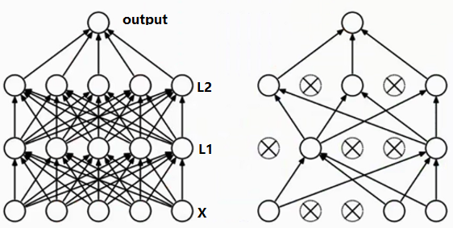

##人工神经网络（ANN，Artificial Neural Networks）

### 单层感知器

神经元是单层感知器，最简单的人工神经网络。其中元素主要包括输入节点、输出节点、权向量、偏置因子、激活函数、学习率。如下图所示，神经元的基本结构是不变的，唯一能改变的就是权向量和偏置因子，那么问题就变为求一组合适的权向量和偏自因子使得输出能够尽量符合学习集的要求。单层感知器中的激活函数为$f = sing(x)$符号函数。

**感知器学习算法流程**

1. 令$D=\{(\vec{x_i},y_i) | i=1,2,...,N\}$是训练集，其中$x_i$为第i行样本构成的向量；
2. 用随机值初始化权值向量$w^{(0)}$;
3. repeat
4.   for 每个训练样本$(\vec{x_i},y_i) \in D$ do
5. ​    计算预测值输出$\hat{y}_i^{(k)}$
6. ​    for 每个权值$w_j$ do
7. ​      更新权值$w_j^{(k+1)} = w_j^{(k)} + \lambda (y_i - \hat{y}_i^{(k)})x_{ij}$，其中$\lambda$为**学习率** 
8. ​    end for
9.   end fro 
10. until 满足终止条件

**收敛条件**

- 误差（实际输出与期望输出的差的绝对值）小于某个预定的较小的值；
- 两次迭代之间的权值变化已经很小；
- 设定最大迭代次数；
- **单层感知器只对线性可分问题收敛**；

**学习率的选择**：学习率太大会容易造成权值计算不稳定，造成震荡无法收敛；学习率太小不能充分体现对权值的修正，迭代次数很多。参考：**学习率逐渐下降算法**

**单层感知器的局限**：1. `单层感知器几何意义`就是分离平面，实际上就是一个线性判别器，所以对于线性不可分问题是没有办法求出精确解的，甚至求解都很难，**模型无泛化能力**。2. 结构简单，激活函数只能是符号函数；3. 只对线性可分问题收敛；4. 如果存在离群点会受到干扰，则需要花费较多训练时间。

**怎么训练偏置因子**

把权值因子也看成权重之一，对应的变量输入值恒为1，如下图所示

**性能评估函数**：平均绝对误差（MAE，误差的绝对值的平均值），均方误差（MSE，误差平方和的平均值），SSE（误差平方和）。

###学习规则

#### Hebb学习规则(无监督学习规则)

唐纳德·赫布（1904-1985）是加拿大著名生理心理学家。Hebb学习规则与“条件反射”机理一致，并且已经得到了神经细胞学说的证实。 巴甫洛夫的条件反射实验：每次给狗喂食前都先响铃，时间一长，狗就会将铃声和食物联系起来。以后如果响铃但是不给食物，狗也会流口水。 受该实验的启发，Hebb的理论认为在同一时间被激发的神经元间的联系会被强化。比如，铃声响时一个神经元被激发，在同一时间食物的出现会激发附近的另一个神经元，那么这两个神经元间的联系就会强化，从而记住这两个事物之间存在着联系。相反，如果两个神经元总是不能同步激发，那么它们间的联系将会越来越弱。 Hebb学习律可表示为：
$$
w_{ij}(t + 1) = w_{ij}(t) + \lambda \cdot y_i \cdot y_j
$$
其中$w_{ij}$表示神经元j到神经元i的连接权，$y_i$和$y_j$表示两个神经元的输出，$\lambda$表示学习率。如果$y_i$与$y_j$同时被激活(即两者同时为正)，那么$w_{ij}$将增大；如果$y_i$被激活而$y_j$除于抑制状态(即$y_i$为正$y_j$为负)，那么$w_{ij}$将变小。

Hebb学习规则是一个**无监督学习规则**，学习的结果是使网络能够提取训练集的统计特性，从而把输入信息按照它们的相似程度划分为若干类。这一点与人类观察和认识世界的过程非常吻合，人类观察和认识世界在相当程度上就是在根据事物的统计特征进行分类。Hebb学习规则只根据神经元连接间的激活水平改变权值，因此这种方法又称为相关学习或关联学习。

该学习规则对应的传统机器学习算法是主成分分析。可以说只有一种学习规则，神经网络的技术就会有一种进步，就可以得出与传统机器学习算法对应的一种新算法，甚至可能会超越已有的机器学习算法。

**Hebb学习规则范例**

http://blog.sina.com.cn/s/blog_68cceb610100t775.html

####Perceptron学习规则

https://blog.csdn.net/chunfengyanyulove/article/details/50277935

单层感知神经网络使用的学习规则

####Delta学习规则(有监督学习规则)

Delta学习规则是一种简单的有导师学习算法，该算法根据神经元的实际输出与期望输出差别来调整连接权，其数学表示如下：
$$
w_{ij}(t + 1) = w_{ij}(t) + \lambda \cdot (\hat{y}_i - y_i) \cdot x_j(t)
$$
其中其中$w_{ij}$表示神经元j到神经元i的连接权，$\hat{y}_i$为预测值，而$y_j$为实际观测值，$\lambda$表示学习率。若神经元j处于激活态则$x_j$为1，若处于抑制状态则$x_j$为0或-1（根据激活函数而定）。假设$x_i$为1，若$\hat{y}_i$比$y_i$大，那么$w_{ij}$将增大，若$\hat{y}_i$比$y_i$小，那么$w_{ij}$将变小。总之，若神经元实际输出比期望输出大，则减少输入为正的连接的权重，增大所有输入为负的连接的权重。反之，则增大所有输入为正的连接权的权重，减少所有输入为负的连接权的权重。

####LMS（Least Mean Square）学习规则

可以理解为Delta学习规则的特殊情况，Delta中的激活函数使用$pureline：y=x$就变为LMS学习规则，仅用于训练单层神经网络（多层经过转化单层时也可使用）

LMS也有类似多重共线性的情况，需要预先做一下变量筛选剔除这种现象。

https://blog.csdn.net/qq_32611933/article/details/52008538

####Outstar学习规则

https://blog.csdn.net/pmt123456/article/details/52541354

###人工神经网络建模

选择合适的神经网络类型，对权重赋予初始值，选择一定的学习规则对模型进行迭代训练，最终收敛到合适的权重，确定模型，然后在确定神经网络的拓扑、权向量、偏置因子后，就可以对模型进行泛化，即将模型写成一个程序或把模型用硬件芯片实现，最后就可以将模型应用到具体场景中。**神经网络的本质是一种通用的逼近器**，类似数据分析中的幂函数（泰勒）展开、傅里叶展开等，选择不同的激活函数就是选择在对函数展开时采用哪一种基函数。

##线性神经网络

与单层感知器结构类似，不同的是**增加支持$purelin: y=x$激活函数**，除了二值输出外还可以支持模拟输出，因此除了充当分类器还可以实现类似回归的效果。线性神经网络支持除了分类、回归外，使用多个输出/分离平面（Madaline网络）可以变相解决线性不可分问题，同时可以引入非线性成分（升维，类似SVM）一定程度上解决非线性问题。

线性神经网络采用**Delta学习规则**即梯度下降法的一般性学习规则，目标函数是**最小化平方误差（MSE）**，学习规则为权值变化量(Delta)正比于负梯度，比例系数为学习率。

##神经网络

什么是人工智能？感知+理解==>具有决策的能力。深度学习将神经网络的层次发展为很多层，而不仅限于三层。

> 学习的能力，才是智能的本质

大数据时代造就了人工智能的发展，使得机器有了学习的能力，进而推动的人工智能的发展。深度学习在90年代就已经出现了，那个时代计算能力太慢，为被人所熟知。2012年一位牛人使用卷积神经网络在[IMAGENET](www.image-net.org)上比赛分类图片得到效果要比机器学习高十几个百分点，至此以后卷积神经网络一炮打响。首先需要了解神经网络，然后再转向深度学习。

为什么人工智能的技术这么厉害？

将以前的机器学习算法进行改进，深度学习和机器学习有什么关系？机器学习领域是非常庞大的，在庞大的机器学习算法中有一类算法叫做神经网络，学者将神经网络进行了扩展和改进，使得神经网络变得扩大一些，加入更多的细节，利用这个扩大的神经网络能够让我们需要预测、分类的效果更好。下图是百度深度学习研究院的ppt，当数据规模小的时候，深度学习和传统人工智能算法差别不大，当数据规模增加时深度学习算法的效果就比传统人工智能算法要好。

###图像分类：计算机视觉核心任务

深度学习和计算机视觉关系密切，一张图像在计算机中被表示为三维组的形式，每个像素的值从0到255（值越大，表示该像素点越亮）。例如：300\*100\*3，其中300、100可以分别看成是高、宽，图像是有颜色通道的，彩色图有三种颜色通道RGB，因这个RGB通道就是第三个维度，即每一点像素是由三个通道的颜色叠加而形成的。

相同物体在不同角度、不同亮度、物体形态的改变、部分遮蔽、汇入等的情况下如何识别并检测出来

深度学习的步骤，与机器学习是一样的

1. 收集大量数据并给定标签；
2. 训练一个分类器；
3. 测试，评估

###K-近邻分类算法

如下图所示，根据K值不同得到不同的结果

- 如果K=3，绿色远点的最近的3个邻居是2个红色的小三角和1个蓝色的小正方形，少数服从多数，基于统计的方法，判定绿色的这个待分类点属于红色的三角形一类。
- 如果k=5，绿色圆点的最近的5个邻居是2个红色小三角和3个蓝色正方形，还是少数服从多数，基于统计的方法，哦安定绿色的这个待分类点属于蓝色的正方形一类。

**K-近邻算法描述**

1. 计算已知类别数据集中的点与当前未知类别属性数据集中的点的距离；
2. 按照距离依次排序；
3. 选取与当前点距离最小的K个点；
4. 确定前K个点所在类别的出现频率；
5. 返回前K个点出现频率最高的类别作为当前点预测分类；

KNN算法本身简单有效，它是一种lazy-learning算法，分类器不需要使用训练集进行训练，训练时间复杂度为0。KNN分类的计算复杂度和训练集中的文档数目成正比，即如果训练集中文档总数为N，那么KNN的分类时间复杂度为O(N)。

K值得选择，距离度量和分类决策规则是该算法的三个基本要素。

问题：该算法在分类时有个主要的不足是，当样本不平衡时，如一个类的样本容量很大，而其他类样本容量很小时，有可能导致当输入一个新样本上时，该样本的K个邻居中大容量样本占多数？解决办法是不同的样本给予不同权重。

数据集：CIFAR-10

**对于图像数据如何计算距离**
$$
L1 \ Distance：d_1(I_1, I_2) = \sum_p|I_1^p - I_2^p|
$$
这种方式计算距离时，我们也把背景考虑进来的，因此在使用K-近邻时，由于背景噪声的影响会导致结果不准确，因此使用K-近邻计算图片相似度的结果不会很好，是不能使用的，因此常用的方法是神经网络。

**超参数**

这里的距离参数在训练模型时是可以改变的，通过选择不同的距离公式得到不同的距离，称这些可变参数为超参数。如下使用两种方式计算距离
$$
L1（Manhattan）distance：d_1(I_1, I_2) = \sum_p|I_1^p - I_2^p| \\
L2（Euclidean）distance：d_2(I_1, I_2) = \sqrt{\sum_p(I_1^p - I_2^p)^2}
$$
问题：

1. 对于距离如何设定？
2. 对于K近邻的K该如何选择？
3. 如果有的话，其他的超参数该怎么设定呢？

错误的想法是将划分的训练集和测试集多次使用找到最佳参数，事实上测试集非常宝贵，只能在最终验证参数时使用。正确的方式是通过*交叉验证* 找到最优参数。如下图所示，首先将原始数据拆分为训练集和测试集，然后对训练集进行拆分将其中的一份作为验证集。例如：将训练集拆分成5份，其中fold5作为验证集用来调节模型的参数，其他4份作为训练集，则通过多次训练，第一次：<fold1,fold2,fold3,fold4>作为训练集，<fold5>作为验证集，第二次：<fold1,fold3,fold5,fold4>作为训练集，<fold2>作为验证集，第三次：<fold2,fold5,fold1,fold4>作为训练集，<fold3>作为验证集，...如此循环进行多次，用来找到最佳参数，交叉采用不同数据训练的原因是数据有可能不纯，存在有一块或几块数据可能有问题可能存在误差值、异常值导致训练结果偏高或偏低，而采用不同方式交叉训练，将不同训练得到的参数求平均可以消除偏高或偏低的情况，这样得到的模型就比较科学、平均化不至于产生极端效果。

###线性分类

如下图所示，这对给定的一张$32*32*3$的图片输入，要做一个分类任务，我们希望找到一组最优权重参数$W$能够输出针对输入在每个类别的得分值。

假设类别为10种，则$f(x,W)$的值应该为$10*1$的列向量，而对于给定的输入项将其拉伸为$3072*1$一维列向量，则如下图所示，则权重参数就为$10*3072$的矩阵，若存在截距项b，则b为$10*1$的列向量。由此构成得分函数$f(x,W)=Wx + b$ 

例如：将输入为$2*2$的图像拉伸为$4*1$的列向量$x$，得到的权重举证为$W$则得到每一个类别的得到。从图中可以看出在权重矩阵W中的值有大小、有正负，值越大说明对应像素点影响程度比较大，值越小则相应像素点的影响程度较小；而对于权重值为负，则说明对应的像素点的影响是消极的，而正值则表示对应像素点有积极作用。在得到一组得分值后，我们从中去除得分最大的那一类获胜，也就是最终的预测结果。

.png)

采用权重数据与输入数据进行组合，就相当于完成一个线性分类的工作，每一个类别就能画一条线出来，如下图所示，通过直线划分不同类别，就相当于找出决策边界，通过权重参数找出倾斜度，然后通过b找出截距值，最后就能够得出如下的划分区域。

###损失函数（得分函数）

上述得分函数得到的结果有可能是不对的，即预测结果是错的，因此模型需要做到知错能改，将错误给改正过来的能力。如下图所示，对于三个不同的输入图片，根据得分函数得到的结果如下。对于当前输入的得分结果，计算其属于正确类型得分值与其他所有错误类别得分值得差异情况，若错误分类得分比正确分类得分大，这个时候就是分类错误，这个就是损失值，加1意思是定义可容忍程度，例如当前决策模型下，最小容忍损失是1，则预测错误的误差要小于1才能没有损失。
$$
cat = max(0，5.1 - 3.2 + 1) + max(0，-1.7-3.2 + 1) = 2.9 +0 = 2.9 \quad \qquad \qquad\\
car = max(0， 1.3 - 4.9 + 1) + max(0，2.0 - 4.9 + 1) = 0 + 0 = 0 (\lt0认为没有损失) \\
gua = max(0， 2.2 - (-3.1) + 1) + max(0， 2.5 - (-3.1) +1) = 5.3 +5.6 = 10.9 \qquad
$$
损失函数能够判断模型的好坏，损失值越大，模型预测效果越差。

SVM损失函数
$$
L_i = \sum_{j \ne y_i} max(0,s_j - s_{y_i} + \delta)，其中\delta为可容忍程度
$$
score越大，则距离错误分类的值就越远，此时损失值就越小。

**损失函数**
$$
f(x,W) = Wx \\
L = \frac{1}{N}\sum_{i=1}^{N}\sum_{j \ne y_i} max(0，f(x_i；W)_j - f(x_i；W)_{y_i})
$$

例如：样本数据为$x=[1,1,1,1]$四个像素点，每个像素点均为1，有两个模型其权重参数分别为$w_1=[1,0,0,0]$，$w_2=[0.25,0.25,0.25,0.25]$，那么这两个模型与样本数据组合那个模型较好呢？
$$
L_1  = 1 \\
L_2  = 1\\
$$
使用两个权重参数不同模型，得到了相同的预测结果，都会使得最终的得分函数等于1，这就是说选择两者任意一个模型就行了是吗？仔细查看两个模型的权重参数可以看出，对于第一个模型，$w_1$只关注像素中的一个像素点，其他像素点等于任何值与结果没有任何关系；对于第二个模型，$w_2$权重分布均匀，综合考虑到每一个像素点。第二个模型考虑的是整体，而第一个模型只考虑的局部可能导致过拟合(在训练集上表达效果好，而对于测试数据表现不好)，当测试集中的该像素点值不好时预测结果也就差，因此我们希望使用第二个模型，分布稍显均匀。为此，我么需要在引入**正则化惩罚项**
$$
L = \frac{1}{N}\sum_{i=1}^{N}\sum_{j \ne y_i} max(0，f(x_i；W)_j - f(x_i；W)_{y_i}) +  \lambda R(W) \qquad 正则化
$$
正则化惩罚项用于惩罚权重参数的，例如对于两个权重参数$w_1=[1,0,0,0]$，$w_2=[0.25,0.25,0.25,0.25]$，假设惩罚项为$\lambda R(W)=\sum w_i^2$，则惩罚项的值分别为
$$
\lambda R(W_1) = \sum_i w_i^2 = 1 \\
\lambda R(W_2) = \sum_i w_i^2 = \frac{1}{4}
$$
则当损失函数得分值相同时，加上对应的权重惩罚项可以得到第二步模型的损失函数值较小。

**损失函数公式**
$$
L = \frac{1}{N}\sum_{i=1}^{N}\sum_{j \ne y_i} [ max(0，f(x_i；W)_j - f(x_i；W)_{y_i}+ \Delta) ] + \lambda \sum_k \sum_t W^2
$$
注意这里除以$\frac{1}{N}$表示去除样本个数的影响，样本个数对最终模型的好坏是没有影响的。

###Softmax分类器

损失函数得到是模型的得分值，得分值看起来比较麻烦，能不能对得到值进行转换，例如转换成概率值，这样我们就清楚知道某一数据其属于某一类别的概率是多少，看起来非常直观。为此，可以使用Softmax分类器。

**Sigmoid函数** $g(z)=\frac{1}{1+e^{-z}}$，可以将任意实数值映射到[0,1]范围，这样就能够根据得分值得到一个概率值。

Softmax的输出是*归一化的分类概率* ，
$$
f_j(z) = \frac{e^{z_j}}{\sum_k e^{zk}} \Leftarrow softmax函数，得分转化为概率值 \\
$$
 输入是一个向量，向量中元素为任意实数的评分值，输出一个向量，其中每个元素值在[0,1]之间且所有元素之和为1。

**交叉熵损失(Cross-Entropy Loss)**，通过Softmax得到的概率值不见得是100%，是会存在损失的，我们希望用一个损失函数来衡量概率值。我们需要拿*正确类别Softmax值计算损失值* ，例如上图中属于正确类别即cat类别的概率值为0.13，则若其等于正确类别的概率越低说明预测效果越差，其损失值就越大，因此符合log函数的性质，可以通过log函数计算损失值，并将负值转为正值，就可以得到对于当前预测结果的损失函数为
$$
L_i = - log(\frac{e^{f_{y_i}}}{\sum_j e^{f_i}}) \Leftarrow softmax损失函数，概率值的得分 \\
$$
***SVM损失函数与Softmax损失函数**

SVM损失函数值不好区分，而对于Softmax函数能够很好区分，一般不适用SVM损失函数。

###最优化

假设$s = f(x;W)$，例如$s = Wx$，则对应的损失函数有
$$
Softmax损失函数 \Rightarrow L_i = -log(\frac{s_{y_i}}{\sum_j e^{s_j}})  \ \  \ \qquad \\
SVM损失函数 \Rightarrow L_i = \sum_{j \ne y_i} max(0, s_j -s_{y_i} + 1) \\
Full损失函数 \Rightarrow L_i = \frac{1}{N}L_i + R(W) \quad \quad \quad\quad\quad \
$$
**前向传播：**从输入$x$到最终得到$loss$的过程，接下来需要通过**反向传播**优化权重参数。通过前向传播得到权重值及其好坏(损失值)，那么能不能使这些权重参数更好一些呢？即找到一组权重参数值，使得损失函数值越低越好，那么此时得到的权重参数值就是最优的。

对于每一个迭代求得的梯度，在更新下一次迭代的权重参数$w$时，通过学习率控制下一步得到的权重参数值，学习率过大可能会导致得到不最优解，来回无线迭代，学习率太小跳不出局部最优。通常学习率取值为$0.01,0.0001,...$，通常采取使*用小的学习率，高的迭代次数* 方式求解。有些图可以知道，好的学习率能够得到最低的损失函数值。1 epoch表示跑完所有训练数据得到的结果，不同于一次迭代。

###反向传播

如何有最终的loss值得到最优的权重值呢？通过反向传播实现。有数据得到损失值得过程为前向传播，而由于损失值沿着相反方向计算什么样的权重参数最优。最优化过程就是在反向传播中体现。

**范例**：损失函数$L=f(x,y,z)=(x+y)z$，样本点为$x=-2，y=5，z=-4$，则可以得到损失值为$L=-12$

得到损失值后，需要计算$x,y,z$分别对损失函数做了多大贡献，需要得到权重参数$w$与损失函数$L$的关系，得到最优权重参数使得损失函数值最小。
$$
q = x + y \qquad 
\frac{\partial q}{\partial x} = 1 \quad \frac{\partial q}{\partial y} = 1 \\
f=qz \qquad \frac{\partial f}{\partial z} = q \quad \frac{\partial f}{\partial q} = z\\
$$
计算x对损失函数的贡献

1. 算q对f的贡献，$\frac{\partial f}{\partial q} = z = -4$ ，含义是q上升1倍，会使得f值下降4倍，则q应越大越好；
2. 计算x对q的贡献，$\frac{\partial q}{\partial x} = 1$ 

通过反向传播中的**链式法则** 得到x对f的贡献为$1 * -4 = - 4$，同理可以计算y对f的贡献为$-4$，z对f的贡献为$3$ 。

**梯度传递的链式法则** 

**范例**：链式法则求解权值参数

简化反向传播计算，直接对sigmoid函数求导，得到的结果也是一样的

门单元简化计算

- 加法门单元：梯度均等分配
- MAX门单元：梯度传递为给最大的
- 乘法门单元：梯度互换

##神经网络架构

神经网络拓扑

- 层次性（前馈型），信息传递方向不变直到输出，输出层到输出层有连接的层次，层内有互连的层次性，例如BP就是前馈型神经网络；
- 互连型（反馈型），信息会从输出反馈给输入再进一步处理，例如HopField则是反馈型神经网络；

下图是典型神经网络结构，神经网络有许多层构成，中间层hidden layer（神经元）其实就是权重参数的计算结果。考虑得分函数为$Wx$,则通过神经网络计算后得到的得分结果就为$W_3[W_2(W_1 x)] = output$ ，神经网络中通过权重参数的组合计算最终的输出结果。在神经网络需要明确制定的参数就是$W_1，W_2，W_3$的shape值。

神经网络具有层次结构，其第二个特点就是非线性，若神经网络是采用线性函数就只能横着一刀竖着一刀切，存在局限性；而采用非线性结构。如下所示
$$
线性方程：f=Wx \\
非线性方程：f = W_2 \ max(0，W_1x)
$$
其中称任何在$W_1x$外添加的函数称为**激活函数**，这里max就是激活函数。什么是激活函数？考虑到线性操作分类能力不是很强，对于非线性的分类需要添加激活函数，例如$Simoid \ \sigma(x) = \frac{1}{1 + e^{-x}}$是[0,1]非线性的函数，每经过一次$Sig(Wx)$操作就是将结果压缩为非线性表达。这就是**为什么添加那么多隐层？**每一个隐藏层结果后都添加一个激活函数，就能够让神经网络以非线性分类方式得出强大结果。
$$
单层神经网络：f=W_2 \ max(0，W_1x) \\
双层神经网络：f= W_3 \ max(0，W_2 \ max(0，W_1x)) \\
$$
$Sigmoid$函数有没有什么缺点？在反向传播中计算$W_1，W_2，W_3，...W_n$对损失函数的贡献时，需要求导并进行梯度累乘操作，在$Sigmoid$函数中当$|x|$稍微大一点时的切线就是趋于水平了，再对其求一次梯度就会得到趋近于0值的贡献，这在后续的求计算梯度累乘过程中就会出现**梯度消失**，即梯度累乘值趋近于零，后续无法继续更新。因此$Sigmoid$函数在神经网络深度较深时无法进行反向传播，神经网络也无法收敛。

**ReLU激活函数**
$$
ReLU = max(0，x)
$$
能够解决梯度消失问题，同时求导比较简单，目前ReLU是首选的激活函数。神经元[^1]的个数越多效果越好，但是神经元越多导致的问题就是过拟合，神经网络最大的问题就是过拟合。下图是一个完整的单层神经网络

**神经网络中的过拟合解决方案**

神经网络难以解释的地方在于，每一步设置的权值参数$W_i$我们无法给你正确的解释，不知道为什么会设置成这个值。

**正则化项在神经网络中重要作用**，正则化项$\lambda \sum_i W_i^2$用于惩罚权重参数$W_i$，当正则化值较小的时候，例如$\lambda=0.001$此时图1的“爪子”中数据有很大可能是绿色点或异常点，过拟合现象很严重。当增大正则化惩罚项时，有部分点没有抓取，再次增大正则化惩罚项时，神经网络的结果更平稳了，意味着神经网络的泛化能力更强，神经网络泛化能力越强作用越大。

神经元越多，就越能够表达复杂的模型，但是过拟合的危险越大。为什么说神经元越多分类效果越好？神经元就是相当于权重参数，权重参数越多，相当于伸出来的线或“爪子”也越多。

**数据预处理**

**权重初始化** 

通常采用高斯初始化或随机初始化权重参数。例如。$W = 0.01 * np.radom.randn(D, H, shape)$。b的初始化，默认都是将$b=0或b=1$

###Drop_Out

左图中每一层与其他层进行的是全连接操作，当神经元个数很大时进行的计算量就非常大，同时更容易产生过拟合现象。在一次神经网络训练时，在前向传播和反向传播中随机忽略一些神经元进行计算。例如Drop_Out率为40%，表示每一次前向传播和反向传播计算时只保留60%的神经元，每一次计算使用的神经元的随机选择，这样能够降低过拟合的风险。

****

[^1]: [神经网络Demo](https://cs.stanford.edu/people/karpathy/convnetjs/demo/classify2d.html)

