#降维算法

##一、主成分分析(Principal Components Analysis)

Pearson于1901年提出，再由Hoteling于1933年加以发展的一种多变量统计方法。通过析取主成分显出最大的个别差异，也用来消减回归分析和聚类分析中变量的数目。

通过对原始变量进行线性组合，得到优化的指标，把原先多个指标的计算降维为少量几个经过优化指标的计算（占去绝大部分份额） 。**基本思想**设法将原先众多具有一定相关性的指标，重新组合为一组新的互相独立的综合指标，并代替原先的指标。如下图所示，在$x_1、x_2$坐标中，散点图分布如下，然后对原变量进行旋转缩放组成两个新的变量$F_1、F_2$，在新变量构成的坐标轴下，散点分布明显，沿轴$F_1$上变量有最大方差是需要保存的主成分，而沿$F_2$轴上方差比较小可以考虑忽略掉的主成分。

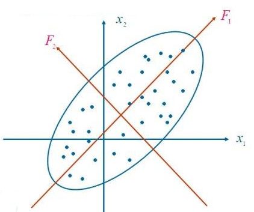

**主成分分析的数学模型**

主成分分析要解决的基本问题就是在n维空间找出一个方向，沿着这个方向样本数据的方差是最大的，得到这个坐标轴后，通过线性组合的方式将原来的变量旋转到这个轴上。

设X是p维随机变量，并假设总体均值$\mu=E(X)$为p维向量，总体协方差$\Sigma=Var(X)$为$p \times p $的矩阵，考虑如下线性变换
$$
\begin{cases}
Z_1 = a_1^TX \\
Z_2 = a_2^TX \\
... \\\
Z_p = a_p^TX \\
\end{cases}
$$
其中$Z_i$为变量，$a_i$为p为向量，上式的通式为$Z_i=a_i^TX = a_{i1}x_1 + ... a_{ip}x_p$，则可以得到
$$
Var(Z_i) = a_i^T \Sigma a_i，\quad i=1,2,...,p \\
Cov(Z_i, Z_j) = a_i^T \Sigma a_j，i.j=1,2,...,p，i \ne j
$$
我们希望$Z_i$方差的**方差最大化**，且$a_i$为**正交单位向量**，则问题转化为
$$
max \quad a^T \Sigma a \\
s.t. \qquad a^Ta = 1
$$
假设最大值为$\lambda$，则有$a^T \Sigma a = \lambda$，两边同时乘以$a$可以得到$\Sigma a = \lambda a$，则$\lambda$为矩阵$\Sigma$的特征向量。因此求主成分分析问题中的主成分就变成求协方差矩阵$\Sigma$的特征向量。因为协方差矩阵是半正定的，因此一定可以求出p个**正的特征值**。假设特征值为$\lambda_1 \ge \lambda_2 \ge...，\lambda_p \gt 0$，且对应的特征向量为$a_1，a_2，...，a_p$，其中$a_1$为最大特征值对应的特征向量则$Z_1=a_1^TX$为**第一主成分**，类似的$Z_2$为第二主成分，并且满足$Cov(Z_1,Z_2)=a_1^T \Sigma a_2=0$，对于协方差矩阵$\Sigma$，存在正交矩阵$Q$，将它化为对角阵：
$$
Q^T \Sigma Q = \left[ \begin{matrix}
\lambda_1 & & & \\
 & \lambda_2 & & \\
 & & ... & \\
 & & & \lambda_p
\end{matrix} \right]
$$
**主成分的性质**

1. 主成分的均值和协方差举证，记$Z= \left[  \begin{matrix}  Z_1 \\ Z_2  \\ ... \\ Z_p   \end{matrix}  \right]，v=E(Z)，\Lambda== \left[ \begin{matrix} \lambda_1 & & & \\ & \lambda_2 & & \\ & & ... & \\ & & & \lambda_p \end{matrix} \right]$，由于$Z=Q^TX$，所以有
   $$
   v = E(Z) = E(Q^TX)=Q^TE(X) = Q^T \mu \\
   Var(Z) = Q^Tvar(X)Q = Q^T \Sigma Q = \Lambda
   $$

2. 主成分的总方差，由于$tr(\Lambda)=tr(Q^T\Sigma Q)=tr(\Sigma Q Q^T) = tr(\Sigma)$，所以有$\sum_{i=1}^{p}Var(Z_i)=\sum_{i=1}^{p} Var(X_i)$或者表示为$\sum_{i=1}^{p}\lambda_i=\sum_{i=1}^{p}\sigma_{ii}$，其中$\sigma_{ii}$为协方差矩阵$\Sigma$的第i个对角元素，由此可以看出主成分分析把原p个原始变量$X_1,X_2,...,X_p$的总方差分解成了p个不相关变量$Z_1,Z_2,...,Z_p$的方差之和。

   **贡献率(Proportion of Variance)：** 总方差中第i主成分$Z_i$的比例$\frac{\lambda_i}{\sum_{i=1}^{p} \lambda_i}$，为主成分$Z_i$的贡献率，第一个主成分$Z_1$的贡献率最大，表明它解释原始变量$X_1,X_2,...,X_p$的能力越强。

   **累积贡献率(Cumulative Proportion)：**前m个主成分的贡献率之和$\frac{\sum_{i=1}^{m}\lambda_i}{\sum_{i=1}^{p} \lambda_i}$为主成分$Z_1,Z_2,...,Z_m$的累积贡献率，它表明主成分$Z_1,Z_2,...,Z_m$解释$X_1,X_2,...,X_p$的能力，通常取较小的m使得累积贡献率达到一定值(80%~90%)就可以用$Z_1,...,Z_m$来代替$X_1,X_2,...,X_p$达到降维的目的，而信息损失却不多。

3. 原始变量对主成分的影响，有$Z_i= a_{1i}X_1+ a_{2i}X_2 + ... a_{pi}X_p$中称$q_{ji}$为第i主成分在第j个原始变量$X_j$上的**载荷(loading)**，它度量了$X_j$对$Z_i$的重要程度。


主成分分析可以用于分类也可以用于回归，能够解决回归中多重共线性问题，在主成分分析过程中会自动解决多重共线性问题。**成分保留原则**：Kaiser与1960年主张将特征值小于1的成分放弃，只保留特征值大于1的成分。如果能用不超过3~5个成分就能解释变异的80%，就算成功。

**算法流程**

1. 对数据进行归一化处理;

2. 计算归一化后的数据集的协方差矩阵；

3. 计算协方差矩阵的特征值和特征向量；

4. 将特征值按照从大到小的顺序排序，选择其中最大的k个，然后将其对应的k个特征向量分别作为列向量组成特征向量矩阵；

5. 将样本点投影到选取的特征向量上。假设样例数为m，特征数为n，减去均值后的样本矩阵为$DataAdjust(m*n)$，协方差矩阵是$n*n$，选取的k个特征向量组成的矩阵为$EigenVectors(n*k)$。那么投影后的数据FinalData为
   $$
   FinalData(m * k) =  DataAdjust(m*n) \times EigenVectors(n * k)
   $$


##二、因子分析(Factor Analysis)

降维的一种方法，是主成分分析的推广和发展，是用于分析隐藏在表面现象背后的因子作用的统计模型。试图用最少个数的不可测的公共因子的线性函数与特殊因子之和来描述原来观测的每一分量。

**用途：**1. 减少分析变量个数 ；2. 通过对变量间相关关系的探测，将原始变量分组，即将相关性高的变量分为一组，用共性因子来代替该变量；3. 使问题背后的业务因素的意义更加清晰呈现。

**与主成分分析的区别：**

1. 主成分分析侧重“变异量”，通过转换原始变量为新的组合变量使到数据的“变异量”最大，从而能把样本个体之间的差异最大化，但得出来的主成分往往从业务场景的角度难以解释；
2. 因子分析更重视相关变量的“共变异量”，组合的是相关性较强的原始变量，目的是找到在背后起作用的少量关键因子，因子分析的结果往往更容易用业务知识去加以解释；


**数学模型**

设$X=(X_1,X_2,...,X_p)^T$是可观测的随机变量，且$E(X)=\mu=(\mu_1,\mu_2,...,\mu_p)^T，Var(X)=\Sigma=(\sigma_{ij})_{p\times p}$，因子分析的一般模型为
$$
\begin{cases}
X_1 - \mu_1 = a_{11}f_1 + a_{12}f_2 + ... + a_{1m}f_m + \epsilon_1 \\
X_2 - \mu_1 = a_{21}f_1 + a_{22}f_2 + ... + a_{2m}f_m + \epsilon_2 \\
...\\
X_p - \mu_1 = a_{p1}f_1 + a_{p2}f_2 + ... + a_{pm}f_m + \epsilon_p
\end{cases}
$$
其中$f_1,f_2,...,f_m$为公共因子，通常$m \ll p$，即将若干变量变为因子的线性组合，$\epsilon_i$为特殊因子，它们都是不可观测的随机变量。假设上述线性方程组的系数矩阵为$A=(a_{ij})_{p \times m}$称为**因子载荷矩阵**，则写成矩阵形式为
$$
方程组矩阵形式：X = \mu + AF + \epsilon \\
假设：E(F) = 0 \qquad Var(F) = I_m \\
E(\epsilon) = 0 \qquad Var(\epsilon) = D =diag(\sigma_1^2, ...,\sigma_p^2)，Cov(F, \epsilon)=0
$$
因子载荷矩阵的的统计意义
$$
Cov(X, F) = A 或 Cov(X_i, f_j) = a_{ij}
$$
因子载荷$a_{ij}$是第i个变量与第j个公共因子的相关系数，由于$X_i$是$f_1,f_2,...,f_m$的线性组合，所以系数$a_{i1},a_{i2},...,a_{im}$是用来度量$X_i$可由$f_1,f_2,...,f_m$线性组合表示的程度。


**求解模型的方法：**主因子法、主成分法、极大似然法


**因子旋转**


##二、范例：PCA应用

考虑如下数据集，在对其进行分类时无论怎么划分都无法将红色点和绿色点分开，这就说明当前的特征取得不是特别好，没有将数据分开。在哪提取特征时，需要什么样的特征的呢？

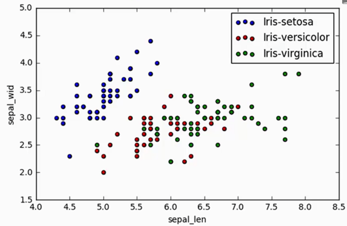

对于下图中的样本点，分别采用a线和b线对其进行划分，通过比较样本点在两条线上的分布差异情况(用方差衡量)，我们希望线能够使得点的分布差异大点，此时的数据特征它的效果就比较好一些。

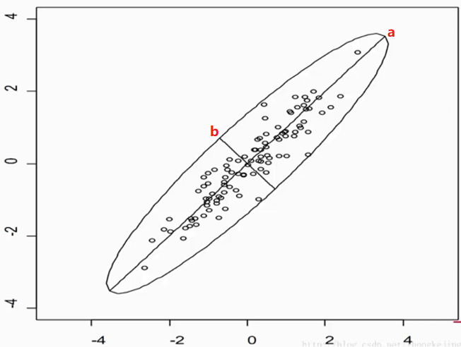

**PCA基本原理**

两个特征j与k的之间的协方差，即两个特征的相关程度(正相关、负相关、无关)
$$
\sigma_{jk} = \frac{1}{n-1} \sum_{i=1}^{n} (x_{ij} - \overline{x}_j)(x_{ik} - \overline{x}_k)
$$
协方差矩阵
$$
\Sigma = \frac{1}{n-1}((X - \overline{x})^T(X - \overline{x})) ，\quad \overline{x} = \frac{1}{n}\sum_{k=1}^{n}x_i
$$
测试数据集为iris，假设原始数据为$150*4$的数据，我们想对其进行维度压缩成$150*2$的数据，那么只需要将原始数据乘以$4*2$的矩阵就可以实现降维，那么应该如何得到这个$4*2$的矩阵呢？
$$
[150*4] \times [4*2] = [150*2]
$$
对于协方差举证，我们可以求其特征值和特征向量，每个特征向量为$4*1$的列向量，我们只需要拿出其中的两个特征向量就可以，那么应该拿哪两个特征向量呢？通过特征值来确定选取哪两个，特征值可以看做是当前向量的重要程度，这样只取出其中的两个特征值大对应的特征向量就行。

那么如何确定特征值得重要程度呢？首先对特征值进行归一化操作，然后将其变成百分数，通过查看比例确定那几个特征值重要。下图是归一化后，特征值的柱状图。

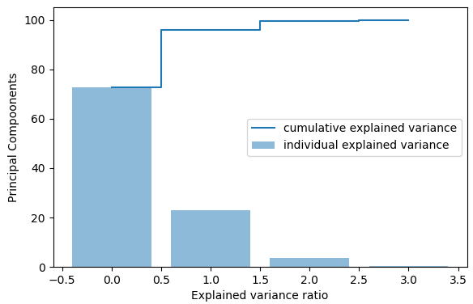

在对卷尾花数据进行降维后，在对其进行分类可以看到其效果会好一点，降维过程实现如下。

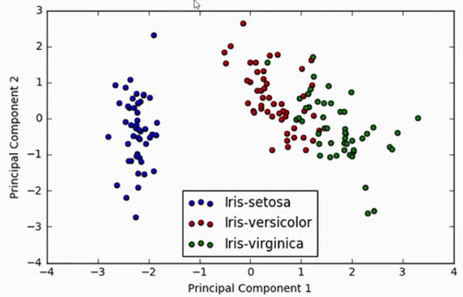

```python
import matplotlib.pyplot as plt
from sklearn.preprocessing import StandardScaler
import sklearn.datasets as datasets
import numpy as np

iris = datasets.load_iris()
X = iris.data 
# 对数据进行标准化，让样本值浮动在相同区间上
X_std = StandardScaler().fit_transform(X)

# 协方差矩阵
mean = np.mean(X, axis=0)
cov_matrix = np.cov(X_std.T)
# cov_matrix = (X_std - mean).T.dot((X_std - mean)) / (X_std.shape[0] - 1)

# 计算协方差矩阵的特征值、特征向量
eig_vals, eig_vecs = np.linalg.eig(cov_matrix)

sum_eig_vals = sum(eig_vals)
var_exp = [(i / sum_eig_vals)*100 for i in sorted(eig_vals, reverse=True)]
# [72.77045209380135, 23.030523267680632, 3.683831957627383, 0.5151926808906346]

#可视化查看特征向量的重要程度
cum_var_exp = np.cumsum(var_exp)
plt.figure(figsize=(6, 4))
plt.bar(range(4), var_exp, alpha=0.5, align='center', 
        label='individual explained variance')
plt.step(range(4), cum_var_exp, where='mid',
        label='cumulative explained variance')
plt.xlabel('Explained variance ratio')
plt.ylabel('Principal Compoonents')
plt.tight_layout()
plt.legend()
# plt.show()

# make a list of (eigenvalue, eigenvector) tuples
eig_pair = [(np.abs(eig_vals[i]), eig_vecs[:, i]) for i in range(len(eig_vals))]
# sort the eig_pair from high to low
eig_pair.sort(key= lambda x: x[0], reverse=True)
#获取最重要的两个特征值对应的特征向量
matrix_w = np.hstack((eig_pair[0][1].reshape(4, 1),
                      eig_pair[1][1].reshape(4, 1)))
```

```python
from sklearn.datasets import load_iris()
import matplotlib.pyplot as plt
from pandas  import Series, DataFrame
import numpy as np
import prince

iris = load_iris()
df =  DataFrame(iris.data)
df =  DataFrame(iris.data,  columns=iris.feature_names)
clz =  np.array(iris.target)
df['class'] = np.where(clz==0,'setosa',np.where(clz==1,'versicolor','virginica'))
pca = prince.PCA(df, n_components=3)
fig1,ax1 = pca.plot_rows(color_by='class',ellipse_fill=True)
fig2,ax2 = pca.plot_cumulative_inertia()
plt.show()
```

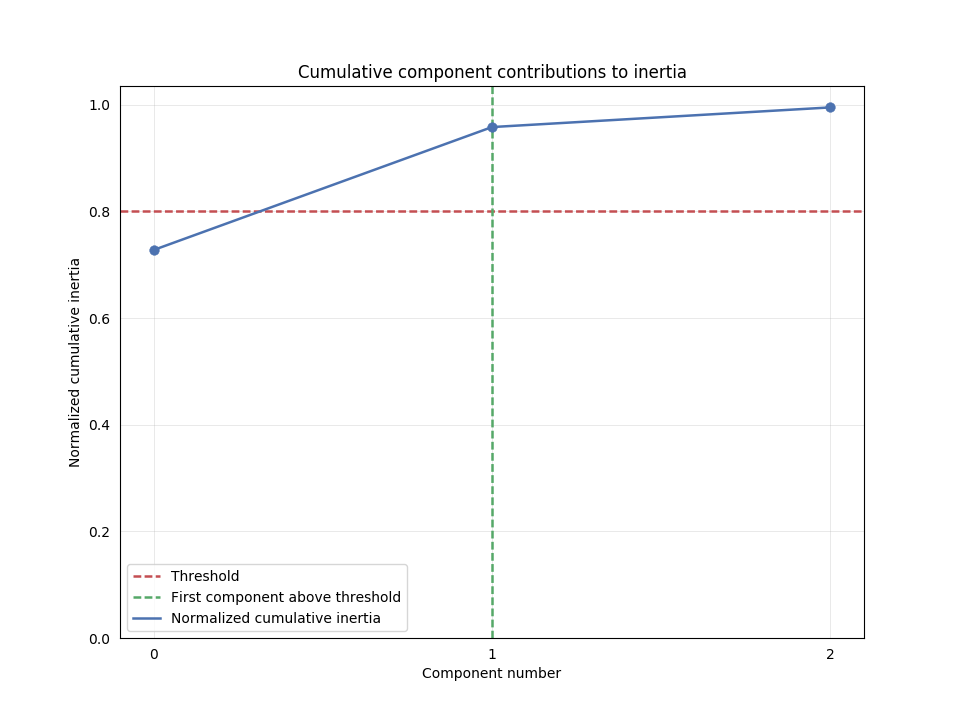

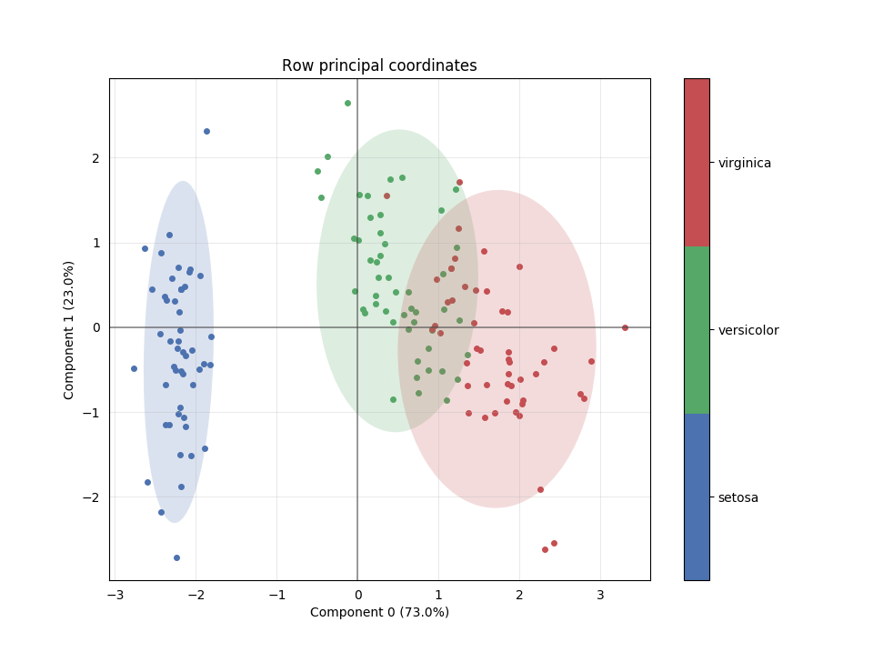


##二、奇异值分解（SVD，Singular Value Decomposition）及应用

奇异值分解可以看成是特征值问题的扩展，`针对非方阵` ,  设A为$M \times N$ 的矩阵，满足$A^HA、AA^H$ 分别是$N \times N$、$M \times M $的 Hermitian方阵，Hermitian方阵的特征值是`实数且是非负的`，并且在Hermitian方阵$A^HA、AA^H$中`最多有min(M, N)个相同的非零特征值` 。设这些非负特征值为$\sigma_{i}^2$ ，那么这些特征值开根号后的即为矩阵A的奇异值，矩阵$A^HA$ 的列特征向量构成了$N \times N$的unitary矩阵$V $ ，而矩阵$AA^H$ 的列特征向量构成的$M \times M$ 的unitary矩阵U，奇异值构成的$M \times N$对角矩阵$\Sigma$  ，则：
$$
A = U \Sigma V^H \\
 hermitian \  matrix \ D \ 满足 D^H = D \\
 unitary \ matrix \ D \ 满足 D^HD = I = DD^H \rightarrow D^{-1} = D^H
$$
就是A的一个奇异分解。每一个矩阵都存在一个奇异值分解。有时候奇异值称为矩阵的A的谱(spectrum)。`linalg.svd` 返回$U，\sigma_{i} 数组，V^H $ ，`linalg.diagsvd` 返回奇异值构成的对角矩阵$\Sigma$ `linalg.svdvals` 仅仅返回矩阵的奇异值。

```python
import numpy as np
from scipy import linalg
A = np.array([[1,2,3],[4,5,6]])
#array([[1, 2, 3],
#      [4, 5, 6]])

M,N = A.shape
U,s,Vh = linalg.svd(A)
Sig = linalg.diagsvd(s,M,N)

U, Vh = U, Vh
#array([[-0.3863177 , -0.92236578],
#      [-0.92236578,  0.3863177 ]])
#Sig
#array([[ 9.508032  ,  0.        ,  0.        ],
#      [ 0.        ,  0.77286964,  0.        ]])
#Vh
#array([[-0.42866713, -0.56630692, -0.7039467 ],
#      [ 0.80596391,  0.11238241, -0.58119908],
#      [ 0.40824829, -0.81649658,  0.40824829]])

U.dot(Sig.dot(Vh)) #check computation
#array([[ 1.,  2.,  3.],
#      [ 4.,  5.,  6.]])
```

**矩阵乘以向量相当于对向量做了线性变换**，如下图所示，将向量乘以矩阵$M=\left [ \begin{matrix}  1 & 1 \\ 0 & 1   \end{matrix} \right ]$，则其实是在平面上对一个轴进行的拉伸变换(如蓝色箭头所示)，在图中蓝色的箭头适应最**主要**的变化方向(变化方向可能有不止一个)，**如果我们想要描述好一个变换，那我们就描述好这个变换主要的变化方向就好了**。SVD分解的式子中，$\Sigma$矩阵是一个对角阵，里面的特征值是由大到小排列的，这些特征值所对应的特征向量就是描述这个矩阵变化方向（从主要变化到次要变化排列）。

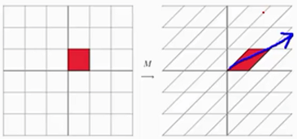

在机器学习中通常需要提取最重要的特征，那么可以根据SVD分解后特征值越大对应的的特征向量就越重要来得到重要特征，忽略哪些不是太重要的特征。因此对于一个原始数据$M*N$，我们希望提取其中最重要的R个特征的数据，则对原来的矩阵$A_{M,N}$可以变换为
$$
A_{m,n} \approx U_{M,R} \times \Sigma_{R,R} \times V_{R,N} 
$$
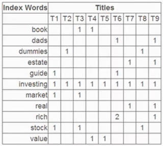

上图是一个单词与标题的频率矩阵，例如单词rich在标题6中出现了2次。通过SVD分解上述矩阵可以得到如下图所示的三个矩阵。首先，左奇异向量的第一列表示每一个词的出现频繁程度，虽然不是线性的，但是可以认为是一个大概的描述，比如book是0.15对应文档中出现的2次，investing是0.74对应了文档中出现的9次，rich是0.36对应文档中出现了3次。其次，右奇异向量中第一行表示每一篇文档中的出现词的个数的近似，比如T6是0.49出现了5个单词，T2是0.22出现了2个单词。

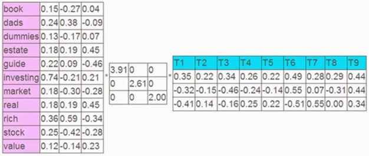

**SVD推荐系统应用实例**

假设我们有一个矩阵，矩阵每一列代表一个user，每一行代表一个物品。矩阵的值得含义是用户对某个物品的评分，若为0表示用户还没有买这个物品。

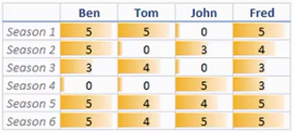

对上述$6*4$的矩阵进行SVD分解，我们希望只提取其中的两个特征

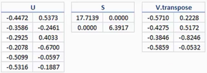

如下图所示，U矩阵是二维平面上的点，V.T也是二维平面上的点，为此我们将U、V映射到二维平面上，我们认为V矩阵呈现出来的是人之间的关系，U矩阵呈现出来物体之间的关系。如何查找两个问题的相似性的？从下图可以看出Ben和Fred两者比较接近，因此两者喜好程度相似；原数据对S5和S6好物体的打分相似，因此在图中可以看出两者比较接近。 可以得到什么样的人喜好比较近，什么样的物品喜好程度比较类似。

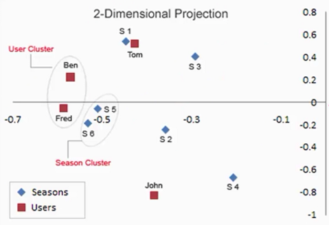

假设现有个名字叫Bob的新用户，并且已知这个用户对$season \ n$的评分向量为$[5,5,0,0,5]$的列向量，我们的任务是要对他做出个性化推荐。首先是利用新用户的评分向量找出该用户的相似用户。

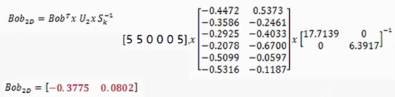

对于上述计算得到的点，将其映射到平面上可以看到Bob的位置，位置确定后就能够通过相似度算法计算得到什么人与Box的品味类似，什么物品Box比较喜欢，从而实现推荐的目的。

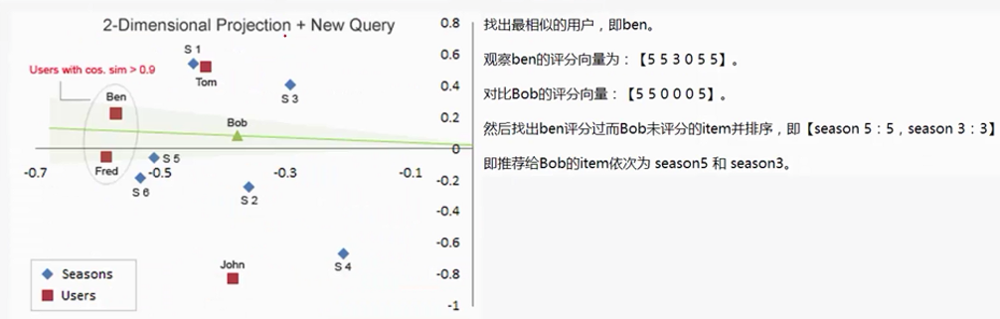


