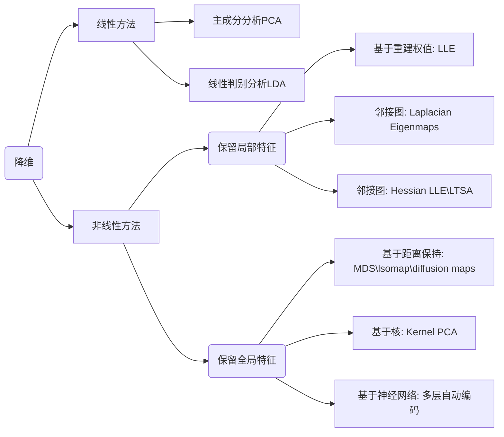
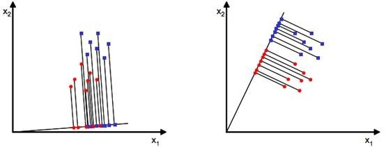
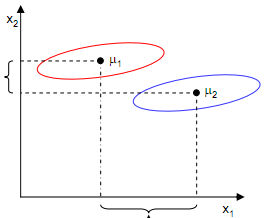
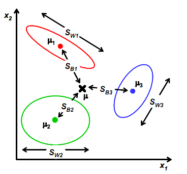
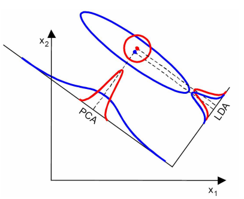

#第二章  降维算法




降维的目的是进行特征选择(Feature Selection)和特征提取(Feature Extraction)，两者的不同之处是特征选择是选择重要特征子集并删除其余特征，而特征提取是由原始特征形成较少的新特征。在特征提取方法中可以是监督算法也可以是非监督算法，PCA是非监督算法而LDA是监督算法，它们都是线性降维方法，此外，因子分析、多维 标定(MDS)也是非监督的线性降维方法。

降维的主要作用：1. 降低时间和空间复杂度；2. 节省提取不必要特征的开销；3. 去除数据集中的噪音；4. 较简单模型在小数据集上鲁棒性更强；5. 数据能够较少特征解释，能更好的解释数据，提取知识；6. 实现数据可视化。

 属性子集选择1通过删除不相关或冗余的属性（或维）减少数据量。属性子集选择的目标是找出最小属性集，使得数据类的概率分布尽可能地接近使用所有属性得到的原分布。在缩小的属性集上挖掘还有其他的优点：它减少了出现在发现模式上的属性数目，使得模式更易于理解。

##一、线性降维

###1.1、主成分分析(Principal Components Analysis)

####1.1.1 概念原理

Pearson于1901年提出，再由Hoteling于1933年加以发展的一种多变量统计方法。通过析取主成分显出最大的个别差异，也用来消减回归分析和聚类分析中变量的数目。

通过对原始变量进行线性组合，得到优化的指标，把原先多个指标的计算降维为少量几个经过优化指标的计算（占去绝大部分份额） 。**基本思想**设法将原先众多具有一定相关性的指标，通过线性变换重新组合为一组新的互相独立的综合指标，并代替原先的指标。如下图所示，在$x_1、x_2$坐标中，散点图分布如下，然后对原变量进行旋转缩放组成两个新的变量$F_1、F_2$，在新变量构成的坐标轴下，散点分布明显，沿轴$F_1$上变量有最大方差是需要保存的主成分，而沿$F_2$轴上方差比较小可以考虑忽略掉的主成分。


**主成分分析的数学模型之最大化方差理论**

主成分分析要解决的基本问题就是在n维空间找出一个方向，沿着这个方向样本数据的方差是最大的，得到这个坐标轴后，通过线性组合的方式将原来的变量旋转到这个轴上。

两个特征j与k的之间的协方差，即两个特征的相关程度(正相关、负相关、无关)
$$
\sigma_{jk} = \frac{1}{n-1} \sum_{i=1}^{n} (x_{ij} - \overline{x}_j)(x_{ik} - \overline{x}_k)
$$
协方差矩阵
$$
\Sigma = \frac{1}{n-1}((X - \overline{x})^T(X - \overline{x})) ，\quad \overline{x} = \frac{1}{n}\sum_{k=1}^{n}x_i
$$
设X是p维随机变量，并假设总体均值$\mu=E(X)$为p维向量，总体协方差$\Sigma=Var(X)$为$p \times p $的矩阵，考虑如下线性变换
$$
\begin{cases}
Z_1 = a_1^TX \\
Z_2 = a_2^TX \\
... \\\
Z_p = a_p^TX \\
\end{cases}
$$
其中$Z_i$为变量，$a_i$为p为向量，上式的通式为$Z_i=a_i^TX = a_{i1}x_1 + ... a_{ip}x_p$，则可以得到
$$
Var(Z_i) = a_i^T \Sigma a_i，\quad i=1,2,...,p \\
Cov(Z_i, Z_j) = a_i^T \Sigma a_j，i.j=1,2,...,p，i \ne j
$$
我们希望$Z_i$方差的**方差最大化**，且$a_i$为**正交单位向量**，则问题转化为
$$
max \quad a^T \Sigma a \\
s.t. \qquad a^Ta = 1
$$
假设最大值为$\lambda$，则有$a^T \Sigma a = \lambda$，两边同时乘以$a$可以得到$\Sigma a = \lambda a$，则$\lambda$为矩阵$\Sigma$的特征向量。因此求主成分分析问题中的主成分就变成求协方差矩阵$\Sigma$的特征向量。因为协方差矩阵是半正定的，因此一定可以求出p个**正的特征值**。假设特征值为$\lambda_1 \ge \lambda_2 \ge...，\lambda_p \gt 0$，且对应的特征向量为$a_1，a_2，...，a_p$，其中$a_1$为最大特征值对应的特征向量则$Z_1=a_1^TX$为**第一主成分**，类似的$Z_2$为第二主成分，并且满足$Cov(Z_1,Z_2)=a_1^T \Sigma a_2=0$，对于协方差矩阵$\Sigma$，存在正交矩阵$Q$，将它化为对角阵：
$$
Q^T \Sigma Q = \left[ \begin{matrix}
\lambda_1 & & & \\
 & \lambda_2 & & \\
 & & ... & \\
 & & & \lambda_p
\end{matrix} \right]
$$
**主成分的性质**

1. 主成分的均值和协方差举证，记$Z= \left[  \begin{matrix}  Z_1 \\ Z_2  \\ ... \\ Z_p   \end{matrix}  \right]，v=E(Z)，\Lambda== \left[ \begin{matrix} \lambda_1 & & & \\ & \lambda_2 & & \\ & & ... & \\ & & & \lambda_p \end{matrix} \right]$，由于$Z=Q^TX$，所以有
   $$
   v = E(Z) = E(Q^TX)=Q^TE(X) = Q^T \mu \\
   Var(Z) = Q^Tvar(X)Q = Q^T \Sigma Q = \Lambda
   $$

2. 主成分的总方差，由于$tr(\Lambda)=tr(Q^T\Sigma Q)=tr(\Sigma Q Q^T) = tr(\Sigma)$，所以有$\sum_{i=1}^{p}Var(Z_i)=\sum_{i=1}^{p} Var(X_i)$或者表示为$\sum_{i=1}^{p}\lambda_i=\sum_{i=1}^{p}\sigma_{ii}$，其中$\sigma_{ii}$为协方差矩阵$\Sigma$的第i个对角元素，由此可以看出主成分分析把原p个原始变量$X_1,X_2,...,X_p$的总方差分解成了p个不相关变量$Z_1,Z_2,...,Z_p$的方差之和。

   **贡献率(Proportion of Variance)：** 总方差中第i主成分$Z_i$的比例$\frac{\lambda_i}{\sum_{i=1}^{p} \lambda_i}$，为主成分$Z_i$的贡献率，第一个主成分$Z_1$的贡献率最大，表明它解释原始变量$X_1,X_2,...,X_p$的能力越强。

   **累积贡献率(Cumulative Proportion)：**前m个主成分的贡献率之和$\frac{\sum_{i=1}^{m}\lambda_i}{\sum_{i=1}^{p} \lambda_i}$为主成分$Z_1,Z_2,...,Z_m$的累积贡献率，它表明主成分$Z_1,Z_2,...,Z_m$解释$X_1,X_2,...,X_p$的能力，通常取较小的m使得累积贡献率达到一定值(80%~90%)就可以用$Z_1,...,Z_m$来代替$X_1,X_2,...,X_p$达到降维的目的，而信息损失却不多。

3. 原始变量对主成分的影响，有$Z_i= a_{1i}X_1+ a_{2i}X_2 + ... a_{pi}X_p$中称$q_{ji}$为第i主成分在第j个原始变量$X_j$上的**载荷(loading)**，它度量了$X_j$对$Z_i$的重要程度。


主成分分析可以用于分类也可以用于回归，能够解决回归中多重共线性问题，在主成分分析过程中会自动解决多重共线性问题。**成分保留原则**：Kaiser与1960年主张将特征值小于1的成分放弃，只保留特征值大于1的成分。如果能用不超过3~5个成分就能解释变异的80%，就算成功。

**算法流程**

1. 对数据进行归一化处理;

2. 计算归一化后的数据集的协方差矩阵；

3. 计算协方差矩阵的特征值和特征向量；

4. 将特征值按照从大到小的顺序排序，选择其中最大的k个，然后将其对应的k个特征向量分别作为列向量组成特征向量矩阵；

5. 将样本点投影到选取的特征向量上。假设样例数为m，特征数为n，减去均值后的样本矩阵为$DataAdjust(m*n)$，协方差矩阵是$n*n$，选取的k个特征向量组成的矩阵为$EigenVectors(n*k)$。那么投影后的数据FinalData为
   $$
   FinalData(m * k) =  DataAdjust(m*n) \times EigenVectors(n * k)
   $$


PCA的本质就是对角化协方差矩阵，*为什么将特征值按从大到小顺序排列后再选* ？对于一个$n*n$的对称矩阵分解得到特征值和特征向量，会产生n个n维正交基，每一个正交基对应一个特征值，把矩阵投影到n个正交基上，此时特征值的模就表示矩阵在该正交基上的投影长度。特征值越大，说明矩阵在对应的特征向量上的方差越大，样本点越离散，越容易区分，信息量也就越多。因此，特征值最大的对应的特征向量方向上所包含的信息量就越多，如果某几个特征值很小，那么就说明在该方向的信息量非常少，我们就可以删除小特征值对应方向的数据，只保留大特征值方向对应的数据，这样做以后数据量减小，但有用的信息量都保留下来了。

**PCA缺点：**

- 数据投影到k个正交坐标系中，丢失其他维度信息，例如将银河系投影到二维平面，则会丢失星星距离地球的远近信息；
- PCA是线性降维，对于数据关系存在非线性问题解决的不是很好，可以采用**Kernel PCA**解决；
- **PCA只在样本服从高斯分布的时候有效**；
- 难以解释结果，得到的新变量为原有变量的线性组合，无法给出合理的解释；
- PCA算法需要一次性把数据放入内存中计算，对于大数据问题无法适用，**Incremental PCA**实现增量式PCA；

####1.1.2 范例：PCA应用

考虑如下数据集，在对其进行分类时无论怎么划分都无法将红色点和绿色点分开，这就说明当前的特征取得不是特别好，没有将数据分开。在哪提取特征时，需要什么样的特征的呢？


对于下图中的样本点，分别采用a线和b线对其进行划分，通过比较样本点在两条线上的分布差异情况(用方差衡量)，我们希望线能够使得点的分布差异大点，此时的数据特征它的效果就比较好一些。


测试数据集为iris，假设原始数据为$150*4$的数据，我们想对其进行维度压缩成$150*2$的数据，那么只需要将原始数据乘以$4*2$的矩阵就可以实现降维，那么应该如何得到这个$4*2$的矩阵呢？
$$
[150*4] \times [4*2] = [150*2]
$$
对于协方差举证，我们可以求其特征值和特征向量，每个特征向量为$4*1$的列向量，我们只需要拿出其中的两个特征向量就可以，那么应该拿哪两个特征向量呢？通过特征值来确定选取哪两个，特征值可以看做是当前向量的重要程度，这样只取出其中的两个特征值大对应的特征向量就行。

那么如何确定特征值得重要程度呢？首先对特征值进行归一化操作，然后将其变成百分数，通过查看比例确定那几个特征值重要。下图是归一化后，特征值的柱状图。


在对卷尾花数据进行降维后，在对其进行分类可以看到其效果会好一点，降维过程实现如下。


```python
import matplotlib.pyplot as plt
from sklearn.preprocessing import StandardScaler
import sklearn.datasets as datasets
import numpy as np

iris = datasets.load_iris()
X = iris.data 
# 对数据进行标准化，让样本值浮动在相同区间上
X_std = StandardScaler().fit_transform(X)

# 协方差矩阵
mean = np.mean(X, axis=0)
cov_matrix = np.cov(X_std.T)
# cov_matrix = (X_std - mean).T.dot((X_std - mean)) / (X_std.shape[0] - 1)

# 计算协方差矩阵的特征值、特征向量
eig_vals, eig_vecs = np.linalg.eig(cov_matrix)

sum_eig_vals = sum(eig_vals)
var_exp = [(i / sum_eig_vals)*100 for i in sorted(eig_vals, reverse=True)]
# [72.77045209380135, 23.030523267680632, 3.683831957627383, 0.5151926808906346]

#可视化查看特征向量的重要程度
cum_var_exp = np.cumsum(var_exp)
plt.figure(figsize=(6, 4))
plt.bar(range(4), var_exp, alpha=0.5, align='center', 
        label='individual explained variance')
plt.step(range(4), cum_var_exp, where='mid',
        label='cumulative explained variance')
plt.xlabel('Explained variance ratio')
plt.ylabel('Principal Compoonents')
plt.tight_layout()
plt.legend()
# plt.show()

# make a list of (eigenvalue, eigenvector) tuples
eig_pair = [(np.abs(eig_vals[i]), eig_vecs[:, i]) for i in range(len(eig_vals))]
# sort the eig_pair from high to low
eig_pair.sort(key= lambda x: x[0], reverse=True)
#获取最重要的两个特征值对应的特征向量
matrix_w = np.hstack((eig_pair[0][1].reshape(4, 1),
                      eig_pair[1][1].reshape(4, 1)))
```

```python
from sklearn.datasets import load_iris()
import matplotlib.pyplot as plt
from pandas  import Series, DataFrame
import numpy as np
import prince

iris = load_iris()
df =  DataFrame(iris.data)
df =  DataFrame(iris.data,  columns=iris.feature_names)
clz =  np.array(iris.target)
df['class'] = np.where(clz==0,'setosa',np.where(clz==1,'versicolor','virginica'))
pca = prince.PCA(df, n_components=3)
fig1,ax1 = pca.plot_rows(color_by='class',ellipse_fill=True)
fig2,ax2 = pca.plot_cumulative_inertia()
plt.show()
```


###1.2 线性判别分析(Linear Discriminant Analysis）

####1.2.1 LDA原理(二分类)

LDA分类算法中的一种，通过对历史数据进行投影，以保证投影后同一类别的数据尽量靠近，不同类别的数据尽量分开，并生成线性判别模型对新生成的数据进行分离和预测。



在LDA中这个投影背景墙是一个新的Y轴，角度是向量W。那么应该如何确定直线的方向W呢？针对二分类问题， 首先找到每一类样本的均值$\mu_i，i=1,2$，将样本X投影到W上的样本点的均值为
$$
\widetilde{\mu_i}=\frac{1}{N_i}\sum_{y \in w_i}y=\frac{1}{N_i}\sum_{x \in w_i}w^Tx=w^T \mu_i
$$
由上式可知，投影后的均值就是样本中心点的投影。通过计算角度向量W确定一条直线，在这条直线上的投影的两类样本中心点能最大程度的分离，定量表示$J(w)=|\widetilde{\mu_1} - \widetilde{\mu_2}|=|w^T(\mu_1-\mu_2)|$为越大越好，但是仅仅考虑上述公式会有问题 ，如下图所示：



样本点均匀分布在椭圆里，投影到横轴x1上时能够获得更大的中心点间距J(w)，但是由于有重叠，x1不能分离样本点。投影到纵轴x2上，虽然J(w)较小，但是能够分离样本点。因此我们还需要考虑样本点之间的方差，**方差越大，样本点越难以分离**。为此引入另一个度量**散列值(Scatter)**对投影后的样本求散列值，公式为： 
$$
\widetilde{S}_i^2 =  \sum_{y \in w_i}(y - \widetilde{\mu_i})^2 =  \sum_{x  \in w_i }(w^Tx  - w^T \mu_i)^2 \\
=\sum_{x  \in w_i}w^T(x - \mu_i)(x - \mu_i)^Tw
$$
从公式中可以看出，散列值的几何意义是样本点的密集程度，值越大越分散，反之越集中。而我们想要的投影后的样本点的样子是：不同类别的样本点越分开越好，同类的越聚集越好，也就是均值差越大越好，散列值越小越好。正好，我们可以使用J(w)和S来度量，**计算最佳向量W的方法**是使用两类数据的平均值差的平方除以两类数据各自的方差之和。
$$
J(w) = \frac{|\widetilde{\mu}_1 - \widetilde{\mu}_2|^2}{\widetilde{S}_1^2 +  \widetilde{S}_2^2}
$$
在这个公式中，我们希望分母越小越好，分子越大越好。即两类数据的均值相差的越大越好，这样可以保证两类数据间的分离程度。而同一类数据的方差越小越好，这样可以保证每一类数据都不会太分散。这样我们就可以找出一个W使J(W)的值最大。

**求解目标函数$J(w)$**

1. 求解分子

$$
|\widetilde{\mu}_1 - \widetilde{\mu}_2|^2 =  (w^T\mu_1 -w^T\mu_2)^2 = w^T(\mu_1  - \mu_2)(\mu_1  - \mu_2)^Tw \\
\Downarrow 令S_B=(\mu_1  - \mu_2)(\mu_1  - \mu_2)^T\\
|\widetilde{\mu}_1 - \widetilde{\mu}_2|^2= w^TS_Bw \qquad  \qquad  \qquad  \qquad  \qquad
$$

​	其中$S_B$为**Between**-class scatter，是两个向量的外积，矩阵的秩为1。

2. 求解分母
   $$
   \widetilde{S}_1^2 + \widetilde{S}_2^2  = \sum_{x  \in w_1}w^T(x - \mu_1)(x - \mu_1)^Tw +  \sum_{x  \in w_2}w^T(x - \mu_2)(x - \mu_2)^Tw  \\
   令S_1 = \sum_{x  \in w_1}(x - \mu_1)(x - \mu_1)^T，S_12= \sum_{x  \in w_2}(x - \mu2)(x - \mu_2)^T\\
   \Downarrow \\
   \widetilde{S}_1^2 + \widetilde{S}_2^2  = w^T(S_1 + S_2)w = w^TS_ww
   $$
   其中$S_i$为各类样本对应的协方差矩阵称为散列矩阵（scatter matrices），$S_w$为**Within**-class scatter matrix，

3. 结合1,2可以得到
   $$
   J(w) = \frac{w^TS_Bw}{w^TS_ww}
   $$
   在求导前需要对分母进行归一化，因为不做归一的话，w扩大任何倍都成立就无法确定w，为此令$|w^TS_ww|=1$，结合拉格朗日乘子可以得到
   $$
   L(w) = w^TS_Bw - \lambda(w^TS_ww) \\
   \frac{\partial L}{\partial w} = 2S_Bw  -2\lambda S_ww \rightarrow S_Bw = \lambda S_ww
   $$
   若$S_w$可逆，则有$S_w^{-1}S_B  w = \lambda w $，这可以求得$w=S_w^{-1}S_B$，这就是**Fisher Linear Discrimination**。

   由$S_B=(\mu_1  - \mu_2)(\mu_1  - \mu_2)^T$可以得到$S_Bw=(\mu_1  - \mu_2)(\mu_1  - \mu_2)^Tw=(\mu_1  - \mu_2)*\lambda_w$代入上述等式可以得到$S_w^{-1}S_B w = S_w^{-1} (\mu_1  - \mu_2)* \lambda_w = \lambda w$，由于对w扩大缩小任何倍不影响结果，因此可以约去两边的未知常数$\lambda、\lambda_w$得到
   $$
   w=S_w^{-1}(\mu_1 - \mu_2)
   $$
   这样只需要求出原始样本的均值和方差就可以求出最佳的方向w，这就是Fisher于1936年提出的线性判别分析。


####1.2.2 基于LDA多分类

针对二分类问题可以将多维向量映射到一维空间解决，而针对多分类问题映射到一维空间肯定就无法解决了，假设有$C$个类别，需要使用$K$维向量(基向量)做投影，这K个基向量为$\vec{W}=[w_1,w_2,...,w_k]$，将样本在K维空间映射后的结果表示为$\vec{y}=[y_1,y_2,...,y_k]$，则有
$$
y_i = w_i^Tx \qquad \vec{y} = W^T x
$$
同样从类间散列度和类内度角度考虑，当样本是二维，考虑其几何意义，如下图所示，其中$S_{w1}$表示类别1中的样本点相对于该类样本中心点$\mu_1$的散列程度；$S_{B1}$为类别1中心点$\mu_1$相对于样本中心点$\mu$的协方差矩阵，即类 1相对于样本中心$\mu$的散列程度。 



**类内散列程度**
$$
S_w  =  \sum_{i=1}^{C} S_{wi} \qquad S_{wi}  =  \sum_{x \in wi} (x - \mu_i) (x - \mu_i)^T
$$
**类间散列程度**

对于多分类问题，需要度量每一类均值相对于样本均值的散列情况，类似于将$\mu_i$看做样本点而$\mu$作为均值的协方差矩阵，如果某类样本点较多，其权重就较大，权重用$\frac{N_i}{N}$表示，因为$J(w)$对倍数不敏感，因此用$N_i$表示，则有
$$
S_B = \sum_{i=1}^{C}N_i(\mu_i - \mu)(\mu_i - \mu)^T  \qquad \mu =\frac{1}{N} \sum_{\forall x}x=\frac{1}{N}\sum_{x \in wi}N_i \mu_i
$$
**样本点投影均值、类内散列和类间散列**
$$
\widetilde{\mu}_i = \frac{1}{N_i} \sum_{y \in wi}  y \qquad \widetilde{\mu}  =  \frac{1}{N} \sum_{\forall y} y \\

\widetilde{S}_{wi}  =  \sum_{i=1}^{C}   \sum_{x \in wi} (y - \widetilde{\mu}_i) (y - \widetilde{\mu}_i)^T \\
\widetilde{S}_{Bi} =\sum_{i=1}^{C}N_i(\widetilde{\mu}_i - \widetilde{\mu})(\widetilde{\mu}_i - \widetilde{\mu})^T
$$
综合各个投影向量$W$上的$\widetilde{S_{wi}}，\widetilde{S_{Bi}}$，可以得到
$$
\widetilde{S_w}  = W^T S_w  W \qquad \widetilde{S_B}  = W^T S_B W
$$
W是基向量矩阵，$\widetilde{S_w}$是投影后的各个类内部的散列矩阵之和，$\widetilde{S_B}$是投影后 各个类中心相对于全样本中心投用的散列矩阵之和。

**目标函数**

目标函数中分子是两类中心距，分母是每个类自己的散列度。投影方向是多维（好几条直线）时，分子不再是求两两样本中心距之和，而是求每类中心相对于全样本中心的散列度之和。于是，可以得到目标函数$J(W)$  
$$
J(W) = \frac{|\widetilde{S}_B|}{|\widetilde{S}_W|} = \frac{|W^TS_BW|}{|W^TS_wW|}
$$
因为分子分母都是散列矩阵，要将矩阵变为实数，需要取行列式，又因为行列式的值是矩阵特征值的积，一个特征值可以表示在该特征向量上的发散程度，因此采用上述形式。要求$J(W)$的最大值，同样固定分母为1，然后利用拉格朗日乘子求导最后得出同样结论 
$$
S_Bw_i = \lambda S_w w_i \qquad S_w^{-1}S_Bw_i = \lambda w_i
$$
因此问题转换为求矩阵的特征值，首先求出$S_w^{-1}S_B$的特征值，然后取出前K个特征值向量组成W矩阵即可。由于$S_B$中$(\mu_i-\mu)$的秩为1，因此 $S_B$的秩至多为C（矩阵的秩小于等于各个相加矩阵的秩之和）；由于知道前$C-1$个$\mu_i$后 ，最后一个$\mu_C$可以有前$C-1$个$\mu_i$表示 ，因此$S_B$的秩至多为$C-1$，则K最大为$C-1$，即特征向量最多有$C-1$个，特征值大对应的特征向量的分割效果更好 。

**LDA的限制**

1. 假设类别为C，则LDA至多可生成C-1维子空间 ，降维后的维度范围$[1,C-1]$，对于二分类只能投影到1维；

2. LDA不适合对非高斯样本进行降维；

3. LDA样本分类信息依赖均值，效果不是很好；

   


##二、非线性降维


###2.1 基于核方法的主成分分析(Kernel PCA)[^1]

支持向量机即支持线性分类，也支持非线性分类，其使用的主要技术是**核技巧(Kernel Trick)**，核技巧不仅应用于支持向量机，也可以用于其他统计学习问题中 。

####2.2.1核技巧

核技巧思想是将非线性问题变换为线性问题，通过解变换后的线性问题的方法求解原来的非线性问题。**核技巧**就是找到一个**核函数**对原问题的样本点进行非线性映射，以使得原来的非线性问题在新的空间中线性可分。

**核函数：**设$\chi$是输入空间(欧式空间$R^n$的子集)，$H$为特征空间属于高维空间甚至是无穷维的，如果存在一个从$\chi$到$H$的映射$\phi(x)：\chi \rightarrow H$，使得对所有$x,z \in  \chi$，函数$K(x,z)$满足条件$K(x,z)=\phi(x) \cdot \phi(z)$，则称$K(x,z)$为核函数，$\phi(x)$为映射函数，式子中$\phi(x) \cdot \phi(z)$为内积。

| 常用核函数            | 公式说明                                                     | 说明                                                         |
| --------------------- | ------------------------------------------------------------ | ------------------------------------------------------------ |
| Linear Kernel         | $K(x,y)=x^Ty$                                                | 多项式核的特殊形式                                           |
| Polynomial Kernel     | $K(x,y)=(\lambda x^t y + c_0)^d$                             | 其中d为kernel degress，表示同一维度或不同维度向量的相似性，可用于解释特征交互(Feature Interaction[^2]) |
| Sigmoid Kernel        | $K(x,y)=tanh(\lambda x^T y+c_0)$                             | $\lambda$为斜率，$c_0$为截距，双曲正切(Hyperbolic tangent)因为在神经网络中用作激活函数又称为多层感知器(Multilayer Percetron) |
| RBF Kernel            | $K(x,y)=exp(-\lambda ||x  - y||^2)$                          | 径向基函数，若$\lambda=-\sigma^{-2}$则变为高斯核函数         |
| Laplacian Kernel      | $K(x,y)=exp(-\lambda ||x  - y||_1)$                          | 其中$||x-y||_1$为向量的曼哈顿距离，被证明在**无噪音(Noiseless data)** |
| Chi-squared    Kernel | $K(x,y)=exp(-\lambda \sum_i \frac{(x[i]-y[i])^2}{x[i] + y[i]})$ | 在非线性SVM计算机视觉中应用效果很好，可以先对数据进行卡方核转换后再使用SVM训练。**核函数要求**数据是非负的且数据需要采用L1范数归一化[^3]。 |

```python
    from sklearn.metrics.pairwise import chi2_kernel
    from sklearn.svm import SVC

    X = [[0, 1], [1, 0], [.2, .8], [.7, .3]]
    y = [0, 1, 0, 1]
    K = chi2_kernel(X, gamma=.5)
    svm = SVC(kernel='precomputed').fit(K, y)
    pred = svm.predict(K)

    svm2 = SVC(kernel=chi2_kernel).fit(X, y)
    pred2 = svm2.predict(X)
```

####2.2.2 Kernel  PCA原理

KPCA能够挖掘到数据集中蕴含的非线性信息，是对PCA算法的非线性扩展。KPCA的**创新点**：1. 空间中的任一向量（包括基向量）都可以由该空间中的所有样本线性表示；2. 引入非线性映射函数，将原空间中的数据映射到高维空间。**使用核技巧的原因：**通过使用核技巧，可以在原始特征空间中计算两个高维特征空间中向量的相似度。**核函数就是**通过两个向量点积来度量向量间相似度的函数

中心化样本集合$X_{n \times d}$，其中n为样本数目，d为特征数，现使用核函数$\Phi(X)$将X映射到高维空间，**假设**映射后数据线性可分了，假设$D  (D \gg d)$维向量$w_i，i=1,2,...,d$为高维空间中的特征向量，对应的特征值为$\lambda_i，i=1,2,...,d$，那么利用PCA思想可以得到
$$
\Phi(X)\Phi(X)^T w_i =   \lambda_i w_i
$$
由定理可知，特征向量$w_i，i=1,2,...,d$可利用样本集合$\Phi(X)$线性表示$w_i=\sum_{k=1}^{n} \Phi(X_k)a_k= \Phi(X) \cdot \vec{a} $，将$w_i$代入上式可以得到
$$
\Phi(X)\Phi(X)^T \Phi(X) \cdot \vec{a} =   \lambda_i \Phi(X) \cdot \vec{a} \\
\Downarrow 左乘 \Phi(X)^T \\
\Phi(X)^T \Phi(X) \Phi(X)^T \Phi(X) \cdot \vec{a} =   \lambda_i \Phi(X)^T \Phi(X) \cdot \vec{a} \\
\Downarrow  \\
K^2 \cdot \vec{a} =   \lambda_i K\cdot \vec{a} \\
\Downarrow  \\
K \cdot \vec{a} =   \lambda_i  \vec{a} \\
$$
通过左乘$\Phi(X)^T$后就构造了核矩阵$K$（对称阵），然后两边同时除以核矩阵，就可以得到与PCA相似度极高的求解公式。**求解公式含义**是求核矩阵K最大的几个特征值对应的特征向量 ，由于K为对称矩阵，所得的解向量彼此之间一定的正交的。**需要注意的是**这里的$\vec{a}$是K的特征向量，但其不是高维空间中的特征向量，有上述公式可以知道 $w_i=\Phi(X) \cdot \vec{a} $。

**给定一个样本$x_{new}$如何对其进行降维呢？**既然已经得到高维空间的一组基$w_i，i=1,2,...,d$，那么这组基就可以构成高维空间中的一个子空间，我们的目的就是得到测试样本在这个子空间中的线性表示，也就是降维之后的向量。下面是对$x_{new}$进行降维得到向量$\hat{x}_{new}$：
$$
\hat{x}_{new} = w_i^T x_{new} = (\sum_{i=1}\Phi(x_i)a_i)^T  \Phi(x_{new}) \\
= (\Phi(X) \cdot \vec{a})^T \Phi(x_{new})
=\vec{a}^T \cdot \Phi(X)^T \Phi(x_{new}) \\
= [a_1，a_2，...，a_n][K(x_1，x_{new})，K(x_2，x_{new})，...，K(x_n，x_{new})]^T
$$
**KPCA算法流程**

1. 为了计算核（相似）矩阵K，需要计算任意两个样本之间的值；
   $$
   K  = 
   \left[ \begin{matrix} 
   k(x^{(1)}, x^{(1)}) & k(x^{(1)}, x^{(2)}) &  ... &  k(x^{(1)}, x^{(n)}) \\
   k(x^{(2)}, x^{(1)}) & k(x^{(2)}, x^{(2)})&  ... &  k(x^{(2)}, x^{(n)}) \\
   ... \\
   k(x^{(n)}, x^{(1)}) & k(x^{(n)}, x^{(2)}) &  ... &  k(x^{(n)}, x^{(n)}) \\
   \end{matrix}  \right]_{n \times n}
   $$

2. **中心化K矩阵(Center the K)**，对核矩阵进行聚集处理，使核矩阵k更为聚集；
   $$
   K' =  K - C_{n \times n} K - KC_{n \times n} + C_{n \times n} KC_{n \times n}
   $$
   其中$C_{n \times n}=(c)_{ij}  = \frac{1}{n}$的矩阵，对$K′$ 进行特征值分解，获得对应于前 k个特征值的特征向量。**与标准PCA算法不同的是，这里获得特征向量不再是 $principal \ component \  axes$，而已经是全部样本在这些轴上的投影了，也即是我们所需的进行降维后的数据了**。

3. 将聚集后的核矩阵的特征值按照降序排列，选择前k个特征值所对应的特征向量，这里的向量不是主成分轴，而是将样本映射到这些轴上；

通过对比PCA和KPCA可知，1. PCA只是对原始数据做了旋转，因为其寻找的是数据的“主要分布方向”，而由KPCA原理可知KPCA能够将原始数据投影至线性可分；2. 针对部分重叠非线性可分数据KPCA不能将其映射到完全线性可分的程度；3. 在使用多项式核函数时，往往kernel degree为偶数时数据可以近似做到线性可分，当kernel degree为奇数时数据往往不再线性可分。

```python
from scipy.spatial.distance import pdist, squareform
from scipy.linalg import eigh
import numpy as np
import scipy

def rbf_kernel(X, gamma=1):
    sq_dist = pdist(X, 'sqeuclidean')
    mat_sq_dist = squareform(sq_dist)
    K = scipy.exp(-gamma * mat_sq_dist)
    return K

def kpca(X, kernel, n_components, gamma=1):

    # 样本数
    m = np.array(X).shape[0]
    # 样本维度
    n = np.array(X).shape[1]

    # 计算核矩阵
    K = kernel(X, gamma)
    # 中心化核矩阵
    C = np.ones((m, m)) / m
    K = K - C.dot(K) -  K.dot(C) + C.dot(K).dot(C)

    # 返回特征值，和特征向量
    eigvals, eigvecs  = eigh(K)
    # 返回前K个特征向量构成的矩阵
    target_eigvecs = eigvecs[:, -1:-(n_components+1):-1]
    # 调整特征值从大到小
    target_eigvals = eigvals[-1:-(n_components+1):-1]
    return target_eigvals, target_eigvecs
```

###2.2 局部线性嵌入（Locally Linear Embedding，LLE）

####2.2.1 概念原理


**局部线性嵌入算法流程**

LLE算法主要分为三步，第一步求K近邻过成功，第二步对每个样本求它在邻域里的K个近邻的线性关系，得到线性关系权重系数W，第三步利用权重系数在低维里重构样本数据，得到降维后的数据。具体过程如下：

**输入：**样本集$D=\{x_1,x_2,...,x_m\}$，最近邻数k，降维到d

**输出：**低维样本集矩阵$D'$

1. $for \ i=1 \ to \ m$，以欧氏距离为度量，计算和$x_i$最近的k个最近邻$(x_{i1},x_{i2},...,x_{ik})$；

2. $for \ i=1 \ to \ m$，求出局部协方差矩阵$Z_i=(x_i-x_j)^T(x_i-x_j)$，并求出对应的权重向量
   $$
   W_i=\frac{Z_i^{-1} 1_k}{1_k^TZ_i^{-1}1_k}，其中1_k为全1的矩阵
   $$
   ​

3. 由权重系数向量$W_i$组成权重系数矩阵$W$，计算矩阵$M=(I - W)^T(I - W)$；

4. 计算矩阵M的前$d+1$个特征值并计算则$d+1$个特征值对应的特征向量$\{y_1,y_2,...,y_{d+1}\}$；

5. 由第二个特征向量到第$d+1$个特征向量所张成的矩阵即为输出低维样本集矩阵$D'=(y_2,y_3,...,y_{d+1})$；


##、因子分析(Factor Analysis)

降维的一种方法，是主成分分析的推广和发展，是用于分析隐藏在表面现象背后的因子作用的统计模型。试图用最少个数的不可测的公共因子的线性函数与特殊因子之和来描述原来观测的每一分量。例如，一个学生的英语、数据、语文成绩都很好，那么潜在的共性因子可能是智力水平高。因此，因子分析的过程其实是寻找共性因子和个性因子并得到最优解释的过程。

**用途：**1. 减少分析变量个数 ；2. 通过对变量间相关关系的探测，将原始变量分组，即将相关性高的变量分为一组，用共性因子来代替该变量；3. 使问题背后的业务因素的意义更加清晰呈现。

**与主成分分析的区别：**

1. 主成分分析侧重“变异量”，通过转换原始变量为新的组合变量使到数据的“变异量”最大，从而能把样本个体之间的差异最大化，但得出来的主成分往往从业务场景的角度难以解释；
2. 因子分析更重视相关变量的“共变异量”，组合的是相关性较强的原始变量，目的是找到在背后起作用的少量关键因子，因子分析的结果往往更容易用业务知识去加以解释；


**数学模型**

设$X=(X_1,X_2,...,X_p)^T$是可观测的随机变量，且$E(X)=\mu=(\mu_1,\mu_2,...,\mu_p)^T，Var(X)=\Sigma=(\sigma_{ij})_{p\times p}$，因子分析的一般模型为
$$
\begin{cases}
X_1 - \mu_1 = a_{11}f_1 + a_{12}f_2 + ... + a_{1m}f_m + \epsilon_1 \\
X_2 - \mu_1 = a_{21}f_1 + a_{22}f_2 + ... + a_{2m}f_m + \epsilon_2 \\
...\\
X_p - \mu_1 = a_{p1}f_1 + a_{p2}f_2 + ... + a_{pm}f_m + \epsilon_p
\end{cases}
$$
其中$f_1,f_2,...,f_m$为公共因子，通常$m \ll p$，即将若干变量变为因子的线性组合，$\epsilon_i$为特殊因子，它们都是不可观测的随机变量。假设上述线性方程组的系数矩阵为$A=(a_{ij})_{p \times m}$称为**因子载荷矩阵**，则写成矩阵形式为
$$
方程组矩阵形式：X = \mu + AF + \epsilon \\
假设：E(F) = 0 \qquad Var(F) = I_m \\
E(\epsilon) = 0 \qquad Var(\epsilon) = D =diag(\sigma_1^2, ...,\sigma_p^2)，Cov(F, \epsilon)=0
$$
因子载荷矩阵的的统计意义
$$
Cov(X, F) = A 或 Cov(X_i, f_j) = a_{ij}
$$
因子载荷$a_{ij}$是第i个变量与第j个公共因子的相关系数，由于$X_i$是$f_1,f_2,...,f_m$的线性组合，所以系数$a_{i1},a_{i2},...,a_{im}$是用来度量$X_i$可由$f_1,f_2,...,f_m$线性组合表示的程度，因子载荷绝对值越大，$X_i$和$F_j$的关系越强。

1. **变量共同度（Communality）**也称公共方差，$X_i$变量共同度为因子载荷矩阵A中第i行元素的平方和，则有$h_i^2=\sum_{j=1}^{m}a_{ij}^2$，可以看出$X_i$变量共同度反映了全部因子变量对$X_i$总方差的解释能力。
2. **因子变量$F_j$的方差贡献**为因子载荷矩阵A中第j列元素的平方和，则有$S_j=\sum_{i=1}^{p}a_{ij}^2$，可见因子变量$F_j$的方差贡献体现了同一因子$F_j$对 原始所有变量总方差的解释能力，$\frac{S_j}{p}$表示第j个因子解释原所有变量总方差的比例。
3. **原有变量是否适合做因子分析？**计算原有变量的相关系数矩阵，一般小于0.3就不适合作因子分析�S

**主成分法求解模型**
$$
\begin{cases}
y1 = \mu_{11}x_1 + \mu_{12}x_2 + ... + \mu_{1m}x_m \\
y_2  = \mu_{21}x_1 + \mu_{22}x_2 + ... + \mu_{2m}x_m \\
...\\
y_p = \mu_{p1}x_1 + \mu_{p2}x_2 + ... + \mu_{pm}x_m
\end{cases}，其中满足 \mu_{i1} + \mu_{i2} + ... + \mu_{im}=1，i=1,2,...,p
$$
系数$\mu_{ij}$依照两个原则确定：1. $y_i与y_j(i \ne j；i,j= 1,2,...,p)$互不相关；2. $y_1$是$x_1,x_2,...,x_p$线性组合中方差最大的，$y_2$是与$y_1$不相关的$x_1,x_2,...,x_p$线性组合中方差次大的，依次类推，$y_p$是与$y_1,y_2,...,y_{p-1}$都不相关的$x_1,x_2,...,x_p$线性组合中方差最小的。`采用主成分求解上述模型的步骤为`

1. 对数据进行归一化处理;
2. 计算归一化后的数据集的协方差矩阵；
3. 计算协方差矩阵的特征值$\lambda_1 \ge \lambda_2 \ge ... \ge \lambda_p \ge 0$和特征向量$\mu_1,\mu_2,...,\mu_p$；
4. 得到$y_i=\mu_{1i}x_i + \mu_{2i}x_2 +  ... + \mu_{pi}x_p$

`确定因子载荷`
$$
A  = 
\left[  \begin{matrix}
a_{11} & a_{12} & ... & a_{1p}  \\
a_{21} & a_{22} & ... & a_{2p}  \\
... \\
a_{p1} & a_{p2} & ... & a_{pp}  \\
\end{matrix}  \right ]
=
\left[  \begin{matrix}
\mu_{11} \sqrt{\lambda_1} & \mu_{12} \sqrt{\lambda_2}& ... & \mu_{1p}\sqrt{\lambda_p}  \\
\mu_{21}\sqrt{\lambda_1} & \mu_{22}\sqrt{\lambda_2} & ... & \mu_{2p} \sqrt{\lambda_p} \\
... \\
\mu_{p1} \sqrt{\lambda_1}& \mu_{p2} \sqrt{\lambda_2}& ... & \mu_{pp} \sqrt{\lambda_p} \\
\end{matrix}  \right ]
$$
`确定因子变量个数`

1. 根据特征值$\lambda_i$确定：取特征值大于1的特征根；

2. 根据累计贡献率：一般累计贡献率应在70%以上；
   $$
   a_1=\frac{S_1^2}{p} = \frac{\lambda_1}{\sum_{i=1}^{p}\lambda_i}，a_2=\frac{S_1^2 + S_2^2}{p} = \frac{\lambda_1 + \lambda_2}{\sum_{i=1}^{p}\lambda_i}，... ，a_i  = \frac{\sum_{i=1}^{p}S_i^2}{p} = \frac{\sum_{i=1}^{k}\lambda_i}{\sum_{i=1}^{p}\lambda_i}
   $$


**因子分析算法流程**

因子分析有两个核心问题：一是如何构造因子变量，二是如何对因子变量进行命名解释。因子分析有下面4个基本步骤：

1.  确定原有若干变量是否适合于因子分析，因子分析的基本逻辑是从原始变量中构造出少数几个具有代表意义的因子变量，这就要求原有变量之间要具有比较强的相关性，否则，因子分析将无法提取变量间的“共性特征”。实际应用时，可以使用相关性矩阵进行验证，如果相关系数小于0.3，那么变量间的共性较小，不适合使用因子分析。
2.  构造因子变量，因子分析中有多种确定因子变量的方法，如基于主成分模型的主成分分析法和基于因子分析模型的主轴因子法、极大似然法、最小二乘法等。其中基于主成分模型的主成分分析法是使用最多的因子分析方法之一。选取原则：（1）根据特征值λi确定：取特征值大于1的特征根；（2）根据累计贡献率：一般累计贡献率应在70%以上；

3. 利用旋转使得因子变量更具有可解释性。在实际分析工作中，主要是因子分析得到因子和原变量的关系，从而对新的因子能够进行命名和解释，否则其不具有可解释性的前提下对比PCA就没有明显的可解释价值。
4. 计算因子变量的得分，因子变量确定以后，对每一样本数据，希望得到它们在不同因子上的具体数据值，这些数值就是因子得分，它和原变量的得分相对应。

**因子旋转**

因子旋转又称为正交变换，建立因子分析的目的不仅是找出公共因子以及对变量分组，更重要的是知道每个公共因子的含义。由于因子载荷矩阵是不唯一的，所以应该对因子载荷矩阵进行旋转。目的是使因子载荷矩阵的结构简化，使载荷矩阵每列或者每行的元素平方值向 0 或者 1 两级分化。其方法有4 种：最大方差、直接 Oblimin、最大四次方值、最大平衡值或最优斜交。

1. **最大方差法 (Varimax Method)**，一种正交旋转方法，它使得对每个因子有高负载的变量的数目达到最小，该方法简化了因子的解释。
2. **直接 Oblimin 方法**，一种斜交（非正交）旋转方法。当 delta 等于 0（缺省值）时，解是最斜交的。delta 负得越厉害，因子的斜交度越低。要覆盖缺省的 delta 值 0，请输入小于等于 0.8 的数。
3. **最大四次方值法 (Quartimax Method)**， 一种旋转方法，它可使得解释每个变量所需的因子最少。该方法简化了观察到的变量的解释。
4. **最大平衡值法 (Equamax Method)**， 一种旋转方法，它是简化因子的最大方差法与简化变量的最大四次方值法的组合。它可以使得高度依赖因子的变量的个数以及解释变量所需的因子的个数最少。
5. **最优斜交旋转 (Promax Rotation)**，斜交旋转，可使因子相关联。该旋转可比直接最小斜交旋转更快地计算出来，因此适用于大型数据集。

旋转解 (Rotated Solution). 必须选择旋转方法才能获得旋转解。对于正交旋转，会显示已旋转的模式矩阵和因子转换矩阵。对于斜交旋转，会显示模式、结构和因子相关性矩阵。

载荷图 (Factor Loading Plot). 前三个因子的三维因子载荷图。对于双因子解，那么显示二维图。如果只抽取了一个因子，那么不显示图。如果要求旋转，那么图会显示旋转解。


##、奇异值分解（SVD，Singular Value Decomposition）及应用

奇异值分解可以看成是特征值问题的扩展，`针对非方阵` ,  设A为$M \times N$ 的矩阵，满足$A^HA、AA^H$ 分别是$N \times N$、$M \times M $的 Hermitian方阵，Hermitian方阵的特征值是`实数且是非负的`，并且在Hermitian方阵$A^HA、AA^H$中`最多有min(M, N)个相同的非零特征值` 。设这些非负特征值为$\sigma_{i}^2$ ，那么这些特征值开根号后的即为矩阵A的奇异值，矩阵$A^HA$ 的列特征向量构成了$N \times N$的unitary矩阵$V $ ，而矩阵$AA^H$ 的列特征向量构成的$M \times M$ 的unitary矩阵U，奇异值构成的$M \times N$对角矩阵$\Sigma$  ，则：
$$
A = U \Sigma V^H \\
 hermitian \  matrix \ D \ 满足 D^H = D \\
 unitary \ matrix \ D \ 满足 D^HD = I = DD^H \rightarrow D^{-1} = D^H
$$
就是A的一个奇异分解。每一个矩阵都存在一个奇异值分解。有时候奇异值称为矩阵的A的谱(spectrum)。`linalg.svd` 返回$U，\sigma_{i} 数组，V^H $ ，`linalg.diagsvd` 返回奇异值构成的对角矩阵$\Sigma$ `linalg.svdvals` 仅仅返回矩阵的奇异值。

```python
import numpy as np
from scipy import linalg
A = np.array([[1,2,3],[4,5,6]])
#array([[1, 2, 3],
#      [4, 5, 6]])

M,N = A.shape
U,s,Vh = linalg.svd(A)
Sig = linalg.diagsvd(s,M,N)

U, Vh = U, Vh
#array([[-0.3863177 , -0.92236578],
#      [-0.92236578,  0.3863177 ]])
#Sig
#array([[ 9.508032  ,  0.        ,  0.        ],
#      [ 0.        ,  0.77286964,  0.        ]])
#Vh
#array([[-0.42866713, -0.56630692, -0.7039467 ],
#      [ 0.80596391,  0.11238241, -0.58119908],
#      [ 0.40824829, -0.81649658,  0.40824829]])

U.dot(Sig.dot(Vh)) #check computation
#array([[ 1.,  2.,  3.],
#      [ 4.,  5.,  6.]])
```

**矩阵乘以向量相当于对向量做了线性变换**，如下图所示，将向量乘以矩阵$M=\left [ \begin{matrix}  1 & 1 \\ 0 & 1   \end{matrix} \right ]$，则其实是在平面上对一个轴进行的拉伸变换(如蓝色箭头所示)，在图中蓝色的箭头适应最**主要**的变化方向(变化方向可能有不止一个)，**如果我们想要描述好一个变换，那我们就描述好这个变换主要的变化方向就好了**。SVD分解的式子中，$\Sigma$矩阵是一个对角阵，里面的特征值是由大到小排列的，这些特征值所对应的特征向量就是描述这个矩阵变化方向（从主要变化到次要变化排列）。


在机器学习中通常需要提取最重要的特征，那么可以根据SVD分解后特征值越大对应的的特征向量就越重要来得到重要特征，忽略哪些不是太重要的特征。因此对于一个原始数据$M*N$，我们希望提取其中最重要的R个特征的数据，则对原来的矩阵$A_{M,N}$可以变换为
$$
A_{m,n} \approx U_{M,R} \times \Sigma_{R,R} \times V_{R,N} 
$$


上图是一个单词与标题的频率矩阵，例如单词rich在标题6中出现了2次。通过SVD分解上述矩阵可以得到如下图所示的三个矩阵。首先，左奇异向量的第一列表示每一个词的出现频繁程度，虽然不是线性的，但是可以认为是一个大概的描述，比如book是0.15对应文档中出现的2次，investing是0.74对应了文档中出现的9次，rich是0.36对应文档中出现了3次。其次，右奇异向量中第一行表示每一篇文档中的出现词的个数的近似，比如T6是0.49出现了5个单词，T2是0.22出现了2个单词。


**SVD推荐系统应用实例**

假设我们有一个矩阵，矩阵每一列代表一个user，每一行代表一个物品。矩阵的值得含义是用户对某个物品的评分，若为0表示用户还没有买这个物品。


对上述$6*4$的矩阵进行SVD分解，我们希望只提取其中的两个特征


如下图所示，U矩阵是二维平面上的点，V.T也是二维平面上的点，为此我们将U、V映射到二维平面上，我们认为V矩阵呈现出来的是人之间的关系，U矩阵呈现出来物体之间的关系。如何查找两个问题的相似性的？从下图可以看出Ben和Fred两者比较接近，因此两者喜好程度相似；原数据对S5和S6好物体的打分相似，因此在图中可以看出两者比较接近。 可以得到什么样的人喜好比较近，什么样的物品喜好程度比较类似。


假设现有个名字叫Bob的新用户，并且已知这个用户对$season \ n$的评分向量为$[5,5,0,0,5]$的列向量，我们的任务是要对他做出个性化推荐。首先是利用新用户的评分向量找出该用户的相似用户。


对于上述计算得到的点，将其映射到平面上可以看到Bob的位置，位置确定后就能够通过相似度算法计算得到什么人与Box的品味类似，什么物品Box比较喜欢，从而实现推荐的目的。


****

[^1]: Kernel principal component analysis
[^2]: 特征交互指不同业务特征或同一业务特征不同实例之间的相互影响或作用。
[^3]: Local features and kernels for classification of texture and object categories: A comprehensive study


