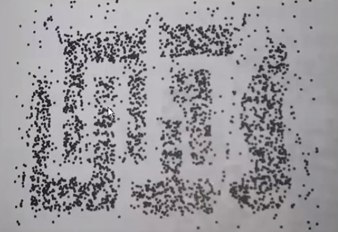
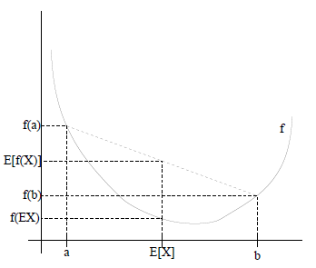

#第五章 聚类算法

聚类就是对大量未知标注的数据集，按数据的内在相似性将数据集划分为多个类别，使类别内的数据相似度较大，而类别间的数据相似度较小。根据点集上的集合距离将其划分为若干个簇，聚类是无监督学习，与分类的区别是分类有学习集的。

聚类应用场景中，孤立点的特殊意义：信用卡诈骗（某个人的消费行为和大多数人的消费行为不同，有异常情况出现）、黑客攻击（通过对日志进行聚类分析，孤立点就是异常访问情况，可以实现异常检测）。

**相似度/距离计算方法**

| 距离                          | 公式                                                         |
| ----------------------------- | ------------------------------------------------------------ |
| 曼哈顿距离（Manhattan）       | $d_{ij}=[\sum_{k=1}^{p} |x_{ik} - x_{jk} |$                  |
| 欧式距离（Euclidean）         | $d_{ij}=\sqrt{\sum_{k=1}^{p} (x_{ik} - x_{jk} )^{2}}$        |
| Minkowski距离                 | $d_{ij}=[\sum_{k=1}^{p} (x_{ik} - x_{jk} )^{q}]^{1/q}$，适用于点是实际空间中的点 |
| 杰卡德(Jaccard)相似系数       | $J(A,B)= \frac{|A \bigcap B|}{|A \bigcup B|}$，适用于集合相关场景 |
| 余弦相似度(cosine similarity) | $cos(\theta) = \frac{a^Tb}{|a| \cdot |b|}$，适用于词嵌入，词相似性场景 |
| Pearson相似系数               | $\rho_{XY} = \frac{cov{X,Y}}{\sigma_x \sigma_y}=\frac{E[(X-\mu_x)(Y-\mu_y)]}{\sigma_x \sigma_y}=\frac{\sum(X_i - \mu_x)(Y_i - \mu_y)}{\sqrt{\sum(X_i - \mu_x)^2}\sqrt{\sum(Y_i - \mu_y)^2}}$，同上 |
| 相对熵(K-L距离)               | $D(p||q) = \sum_x p(x) log\frac{p(x)}{q(x)} = E_{p(x)}log\frac{p(x)}{q(x)}$，适用于判别函数间相似性 |
| Hellingger距离                | $D(p||q)=\frac{2}{1 - a^2}(1 - \int p(x)^{\frac{1+a}{2}} q(x)^{\frac{1- a}{2}}dx)$，同上 |

余弦相似度与欧式距离的区别？

**预先相似度与Pearson相似系数**

n为向量x和y的夹角记作$\theta$，根据余弦定理，其余弦值为
$$
cos(\theta) = \frac{a^Tb}{|a| \cdot |b|} = \frac{\sum_{i=1}^{n}x_iy_i}{\sqrt{\sum_{i=1}^{n}x_i^2}\sqrt{\sum_{i=1}^{n}y_i^2}}
$$
这两个向量的相关系数为
$$
\rho_{XY} = \frac{cov{X,Y}}{\sigma_x \sigma_y}=\frac{E[(X-\mu_x)(Y-\mu_y)]}{\sigma_x \sigma_y}=\frac{\sum(X_i - \mu_x)(Y_i - \mu_y)}{\sqrt{\sum(X_i - \mu_x)^2}\sqrt{\sum(Y_i - \mu_y)^2}}
$$
可以知道：相关系数即将x、y坐标向量各自平移原点后的**夹角余弦**，这就是为什么文档间求距离使用余弦夹角，因为这一物理量表征了文档**去均值化**后的随机向量间的**相关系数**。

## 5.1层次聚类法

**算法思想**

1. 开始时，每个样本各自作为一个类；
2. 规定某种度量作为样本之间的距离及类与类之间的距离，并计算之；
3. 将距离最短的两个类合并为一个心类；
4. 重复2-3，不断合并最近的两个类，每次减少一个类，直至所有样本被合并为一类；

##5.2 动态聚类算法之K-Means

###5.2.1 K-Means原理

K-Means算法也称为K-平均或K-均值，是一种广泛使用的聚类算法。

**K-Means的公式化解释**

记K个簇中心为$\mu_1,\mu_2,...,\mu_k$，每个簇的样本数目为$N_1,N_2,...,N_k$，假设每个簇都是属于$N(\mu_i,\sigma^2_i)$的高斯分布，则样本集合是由K个高斯得到的，若需要对这个样本集合进行聚类，即对其进行参数估计求出$\mu_i$，为此采用最大似然估计方法求解，高斯函数的高斯密度函数为$f(x)=\frac{1}{\sqrt{2\pi} \sigma_i}exp(-\frac{(x_i - \mu_i)^2}{2\sigma_i^2})$，则由最大似然估计可以得到
$$
L(\mu) = \sum_{j=1}^{k}\prod_{i =1}^{N_j}\frac{1}{\sqrt{2\pi} \sigma_j}exp(-\frac{(x_i - \mu_j)^2}{2\sigma_j^2}) \\
\Downarrow 两边取对数同时忽略常数\\
lnL(\mu) = -\frac{1}{2} \sum_{j=1}^{k}\sum_{i =1}^{N_j}(x_i - \mu_j)^2 \\
\Downarrow似然函数的最大值转换为求最小值\\
lnL(\mu) =\frac{1}{2} \sum_{j=1}^{k}\sum_{i =1}^{N_j}(x_i - \mu_j)^2 \\
$$
即目标函数为$J(\mu)=\frac{1}{2} \sum_{j=1}^{k}\sum_{i \in C_j}(x_i - \mu_j)^2$，对$\mu=(\mu_1,...,\mu_k)$函数求偏导，解得其驻点为$\mu_j=\frac{1}{N_j}\sum_{i=1}^{N_j}x_i$，因此可以知道质点就是通过对簇内点进行平均求得。**KMeans算法的假设**是：1. 样本是高斯混合分布构成，会存在多个局部最小值，因此KMeans对初始值敏感，会存在**震荡**现象；2. KMeans算法认为样本的方差$\sigma$相同。

若使用其他相似度/距离度量，例如使用余弦相似度$cos(\theta) = \frac{a^Tb}{|a| \cdot |b|}$，则使用余弦相似度平方作为目标函数$J(\mu)=\frac{1}{2}\sum_{j=1}^{K}\sum_{j=1}^{N_j}cos^2(x_i, \mu_j)$，对$\mu=(\mu_1,...,\mu_k)$函数求偏导，则可以得到其驻点为？


**KMeans算法流程**

1. 假定输入样本为$S=x_1,x_2,...,x_n$，随机初始化n_cluster个点作为簇的中心点(质点，可能不是样本点)$\mu_1,\mu_2,...,\mu_k$；

2. 对于每个样本$x_i$，计算其到这n_cluster个中心点得距离，将$x_i$归为其中距离最小的那一个中心所在的类别；
   $$
   label_i = \underset{1 \le j \le k}{arg \ min}||x_i - \mu_j||
   $$

3. 对第2步得到的n_cluster个簇，重新计算这n_cluster个簇的中心点；
   $$
   \mu_j = \frac{1}{|C_j|}\sum_{i \in C_j}x_i
   $$

4. 转到2步，直到无论怎么更新中心点每个簇中的质心在发生变化，就停止迭代，**终止条件**可以是迭代次数、簇中心变化率、最小平方误差MSE(Minimum Squared Error)

K-Means将簇中所有点的均值作为新的质心，若簇中含有异常点，将导致均值偏离严重。以一维数据为例：数据1、2、3、4、100的均值为22，显然这个距离“大多数”数据比较远，若改成求数组的中位数3，在该实例中更为稳妥，这种聚类方式称为**K-Mediods即K中值距离**。

K-Means是初值敏感的，如何选择初始值？以**概率选择初始质心**，下面解释一下如何什么是以概率选择样本点，假设X可以取得样本点有$x_1,x_2,...,x_5$，且对应的概率如下表所示

| X    | $X_1$ | $X_2$ | $X_3$ | $X_4$ | $X_5$ |
| ---- | ----- | ----- | ----- | ----- | ----- |
| P    | 0.1   | 0.2   | 0.3   | 0.05  | 0.35  |

在选择哪一个点作为质心时，不是因为$X_5$的概率高就选择$X_5$作为质心，而是$X_5$被选择的概率为35%，$X_4$也是有可能被选择的。

| KMeans变形        | 说明                                                         |
| ----------------- | ------------------------------------------------------------ |
| 二分-KMeans       | 对取最大MSE的质心做抛分，按照一定概率考虑继续使用该质心该是重新选择 |
| KMeans++          | 概率选择初始质心，实现如下                                   |
| Mini-batch KMeans | 在计算样本所属类别时，不用计算所有样本，而是采用Min批量方式，实现如下 |

```python
import numpy as np 
import xgboost as xgb 
# 随机加权选择样本 KMeans++实现
def random_select(dis):
    b = np.cumsum(dis)               # b:累计概率
    r = np.random.random() * b[-1]    # r∈[0,b[-1])
    s = np.searchsorted(b, r)         # 查找r在b中的位置
    if s >= len(dis):
        print("Error:越界....")
        return len(dis)-1
    return s
def nearest(x, cc):
    dis = -1
    near = -1
    for i in range(len(cc)):
        d = np.sum((x - cc[i]) ** 2)
        if dis < 0 or dis > d:
            dis = d
            near = i
    return near

def k_means_init(data, k):
    m, n = np.array(data).shape
    cluster_center = np.zeros((k, n))
    # KMeans++算法实现要点： 选择合适的初始聚类中心 
    j = np.random.randint(m)
    cluster_center[0] = data[j][:]
    dis = np.zeros(m) - 1
    i = 0
    while i < k-1:
        for j in range(m):
            d = (cluster_center[i] - data[j]) ** 2
            d = np.sum(d)
            if dis[j] < 0 or dis[j] > d:
                dis[j] = d
        # 按照dis加权选择样本j
        j = random_select(dis)
        i += 1
        cluster_center[i] = data[j][:]
    # 聚类操作
    cluster = np.zeros(m, dtype=np.int) - 1     # 所有样本尚未聚类
    cc = np.zeros((k, n))      # 下一轮的聚类中心
    c_number = np.zeros(k)     # 每个簇的样本数目
    times = 100
    for t in range(times):
        for i in range(m):
            # Mini-batch KMeans算法的要点
            if np.random.random() * m > 100:
                continue
            c = nearest(data[i], cluster_center)
            cluster[i] = c      # 第i个样本归于第c簇
            cc[c] += data[i]
            c_number[c] += 1
        for i in range(k):
            cluster_center[i] = cc[i] / c_number[i]
        cc.flat = 0
        c_number.flat = 0
        print(t, '%.2f%%' % (100 *float(t) / times))
        print(cluster_center)
    return cluster, cluster_center
```


**K-Means算法的优缺点**

- 有效率，而不容易受到初始值选择的影响，稳定性和健壮性较高；
- K值得选择比较困难，通常会用其它聚类算法看一下聚类情况，然后在选择合适的K值；
- 不能处理非球形的簇；
- 不能处理不同尺寸，不同密度的簇；
- 离群值可能有较大干扰，处理方法是需要先剔除；

### 5.2.2 案例：对NBA球员进行评估

```python
import pandas as pd 
import numpy as np 
import matplotlib.pyplot as plt 
import math

nba = pd.read_csv('nba_2013.csv')

point_guards = nba[nba['pos']=='PG']
point_guards['ppg'] = point_guards['pts'] / point_guards['g']
point_guards[['pts', 'g', 'ppg']].head()
#  pts  g   ppg (总得分，打球场次，平均每场得分)
#  930  71  13.098
#  150  20  7.5
#  660  79  8.354
#  666  73  6.35

point_guards = point_guards[point_guards['tov'] != 0]
# 助攻与失误比
point_guards['atr'] = point_guards['ast'] / point_guards['tov']

# 只使用两个特征： ppg、atr对球员分类
plt.scatter(point_guards['ppg'], point_guards['atr'], c='y')
plt.title('Point Guards')
plt.xlabel('Points Per Game')
plt.ylabel('Assist Turnover Ratio')
plt.show()

# 想把数据聚类成5，n_cluster=5
"""
KMeans算法流程
1. 随机初始化n_cluster个点作为簇的中心点；
2. 对于其他所有每一个点a,计算其到这n_cluster个中心点得距离，将a归为其中距离最小的那一个中心所在的类别；
3. 对第2步得到的n_cluster个簇，重新计算这n_cluster个簇的中心点；
4. 转到2步，直到无论怎么更新中心点每个簇中的元素不在发生变化，就停止迭代；
"""

n_cluster = 5
# 随机选取5个索引
random_initial_points = np.random.choice(point_guards.index, size=n_cluster)
# 随机初始化5个点作为簇的中心点
centroids = point_guards.loc[random_initial_points]

# 将初始化的点用红色标注
plt.scatter(point_guards['ppg'], point_guards['atr'], c='yellow')
plt.scatter(centroids['ppg'], centroids['atr'], c='red')
plt.show()

def centroids_to_dict(centroids):
    dictionary = dict()
    # iterating counter we use to generate a cluster_id
    counter = 0

    # iterate a pandas data frame row-wise using iterrows()
    for index, row in centroids.iterrows():
        coordinates = [row['ppg'], row['atr']]
        dictionary[counter] = coordinates
        counter += 1
    return dictionary
centroids_dict = centroids_to_dict

def calculate_distance(centroids, player_values):
    root_distance = 0

    for x in range(0, len(centroids)):
        difference = centroids[x] - player_values[x]
        squared_difference = difference ** 2
        root_distance += squared_difference
    eculid_distace = math.sqrt(root_distance)
    return eculid_distace

# 每一个点属于哪一个类别
def assign_to_cluster(row):
    lowest_distance = -1
    closest_clutser = -1

    for cluster_id, centroid in centroids_dict.items():
        df_row = [row['pps'], row['atr']]
        euclidean_distace = calculate_distance(centroid, df_row)

        if lowest_distance == -1:
            lowest_distance = euclidean_distace
            closest_clutser = cluster_id
        elif euclidean_distace < lowest_distance:
            lowest_distance = euclidean_distace
            closest_clutser = cluster_id
    return closest_clutser

point_guards['cluster'] = point_guards.apply(lambda row: assign_to_cluster(row), axis=1)

def visualize_clusters(df, num_clusters):
    colors = ['b','g','r','c','m','y','k']

    for n in range(num_clusters):
        clustered_df = df[df['cluster'] == n]
        plt.scatter(clustered_df['ppg'], clustered_df['atr'], c=colors[n-1])
        plt.xlabel('Points Per Game', fontsize=12)
        plt.ylabel('Assist Turnover Radio', fontsize=12)
    plt.show()

visualize_clusters(point_guards, 5)

def recalculate_centroids(df):
    new_centroids_dict = dict()

    for cluster_id in range(0, num_clusters):
        pass
    
    return new_centroids_dict
# 循环进行如下操作指导
centroids_dict = recalculate_centroids(point_guards)
point_guards['cluster'] = point_guards.apply(lambda row: assign_to_cluster(row), axis=1)


# sklearn实现
from sklearn.cluster import KMeans
kmeans = KMeans(n_cluster=5)
kmeans.fit(point_guards[['ppg','atr']])
point_guards['cluster'] = kmeans.labels_

visualize_clusters(point_guards, 5)
```

###5.2.3案例：Kmeans进行图像压缩

```python

from sklearn.cluster import KMeans
from skimage import io
import numpy as np 

# 对像素点进行聚类，将像素点由256种压缩到128种
# 1. 彩色图压缩为灰度图
# 2. 将像素的取值范围进行压缩

image = io.imread('G:\\data\\1.JPG')
# io.imshow(image)
# io.show()

rows = image.shape[0]
cols = image.shape[1]

image = image.reshape((image.shape[0] * image.shape[1], 3))

#对RGB三个通道进行聚类，原来有0-255个取值，这里压缩为128个
kmeans = KMeans(n_clusters=128, n_init=10, max_iter=200)
kmeans.fit(image)

clusters = np.array(kmeans.cluster_centers_, dtype=np.uint8)
labels = np.array(kmeans.labels_, dtype=np.uint8)
labels = labels.reshape(rows, cols)
print(clusters.shape)
np.save('G:\\data\\comressed_1.npy', clusters)
io.imsave('G:\\data\\compressd_1.jpg', labels)
```


##5.3 基于代表性点的聚类之K中心聚类法K-Center

**算法步骤**

1. 随机选择k个点作为“中心点”；
2. 计算剩余的点到这k个中心点的距离，每个点被分配到最近的中心点组成聚簇；
3. 随机选择一个非中心$O_r$，用它代替某个现有的中心点$O_j$，计算这个代换的**总代价S**；
4. 如果$S \lt 0$，则用$O_r$代替$O_j$，形成新的k个中心点集合；
5. 重复2，直至中心点集合不发生变化；

K中心法的优点：对于噪音较大和存在离群值得情况，K中心法更加健壮，不像K-Means那样容易受到极端数据影响；缺点：执行代价高，同时对于非球形数据点，不能够得到很好的结果。

## 5.4 基于密度算法之DBSCAN（Density-Based Spatial Clustering of Applications with Noise）

DBSCAN具有将**足够高密度**的区域划分为簇，并可以发现**任何形状**的聚类。



**r邻域**：给定半径为$r$的区域；

**核心点**：如果一个点的r邻域至少包含最少数目M个点，则称该点为核心点；

**直接密度可达**：如果点p在核心点q的r邻域内，则称p是从q出发可以**直接密度可达**的；如果存在点链$p_1,p_2,...,p_n$,其中$p_1=q，p_n=p$，$p_{i+1}$是$p_i$关于r和M直接密度可达，则称点p是从q关于r和M**密度可达**的；如果样本集D中存在点o，使得点p、q是从o关于r和M密度可达的，那么点p、q是关于r和M**密度相连**的。直接密度可达的点链中前面的点一定是核心点，但是最后一个点是不是核心点就无法确定了。

**DBSCAN算法思想**

1. 指定合适的r和M；
2. 计算所有的样本点，如果点p的r邻域里有超过M个点，则创建一个以p为核心的新簇；
3. 反复寻找这些核心点直接密度可达(之后可能是密度可达)的点，将其加入到相应的簇，对于核心点发生“密度相连”状况的簇，给予合并；
4. 当没有新的点可以被添加到任何簇时，算法结束；


##5.5 CLARA（Cluster LARge Application）算法

用于对大数据进行快速聚类，通过牺牲精度提运算性能

大数据处理的三种思路：抽样、降低精度、性能

**算法思想**

1. 从大数据集中抽取少量样本；
2. 对抽取样本进行PAM聚类；
3. 从步骤2可以获得聚簇中心，使用这组聚类中心对大数据集进行聚类，分类原则是样本点距离各聚类中心距离最短者划分簇；


##5.6 基于网格的聚类方法CLIQUE(Cluster In QUEst)

基于网格的聚类方法可以发现基于密度的簇，需要给两个参数：网络步长、密度阈值，使用类似关联规则挖掘中的Apriori算法的先验性质


##5.7KNN(K近邻)

如下图所示，根据K值不同得到不同的结果

- 如果k=3，绿色远点的最近的3个邻居是2个红色的小三角和1个蓝色的小正方形，少数服从多数，基于统计的方法，判定绿色的这个待分类点属于红色的三角形一类。
- 如果k=5，绿色圆点的最近的5个邻居是2个红色小三角和3个蓝色正方形，还是少数服从多数，基于统计的方法，哦安定绿色的这个待分类点属于蓝色的正方形一类。


**K-近邻算法描述**

1. 计算已知类别数据集中的点与当前未知类别属性数据集中的点的**距离(欧式距离)**；
2. 按照距离依次排序；
3. 选取与当前点距离最小的K个点；
4. 确定前K个点所在类别的出现频率；
5. 返回前K个点出现频率最高的类别作为当前点预测分类；

KNN算法本身简单有效，它是一种lazy-learning算法，分类器不需要使用训练集进行训练，训练时间复杂度为0。KNN分类的计算复杂度和训练集中的文档数目成正比，即如果训练集中文档总数为N，那么KNN的分类时间复杂度为O(N)。

K值得选择，距离度量和分类决策规则是该算法的三个基本要素。

**问题**：该算法在分类时有个主要的不足是，当样本不平衡时，如一个类的样本容量很大，而其他类样本容量很小时，有可能导致当输入一个新样本上时，该样本的K个邻居中大容量样本占多数？解决办法是**不同的样本给予不同权重**。

```python
import numpy as np
class NearestNeighor:
    def __init__(self):
        pass
    def trai(self, X, y):
        """
        X is N*D where each row is an example. Y is 1-dimesion of size N
        """
        self.Xtr = X
        self.Ytr = y
    def predict(self, X):
        """
        X is N*D where each row is an example we wish to predict label for
        """
        num_test = X.shape[0]
        # make sure that the output type matches the input type
        Ypred = np.zeros(num_test, dtype=self.dtype)
        
        for i in range(num_test):
            # find the nearest trainging image to the i'th test image
            # usig the L1 distance(sum of absolute value different)
            distaces = np.sum(np.abs(self.Xtr - X[i, :]), axis=1)
            min_index = np.argmin(distaces)
            Ypred[i] = self.Ytr[min_index]
        return Ypred
```


## 5.8 期望最大化法（Expectation Maximum，EM）

解决问题：极大似然法用于根据样本数据进行参数估计，但有时观察数据中有“隐含数据”，对于包含“隐含数据”和未知参数的模型，就无法使用极大似然法求解模型分布参数。

EM是一种启发式迭代算法，首先猜测隐含数据（E步），然后基于猜测的数据结合极大似然法求解模型参数（M步）。由于隐含数据是猜测的，因此基于猜测得到的模型是不准确的，接下来继续猜测隐含数据（E步），然后基于猜测和极大似然法求解模型参数，如此循环迭代，直到模型参数基本无变化，则算法收敛并得到模型参数。

范例：KMeans算法是一种EM算法，其中隐含数据为簇的质心，开始时假设K个初始的质心（E步），然后计算得到每个样本最近的质心并把样本归为距离最近质心属于的聚簇（M步），如此循环迭代直到质心不再变化，算法收敛。

**凸函数**

设$f$是定义在实数域上的函数，如果对于任意的实数都有$f'' \ge 0$，那么f是凸函数。若x不是单个实数，而是由实数组成的向量，此时函数$f$的Hessian矩阵$H$是半正定的$H \ge 0$。

**Jensen不等式**

如果函数$f$是凸函数，x是随机变量，那么$E[f(x)]  \ge f(E[x])$，特别地，若$f$为严格凸函数，那么$E[f(x)]=f(x[x])$当且仅$P(x=E[x])=1$，即随机变量x为常量，具体如下图所示。若函数$f$为凹函数，上述符号正好相反。



###算法推导

对于m样本观察数据$x=(x^{(1)},x^{(2)},...,x^{(m)})$，找出样本模型参数$\theta$，目标函数为极大化模型分布的对数似然函数
$$
L(\theta)  = arg \ max_{\theta} \sum_{i=1}^{m} logP(x^{(i)}|\theta)
$$
如果我们得到的观察数据有未观察到的隐含数据$z=(z^{(1)},z^{(2)},...,z^{(m)})$，则对应的目标函数为
$$
L(\theta)  = arg \ max_{\theta} \sum_{i=1}^{m} log \sum_{z^{(i)}}P(x^{(i)}，z^{(i)}|\theta)
$$
其中第一个加和表示对极大似然取对数，而第二个加和是对每个样本的每个可能类别z求联合分布概率和。上面式子是要直接求出$\theta$比较难，因为有隐含变量z存在，若确定了z值后求解就比较简单了。

对于每一样本$i$，令$Q_i$为该样本隐含变量$z$的分布，则$Q_i$满足条件$\sum_z Q_i(z)=1，Q_i(z) \ge 0$（若z是连续性的，那么$Q_i$为概率密度函数，公式就得使用求和变成积分符号）。例如：要对班上的学生聚类，若隐含变量$z=身高$，那么$z$就服从连续的高斯分布；若隐含变量$z=\{男、女\}$，那么$z$就服从贝努利分布。下面对式子做如下缩放
$$
\sum_{i=1}^{m} log \sum_{z^{(i)}} Q_i(z^{(i)}) \ \frac{P(x^{(i)}，z^{(i)}|\theta)}{Q_i(z^{(i)})} \ge \sum_{i=1}^{m}  \sum_{z^{(i)}} Q_i(z^{(i)}) \ log\frac{P(x^{(i)}，z^{(i)}|\theta)}{Q_i(z^{(i)})} \tag{1}
$$
由**Jensen不等式**得到：若 f为凹函数，则$f(E(x)) \ge E(f(x))$。其中$ \sum_{z^{(i)}} Q_i(z^{(i)}) \ log\frac{P(x^{(i)}，z^{(i)}|\theta)}{Q_i(z^{(i)})} $是$\frac{P(x^{(i)},z^{(i)}|\theta)}{Q_i(z^{(i)})}$基于条件概率$Q_i(z^{(i)})$的期望。期望公式为
$$
设Y是随机变量X的函数，Y=g(X)，\qquad \qquad \qquad \qquad \qquad \qquad \qquad \qquad \qquad \qquad \qquad \\
1.若X是离散型随机变量，它的分布规律为P(X=x_k)=p_k，若\sum_{k=1}^{\infty}g(X_k)p_k绝对收敛，\\
则有E[Y]=E[g(X)]=\sum_{k=1}^{\infty}g(X_k)p_k。\\
2. 若X是连续型随机变量，它的密度函数为f(x)，若\int_{-\infty}^{\infty}g(x)f(x)dx绝对收敛，\qquad \quad\\
则有E[Y]=E[g(X)]=\int_{-\infty}^{\infty}g(x)f(x)dx
$$
则对于公式(1)来说 ，Y是$\frac{P(x^{(i)},z^{(i)}|\theta)}{Q_i(z^{(i)})}$，X是$z^{(i)}$，$Q_i(z^{(i)})$则是$p_k$，而$g$是$z^{(i)}$到$\frac{P(x^{(i)},z^{(i)}|\theta)}{Q_i(z^{(i)})}$的映射，再结合Jensen不等式就可以得到(1)式。

这个过程可以看做是对$L(\theta)$求下界，对于$Q_i(z^{(i)})$有多种选择，那种更好？假设$\theta$已给定，则$L(\theta)$的值就决定于$Q_i(z^{(i)})$和$P(x^{(i)},z^{(i)})$，我们可以通过调整这两个概率使上下界不断上升，以逼近$L(\theta)$的真实值，那么什么时候算是调整好了呢？当不等式变成等式时，说明调整后的概率能够等价于$L(\theta)$了。根据**Jensen不等式**，若要等号成立需要让随机变量变成常数，则有$\frac{P(x^{(i)}，z^{(i)}|\theta)}{Q_i(z^{(i)})} =  c$，其中c为常数不依赖于$z^{(i)}$。由于$Q_i(z^{(i)})$是一个 分布，所以满足$\sum_{z^{(i)}}Q_i(z^{(i)})=1$ ，那么就有$\sum_zP(x^{(i)}，z^{(i)}|\theta)=c$ (多个等式分子分母相加不变，这里认为每一个样本的两个概率比值都是c)，从而可得
$$
Q_i(z^{(i)})=\frac{P(x^{(i)}，z^{(i)}|\theta)}{\sum_zP(x^{(i)}，z^{(i)}|\theta)} =\frac{P(x^{(i)}，z^{(i)}|\theta)}{P(x^{(i)}|\theta)} = Q(z^{(i)}|x^{(i)}, \theta)
$$
至此，得到了在固定其他参数$\theta$后，$Q_i(z^{(i)})$的计算公式就是后验概率，**解决了$Q_i(z^{(i)})$如何选择的问题，这就是E步，建立 了$L(\theta)$的下界**。

接下来就是给定$Q_i(z^{(i)})$后，调整$\theta$去极大化$L(\theta)$的 下界。如果能极大化这个下界，则也在尝试极大化对数似然。需要最大化下式
$$
\sum_{i=1}^{m}  \sum_{z^{(i)}}Q_i(z^{(i)}) \ log\frac{P(x^{(i)}，z^{(i)}|\theta)}{Q_i(z^{(i)}))}
$$
去掉上式中为常数的部分，则我们需要极大化的对数似然下界为
$$
\sum_{i=1}^{m} \sum_{z^{(i)}} Q_i(z^{(i)}) \ logP(x^{(i)}，z^{(i)}|\theta) \Rightarrow  （M步）
$$
上式也就是**EM算法的M步**。

###EM算法流程

`输入`：观察数据$x=(x^{(1)},x^{(2)},...,x^{(m)})$，联合分布$P(x,z|\theta)$，条件分布$P(z|z,\theta)$，最大迭代次数为J；

`输出`：模型参数$\theta$

1. 随机初始化模型参数$\theta^{(0)}$

2. 开始EM算法迭代$for \   j  \leftarrow 1 \ to \ J$

   1. E步，计算联合分布的条件概率期望
      $$
      Q_i(z^{(i)}) =  P(z^{(i)} | x^{(i)},\theta^{(i)}) \\
      L(\theta, \theta^{(j)})=\sum_{i=1}^{m}\sum_{z^{(i)}} Q_i(z^{(i)}) \ logP(x^{(i)}，z^{(j)}|\theta)​
      $$

   2. M步，极大化$L(\theta, \theta^{(j)})$，得到$\theta^{(j+1)}$
      $$
      \theta^{(j+1)} =  arg \ max _{\theta} L(\theta, \theta^{(j)})
      $$

   3. 如果$\theta^{(j+1)}$已收敛，则算法结束。否则继续回到步骤1进行E步迭代

**EM算法的收敛性分析**

针对EM算法需要思考两个问题：1. EM算法能保证收敛吗？2. EM算法如果收敛，能保证收敛到全局最大值 吗？

针对第一个问题，要证明EM算法收敛，则需要证明对数最大似然估计单调增加，则有最大似然估计可以达到最大值。假设在EM算法的第$j、j+1$次迭代得到的$\theta^{(j)}、\theta^{(j+1)}$，则需要证明$L(\theta^{(j+1)}) \ge L(\theta^{(j)})$，选定$\theta^{(j)}$后，得到E步$Q_i(z^{(i)})=P(z^{(i)}|x^{(i)},\theta^{(j)})$，这一步保证了给定$\theta^{(j)}$时，Jensen不等式中的等式成立即有：
$$
L(\theta,\theta^{(j)}) = \sum_{i=1}^{m} \sum_{z^{(i)}} P(z^{(i)}|x^{（i)}, \theta^{(j)})logP(x^{(i)}, z^{(i)}|\theta)
$$
 然后进行M步，固定$Q_i^{(j)}(z^{(i)})$，并将$\theta^{(j)}$视作变量，对上式$L(\theta^{(j)})$求导得到$\theta^{(j+1)}$
$$
H(\theta,\theta^{(j)}) = \sum_{i=1}^{m}\sum_{z^{(i)}}P(z^{(i)}|x^{(i))},\theta^{(j))})logP(z^{(i))}|x^{(i))},\theta)
$$
上述两式相减可以得到
$$
\sum_{i=1}^{m}logP(x^{(i)}|\theta) = L(\theta, \theta^{(j)}) - H(\theta, \theta^{(j)})
$$
在上式子中分别取$\theta$为$\theta^{(j)}、\theta^{(j+1)}$并相减可以得到 
$$
\sum_{i=1}^{m}log P(x^{(i)}|\theta^{(j+1)}) - \sum_{i=1}^{m}log P(x^{(i)}|\theta^{(j)}) \\= [L(\theta^{(j+1)},\theta^{(j)}) - L(\theta^{(j)},\theta^{(j)})] - [H(\theta^{(j+1)},\theta^{(j)}) - H(\theta^{(j)},\theta^{(j)})]
$$
要证明EM算法的收敛性，我们只需要证明上式的右边是非负即可。由于$\theta^{(j+1)}$使得$L(\theta,\theta^{(j)})$极大，因此有
$$
L(\theta^{(j+1)}, \theta^{(j)})  - L(\theta^{(j)}, \theta^{(j)}) \ge 0
$$
而对于第二部分有
$$
H(\theta^{(j+1)},\theta^{(j)}) - H(\theta^{(j)},\theta^{(j)}) = \sum_{i=1}^{m} \sum_{z^{(i)}} P(z^{(i)}|x^{(i)},\theta^{(j)}) log \frac{P(z^{(i)}|x^{(i)},\theta^{(j+1)})}{P(z^{(i)}|x^{(i)},\theta^{(j)})} \\
\le \sum_{i=1}^{m} log(\sum_{z^{(i)}}P(z^{(i)}|x^{(i)}, \theta^{(i)})\frac{P(z^{(i)}|x^{(i)},\theta^{(j+1)})}{P(z^{(i)}|x^{(i)},\theta^{(j)})}) \ (Jensen不等式)\\
= \sum_{i=1}^{m} log(P(z^{(i)}|x^{(i)}, \theta^{(j+1)})) =  0 \ (概率分布累积为1)
$$
所以可以得到$\sum_{i=1}^{m}log P(x^{(i)}|\theta^{(j+1)}) - \sum_{i=1}^{m}log P(x^{(i)}|\theta^{(j)}) \ge 0$，$L(\theta)$是单调增加的，EM算法收敛，一种收敛是$L(\theta)$不在变化，另一种是变化幅度小。

从上述推导公式可以直到，EM算法可以保证收敛到一个稳定点，但是却不能保证收敛到全局的极大值点，因此它是局部最优算法。若优化目标$L(\theta,\theta^{(j)})$是凸的，则EM算法可以保证收敛到最大值，E步固定$\theta$优化 $Q$，M步固定$Q$优化$\theta$。

###算法举例

假设有一批数据$(x_1,x_2,...,x_m)$分别是由两个正态分布：$X_1 \sim N(\mu_1,\sigma_1^2)，X_2 \sim N(\mu_2, \sigma^2_2)$产生，其中$\mu_1，\mu_2$未知，$\sigma_1^2 = \sigma^2_2$，但是不知道具体的$x_i$是由哪一个分布产生的，可以使用$z_{i,1}，z_{i,2}$分别表示。该例子中包含两个隐藏变量$z_{i,1}，z_{i,2}$，可以使用EM算法啊对参数进行估计。

1. 初始化$\mu_1、\mu_2$

2. E步：$Q_i(z)=P(z|Y, \theta^{(i)})$，即求数据$x_i$是由第$j$分布产生的概率
   $$
   P(z_{i,j}|x_{i},\mu_j) = \frac{e^{-  \frac{1}{2\sigma^2}(x_i-\mu_j)^2}}{\sum_{n=1}^{2}e^{-  \frac{1}{2\sigma^2}(x_i-\mu_n)^2}}
   $$
   ​

3. M步：$\theta ^{\left ( i+1 \right )}=\underset{\theta }{arg\: max}\sum_{Z}Q_i\left ( Z \right )\cdot log\; \frac{P\left ( Y,Z\mid \theta ^\left ( i \right ) \right )}{Q_i\left ( Z \right )}$，即计算最大期望值，由于我们要求的是参数$\mu_j$，可以通过公式计算$\mu_j=\frac{\sum_{i=1}^{m}P(z_{i,j}|x_i,\mu_j)x_i}{\sum_{i=1}^{m}P(z_{i,j}|x_i,\mu_j)}$


##估计聚类趋势

**聚类要求数据不能均匀分布**，对于二维空间可以通过查看图形判断别，如下图所示。但对于高维空间中的数据我们应该采用什么方法来判断数据是均匀分布、随机分布还是聚群分布呢？**霍普金斯统计量(Hopkins Statistic)**可以衡量样本点在空间中分布的均匀性和随机性。通过计算霍普金斯统计量就可以直截了当的知道一个问题可不可以用来做聚类。


