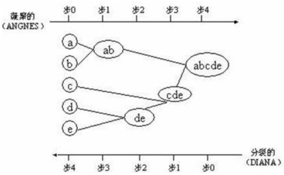
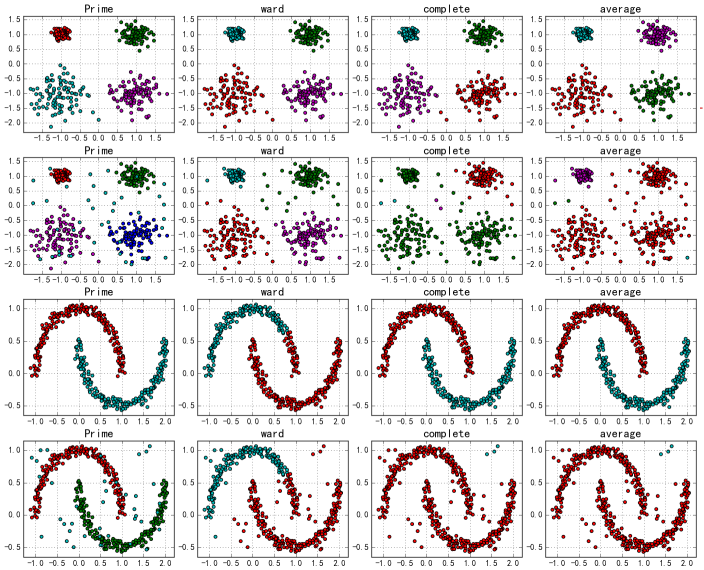
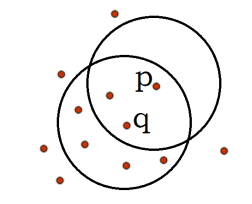
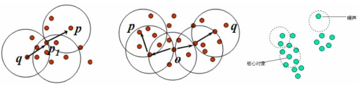
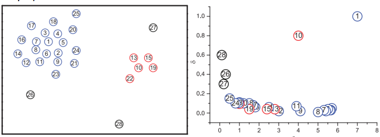
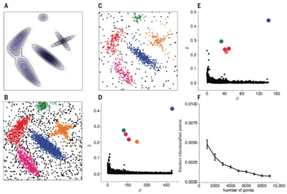
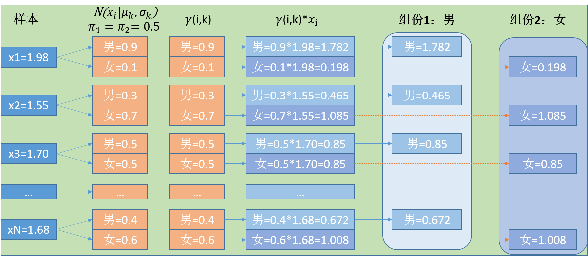

#第五章 聚类算法

聚类就是对大量未知标注的数据集，按数据的内在相似性将数据集划分为多个类别，使类别内的数据相似度较大，而类别间的数据相似度较小。根据点集上的集合距离将其划分为若干个簇，聚类是无监督学习，与分类的区别是分类有学习集的。

聚类应用场景中，孤立点的特殊意义：信用卡诈骗（某个人的消费行为和大多数人的消费行为不同，有异常情况出现）、黑客攻击（通过对日志进行聚类分析，孤立点就是异常访问情况，可以实现异常检测）。

**相似度/距离计算方法**

| 距离                          | 公式                                                         |
| ----------------------------- | ------------------------------------------------------------ |
| 曼哈顿距离（Manhattan）       | $d_{ij}=[\sum_{k=1}^{p} |x_{ik} - x_{jk} |$                  |
| 欧式距离（Euclidean）         | $d_{ij}=\sqrt{\sum_{k=1}^{p} (x_{ik} - x_{jk} )^{2}}$        |
| Minkowski距离                 | $d_{ij}=[\sum_{k=1}^{p} (x_{ik} - x_{jk} )^{q}]^{1/q}$，适用于点是实际空间中的点 |
| 杰卡德(Jaccard)相似系数       | $J(A,B)= \frac{|A \bigcap B|}{|A \bigcup B|}$，适用于集合相关场景 |
| 余弦相似度(cosine similarity) | $cos(\theta) = \frac{a^Tb}{|a| \cdot |b|}$，适用于词嵌入，词相似性场景 |
| Pearson相似系数               | $\rho_{XY} = \frac{cov{X,Y}}{\sigma_x \sigma_y}=\frac{E[(X-\mu_x)(Y-\mu_y)]}{\sigma_x \sigma_y}=\frac{\sum(X_i - \mu_x)(Y_i - \mu_y)}{\sqrt{\sum(X_i - \mu_x)^2}\sqrt{\sum(Y_i - \mu_y)^2}}$，同上 |
| 相对熵(K-L距离)               | $D(p||q) = \sum_x p(x) log\frac{p(x)}{q(x)} = E_{p(x)}log\frac{p(x)}{q(x)}$，适用于判别函数间相似性 |
| Hellingger距离                | $D(p||q)=\frac{2}{1 - a^2}(1 - \int p(x)^{\frac{1+a}{2}} q(x)^{\frac{1- a}{2}}dx)$，同上 |

余弦相似度与欧式距离的区别？

**预先相似度与Pearson相似系数**

n为向量x和y的夹角记作$\theta$，根据余弦定理，其余弦值为
$$
cos(\theta) = \frac{a^Tb}{|a| \cdot |b|} = \frac{\sum_{i=1}^{n}x_iy_i}{\sqrt{\sum_{i=1}^{n}x_i^2}\sqrt{\sum_{i=1}^{n}y_i^2}}
$$
这两个向量的相关系数为
$$
\rho_{XY} = \frac{cov{X,Y}}{\sigma_x \sigma_y}=\frac{E[(X-\mu_x)(Y-\mu_y)]}{\sigma_x \sigma_y}=\frac{\sum(X_i - \mu_x)(Y_i - \mu_y)}{\sqrt{\sum(X_i - \mu_x)^2}\sqrt{\sum(Y_i - \mu_y)^2}}
$$
可以知道：相关系数即将x、y坐标向量各自平移原点后的**夹角余弦**，这就是为什么文档间求距离使用余弦夹角，因为这一物理量表征了文档**去均值化**后的随机向量间的**相关系数**。

## 5.1层次聚类法

层次聚类方法对给定的数据集进行层次分解，直到某种条件满足为止，具体可以分为

1. 凝聚的层次聚类：AGNES算法

   一种自底向上的策略，首先将每个对象作为一个簇，然后合并这些原子簇为越来越大的簇，直到某个终结条件被满足。较分裂方式的层次聚类常用。

2. 分裂的层次聚类：DIANA算法

   采用自顶向下的策略，它首先将所有对象置于一个簇中，然后逐渐细分为越来越小的簇，直到达到某个终结条件，可以看做是无监督的决策树。



###5.1.1 AGNES算法 

AGNES(AGglomerative NESting)算法最初将每个对象作为一个簇，然后这些簇根据某些准则被一步步地合并。两个簇间距离由这两个不同簇中距离最近的数据点对的相似度来确定，聚类的合并过程反复进行直到所有的对象最终满足簇数目。

**簇间距离的不同定义**

1. 最小距离：两个集合中最近的两个样本的距离；缺点是：容易形成链状结构。
2. 最大距离(complete)：两个集合中最远的两个样本的距离；缺点是：若存在异常值，则不稳定。
3. 平均距离
   - (average)两个集合中样本间两两距离的平均值；
   - (ward)两个集合中样本间两两距离的平方和；

下图是采用不同距离作为衡量准则是的凝聚聚类方法，其中第2、4行中的数据为添加噪声后的数据，Prime为原始数据。



###5.1.2 DIANA算法 

DIANA(DIvisive ANAlysis)算法是AGNES过程的反过程，属于分裂的层次聚类，首先将所有的对象初始化到一个簇中，然后根据一些原则(比如：最大欧式距离)，将该簇分类，直到到达用户指定的簇数或两个簇之间的距离超过了某个阈值。

##5.2 动态聚类算法之K-Means

###5.2.1 K-Means原理

K-Means算法也称为K-平均或K-均值，是一种广泛使用的聚类算法。

**K-Means的公式化解释**

记K个簇中心为$\mu_1,\mu_2,...,\mu_k$，每个簇的样本数目为$N_1,N_2,...,N_k$，假设每个簇都是属于$N(\mu_i,\sigma^2_i)$的高斯分布，则样本集合是由K个高斯得到的，若需要对这个样本集合进行聚类，即对其进行参数估计求出$\mu_i$，为此采用最大似然估计方法求解，高斯函数的高斯密度函数为$f(x)=\frac{1}{\sqrt{2\pi} \sigma_i}exp(-\frac{(x_i - \mu_i)^2}{2\sigma_i^2})$，则由最大似然估计可以得到
$$
L(\mu) = \sum_{j=1}^{k}\prod_{i =1}^{N_j}\frac{1}{\sqrt{2\pi} \sigma_j}exp(-\frac{(x_i - \mu_j)^2}{2\sigma_j^2}) \\
\Downarrow 两边取对数同时忽略常数\\
lnL(\mu) = -\frac{1}{2} \sum_{j=1}^{k}\sum_{i =1}^{N_j}(x_i - \mu_j)^2 \\
\Downarrow似然函数的最大值转换为求最小值\\
lnL(\mu) =\frac{1}{2} \sum_{j=1}^{k}\sum_{i =1}^{N_j}(x_i - \mu_j)^2 \\
$$
即目标函数为$J(\mu)=\frac{1}{2} \sum_{j=1}^{k}\sum_{i \in C_j}(x_i - \mu_j)^2$，对$\mu=(\mu_1,...,\mu_k)$函数求偏导，解得其驻点为$\mu_j=\frac{1}{N_j}\sum_{i=1}^{N_j}x_i$，因此可以知道质点就是通过对簇内点进行平均求得。**KMeans算法的假设**是：1. 样本是高斯混合分布构成，会存在多个局部最小值，因此KMeans对初始值敏感，会存在**震荡**现象；2. KMeans算法认为样本的方差$\sigma$相同，针对方差不同的样本可以采用**EM算法**求解。

若使用其他相似度/距离度量，例如使用余弦相似度$cos(\theta) = \frac{a^Tb}{|a| \cdot |b|}$，则使用余弦相似度平方作为目标函数$J(\mu)=\frac{1}{2}\sum_{j=1}^{K}\sum_{j=1}^{N_j}cos^2(x_i, \mu_j)$，对$\mu=(\mu_1,...,\mu_k)$函数求偏导，则可以得到其驻点为？

**KMeans算法流程**

1. 假定输入样本为$S=x_1,x_2,...,x_n$，随机初始化n_cluster个点作为簇的中心点(质点，可能不是样本点)$\mu_1,\mu_2,...,\mu_k$；

2. 对于每个样本$x_i$，计算其到这n_cluster个中心点得距离，将$x_i$归为其中距离最小的那一个中心所在的类别；
   $$
   label_i = \underset{1 \le j \le k}{arg \ min}||x_i - \mu_j||
   $$

3. 对第2步得到的n_cluster个簇，重新计算这n_cluster个簇的中心点；
   $$
   \mu_j = \frac{1}{|C_j|}\sum_{i \in C_j}x_i
   $$

4. 转到2步，直到无论怎么更新中心点每个簇中的质心在发生变化，就停止迭代，**终止条件**可以是迭代次数、簇中心变化率、最小平方误差MSE(Minimum Squared Error)

**K-Means算法的优缺点**

- 有效率，而容易受到初始值选择的影响，稳定性和健壮性较高；K-Means将簇中所有点的均值作为新的质心，若簇中含有异常点，将导致均值偏离严重。以一维数据为例：数据1、2、3、4、100的均值为22，显然这个距离“大多数”数据比较远，若改成求数组的中位数3，在该实例中更为稳妥，这种聚类方式称为**K-Mediods即K中值距离**。
- K值得选择比较困难，通常会用其它聚类算法看一下聚类情况，然后在选择合适的K值；
- 不能处理非球形的簇；
- 不能处理不同尺寸，不同密度的簇；
- 离群值可能有较大干扰，处理方法是需要先剔除；

**KMeans优化算法**

| KMeans变形        | 说明                                                         |
| ----------------- | ------------------------------------------------------------ |
| 二分-KMeans       | 对取最大MSE的质心做抛分，按照一定概率考虑继续使用该质心该是重新选择 |
| KMeans++          | 概率选择初始质心，实现如下                                   |
| Mini-batch KMeans | 在计算样本所属类别时，不用计算所有样本，而是采用Min批量方式，实现如下 |

K-Means是初值敏感的，如何选择初始值？以**概率选择初始质心**，下面解释一下如何什么是以概率选择样本点，假设X可以取得样本点有$x_1,x_2,...,x_5$，且对应的概率如下表所示

| X    | $X_1$ | $X_2$ | $X_3$ | $X_4$ | $X_5$ |
| ---- | ----- | ----- | ----- | ----- | ----- |
| P    | 0.1   | 0.2   | 0.3   | 0.05  | 0.35  |

在选择哪一个点作为质心时，不是因为$X_5​$的概率高就选择$X_5​$作为质心，而是$X_5​$被选择的概率为35%，$X_4​$也是有可能被选择的。


```python
import numpy as np 
import xgboost as xgb 
# 随机加权选择样本 KMeans++实现
def random_select(dis):
    b = np.cumsum(dis)               # b:累计概率
    r = np.random.random() * b[-1]    # r∈[0,b[-1])
    s = np.searchsorted(b, r)         # 查找r在b中的位置
    if s >= len(dis):
        print("Error:越界....")
        return len(dis)-1
    return s
def nearest(x, cc):
    dis = -1
    near = -1
    for i in range(len(cc)):
        d = np.sum((x - cc[i]) ** 2)
        if dis < 0 or dis > d:
            dis = d
            near = i
    return near

def k_means_init(data, k):
    m, n = np.array(data).shape
    cluster_center = np.zeros((k, n))
    # KMeans++算法实现要点： 选择合适的初始聚类中心 
    j = np.random.randint(m)
    cluster_center[0] = data[j][:]
    dis = np.zeros(m) - 1
    i = 0
    while i < k-1:
        for j in range(m):
            d = (cluster_center[i] - data[j]) ** 2
            d = np.sum(d)
            if dis[j] < 0 or dis[j] > d:
                dis[j] = d
        # 按照dis加权选择样本j
        j = random_select(dis)
        i += 1
        cluster_center[i] = data[j][:]
    # 聚类操作
    cluster = np.zeros(m, dtype=np.int) - 1     # 所有样本尚未聚类
    cc = np.zeros((k, n))      # 下一轮的聚类中心
    c_number = np.zeros(k)     # 每个簇的样本数目
    times = 100
    for t in range(times):
        for i in range(m):
            # Mini-batch KMeans算法的要点
            if np.random.random() * m > 100:
                continue
            c = nearest(data[i], cluster_center)
            cluster[i] = c      # 第i个样本归于第c簇
            cc[c] += data[i]
            c_number[c] += 1
        for i in range(k):
            cluster_center[i] = cc[i] / c_number[i]
        cc.flat = 0
        c_number.flat = 0
        print(t, '%.2f%%' % (100 *float(t) / times))
        print(cluster_center)
    return cluster, cluster_center
```

### 5.2.2 案例：对NBA球员进行评估

```python
import pandas as pd 
import numpy as np 
import matplotlib.pyplot as plt 
import math

nba = pd.read_csv('nba_2013.csv')

point_guards = nba[nba['pos']=='PG']
point_guards['ppg'] = point_guards['pts'] / point_guards['g']
point_guards[['pts', 'g', 'ppg']].head()
#  pts  g   ppg (总得分，打球场次，平均每场得分)
#  930  71  13.098
#  150  20  7.5
#  660  79  8.354
#  666  73  6.35

point_guards = point_guards[point_guards['tov'] != 0]
# 助攻与失误比
point_guards['atr'] = point_guards['ast'] / point_guards['tov']

# 只使用两个特征： ppg、atr对球员分类
plt.scatter(point_guards['ppg'], point_guards['atr'], c='y')
plt.title('Point Guards')
plt.xlabel('Points Per Game')
plt.ylabel('Assist Turnover Ratio')
plt.show()

# 想把数据聚类成5，n_cluster=5
"""
KMeans算法流程
1. 随机初始化n_cluster个点作为簇的中心点；
2. 对于其他所有每一个点a,计算其到这n_cluster个中心点得距离，将a归为其中距离最小的那一个中心所在的类别；
3. 对第2步得到的n_cluster个簇，重新计算这n_cluster个簇的中心点；
4. 转到2步，直到无论怎么更新中心点每个簇中的元素不在发生变化，就停止迭代；
"""

n_cluster = 5
# 随机选取5个索引
random_initial_points = np.random.choice(point_guards.index, size=n_cluster)
# 随机初始化5个点作为簇的中心点
centroids = point_guards.loc[random_initial_points]

# 将初始化的点用红色标注
plt.scatter(point_guards['ppg'], point_guards['atr'], c='yellow')
plt.scatter(centroids['ppg'], centroids['atr'], c='red')
plt.show()

def centroids_to_dict(centroids):
    dictionary = dict()
    # iterating counter we use to generate a cluster_id
    counter = 0

    # iterate a pandas data frame row-wise using iterrows()
    for index, row in centroids.iterrows():
        coordinates = [row['ppg'], row['atr']]
        dictionary[counter] = coordinates
        counter += 1
    return dictionary
centroids_dict = centroids_to_dict

def calculate_distance(centroids, player_values):
    root_distance = 0

    for x in range(0, len(centroids)):
        difference = centroids[x] - player_values[x]
        squared_difference = difference ** 2
        root_distance += squared_difference
    eculid_distace = math.sqrt(root_distance)
    return eculid_distace

# 每一个点属于哪一个类别
def assign_to_cluster(row):
    lowest_distance = -1
    closest_clutser = -1

    for cluster_id, centroid in centroids_dict.items():
        df_row = [row['pps'], row['atr']]
        euclidean_distace = calculate_distance(centroid, df_row)

        if lowest_distance == -1:
            lowest_distance = euclidean_distace
            closest_clutser = cluster_id
        elif euclidean_distace < lowest_distance:
            lowest_distance = euclidean_distace
            closest_clutser = cluster_id
    return closest_clutser

point_guards['cluster'] = point_guards.apply(lambda row: assign_to_cluster(row), axis=1)

def visualize_clusters(df, num_clusters):
    colors = ['b','g','r','c','m','y','k']

    for n in range(num_clusters):
        clustered_df = df[df['cluster'] == n]
        plt.scatter(clustered_df['ppg'], clustered_df['atr'], c=colors[n-1])
        plt.xlabel('Points Per Game', fontsize=12)
        plt.ylabel('Assist Turnover Radio', fontsize=12)
    plt.show()

visualize_clusters(point_guards, 5)

def recalculate_centroids(df):
    new_centroids_dict = dict()

    for cluster_id in range(0, num_clusters):
        pass
    
    return new_centroids_dict
# 循环进行如下操作指导
centroids_dict = recalculate_centroids(point_guards)
point_guards['cluster'] = point_guards.apply(lambda row: assign_to_cluster(row), axis=1)


# sklearn实现
from sklearn.cluster import KMeans
kmeans = KMeans(n_cluster=5)
kmeans.fit(point_guards[['ppg','atr']])
point_guards['cluster'] = kmeans.labels_

visualize_clusters(point_guards, 5)
```

###5.2.3案例：Kmeans进行图像压缩

```python

from sklearn.cluster import KMeans
from skimage import io
import numpy as np 

# 对像素点进行聚类，将像素点由256种压缩到128种
# 1. 彩色图压缩为灰度图
# 2. 将像素的取值范围进行压缩

image = io.imread('G:\\data\\1.JPG')
# io.imshow(image)
# io.show()

rows = image.shape[0]
cols = image.shape[1]

image = image.reshape((image.shape[0] * image.shape[1], 3))

#对RGB三个通道进行聚类，原来有0-255个取值，这里压缩为128个
kmeans = KMeans(n_clusters=128, n_init=10, max_iter=200)
kmeans.fit(image)

clusters = np.array(kmeans.cluster_centers_, dtype=np.uint8)
labels = np.array(kmeans.labels_, dtype=np.uint8)
labels = labels.reshape(rows, cols)
print(clusters.shape)
np.save('G:\\data\\comressed_1.npy', clusters)
io.imsave('G:\\data\\compressd_1.jpg', labels)
```

##5.3 Canopy算法 

Canopy算法通常用于判断类别与簇之间的相关关系，可以归为聚类算法，但更多是使用Canopy算法做空间索引，其时空复杂度很出色，算法描述如下

1. 对于给定样本$x_1,x_2,...,x_m$，给定先验值$r_1,r_2，r_1 < r_2$，$x_1,x_2,...,x_m$形成列表L，构造$x_i(i \le j \le m)$的空列表$C_i$
2. 随机选择L中的样本c，要求c的列表$C_c$为空
   1. 计算L中的样本$x_j$与c的距离$d_j$
      - 若$d_j < r_1$，则在L中删除$x_j$，将$C_j$赋值为$\{c\}$；
      - 否则，若$d_j < r_2$，则将$C_j$增加$\{c\}$；
3. 若L中没有不满足条件得样本c，算法结束；

```python
def canopy(data, d_near, d_far):
    m = len(data)
    cluster = [[] for i in range(m)]
    center = []
    has = m
    while has > 0:
        i = np.random.randint(has)
        # 查招cluster中第i个为空的值
        i = find_new_canopy(cluster, i)
        center.append(i)
        if i == -1:
            break
        # 针对新canopy中心data[i],计算所有样本与之距离
        for j in range(m):
            d = np.sqrt(np.sum((data[i] - data[j]) ** 2))
            if d < d_near:
                cluster[j] = [i]
            elif d < d_far:
                cluster[j].append[i]
        has = calc_candidate(cluster)
        return cluster, center
def find_new_canopy(cluster, i):
    has = -1
    j = -1
    for j in range(len(cluster)):
        if len(cluster[j]) == 0:
            has += 1
            if has == i:
                break
    if has == i:
        return j
    return -1

def calc_candidate(cluster):
    has = 0
    for c in cluster:
        if len(c) == 0:
            has += 1
    return has
```


##5.4 基于代表性点的聚类之K中心聚类法K-Center

**算法步骤**

1. 随机选择k个点作为“中心点”；
2. 计算剩余的点到这k个中心点的距离，每个点被分配到最近的中心点组成聚簇；
3. 随机选择一个非中心$O_r$，用它代替某个现有的中心点$O_j$，计算这个代换的**总代价S**；
4. 如果$S \lt 0$，则用$O_r$代替$O_j$，形成新的k个中心点集合；
5. 重复2，直至中心点集合不发生变化；

K中心法的优点：对于噪音较大和存在离群值得情况，K中心法更加健壮，不像K-Means那样容易受到极端数据影响；缺点：执行代价高，同时对于非球形数据点，不能够得到很好的结果。

## 5.5 基于密度算法

密度聚类方法的指导思想是只要样本点的密度大于某个阈值，则将该样本添加到最近的簇中。这类算法能克服基于距离的算法只能发现“类圆形”(凸)的聚类的缺点，可以发现任意形状的聚类，且对噪声数据不敏感。但计算密度单元的计算复杂度大，需要建立空间索引来降低计算量。常用算法有

1. DBSCAN（Density-Based Spatial Clustering of Applications with Noise）
2. 密度最大值算法

###5.5.1 DBSCAN（Density-Based Spatial Clustering of Applications with Noise）

DBSCAN将簇定义为**密度相连的点的最大集合**，能够把具有将**足够高密度**的区域划分为簇，并可在有“噪声”的数据中发现**任何形状**的聚类。


**对象的$\epsilon$-邻域**：给定半径为$\epsilon$的区域；

**核心点**：对于给定的数目m，如果一个点的$\epsilon-$邻域至少包含最少数目m个点，则称该点为核心点；

**直接密度可达**：给定一个点集合D，如果点p在**核心点q**的$\epsilon-$邻域内，则称p是从q出发可以**直接密度可达**的；如下图所示，$\epsilon=1cm，m=5$，q是一个核心点，从点q出发到点p是直接密度可达的。  



如果存在点链$p_1,p_2,...,p_n$,其中$p_1=q，p_n=p$，对$p_i \in D(1 \le i \le n)$， $p_{i+1}$是$p_i$关于$\epsilon$和m直接密度可达，则称点p是从q关于$\epsilon$和M**密度可达**的；如果样本集D中存在点o，使得点p、q是从o关于$\epsilon$和m密度可达的，那么点p、q是关于$\epsilon$和M**密度相连**的。直接密度可达的点链中前面的点一定是核心点，但是最后一个点是不是核心点就无法确定了。

**簇**：一个机遇密度的簇时最大的**密度相连**点的集合。

**噪声**：不包含在任何簇中的点称为噪声。



**DBSCAN算法思想**

1. 指定合适的$\epsilon$和m；
2. 计算所有的样本点，如果点p的$\epsilon$邻域里有超过p个点，则创建一个以p为核心的新簇；
3. 反复寻找这些核心点直接密度可达(之后可能是密度可达)的点，将其加入到相应的簇，对于核心点发生“密度相连”状况的簇，给予合并(利用并查集即合并)；
4. 当没有新的点可以被添加到任何簇时，算法结束；


有上述算法可知：

- 每个簇至少包含一个核心点；
- 非核心点可以是簇的一部分，构成了簇的边缘(Edge)；
- 包含过少对象的簇被认为是噪声；
- 若数据量很大时，空间索引开销会比较大，可以考虑采用Canopy算法优化；
- 区域重叠数据DBSCAN就无法解决，谱聚类可以解决数据重叠问题；

```python
def uf_init(m):
    return range(m)
def uf_find(uf, i):
    root = i
    while root != uf[root]:
        root = uf[root]
    while i != root:
        p = uf[i]
        uf[i] = root
        i = p
    return root
def uf_union(uf, i, j):
    ri = uf_find(uf, i)
    rj = uf_find(uf, j)
    if ri != rj:
        uf[rj] = ri
def density_cluster(data):
    # 计算核心对象
    m = len(data)       # 样本数目
    kernel_num = m / 20    # 核心对象邻域点最小值
    dif = np.ptp(data, 0)
    r2 = dif[0] * dif[1] * kernel_num / m  # 半径的平方
    print kernel_num
    print np.sqrt(r2)
    r2 = 0.25
    kernel_num = 5
    sim = [[] for i in range(m)] * m   # sim[i]:第i个样本的近邻
    for i in range(m):  # 距离
        print i
        for j in range(m):
            if ((data[i] - data[j])**2).sum() < r2:
                sim[i].append(j)
    # 根据核心对象合并
    uf = uf_init(m)   # 并查集初始化
    for i in range(m):
        if len(sim[i]) > kernel_num: # i是核心对象
            for j in sim[i]:
                uf_union(uf, i, j)
    # 计算并查集的每个对象所属类型
    types = {}
    k = 0       # 簇的数目
    for i in range(m):
        c = uf_find(uf, i)
        if not types.has_key(c):
            if c != i or len(sim[i]) > kernel_num:   # 去除孤立点
                k += 1
                types[c] = k
    # 根据字典映射关系，计算每个样本所属的簇
    cluster = [0] * m
    for i in range(m):
        c = uf_find(uf, i)
        if (c != i) or (len(sim[i]) > kernel_num):
            if len(sim[i]) > kernel_num:  # 是核心对象
                cluster[i] = types[c]
            else:
                cluster[i] = k+types[c]
    return cluster, k
```

###5.5.2 密度最大值聚类

密度最大值聚类是一种简洁优美的聚类算法，可以识别各种形状的类簇，并且参数很容易确定。

**局部密度$\rho_i$**
$$
\rho_i = \sum_{j}\chi(d_{ij} - d_c)，其中\chi(x) =\begin{cases} 1 \qquad x < 0 \\ 0 \qquad otherwise\end{cases}
$$
$d_c$是一个截断距离，$\rho_i$即到点i的距离小于$d_c$的点的个数，由于该算法只对$\rho_i$的相对值敏感，所以对$d_c$的选择是稳健的，一种推荐做法是选择$d_c$，使得平均每个点的邻居数为所有点的%1-%2

| 局部密度     | 公式                                                         |
| ------------ | ------------------------------------------------------------ |
| 截断值       | $\rho_i = \sum_{j}\chi(d_{ij} - d_c)，其中\chi(x) =\begin{cases} 1 \qquad x < 0 \\ 0 \qquad otherwise\end{cases}$ |
| 高斯核相似度 | $\rho_i=\sum_{j \in I_S\{i\}]}exp(-(\frac{d_{ij}}{d_c})^2)$，不计数，而是算出权值，距离近权值大 |
| K近邻均值    | $\rho_i=\frac{1}{K}\sum_{j=1}^{K}d_{ij}，其中d_{i1}>d_{i2}>...>d_{i,k+1}>...$，取前K个邻居的距离平均值作为密度 |

**高局部密度点距离$\delta_i$**：在**密度高于点i**的所有点中，到点i最近的距离记为高局部密度点距离。
$$
\delta_i = \underset{j: \rho_j > \rho_i}{min}(d_{ij})
$$
对于密度最大的点，设置$\delta_i=max(d_{ij})$（可作为问题中的无穷大)，只有那些密度是局部或者全局最大的点才会有**远大于**正常值的**高局部密度点距离**

**簇中心的识别**

把那些有着比较大的局部密度$\rho_i$(以i点为中心的簇内点非常密集)和很大的高密度距离$\delta_i$(簇间距离大)的点被认为是**簇的中心**；而高密度距离$\delta_i$较大但局部密度$\rho_i$较小的点是**异常点**。确定簇中心之后，其他点按照距离已知的簇的中心最近进行分类(也可以按照密度可达的方法进行分类)。

**DensityPeak[^3]与Decision Graph**

**DensityPeak只是用于计算簇中心**，其他点可以按照距离已知的簇的中心最近进行分类，也可以按照密度可达的方法进行分类。按照如下左图所示，所有点在二维空间的分布，右图是以$\rho$为横坐标，$\delta$为纵坐标的决策图，可以看到，1和10两个点的$\rho_i，\delta_i$都比较大，作为簇的中心点，26、27、28三个点的$\delta_i$也不较大，但是$\rho_i$比较小，所以是异常点。



**边界和噪声的重认识**：在聚类分析中，通常需要确定每个点划分给某个簇的**可靠性**：在该算法中，可以首先为每个簇定义一个边界区域(Border Region)，亦即划分给该簇但是距离其他簇的点的距离小于$d_c$ 的点的集合；然后为每个簇找到其边界区域的局部密度最大的点，令局部密度为$\rho_i$。该簇中所有局部密度大于$\rho_h$的点被认为是簇核心的一部分(即将该点划分给该类簇的可靠性很大)，其余的点被认为是该类簇的光晕(Halo)，亦即可以认为是噪声。

如下图所示，A图为生成数据的概率分布，B,C两图分别从该分布中生成了4000，1000个点，D,E分别是B,C两组数据的决策图，可以看出两组数据都只有五个点比较大的$\rho,\delta$ ，这些点作为簇的中心，在确定了类簇的中心后，每个点被划分到各个类簇(彩色点)或者是划分到类簇光晕(黑色点)。F图展示的随着抽样点数量的增多，聚类的错误率在逐渐下降，说明该算法是鲁棒的。



**Affinity Propagation[^4]**

相似度传递，算法复杂度为$O(kN^2)$

```python
def affinity_propagation(data, factor):
    m, n = data.shape           # m样本个数，n样本维度
    s = np.zeros((m, m))
    for i in np.arange(m):
        for j in np.arange(i+1, m):
            s[i][j] = s[j][i] = -((data[i] - data[j]) ** 2).sum()
    p = factor*np.median(s)     # 自聚类因子
    print(p)
    for i in np.arange(m):
        s[i][i] = p
    r = np.zeros((m, m))    # r(i,k):i对k的依赖度
    a = np.zeros((m, m))    # a(i,k):k度i的适合度
    times = 100             # 迭代次数
    lamda = 0.5             # 阻尼因子
    cluster = np.zeros(m, dtype=np.int)
    center = {}
    for tt in np.arange(times):
        # r
        for i in np.arange(m):
            for k in np.arange(m):
                a_s = None  # a_s:a+s
                for t in np.arange(m):
                    if t != k:
                        if (a_s is None) or (a_s < a[i][t] + s[i][t]):
                            a_s = a[i][t] + s[i][t]
                r[i][k] = lamda * (s[i][k] - a_s) + (1-lamda)*r[i][k]

        # a
        for i in np.arange(m):
            for k in np.arange(m):
                if k == i:  # a[i][i]单独计算
                    continue
                r_s = r[k][k]     # sum(r[:k])
                for t in np.arange(m):
                    if (t != i) and (t != k):
                        r_s += max(r[t][k], 0)
                        # r_s += r[t][k]
                a[i][k] = lamda * min(0, r_s) + (1-lamda)*a[i][k]
            # 计算a[i][i]
            r_s = 0
            for t in np.arange(m):
                if t != i:
                    r_s += max(r[t][i], 0)
                    # r_s += r[t][i]
            a[i][i] = lamda * r_s + (1-lamda)*a[i][i]

        # Cluster
        c = np.zeros(m, dtype=np.int)
        center = {}
        K = 0
        for i in np.arange(m):
            c[i] = 0
            a_r = a[i][0] + r[i][0]
            for k in np.arange(1, m):
                if a_r < a[i][k] + r[i][k]:
                    a_r = a[i][k] + r[i][k]
                    c[i] = k
            if c[i] not in center:
                center[c[i]] = K
                K += 1
        if (tt > 25) and (cluster == c).all():    # Early Stop
            print("times = ", tt)
            break
        cluster = c
        print tt, cluster

    for i in np.arange(m):
        cluster[i] = center[cluster[i]]
    return cluster, center
```

##5.6 谱聚类[^8][^7][^6]

**谱**：方阵作为线性算子，它的所有特征值的全体统称为方阵的谱。

- 方阵的谱半径为最大的特征值；
- 矩阵A的谱半径为$A^TA$的最大特征值；

**谱聚类**：是一种基于图论的聚类方法，通过对样本数据的**拉普拉斯矩阵**的**特征向量**进行聚类，从而达到对样本数据聚类的目的。

**谱分析的整体过程**

给定一组数据$x_1,x_2,...,x_n$，记任意两个点之间的相似度(“距离”的减函数)为$w_{ij}=<x_i,x_j>$，形成相似度图(Similarity Graph)：$G=(V,E)$。如果$x_i$和$x_j$之间的相似度$w_{ij}$大于一定的阈值，那么两个点是连接的，权值记为$w_{ij}$。接下来可以用相似度图来解决样本数据的聚类问题：**找到图的一个划分，形成若干个组，使得不同组之间有较低的权值，组内有较高的权值**。

无向图G=(V,E)的邻接矩阵为$W=(w_{ij})，i,j=1,2,...,n$，其中$w_{ij}$计算公式为：
$$
w_{ij} = \begin{cases}
0  \qquad i = j\\
exp(-\frac{||x_i - x_j||^2}{2\sigma^2}) \quad 采用高斯相似度
\end{cases}
$$
顶点的度为$d_i$，顶点度构成的矩阵为**D度矩阵**，为对角阵，$d_i$计算公式为
$$
d_i = \sum_{j=1}^{n}w_{ij} \\
D = diag(d_1, d_2, .., d_n)
$$
定理：1. 实对称阵的特征值是实数；2. 实对称阵不同特征值的特征向量正交。

定义：$L = D-W$,因为D、W都为对称阵，则L也是对称阵，则称**L为拉普拉斯阵**，设L为N*N的矩阵，对于实对称阵，我们总能得到其对称值和对称向量。L事实上也是一个半正定阵，则其最小的特征值为0，其他特征值都为正数，令其特征**从小到大**为$\lambda_1,\lambda_2,...,\lambda_n$，对应的特征向量分别为$u_1,u_2,...,u_n$为列向量，既满足$u_i=(u_{1i},u_{2i},...,u_{ni})^T$ ，假设要对数据进行k聚类(k < n)，则取出前k的特征值对应的特征向量构成一个矩阵$L_k$，对应每一个样本的特征值有k个，针对得到的$n \times k$的样本进行KMeans算法训练，得到K个簇，则原始的样本的类别也就是这个样子，这就是谱聚类的工作过程。

- **未正则化的拉普拉斯矩阵**：$L = D-W$
- **正则化对称拉普拉斯矩阵**：$L_{sym}=D^{-\frac{1}{2}}L D^{\frac{1}{2}}=I-D^{-\frac{1}{2}}W D^{\frac{1}{2}}$
- **正则化随机游走拉普拉斯矩阵**：$L_{wk}=D^{-1}L=I - D^{-1}W$

**随机游走和拉普拉斯矩阵的关系**

图论中的随机游走是一个随机过程，它从一个顶点跳转到另外一个顶点。谱聚类即找到图的一个划分，使得随机游走在相同的簇中停留而几乎不会游走到其他簇。

**转移矩阵**：从顶点vi跳转到vj的概率正比于边的权值$w_{ij}$
$$
p_{ij} = \frac{w_{ij}}{d_i} \qquad P = D^{-1}W
$$
**拉普拉斯矩阵性质**
$$
f^TLf = f^TDf - f^TWf = \sum_{i=1}^{n}d_if_i^2 - \sum_{i,j=1}^{n}f_if_jw_{ij} \qquad \\
=\frac{1}{2}(\sum_{i=1}^{n}d_if_i^2 - 2\sum_{i,j=1}^{n}f_if_jw_{ij} +\sum_{j=1}^{n}d_jf_j^2) \\
= \frac{1}{2}\sum_{i,j=1}^{n}w_{ij}(f_i - f_j)^2 \qquad  \qquad  \qquad  \qquad
$$
所以L是对称半正定矩阵，有$(D-W) \cdot 1_n=0 \cdot 1_n$，即最小特征值为0，相应的特征向量是全1的向量。

**算法流程**

1. 输入n个点，簇数数目为k，计算n*n的相似度矩阵W和度矩阵D；
2. 计算拉普拉斯矩阵未正则化的拉普拉斯矩阵$L$、正则化对称拉普拉斯矩阵$L_{sym}$、正则化随机游走拉普拉斯矩阵$L_rw$；
3. 计算拉普拉斯矩阵的前k个特征向量$u_1,u_2,...,u_k$；
4. 将k个列向量$u_1,u_2,...,u_k$组成矩阵$U_{n*k}$；
5. 对于i=1,2,...,n，令$y_i \in R^k$是U的第i行向量；
6. (**若是对称拉普拉斯阵**)对于i=1,2,...,n，将$y_i \in R^k$依次单位化，使得$||y_i||=1$；
7. 使用KMeans算法将点$(y_i)$，i=1,2,...,n，聚类称簇C1,C2,...,Ck
8. 输出簇A1,A2,...,Ak，其中$A_i=\{j|y_j \in C_i\}$

**总结**：谱聚类中K如何确定？$k^*=\underset{k}{arg \ max}|\lambda_{k+1} - \lambda_k|$；未正则化的拉普拉斯矩阵、正则化对称拉普拉斯矩阵、正则化随机游走拉普拉斯矩阵中首选随机拉普拉斯矩阵。KMeans的作用？目标函数是关于子图划分指示向量的函数，该向量的值根据子图划分确定，是离散的。该问题是NP的，转换成求连续实数域上的解，最后用KMeans算法离散化。

```python
def similar(data, i, j):
    n = len(data[i]) - 1
    s = 0
    for k in range(n):
        s += (data[i][k] - data[j][k]) ** 2
    return math.exp(-s / (2 * sigma**2))


def is_neighbor(x, nr):
    n = len(nr)
    b = False
    for i in range(n):
        if x > nr[i]:
            nr.insert(i, x)
            nr.pop()
            b = True
            break
    return b


def zero_list(d):
    for i in range(len(d)):
        d[i] = 0


def laplace_matrix(data):
    m = len(data)
    w = np.zeros((m, m))
    nr = [0 for x in range(neighbor)]

    for i in range(m):
        zero_list(nr)
        for j in range(i+1, m):
            w[i][j] = similar(data, i, j)
            if not is_neighbor(w[i][j], nr):
                w[i][j] = 0
            w[j][i] = w[i][j]   #对称
        w[i][i] = 0
    for i in range(m):
        s = 0
        for j in range(m):
            s += w[i][j]
        if s == 0:
            print "矩阵第", i, "行全为0"
            continue
        for j in range(m):
            w[i][j] /= s
            w[i][j] = -w[i][j]
        w[i][i] += 1    #单位阵主对角线为1
    return w

def spectral_cluster(data, k):
    lm = laplace_matrix(data)
    eg_values, eg_vectors = np.linalg.eig(lm)
    idx = eg_values.argsort()
    eg_vectors = eg_vectors[:, idx]

    m = len(data)
    eg_data = [[] for x in range(m)]
    for i in range(m):
        eg_data[i] = [0 for x in range(k)]
        for j in range(k):
            eg_data[i][j] = eg_vectors[i][j]
    return k_means(eg_data, k)
```

##5.7 标签传递算法[^6]

标签传递算法(Label Propagation Algorithm, LPA)将标记样本的标记通过一定的概率传递给未标记样本，直到最终收敛。针对部分样本标记给定，而大多数样本的标记未知的情况，是半监督学习问题，是一种社区发现算法,。


##5.7CLARA（Cluster LARge Application）算法

用于对大数据进行快速聚类，通过牺牲精度提运算性能。大数据处理的三种思路：抽样、降低精度、性能

**算法思想**

1. 从大数据集中抽取少量样本；
2. 对抽取样本进行PAM聚类；
3. 从步骤2可以获得聚簇中心，使用这组聚类中心对大数据集进行聚类，分类原则是样本点距离各聚类中心距离最短者划分簇；


##5.8 基于网格的聚类方法CLIQUE(Cluster In QUEst)

基于网格的聚类方法可以发现基于密度的簇，需要给两个参数：网络步长、密度阈值，使用类似关联规则挖掘中的Apriori算法的先验性质

##5.9KNN(K近邻)

如下图所示，根据K值不同得到不同的结果

- 如果k=3，绿色远点的最近的3个邻居是2个红色的小三角和1个蓝色的小正方形，少数服从多数，基于统计的方法，判定绿色的这个待分类点属于红色的三角形一类。
- 如果k=5，绿色圆点的最近的5个邻居是2个红色小三角和3个蓝色正方形，还是少数服从多数，基于统计的方法，哦安定绿色的这个待分类点属于蓝色的正方形一类。


**K-近邻算法描述**

1. 计算已知类别数据集中的点与当前未知类别属性数据集中的点的**距离(欧式距离)**；
2. 按照距离依次排序；
3. 选取与当前点距离最小的K个点；
4. 确定前K个点所在类别的出现频率；
5. 返回前K个点出现频率最高的类别作为当前点预测分类；

KNN算法本身简单有效，它是一种lazy-learning算法，分类器不需要使用训练集进行训练，训练时间复杂度为0。KNN分类的计算复杂度和训练集中的文档数目成正比，即如果训练集中文档总数为N，那么KNN的分类时间复杂度为O(N)。

K值得选择，距离度量和分类决策规则是该算法的三个基本要素。

**问题**：该算法在分类时有个主要的不足是，当样本不平衡时，如一个类的样本容量很大，而其他类样本容量很小时，有可能导致当输入一个新样本上时，该样本的K个邻居中大容量样本占多数？解决办法是**不同的样本给予不同权重**。

```python
import numpy as np
class NearestNeighor:
    def __init__(self):
        pass
    def trai(self, X, y):
        """
        X is N*D where each row is an example. Y is 1-dimesion of size N
        """
        self.Xtr = X
        self.Ytr = y
    def predict(self, X):
        """
        X is N*D where each row is an example we wish to predict label for
        """
        num_test = X.shape[0]
        # make sure that the output type matches the input type
        Ypred = np.zeros(num_test, dtype=self.dtype)
        
        for i in range(num_test):
            # find the nearest trainging image to the i'th test image
            # usig the L1 distance(sum of absolute value different)
            distaces = np.sum(np.abs(self.Xtr - X[i, :]), axis=1)
            min_index = np.argmin(distaces)
            Ypred[i] = self.Ytr[min_index]
        return Ypred
```


## 5.10期望最大化法（Expectation Maximum，EM）

###5.10.1 实例求解高斯混合模型(GMM)

假设有1000个用户的身高(只有男女)，假定男性身高服从$N(\mu_1,\sigma_1^2)$的高斯分布，女性身高服从$N(\mu_2,\sigma_2^2)$的高斯分布，有这两个高斯分布组成的1000个样本数据称为高斯混合模型的样本实例，我们可以使用EM算法推断出这1000个样本中有多少个男性和女性。

```python
# -coding:utf-8-
import numpy as np
import matplotlib
import scipy.stats
from sklearn.mixture import GMM
from mpl_toolkits.mplot3d import Axes3D
import matplotlib.pyplot as plt

if __name__ == '__main__':
    mu1 = (0, 0, 0)
    cov = np.identity(3)
    data1 = np.random.multivariate_normal(mu1, cov, 100)
    mu1 = (4, 3, 3)
    cov = np.identity(3)
    data2 = np.random.multivariate_normal(mu1, cov, 100)
    data = np.vstack((data1, data2))
    # Load data
    # data = np.loadtxt('gaussmix.csv', dtype=float, delimiter=',')
    fig = plt.figure()
    ax = fig.add_subplot(111, projection='3d')
    x, y, z = np.split(data, 3, 1)
    ax.scatter(x, y, z, c='r', marker='o', depthshade=True)
    ax.set_xlabel('X Label')
    ax.set_ylabel('Y Label')
    ax.set_zlabel('Z Label')
    plt.show()

    num_iter = 15
    n, d = data.shape
    mu1 = np.random.standard_normal(d)
    mu2 = np.random.standard_normal(d)
    mu1 = data.min(axis=0)
    mu2 = data.max(axis=0)
    # mu1 = np.random.standard_normal(d)
    # mu2 = np.random.standard_normal(d)
    sigma1 = np.identity(d)
    sigma2 = np.identity(d)
    pi = 0.5

    # EM
    for i in range(num_iter):
        # E-step
        norm1 = scipy.stats.multivariate_normal(mu1, sigma1)
        norm2 = scipy.stats.multivariate_normal(mu2, sigma2)
        tau1 = pi*norm1.pdf(data)
        tau2 = (1-pi)*norm2.pdf(data)
        gamma = tau1 / (tau1 + tau2)

        # M-step
        mu1 = np.dot(gamma, data)/sum(gamma)
        mu2 = np.dot((1-gamma), data)/sum((1-gamma))
        sigma1 = np.dot(gamma * (data - mu1).T, data - mu1) / np.sum(gamma)
        sigma2 = np.dot((1-gamma) * (data - mu2).T, data - mu2) / np.sum(1-gamma)
        pi = sum(gamma)/n
        print(i, ":\t", mu1, mu2)

    print('pi:\t', pi)
    print('Means:\t', mu1, mu2)
    print('Sigma:\n', sigma1, '\n', sigma2, '\n')

    g = GMM(n_components=2, covariance_type='full', n_iter=100)
    g.fit(data)
    print('pi:\t', g.weights_[0])
    print('Means:\n', g.means_, '\n')
    print('Sigma:\n', g.covars_, '\n')
```

###5.10.1 EM算法原理及推导

解决问题：极大似然法用于根据样本数据进行参数估计，但有时观察数据中有“隐含数据”，对于包含“隐含数据”和未知参数的模型，就无法使用极大似然法求解模型分布参数。

EM是一种启发式迭代算法，首先猜测隐含数据（E步），然后基于猜测的数据结合极大似然法求解模型参数（M步）。由于隐含数据是猜测的，因此基于猜测得到的模型是不准确的，接下来继续猜测隐含数据（E步），然后基于猜测和极大似然法求解模型参数，如此循环迭代，直到模型参数基本无变化，则算法收敛并得到模型参数。

**凸函数**

设$f$是定义在实数域上的函数，如果对于任意的实数都有$f'' \ge 0$，那么f是凸函数。若x不是单个实数，而是由实数组成的向量，此时函数$f$的Hessian矩阵$H$是半正定的$H \ge 0$。

**Jensen不等式**

**Jensen基本不等式**：若f是凸函数，则有
$$
f(\theta_1x_1+ \theta_2x_2+...+\theta_kx_k) \le \theta_1 f(x_1) + \theta_2f(x_2)+...+\theta_kf(x_k) \\
s.t. \qquad \theta_1 + \theta_2 +...+\theta_k = 1, \theta_1,\theta_2,...\theta_k \ge 0
$$
从上式可以知道：$\theta$满足随机变量的定义，假设$\theta_i$为$\theta$取某一个变量的概率，则有
$$
\theta_1x_1+ \theta_2x_2+...+\theta_kx_k = \sum_{i=1}^{k} p_i x_i = E[X]，其中p_i = \theta_i \\ 
\theta_1 f(x_1) + \theta_2f(x_2)+...+\theta_kf(x_k) =\sum_{i=1}^{k}p_i'f(x_i) = E[f(X)]
$$
因此可以得出：若$f$是凸函数，x是随机变量，那么$E[f(x)]  \ge f(E[x])$，特别地，若$f$为严格凸函数，那么$E[f(x)]=f(x[x])$当且仅$P(x=E[x])=1$，即随机变量x为常量，具体如下图所示。**若函数$f$为凹函数，上述符号正好相反**。


上述不等式是针对离散变量，而若x为连续型随机变量则有
$$
若p(x) \ge \ 0 \  on \ S \sub dom \ f，\int_S p(x) dx = 1，则有f(\int_Sp(x)xdx) \ge \int_Sf(x)p(x)dx
$$

####5.10.1.1 EM引入: 高斯混合模型

范例：KMeans算法是一种EM算法，其中隐含数据为簇的质心，开始时假设K个初始的质心（E步），然后计算得到每个样本最近的质心并把样本归为距离最近质心属于的聚簇（M步），如此循环迭代直到质心不再变化，算法收敛。经典K均值聚类算法能够方便的将未标记的样本分成若干簇，但是**无法给出某个样本属于该簇的后验概率**，事实上我们有时候需要知道某一个样本被归为某一类的概率值，方便进一步研究，而EM算法就可以给出结果的后验概率。

**参数估计与最大似然估计**

最大似然估计的目标找出与样本的分布最接近的概率分布模型。例如：假设10次抛硬币的结果是：正正反正正正反反正正，若每一次抛硬币结果为正的概率为p，则得到该实验结果的概率$P = pp(1-p)ppp(1-p)(1-p)pp = p^7(1-p)^3 $，则目标函数为
$$
p^* = \underset{p}{arg \ max} \ p^7(1-p)^3 \\
s.t. \qquad p \in [0,1]\\
$$
则可以求得最优解为p=0.7

同理给定一组样本$x_1,x_2,...,x_n$，已知它们来自于高斯分布$N(\mu,\sigma^2)$，则使用极大似然估计进行参数估计可以得到
$$
L(x) = \prod_{i=1}^{n} \frac{1}{\sqrt{2 \pi} \sigma} exp(- \frac{(x_i - \mu)^2}{2 \sigma^2}) \\
lnL(x) = \sum_{i=1}^{n} log\frac{1}{\sqrt{2 \pi} \sigma} + \sum_{i=1}^{n}-\frac{(x_i - \mu)^2}{2\sigma_2} \\
= -\frac{n}{2}log(2\pi \sigma^2) - \frac{1}{2\sigma^2} \sum_{i=1}^{n}(x_i - \mu)^2
$$
将目标函数$lnL(x)$分别对$\mu,\sigma$求偏导，即可得到两个参数的值为$\mu=\frac{1}{n}\sum_{i}x_i，\sigma^2=\frac{1}{n}\sum_i(x_i-\mu)^2$

**问题：随机变量无法直接观察到？**即上述求解参数中的样本$x_i$是无法知道的，例如：假设有1000个用户的身高，假定男性身高服从$N(\mu_1,\sigma_1^2)$的高斯分布，女性身高服从$N(\mu_2,\sigma_2^2)$的高斯分布，试估计$\mu_1,\sigma_1,\mu_2,\sigma_2$，由于在混合模型中我们不知道样本$x_i$是属于$N(\mu_1,\sigma_1^2)$分布还是$N(\mu_2,\sigma_2^2)$分布，因此是无法求出来的。

**EM算法求解GMM的参数估计**

随机变量X是有K个高斯分布混合构成，取各个高斯分布的概率为$\pi_1,\pi_2,...,\pi_K$，第i个高斯分布的均值为$\mu_i$，方差为$\Sigma_i$(说明，若样本是高维的，则$\mu_i$为向量，$\Sigma_i$为对称、正定方阵)。若观测到随机变量X的一系列样本为$x_1,x_2,...,x_n$，试估计参数$\pi_i,\mu_i,\Sigma_i$，则对其使用极大似然法得到对数似然函数为
$$
lnL(x)_{\pi, \mu,\Sigma} = \sum_{i=1}^{N} log(\sum_{k=1}^{K} \pi_k N(x_i | \mu_k, \Sigma_k))
$$
其中$N(x_i | \mu_k, \Sigma_k)$表示给定$m_k,\Sigma_k$时计算第i个样本属于第k个高斯分布的概率密度值，由于对数函数里面有加和，无法直接求导解方程，为此我们分两步计算。

1. 估算数据来自哪个组份；

   估计数据有每个组份生成的概率，对于每个样本$x_i$，它由第k个组份生成的概率为
   $$
   \gamma(i, k) = \frac{\pi_k N(x_i | \mu_k, \Sigma_k)}{\sum_{j=1}^{K}\pi_k N(x_i | \mu_j, \Sigma_j)}
   $$
   在计算$\gamma(i,k)$时，需要先验给出$\mu_k,\Sigma_k$的值，$\gamma(i,k)$可以看成组份k在生成数据$x_i$时所做的贡献。

2. 估计每个组份的参数；

    对于所有的样本点，对于组份k而言，可以看做生成了$\{\gamma(i,k)x_i|i=1,2,...,N\}$个点，组份k是一个标准高斯分布，则利用参数估计结论可以得到
$$
\begin{cases}
   N_k = \sum_{i=1}^{N} \gamma(i, k) \\
   \mu_k = \frac{1}{N_k} \sum_{i=1}^{N}\gamma(i, k)x_i \\
   \Sigma_k = \frac{1}{N_k}\sum_{i=1}^{N}\gamma(i, k)(x_i - \mu_k)(x_i - \mu_k)^T \\
   \pi_k = \frac{N_k}{N} = \frac{1}{N}\sum_{i=1}^{N}\gamma(i, k)
\end{cases}
$$

例如，对于样本$x_1=1.98，x_2=1.55,x_3=1.70,...,x_n=1.68$，设K=2，即男性身高和女性身高样本分别服从高斯分布，同时$\mu_1,\Sigma_1,\mu_2,\Sigma_2$先给出猜测值，则可以分别计算出$N(x_i|\mu_i,\Sigma_i)$的值，假定$\pi_1=\pi_2=0.5$则可以计算出每个组份生成样本$x_i$的共享率$\gamma(i,k)$，进而得出$\gamma(i,k)*x_i$可以理解为样本$x_i$中成分为第k个高斯分布的值，从而得出不同高斯分布下各个样本的值，如下图中组份1、组份2，然后分别对组份1和组份2利用高斯参数估计的公式计算出各自的均值$\mu_k$与方差$\sigma^2_k$，需要**注意**的是这里求均值和方差时的样本量不再是N，而是$N_k=\sum \gamma(i,k)$。在求出均值和方差之后，根据公式求出$\pi_1,\pi_2$的值，然后循环利用上述两个步骤迭代求出$\mu,\Sigma,\pi$直到结果收敛。




###算法推导

对于m样本观察数据$x=(x^{(1)},x^{(2)},...,x^{(m)})$，找出样本模型参数$\theta$，目标函数为极大化模型分布的对数似然函数
$$
L(\theta)  = arg \ max_{\theta} \sum_{i=1}^{m} logP(x^{(i)}|\theta)
$$
如果我们得到的观察数据有未观察到的隐含数据$z=(z^{(1)},z^{(2)},...,z^{(m)})$，则对应的目标函数为
$$
L(\theta)  = arg \ max_{\theta} \sum_{i=1}^{m} log \sum_{z^{(i)}}P(x^{(i)}，z^{(i)}|\theta)
$$
其中第一个加和表示对极大似然取对数，而第二个加和是对每个样本的每个可能类别z求联合分布概率和。上面式子是要直接求出$\theta$比较难，因为有隐含变量z存在，若确定了z值后求解就比较简单了。

对于每一样本$i$，令$Q_i$为该样本隐含变量$z$的分布，则$Q_i$满足条件$\sum_z Q_i(z)=1，Q_i(z) \ge 0$（若z是连续性的，那么$Q_i$为概率密度函数，公式就得使用求和变成积分符号）。例如：要对班上的学生聚类，若隐含变量$z=身高$，那么$z$就服从连续的高斯分布；若隐含变量$z=\{男、女\}$，那么$z$就服从贝努利分布。下面对式子做如下缩放
$$
\sum_{i=1}^{m} log \sum_{z^{(i)}} Q_i(z^{(i)}) \ \frac{P(x^{(i)}，z^{(i)}|\theta)}{Q_i(z^{(i)})} \ge \sum_{i=1}^{m}  \sum_{z^{(i)}} Q_i(z^{(i)}) \ log\frac{P(x^{(i)}，z^{(i)}|\theta)}{Q_i(z^{(i)})} \tag{1}
$$
由**Jensen不等式**得到：若 f为凹函数，则$f(E(x)) \ge E(f(x))$。其中$ \sum_{z^{(i)}} Q_i(z^{(i)}) \ log\frac{P(x^{(i)}，z^{(i)}|\theta)}{Q_i(z^{(i)})} $是$\frac{P(x^{(i)},z^{(i)}|\theta)}{Q_i(z^{(i)})}$基于条件概率$Q_i(z^{(i)})$的期望。期望公式为
$$
设Y是随机变量X的函数，Y=g(X)，\qquad \qquad \qquad \qquad \qquad \qquad \qquad \qquad \qquad \qquad \qquad \\
1.若X是离散型随机变量，它的分布规律为P(X=x_k)=p_k，若\sum_{k=1}^{\infty}g(X_k)p_k绝对收敛，\\
则有E[Y]=E[g(X)]=\sum_{k=1}^{\infty}g(X_k)p_k。\\
2. 若X是连续型随机变量，它的密度函数为f(x)，若\int_{-\infty}^{\infty}g(x)f(x)dx绝对收敛，\qquad \quad\\
则有E[Y]=E[g(X)]=\int_{-\infty}^{\infty}g(x)f(x)dx
$$
则对于公式(1)来说 ，Y是$\frac{P(x^{(i)},z^{(i)}|\theta)}{Q_i(z^{(i)})}$，X是$z^{(i)}$，$Q_i(z^{(i)})$则是$p_k$，而$g$是$z^{(i)}$到$\frac{P(x^{(i)},z^{(i)}|\theta)}{Q_i(z^{(i)})}$的映射，再结合Jensen不等式就可以得到(1)式。

这个过程可以看做是对$L(\theta)$求下界，对于$Q_i(z^{(i)})$有多种选择，那种更好？假设$\theta$已给定，则$L(\theta)$的值就决定于$Q_i(z^{(i)})$和$P(x^{(i)},z^{(i)})$，我们可以通过调整这两个概率使上下界不断上升，以逼近$L(\theta)$的真实值，那么什么时候算是调整好了呢？当不等式变成等式时，说明调整后的概率能够等价于$L(\theta)$了。根据**Jensen不等式**，若要等号成立需要让随机变量变成常数，则有$\frac{P(x^{(i)}，z^{(i)}|\theta)}{Q_i(z^{(i)})} =  c$，其中c为常数不依赖于$z^{(i)}$。由于$Q_i(z^{(i)})$是一个 分布，所以满足$\sum_{z^{(i)}}Q_i(z^{(i)})=1$ ，那么就有$\sum_zP(x^{(i)}，z^{(i)}|\theta)=c$ (多个等式分子分母相加不变，这里认为每一个样本的两个概率比值都是c)，从而可得
$$
Q_i(z^{(i)})=\frac{P(x^{(i)}，z^{(i)}|\theta)}{\sum_zP(x^{(i)}，z^{(i)}|\theta)} =\frac{P(x^{(i)}，z^{(i)}|\theta)}{P(x^{(i)}|\theta)} = Q(z^{(i)}|x^{(i)}, \theta)
$$
至此，得到了在固定其他参数$\theta$后，$Q_i(z^{(i)})$的计算公式就是后验概率，**解决了$Q_i(z^{(i)})$如何选择的问题，这就是E步，建立 了$L(\theta)$的下界**。

接下来就是给定$Q_i(z^{(i)})$后，调整$\theta$去极大化$L(\theta)$的 下界。如果能极大化这个下界，则也在尝试极大化对数似然。需要最大化下式
$$
\sum_{i=1}^{m}  \sum_{z^{(i)}}Q_i(z^{(i)}) \ log\frac{P(x^{(i)}，z^{(i)}|\theta)}{Q_i(z^{(i)}))}
$$
去掉上式中为常数的部分，则我们需要极大化的对数似然下界为
$$
\sum_{i=1}^{m} \sum_{z^{(i)}} Q_i(z^{(i)}) \ logP(x^{(i)}，z^{(i)}|\theta) \Rightarrow  （M步）
$$
上式也就是**EM算法的M步**。

###EM算法流程

`输入`：观察数据$x=(x^{(1)},x^{(2)},...,x^{(m)})$，联合分布$P(x,z|\theta)$，条件分布$P(z|z,\theta)$，最大迭代次数为J；

`输出`：模型参数$\theta$

1. 随机初始化模型参数$\theta^{(0)}$

2. 开始EM算法迭代$for \   j  \leftarrow 1 \ to \ J$

   1. E步，计算联合分布的条件概率期望
      $$
      Q_i(z^{(i)}) =  P(z^{(i)} | x^{(i)},\theta^{(i)}) \\
      L(\theta, \theta^{(j)})=\sum_{i=1}^{m}\sum_{z^{(i)}} Q_i(z^{(i)}) \ logP(x^{(i)}，z^{(j)}|\theta)​
      $$

   2. M步，极大化$L(\theta, \theta^{(j)})$，得到$\theta^{(j+1)}$
      $$
      \theta^{(j+1)} =  arg \ max _{\theta} L(\theta, \theta^{(j)})
      $$

   3. 如果$\theta^{(j+1)}$已收敛，则算法结束。否则继续回到步骤1进行E步迭代

**EM算法的收敛性分析**

针对EM算法需要思考两个问题：1. EM算法能保证收敛吗？2. EM算法如果收敛，能保证收敛到全局最大值 吗？

针对第一个问题，要证明EM算法收敛，则需要证明对数最大似然估计单调增加，则有最大似然估计可以达到最大值。假设在EM算法的第$j、j+1$次迭代得到的$\theta^{(j)}、\theta^{(j+1)}$，则需要证明$L(\theta^{(j+1)}) \ge L(\theta^{(j)})$，选定$\theta^{(j)}$后，得到E步$Q_i(z^{(i)})=P(z^{(i)}|x^{(i)},\theta^{(j)})$，这一步保证了给定$\theta^{(j)}$时，Jensen不等式中的等式成立即有：
$$
L(\theta,\theta^{(j)}) = \sum_{i=1}^{m} \sum_{z^{(i)}} P(z^{(i)}|x^{（i)}, \theta^{(j)})logP(x^{(i)}, z^{(i)}|\theta)
$$
 然后进行M步，固定$Q_i^{(j)}(z^{(i)})$，并将$\theta^{(j)}$视作变量，对上式$L(\theta^{(j)})$求导得到$\theta^{(j+1)}$
$$
H(\theta,\theta^{(j)}) = \sum_{i=1}^{m}\sum_{z^{(i)}}P(z^{(i)}|x^{(i))},\theta^{(j))})logP(z^{(i))}|x^{(i))},\theta)
$$
上述两式相减可以得到
$$
\sum_{i=1}^{m}logP(x^{(i)}|\theta) = L(\theta, \theta^{(j)}) - H(\theta, \theta^{(j)})
$$
在上式子中分别取$\theta$为$\theta^{(j)}、\theta^{(j+1)}$并相减可以得到 
$$
\sum_{i=1}^{m}log P(x^{(i)}|\theta^{(j+1)}) - \sum_{i=1}^{m}log P(x^{(i)}|\theta^{(j)}) \\= [L(\theta^{(j+1)},\theta^{(j)}) - L(\theta^{(j)},\theta^{(j)})] - [H(\theta^{(j+1)},\theta^{(j)}) - H(\theta^{(j)},\theta^{(j)})]
$$
要证明EM算法的收敛性，我们只需要证明上式的右边是非负即可。由于$\theta^{(j+1)}$使得$L(\theta,\theta^{(j)})$极大，因此有
$$
L(\theta^{(j+1)}, \theta^{(j)})  - L(\theta^{(j)}, \theta^{(j)}) \ge 0
$$
而对于第二部分有
$$
H(\theta^{(j+1)},\theta^{(j)}) - H(\theta^{(j)},\theta^{(j)}) = \sum_{i=1}^{m} \sum_{z^{(i)}} P(z^{(i)}|x^{(i)},\theta^{(j)}) log \frac{P(z^{(i)}|x^{(i)},\theta^{(j+1)})}{P(z^{(i)}|x^{(i)},\theta^{(j)})} \\
\le \sum_{i=1}^{m} log(\sum_{z^{(i)}}P(z^{(i)}|x^{(i)}, \theta^{(i)})\frac{P(z^{(i)}|x^{(i)},\theta^{(j+1)})}{P(z^{(i)}|x^{(i)},\theta^{(j)})}) \ (Jensen不等式)\\
= \sum_{i=1}^{m} log(P(z^{(i)}|x^{(i)}, \theta^{(j+1)})) =  0 \ (概率分布累积为1)
$$
所以可以得到$\sum_{i=1}^{m}log P(x^{(i)}|\theta^{(j+1)}) - \sum_{i=1}^{m}log P(x^{(i)}|\theta^{(j)}) \ge 0$，$L(\theta)$是单调增加的，EM算法收敛，一种收敛是$L(\theta)$不在变化，另一种是变化幅度小。

从上述推导公式可以直到，EM算法可以保证收敛到一个稳定点，但是却不能保证收敛到全局的极大值点，因此它是局部最优算法。若优化目标$L(\theta,\theta^{(j)})$是凸的，则EM算法可以保证收敛到最大值，E步固定$\theta$优化 $Q$，M步固定$Q$优化$\theta$。

###算法举例

假设有一批数据$(x_1,x_2,...,x_m)$分别是由两个正态分布：$X_1 \sim N(\mu_1,\sigma_1^2)，X_2 \sim N(\mu_2, \sigma^2_2)$产生，其中$\mu_1，\mu_2$未知，$\sigma_1^2 = \sigma^2_2$，但是不知道具体的$x_i$是由哪一个分布产生的，可以使用$z_{i,1}，z_{i,2}$分别表示。该例子中包含两个隐藏变量$z_{i,1}，z_{i,2}$，可以使用EM算法啊对参数进行估计。

1. 初始化$\mu_1、\mu_2$

2. E步：$Q_i(z)=P(z|Y, \theta^{(i)})$，即求数据$x_i$是由第$j$分布产生的概率
   $$
   P(z_{i,j}|x_{i},\mu_j) = \frac{e^{-  \frac{1}{2\sigma^2}(x_i-\mu_j)^2}}{\sum_{n=1}^{2}e^{-  \frac{1}{2\sigma^2}(x_i-\mu_n)^2}}
   $$
   ​

3. M步：$\theta ^{\left ( i+1 \right )}=\underset{\theta }{arg\: max}\sum_{Z}Q_i\left ( Z \right )\cdot log\; \frac{P\left ( Y,Z\mid \theta ^\left ( i \right ) \right )}{Q_i\left ( Z \right )}$，即计算最大期望值，由于我们要求的是参数$\mu_j$，可以通过公式计算$\mu_j=\frac{\sum_{i=1}^{m}P(z_{i,j}|x_i,\mu_j)x_i}{\sum_{i=1}^{m}P(z_{i,j}|x_i,\mu_j)}$


##5.10 聚类的衡量指标[^10][^11]与估计聚类趋势

**均一性(Homogeneity)**：一个簇只包含一个类别的样本，则满足均一性
$$
h = \begin{cases}
1 \qquad  \qquad \qquad if \ H(C) = 0 \\
1 - \frac{H(C|K)}{H(C)} \qquad  otherwise
\end{cases}
$$
其中H(C)是指熵值，H(C|K)为K类的熵值，例如

| 原始标记           | 1     | 2     | ...   | K     |
| ------------------ | ----- | ----- | ----- | ----- |
| 原始类别对应样本数 | $c_1$ | $c_2$ | $...$ | $c_k$ |
| 概率               | $p_1$ | $p_2$ | $...$ | $p_k$ |

$$
H(C) = -\sum_{i=1}^{k}p_ilogp_i
$$

通过分类算法后得到的分类结果，结果如下

| 分类后标记                              | 1'     | 2'     | ...   | K'     |
| --------------------------------------- | ------ | ------ | ----- | ------ |
| 原始标记为1的样本被分类后对应类别的数据 | $c_1'$ | $c_2'$ | $...$ | $c_k'$ |
| 原始标记为1的样本被分类后对应概率       | $p_1'$ | $p_2'$ | $...$ | $p_k'$ |

则有
$$
H_1 = -\sum_{i=1}^{k}p_i'logp_i'
$$
同理针对原始标记为$2,3...,k$的样本分类计算其熵值$H_2,H_3,...,H_k$，则有
$$
H(C|K) = \sum_{i=1}^{k} \frac{c_i}{c} H_1，其中c_i为原始第i类别的样本数，c为样本总数
$$
**完整性(Completeness)**：同类别样本被归类到相同簇中，则满足完整性。
$$
c = \begin{cases}
1 \qquad \qquad  \quad if \ H(K) = 0 \\
1 - \frac{H(K|C)}{H(K)}  \quad  otherwise
\end{cases}
$$
**V-measure[^9]**：均一性和完整性的加权平均
$$
v_{\beta} = \frac{(1+\beta) \cdot h \cdot c}{\beta \cdot h + c}
$$
**RI(Rand Index)**
$$
R = \frac{a + b}{a + b + c + d} = \frac{a + b}{C_{n}^{2}}
$$
其中a是指应该在一类最后聚类到一类的数量，b是不应该在一类 最后聚类结果也没把它们聚类在一起的数量，c和d那么就是应该在一起而被分开的和不应该在一起而被迫住在一起的。R的表达式中可以看出，我们只认为a和b是对的，这样能够保证R在0到1之间，而且，聚类越准确，指标越接近于1。由上式可以知道：分母就是所有配对的总和。

**ARI(Adjusted Rand Index)**

RI有一个缺点，就是惩罚力度不够，例如：大家普遍得分比较高遍地80分，没什么区分度，于是就诞生出了ARI，这个指标相对于RI就很有区分度了。

数据集S共有N个元素，其中两个聚类结果分别是：$X=\{X_1,X_2,...,X_r\}；Y=\{Y_1,Y_2,...,Y_s\}$，其中X和Y分类结果中每个类别对应的样本个数分别为$a=\{a_1,a_2,...,a_r\}；b=\{b_1,b_2,...,b_s\}$，同时记作$n_{ij}=|X_i \bigcap Y_j|$表示$X_i$类别中与$Y_j$类别中相同的样本数目。则有

| C     | $Y_1$    | $Y_2$    | $...$ | $Y_s$    | sum     |
| ----- | -------- | -------- | ----- | -------- | ------- |
| $X_1$ | $n_{11}$ | $n_{12}$ | $...$ | $n_{1s}$ | $a_{1}$ |
| $X_2$ | $n_{21}$ | $n_{22}$ | $...$ | $n_{2s}$ | $a_{2}$ |
| $...$ | $...$    | $...$    | $...$ | $...$    | $...$   |
| $X_r$ | $n_{r1}$ | $n_{r2}$ | $...$ | $n_{rs}$ | $a_{r}$ |
| sum   | $b_1$    | $b_2$    | $...$ | $b_s$    | N       |

$$
ARI = \frac{Index - E[Index]}{Max[Index] - E[Index]} = \frac{\sum_{i,j}C_{n_{ij}}^2 - [( \sum_iC_{a_i}^2) \cdot ( \sum_jC_{b_j}^2)]/C_n^2}{\frac{1}{2} [   \sum_iC_{a_i}^2 + \sum_j C_{b_j}^2] - [(\sum_iC_{a_i}^2) \cdot  (\sum_j C_{b_j}^2)]/ C_n^2}
$$

$\sum_{i,j}C_{n_{ij}}^2$代表聚类后在i类同时在j类的样本数量，该求和就是在一起而真的被分在一起的数量，是RI系数中的a。而若聚类是完全正确的，这个数目就是Max[Index]。E[Index]的含义；针对如上矩阵，共有n(n-1)/2个配对方法，在行方向计算出可能取到的配对书，在列方向计算可能取到的配对数，相乘以后，除以总的配对数，就是期望。

从已有的类别中选择两个样本，它们属于同一个类别的概率有多大，这个值越大，这两个簇的相似性越大。ARI取值范围为[−1,1]，值越大意味着聚类结果与真实情况越吻合。从广义的角度来讲，ARI衡量的是两个数据分布的吻合程度。


**AMI()**


**聚类要求数据不能均匀分布**，对于二维空间可以通过查看图形判断别，如下图所示。但对于高维空间中的数据我们应该采用什么方法来判断数据是均匀分布、随机分布还是聚群分布呢？**霍普金斯统计量(Hopkins Statistic)**可以衡量样本点在空间中分布的均匀性和随机性。通过计算霍普金斯统计量就可以直截了当的知道一个问题可不可以用来做聚类。


****

##参考文献

[^1]: Fahad A, Alshatri N, Tari Z, et al. A survey of clustering algorithms for big data: Taxonomy and empirical analysis[J\]. IEEE transactions on emerging topics in computing, 2014, 2(3): 267-279.
[^2]: 算法实现：http://code.taobao.org/p/PycharmProjects/src/MachineLearning/clustering/Cluster2/Cluster.py
[^3]: Clustering by fast search and find of density peaks
[^4]: Frey B J, Dueck D. Clustering by passing messages between data points[J]. science, 2007, 315(5814): 972-976.
[^5]: Xiaojin Zhu and Zoubin Ghahramani. Learning from labeled and unlabeled data with label propagation. Technical Report CMU-CALD-02-107, Carnegie Mellon University, 2002
[^6]: Von Luxburg U. A tutorial on spectral clustering[J]. Statistics and computing, 2007, 17(4): 395-416.
[^7]: Lang K. Fixing two weaknesses of the spectral method[C]//Advances in Neural Information Processing Systems. 2006: 715-722.
[^8]: Bach F R, Jordan M I. Learning spectral clustering[C]//Advances in neural information processing systems. 2004: 305-312.
[^9]: Rosenberg A, Hirschberg J. V-measure: A conditional entropy-based external cluster evaluation measure[C]//Proceedings of the 2007 joint conference on empirical methods in natural language processing and computational natural language learning (EMNLP-CoNLL). 2007.
[^10]: Rand W M. Objective criteria for the evaluation of clustering methods[J]. Journal of the American Statistical association, 1971, 66(336): 846-850.
[^11]: Vinh N X, Epps J, Bailey J. Information theoretic measures for clusterings comparison: Variants, properties, normalization and correction for chance[J]. Journal of Machine Learning Research, 2010, 11(Oct): 2837-2854.


