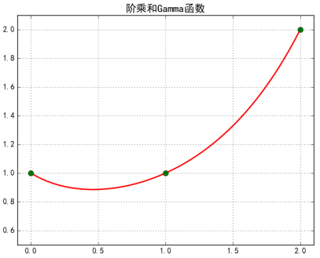
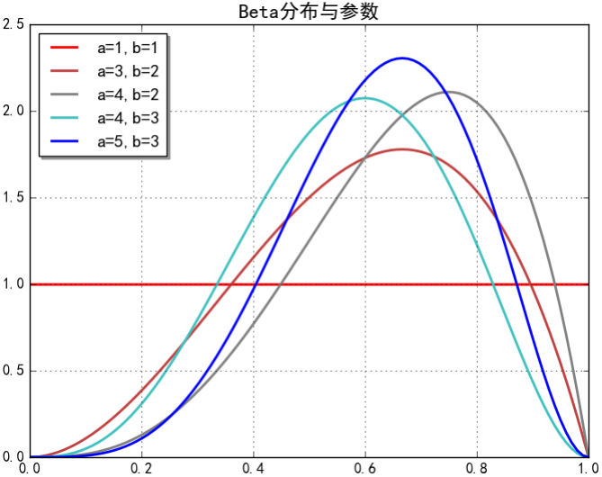

## 主题模型(LDA, Latent Dirichlet Allocation)

LDA的应用方向

- 信息提取和搜索，可用于语义分析
- 文档分类/聚类、文章摘要、社区挖掘
- 基于内容的图像聚类、目标识别及其他计算机视觉应用
- 生物信息数据的应用

朴素贝叶斯可以胜任许多文本分类问题，但无法解决语料中**一词多义**和**多词一义**的问题，可以把朴素贝叶斯看做是**词法分析**，而非**语义分析**。如果使用词向量作为文档的特征，一词多义和多词一义会造成计算文档间相似度的不准确性，为此，可以通过增加“主题”的方式，一定程度的解决这样的问题：

1. **一词多义**，一个词可能被映射到多个主题中，例如“大理”在小说中可能被映射为“武侠小说”，在旅游上下文中可能被映射为“旅游胜地”；
2. **多词一义**，多个词可能被映射到某个主题的概率很高。

### 1. LDA涉及的主要问题

####1.1 共轭先验分布

####1.2 Dirichlet分布

####1.3 LDA模型

**Gibbs采样算法及学习参数**

###2. Gamma函数与Beta分布

**$\Gamma$函数**

$$
\Gamma(x) = (x - 1) \cdot \Gamma(x - 1)  \Rightarrow \frac{\Gamma(x)}{\Gamma(x - 1) }= x - 1
$$
$\Gamma$函数是阶乘在实数上的推广，$\Gamma(x) = \int_{0}^{+\infin} t^{x-1}e^{-t}dt = (x-1)!$

**Beta分布**

Beta分布的概率密度函数为
$$
f(x) = \begin{cases}
\frac{1}{B(\alpha, \beta)} x^{\alpha -1}(1-x)^{\beta - 1}，x \in [0, 1] \\
0，\qquad 其他
\end{cases} \\
B(\alpha, \beta) = \int_{0}^{1} x^{\alpha-1}(1 - x)^{\beta-1}dx = \frac{\Gamma(\alpha)\Gamma(\beta)}{\Gamma(\alpha + \beta)}
$$
Beta分布的期望为
$$
E[X] = \int_0^1x \cdot \frac{1}{B(\alpha, \beta)}x^{\alpha-1} (1-x)^{\beta - 1}dx  \qquad \qquad \qquad \ \\\
= \frac{1}{B(\alpha, \beta)}\int_0^1x^{(\alpha+1) - 1} (1-x)^{\beta - 1}dx  \qquad \quad \ \ \ \ \\
= \frac{B(\alpha+1, \beta)}{B(\alpha, \beta)} =\frac{\Gamma(\alpha + \beta)}{\Gamma(\alpha)\Gamma(\beta)}  \cdot\frac{\Gamma(\alpha+1)\Gamma(\beta)}{\Gamma(\alpha +1+ \beta)}\\
= \frac{\alpha}{\alpha + \beta} \qquad \qquad \qquad \qquad \qquad \qquad  \qquad \ \ \ \
$$
可以得出：当$\alpha > \beta$时图形是左偏，当$\alpha < \beta$时图形是右偏。

###参考文献

[^1]: Blei D M, Ng A Y, Jordan M I. Latent dirichlet allocation[J]. Journal of machine Learning research, 2003, 3(Jan): 993-1022. 
[^2]: Hoffman M, Bach F R, Blei D M. Online learning for latent dirichlet allocation[C]//advances in neural information processing systems. 2010: 856-864. 
[^3]: Mihalcea R, Tarau P. Textrank: Bringing order into text[C]//Proceedings of the 2004 conference on empirical methods in natural language processing. 2004. 
[^4]: [Parameter estimation for text analysis - arbylon](http://www.arbylon.net/publications/text-est2.pdf)

