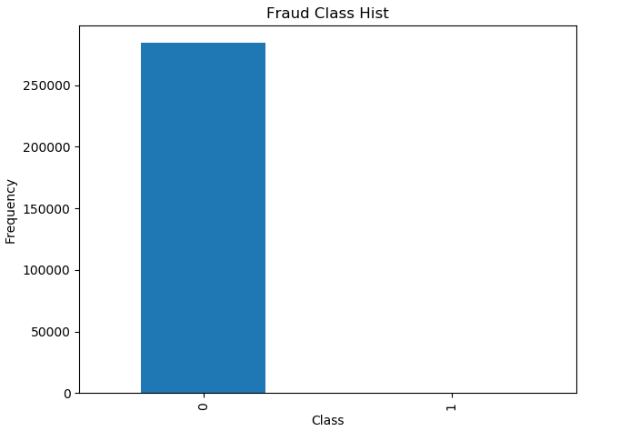
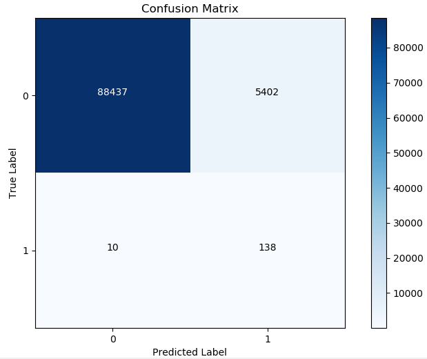

##线性回归[^1]


$$
h_{\theta}(x) = \theta_0 +\theta_1 x_1 + ... + \theta_n x_n = \sum_{i=0}^{n}\theta_i x_i = \theta^T x，其中x_0=1 \\

预测值与真实值得关系：
y^{{i}} = \theta^T x^{(i)} + \epsilon^{(i)}
$$
假设误差$\epsilon^{(i)}$ 是独立同分布，通常认为服从均值为0方差为$\sigma^2$ 的高斯分布，则有
$$
\epsilon^{(i)} = y^{(i)} - \theta^T x^{(i)} \\
p(\epsilon^{(i)}) = \frac{1}{\sqrt{2 \pi} \sigma} exp(- \frac{(\epsilon^{(i)})^2}{2 \sigma^2}) \\

p(y^{(i)} | x^{(i)}； \theta) = \frac{1}{\sqrt{2 \pi} \sigma} exp(- \frac{(y^{(i)} - \theta^T x^{(i)} )^2}{2 \sigma^2})
$$
$p(y^{(i)} | x^{(i)}； \theta) $中$\theta$ 为要求出的参数值，表示需要找到$\theta$ 值与$x^{(i)}$ 的组合后得到的预测值接近$y^{(i)}$ 的概率，概率值越大$\theta$ 参数越好。如何求出$\theta$ ?利用最大似然函数求出，对于所有样本来说，当概率值最大值时的$\theta$ 求法为
$$
L(\theta)  = \prod_{i=1}^m p(y^{(i)} | x^{(i)}； \theta) =  \prod_{i=1}^m  \frac{1}{\sqrt{2 \pi} \sigma} exp(- \frac{(y^{(i)} - \theta^T x^{(i)} )^2}{2 \sigma^2}) \\
l(\theta) = logL(\theta) = \sum_{i=1}^{m} log[\frac{1}{\sqrt{2 \pi} \sigma} exp(- \frac{(y^{(i)} - \theta^T x^{(i)} )^2}{2 \sigma^2}) ] \\
= m \cdot log\frac{1}{\sqrt{2 \pi} \sigma} - \frac{1}{\sigma^2} \cdot \frac{1}{2}\sum_{i=1}^{m}(y^{(i)} - \theta^T x^{(i)})^2 \\
若要使l(\theta)最大，则上式后半部分的越小越好 \\
目标函数：J(\theta) = \frac{1}{2} \sum_{i=1}^{m}(h_{\theta}(x^{(i)}) - y^{(i)})^2
$$

$$
J(\theta) = \frac{1}{2} \sum_{i=1}^{m}(h_{\theta}(x^{(i)}) - y^{(i)})^2 = \frac{1}{2}(x\theta  - y)^T( x \theta - y) \\
\triangledown J(\theta) = \triangledown [\frac{1}{2}(\theta^T x^T - y^T)( x \theta - y)] 
= \triangledown [\theta^T x^T x \theta - \theta^T x^T y - y^T x \theta + y^Ty] 
\\=\frac{1}{2}[2x^Tx\theta - x^Ty - (y^Tx)^T] = x^Tx\theta - x^Ty = 0 （矩阵求导）\\
\theta = (x^Tx)^{-1} x^T y
$$


```python
import matplotlib.pyplot as plt
import numpy as np 
from sklearn import datasets

class LinearRegression(object):
    def __init__(self):
        self.theta = None
    
    def fit(self, X, y):
        print(X.shape)
        # Insert constant ones for bias weights
        # 第0列插入x.shape[0]行值为1
        X = np.insert(X, 0, 1, axis=1)
        print(X.shape)

        X_ = np.linalg.inv(X.T.dot(X))
        self.theta = X_.dot(X.T).dot(y)

    def predict(self, X):
        # Insert constant ones for bias weights
        X = np.insert(X, 0, 1, axis=1)
        y_pred = X.dot(self.theta)
        return y_pred
        
def mean_squared_error(y_true, y_pred):
    mse = np.mean(np.power(y_true - y_pred, 2))
    return mse

def main():
    # 加载数据集
    diabetes = datasets.load_diabetes()

    # 422 * 1，样本数422个，特征为1个 shape=(422, 1)
    X = diabetes.data[:, np.newaxis, 2]
    print(X.shape)

    # 划分训练集、测试集
    x_train, x_test = X[:-20], X[-20:]
    y_train, y_test = diabetes.target[:-20] , diabetes.target[-20:]

    clf = LinearRegression()
    clf.fit(x_train, y_train)
    y_pred = clf.predict(x_test)

    # 打印平均平方差误差(Mean Squred Error)
    print('Mean Squared Error: ', mean_squared_error(y_test, y_pred))
    plt.scatter(x_test[:, 0], y_test, color='black')
    plt.plot(x_test[:, 0], y_pred, color='blue', linewidth=3)
    plt.show()
```


##逻辑（Logistic）回归和梯度下降[^2]

逻辑回归实际上做了一个分类的事，通常逻辑回归适用于做二元分类。


S型函数
$$
g(z) = \frac{1}{1 + e^{-z}} \\
g'(x) = \frac{e^{-x}}{(1 + e^{-x})^2} = \frac{1}{1 + e^{-x}}  \cdot \frac{e^{-x}}{1 + e^{-x}} \\ =  \frac{1}{1 + e^{-x}}  \cdot (1-  \frac{1}{1 + e^{-x}}) = g(x)(1 - g(x))
$$


sigmoid函数能够将任何一个实数映射要[0,1]区间上，看做成一个概率值。

逻辑斯特回归实际上是将预测值$\theta^Tx$ 作为输入通过Sigmoid函数转换为概率值，实际上是将预测值用做分类任务。

$$
h_{\theta}(x) = g(\theta^T x) = \frac{1}{1 + e^{-\theta^Tx}}
$$

逻辑回归用于进行二分类
$$
P(y=1|x;\theta) = h_{\theta}(x) \\
P(y=0|x;\theta) = 1 - h_{\theta}(x) \\
p(y|x;\theta) = (h_{\theta}(x))^y(1- h_{\theta}(x))^{(1-y)} 求x,\theta的组合使得y值最接近 \\
L(\theta) = p(y|x:\theta) = \prod_{i=1}^{m}p(y^{(i)}|x^{(i)};\theta) =\prod_{i=1}^{m} (h_{\theta}(x^{(i)}))^{y^{(i)}}(1- h_{\theta}(x^{(i)}))^{(1-y^{(i)})} \\
l(\theta) = logL(\theta) = \sum_{i=1}^{m} y^{(i)}logh(x^{(i)}) + (1 - y^{(i)}) log(1- h(x^{(i)}))
$$
但是此时通过求导等于零食得到不到对应$\theta$ 的解的，因此可以通过==梯度下降==方法 


## 案例：信用卡欺诈

###1. 数据导入数据分布

```python
import pandas as pd 
import matplotlib.pyplot as plt 
import numpy as np 

# 数据是已经提取好特征的数据
data = pd.read_csv(r'G:\data\creditcard.csv')
# print(data.head())

# Class分类为：0，1，认为0为正例，1为负例
# 样本特点：绝大部分为正例，只有少数部分为负样本
count_classes = pd.value_counts(data['Class'], sort=True).sort_index()
#0    284315
#1       492
#Name: Class, dtype: int64
count_classes.plot(kind='bar')
plt.title('Fraud Class Hist')
plt.xlabel('Class')
plt.ylabel('Frequency')
# plt.show()
```



###2. 数据分布不均的处理方法之下采样

```python
"""
对于数据分布极度不均的情况应该如何处理？这里有两种常用的解决方案：
    1. 过采样，采用样本生成策略，将其中样本量少的类别调整为与其他类别数据一样多。
        例如，这里生成1类别的样本，增加到284315。（同样多）
    2. 下采样，采用样本抽取策略，从其中样本量多的中抽取一部分，与其他类别数据一样少。
        例如，这里要0，1这两类样本的数目都会492，即从0类样本中取出492个。（同样少）
这两种类型，哪一种策略好一些？

机器学习对样本特征值的要求？
    要求特征值得变化区间相同，对特征值做归一化或标准化，让不同特征的重要程度是相当的。因此对于取值范围过大的特征值，学习算法会认为这个特征值大的重要程度也大。更
"""
from sklearn.preprocessing import StandardScaler
# 标准化特征值
data['normAmount'] = StandardScaler().fit_transform(data['Amount'].values.reshape(-1, 1))

"""
下采样方法
"""
X = data.loc[:, data.columns != 'Class']
y = data.loc[:, data.columns == 'Class']

# 计算异常样本数量
number_records_fraud = len(data[data.Class == 1])
# 获取异常样本对应的索引
fraud_indices = np.array(data[data.Class == 1].index)
# 获取正常样本对应的索引
normal_indices = data[data.Class == 0].index
# 随机从正常样本中选取与异常样本数量相同的样本
random_normal_indices = np.random.choice(normal_indices, number_records_fraud, replace=False)
random_normal_indices = np.array(random_normal_indices)
# 合并下采样得到的相同数量的负例、正例
under_sample_indices = np.concatenate([fraud_indices, random_normal_indices])
# 下采样样本数据
under_sample_data = data.iloc[under_sample_indices, :]

X_undersample = under_sample_data.iloc[:, under_sample_data.columns != 'Class']
y_undersample = under_sample_data.iloc[:, under_sample_data.columns == 'Class']
print("Total number of resampled data: {0}, of which normal sample number: \
         {1}, fraud sample number: {2}".format(len(under_sample_data), len(random_normal_indices), len(fraud_indices)))
```


###3. 模型建立与交叉验证

```python
"""
交叉验证
 实际上是一个求稳的操作，需要模型表现稳定，或者寻找合适参数时使用。
"""
from sklearn.model_selection import train_test_split
# 需要对原始数据集进行拆分，在模型训练完成后进行测试使用
X_train, X_test, y_trian, y_test = train_test_split(X, y, test_size=.33, random_state=1)
# 用于训练模型，模型训练完成后，需要使用原始数据进行测试
X_train_undersample, X_test_undersample, y_trian_undersample, y_tes_undersample = \
    train_test_split(
        X_undersample, 
         y_undersample, 
         test_size=.33, 
         random_state=1)
"""
建立模型
模型的评估标准
    1、精度，有时候不是很准确，特别是样本数据不均衡或预测结果错误会产生很大影响时，例如：检测并病人是否患病！
    2、召回率/查全率（recall），根据目标制定衡量标准，例如我们目标是检查得癌症的人，我们可以通过查看得癌症的10个病人中，
        模型检查不来了几个，若检查出来2个，则recall=2/10，从提高召回率来提升模型。
        TPR = TP / (TP + FN)
"""
from sklearn.linear_model import LogisticRegression
from sklearn.model_selection import KFold, cross_val_score
from sklearn.metrics import confusion_matrix, recall_score, classification_report

def print_kfold_scores(x_train, y_train):
    kf = KFold(n_splits=5, shuffle=False)
    # 正则化惩罚项参数，最速下降法中的theta参数浮动（变换）需要稳定，否则会出现过拟合。
    # 对于从theta波动较大的情况添加惩罚项。
    # 惩罚项：
    #   1. l2正则化： 表示损失函数后加上1/2*w^2，其中W为权重参数，惩罚项惩罚的是权重参数
    #   2. l1正则化： 表示损失函数后加上|w|
    # C就是该惩罚项的系数，表示惩罚的粒度。
    c_params = [0.001, 0.01, 0.1, 1, 10, 100, 1000]

    result_table = pd.DataFrame(
        index= range(len(c_params), 2), 
        columns=['C_parameter', 'Mean recall score'], 
        dtype=(float, float))
    result_table['C_parameter'] = c_params

    j = 0
    for c_param in c_params:
        print('---------------------------------------')
        print('C Parameter: ', c_param)
        print('---------------------------------------\n')

        recall_scores = []
        for niter, indices in enumerate(kf.split(y_train), start=1):
            # 建立模型，采用惩罚粒度，和惩罚项策略
            lr = LogisticRegression(C= c_param, penalty='l1')

            lr.fit(
                x_train.iloc[indices[0], :],
                y_train.iloc[indices[0], :].values.ravel()
            )
            # 取交叉验证中的验证集
            y_pred_undersample = lr.predict(x_train.iloc[indices[1], :].values)

            recall_acc = recall_score(y_train.iloc[indices[1],:].values, y_pred_undersample)
            recall_scores.append(recall_acc)
            print('Iteration: ',niter, 'Recall Score = ', recall_acc)
        
        result_table.ix[j, 'Mean recall score'] = np.mean(recall_scores)
        j += 1
        print('Mean recall score: ', np.mean(recall_scores))
    print(result_table)

    best_c = result_table.iloc[result_table['Mean recall score'].idxmax()]['C_parameter']
    print('****************************************************************************')
    print('Best model to choose from cross validation is with C parameter = ', best_c)
    print('***************************************************************************')

    return best_c

best_c = print_kfold_scores(X_train_undersample, y_trian_undersample)
```

###4. 混淆矩阵与下样本的负作用

**模型评估标准：召回率（recall）**

| Prediction  | Observation           |                       |
| ----------- | --------------------- | --------------------- |
|             | Admitted(1)           | Rejected(0)           |
| Admitted(1) | True Positive (TP)，  | False Positive (FP)， |
| Rejected(0) | False Negative (FN)， | True Negative (TN)，  |

假如某个班级有男生80人，女生20人，共计100人。目标是找出所有女生。现在某人挑出50人，其中20人是女生，另外还错误的把30个男生也当作女生挑选出来了。

|            | 相关，正类                           | 无关，负类                           |
| ---------- | ------------------------------------ | ------------------------------------ |
| 被检索到   | TP，正类判定为正类，确实是女生       | FP，负类判定为正类，男生被判定为女生 |
| 未被检索到 | FN，正类判定为负类，女生被判定为男生 | TN，负类判定为负类，男生被判定为男生 |

通过上述表格，可以清楚的得到：TP=20，FP=30，FN=0，TN=50

**True Positive Rate(Sensitivity)**

TPR指标衡量模型检测正例的效果，例如用模型检测病人是否患癌症，TP表示患病的人被正确的检测出来了，而FN则是患病的人被认为是正常的，这时候结果就严重的，在这个问题上需要考虑TPR，否则好多人会因为这个模型而受难。
$$
TPR =  \frac{True  \ Positives}{True \  Positives + False \  Nagetives}
$$
**True Negative Rate**

TNR指标衡量模型检测负例例的效果，例如用模型检测病人是否患癌症，TP是没患癌症的人被正确的检测出来了，TN是没患病的人被检测出来患有癌症。
$$
TNR = \frac{True \ Negative}{False \ Positive + True \ Negative}
$$
为什么说精度经常是不准确的、有欺骗性？例如有100个样本，其中有90个样本是属于1这个类别，而10个样本属于0这个类别，让分类器预测，假设模型全部预测为1类别，则精度也有90%，因此精度在样本非常不平衡的条件下是非常不准确的。很多情况下需要衡量TPR、TNR指标。


```python
"""
混淆矩阵：x轴表示预测试，y轴表示观测值，可以通过混淆举证算出精度，召回率。
y轴
| (0, 0)表示TN，(0, 1)表示FP
|
| (1, 0)表示FN，(1, 1)表示TP
-----------------------------> x轴
"""
import itertools

lr = LogisticRegression(C=best_c, penalty='l1')
lr.fit(X_train_undersample, y_trian_undersample.values.ravel())
y_pred_undersample = lr.predict(X_test_undersample.values)

# 画出混淆矩阵
cnf_matrix = confusion_matrix(y_tes_undersample, y_pred_undersample)
np.set_printoptions(precision=2)
print('Recall metrix in the testing dataset:', cnf_matrix[1,1] / (cnf_matrix[1, 0] + cnf_matrix[1,1]))

def plot_confusion_matrix(cm, classes, title='Confusion Matrix', cmap=plt.cm.Blues):
    plt.imshow(cm, interpolation='nearest', cmap=cmap)
    plt.title(title)
    plt.colorbar()
    tick_marks = np.arange(len(classes))
    plt.xticks(tick_marks, classes, rotation=0)
    plt.yticks(tick_marks, classes)

    thresh = cm.max() / 2.
    for i, j in itertools.product(range(cm.shape[0]), range(cm.shape[1])):
        plt.text(j, i, cm[i, j], horizontalalignment='center', color='white' if cm[i,j] > thresh else 'black')
    
    plt.tight_layout()
    plt.ylabel('True Label')
    plt.xlabel('Predicted Label')

# plot non-normalized confusionmatrix
class_names = [0, 1]
plt.figure()
plot_confusion_matrix(cnf_matrix, classes=class_names, title='Confusion Matrix')
plt.show()
```

**TNR过大**，下图是针对原始数据的样本进行预测，这里(0,1)表示FP，即没有问题的数据采用该模型预测出来了问题，这里的值不影响召回率，但是误杀了太多！！这个是**下采样的负作用**。



```python
"""
基于下采样建立的模型在原始数据集上进行预测
"""
lr = LogisticRegression(C=best_c, penalty='l1')
lr.fit(X_train_undersample, y_trian_undersample.values.ravel())
y_pred = lr.predict(X_test.values)

# 画出混淆矩阵
cnf_matrix = confusion_matrix(y_test, y_pred)
np.set_printoptions(precision=2)
print('Recall metrix in the testing dataset:', cnf_matrix[1,1] / (cnf_matrix[1, 0] + cnf_matrix[1,1]))

# plot non-normalized confusionmatrix
class_names = [0, 1]
plt.figure()
plot_confusion_matrix(cnf_matrix, classes=class_names, title='Confusion Matrix')
plt.show()
```

### 5. 逻辑回归阈值对结果的影响


```python
"""
逻辑回归阈值对结果的影响
在sigmoid函数中将>0.5认为是1，我们希望预测结果大于0.6时才将预测结果认为是1，因此需要调整阈值实现。
"""
lr = LogisticRegression(C=best_c, penalty='l1')
lr.fit(X_train_undersample, y_trian_undersample.values.ravel())
y_pred_undersample_proba = lr.predict_proba(X_test_undersample.values)

thresholds = [0.1, 0.2, 0.3, 0.4, 0.5, 0.6, 0.7, 0.8, 0.9]
# plt.figure(figsize=(10, 10))

j = 1
for i in thresholds:
    y_test_predictions_high_recall = y_pred_undersample_proba[:, 1] > i
    plt.subplot(3, 3, j)

    cnf_matrix = confusion_matrix(y_test_undersample, y_test_predictions_high_recall)
    np.set_printoptions(precision=2)

    print("Recall Metrix in test datasets: ", cnf_matrix[1, 1] / (cnf_matrix[1,1] + cnf_matrix[1, 0]))
    class_names = [0, 1]
    plot_confusion_matrix(cnf_matrix, classes=class_names, title='threshold > 0.%d' % j)
    j += 1
plt.tight_layout()
plt.show()
```

###6. 数据分布不均匀处理方法之过采样（SMOTE算法）

通过上面第4节的分析可以知道**下采样的负作用**会导致误差率很高，即负例被预测为正例。

**SMOTE样本生成策略**

1. 对于少数类中每一个样本x，以欧式距离为标准计算它到少数类样本集中所有样本的距离，得到其K近邻；

2. 根据样本不平衡比例设置一个采样比例以确定采样倍率N，对于每一个少数类样本X，从其k近邻中随机选择若干样本，假设选择的近邻为$xn$；

3. 对于每一个随机选出的近邻$xn$，分别与原样本按照如下的公式构建新的样本
   $$
   X_{new} = X_i + rand(0, 1) \times d，其中d=(\widetilde{X}- X)为欧式距离
   $$


如下图所示，其中星型样本量比较少，假设$k=6$, 且$x_i$到其他六个点距离分别为$d_1,d_2,...,d_6$，则依次将距离带入公式$x_{new} = x_i + rand(0,1) \times d_j, j=1,2,...,6$中即可得到6个新的点。


**使用SMOTE算法需要安装imblearn模块** 

```
pip install -U imblearn
```

**使用SMOTE算法生成数据**：只能在训练集上生成，测试集上要原封不动。

```python
from sklearn.linear_model import LogisticRegression
from sklearn.model_selection import train_test_split
from imblearn.over_sampling import SMOTE
import matplotlib.pyplot as plt 
import pandas as pd 
import numpy as np 

# 数据是已经提取好特征的数据
data = pd.read_csv(r'G:\data\creditcard.csv')
# print(data.head())

columns = data.columns
# The label "Class" is in the last column, simply remove it to obtain features column
features_columns = columns.delete(len(columns) - 1)

features = data[features_columns]
labels = data['Class']

features_train, features_test, labels_train, labels_test = \
    train_test_split(
        features, labels, 
        test_size=0.2, random_state=0)

# 过采样，只需要对训练集生成样本，而对于测试集保持原封不动！！
oversampler = SMOTE(random_state=0)
# 此函数完成后就会生成相应的数据
os_features, os_labels = oversampler.fit_sample(features_train, labels_train)
os_features, os_labels = pd.DataFrame(os_features), pd.DataFrame(os_labels)

# 获取最优惩罚项系数
best_c = print_kfold_scores(os_features, os_labels)
"""
   C_parameter  Mean recall score
0        0.001           0.927782
1        0.010           0.934018
2        0.100           0.935148
3        1.000           0.935212
4       10.000           0.935368
5      100.000           0.935383
6     1000.000           0.935286
"""
```

接下来采用第3、4、5节中方法对测试数据进行分析，通过查看该模型的召回率、和误杀率可以知道，过采样的召回率与下采样的召回率相比稍微低了一些，但过采样的误杀率却大大降低了，过采样模型整体的准确度提升了。

**总结**：当数据不平衡时，能尽量多使用数据就尽量多使用，因此采用**过采样**策略是首选，数据越多对于建立模型越有利。

##案例：信用贷款


```python
import pandas as pd 

# 该数据有145个特征
data = pd.read_csv(r'G:\data\LoanStats3a.csv', skiprows=1)
print(data.index)

# 去除空行，没有用的特征列
half_count = len(data) / 2
data = data.dropna(thresh=half_count, axis=1)
# data = data.drop(['desc', 'url'], axis=1)
# data.to_csv('load_2007.csv', index=False)
data.drop_duplicates()

"""
特征预处理
    1、去除不重要的特征
    2、识别Label特征列：loan_status
"""
data  = data.drop(['funded_amnt', 'funded_amnt_inv', 'grade', 'sub_grade'], axis=1)

# 将label值转换为数值类型
data = data[(data['loan_status'] == 'Fully Paid') | (data['loan_status'] == 'Charged Off')]
status_replace = {
    'loan_status': {
        'Fully Paid': 1,
        'Charged Off': 0
    }
}
data = data.replace(status_replace)
# print(data['loan_status'].value_counts())

#把所有特征中值是一样的列删除
origin_cols = data.columns
drop_cols = []
for col in origin_cols:
    col_series = data[col].dropna().unique()
    if len(col_series) == 1:
        drop_cols.append(col)
print(drop_cols)
data = data.drop(drop_cols, axis=1)

"""
1、缺失值，若缺失值数量比较少直接去掉即可，若是很多可以考虑将这个列去掉；
2、字符值处理，
"""
null_counts = data.isnull().sum()
print(null_counts)

# 查看特征类型，有23个字符型的需要处理
print(data.dtypes.value_counts())
# object     23
# float64    16
# int64       1

object_columns_df = data.select_dtypes(include=['object'])
print(object_columns_df.iloc[0])
# term                         36 months
# int_rate                        10.65%
# emp_title                          NaN
# emp_length                   10+ years
# home_ownership                    RENT
cols = ['home_ownership', 'emp_length', '']


"""
    目标是：利润最大化
    要求： 高recall率，低fall out率
    recall   = TPR = TP / (TP + FN)
    fall out = FPR = FP / (TN + FP)
    当recall和fall out都非常高，这样结果不准确，问题是在于样本不均衡，需要采用下样本或过样本进行处理后再训练模型。
"""

# 给回归模型添加权重项
from sklearn.linear_model import LogisticRegression
from sklearn.model_selection import KFold, cross_val_score
from sklearn.metrics import confusion_matrix

penalty = {
    0: 10,
    1: 1
}
lr = LogisticRegression(class_weight=penalty)
kf = KFold(n_splits=3, random_state=1)
# pred = cross_val_score(lr, features, target, cv=kf)
# pred = pd.Series(pred)
# tn, fp, fn, tp = confusion_matrix(y_true, y_pred)
```

##模型优化方法

1. we can tweak the penalties further.
2. we can try models other than a random forest and logistic regression;
3. we can use some of the columns we discarded to generate better features;
4. we can ensemble multiple models to get more accurate predictions.
5. we can tune the parameters of the algorithm to achieve higher performance.

***

[^1]: [机器学习知识体系之线性回归](https://www.cnblogs.com/wdsunny/p/6362582.html)
[^2]: [线性回归,逻辑回归与梯度下降]()https://www.cnblogs.com/futurehau/p/6105011.html

