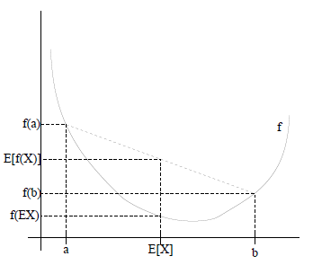

## 期望最大化法（Expectation Maximum，EM）

解决问题：极大似然法用于根据样本数据进行参数估计，但有时观察数据中有“隐含数据”，对于包含“隐含数据”和未知参数的模型，就无法使用极大似然法求解模型分布参数。

EM是一种启发式迭代算法，首先猜测隐含数据（E步），然后基于猜测的数据结合极大似然法求解模型参数（M步）。由于隐含数据是猜测的，因此基于猜测得到的模型是不准确的，接下来继续猜测隐含数据（E步），然后基于猜测和极大似然法求解模型参数，如此循环迭代，直到模型参数基本无变化，则算法收敛并得到模型参数。

范例：KMeans算法是一种EM算法，其中隐含数据为簇的质心，开始时假设K个初始的质心（E步），然后计算得到每个样本最近的质心并把样本归为距离最近质心属于的聚簇（M步），如此循环迭代直到质心不再变化，算法收敛。

**凸函数**

设$f$是定义在实数域上的函数，如果对于任意的实数都有$f'' \ge 0$，那么f是凸函数。若x不是单个实数，而是由实数组成的向量，此时函数$f$的Hessian矩阵$H$是半正定的$H \ge 0$。

**Jensen不等式**

如果函数$f$是凸函数，x是随机变量，那么$E[f(x)]  \ge f(E[x])$，特别地，若$f$为严格凸函数，那么$E[f(x)]=f(x[x])$当且仅$P(x=E[x])=1$，即随机变量x为常量，具体如下图所示。若函数$f$为凹函数，上述符号正好相反。

###算法推导

对于m样本观察数据$x=(x^{(1)},x^{(2)},...,x^{(m)})$，找出样本模型参数$\theta$，目标函数为极大化模型分布的对数似然函数
$$
L(\theta)  = arg \ max_{\theta} \sum_{i=1}^{m} logP(x^{(i)}|\theta)
$$
如果我们得到的观察数据有未观察到的隐含数据$z=(z^{(1)},z^{(2)},...,z^{(m)})$，则对应的目标函数为
$$
L(\theta)  = arg \ max_{\theta} \sum_{i=1}^{m} log \sum_{z^{(i)}}P(x^{(i)}，z^{(i)}|\theta)
$$
其中第一个加和表示对极大似然取对数，而第二个加和是对每个样本的每个可能类别z求联合分布概率和。上面式子是要直接求出$\theta$比较难，因为有隐含变量z存在，若确定了z值后求解就比较简单了。

对于每一样本$i$，令$Q_i$为该样本隐含变量$z$的分布，则$Q_i$满足条件$\sum_z Q_i(z)=1，Q_i(z) \ge 0$（若z是连续性的，那么$Q_i$为概率密度函数，公式就得使用求和变成积分符号）。例如：要对班上的学生聚类，若隐含变量$z=身高$，那么$z$就服从连续的高斯分布；若隐含变量$z=\{男、女\}$，那么$z$就服从贝努利分布。下面对式子做如下缩放
$$
\sum_{i=1}^{m} log \sum_{z^{(i)}} Q_i(z^{(i)}) \ \frac{P(x^{(i)}，z^{(i)}|\theta)}{Q_i(z^{(i)})} \ge \sum_{i=1}^{m}  \sum_{z^{(i)}} Q_i(z^{(i)}) \ log\frac{P(x^{(i)}，z^{(i)}|\theta)}{Q_i(z^{(i)})} \tag{1}
$$
由**Jensen不等式**得到：若 f为凹函数，则$f(E(x)) \ge E(f(x))$。其中$ \sum_{z^{(i)}} Q_i(z^{(i)}) \ log\frac{P(x^{(i)}，z^{(i)}|\theta)}{Q_i(z^{(i)})} $是$\frac{P(x^{(i)},z^{(i)}|\theta)}{Q_i(z^{(i)})}$基于条件概率$Q_i(z^{(i)})$的期望。期望公式为
$$
设Y是随机变量X的函数，Y=g(X)，\qquad \qquad \qquad \qquad \qquad \qquad \qquad \qquad \qquad \qquad \qquad \\
1.若X是离散型随机变量，它的分布规律为P(X=x_k)=p_k，若\sum_{k=1}^{\infty}g(X_k)p_k绝对收敛，\\
则有E[Y]=E[g(X)]=\sum_{k=1}^{\infty}g(X_k)p_k。\\
2. 若X是连续型随机变量，它的密度函数为f(x)，若\int_{-\infty}^{\infty}g(x)f(x)dx绝对收敛，\qquad \quad\\
则有E[Y]=E[g(X)]=\int_{-\infty}^{\infty}g(x)f(x)dx
$$
则对于公式(1)来说 ，Y是$\frac{P(x^{(i)},z^{(i)}|\theta)}{Q_i(z^{(i)})}$，X是$z^{(i)}$，$Q_i(z^{(i)})$则是$p_k$，而$g$是$z^{(i)}$到$\frac{P(x^{(i)},z^{(i)}|\theta)}{Q_i(z^{(i)})}$的映射，再结合Jensen不等式就可以得到(1)式。

这个过程可以看做是对$L(\theta)$求下界，对于$Q_i(z^{(i)})$有多种选择，那种更好？假设$\theta$已给定，则$L(\theta)$的值就决定于$Q_i(z^{(i)})$和$P(x^{(i)},z^{(i)})$，我们可以通过调整这两个概率使上下界不断上升，以逼近$L(\theta)$的真实值，那么什么时候算是调整好了呢？当不等式变成等式时，说明调整后的概率能够等价于$L(\theta)$了。根据**Jensen不等式**，若要等号成立需要让随机变量变成常数，则有$\frac{P(x^{(i)}，z^{(i)}|\theta)}{Q_i(z^{(i)})} =  c$，其中c为常数不依赖于$z^{(i)}$。由于$Q_i(z^{(i)})$是一个 分布，所以满足$\sum_{z^{(i)}}Q_i(z^{(i)})=1$ ，那么就有$\sum_zP(x^{(i)}，z^{(i)}|\theta)=c$ (多个等式分子分母相加不变，这里认为每一个样本的两个概率比值都是c)，从而可得
$$
Q_i(z^{(i)})=\frac{P(x^{(i)}，z^{(i)}|\theta)}{\sum_zP(x^{(i)}，z^{(i)}|\theta)} =\frac{P(x^{(i)}，z^{(i)}|\theta)}{P(x^{(i)}|\theta)} = Q(z^{(i)}|x^{(i)}, \theta)
$$
至此，得到了在固定其他参数$\theta$后，$Q_i(z^{(i)})$的计算公式就是后验概率，**解决了$Q_i(z^{(i)})$如何选择的问题，这就是E步，建立 了$L(\theta)$的下界**。

接下来就是给定$Q_i(z^{(i)})$后，调整$\theta$去极大化$L(\theta)$的 下界。如果能极大化这个下界，则也在尝试极大化对数似然。需要最大化下式
$$
\sum_{i=1}^{m}  \sum_{z^{(i)}}Q_i(z^{(i)}) \ log\frac{P(x^{(i)}，z^{(i)}|\theta)}{Q_i(z^{(i)}))}
$$
去掉上式中为常数的部分，则我们需要极大化的对数似然下界为
$$
\sum_{i=1}^{m} \sum_{z^{(i)}} Q_i(z^{(i)}) \ logP(x^{(i)}，z^{(i)}|\theta) \Rightarrow  （M步）
$$
上式也就是**EM算法的M步**。

###EM算法流程

`输入`：观察数据$x=(x^{(1)},x^{(2)},...,x^{(m)})$，联合分布$P(x,z|\theta)$，条件分布$P(z|z,\theta)$，最大迭代次数为J；

`输出`：模型参数$\theta$

1. 随机初始化模型参数$\theta^{(0)}$

2. 开始EM算法迭代$for \   j  \leftarrow 1 \ to \ J$

   1. E步，计算联合分布的条件概率期望
      $$
      Q_i(z^{(i)}) =  P(z^{(i)} | x^{(i)},\theta^{(i)}) \\
      L(\theta, \theta^{(j)})=\sum_{i=1}^{m}\sum_{z^{(i)}} Q_i(z^{(i)}) \ logP(x^{(i)}，z^{(j)}|\theta)​
      $$

   2. M步，极大化$L(\theta, \theta^{(j)})$，得到$\theta^{(j+1)}$
      $$
      \theta^{(j+1)} =  arg \ max _{\theta} L(\theta, \theta^{(j)})
      $$

   3. 如果$\theta^{(j+1)}$已收敛，则算法结束。否则继续回到步骤1进行E步迭代

**EM算法的收敛性分析**

针对EM算法需要思考两个问题：1. EM算法能保证收敛吗？2. EM算法如果收敛，能保证收敛到全局最大值 吗？

针对第一个问题，要证明EM算法收敛，则需要证明对数最大似然估计单调增加，则有最大似然估计可以达到最大值。假设在EM算法的第$j、j+1$次迭代得到的$\theta^{(j)}、\theta^{(j+1)}$，则需要证明$L(\theta^{(j+1)}) \ge L(\theta^{(j)})$，选定$\theta^{(j)}$后，得到E步$Q_i(z^{(i)})=P(z^{(i)}|x^{(i)},\theta^{(j)})$，这一步保证了给定$\theta^{(j)}$时，Jensen不等式中的等式成立即有：
$$
L(\theta,\theta^{(j)}) = \sum_{i=1}^{m} \sum_{z^{(i)}} P(z^{(i)}|x^{（i)}, \theta^{(j)})logP(x^{(i)}, z^{(i)}|\theta)
$$
 然后进行M步，固定$Q_i^{(j)}(z^{(i)})$，并将$\theta^{(j)}$视作变量，对上式$L(\theta^{(j)})$求导得到$\theta^{(j+1)}$
$$
H(\theta,\theta^{(j)}) = \sum_{i=1}^{m}\sum_{z^{(i)}}P(z^{(i)}|x^{(i))},\theta^{(j))})logP(z^{(i))}|x^{(i))},\theta)
$$
上述两式相减可以得到
$$
\sum_{i=1}^{m}logP(x^{(i)}|\theta) = L(\theta, \theta^{(j)}) - H(\theta, \theta^{(j)})
$$
在上式子中分别取$\theta$为$\theta^{(j)}、\theta^{(j+1)}$并相减可以得到 
$$
\sum_{i=1}^{m}log P(x^{(i)}|\theta^{(j+1)}) - \sum_{i=1}^{m}log P(x^{(i)}|\theta^{(j)}) \\= [L(\theta^{(j+1)},\theta^{(j)}) - L(\theta^{(j)},\theta^{(j)})] - [H(\theta^{(j+1)},\theta^{(j)}) - H(\theta^{(j)},\theta^{(j)})]
$$
要证明EM算法的收敛性，我们只需要证明上式的右边是非负即可。由于$\theta^{(j+1)}$使得$L(\theta,\theta^{(j)})$极大，因此有
$$
L(\theta^{(j+1)}, \theta^{(j)})  - L(\theta^{(j)}, \theta^{(j)}) \ge 0
$$
而对于第二部分有
$$
H(\theta^{(j+1)},\theta^{(j)}) - H(\theta^{(j)},\theta^{(j)}) = \sum_{i=1}^{m} \sum_{z^{(i)}} P(z^{(i)}|x^{(i)},\theta^{(j)}) log \frac{P(z^{(i)}|x^{(i)},\theta^{(j+1)})}{P(z^{(i)}|x^{(i)},\theta^{(j)})} \\
\le \sum_{i=1}^{m} log(\sum_{z^{(i)}}P(z^{(i)}|x^{(i)}, \theta^{(i)})\frac{P(z^{(i)}|x^{(i)},\theta^{(j+1)})}{P(z^{(i)}|x^{(i)},\theta^{(j)})}) \ (Jensen不等式)\\
= \sum_{i=1}^{m} log(P(z^{(i)}|x^{(i)}, \theta^{(j+1)})) =  0 \ (概率分布累积为1)
$$
所以可以得到$\sum_{i=1}^{m}log P(x^{(i)}|\theta^{(j+1)}) - \sum_{i=1}^{m}log P(x^{(i)}|\theta^{(j)}) \ge 0$，$L(\theta)$是单调增加的，EM算法收敛，一种收敛是$L(\theta)$不在变化，另一种是变化幅度小。

从上述推导公式可以直到，EM算法可以保证收敛到一个稳定点，但是却不能保证收敛到全局的极大值点，因此它是局部最优算法。若优化目标$L(\theta,\theta^{(j)})$是凸的，则EM算法可以保证收敛到最大值，E步固定$\theta$优化 $Q$，M步固定$Q$优化$\theta$。

###算法举例

