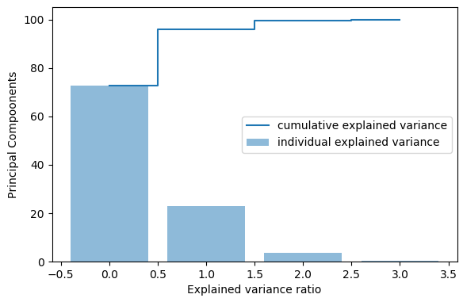
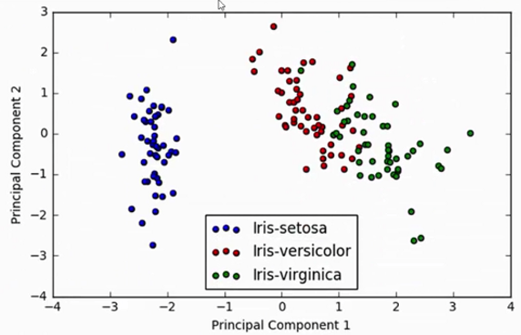
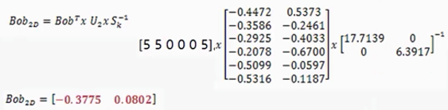

#降维算法

##一、PAC降维算法

考虑如下数据集，在对其进行分类时无论怎么划分都无法将红色点和绿色点分开，这就说明当前的特征取得不是特别好，没有将数据分开。在哪提取特征时，需要什么样的特征的呢？


对于下图中的样本点，分别采用a线和b线对其进行划分，通过比较样本点在两条线上的分布差异情况(用方差衡量)，我们希望线能够使得点的分布差异大点，此时的数据特征它的效果就比较好一些。


**PCA基本原理**

两个特征j与k的之间的协方差，即两个特征的相关程度(正相关、负相关、无关)
$$
\sigma_{jk} = \frac{1}{n-1} \sum_{i=1}^{n} (x_{ij} - \overline{x}_j)(x_{ik} - \overline{x}_k)
$$
协方差矩阵
$$
\Sigma = \frac{1}{n-1}((X - \overline{x})^T(X - \overline{x})) ，\quad \overline{x} = \frac{1}{n}\sum_{k=1}^{n}x_i
$$
测试数据集为iris，假设原始数据为$150*4$的数据，我们想对其进行维度压缩成$150*2$的数据，那么只需要将原始数据乘以$4*2$的矩阵就可以实现降维，那么应该如何得到这个$4*2$的矩阵呢？
$$
[150*4] \times [4*2] = [150*2]
$$
对于协方差举证，我们可以求其特征值和特征向量，每个特征向量为$4*1$的列向量，我们只需要拿出其中的两个特征向量就可以，那么应该拿哪两个特征向量呢？通过特征值来确定选取哪两个，特征值可以看做是当前向量的重要程度，这样只取出其中的两个特征值大对应的特征向量就行。

那么如何确定特征值得重要程度呢？首先对特征值进行归一化操作，然后将其变成百分数，通过查看比例确定那几个特征值重要。下图是归一化后，特征值的柱状图。



在对卷尾花数据进行降维后，在对其进行分类可以看到其效果会好一点，降维过程实现如下。



```python
import matplotlib.pyplot as plt
from sklearn.preprocessing import StandardScaler
import sklearn.datasets as datasets
import numpy as np

iris = datasets.load_iris()
X = iris.data 
# 对数据进行标准化，让样本值浮动在相同区间上
X_std = StandardScaler().fit_transform(X)

# 协方差矩阵
mean = np.mean(X, axis=0)
cov_matrix = np.cov(X_std.T)
# cov_matrix = (X_std - mean).T.dot((X_std - mean)) / (X_std.shape[0] - 1)

# 计算协方差矩阵的特征值、特征向量
eig_vals, eig_vecs = np.linalg.eig(cov_matrix)

sum_eig_vals = sum(eig_vals)
var_exp = [(i / sum_eig_vals)*100 for i in sorted(eig_vals, reverse=True)]
# [72.77045209380135, 23.030523267680632, 3.683831957627383, 0.5151926808906346]

#可视化查看特征向量的重要程度
cum_var_exp = np.cumsum(var_exp)
plt.figure(figsize=(6, 4))
plt.bar(range(4), var_exp, alpha=0.5, align='center', 
        label='individual explained variance')
plt.step(range(4), cum_var_exp, where='mid',
        label='cumulative explained variance')
plt.xlabel('Explained variance ratio')
plt.ylabel('Principal Compoonents')
plt.tight_layout()
plt.legend()
# plt.show()

# make a list of (eigenvalue, eigenvector) tuples
eig_pair = [(np.abs(eig_vals[i]), eig_vecs[:, i]) for i in range(len(eig_vals))]
# sort the eig_pair from high to low
eig_pair.sort(key= lambda x: x[0], reverse=True)
#获取最重要的两个特征值对应的特征向量
matrix_w = np.hstack((eig_pair[0][1].reshape(4, 1),
                      eig_pair[1][1].reshape(4, 1)))
```

##二、奇异值分解（SVD，Singular Value Decomposition）及应用

奇异值分解可以看成是特征值问题的扩展，`针对非方阵` ,  设A为$M \times N$ 的矩阵，满足$A^HA、AA^H$ 分别是$N \times N$、$M \times M $的 Hermitian方阵，Hermitian方阵的特征值是`实数且是非负的`，并且在Hermitian方阵$A^HA、AA^H$中`最多有min(M, N)个相同的非零特征值` 。设这些非负特征值为$\sigma_{i}^2$ ，那么这些特征值开根号后的即为矩阵A的奇异值，矩阵$A^HA$ 的列特征向量构成了$N \times N$的unitary矩阵$V $ ，而矩阵$AA^H$ 的列特征向量构成的$M \times M$ 的unitary矩阵U，奇异值构成的$M \times N$对角矩阵$\Sigma$  ，则：
$$
A = U \Sigma V^H \\
 hermitian \  matrix \ D \ 满足 D^H = D \\
 unitary \ matrix \ D \ 满足 D^HD = I = DD^H \rightarrow D^{-1} = D^H
$$
就是A的一个奇异分解。每一个矩阵都存在一个奇异值分解。有时候奇异值称为矩阵的A的谱(spectrum)。`linalg.svd` 返回$U，\sigma_{i} 数组，V^H $ ，`linalg.diagsvd` 返回奇异值构成的对角矩阵$\Sigma$ `linalg.svdvals` 仅仅返回矩阵的奇异值。

```python
import numpy as np
from scipy import linalg
A = np.array([[1,2,3],[4,5,6]])
#array([[1, 2, 3],
#      [4, 5, 6]])

M,N = A.shape
U,s,Vh = linalg.svd(A)
Sig = linalg.diagsvd(s,M,N)

U, Vh = U, Vh
#array([[-0.3863177 , -0.92236578],
#      [-0.92236578,  0.3863177 ]])
#Sig
#array([[ 9.508032  ,  0.        ,  0.        ],
#      [ 0.        ,  0.77286964,  0.        ]])
#Vh
#array([[-0.42866713, -0.56630692, -0.7039467 ],
#      [ 0.80596391,  0.11238241, -0.58119908],
#      [ 0.40824829, -0.81649658,  0.40824829]])

U.dot(Sig.dot(Vh)) #check computation
#array([[ 1.,  2.,  3.],
#      [ 4.,  5.,  6.]])
```

**矩阵乘以向量相当于对向量做了线性变换**，如下图所示，将向量乘以矩阵$M=\left [ \begin{matrix}  1 & 1 \\ 0 & 1   \end{matrix} \right ]$，则其实是在平面上对一个轴进行的拉伸变换(如蓝色箭头所示)，在图中蓝色的箭头适应最**主要**的变化方向(变化方向可能有不止一个)，**如果我们想要描述好一个变换，那我们就描述好这个变换主要的变化方向就好了**。SVD分解的式子中，$\Sigma$矩阵是一个对角阵，里面的特征值是由大到小排列的，这些特征值所对应的特征向量就是描述这个矩阵变化方向（从主要变化到次要变化排列）。


在机器学习中通常需要提取最重要的特征，那么可以根据SVD分解后特征值越大对应的的特征向量就越重要来得到重要特征，忽略哪些不是太重要的特征。因此对于一个原始数据$M*N$，我们希望提取其中最重要的R个特征的数据，则对原来的矩阵$A_{M,N}$可以变换为
$$
A_{m,n} \approx U_{M,R} \times \Sigma_{R,R} \times V_{R,N} 
$$


上图是一个单词与标题的频率矩阵，例如单词rich在标题6中出现了2次。通过SVD分解上述矩阵可以得到如下图所示的三个矩阵。首先，左奇异向量的第一列表示每一个词的出现频繁程度，虽然不是线性的，但是可以认为是一个大概的描述，比如book是0.15对应文档中出现的2次，investing是0.74对应了文档中出现的9次，rich是0.36对应文档中出现了3次。其次，右奇异向量中第一行表示每一篇文档中的出现词的个数的近似，比如T6是0.49出现了5个单词，T2是0.22出现了2个单词。


**SVD推荐系统应用实例**

假设我们有一个矩阵，矩阵每一列代表一个user，每一行代表一个物品。矩阵的值得含义是用户对某个物品的评分，若为0表示用户还没有买这个物品。


对上述$6*4$的矩阵进行SVD分解，我们希望只提取其中的两个特征


如下图所示，U矩阵是二维平面上的点，V.T也是二维平面上的点，为此我们将U、V映射到二维平面上，我们认为V矩阵呈现出来的是人之间的关系，U矩阵呈现出来物体之间的关系。如何查找两个问题的相似性的？从下图可以看出Ben和Fred两者比较接近，因此两者喜好程度相似；原数据对S5和S6好物体的打分相似，因此在图中可以看出两者比较接近。 可以得到什么样的人喜好比较近，什么样的物品喜好程度比较类似。


假设现有个名字叫Bob的新用户，并且已知这个用户对$season \ n$的评分向量为$[5,5,0,0,5]$的列向量，我们的任务是要对他做出个性化推荐。首先是利用新用户的评分向量找出该用户的相似用户。



对于上述计算得到的点，将其映射到平面上可以看到Bob的位置，位置确定后就能够通过相似度算法计算得到什么人与Box的品味类似，什么物品Box比较喜欢，从而实现推荐的目的。


