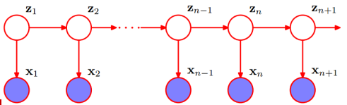
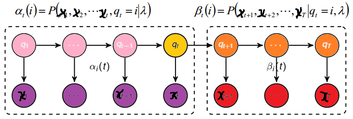

##隐马尔可夫模型 (HMM)

###1. 概念与模型

**隐马尔可夫模型** (Hidden Markov Model，HMM) 最初由 L. E. Baum 和其它一些学者发表在一系列的统计学论文中，随后在标注问题，语言识别，自然语言处理、生物信息及模式识别等领域被证明是有效的算法。 在深度学习出现之后，HMM主要用于隐特征的挖掘及时间序列数据的分析。

HMM是关于时序的概率模型，描述由一个隐藏的马尔科夫链生成不可观测的状态随机序列，再由各个状态生成观测随机序列的过程。如下图所示，其中$x_1,x_2,...,x_{n+1}$为实际观测值，而$z_1,z_2,...,z_{n+1}$为隐藏在不可观测的符合马尔科夫链的序列。

隐马尔科夫模型随机生成的状态随机序列称为**状态序列**，每个状态生成一个观测值，由此产生的观测随机序列称为**观测序列**，序列的每个位置我们称之为一个**时刻**。隐马尔科夫模型可以看做是一种贝叶斯网络，因此由有向分离(D-Separation)可知，在z1，z2不可观察的前提下，x1和x2是不独立的。因此样本数据之间是存在关系的(不独立)，因此将样本数据称为**结构化数据**(不能用边缘分布的乘积求解联合分布)，不能够被随机打乱后再求解，而隐马尔科夫模型能够处理结构化数据。

**HMM模型**

HMM由初始概率分布$\pi$、状态转移概率分布A及观测概率分布B确定，$\pi$和A决定状态序列，B决定观测序列，因此HMM可以用三元符号表示，称为HMM的三要素：
$$
\lambda = (A, B, \pi)
$$
$Z=\{z_1,z_2,...,z_n\}$是所有可能的状态集合，n为可能的状态数，$X=\{x_1,x_2,...,x_m\}$是所有可能的观测集合，m为可能的观察数目。A称为**状态转移概率矩阵**：$A=[a_{ij}]_{n \times n}$，其中$a_{ij}=P(i_{t+1}=z_j|i_t=z_i)$为在时刻t处于状态$z_i$的条件下时刻t+1转移到状态$z_{j}$的概率，且满足$\sum_{j=1}^{n}a_{ij} = 1$。B称为**观测概率矩阵或混淆矩阵**：$B=[ik]_{n \times m}$，其中$b_{ik}=P(o_t=x_k|i_t=z_i)$为在时刻t处于状态$z_i$的条件下生成观测值$x_k$的概率。$\pi$为**初始状态概率向量**：$\pi = (\pi_i)$，其中$\pi_i=P(i_1=z_i)$为时刻t=1处于状态$z_i$的概率。**注意**：HMM模型要求隐状态必须是离散的，若是连续的就是卡尔曼滤波。但是观测值可以使连续的，例如$P(x_i|z_i)$通过高斯概率密度函数求出，即观测值满足高斯分布，则可以得到高斯-隐马尔科夫模型。**HMM**的两个基本性质：

1. **齐次假设**，$P(x_t | z_{t-1}, x_{t-1}, x_{t-2},...,z_1,x_1) = P(x_t | x_{t-1})$
2. **观测独立性假设**，$P(z_t | x_{T}, z_{T}, x_{T-1},z_{T-1},...,x_1,z_1) = P(z_t | x_{t})$ 

**HMM举例**

假设有三个盒子，编号为1、2、3，每个盒子都装有红白两种颜色的小球，数目如下
$$
\begin{matrix}
盒子号 \qquad & 1 \qquad& 2 \qquad& 3 \\
红球数\qquad&5 \qquad& 4 \qquad&7 \\
白球数\qquad&5 \qquad & 6 \qquad&3 
\end{matrix}
$$
按照下面的方法抽取小球，得到球颜色的观测序列：

- 按照$\pi=(0.2,0.4,0.4)$的概率选择1个盒子，从盒子中随机抽取1个球，记录颜色后放回盒子；
- 按照某个条件概率选择新的盒子，例如选择了三号盒子，下一次按照$\pi=a_{2j}=(0.2,0.3,0.5)$的概率选择盒子，重复上述过程；
- 最终得到观测序列："红红白白红"

则可以得到：状态集合$Z=\{盒子1，盒子2，盒子3\}$，观测集合$X=\{红，白\}$，观测序列和状态序列的长度为$T=5$，初始概率分布为$\pi=(0.2,0.4,0.4)^T$，状态转移概率矩阵为$A=\left [\begin{matrix}0.5 &0.3&0.3 \\ 0.3&0.5&0.2\\0.2&0.3&0.5 \end{matrix} \right ]$，而观测概率分布为$B=\left[ \begin{matrix} 0.5 & 0.5 \\ 0.4 & 0.6 \\ 0.7 & 0.3  \end{matrix} \right ]$

在给定参数$\pi、A、B$的前提下，得到观测序列为“红红白白红”的概率是多少？

**HMM的三个基本问题**

1. 概率计算问题：**前向-后向算法(动态规划)**

   给定模型$\lambda=(A,B,\pi)$和观测序列$X=\{x_1,x_x, ...,x_T\}$，计算模型$\lambda$下观测序列$X$出现的概率$P(X|\lambda)$

2. 学习问题：**Baum-Welch算法(状态未知，EM)**

   已知观测序列$X=\{x_1,x_x, ...,x_T\}$，估计模型$\lambda=(A,B,\pi)$的参数，使得在该模型下观测序列$P(X|\lambda)$最大

3. 预测问题：**Viterbi算法(动态规划)**

   解码问题，已知模型$\lambda=(A,B,\pi)$和观测序列$X=\{x_1,x_x, ...,x_T\}$，求给定观测序列条件概率$P(Z | X, \lambda)$的最大状态序列$Z$

   

###2. 概率计算

问题：给定模型$\lambda=(A,B,\pi)$和观测序列$X=\{x_1,x_x, ...,x_T\}$，计算模型$\lambda$下观测序列$X$出现的概率$P(X|\lambda)$

计算概率的方法有：暴力算法、前向算法、后向算法

####(1) 暴力算法

由概率公式枚举所有可能长度为T的状态序列$Z=\{z_1,z_2,...,z_T\}$，求各个状态序列Z与观测序列$X=\{x_1,x_x, ...,x_T\}$的联合概率$P(Z, X| \lambda)$，然后对所有可能的状态序列求和即得到
$$
P(X|\lambda) = \sum_{Z} P(X | Z, \lambda) \cdot P(Z | \lambda)
$$
首先计算$P(Z|\lambda) = P(z_1,z_2,...,z_T|\lambda) = P(z_1|\lambda)P(z_2|z_1,\lambda)...P(z_T|z_1,...,z_{T-1},\lambda)$，而$P(z_1|\lambda)$为第一个隐状态取特定值得概率为$\pi_{z1}$，同理$P(z_2|z_1,\lambda)=a_{z_1z_2}，P(z_3|z_1,z_2,\lambda)=P(z_3|z_2,\lambda)=a_{z_2z_3}...P(z_{T}|z_1,...,z_{T-1},\lambda)=a_{z_{T-1}z_{T}}$

然后计算$P(X|Z,\lambda)$
$$
P(X|Z,\lambda)=P(x_1,x_2,...,x_T|Z,\lambda) \qquad  \qquad  \qquad  \qquad  \qquad  \qquad  \qquad  \qquad  \qquad  \qquad \qquad \\
= P(x_1|z_1,z_2,...,z_T,\lambda)P(x_2|x_1,z_1,...,z_T,\lambda)...P(x_T|x_1,...,x_{T-1},z_1,...,z_{T-1},\lambda)\\
=P(x_1|z_1,\lambda)P(x_2|z_2,\lambda)...P(x_T|z_{T},\lambda) \qquad  \qquad  \qquad  \qquad  \qquad  \qquad  \qquad  \qquad  \qquad  \quad  \ \\
= b_{z_1x_1}b_{z_2x_2}...b_{z_Tx_T} \qquad  \qquad  \qquad  \qquad  \qquad  \qquad  \qquad  \quad \qquad  \qquad  \qquad  \qquad  \qquad  \qquad \ \ \ \ \\
$$
则结合上述两个式子可以得到
$$
P(X|\lambda) = \sum_{Z} P(X | Z, \lambda) \cdot P(Z | \lambda)  \qquad \quad \\
=\sum_Z  \pi_{z_1}b_{z_1x_1}a_{z_1z_2}b_{z_2x_2}a_{z_2z_3}...a_{z_{T-1}z_{T}}b_{z_Tx_T}
$$
加和符号中有2T-1次乘法，Z的遍历个数为$N^T$,每一个$z_i$有N种取法，因此时间复杂度为$O(TN^T)$比指数级复杂度还要高，实际上没有可操作性。

####(2) 前向算法

定义$\alpha_t(i)$为在给定模型下载，在t时刻隐状态为$z_t=i$且观察样本为$x_1,x_2,...,x_t$的概率，且满足$t \in \{1,2,,...,t\}$，则称之为前向概率；同理定义$\beta_t(i)$在t时刻隐状态为$z_t=i$的前提下，后面能够观测到$x_{t+1},x_{t+1},...,x_{T}$的概率值，则称之为后向概率。

$$
\alpha_1(i) = P(x_1, z_1=i|\lambda) = P(x_1|z_1=i,\lambda) P(z_1=i|\lambda) = \pi_i b_{ix_1} \\
.... \\
目标函数：P(X|Z,\lambda) = \sum_{i}^{n} \alpha_t(i)
$$
对于任意$a_{t+1}(i)$可以得到其状态转移方程为
$$
\alpha_{t+1}(i) = (\sum_{j=1}^{n} \alpha_t(j) \cdot a_{j i} ) \cdot b_{i x_{t+1}}
$$

**前向算法步骤**

1. 初值$\alpha_1(i) = \pi_i b_{ix_1}$
2. 对于t=1,2,...,T-1有递推公式：$\alpha_{t+1}(i) = (\sum_{j=1}^{n} \alpha_t(j) \cdot a_{j i} ) \cdot b_{i x_{t+1}} $
3. 最后求解$P(X|\lambda) = \sum_{i=1}^{N}\alpha_t(i)$

第一步需要计算N次乘法，第二步括号内需要计算N次乘法，也需要计算N次乘法，总共需要$N^2$次，该步骤需要循环T-1次，因此总共需要计算$(T-1)N^2$次乘法，最后一一步需要计算N次加和，因此该算法总的时间复杂度为$O(TN^2)$

####(3) 后向算法

定义$\beta_t(i)$在t时刻隐状态为$z_t=i$的前提下，后面能够观测到$x_{t+1},x_{t+1},...,x_{T}$的概率值，则称之为后向概率。记作
$$
\beta_t(i) = P(x_{t+1},x_{t+2},...,x_{T}|z_t = i, \lambda)
$$
同理可以得到$\beta_{t}(i)$的状态转移方程为
$$
\beta_{t}(i) =  \sum_{j=1}^{N}  (a_{ij} b_{jy_{t+1}} \beta_{t+1}(j))
$$
**后向概率算法**

1. 初值$\beta_T(i) = 1$
2. 对于t=1,2,...,T-1有递推公式：$\beta_{t}(i) =  \sum_{j=1}^{N}  (a_{ij} b_{jy_{t+1}} \beta_{t+1}(j))$
3. 最后求解$P(X|\lambda) = \sum_{i=1}^{N}\pi_i b_{iy_1}\alpha_1(i)$

####(4) 前向后向概率的关系

根据前向后向概率的定义求解在给定模型$\lambda$时，在t时刻满足$z_t=i$的观测序列为$X$的联合分布$P(z_t=i,X|\lambda)$，则有
$$
P(z_t=i, X|\lambda) = P(X|z_t=i, \lambda) P(z_t=i|\lambda)=P(x_1,x_2,...,x_T|z_t=i,\lambda)P(z_t=i|\lambda) \\
=P(x_1,x_2,...,x_t|z_t=i,\lambda)P(x_{t=1},x_{t+2},...,x_T|z_t=i,\lambda)P(z_t=i|\lambda)  \ \\
=P(x_1,x_2,...,x_t|z_t=i,\lambda)P(x_{t=1},x_{t+2},...,x_T|z_t=i,\lambda) \qquad \qquad \quad\\
=\alpha_t(i)\beta_t(i) \qquad \qquad \qquad \qquad \qquad \qquad \qquad \qquad \qquad \qquad \qquad \qquad \ \ \
$$
即**单个状态的概率**$P(z_t=i, X|\lambda) =\alpha_t(i)\beta_t(i)$。

求给定模型$\lambda$和观测值$X$，在时刻t处于状态$i$的概率$\gamma_t(i)=P(z_t=i | X, \lambda)$，则根据公式$P(y|x)=\frac{P(y,x)}{P(x)}$可以得到
$$
\gamma_t(i)=P(z_t=i | X, \lambda) = \frac{P(z_t=i, X | \lambda)}{P(X|\lambda)} = \frac{\alpha_t(i)\beta_t(i)}{\sum_{i=1}^{N} \alpha_t(i)\beta_t(i)}
$$
**$\gamma$的意义** ：在每个时刻t选择在该时刻最有可能出现状态$i^*$，从$\gamma_t(1),\gamma_t(2),...,\gamma_t(N)$中选择满足条件得最大值，从而得到一个隐状态序列$I^*=\{i_1^*,i_2^*,...,i_T^*\}$，将它作为隐状态的预测结果。==可以作为计算隐状态的近似算法==

**两个状态的联合概率$\xi(i, j) = P(z_t=i, z_{t+1}=j|X, \lambda)$**

求给定模型$\lambda$和观测样本$X$，在时刻t处于状态i并且在时刻t+1处于状态j的概率$\xi(i, j) = P(z_t=i, z_{t+1}=j|X, \lambda)$，根据公式$P(y|x)=\frac{P(y,x)}{P(x)}$可以得到
$$
\xi(i, j) = P(z_t=i, z_{t+1}=j|X, \lambda) \qquad \qquad \qquad \qquad\\
=\frac{P(z_t=i, z_{t+1}=j, X| \lambda)}{P(X|\lambda)}  \qquad \qquad \quad \\
=\frac{P(z_t=i, z_{t+1}=j, X| \lambda)}{\sum_{i=1}^{N} \sum_{j=1}^{N} P(z_t=i, z_{t+1}=j, X| \lambda)} \\
其中P(z_t=i, z_{t+1}=j, X| \lambda) = \alpha_t(i)a_{ij}b_{jy_{t+1}}\beta_{t+1}{j}
$$
在观测样本X下状态i出现的期望为：$\sum_{t=1}^{T} \gamma_t(i)$

在观测样本X下状态i转移到状态j的期望为：$\sum_{t=1}^{T-1} \xi(i, j)$

思考：在观测样本X下状态i转移的期望是多少？

###3. 学习算法(参数估计)

- 若训练数据包含观测序列X和状态序列Z，则HMM的的学习非常简单，是监督学习；参数估计直接采用最大使然估计即可，目标函数为$max_{\lambda}P(\lambda|X, Z)$
  $$
  max_{\lambda} \prod_{k=1}^{m} P(\lambda|X^{(k)}, Z) = max_{\lambda} \prod_{k=1}^{m} \frac{P(X^{(k)}|\lambda, Z) P(\lambda|Z)}{P(X^{k})} \propto  max_{\lambda} \prod_{k=1}^{m} P(X^{(k)}|\lambda, Z)
  $$

- 若训练数据只包含观测序列X，则HMM的学习需要使用EM算法，是非监督学习；

**HMM监督学习方法**

**大数定理**：假设已给定训练数据包含S个长度相同的观测序列和对应的状态序列$\{(x_1,z_2),(x_2,z_2),...,(x_s,z_s)\}$，那么可以直接利用Bernoulli大数定理的结论“频率的极限是概率”，给出HMM的参数估计。

1. **初始概率：** $\hat{\pi_i} = \frac{|z_i|}{\sum_i |z_i|}$
2. **转移概率：**$\hat{a_{ij}} = \frac{|z_{ij}|}{\sum_{j=1}^N|z_{ij}|}$
3. **观测概率：**$\hat{b_{ik}} = \frac{|x_{ik}|}{\sum_{k=1}^{M} x_{ik}}$

###4. 模型预测

###5. 实战：中文分词算法

HMM做分词，词分析用贝叶斯网络或word2vector，若需要对语义进行分析可以使用主题模型LDA

###参考文献

[^1]: [隐马尔可夫模型（HMM）攻略](https://blog.csdn.net/likelet/article/details/7056068)
[^]: 