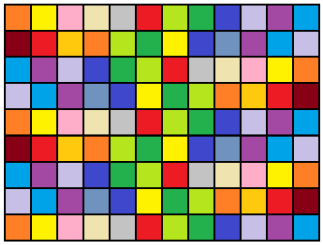

##隐马尔可夫模型 (HMM)

###1. 概念与模型

**隐马尔可夫模型** (Hidden Markov Model，HMM) 最初由 L. E. Baum 和其它一些学者发表在一系列的统计学论文中，随后在标注问题，语言识别，自然语言处理、生物信息及模式识别等领域被证明是有效的算法。 在深度学习出现之后，HMM主要用于隐特征的挖掘及时间序列数据的分析。

HMM是关于时序的概率模型，描述由一个隐藏的马尔科夫链生成不可观测的状态随机序列，再由各个状态生成观测随机序列的过程。如下图所示，其中$x_1,x_2,...,x_{n+1}$为实际观测值，而$z_1,z_2,...,z_{n+1}$为隐藏在不可观测的符合马尔科夫链的序列。

隐马尔科夫模型随机生成的状态随机序列称为**状态序列**，每个状态生成一个观测值，由此产生的观测随机序列称为**观测序列**，序列的每个位置我们称之为一个**时刻**。隐马尔科夫模型可以看做是一种贝叶斯网络，因此由有向分离(D-Separation)可知，在z1，z2不可观察的前提下，x1和x2是不独立的。因此样本数据之间是存在关系的(不独立)，因此将样本数据称为**结构化数据**(不能用边缘分布的乘积求解联合分布)，不能够被随机打乱后再求解，而隐马尔科夫模型能够处理结构化数据。

**HMM模型**

HMM由初始概率分布$\pi$、状态转移概率分布A及观测概率分布B确定，$\pi$和A决定状态序列，B决定观测序列，因此HMM可以用三元符号表示，称为HMM的三要素：
$$
\lambda = (A, B, \pi)
$$
$Z=\{z_1,z_2,...,z_n\}$是所有可能的状态集合，n为可能的状态数，$X=\{x_1,x_2,...,x_m\}$是所有可能的观测集合，m为可能的观察数目。A称为**状态转移概率矩阵**：$A=[a_{ij}]_{n \times n}$，其中$a_{ij}=P(i_{t+1}=z_j|i_t=z_i)$为在时刻t处于状态$z_i$的条件下时刻t+1转移到状态$z_{j}$的概率，且满足$\sum_{j=1}^{n}a_{ij} = 1$。B称为**观测概率矩阵或混淆矩阵**：$B=[ik]_{n \times m}$，其中$b_{ik}=P(o_t=x_k|i_t=z_i)$为在时刻t处于状态$z_i$的条件下生成观测值$x_k$的概率。$\pi$为**初始状态概率向量**：$\pi = (\pi_i)$，其中$\pi_i=P(i_1=z_i)$为时刻t=1处于状态$z_i$的概率。**注意**：HMM模型要求隐状态必须是离散的，若是连续的就是卡尔曼滤波。但是观测值可以使连续的，例如$P(x_i|z_i)$通过高斯概率密度函数求出，即观测值满足高斯分布，则可以得到高斯-隐马尔科夫模型。**HMM**的两个基本性质：

1. **齐次假设**，$P(x_t | z_{t-1}, x_{t-1}, x_{t-2},...,z_1,x_1) = P(x_t | x_{t-1})$
2. **观测独立性假设**，$P(z_t | x_{T}, z_{T}, x_{T-1},z_{T-1},...,x_1,z_1) = P(z_t | x_{t})$ 

**HMM举例**

假设有三个盒子，编号为1、2、3，每个盒子都装有红白两种颜色的小球，数目如下
$$
\begin{matrix}
盒子号 \qquad & 1 \qquad& 2 \qquad& 3 \\
红球数\qquad&5 \qquad& 4 \qquad&7 \\
白球数\qquad&5 \qquad & 6 \qquad&3 
\end{matrix}
$$
按照下面的方法抽取小球，得到球颜色的观测序列：

- 按照$\pi=(0.2,0.4,0.4)$的概率选择1个盒子，从盒子中随机抽取1个球，记录颜色后放回盒子；
- 按照某个条件概率选择新的盒子，例如选择了三号盒子，下一次按照$\pi=a_{2j}=(0.2,0.3,0.5)$的概率选择盒子，重复上述过程；
- 最终得到观测序列："红红白白红"

则可以得到：状态集合$Z=\{盒子1，盒子2，盒子3\}$，观测集合$X=\{红，白\}$，观测序列和状态序列的长度为$T=5$，初始概率分布为$\pi=(0.2,0.4,0.4)^T$，状态转移概率矩阵为$A=\left [\begin{matrix}0.5 &0.3&0.3 \\ 0.3&0.5&0.2\\0.2&0.3&0.5 \end{matrix} \right ]$，而观测概率分布为$B=\left[ \begin{matrix} 0.5 & 0.5 \\ 0.4 & 0.6 \\ 0.7 & 0.3  \end{matrix} \right ]$

在给定参数$\pi、A、B$的前提下，得到观测序列为“红红白白红”的概率是多少？

**HMM的三个基本问题**

1. 概率计算问题：**前向-后向算法(动态规划)**

   给定模型$\lambda=(A,B,\pi)$和观测序列$X=\{x_1,x_x, ...,x_T\}$，计算模型$\lambda$下观测序列$X$出现的概率$P(X|\lambda)$

2. 学习问题：**Baum-Welch算法(状态未知，EM)**

   已知观测序列$X=\{x_1,x_x, ...,x_T\}$，估计模型$\lambda=(A,B,\pi)$的参数，使得在该模型下观测序列$P(X|\lambda)$最大

3. 预测问题：**Viterbi算法(动态规划)**

   解码问题，已知模型$\lambda=(A,B,\pi)$和观测序列$X=\{x_1,x_x, ...,x_T\}$，求给定观测序列条件概率$P(Z | X, \lambda)$的最大状态序列$Z$

   

###2. 概率计算

问题：给定模型$\lambda=(A,B,\pi)$和观测序列$X=\{x_1,x_x, ...,x_T\}$，计算模型$\lambda$下观测序列$X$出现的概率$P(X|\lambda)$

计算概率的方法有：暴力算法、前向算法、后向算法

####(1) 暴力算法

由概率公式枚举所有可能长度为T的状态序列$Z=\{z_1,z_2,...,z_T\}$，求各个状态序列Z与观测序列$X=\{x_1,x_x, ...,x_T\}$的联合概率$P(Z, X| \lambda)$，然后对所有可能的状态序列求和即得到
$$
P(X, Z|\lambda) = \sum_{Z} P(X | Z, \lambda) \cdot P(Z | \lambda)
$$
首先计算$P(Z|\lambda) = P(z_1,z_2,...,z_T|\lambda) = P(z_1|\lambda)P(z_2|z_1,\lambda)...P(z_T|z_1,...,z_{T-1},\lambda)$，而$P(z_1|\lambda)$为第一个隐状态取特定值得概率为$\pi_{z1}$，同理$P(z_2|z_1,\lambda)=a_{z_1z_2}，P(z_3|z_1,z_2,\lambda)=P(z_3|z_2,\lambda)=a_{z_2z_3}...P(z_{T}|z_1,...,z_{T-1},\lambda)=a_{z_{T-1}z_{T}}$

然后计算$P(X|Z,\lambda)$
$$
P(X|Z,\lambda)=P(x_1,x_2,...,x_T|Z,\lambda) \qquad  \qquad  \qquad  \qquad  \qquad  \qquad  \qquad  \qquad  \qquad  \qquad \qquad \\
= P(x_1|z_1,z_2,...,z_T,\lambda)P(x_2|x_1,z_1,...,z_T,\lambda)...P(x_T|x_1,...,x_{T-1},z_1,...,z_{T-1},\lambda)\\
=P(x_1|z_1,\lambda)P(x_2|z_2,\lambda)...P(x_T|z_{T},\lambda) \qquad  \qquad  \qquad  \qquad  \qquad  \qquad  \qquad  \qquad  \qquad  \quad  \ \\
= b_{z_1x_1}b_{z_2x_2}...b_{z_Tx_T} \qquad  \qquad  \qquad  \qquad  \qquad  \qquad  \qquad  \quad \qquad  \qquad  \qquad  \qquad  \qquad  \qquad \ \ \ \ \\
$$
则结合上述两个式子可以得到
$$
P(X, Z | \lambda)=\sum_{Z} P(X | Z, \lambda) \cdot P(Z | \lambda)  \qquad \quad \\
=\sum_Z  \pi_{z_1}b_{z_1x_1}a_{z_1z_2}b_{z_2x_2}a_{z_2z_3}...a_{z_{T-1}z_{T}}b_{z_Tx_T}
$$
加和符号中有2T-1次乘法，Z的遍历个数为$N^T$,每一个$z_i$有N种取法，因此时间复杂度为$O(TN^T)$比指数级复杂度还要高，实际上没有可操作性。

####(2) 前向算法

定义$\alpha_t(i)$为在给定模型下载，在t时刻隐状态为$z_t=i$且观察样本为$x_1,x_2,...,x_t$的概率，且满足$t \in \{1,2,,...,t\}$，则称之为前向概率；同理定义$\beta_t(i)$在t时刻隐状态为$z_t=i$的前提下，后面能够观测到$x_{t+1},x_{t+1},...,x_{T}$的概率值，则称之为后向概率。

$$
\alpha_1(i) = P(x_1, z_1=i|\lambda) = P(x_1|z_1=i,\lambda) P(z_1=i|\lambda) = \pi_i b_{ix_1} \\
.... \\
目标函数：P(X|Z,\lambda) = \sum_{i}^{n} \alpha_t(i)
$$
对于任意$a_{t+1}(i)$可以得到其状态转移方程为
$$
\alpha_{t+1}(i) = (\sum_{j=1}^{n} \alpha_t(j) \cdot a_{j i} ) \cdot b_{i x_{t+1}}
$$

**前向算法步骤**

1. 初值$\alpha_1(i) = \pi_i b_{ix_1}$
2. 对于t=1,2,...,T-1有递推公式：$\alpha_{t+1}(i) = (\sum_{j=1}^{n} \alpha_t(j) \cdot a_{j i} ) \cdot b_{i x_{t+1}} $
3. 最后求解$P(X|\lambda) = \sum_{i=1}^{N}\alpha_t(i)$

第一步需要计算N次乘法，第二步括号内需要计算N次乘法，也需要计算N次乘法，总共需要$N^2$次，该步骤需要循环T-1次，因此总共需要计算$(T-1)N^2$次乘法，最后一一步需要计算N次加和，因此该算法总的时间复杂度为$O(TN^2)$

####(3) 后向算法

定义$\beta_t(i)$在t时刻隐状态为$z_t=i$的前提下，后面能够观测到$x_{t+1},x_{t+1},...,x_{T}$的概率值，则称之为后向概率。记作
$$
\beta_t(i) = P(x_{t+1},x_{t+2},...,x_{T}|z_t = i, \lambda)
$$
同理可以得到$\beta_{t}(i)$的状态转移方程为
$$
\beta_{t}(i) =  \sum_{j=1}^{N}  (a_{ij} b_{jy_{t+1}} \beta_{t+1}(j))
$$
**后向概率算法**

1. 初值$\beta_T(i) = 1$
2. 对于t=1,2,...,T-1有递推公式：$\beta_{t}(i) =  \sum_{j=1}^{N}  (a_{ij} b_{jy_{t+1}} \beta_{t+1}(j))$
3. 最后求解$P(X|\lambda) = \sum_{i=1}^{N}\pi_i b_{iy_1}\alpha_1(i)$

####(4) 前向后向概率的关系

根据前向后向概率的定义求解在给定模型$\lambda$时，在t时刻满足$z_t=i$的观测序列为$X$的联合分布$P(z_t=i,X|\lambda)$，则有
$$
P(z_t=i, X|\lambda) = P(X|z_t=i, \lambda) P(z_t=i|\lambda)=P(x_1,x_2,...,x_T|z_t=i,\lambda)P(z_t=i|\lambda) \\
=P(x_1,x_2,...,x_t|z_t=i,\lambda)P(x_{t=1},x_{t+2},...,x_T|z_t=i,\lambda)P(z_t=i|\lambda)  \ \\
=P(x_1,x_2,...,x_t|z_t=i,\lambda)P(x_{t=1},x_{t+2},...,x_T|z_t=i,\lambda) \qquad \qquad \quad\\
=\alpha_t(i)\beta_t(i) \qquad \qquad \qquad \qquad \qquad \qquad \qquad \qquad \qquad \qquad \qquad \qquad \ \ \
$$
即**单个状态的概率**$P(z_t=i, X|\lambda) =\alpha_t(i)\beta_t(i)$。

求给定模型$\lambda$和观测值$X$，在时刻t处于状态$i$的概率$\gamma_t(i)=P(z_t=i | X, \lambda)$，则根据公式$P(y|x)=\frac{P(y,x)}{P(x)}$可以得到
$$
\gamma_t(i)=P(z_t=i | X, \lambda) = \frac{P(z_t=i, X | \lambda)}{P(X|\lambda)} = \frac{\alpha_t(i)\beta_t(i)}{\sum_{i=1}^{N} \alpha_t(i)\beta_t(i)}
$$
**$\gamma$的意义** ：在每个时刻t选择在该时刻最有可能出现状态$i^*$，从$\gamma_t(1),\gamma_t(2),...,\gamma_t(N)$中选择满足条件得最大值，从而得到一个隐状态序列$I^*=\{i_1^*,i_2^*,...,i_T^*\}$，将它作为隐状态的预测结果。==可以作为计算隐状态的近似算法==

**两个状态的联合概率$\xi(i, j) = P(z_t=i, z_{t+1}=j|X, \lambda)$**

求给定模型$\lambda$和观测样本$X$，在时刻t处于状态i并且在时刻t+1处于状态j的概率$\xi(i, j) = P(z_t=i, z_{t+1}=j|X, \lambda)$，根据公式$P(y|x)=\frac{P(y,x)}{P(x)}$可以得到
$$
\xi(i, j) = P(z_t=i, z_{t+1}=j|X, \lambda) \qquad \qquad \qquad \qquad\\
=\frac{P(z_t=i, z_{t+1}=j, X| \lambda)}{P(X|\lambda)}  \qquad \qquad \quad \\
=\frac{P(z_t=i, z_{t+1}=j, X| \lambda)}{\sum_{i=1}^{N} \sum_{j=1}^{N} P(z_t=i, z_{t+1}=j, X| \lambda)} \\
其中P(z_t=i, z_{t+1}=j, X| \lambda) = \alpha_t(i)a_{ij}b_{jy_{t+1}}\beta_{t+1}{j}
$$
在观测样本X下状态i出现的期望为：$\sum_{t=1}^{T} \gamma_t(i)$

在观测样本X下状态i转移到状态j的期望为：$\sum_{t=1}^{T-1} \xi(i, j)$

思考：在观测样本X下状态i转移的期望是多少？

###3. 学习算法(参数估计)

- 若训练数据包含观测序列X和状态序列Z，则HMM的的学习非常简单，是监督学习；
- 若训练数据只包含观测序列X，则HMM的学习需要使用EM算法，是非监督学习；

####(1) HMM监督学习方法

**大数定理**：假设已给定训练数据包含S个长度相同的观测序列和对应的状态序列$\{(x_1,z_2),(x_2,z_2),...,(x_s,z_s)\}$，那么可以直接利用Bernoulli大数定理的结论“频率的极限是概率”，给出HMM的参数估计。

1. **初始概率(隐状态出现的概率)：** $\hat{\pi_i} = \frac{|z_i|}{\sum_i |z_i|}$

   例如：对于分词可能出现的状态有：B、M、E、S，分别表示当前词是词的开始、中间、结束位置或该词是单个词组成的一个token，则计算隐状态的初始概率时，只需要分别统计各自状态出现的频数比上所有状态频数即可。

2. **转移概率：**$\hat{a_{ij}} = \frac{|z_{ij}|}{\sum_{j=1}^N|z_{ij}|}$

3. **观测概率：**$\hat{b_{ik}} = \frac{|x_{ik}|}{\sum_{k=1}^{M} x_{ik}}$

参数估计直接采用最大使然估计即可，目标函数为$max_{\lambda}P(\lambda|X, Z)$，则有
$$
max_{\lambda} \prod_{k=1}^{m} P(\lambda|X^{(k)}, Z) = max_{\lambda} \prod_{k=1}^{m} \frac{P(X^{(k)}|\lambda, Z) P(\lambda|Z)}{P(X^{k})} \propto  max_{\lambda} \prod_{k=1}^{m} P(X^{(k)}|\lambda, Z)
$$

####(2) HMM非监督学习--Baum-Welch算法

训练数据只包含观测序列X，则HMM的学习需要使用Baum-Welch算法(EM算法)。所有观测样本为$X=(x_1,x_2,...,x_T)$，所有隐状态写成$Z=(z_1,z_2,...,z_T)$，完全数据时$(X, Z)=(x_1,x_2,...,x_T,z_1,z_2,...,z_T)$，完全数据的对数最大似然函数为$ln P(X, Z| \lambda)$ 

假设$\overline{\lambda}$是HMM参数的当前估计值，$\lambda$为待求的参数，则有
$$
Q(\lambda, \overline{\lambda}) = \sum_I(ln P(X, Z|\lambda)) P(Z |X, \overline{\lambda}) \\
 = \sum_I (lnP(X, Z | \lambda) ) \frac{P(X, Z | \overline{\lambda})}{P(X, \overline{\lambda})}\\
 \propto  \sum_I (lnP(X, Z | \lambda) )P(X, Z | \overline{\lambda})
$$
因为$P(X, Z|\lambda) =  \pi_{z_1}b_{z_1x_1}a_{z_1z_2}b_{z_2x_2}a_{z_2z_3}...a_{z_{T-1}z_{T}}b_{z_Tx_T}$，带入上式中可以得到
$$
Q(\lambda, \overline{\lambda}) =  \sum_I (lnP(X, Z | \lambda) )P(X, Z | \overline{\lambda}) \qquad  \qquad  \qquad  \qquad  \qquad  \qquad  \ \  \\
= \sum_Z ln \pi_{z_1} P(X, Z | \overline{\lambda}) + \sum_Z(\sum_{t=1}^{T-1} ln a_{z_{t} z_{t+1}}) P(X, Z|\overline{\lambda}) \\+ \sum_{Z} (\sum_{t=1}^{T} \ln b_{z_t x_t})P(X, Z|\overline{\lambda})  \qquad  \qquad  \qquad  \qquad \\
$$

**极大化$Q(\lambda, \overline{\lambda})$** 求得参数$A,B,\pi$，由于三个参数分别位于上述三个加法项中，因此可以分别对三项极大化求解各自参数，下面求第一项加法项的极大值
$$
\sum_Z ln \pi_{z_i} P(X, Z | \overline{\lambda})  = \sum_{i=1}^{N} ln \pi_{z_1} P(X, z_1= i | \overline{\lambda}) \\
s.t. \quad \sum_{i=1}^{N} \pi_{z_1 = i} = 1
$$
则有拉格朗日算子可以得到
$$
 L(\pi, \lambda) = \sum_{i=1}^{N} ln \pi_{i} P(X, i | \overline{\lambda}) + \gamma (\sum_{i=1}^{N} \pi_i - 1) \\
 \Downarrow 对\pi_i 求偏导\\
 P(X, z_1 =i|\overline{\lambda}) + \gamma \pi_i = 0 \\
 \Downarrow 对\pi_i 求和\\
 \gamma = - P(X | \lambda) \\
 \Downarrow 初始概率为\\
 \pi_i = \frac{P(X, z_1=i|\overline{\lambda})}{P(X|\overline{\lambda})} = \frac{P(X, z_1=i|\overline{\lambda})}{\sum_{i=1}^{N}P(X, z_1=i|\overline{\lambda})} = \gamma_1(i)
$$
对于第二项可以得到
$$
\sum_Z(\sum_{t=1}^{T-1} ln a_{z_{t} z_{t+1}}) P(X, Z|\overline{\lambda}) = \sum_{i=1}^{N}\sum_{j=1}^{N} \sum_{t=1}^{T-1} ln a_{ij}P(X, z_t=i, z_{t+1}=j | \overline{\lambda})
$$
任然采用拉格朗日算子可以求得转移概率矩阵
$$
a_{ij} = \frac{\sum_{t=1}^{T-1}P(X, z_t=i, z_{t+1}=j|\overline{\lambda})}{\sum_{t=1}^{T-1}P(X, z_t=i|\overline{\lambda})} = \frac{\sum_{t=1}^{T-1} \xi_t(i, j)}{\sum_{t=1}^{T-1} \gamma_t(i)}
$$
同理可以求得观测概率矩阵
$$
b_{ik} = \frac{\sum_{t=1}^{T}P(X, z_t=i|\overline{\lambda}) Z(x_t=v_k)}{\sum_{t=1}^{T}P(X, z_t=i|\overline{\lambda})} = \frac{\sum_{t=1, x_t=x_k}^{T} \gamma_t(i)}{\sum_{t=1}^{T}\gamma_t(i)}
$$

###4. 预测算法

####(1) 近似算法

在每个时刻t选择在该时刻最有可能出现状态$i^*$，从$\gamma_t(1),\gamma_t(2),...,\gamma_t(N)$中选择满足条件得最大值，从而得到一个隐状态序列$I^*=\{i_1^*,i_2^*,...,i_T^*\}$，将它作为隐状态的预测结果。
$$
\gamma_t(i)=P(z_t=i | X, \lambda) = \frac{P(z_t=i, X | \lambda)}{P(X|\lambda)} = \frac{\alpha_t(i)\beta_t(i)}{\sum_{i=1}^{N} \alpha_t(i)\beta_t(i)}
$$
问题：选择概率最大的i作为最有可能的状态会出现此状态在实际中可能不会发生的情况。

####(2) Viterbi算法

Viterbi算法实际是用动态规划求解HMM预测问题，用DP求概率最大的路径(最优路径)，这是一条路径对应一个状态序列。如下图所示N*M的矩阵，从左到右分别是时刻$t, t+1, ...., t+M$，在t时刻有N个隐状态(图中第一列)，从第一列任意位置开始直到最后一列停止，求总和概率最大的路径，这样就保证各自最大概率对应的最有可能隐状态。

**定义变量$\delta_t(i)$**：在时刻t状态为i的所有路径中，概率的最大值。记作
$$
\delta_t(i) = \underset{z_1,z_2,...,z_{t-1}}{max}P(z_t=i, z_{t-1},...,z_1, x_t,...,x_1|\lambda)
$$
**状态转移方程**
$$
\delta_1(i) = \pi_i b_{ix_1}  \qquad  \qquad  \qquad  \qquad  \qquad  \quad \  \qquad  \qquad  \qquad \\
\delta_{t+1}(i) = \underset{z_1,z_2,...,z_t}{max} P(z_{t+1}=i, z_t, ...,z_1, x_{t+1}, ...,x_1|\lambda) \\
= \underset{1 \le j \le N}{max} (\delta_t(j) a_{ji}) b_{i x_{t+1}} \qquad  \qquad  \qquad  \quad \  
$$
**终止条件**
$$
P^* = \underset{1 \le i \le N}{max} \delta_T(i)
$$
**范例：求最优隐状态序列**

考察盒子模型，观测向量$X=\{红，白，红\}$，试求最优状态序列，模型$\lambda$已知，参数如下
$$
\pi = \left( \begin{matrix} 0.2\\0.4\\0.4  \end{matrix}\right)  \quad 
A = \left[ \begin{matrix} 0.5 & 0.2 &0.3\\0.3 & 0.5 & 0.2\\0.2 & 0.3 &0.5  \end{matrix}\right] \quad 
B = \left[ \begin{matrix} 0.5 & 0.5 \\0.4& 0.6\\0.7 & 0.3  \end{matrix}\right]
$$
初始化，在t=1时，对于每一个状态i，求状态为i观测到$x_1=红$的概率，记为$\delta_1(i) = \pi_ib_{ix_1}=\pi_ib_{i红}$,可以求得
$$
\delta_1(1) = 0.2 * 0.5 = 0.1 \qquad \delta_1(2) =0.4 * 0.4 =  0.16 \qquad \delta_1(3) =0.4 * 0.7 = 0.28
$$

在t=2时，对每个状态i，求在t=1时状态为j观测值为红并且在t=2时状态为i观测值为白的路径的最大概率，记为$\delta_2(i)$，则有
$$
\delta_{t+1}(i) = \underset{1 \le j \le 3}{max}(\delta_1(j) a_{ji})b_{i x_2} =  \underset{1 \le j \le 3}{max}(\delta_1(j) a_{ji})b_{i 白} \\
\Downarrow \\
\delta_2(1) =  \underset{1 \le j \le 3}{max}(\delta_1(j) a_{j1})b_{1 x_2} = max\{0.1*0.5, 0.16*0.3,0.28*0.2\} * 0.5  = 0.028 \\
\delta_2(2) =  \underset{1 \le j \le 3}{max}(\delta_1(j) a_{j2})b_{2 x_2} = max\{0.1*0.2, 0.16*0.5,0.28*0.3\} * 0.6  = 0.0504 \\
\delta_2(2) =  \underset{1 \le j \le 3}{max}(\delta_1(j) a_{j3})b_{3 x_2} = max\{0.1*0.3, 0.16*0.2,0.28*0.5\} * 0.3  = 0.042 \\
$$
同理，在t=3时，对每个状态i，求在t=2时状态为j观测室白并且在t=3是状态为i观测值为红的路径的最大概率，记为$\delta_2(i)$，则有
$$
\delta_3(1) = 0.00756 \qquad \delta_3(2) = 0.010008 \qquad \delta_3(3) = 0.0147
$$
从而最大的$\delta_3(3)=0.0147$，根据每一步的最大值，可以得到最优隐状态序列为$(z_1=3,z_2=3,z_3=3)$。**PS：有上述计算可以看出，概率值太小容易造成underflow，因此在计算概率时可以取对数ln。**

思考：如果观测状态是连续值，可否将多项式分布变成高斯分布或者混合高斯分布？

###5. 实战：中文分词算法

HMM做分词，词分析用贝叶斯网络或word2vector，若需要对语义进行分析可以使用主题模型LDA

###参考文献

[^1]: [隐马尔可夫模型（HMM）攻略](https://blog.csdn.net/likelet/article/details/7056068)
[^2]: Schuster‐Böckler B, Bateman A. An introduction to hidden Markov models[J]. Current protocols in bioinformatics, 2007, 18(1): A. 3A. 1-A. 3A. 9. 
[^3]: Rabiner L R. A tutorial on hidden Markov models and selected applications in speech recognition[J]. Proceedings of the IEEE, 1989, 77(2): 257-286. 
[^4]: Bilmes J A. A gentle tutorial of the EM algorithm and its application to parameter estimation for Gaussian mixture and hidden Markov models[J]. International Computer Science Institute, 1998, 4(510): 126. 

