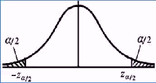
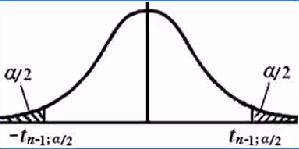
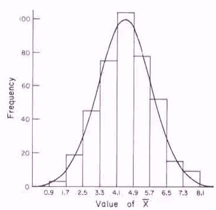
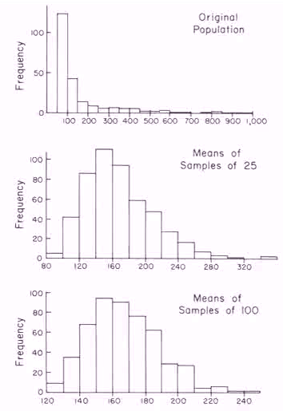

##第一章 概率论基础

本章主要讲解概率论中的基本知识，其中最重要的就是`概率`

什么是概率？概率是关于一个`事件`发生的`可能性大小`的`一种度量`，其值在0和1之间。什么是事件？可以为一件没有发生且可以度量的事。度量本身必须是明确的，度量可以通过实验观察进行验证

- 通常事件发生的结条件果具有`不确定性`，称之为`随机事件`或`偶然事件`；
- 如果事件发生的结果是确定的，称之为`确定性事件`或`必然事件`，其概率为0(`不可能事件`)或1；
- 事件必须严格定义或描述，给出特定条件，例如：条件是我今天晚上上课有没有喝酒。

> 统计学的一重要作用就是可以度量一个事件。统计学只考虑大多数，对于极少数情况是无法预防，针对大众来说趋近于不可能。例如：飞机失事的概率很小，几乎可以忽略，所以大部分人会接受坐飞机。

在原来特定条件下在增加其它条件，此时的事件称为条件事件。条件事件的概率称之为条件概率。

随机变量，随机变量是定量的，事件可以用定量来描述，

概率分布：用来描述随机变量取值概率的分布规律。概率的计算时通过比例得出，度量是通过实验观察或模型得出。

1. 离散随机变量的概率分布

   用列表形式或函数形式给出概率分布
   $$
   P(X = a_i) = p_i，i=1,2,3,... \ 其中 0 \le p_i \le 1 \quad \sum p_i = 1 \\
   E(X) = 1-p，D(X)=p(1-p)
   $$

   **伯努利（Bernoulli）分布** 
   $$
   P(X=1) = p，P(X=0) = 1 - p，0 \le p \le 1
   $$
   **二项（Binomial）分布**
   $$
   P(X=k) = C_k^n p^k (1-p)^{n-k}，k=0,1,2..,n ，0 \lt p \lt 1 \\
   其中n表示独立进行贝努力实验重复次数，k表示1出现的次数 \\
   E(X) = np，D(X) = np(1-p)
   $$
   **泊松（Poisson）分布 ~ P($\lambda$)**
   $$
   P(X=k) = \frac{\lambda^k}{k!} e^{- \lambda}，k=0,1,2，...，\lambda > 0 \\
   E(X) = D(X) = \lambda
   $$
   泊松分布的参数λ是单位时间(或单位面积)内随机事件的平均次数（发生率）。 泊松分布适合于描述单位时间内随机事件发生的次数。k为随机事件的实际发生次数 。

2.  连续随机变量的概率分布

   （概率）密度函数f(x)和（累积）分布函数F(x)满足如下公式
   $$
   F(x) = \int_{-\infty}^x f(x) dx = P(X \le x)，其中f(x) \ge 0
   $$
   **均匀（Uniform）分布 ~ U(a,b)** 
   $$
   f(x) = \begin{cases}
   \frac{1}{b - a} ，a < x < b \\
   0 ，\quad 其他
   \end{cases} \\
   F(x) = \begin{cases}
   0 ，\quad \ x < a \\
   \frac{x - a}{b -a}，a < x < b \\
   1 ，\quad \ x > b
   \end{cases} \\
   E(x) = \frac{a+b}{2}，D(X) = \frac{(b-a)^2}{12}
   $$
   ​

   **正态（Normal / Gaussian）分布 ~ N($\mu$, $\sigma$ )**
   $$
   密度函数 f(x) = \frac{1}{\sqrt{2 \pi}} \sigma e^{\frac{(x- \mu)^2}{s \sigma^2}} ，-\infty \lt x \lt +\infty \\
   分布函数 F(x) = \int_{-\infty}^x \frac{1}{\sqrt{2 \pi}} \sigma e^{\frac{(x- \mu)^2}{s \sigma^2}} d(x) \\
   $$

   其中$\sigma$ 决定曲线的分布程度(胖瘦)，$\sigma$ 越大曲线扁平（胖），反之曲线越瘦高。σ描述正态分布资料数据分布的离散程度，σ越大，数据分布越分散，σ越小，数据分布越集中。

   **标准正态分布**
$$
   若 X \sim N(\mu, \sigma^2)，则Z= \frac{x - \mu}{\sigma} \sim N(0, 1)
$$

数学期望

概率的加权平均值，是随机变量概率分布的重心所在。
$$
离散型 \quad E(X) = \sum_{k=1}^{\infty}p_k x_k \\
连续型 \quad E(X) = \int_{- \infty}^{\infty} x f(x)ds
$$
方差

$E(X - E(x))^2$ 为随机变量X的方差，记作Var(X)或D(X)。方差的开方称为标准差 。方差确定数据的离散程度。

协方差和相关系数

随机变量X与Y的协方差为
$$
Cov(X,Y) = E[X - E(X)] [Y - E(Y)]
$$
称
$$
\rho_{xy} = \frac{Cov(X, Y)}{\sqrt{Var(X)} \sqrt{Var(Y)}} = Cov(\frac{X - E(X)}{\sqrt{Var(X)}} , \frac{Y - E(Y)}{\sqrt{Var(Y)}}) \\
\rho_{xy} \in [-1, 1]
$$
为随机变量X与Y的相关系数。特别的，$Cov(X,X) = Var(X)，Cov(Y，Y)= Var(Y)$

相关系数就相当于二次函数中的交叉项，例如$f(x,y) = x^2 + 2xy + y^2$ ，其中$2xy$ 对应x与y的相关性。

##第二章 样本和统计量

> 统计学就是用来和实际打交道的，统计学是技术中的技术！技术的改进需要收集数据、分析数据，然后建立模型，最后最优化分析进行

`总体`研究对象的全体所组成的集合。`个体`总体中的基本单元或元素。`样本`是来自总体的若干个体所组成的集合。

`总体变量`用来描述个体某方面的数量特征，是关于个体的函数，是研究对象的特征变量。`总体分布`是`总体变量`取值的比例分布。例如：总体分布为男女身高的比例。

`例子1` 产品合格情况统计

总体={某批产品}，个体=某个产品，样本={被抽查的若干产品}，`总体变量`为
$$
X = \begin{cases}
1 ，合格产品\\
0，不合格产品
\end{cases}
$$
`总体分布`为产品分为合格和不合格品，比例分别为p和1-p，记作
$$
P(X=1) = p，P(X=0) = 1-p
$$
`例子2` 城市人口年龄的统计调查

总体={所有北京人}，个体=某个北京人，样本={若干被调查到的北京人}，`总体变量`为X = 年龄(某个北京人)，`总体密度分布`各个年龄的人口比例，`总体累积分布`为小于等于某个年龄x的人口比例，记作
$$
P(X \le x) = p
$$
从随机抽样或试验的角度来看，总体变量就是随机变量，总体分布就是总体变量的概率分布，又称`统计分布`。

其他例子还有人或物的寿命，货运或交通的流量，制造物品的产量，物价或经济指数，炮弹射程或投掷距离，测量误差等。通过量化后，经过随机抽样得到统计规律。

**统计量及其分布** 

什么是统计量？统计量是样本的函数，通过它对样本信息进行提炼，用来估计总体的某个相应特征。常见的统计量有
$$
样本均值 \ \overline X = \sum_{i=1}^{n} X_i \\
样本方差 \ S^2 = \frac{1}{n-1} \sum_{i=1}^{n} (X_i -\overline X)^2
$$
常见统计量的抽样分布

1. 样本比例

   总体为贝努力分布
   $$
   P(X=1) = p，P(X=0) = 1-p \\
   $$
   随机样本$X_1, X_2, X_3, ... X_n$ 的取值为0或1，样本比例
   $$
   \hat{p} = \frac{k}{n} = \frac{X_1 + X_2 + ... + X_n}{n} = \overline{X} 
   $$
   其中‘1’出现的次数k服从二项分布，即
   $$
   P(k=i) = C_n^i p^i (1-p)^{n-i}，i=0,1,2,...,n
   $$

2. 正态分布的样本均值

   正态分布$X ~ N(\mu, \sigma^2)$ ，则其样本均值为
   $$
   \overline X = \frac{X_1 +X_2 + ... + X_n}{n} \sim N(\mu, \frac{\sigma^2}{n})
   $$

3. 两个正态总体的独立样本的均值之差
   $$
   X \sim N(\mu_1， \sigma_1^2)，Y \sim N(\mu_2，\sigma_2^2) \\
   \overline{X} - \overline{Y} \sim N(\mu_1 - \mu_2，\frac{\sigma_1^2}{n_1} + \frac{\sigma_2^2}{n_2})
   $$

4. 正态总体的原本方差

   正态分布$X \sim N(\mu, \sigma^2)$ ，则样本方差
   $$
   S^2 = \frac{1}{n-1} \sum_{i=1}^{n} (X - \overline{X})^2
   $$
   的变换
   $$
   T = (n-1)\frac{S^2}{\sigma^2} = \sum_{i=1}^{n}(\frac{X_i - \overline{X}}{\sigma})^2 \sim T(n-1)
   $$
   其中T(n)称为自由度为n的T-分布
   
5. 两个正态总体的独立样本的方差之比

   当两个正态总体的方差相等时，即$\sigma_1^2 = \sigma_2^2$ ，则
   $$
   F = \frac{S_1^2}{S_2^2} \sim F(n_1 - 1, n_2 -1)
   $$
   其中$F(n_1，n_2)$ 称为自由度$(n_1, n_2)$的F-分布。

**常见统计量的数字特征** 

样本比例(0-1分布)的数据期望和方差
$$
\hat{p} = \frac{k}{n} \\
E(\hat{p}) = p \\
Var(\hat{p}) = \frac{p(1-p)}{n}
$$
样本均值的数学期望和方差
$$
E(\overline{X}) = E(X) = \mu \\
Var(\overline(X)) = \frac{Var(X)}{n} = \frac{\sigma^2}{n}
$$
样本方差的数学期望
$$
E(S^2) = \sigma^2
$$

**标准变换** 

总体变量的标准变换
$$
Z = \frac{X - E(X)}{\sqrt{Var(X)}} = \frac{X - \mu}{\sigma}
$$
样本均值的标准变换
$$
Z = \frac{\overline{X} - \mu}{\sigma /  \sqrt{n}}
$$
**统计量的大样本特性** 

大数定理

当样本量趋于无穷时，随机抽样的样本均值、样本方差和样本标准差都分别趋于总体均值、总体方差和总体标准差，即
$$
\overline{X} \rightarrow \mu \\
S^2 \rightarrow \sigma^2 \\
S \rightarrow \sigma \\
n \rightarrow \infty
$$
**中心极限定理** 

当样本量趋于无穷时，样本均值的标准变换`通常（放在不满足的情况，但可以忽略不计）` 趋向于服从标准正态分布，即
$$
Z_n = \frac{\overline{X} - \mu}{\sigma/\sqrt{n}} \rightarrow Z \sim N(0, 1)，n\rightarrow \infty
$$

> 统计学的真谛就是“差不多”，只要容忍了误差，就会有不同的结果。例如：飞机可以座，火车可以开。

##第三讲 参数估计

考虑最简单为题：能不能用100个人的平均身高代表100万个人的平均身高，误差不超过1厘米？能不能用一个人的身高代表100万个人的平均身高？当选择的这个人恰好是其中的平均身高时，就能够实现。因此通过选择合适的样本数量可以估计总体的平均身高。用统计量（样本）估计总体分布中的未知参数。

问题由来？统计量是样本的特征（随机变量），用它来估计总体的相应特征（确定的未知参数），就带有不确定性（误差）。如何来描述统计量估计的好坏？

为什么要随机抽样？等概率抽取样本，不会出现抽取数据出现明显偏差的情况，抽样量越多出现的误差越小。

**评价统计量（点估计）的好坏标准**

1. `无偏性`：统计量T的期望值等于被估计参数$\theta$,即$E(T)=\theta$ 。

2. `有效性`：对同一总体参数的两个无偏点统计量，有更小标准差的估计量更有效。或者要求统计量T与被估计参数$\theta$ 的偏差均方$E(T-\theta)^2$ 越小越好。
3. `一致性` ：随着样本容量的增大，统计量的值越来越接近于被估计的总体参数。

用样本方差估计总体方差是无偏的，但是样本标准差与总体方差就是有偏的。

**区间估计** 

用称之为置信下限和置信上限的两个统计量T1和T2所组成的区间$[T_1, T_2]$ 来估计未知参数$\theta$ ，称$[T_1, T_2]$ 为$\theta$ 的`置信区间`。

`置信度`：记$P(T_1 \le \theta \le T_2) = 1- \alpha$ ，称$1-  \alpha$ 为$\theta$ 的置信区间$[T_1, T_2]$的`置信度`，称$\alpha$ 为`置信水平`。$\alpha$ 代表是小概率，一般$\alpha$ 取值为0.05或0.01。

###3.1 正态总体均值的估计

1. 正态总体$N(\mu, \sigma^2)$ 中，$\sigma^2$ 已知的情形，若不是正态分布可以有正态分布近似(n >30)。

   正态总体的随机样本$X_1, X_2, ..., X_n$ 的任意线性组合
   $$
   T = c_1 X_1 + c_2 X_2 + ... + c_n X_n
   $$
   也服从正态分布，即
   $$
   T \sim N(E(T), Var(T)) =N(\mu(c_1 +c_2+...+c_n), \sigma^2(c_1^2 + ... + c_n^2))
   $$
   样本均值$\overline{X}$ 服从$N(\mu, \sigma^2/n)$ ，其标准变换为
   $$
   Z = \frac{\overline{X} - \mu}{\sigma/\sqrt{n}} \sim N(0, 1)
   $$
   用标准变换构造正态总体均值的区间估计

   

   ​
   $$
   P(|Z| \le z_{\alpha/2}) = 1- \alpha \\
   P(\frac{| \overline{X} - \mu |}{\sigma/\sqrt{n}}  \le z_{\alpha/2}) = 1- \alpha 或 \\
   P(|\overline{X} - \mu | \le z_{\alpha/2} \sigma/\sqrt{n}) = 1- \alpha
   $$
   因此，$\mu$ 的置信区间为$[\overline{X} - z_{\alpha/2} \sigma/\sqrt{n}, \overline{X} + z_{\alpha/2} \sigma/\sqrt{n}]$ ，其置信度为$1 - \alpha$

   例子：随机抽取了20名男生的体重，得平均体重为68公斤，用它来估计全体学生的平均体重（已知总体标准差为6公斤），则在置信度95%下，$\alpha=0.05$，则 其估计误差为
   $$
   \Delta Z_{\alpha/2} \frac{\sigma}{\sqrt{n}} = 1.960 * \frac{6}{\sqrt{20}} = 2.63（公斤）
   $$

2. 正态总体$N(\mu, \sigma^2)$ 中，$\sigma^2$ 未知的情形

   利用$\sigma^2$ 已知情形的结果，用样本方差$S^2$ 替换未知的总体方差$\sigma^2$ ,经过变换后的的分布称为T分布
   $$
   T = \frac{\overline{X} - \mu}{S / \sqrt{n}} \sim T(n-1)
   $$
   其中T(n-1)称为自由度为n-1的T分布，记
   $$
   P(|T| \le t_{n-1, \alpha/2})
   $$
   

   可以得到$\mu$ 的区间估计的置信区间为$[\overline{X} - t_{n-1, \alpha/2}S/\sqrt{n},\overline{X} + t_{n-1, \alpha/2} S/\sqrt{n}]$

3. 样本量的确定

   在置信度为$1 - \alpha$ 和均值估计误差$\Delta$ 给定的情况下，解
   $$
   z_{\alpha/2} \sigma / \sqrt{n} = \Delta \\
   方差已知时样本量的计算公式 n = z_{\alpha/2}^2 \frac{\sigma^2}{\Delta^2}\\
   方差未知时样本量的计算公式n = t_{n-1, \alpha/2}^2 \frac{S^2}{\Delta^2}
   $$
   样本量与误差大小平方成反比，若缩小误差10倍，则需要样本量扩大100倍。

   **方差未知时，样本量计算公式的使用** 

   - 第一步，先用经验方法估计出样本量n的最小值$n^{(1)}$和最大值$n^{(2)}$ ，接着抽一个样本量为$n_1=n^{(1)}$ 的样本得到样本方差$S_1^2$ 

   - 第二步，补抽一个样本量为$n_2 - n_1$ 的样本其中
     $$
     n_2 = MIN(t_{n_1-1, \alpha/2}^2 \frac{S_1^2}{\Delta^2}, \  n^{(2)})
     $$
     把前后两个样本合起来，就得到了样本量为$n=n_2$ 的一个样本，其样本方差为$S_2^2$ 

     1. 若$n_2 \le n_1$ ，则$n_1 \ge n$ ，因此不需要进行第二步了；
     2. 计算$n_3 =t_{n_1-1, \alpha/2}^2 \frac{S_2^2}{\Delta^2}$ ，通常$n_3$ 与$n_2$ 应该差距不大，否则可以考虑第三步。

   `例子`：若要求身高的估计误差小于1cm，有经验可知，总体标准差在4.5~5之间，因此有公式可计算（找置信度95%下）样本量约在78-96之间，第一步，取$n_1 = 80$ ，第二步需要补抽的样本量应该不会很大，若$n_1$取的过小，则$n_2​$就会过大，例如$n_1=10​$，则$n_2 = t_{n-1, \alpha/2}^2 \frac{S_1^2}{\Delta} = 2.262^2 * 7.5865^2 / 1^2 = 294​$

4. 非正态总体均值的大样本估计

   对于非正态总体，当样本量n很大时，利用中心极限定理得
   $$
   T = \frac{\overline{X} - \mu}{S/\sqrt{n}} \sim N(0,1)
   $$
   由此得到非正态总体均值$\mu$  的近似区间估计，$\mu$ 的执行区间为$\overline{X} \pm z_{\alpha/2} S/\sqrt{n}$ ，置信度为$1-\alpha$

   样本量n多大时，近似程度才较好呢？

   - n的大小，依赖与总体分布与正态分布的接近程度，两者成反比例；
   - 理论上，若总体分布为正态分布，则n可以任意；
   - 一般要求$n \ge 30 或 n \ge 50$
   - 对于特别偏倚的分布，则要求n特别大。

5. 有限总体无放回随机抽样的均值估计

   设有限总体的个体数目为N，从中无放回地随机抽取n个个体，得到样本$X_1, X_2, ... X_n $ ，此时，有限总体的均值为$\mu$ 仍用样本均值来估计，这个估计仍然是无偏估计，但其估计方差要进行修整
   $$
   Var(\overline{X}) = \frac{N-n}{N} \frac{\sigma2}{n} = C^2\frac{\sigma2}{n}，其中C = \sqrt{1 - n/N}
   $$
   其中C为有放回随机抽样的修整系数，因此在大样本下可以得到均值$\mu$ 的近似区间估计为
   $$
   [\overline{X} - z_{\alpha/2} C S/\sqrt{n}，\overline{X} + z_{\alpha/2} C S/\sqrt{n}]
   $$
   当抽样比例为n/N = 5%时，C=0.97，当n/N=2%时，C=0.99。即当抽样比例低于5%时，估计误差不到1%。

###3.2 比例估计问题

   比例问题是一个0-1问题，总体分布为
$$
   P(X=1) = p，P(X=0)=1-p
$$
   其均值和方差为
$$
   \mu = E(X=1) = p，\sigma^2 = Var(X) = p(1-p)
$$
   其样本均值或样本比例为
$$
   \overline{X} = \hat{p} = \frac{k}{n}
$$
   其中k服从二项分布，其均值和方差分别为
$$
   E(k) = np，Var(k) =  np(1-p)
$$
   在大样本的情况下，近似成立
$$
   Z = \frac{\hat{p} - p}{\sqrt{\hat{p}(1-\hat{p})} / n} = \frac{k - np}{\sqrt{n \hat{p}(1-\hat{p})}} \sim N(0,1）
$$
   于是，得到总体比例p的区间估计，在置信度$1-\alpha$ 下的置信区间为
$$
   [\hat{p} - z_{\alpha/2} \sqrt{\hat{p}(1-\hat{p})/n}，\hat{p} +z_{\alpha/2} \sqrt{\hat{p}(1-\hat{p})/n}]
$$
   样本量大小计算公式为
$$
   n = z_{\alpha/2}^2 \hat{p}(1-\hat{p}) / \Delta^2 \\
   普通精度：np \ge 5，n(1-p) \ge 5\\
   较高精度：np(1-p) /ge 9
$$
   比例p的置信区间的校正公式（n不大时比较有用）
$$
   \hat{p} \pm [\frac{1}{2n} + z_{\alpha/2 \sqrt{\hat{p}(1-\hat{p})/n}}]
$$
   例如：总体数量为n=1600，调查数量为k=900，则p的区间估计（置信度$1 - \alpha$为95%）为
$$
   \frac{9}{16} \pm 0.0246 = 0.5625 \pm 0.0246
$$
   ​

###3.3 泊松（Poisson）分布及其应用

泊松分布的由来：稀有事件

在二项分布中，令（虽然发生概率很小，但是做足够多的实验np次数，就会发生$\lambda_r$次）
$$
np = \lambda_{r}
$$
所谓稀有事件，是一个特殊的0-1问题，其他的概率几乎为零或很小。例如：；飞机失事或交通事故。但在大量的观测中会出现若干次，即可表示为
$$
np = \lambda_{r} \rightarrow \lambda_{s}，n \rightarrow \infty
$$
根据二项分布可知，在n次随机观测中稀有事件发生k次的概率等于
$$
P(X=k) = C_n^k p^k(1-p)^{n-k}\\
\downarrow \\
P(X=k) = \frac{\lambda^k}{k!} e^{- \lambda}，k=0,1,2，...，\lambda > 0 \\
其中\lambda为单位时间内事件平均发生次数
$$
虽然稀有事件很少发生，但是大数据量观察下，稀有事件累积出现的次数是服从泊松分布的。

泊松分布适合于描述单位时间内`随机事件发生的次数`的概率分布。如某一服务设施在一定时间内受到的服务请求的次数，电话交换机接到呼叫的次数、汽车站台的候客人数、机器出现的故障数、自然灾害发生的次数、DNA序列的变异数、放射性原子核的衰变数等等。

例子：某城市去年重大交通事故的发生率为万分之一，如果今年的车辆增加到10万辆，交通状况及管制跟去年一样，则今年发生重大交通事故的概率分布为
$$
P(X=k) = \frac{10^k}{k!} e^{-10} ，k=0,1,2,... \\
$$
因此今年平均将有$\lambda=np = 10$ 起重大交通事故，而今年无重大交通事故的概率为
$$
P(X=0) = e^{-10} 
$$
今年发生重大交通事故小于5起的概率等于$P(X < 5) = 0.029$ ，今年发生重大交通事故大于17起的概率为$P(X > 17) = 0.023$ 。则有今年发生重大交通事故数为5~17起，置信度为95% 。

**泊松分布的参数估计**

点估计：用样本均值估计$\lambda$ ，即$\lambda = \overline{X}$

区间估计：在大样本下，近似成立
$$
Z = \frac{\overline{X} - \lambda}{\sqrt{\overline{X} / n}} \sim N(0,1)
$$
由此可以得到均值的区间估计为（因为平均值包含的信息比方差重要，因此从统计的原理将方差用均值代替要比用样本方差效果更好）
$$
\overline{X} \pm z_{\alpha/2} \sqrt{\overline{X}/n}
$$
近似公式：当$20 \le n \overline{X} \le 300$ 时，使用近似的区间估计公式，该公式很好的反应了泊松分布右偏的特点。
$$
[(\sqrt{\overline{X}} - \frac{z_{\alpha/2}}{2\sqrt{n}})^2, (\sqrt{\overline{X} + 1/n} + \frac{z_{\alpha/2}}{2\sqrt{n}})^2]
$$
例子：某森林某动物数量的调查

科研人员把某个森林划分成1000块，随机抽取了10块，调查某动物的数量，获取的数据为3,2,0,3,1,4，2,5,4,3，于是
$$
n = 10，\overline{X} = (3+2+0+...+4 + 3) /10 = 2.7
$$
因此，这个森林中该动物总数量的点估计为
$$
1000 * \overline{X}  =2700
$$
在置信度为95%下，动物总数的置信区间近似等于
$$
1000 * (\overline{X} \pm + z_{\alpha/2} \sqrt{\overline{X}/n}) = 1000 * (2.7 \pm 1.018)
$$
###3.4 正态总体方差的估计

估计一个总体的方差或标准差，假设总体服从正态分布，总体方差的点估计为$S^2$ ，且满足
$$
\frac{(n-1)S^2}{\sigma^2} \sim \chi^2(n-1)
$$
则可以得到总体方差在1-a置信水平下的置信区间为
$$
\frac{(n-1)S^2}{\chi^2_{\alpha/2}(n-1)} \le \sigma^2 \le \frac{(n-1)S^2}{\chi^2_{1- \alpha/2}(n-1)} 
$$
例子：已知n=25，1-a=95%，根据样本数据计算得$S^2 =93.21，\chi^2_{\alpha/2}(n-1) = \chi_{0.025}^2(24) = 39.3641$，同理计算$\chi^2_{1-  \alpha/2}(n-1) = \chi^2_{0.975}(24) = 12.4011$ ，$\sigma^2$ 置信度为95%的置信区间为
$$
56.83 \le \sigma^2 \le 180.39
$$

###3.5 两个总体参数的区间估计

**1. 两个正态总体均值之差的估计（大样本）** 

设$X_1, X_2, ... X_n$ 和$Y_1,Y_2, ...,Y_n$ 分别为独立抽自与正态总体$N(\mu_1, \sigma^2_1)$ 和$N(\mu_2, \sigma_2^2)$ 两个简单随机样本（相互独立），这两个样本的均值分别记为$\overline{X}和\overline{Y}$ 。于是，这两个正态总体的均值之差等于$\mu_1 - \mu_2$ 的点估计为$\overline{X} - \overline{Y}$ ,对估计量做标准变换得（大样本：$n_1 \ge 30，n_2 \ge 30$）
$$
Z = \frac{\overline{X} - \overline{Y} - (\mu_1 - \mu_2)}{\sqrt{\frac{\sigma_1}{n_1} - \frac{\sigma_2}{n_2}}} \sim N(0,1)
$$

1. $\sigma_1^2 和\sigma^2_2$ 已知的情况

   $\mu_1 - \mu_2$ 在置信度为$1 - \alpha$ 下的执行区间为
   $$
   \overline{X} - \overline{Y} \pm z_{\alpha/2} \sqrt{\frac{\sigma_1}{n_1} - \frac{\sigma_2}{n_2}}
   $$
   ​

2. $\sigma_1^2 和\sigma^2_2$ 未知的情况，两个总体均值之差在1-a置信水平下的置信区间为
   $$
   \overline{X} - \overline{Y} \pm z_{\alpha/2} \sqrt{\frac{s_1^2}{n_1} - \frac{s_2^2}{n_2}}
   $$

例子：150个A品牌灯泡的平均寿命为1400小时，标准差为120小时，200个B品牌灯泡的平均寿命为1200小时，标准差为80小时，求A和B两种品牌灯泡平均寿命之差的95%的置信区间。

由公式可以得到1-a置信水平下的置信区间为
$$
\overline{X} - \overline{Y} \pm z_{\alpha/2} \sqrt{\frac{s_1^2}{n_1} - \frac{s_2^2}{n_2}} \\
=(1400 - 1200) \pm 1.96 * \sqrt{\frac{120^2}{150} + \frac{80^2}{200}} \\
=200 \pm 22.17
$$
**2. 两个总体比率之差的区间估计**

两个总体服从二项分布，可以用正态分布近似，两个样本是独立的。两个总体比率之差$\pi_1 - \pi_2$ 在1-a置信水平下的置信区间为
$$
(p_1 - p_2) \pm z_{\alpha/2} \sqrt{\frac{p_1(1-p_1)}{n_1} + \frac{p_2(1-p_2)}{n_2}}
$$
**3. 两个正态总体方差之比的估计(F分布)**

若两个样本的方差之比接近于1，则说明两个总体方差很接近，若比值远离1，则两个总体方差之间存在差异。方差之比在置信水平为1-a的置信区间为
$$
\frac{S_1^2}{S^2_2 F_{\alpha/2}(n_1 - 1, n_2 - 1)} \le \frac{\sigma^2_1}{\sigma^2_2}  \le  \frac{S_1^2}{S^2_2 F_{1-\alpha/2}(n_1 - 1, n_2 - 1)}
$$
例子：为了研究男女学生在生活费支出上的差异，在某大学各随机抽取了25名男生和25名女生，得到结果如下男学生：$\overline{x_1} = 520 \quad s_1^2 = 260$ ，女学生：$\overline{x_2}=480 \quad s_2^2 = 280$ ，试以90%置信水平估计男女学生生活费支出方差比的置信区间。

计算自由度$n_1 = 25 - 1 = 24，n_2 = 25 - 1 = 24$ ，查表的$F_{\alpha/2}(24,24) = F_{0.05}(24,24) = 1.98$ ，而$F_{1 - \alpha/2}(24,24) = F_{0.95}(24, 24) = \frac{1}{1.98}=0.505$ ，则可以得到生活费支出方差之比的置信区间为
$$
\frac{260/280}{1.98} \le \frac{\sigma_1^2}{\sigma^2_2} \le \frac{260/280}{0.505}
$$

###3.5.6 样本量多大样本才服从正态分布呢？

上研说的参数估计都是在样本服从正态总体或者样本量达到大样本的时候，通过正态标准变换对参数进行的估计。那么实际过程中，我们应该如何判断样本量已经达到大样本了呢？

**经验方法** 利用统计模拟的方法确定大样本的数量，` 由中心极限定理可知`，在大样本时样本均值是服从正态分布的，因此得到的样本量就是大样本，画出多批样本均值的直方图应该和正态分布的概率密度函数分布图相似。

例:子1：总体分布$P(X=i)=0.1，i=0,1,2...,9$ ，总体均值和方差为
$$
\mu = E(X) = 4.5\\
\sigma^2 = Var(X) = 8.25
$$
重复抽取样本量n=5的样本400批，得到400个样本均值为$\overline{X}$ 的直方图，可以看出，近似成立，因此该分布的样本数量大于等于5时，就满足大样本特性，服从中心极限定理。
$$
X \sim N(\mu, \sigma^2/n)
$$

例子2：总体为较偏倚分布情况下，样本均值的分布

- 上图是总体分布；
- 中图为样本量为n=25时，500批抽样的样本均值的抽样分布`直方图`；
- 下图为样本量为n=100时，500批抽样的样本均值的抽样分布`直方图`；

从上图可以看出，样本量为100时直方图还是没有达到对称的情况，因此需要继续增加n的数量直到直方图两边明显对称就可。

##第四讲 假设检验

概念

**统计学中（对总体）的假设检验** 

1. 原假设和备择假设

   原假设$H_0$ :假设的正面，对它的真实性一般抱有较大希望；

   备择假设$H_1$ :假设反面或原假设的对立面。

2. 检验方法

   - 抽样，获取总体信息；
   - 检验统计量，提供样本中所包含的关于假设的总体信息；
   - 检验判别，用检验统计量对假设的真伪进行判别；

3. 对检验结果做统计解释

**例子** ：正态总体$N(\mu, \sigma^2)$ 均值$\mu$ 的假设检验

1. 假设检验的提法：$H_0: \mu = \mu_0；H_1 : \mu \ne \mu_0$

2. 抽样：设$X_1, X_2, ...,X_n$ 为抽自于正态总体$N(\mu, \sigma^2)$ 的一个简单随机样本（样本独立同分布，需要检验样本的这个特性）

3. 检验统计量：用样本均值$\overline{X}$ 来对总体均值$\mu$ 进行检验，利用标准变换得到统计量
   $$
   Z = \frac{\overline{X} - \mu}{\sigma/\sqrt{n}} \\
   若\sigma未知，用无偏样本方差代替，\sigma^2 = \frac{n-1}{n}S^2
   $$

4. 检验准则：判别假设真伪的方案构造，原假设的接受域为$|\overline{X} - \mu_0| \le C$

**检验过程** 

1. 两类错误和犯错误的概率

   | 检验或判别结果 | $H_0$ 为真          | $H_0$ 为假                |
   | -------------- | ------------------- | ------------------------- |
   | 接受H0         | 正确(概率为1-a)     | 第二类错误(概率为$\beta$) |
   | 拒绝H0         | 第一类错误(概率为a) | 正确(概率为1-$\beta$)     |

   通常是要拒绝原假设的，

   犯第二类错误的概率$\beta$ 的计算

2. 保护原假设，给定显著性水平$\alpha$ （小概率），使得
   $$
   P_{H_0}(|\overline{X} - \mu_0| \le C) = 1 - \alpha
   $$

3. 临界值C的确定

   在显著水平a给定的情况下，由
   $$
   P_{H_0}(|\overline{X} - \mu_0| \le C) = 1 - \alpha \\
   $$
   得
   $$
   P_{H_0}(|\frac{\overline{X} - \mu_0}{\sigma /\sqrt{n}}| \le \frac{C}{\sigma /\sqrt{n}}) = P(|Z| \le \frac{C}{\sigma /\sqrt{n}}) = 1 - \alpha
   $$
   因此得到
   $$
   C = z_{\alpha/2} \sigma/\sqrt{n}
   $$
   即原假设的接受域为
   $$
   |\overline{X} - \mu_0| \le z_{\alpha/2} \sigma \sqrt{n}
   $$
   原假设的拒绝域为 
   $$
   |\overline{X} - \mu_0| \gt z_{\alpha/2} \sigma \sqrt{n}
   $$
   ​

4. ​

例子：我国电压的标准为220V，某检验机构对一个发电机进行质量检查，在24小时连续使用过程中每隔3小时做一次记录，共测得8个电压数据：235，229，218，226，210，215，230，227。

假定该产品的容差为$\Delta = 3\sigma=20V$ ，即生产规格的标准差为$\sigma = \Delta/3 = 6.667$ 

该假设检验问题为$H_0 ：\mu=220，H_1：\mu \ne 220$ 

样本均值和样本方差为：$\overline{X} = 224.375，S^2=63.125$

在检验水平为a=0.05下的临界值
$$
C = z_{\alpha/2} \sigma/\sqrt{n} = 1.96 * 6.667 / \sqrt{8} = 4.620
$$
因此原假设$H_0$ 的拒绝域为$|\overline{X} -220| \le 4.620$ ，因为$|224.375 -220| =4.375 < 4.620$ ，所以不能拒绝原假设。

由于该产品的实际方差未知，因此可以采用样本方差$S^2$ 来代替，相应的$z_{\alpha/2}$ 需要用$t_{\alpha/2}(n-1)$ 来替代，于是，此时的临界值为
$$
C = t_{\alpha/2}(n-1) S/\sqrt{n} = 2.365 * 7.9451 / \sqrt{8} = 6.643
$$
在检验水平a=0.05下的接受域为$|\overline{X} - 220| \le 6.6.43$ ，所以我们也不能拒绝原假设。

**假设检验的其他两种方法** 

1. 区间估计法

   原假设$H_0: \mu = \mu_0$ 在检验水平a下的接受域为
   $$
   |\overline{X} -\mu_0| \le z_{\alpha/2} \sigma \sqrt{n}
   $$
   而在置信度1-a下的置信区间为
   $$
   |\overline{X} -\mu| \le z_{\alpha/2} \sigma \sqrt{n}
   $$
   所以，当$\mu_0$ 落在置信区间之内时，原假设不能被拒绝；否则将拒绝原假设。

2. P值法

   检验的P值定义为在原假设$H_0$ 下样本均值$\overline{X}$ 超过其观测值$\overline{x}$ 的概率，即
   $$
   P = P_{H_0}(|\overline{X} - \mu_0| \gt |\overline{x} - \mu_0|) = P(|Z| > \frac{\overline{x} - \mu_0}{\sigma / \sqrt{n}})
   $$

   - 当$P < \alpha$ 时，拒绝原假设$H_0$
   - 当$P \ge \alpha$ 时，不能拒绝原假设$H_0$

###正态总体均值的假设检验

一般的检验方法及接受域的构造

1. $\sigma^2$ 已知时用Z检验，$\sigma^2$ 未知时，用T检验；
2. 单侧检验，显著水平用$\alpha$ ；双侧检验用$\alpha/2$ 
3. 样本量计算公式中的$\beta$ 保持不变

**单侧假设检验** 

(1) 右侧假设检验 $H_0: \mu \le \mu_0；H_1: \mu \gt \mu_0$ ，接受域为$\overline{X} \le \mu_0 + C$

(2) 左侧假设检验 $H_0: \mu \ge \mu_0；H_1: \mu \lt \mu_0$ ，接受域为$\overline{X} \ge \mu_0 - C$

临界值C的确定

1. 方差已知时，$C = z_{\alpha} \sigma / \sqrt{n}$
2. 方差未知时，$C = t_{\alpha}(n-1) S / \sqrt{n}$

样本量n的计算公式

1. 方差已知时，$n = (z_{\alpha} + z_{\beta})^2 \sigma^2 / \Delta^2$
2. 方差未知时，$n = (t_{\alpha}(n-1) + t_{\beta}(n-1))^2 S^2 / \Delta^2$

其中$\Delta$ 为特定的显著差异，即$\Delta = |\mu_1 - \mu_0|$ ；$\mu_1$ 为$H_1$ 中与$H_0或\mu_0$ 有显著区别的代表着。

**双侧假设检验** 

两个正态总体均值之差的假设检验

###正态总体方差的假设检验

双侧假设检验：$H_0: \sigma^2 = \sigma_0^2；H_1: \sigma^2 \ne \sigma^2_0$

接受域
$$
C_1 \le \frac{S^2}{\sigma^2_0} < C_2 ，C_1 < 1 < C_2 \\
D_1 \le \chi^2_0 = \frac{(n-1)S^2}{\sigma_0^2} \le D_2
$$
在显著性水平a下，取
$$
D_1 = \chi_{1-\alpha/2}^2(n-1)或 D_2 = \chi_{\alpha/2}^2(n-1)
$$
此时，犯第一类错误的概率为
$$
P\{\chi_0^2 < \chi_{1 - \alpha/2}^2(n-1)\} + P\{\chi_0^2 > \chi_{\alpha/2}^2(n-1)\}  = \alpha
$$
例子：发电机共测得8个电压数据：235，229，218，226，210，215，230，227。

$H_0: \sigma^2 \le 6.6667^2；H_1: \sigma^2 \gt 6.667^2$

因为$S^2 =63.125, \chi_{0.05}^2(8) = 14.1$ 而
$$
\chi^2_0 = 7 * 63.125 / 6.667^2 = 9.941 < 14.1
$$
P值为0.192，所以不能拒绝原假设$H_0$

**两个正态总体方差之比的假设检验** 

双侧假设检验：$H_0: \sigma$

###成对数据的比较（t检验）

例子：两种农药杀虫剂效果比较

若采取先实验A药品再实验B药品，顺序进行两次独立的实验，则若实验时间相等，则需要花费两倍的时间得到实验结果。那么能不能提高效率进行实验？通过成对进行比较，随机地在一些树叶上涂两种农药A和B，在每片树叶的前端和后端涂A或B用随机化方法来确定，实验结果可得到一组配对的随机样本。因为农药涂抹位置等因素影响这个实验是有误差的，因此采用随机化方法尽量抵消这些因素的影响。其他例子如：乒乓球比赛等。

配对实验，从二维正态总体抽取一个独立的配对样本$(X_1,Y_1),(X_2, Y_2)，...$ ，其中$X_1,X_2,...$ 和$Y_1, Y_2, ... ,Y_n$ 也可分别视为$N(\mu_1,\sigma^2_1)$ 和$N(\mu_2,\sigma^2_2)$ 的样本，但这两个样本不独立，通常是正相关。由于$D_1 = X_1 - Y_1，...，D_n = X_n - Y_n$ 是正态总体$N(\mu_D, \sigma^2_D)$ 的独立样本，这里
$$
\mu_D = \mu_1 - \mu_2 = E(X-Y)，\sigma^2_D = D(X-Y)
$$
因此，可利用单个正态总体的均值假设检验来对两个正态总体的均值之差$\mu_D=\mu_1 - \mu_2$ 进行检验，若均值之差是小于零、等于零还是大于零。

双侧假设检验：$H_0：\mu_D = 0或\mu_1 = \mu_2；H_1：\mu_D \ne 0 或\mu_1 \ne \mu_2$

接受域为：$|\overline{X} - \overline{Y}| \le C$ ，经过标准变换后得
$$
T = \frac{\overline{D} -\mu_0}{S_D / \sqrt{n}} = \frac{\overline{X} - \overline{Y} - (\mu_1 - \mu_2)}{S_D/\sqrt{n}} \sim t(n-1) \\
其中\overline{D} =\frac{1}{n} \sum_{i=1}^nD_i= \frac{1}{n} \sum_{i=1}^n (X_i - Y_i) = \overline{X} - \overline{Y} \\
S^2_D = \frac{1}{n-1} \sum_{i=1}^{n}(D_i - \overline{D})^2 =  \frac{1}{n-1} \sum_{i=1}^{n}[(X_i - Y_i) - (\overline{X} - \overline{Y})]^2 \\
= S_X^2 + X_Y^2 - \frac{2}{n-1} \sum_{i=1}^{n}(X_i - \overline{X})(Y_i - \overline{Y})
$$
所以临界值为
$$
C = t_{\alpha/2}(n-1) S_D / \sqrt{n}
$$
**配对样本比独立样本的效率要高的原因** 

配对样本的均值之差$\mu_1 - \mu_2$ 的区间估计为
$$
\overline{X} - \overline{Y} \pm t_{\alpha/2}(n-1) S_D / \sqrt{n}
$$
独立样本的均值之差$\mu_1 - \mu_2$ 的区间估计为
$$
\overline{X} - \overline{Y} \pm t_{\alpha/2}(2n-2) S \sqrt{\frac{n}{2}}
$$
因为配对样本通常具有正相关性，所以通常后者的标准误差比前者要大很多，即
$$
S \sqrt{\frac{2}{n}} = \sqrt{\frac{(n-1)S_X^2 + (n-1)S_Y^2}{2n - 2}} *  \sqrt{\frac{2}{n}}  = \frac{\sqrt{S_X^2+S_Y^2}}{\sqrt{n}} >>S_D/\sqrt{n}
$$
而$t_{\alpha/2}(n-1)与t_{\alpha/2}(2n-2)$ 的差异相对较小，所以配对样本的估计误差比独立样本的估计误差通常要小得多，所以效率也就高很多（时间节约一半，得到结果的方差小更准确）。

###总体比例p的假设检验

1. 大样本方法（近似正态分布）

   例子：假设某公司声称其产品的顾客满意度达到80以上，工商局随机调查了100人，结果有75人回答满意，由此能够断定公司存在欺诈行为？（检验水平为a=0.05）

   假设检验(左侧)：$H_0: P \ge 0.8；H_1: P \lt 0.8$

   接受域：$\hat{p} \ge p_0 -C$ 其中$p_0=0.8，n=100，\hat{p} = 0.75$
   $$
   C = \frac{1}{2n} + z_{\alpha} \sqrt{p_0(1-p_0) / n} = 1/200 + 1.645 \sqrt{0.8 * 0.2/100} = 0.0708
   $$
   因为0.75 > 0.8 - 0.07，所以，还不能断定有欺诈行为。若100个人中只有72人一下满意，则可以断定有欺诈行为。

2. 小样本方法（二项分布）

   在小样本情形，满足$np(1-p) < 9或np <5或n(1-p)<5$ ，则使用二项分布来确定接受域或拒绝域。以双侧检验为例，$H_0：p_1 \le p \le p_2；H_1: p < p_1或p > p_2$ 

   ​

