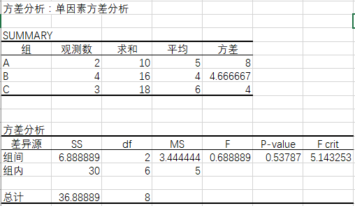
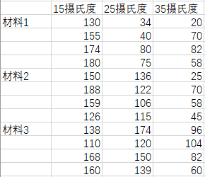
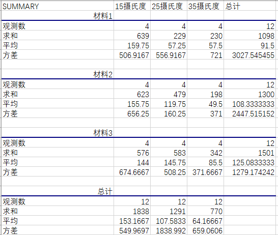
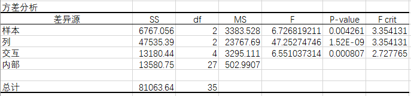
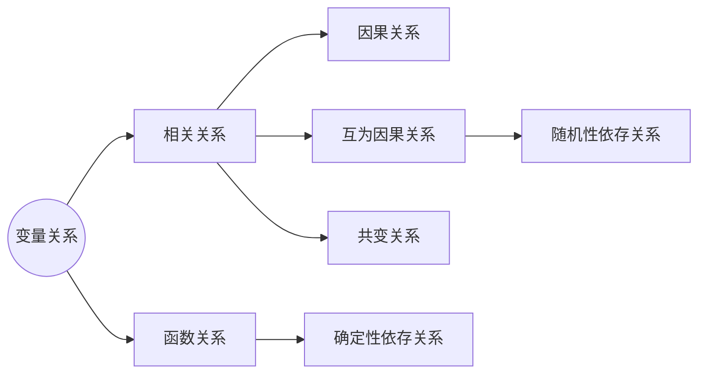
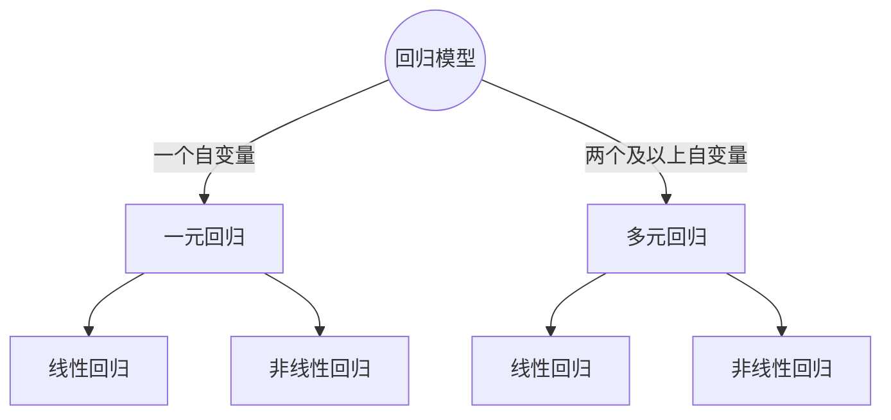
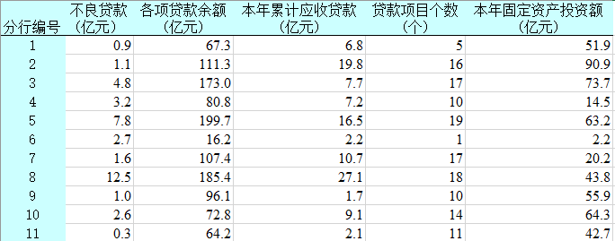
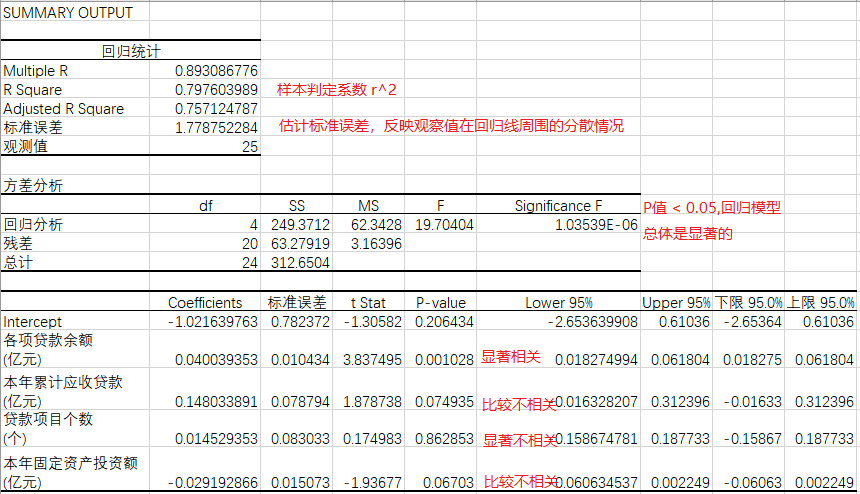
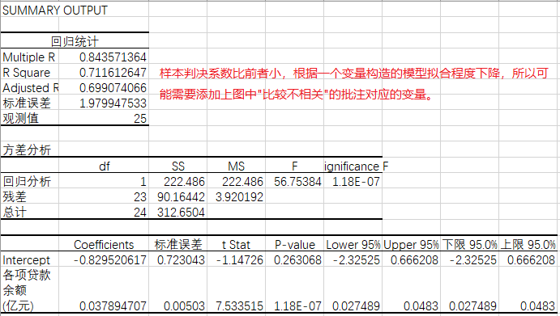

##第五章 方差分析

**因素** 是指所要研究的变量，它可能对因变量产生影响。如果方差分析只对一个因素进行称为单因素方差分析。若还是针对两个或两个以上元素进行分析分为多因素方差分析。

**水平** 是指因素的具体表现，例如质量的三个等级好、中、差。

**交互作用** 如果一个因素的效应大小在另一个因素不同水平下明显不同，称为两因素间存在交互作用。

**方差分析基本思想** 

利用方差的可分解性，检查所讨论因素是否作为系统性因素来影响实验结果。所谓“系统性因素”是指由于试验因素的变异而产生的试验结果的数量差异。例如：利用四种配料生产某种产品，其使用寿命差异就是配料方法不同，所造成的类型差异和很多未能控制的“偶然因素”所造成的随机差异（残差）的总和。进行方差分析的目的就是要认识产品使用寿命的差异主要是由类型差异引起的还是由随即差异引起的。

**方差分析的理论假设**

- 对每个总体，效应变量服从正态分布；
- 对每个总体，效应变量的方差相同；
- 观察值是独立的；

###5.1 方差分析的基本原理

效应与误差模型

对于任意的随机变量X，它都可以分解成两部分
$$
X = \mu + \epsilon
$$
称X的均值$\mu$ 为X的**效应**，效应是固定的也称为固定效应，$\epsilon$ 为X关于$\mu$ 的误差。
$$
X \sim N(\mu, \sigma^2) 等价于 \epsilon \sim N(0, \sigma^2)
$$
样本的数据分解与平方和分解

对于X的随机样本$X_1, X_2,...,X_n$ ，其每一个观察值
$$
X_i = \mu + \epsilon_i，i=1,2,...,n 且E(\epsilon_i) = 0，Var(\epsilon_i)=Var(X_i)=\sigma^2
$$
用样本均值估计总体均值的数据分解
$$
X_i = \overline{X} + (X_i - \overline{X})，i=1,2,...,n，其中X_i - \overline{X}是误差\epsilon_i的估计
$$
平方和分解（正交分解$a^2+2ab+b^2 = a^2 + b^2 ,2ab=0$）
$$
\sum_{i=1}^{n} X_i^2 = n\overline{X}^2 + \sum_{i=1}^{n}(X_i - \overline{X})^2
$$

自由度分解
$$
n = 1 + (n-1)
$$
实际意义：数据分解可以写成向量形式
$$
\left (\begin{matrix}
X_1 \\
X_2 \\
...     \\
X_n
\end{matrix} \right ) =
\left (\begin{matrix}
\overline{X} \\
\overline{X}\\
...     \\
\overline{X}
\end{matrix} \right ) +
\left (\begin{matrix}
X_1 - \overline{X}\\
X_2 - \overline{X}\\
...     \\
X_n -\overline{X}
\end{matrix} \right ) ，其中分解后两个向量正交
$$
平方和分解满足向量的勾股定理或力学分解即作用于样本数据的力可以独立地分解为总体效应的估计和误差的估计这两种力。则有勾股定理可以得到
$$
\left (\begin{matrix}
X_1 \\
X_2 \\
...     \\
X_n
\end{matrix} \right )^2 =
\left (\begin{matrix}
\overline{X} \\
\overline{X}\\
...     \\
\overline{X}
\end{matrix} \right )^2 +
\left (\begin{matrix}
X_1 - \overline{X}\\
X_2 - \overline{X}\\
...     \\
X_n -\overline{X}
\end{matrix} \right )^2
$$
假设检验（正态总体条件下）：$H_0: \mu=0；H_1: \mu \ne 0$

T检验统计量
$$
T_0 = \frac{\overline{X}}{S / \sqrt{n}} \sim t(n-1) ，H_0为真时
$$
T检验统计量的等价检验为自由度为(1, n-1)的F检验
$$
F = T_0^2 = \frac{\overline{X}^2}{S^2 / n} = \frac{n \overline{X}^2 / 1}{\sum_{i=1}^{n}(X_i-\overline{X})^2 / (n-1)} \sim F(1, n-1) ，H_0为真时
$$
F检验与数据平方和分解的关系
$$
平方和分解：SS  = SS_{\mu} + SS_{\epsilon} ，其中SS=\sum_{i=1}^{n}X_i^2，SS_{\mu} = n \overline{X}^2 \\
SS_{\epsilon}  = \sum_{i=1}^{n}(X_i - \overline{X})^2 \\
自由度分解：f = f_{\mu} + f_{\epsilon}，其中f = n，f_{\mu} = 1，f_{\epsilon} = n-1
$$
F检验统计量可以写成
$$
F = \frac{SS_{\mu} / f_{\mu}}{SS_{\epsilon} / f_{\epsilon}} \sim F(f_{\mu}, f_{\epsilon})，H_0为真时
$$

###5.2 单因素方差分析

| 因素水平 | r个独立样本                 | 样本总和 | 水平均值         | 总体均值       |
| -------- | --------------------------- | -------- | ---------------- | -------------- |
| $A_1$    | $X_{11},X_{12},...X_{1n_1}$ | $T_1$    | $\overline{X_1}$ | $\overline{X}$ |
| $A_2$    | $X_{21},X_{22},...X_{2n_2}$ | $T_2$    | $\overline{X_2}$ | $\overline{X}$ |
| ...      | ...                         | ...      | ...              | ...            |
| $A_r$    | $X_{r1},X_{r2},...X_{rn_r}$ | $T_r$    | $\overline{X_r}$ | $\overline{X}$ |

其中
$$
\overline{X}_i = \frac{1}{n_i} \sum_{j=1}^{n_i} X_{ij} \\
\overline{X} = \frac{1}{n}\sum_{i=1}^{r}n_i \overline{X}_i，其中n=\sum_{i=1}^{r}n_i \\
$$
上表数据结构是按一种方式或一个因素进行分组，例如：一个力分解为r个力，而r个力中每一个力实施的大小水平是不同的。数据模型为
$$
X_{ij} = \mu_i + \epsilon_{ij}，其中i=1,2,...,r，j=1,2,...,n_i 
$$
假定
$$
X_{ij} \sim N(\mu_i, \sigma^2)或\epsilon_{ij} \sim N(0, \sigma^2) \\
X_{11},...,X_{1n_1};...;X_{r1},...,X_{rn_r} 相互独立、方差相同
$$
假设检验：$H_0: \mu_1=...=\mu_r；H_1: \mu_1,...,\mu_r 不全相等 $

因素效应模型
$$
因素水平的总平均 \mu = \frac{1}{n}\sum_{i=1}^{r}n_i \mu_i，其中n=\sum_{i=1}^{r}n_i \\
因素水平A_i的效应 \alpha_i = \mu_i - \mu 满足\sum_{i=1}^{r}n_i \alpha_i = 0
$$
单因素方差分析模型的另一种表示
$$
X_{ij} = \mu + \alpha_i + \epsilon_{ij}，其中j=1,...,n_i，i=1,2,...,r \\
\sum_{i=1}^{r}n_i \alpha_i = 0，\epsilon_{ij} \sim N(0, \sigma^2)且相互独立
$$
假设检验的另一种表示
$$
H_0: \alpha_1=...=\alpha_r；H_1: \alpha_1,...,\alpha_r 不全为零
$$

**离差平方和**

总离差平方和(Sum of Squares for Total, SST)映全部观察值的离散状况，计算公式为
$$
SST = \sum_{i=1}^{r} \sum_{j=1}^{n_i} (x_{ij} - \overline{X})^2
$$
组间离差平方和(Sum of Squares for Factor A，SSA)又称水平项离差平方和，包括随机误差和系统误差，计算公式为
$$
SSA = \sum_{i=1}^{r} n_i (\overline{X}_i - \overline{X})^2
$$
组内离差平方和(Sum of Squares for Error，SSE)又称误差项离差平方和，反映了`水平` 内部观察值的离散情况，即随机因素的影响。计算公式为
$$
SSE = \sum_{i=1}^{r}\sum_{j=1}^{n_i} (x_{ij} - \overline{X}_i)^2
$$
**方差分析表**

| 方差来源 | 离差平方和 | df（自由度） | 均方MS        | F       |
| -------- | ---------- | ------------ | ------------- | ------- |
| 组间     | SSA        | r-1          | MSA=SSA/(r-1) | MSA/MSE |
| 组内     | SSE        | n-r          | MSE=SSE/(n-r) |         |
| 总方差   | SST        | n-1          |               |         |

**判断结果**

1. 若$F \ge F_{\alpha}(f_{\mu}, f_{\epsilon}) 或P值 \ge \alpha$ 则拒绝原假设，表明均值之间差异显著，因素A对观察值有显著影响；
2. 若$F \lt F_{\alpha}(f_{\mu}, f_{\epsilon}) 或P值 \lt \alpha$ 则不能拒绝原假设，表明均值之间差异不显著，因素A对观察值没有显著影响。

例子：某人在街头随机访问9人，请他们对某事件打分，然后按他们的职业A,B,C进行分组，得

| 职业 | 打分    | 样本总和 | 样本均值 | 样本量 |
| ---- | ------- | -------- | -------- | ------ |
| A    | 3,7     | 10       | 5        | 2      |
| B    | 4,2,7,3 | 16       | 4        | 4      |
| C    | 8,4,6   | 18       | 6        | 3      |

请问各职业人群之间的评价是否有显著差异？

Excel中显著水平默认为0.05，因为
$$
F=0.688889 < F_{\alpha=0.05}(2,6) = 5.143253，P值=0.53787\\
则不拒绝原假设 H_0：\mu_a=\mu_b=\mu_c
$$
则各职业人群之间不存在显著差异。

###5.3 无相互作用的双元素方差分析 

无交互作用的双元素模型为
$$
X_{ij} = \mu + \alpha_i + \beta_j + \epsilon_{ij}，其中\sum_{i=1}^{r} \alpha_i=0，\sum_{j=1}^{s} \beta_j=0 \\
\alpha_i = \mu_{i*} - \mu，\beta_j = \mu_{*j} - \mu \\
\mu = \frac{1}{rs}\sum_{i=1}^{r} \sum_{j=1}^{s} x_{ij} \\
\mu_{i*} = \frac{1}{s} \sum_{j=1}^{s} x_{ij} \\
\mu_{i*} = \frac{1}{r} \sum_{j=1}^{r} x_{ij} \\
$$
**离差平方和** 
$$
SST = \sum_{i=1}^{r} \sum_{j=1}^{s}(X_{ij} - \overline{X})^2 \\
SSA = \sum_{i=1}^{r}(\overline{X_{i*}} - \overline{X})^2\\
SSB = \sum_{j=1}^{s}(\overline{X_{*j}} - \overline{X})^2\\
SSE =  \sum_{i=1}^{r} \sum_{j=1}^{s}(X_{ij} - \overline{X}_{i or j})^2 \\ 
\ \\
满足方程 SST = SSA + SSB + SSE
$$
**方差分析表** 
| 方差来源 | 离差平方和 | df         | 均方MS               | F       |
| -------- | ---------- | ---------- | -------------------- | ------- |
| 因素A    | SSA        | r-1        | MSA=SSA/(r-1)        | MSA/MSE |
| 因素B    | SSB        | s-1        | MSB=SSB/(s-1)        | MSB/MSE |
| 误差     | SSE        | (r-1)(s-1) | MSE = SSE/(r-1)(s-1) |         |
| 总方差   | SST        | rs-1       |                      |         |

**原假设** 
$$
对因素A \quad H_0：\mu_1=\mu_2=...\mu_r=0；H_1： \mu_1,...,\mu_r不全相等 \\
对因素B \quad H_0：\mu_1=\mu_2=...=\mu_s=0；H_1： \mu_1,...,\mu_s不全相等
$$

**判别条件** 

1. 若$F_A \ge F_{\alpha}(r-1, (r-1)(s-1))$ ，则拒绝原假设$H_{01}$ ，表明因素A对观察值有显著影响；
2. 若$F_B \ge F_{\alpha}(s-1,(r-1)(s-1))$ ，则拒绝原假设$H_{02}$ ，表明因素B对观察值有显著影响；

###5.4有交互作用的双元素方差分析

| 因素水平 | $B_1$            | ...  | $B_s$            | 均值             |
| -------- | ---------------- | ---- | ---------------- | ---------------- |
| $A_1$    | $X_{11}$         | ...  | $X_{1s}$         | $\overline{X}_1$ |
| ...      | ...              | ...  | ...              | ...              |
| $A_r$    | $X_{r1}$         | ...  | $X_{rs}$         | $\overline{X}_r$ |
| 均值     | $\overline{X}_1$ | ...  | $\overline{X}_s$ | $\overline{X}$   |

1. 建立假设
   $$
   对因素A \quad H_{01}：\alpha_i =0；H_{11}：H_{11}：a_i不全为零 \\
   对因素B \quad H_{02}：\beta_j = 0；H_{12}：\beta_i不全为零 \qquad \ \ \\
   对因素A和B的交互效应 \quad H_{03}：(\alpha \beta)_{ij} = 0 ；H_{13}：(\alpha \beta)_{ij}不全为零
   $$

2. 构造检验F统计量，假设X为t维向量
   $$
   SST = \sum_{i=1}^{r} \sum_{j=1}^{s} \sum_{k=1}^{t}(X_{ij}(t) - \overline{X})^2 \\
   SSA = \sum_{i=1}^{r}st(X_{i*} - \overline{X}_i)^2 \\
   SSB =  \sum_{j=1}^{s}rt(X_{*j} - \overline{X}_j)^2 \\
   SSAB =\sum_{i=1}^{r} \sum_{j=1}^{s} t(\overline{X} - \overline{X}_{i*} - \overline{X}_{*j} + \overline{X_{ijt}})\\
   SSE = \sum_{i=1}^{r} \sum_{j=1}^{s} \sum_{k=1}^{t} (X_{ij}(k) - \overline{X_{i or j}})^2
   $$
   有交互作用的双因素方差分析表

   | 方差来源  | 离差平方和 | df         | 均方MS                 | F        |
   | --------- | ---------- | ---------- | ---------------------- | -------- |
   | 因素A     | SSA        | r-1        | MSA=SSA/(r-1)          | MSA/MSE  |
   | 因素B     | SSB        | s-1        | MSB=SSB/(s-1)          | MSB/MSE  |
   | 因素A * B | SSAB       | (r-1)(s-1) | MSAB=SSAB/[(r-1)(s-1)] | MSAB/MSE |
   | 误差      | SSE        | rs(t-1)    | MSE = SSE/rs(t-1)      |          |
   | 总方差    | SST        | n-1        |                        |          |

   **判别条件**

   1. 若$F_A \ge F_{\alpha}(r-1, n - rs)$ ，则拒绝原假设$H_{01}$ ，表明因素A对观察值有显著影响；
   2. 若$F_B \ge F_{\alpha}(s-1, n - rs)$ ，则拒绝原假设$H_{02}$ ，表明因素B对观察值有显著影响；
   3. 若$F_{AB} \ge F_{\alpha}(n-r-s+1, n - rs)$ ，则拒绝原假设$H_{03}$ ，表明因素A、B的交互效应对观察值有显著影响；

例子：电池的板极材料与使用的环境温度对电池的输出电压均有影响，令材料类型与环境温度都取了三个水平，测得输出电压数据如下所示，问不同材料、不同温度及它们交互作用对输出电压有无显著影响？

| 材料类型 | 15摄氏度                                            | 25摄氏度                                            | 35摄氏度                                         |
| -------- | --------------------------------------------------- | --------------------------------------------------- | ------------------------------------------------ |
| 1        | $\begin{matrix} 130 & 155 \\ 174 & 180\end{matrix}$ | $\begin{matrix} 34& 40 \\ 80 & 75\end{matrix}$      | $\begin{matrix} 20 & 70 \\ 82 & 58\end{matrix}$  |
| 2        | $\begin{matrix} 150 & 188 \\ 159 & 126\end{matrix}$ | $\begin{matrix} 136 & 122 \\ 106 & 115\end{matrix}$ | $\begin{matrix} 25 & 70 \\ 58 & 45\end{matrix}$  |
| 3        | $\begin{matrix} 138 & 110 \\ 168 & 160\end{matrix}$ | $\begin{matrix} 174 & 120 \\ 150 & 139\end{matrix}$ | $\begin{matrix} 96 & 104 \\ 82 & 60\end{matrix}$ |

使用Excel中数据分析工具"可重复双因素分析"就能够得到以上结果，P值可以判断，上述原假设均被拒绝，因此材料、温度与温度和材料的交互都会对观测值的结果产生影响。

##第六章 相关与回归分析

相关和回归分析是研究事物的相互关系，测定它们联系的紧密程度，揭示其变化的具体形式和规律性的统计方法，是构造各种经济模型、进行结构分析、政策评价、预测和控制的重要工具。

客观现象之间的数量联系存在两种不同的类型

1. 函数关系，当一个（一组）变量每取一个值时，相应的另一个变量必然有一个确定值与之一一对应；
2. 相关关系（Corelation），变量之间存在依存关系，但是不完全确定的随机关系，即一个（一组）变量每取一个值时，相应的另一个变量有多个不同值与之对应；而相关分析就是用一个指标表明现象间相互依存关系的紧密程度。

相关关系的特点：1.变量间关系不能用函数关系精确表达；2. 一个变量的取值不能由另一个变量唯一确定；3. 当变量x去某个值的时，变量y的取值可能有几个。相关关系与函数关系的关联：在一定条件下相互转化。相关关系的种类有两种：正相关和负相关。

- 正相关，两个变量之间的变化方向一致，都是增长趋势或下降趋势；例如：收入和消费的关系。
- 负相关，两个变量变化趋势相反，一个下降而另一个上升，防止亦然；例如：物件和消费的关系。

相关关系的主要内容：确定现象之间是否存在相关关系，确定相关关系的紧密程度以及可能的数学模型，并且确定因变量估计值误差并做预测。

###6.1 简单相关系数

(简单)相关系数是度量两个变量之间`线性` 相关密切程度和相关方向的统计指标。又称为皮尔逊相关系数，若相关系数是根据总体全部数据计算出来的，则用$\rho$ 表示；若是根据样本数据计算的，则称为样本相关系数，用$r$ 表示。样本相关系数是总体相关系数的一致估计量。样本协方差和样本相关系数公式如下
$$
样本协方差 \quad C(x，y) = \frac{1}{n-1} \sum_{i=1}^{n}(x_i - \overline{x})(y_i - \overline{y}) \\
S_x^2 = \frac{1}{n-1} \sum_{i=1}^{n}(x_i - \overline{x})^2 ，S_y^2 = \frac{1}{n-1} \sum_{j=1}^{n} (y_i - \overline{y})^2\\
样本相关系数 \quad r_{xy} = \frac{C(x，y)}{S_{x}S_{y}} = \frac{\sum_{i=1}^{n}(x_i - \overline{x})(y_i - \overline{y})}{\sqrt{\sum_{i=1}^{n}(x_i - \overline{x})^2 \cdot \sum_{j=1}^{n} (y_i - \overline{y})^2 }} \\
= \frac{n\sum xy - \sum x \sum y}{\sqrt{n \sum x^2 - (\sum x)^2} \cdot \sqrt{n \sum y^2 - (\sum y)^2}}
$$

| r取值范围               | 说明                  |
| ----------------------- | --------------------- |
| 0.1~0.3                 | 微弱相关              |
| 0.3~0.5                 | 低度相关              |
| 0.5~0.8                 | 显著相关              |
| 0.8~1.0                 | 高度相关              |
| r=0，不存在线性相关关系 | \|r\|=1，完全线性相关 |

**相关系数的显著性检验**

1. 检验两个变量之间是否存在线性相关关系

   总体相关系数是未知的，常用样本相关系数去估计。不同样本其相关系数不同，样本相关系数对总体相关系数的代表程度与样本容量有关。计算出样本相关系数后，需要对其进行`显著性检验` ，以判定`总体间线性相关是否显著`。

   在二元正态总体情况下，r的抽样分布具有确定的函数形式，当总体相关系数$\rho=0$ 时，r呈t分布[^1]。

2. 采用T检验，对样本相关系数r进行显著性检验
   $$
   原假设  \quad H_0：\rho=0；H_1：\rho \ne 0 \\
   检验统计量 \quad t = \frac{r}{\sqrt{1 - r^2} / \sqrt{n-2}} \sim t(n-2) \\
   确定显著水平 \quad 若|t| \ge t_{\alpha/2}，拒绝H_0；若|t| \lt t_{\alpha/2}，接受H_0。
   $$
   ​

3. 等价于对回归系数b的检验

例子：当n=10，样本相关系数$r=0.9878$ ，对相关系数进行显著性检验$\alpha=0.05$
$$
计算t统计量 \quad t = \frac{0.9878}{\sqrt{1 - 0.9878^2}/\sqrt{10 -2}} = 17.84 \gt t_{\alpha/2}(10-2)=2.036
$$
所以拒绝原假设，即总体相关系数不为零，两变量之间的线性相关关系显著。

###6.2 一元线性回归分析

**回归** 研究随机变量Y关于另一个变量X的函数关系(回归关系)，即什么形式的函数f(x)与y最接近。这里X可以是确定性变量也可以是随机变量。

> 回归效应：向中间值靠近的趋势。

| 相关关系                           | 回归关系                                                     |
| :--------------------------------- | ------------------------------------------------------------ |
| 变量x与变量y处于平等地位           | y为因变量处于被解释地位，变量x是自变量用于预测因变量变化     |
| 变量x和y都是随机变量               | 因变量y为随机变量，而自变量x则作为研究时给定的非随机变量     |
| 描述两个变量间的线性关系的密切程度 | 揭示自变量x对变量y的影响大小，同时可由回归方程进行预测或控制 |

相关关系是回归分析的基础和前提，回归分析是相关分析的深入和继续。回归分析的分类

$$
一元线性回归 \quad Y = \alpha + \beta X \\
$$

其中线性部分反映了由于x的变化而引起的y的变化，$\alpha + \beta X$ 是Y的数学期望，即对应于X某一个取值时Y的平均值$E(Y) = \alpha + \beta X$ 。

**随机误差项** 

又称为随机干扰项$\epsilon$ 是随机变量，反映 1. 除了x和y之间线性关系外的随机因素对y的影响，2. 是不能由x和y之间的线性关系所解释的变异性。随机误差项是y与E(y)的离差
$$
\epsilon = y - E(y) = y - (\alpha + \beta x)
$$
总体回归方程中的参数$\alpha 、\beta$ 是未知的，需要用样本统计量进行估计。因此得到一元线性回归中估计的回归方程为
$$
y = a + b x + e
$$
其中b称为`回归系数` ，y为平均波动值，e称为`残差` ，与总体误差项$\epsilon$ 相互对应。

**高斯假定** 

误差项$\epsilon$ 是一个期望为0，且对于所有x值，$\epsilon$ 的方差都相同，即是一个服从正态分布的随机变量且相互独立。

**回归参数的最小二乘估计** 

基本原理：因变量的观察值与估计值之间的离差平方和达到最小时求得，即
$$
f(a, b) = \sum \epsilon = \sum_{i=1}^{n}(Y_i - y_i)^2，其中Y_i为观测值，y_i为估计值
$$
为是f(a,b)值达到最小值，可以得到
$$
\frac{\partial f}{\partial a} = -2 \sum (Y - a - bx) = 0 \\
\frac{\partial f}{\partial b} = -2 \sum x(Y - a - bx) = 0 \\
求得 \\
b = \frac{\sum (x - \overline{x})(y - \overline{y})}{\sum (x - \overline{x})^2} \\
a = \overline{y} - b \overline{x}
$$
**相关系数与回归系数的关系**
$$
相关系数 r =\frac{\sum (x - \overline{x})(y - \overline{y})}{\sqrt{\sum (x - \overline{x}) \sum (y - \overline{y})}} = \frac{Cov(x,y)}{S_x S_y} \\
回归系数 b =\frac{\sum (x - \overline{x})(y - \overline{y})}{\sum (x - \overline{x})^2} = \frac{Cov(x, y)}{S_x^2}
$$
**回归方程的显著检验** 

一级检验又称统计学检验，利用抽样理论检验样本回归方程的可靠性，包括拟合程度评价、显著性检验。二级检验又称经济计量学检验，它对标准线性回归模型的假定条件能够满足进行检验，包括序列相关检验、异方差性检验等。
$$
\sigma^2_r = E\{[Y - f(x)]^2 | X = x\} \\
\sigma^2_r = E\{Y - E(x)\} \\

回归是要回归到均值
$$
**一级检验**  

1. 对整个回归方程的显著性检验--F检验

   对自变量和因变量之间的线性关系整体上是否显著进行检验。方法是将回归平方和(SSR，Sum of Squares due to Regression)同残差平方和(SSE，Sum of Squares due to Error)加以比较，用F检验分析两者之间的差别是否明显。
   $$
   (1)提出假设 \quad H_0：\beta=0；H_1：\beta \ne 0 \qquad \qquad \qquad \qquad \qquad \ \  \ \quad \\
   (2) 计算检验统计量 F = \frac{SSR/1}{SSE / (n-1 -1)} = \frac{MSR}{MSE} \sim F(1, n-2) \\
   其中 SSR = \sum_{i=1}^{n}(y_i - \overline{y})^2，SSE= \sum_{i=1}^{n}(Y_i - y_i)^2 \\
   MSR回归均方误差，MSE为残差均方误差 \\
   (3) 若F \ge F_{\alpha}(1,n-2)，拒绝H_0；若F \lt F_{\alpha}(1,n-2)，接收H_0。
   $$
   `拟合程度` 是指样本观测值聚集在样本回归线周围的紧密程度。判定系数是建立在对总离差平方和分解的基础之上的
   $$
   SST(总离差平方和) = SSR(回归平方和) + SSE(残差平方和) \\
   \sum_{i=1}^{n}(Y_i - \overline{y})^2 = \sum_{i=1}^{n}(y_i - \overline{y})^2 + \sum_{i=1}{n}(Y_i - y_i)^2
   $$
   **样本判断系数(可决系数$r^2$)**
   $$
   r^2 = \frac{SSR}{SST} = 1- \frac{SSE}{SST}
   $$
   可决系数反映回归直线的拟合程度，当$r^2 \rightarrow 1$ 时，回归方程拟合的越好 ；若$r^2 \rightarrow 0$ 时，回归方程拟合的越差。可决系数是相关系数的平方，是样本观测值的函数是一个统计量。

   **估计标准误差$S_e$**

   残差平方和的均方根，计算公式为
   $$
   S_e = \sqrt{SSE} = \sqrt{\frac{\sum_{i=1}^{n}(Y_i - y_i)^2}{n - k -1}}，其中k为自变量的个数
   $$
   反映了实际观察值在回归直线周围的分散状况，也反映拟合的程度。

   `回归模型拟合优度的评价指标：判定系数、估计标准误差` 。显然判定系数更优，因为判定系数介于[0，1]之间是无量纲系数，而估计标准误差是有计量单位的，又无法确定取值范围。

2. 对回归系数的显著性检验--T检验

   检验x与y之间是否具有线性关系或者说自变量x对因变量y的影响是否显著。由于回归系数b是根据最小二乘求出的样本统计量，有自己的分布具体如下
   $$
   E(b) = \beta \\
   Var(b) = \frac{\sigma}{\sum(x_i - \overline{x})^2} ,由于\sigma未知，需要用S_y代替 \\
   b的样本误差为 \quad S_b^2 =  \frac{S_y^2}{\sum(x_i - \overline{x})^2}
   $$
   **回归系数b的显著性检验步骤** 
   $$
   (1) 提出假设 H_0：\beta=0；H_1：\beta \ne 0(有线性关系) \\
   (2) 计算统计量，当n \ge 30时， Z = \frac{b - \beta}{S_b} ；\\当n \lt 30时，t=\frac{b - \beta}{S_b} \sim t(n-2) \\
   (3)确定显著水平\alpha，当|t| \ge t_{\alpha/2}，拒绝H_0；\\当 |t| \lt t_{\alpha/2}，接受H_0。
   $$

**利用回归方程进行估计和预测** 

估计和预测类型

1. 点估计，直接通过回归方程计算，但是不很准确；

2. 区间估计，计算平均值E(y)在1-a置信水平下的置信区间
   $$
   y \pm t_{\alpha/2}(n-2) S_y \sqrt{\frac{1}{n} + \frac{(x - \overline{x})^2}{\sum_{i=1}^{n}(x_i - \overline{x})^2}}，其中S_y为估计标准误差
   $$

###6.3 多元线性相关与回归分析

**多元线性回归模型** 

一个因变量与两个及两个以上的自变量之间的回归，描述因变量如何依赖自变量$x_1,x_2,...,x_p$ 和误差项$\epsilon$ 的方程称为多元线性回归模型。
$$
y = \beta_0 + \beta_1 x_1 + \beta_2 x_2 + ... + \beta_p x_p + \epsilon
$$
其中$\beta_0$为常数项代表平面与y轴的截距，$\beta_1$ 为偏回归系数，表示在其他X固定时，x1每变化一个单位引起的Y的平均波动。$\epsilon$ 是被称为误差项的随机变量。

对于n组实际观察数据$yi;x_{i1}，x_{i2}，...，x_{ip}，i=1,2,...,n$ ，多元线性回归模型可表示为
$$
\begin{cases}
y_1 = \beta_0 + \beta_1 x_{11} + \beta_2 x_{12} + ... + \beta_p x_{1p} + \epsilon_1 \\
y_2 = \beta_0 + \beta_1 x_{21} + \beta_2 x_{22} + ... + \beta_p x_{2p} + \epsilon_2 \\
... \\
y_n = \beta_0 + \beta_1 x_{n1} + \beta_2 x_{n2} + ... + \beta_p x_{np} + \epsilon_n \\
\end{cases}
$$
**参数的最小二乘法** 

使因变量的观察值与估计值之间的离差平方和达到最小求得参数估计值$\hat{\beta_0}，\hat{\beta_1}，...，\hat{\beta_p}$ ，即
$$
min \ f(\hat{\beta_0}，\hat{\beta_1}，...，\hat{\beta_p}) = min \{\sum_{i=1}^{n}(y_i - \hat{y})^2 = \sum_{i=1}^{n} e^2_i \}
$$
根据最小二乘法，通过对上式回归参数求偏导数得
$$
\begin{cases}
\frac{\partial f}{\partial \beta_1} = 0\\
\frac{\partial f}{\partial \beta_2} = 0\\
... \\
\frac{\partial f}{\partial \beta_p} = 0\\
\end{cases}
$$
**回归方程的显著性检验** 

`总体的显著性检验` 检验因变量与所有自变量和之间是否存在一个显著的线性关系。`检验方法` 是将回归离差平方和(SSR)同残差平方和(SSE)比较，`应用F检验` 分析两者差别是否显著。
$$
(1)提出假设 H_0：\beta_1=\beta_2=...=\beta_p= 0；H_1：\beta_1，...，\beta_p至少有一个不等于0；\\
(2)计算检验统计量F = \frac{SSR/p}{SSE/(n - p -1)} =\frac{\sum(\hat{y}_i-\overline{y})^2/p}{\sum(y_i - \hat{y}_i)^2/(n-p-1)} \sim F(p, n -p-1) \\
（3）确定显著水平\alpha和参数变量个数p，若F \ge F_{\alpha}，拒绝H_0；若F \lt F_{\alpha}，接受H_0.
$$
**回归系数的显著检验** 

若F检验回归模型总体是显著的，那么回归系数的检验就是用来确定每一个单个自变量$x_i$ 对因变量$y_i$ 的影响是否显著；对每一个自变量都要单独检验，采用t检验，在多元线性回归中，回归方程的显著检验`不再等价于` 回归系数的显著性检验。
$$
(1) 提出假设 H_0：\beta_i = 0；H_1：\beta_i \ne 0(自变量x_i与因变量y没有线性关系)；\\ H_1：\beta_i \ne 0 (自变量x_i与因变量y有线性关系) \\
(2)计算检验统计量t = \frac{\hat{\beta_i}}{S_{\hat{\beta_i}}} \sim t(n - p -1) \qquad  \qquad  \qquad  \qquad  \qquad  \qquad  \ \\
(3)确定显著水平\alpha，若|t| \ge t_{\alpha/2}，拒绝H_0；|t| \lt t_{\alpha/2}，接受H_0  \qquad   \qquad  \ \ \
$$

###6.4 例子：用excel进行回归分析

其中"Significance F"代表P值。

###6.5 虚拟变量（哑变量）

**虚拟变量的定义**

t通常是对于对于分散变量（分类变量、因子变量）来说。例如：假设体重为因变量，身高为自变量，性别也为自变量构成多元线性回归。这里性别是离散变量，在建立回归方程时应该怎么处理呢？这里就可以使用哑变量处理，这里增加1个哑变量

| 哑变量 | is_man |
| ------ | ------ |
| 男性   | 1      |
| 女性   | 0      |

有假设颜色(红、绿、蓝)也作为一种变量构建回归方程，这里颜色为离散变量，不使用红、绿、蓝用1、2、3代替，而是使用哑变量，如下所示

| 哑变量 | is_red | is_green | is_blue |
| ------ | ------ | -------- | ------- |
| 红色   | 1      | 0        | 0       |
| 绿色   | 0      | 1        | 0       |
| 蓝色   | 0      | 0        | 1       |

由此可以得到此**加法模型**的回归方程的表达式为
$$
weight = a  +  b\cdot height + c\cdot is\_man  + e \cdot is\_red + f \cdot is\_green + g \cdot is\_blue
$$
**加法模型中虚拟变量的作用**：影响截距$a$的值

若想要哑变量影响回归方程的斜率，则可以使用乘法模型
$$
weight = a + b \cdot height  + c\cdot is\_man \cdot heigh+ e \cdot is\_red \cdot height
\\ + f \cdot is\_green \cdot height + g \cdot is\_blue \cdot height
$$
**加法模型中虚拟变量的作用**：影响回归方程的斜率

同样可以将加法模型和乘法模型结合，让哑变量同时影响斜率和截距，这里仅仅以性别为哑变量举例
$$
weight  = a + b \cdot height + c \cdot is\_man + e \cdot is\_man\cdot height
$$

***

[^1]: T检验，亦称student t检验（Student's t test），主要用于样本含量较小（例如n<30），[总体标准差](https://baike.baidu.com/item/%E6%80%BB%E4%BD%93%E6%A0%87%E5%87%86%E5%B7%AE)σ未知的[正态分布](https://baike.baidu.com/item/%E6%AD%A3%E6%80%81%E5%88%86%E5%B8%83)。
[^2]: P值（P value）就是当原假设为真时所得到的样本观察结果或更极端结果出现的概率
