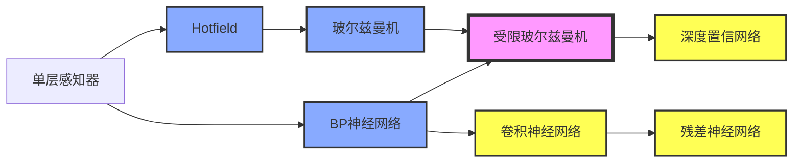

## 第一章 神经网络与深度学习

- **神经网络基础**：单层感知器，线性神经网络，BP神经网络，Hopfield神经网络，径向基神经网络，PCA与SVM神经网络
- **神经网络进阶**：自编码器，秲疏自编码器，玻尔兹曼机，受限玻尔兹曼机，递归神经网络，自组细竞争神经网络
- **深度学习网络**：深度置信网络，卷积神经网络，深度残差网络    

###1. 神经网络概述

神经网络的研究可以追溯到19世纪末期，美国心理学家William James的《心理学原理》 ，首次详细论述人脑结构与功能，对学习，联想记忆相关基本原理作了开创性研究，此为启蒙时期。**M-P模型**  1943年精神病学家和神经元解剖学家McCulloch和数学天才Pitts在生物物理学期刊发表文章提出神经元的数学描述和结构，其中神经元的活动表现为二值变化即“全或无”原则，要么兴奋要么抑制； 他们证明了只要有足够的简单神经元，在这些神经元相互连接并同步运行的情况下，可以模拟任何计算函数（M-P模型），这个开创性工作被认为是人工神经网络的起点。**Hebb学习规则** 1949年生理学家Hebb出版了《行为组细学》 。描述了神经元权值的Hebb调整规则，引入“学习假说”描述为什么人会学习，即两个神经元之间重复激活，将使其连接权值加强，这成为学习系统和自适应系统的灵感源泉。**Rosenblatt感知器 ** 1957年Rosenblatt提出感知器的概念[^5]，掀起了神经网绚研究第一次热潮，提出感知器收敛定理，整个60年代感知器是如此流行，人们认为它可以完成任何事情，只要很多感知器连 在一起就可以完成大脑的工作。

**Minsky的打击**   Marvin Minsky是MIT人工智能实验室联吅创始人，人工智能之父。1969年Minsky和Papert出版《感知器》指出：单层感知器存在致命缺陷，简单的神经网络只能运用于线性问题的求解而且必须是线性可分问题，连易或这样的问题都难以解决。求解非线性问题的网络应具有隐层，但理论上还不能证明感知器扩展到多层是有意义的。单层感知器的局限性在多层情况下也不能被完全解决。由于Minsky在业界的地位，这些悲观观点极大影响了人工神经网络研究，其后经费萎缩， 大量研究人员流失，启蒙时期结束，此后陷入10年低潮时期。

**复兴时期** 60年代末遭受的质疑均在80年代被攻克，1982年美国加州工学院物理学家J.J.Hopfield提出了 Hopfield神经网格模型。1986年Rumelhart, Hinton, Williams发展了BP算法（多层感知器的误差反向传播算法），Rumelhart和McClelland 出版了《Parallel distribution processing: explorations in the microstructures of cognition》，迄今BP算法已被 用于解决大量实际问题。    

三层BP神经网绚的学习算法能推广到更多层吗？（学习信号越来越弱）；求解的问题通常丌是凸的，意味着有多个极值点 ；梯度下降法的弱点导致容易陷入局部极值点；只有w权值取得相当接近理想值时，才能得到较好的结果；浅层神经网绚无法模拟人类复杂的行为；文本分析，自然诧言处理，图像识别等领域需要能深层次学习的神经网绚；

###2. 深度学习概述

深度学习是机器学习研究中的一个新的领域，其动机在于建立、模拟人脑迕行分析学习的神经网络，它模仿人脑的机制来解释数据，例如图像，声音和文本。深度学习是无监督学习的一种。深度学习的概念源于人工神经网络的研究。含多隐层的多层感知器就是一种深度学习 结构。深度学习通过组吅低层特征形成更加抽象的高层表示属性类别戒特征，以发现数据的分布式特征表示。

深度学习的概念由Hinton等人于2006年提出。基于深信度网[^6] (DBN)提出非监督贪心逐层训练算法，为解决深层结构相关的优化难题带来希望， 随后提出多层自劢编码器深 层结构。此外Lecun等人提出的卷积神经网绚是第一个真正多层结构学习算法，它利用 空间相对关系减少参数数目以提高训练性能。    

Yann LeCun是人工智能尤其是深度学习领域最知名的学者之一，1960年 生于法国巴黎。在居里大学读博士期间，提出过后向传播学习算法。在多伦多大学随Hinton读博士后。 1988-2002年加盟贝尔实验室，期间 研发了卷积神经网络（Convolutional Neural Networks）不曾广泛用 于手写识别和OCR的图变换网绚斱法，当然形压缩技术DjVu可能更为大家所熟知。2003年加入纽约大学，从事广度不深度兼具的各类研究，涉及机器学习 、计算机视觉、秱劢机器人和计算神经学。他甚至还开发了一种开源的面向对象编程语言Lush，比Matlab功能迓要强，当然他也是一位Lisp高手。

**Alpha Go** Demis Hassabis英国天才，攻读人类神经学，创建Deepmind公司，后来由Google收购了该公司称为Google Deepmind。

深度学习正在引发一场深刻的技术革命，这是人类首次如此接近思维的本质。象手写体识别，脸像识别这类系统，过去的思路是从业务背景中先提取特征，然后产生若干辨识逻辑，再形成算法编程实现，但对于像imagenet那样要对上百万的图片进行上千个分类识别的问题，以往的技术就傻眼了，别说逻辑 ，连特征的提取都因为过于复杂而没办法进行。现在流行的深度学习网络的方法，把逻辑隐藏在成百上千万的神经网络权值里，让特征被自动识别不提取，却能得出让人吃惊的高准确率。给出通用的框架，通过大量学习数据训练出合适的权值，权值就是逻辑，这是未来的方向，那种先设计算法敲代码的日子该一去不复返了，以后甚至程序员的工作都由机器全部完成也不是没有可能。    

###3. 人工神经网络

人工神经网络时模仿人类的神经系统建立起来的，神经系统的基本单位为神经元，若干个神经元通过突出、树图连接起来建立反射回路，人类神经元如下图所示：

​    神经元的化学传递过程，人类的记忆就是神经元上的突触连接构成，通过学习在人体上形成无数的回路，然后每接收到一个刺激就会有一个反应，通过回路产生的电流对外界给出固定的反应。

信号从树突输入，通过树突上的电阻(权值，电阻越大过来的电流越少，权值越低)处理在细胞体2中汇总，细胞体对聚合的信号会做一个非线性的转换，这个非线性的转换称为激活函数，激活函数产生的经过会通过轴突传递给下一个神经细胞，神经元的简单原理图如下所示，单层感知器模仿的就是这个过程。学习与记忆 学习就是建立回路，部分结构是不生俱来，大部分是经过后天学习建立连接，记忆的本质是改变突触强度。

人工神经网络(ANN,)是迄今为止几乎最为成功的仿生学数学模型，是机器学习领域的热点，符合智能化机器的时代潮流。有统一的模型框架，很多算法问题可以划归为神经网绚系统学习问题加以解决（例如 SVM）。神经网络容易硬件化，元器件化，高集成化，并行化，并且性能优异，不需要CPU输入信号就会有反应，能耗低而CPU会空运转的，而神经网络不输入就不会有输出，功率是传统电脑的几十到几千分之一。神经网络设计具有较高技巧，同时它也是一个灰箱系统，容易掩盖某些业务背景细节，同时容易产生过度拟合。    

| 神经网络 | 冯诺依曼型计算机 |
| -------- | ---------------- |
|          |                  |
|          |                  |
|          |                  |
|          |                  |

神经元的多寡及信号传递的效率决定智力

###4. 单层感知器

### 参考文献

[^1]: deep learning by bengio
[^2]: 神经网络设计 . 美国 Hagan
[^3]: 神经网络与机器学习. 原书第3版
[^4]: 人工神经网络理论、设计及应用. 第2版
[^5]: THE PERCEPTRON A PROBABILISTIC MODEL FOR INFORMATION STORAGE AND ORGANIZATION  IN THE BRAIN
[^6]: Hinton G E, Salakhutdinov R R. Reducing the dimensionality of data with neural networks[J]. science, 2006, 313(5786): 504-507. 

