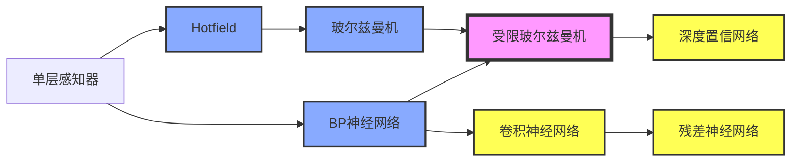
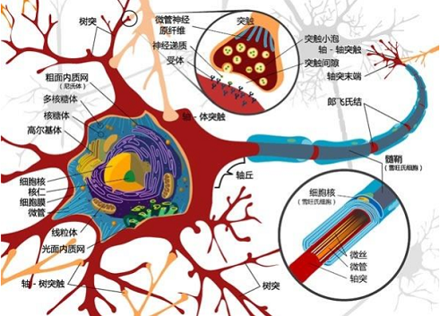
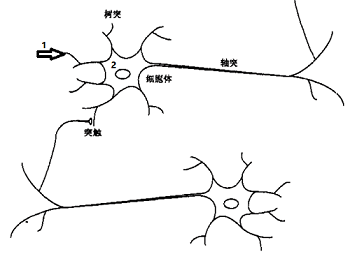
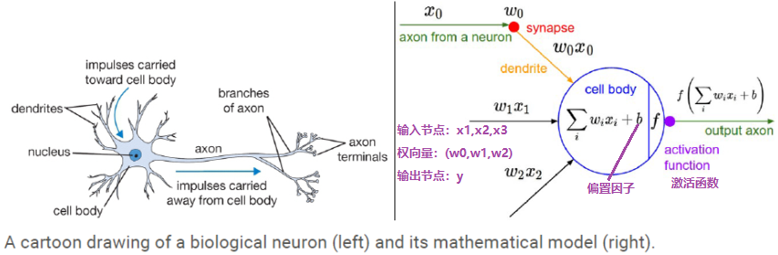
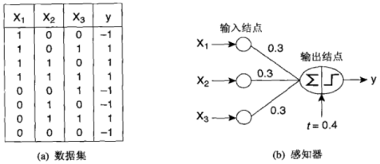

## 第一章 神经网络与深度学习

- **神经网络基础**：单层感知器，线性神经网络，BP神经网络，Hopfield神经网络，径向基神经网络，PCA与SVM神经网络
- **神经网络进阶**：自编码器，秲疏自编码器，玻尔兹曼机，受限玻尔兹曼机，递归神经网络，自组细竞争神经网络
- **深度学习网络**：深度置信网络，卷积神经网络，深度残差网络    

###1. 神经网络概述

神经网络的研究可以追溯到19世纪末期，美国心理学家William James的《心理学原理》 ，首次详细论述人脑结构与功能，对学习，联想记忆相关基本原理作了开创性研究，此为启蒙时期。**M-P模型**  1943年精神病学家和神经元解剖学家McCulloch和数学天才Pitts在生物物理学期刊发表文章提出神经元的数学描述和结构，其中神经元的活动表现为二值变化即“全或无”原则，要么兴奋要么抑制； 他们证明了只要有足够的简单神经元，在这些神经元相互连接并同步运行的情况下，可以模拟任何计算函数（M-P模型），这个开创性工作被认为是人工神经网络的起点。**Hebb学习规则** 1949年生理学家Hebb出版了《行为组细学》 。描述了神经元权值的Hebb调整规则，引入“学习假说”描述为什么人会学习，即两个神经元之间重复激活，将使其连接权值加强，这成为学习系统和自适应系统的灵感源泉。**Rosenblatt感知器 ** 1957年Rosenblatt提出感知器的概念[^5]，掀起了神经网绚研究第一次热潮，提出感知器收敛定理，整个60年代感知器是如此流行，人们认为它可以完成任何事情，只要很多感知器连 在一起就可以完成大脑的工作。

**Minsky的打击**   Marvin Minsky是MIT人工智能实验室联吅创始人，人工智能之父。1969年Minsky和Papert出版《感知器》指出：单层感知器存在致命缺陷，简单的神经网络只能运用于线性问题的求解而且必须是线性可分问题，连易或这样的问题都难以解决。求解非线性问题的网络应具有隐层，但理论上还不能证明感知器扩展到多层是有意义的。单层感知器的局限性在多层情况下也不能被完全解决。由于Minsky在业界的地位，这些悲观观点极大影响了人工神经网络研究，其后经费萎缩， 大量研究人员流失，启蒙时期结束，此后陷入10年低潮时期。

**复兴时期** 60年代末遭受的质疑均在80年代被攻克，1982年美国加州工学院物理学家J.J.Hopfield提出了 Hopfield神经网格模型。1986年Rumelhart, Hinton, Williams发展了BP算法（多层感知器的误差反向传播算法），Rumelhart和McClelland 出版了《Parallel distribution processing: explorations in the microstructures of cognition》，迄今BP算法已被 用于解决大量实际问题。    

三层BP神经网绚的学习算法能推广到更多层吗？（学习信号越来越弱）；求解的问题通常丌是凸的，意味着有多个极值点 ；梯度下降法的弱点导致容易陷入局部极值点；只有w权值取得相当接近理想值时，才能得到较好的结果；浅层神经网绚无法模拟人类复杂的行为；文本分析，自然诧言处理，图像识别等领域需要能深层次学习的神经网绚；

###2. 深度学习概述

深度学习是机器学习研究中的一个新的领域，其动机在于建立、模拟人脑迕行分析学习的神经网络，它模仿人脑的机制来解释数据，例如图像，声音和文本。深度学习是无监督学习的一种。深度学习的概念源于人工神经网络的研究。含多隐层的多层感知器就是一种深度学习 结构。深度学习通过组吅低层特征形成更加抽象的高层表示属性类别戒特征，以发现数据的分布式特征表示。

深度学习的概念由Hinton等人于2006年提出。基于深信度网[^6] (DBN)提出非监督贪心逐层训练算法，为解决深层结构相关的优化难题带来希望， 随后提出多层自劢编码器深 层结构。此外Lecun等人提出的卷积神经网绚是第一个真正多层结构学习算法，它利用 空间相对关系减少参数数目以提高训练性能。    

Yann LeCun是人工智能尤其是深度学习领域最知名的学者之一，1960年 生于法国巴黎。在居里大学读博士期间，提出过后向传播学习算法。在多伦多大学随Hinton读博士后。 1988-2002年加盟贝尔实验室，期间 研发了卷积神经网络（Convolutional Neural Networks）不曾广泛用 于手写识别和OCR的图变换网绚斱法，当然形压缩技术DjVu可能更为大家所熟知。2003年加入纽约大学，从事广度不深度兼具的各类研究，涉及机器学习 、计算机视觉、秱劢机器人和计算神经学。他甚至还开发了一种开源的面向对象编程语言Lush，比Matlab功能迓要强，当然他也是一位Lisp高手。

**Alpha Go** Demis Hassabis英国天才，攻读人类神经学，创建Deepmind公司，后来由Google收购了该公司称为Google Deepmind。

深度学习正在引发一场深刻的技术革命，这是人类首次如此接近思维的本质。象手写体识别，脸像识别这类系统，过去的思路是从业务背景中先提取特征，然后产生若干辨识逻辑，再形成算法编程实现，但对于像imagenet那样要对上百万的图片进行上千个分类识别的问题，以往的技术就傻眼了，别说逻辑 ，连特征的提取都因为过于复杂而没办法进行。现在流行的深度学习网络的方法，把逻辑隐藏在成百上千万的神经网络权值里，让特征被自动识别不提取，却能得出让人吃惊的高准确率。给出通用的框架，通过大量学习数据训练出合适的权值，权值就是逻辑，这是未来的方向，那种先设计算法敲代码的日子该一去不复返了，以后甚至程序员的工作都由机器全部完成也不是没有可能。    

###3. 人工神经网络

人工神经网络时模仿人类的神经系统建立起来的，神经系统的基本单位为神经元，若干个神经元通过突出、树图连接起来建立反射回路，人类神经元如下图所示：

​    神经元的化学传递过程，人类的记忆就是神经元上的突触连接构成，通过学习在人体上形成无数的回路，然后每接收到一个刺激就会有一个反应，通过回路产生的电流对外界给出固定的反应。

信号从树突输入，通过树突上的电阻(权值，电阻越大过来的电流越少，权值越低)处理在细胞体2中汇总，细胞体对聚合的信号会做一个非线性的转换，这个非线性的转换称为激活函数，激活函数产生的经过会通过轴突传递给下一个神经细胞，神经元的简单原理图如下所示，单层感知器模仿的就是这个过程。学习与记忆 学习就是建立回路，部分结构是不生俱来，大部分是经过后天学习建立连接，记忆的本质是改变突触强度。

人工神经网络(ANN,)是迄今为止几乎最为成功的仿生学数学模型，是机器学习领域的热点，符合智能化机器的时代潮流。有统一的模型框架，很多算法问题可以划归为神经网绚系统学习问题加以解决（例如 SVM）。神经网络容易硬件化，元器件化，高集成化，并行化，并且性能优异，不需要CPU输入信号就会有反应，能耗低而CPU会空运转的，而神经网络不输入就不会有输出，功率是传统电脑的几十到几千分之一。神经网络设计具有较高技巧，同时它也是一个灰箱系统，容易掩盖某些业务背景细节，同时容易产生过度拟合。    

| 神经网络 | 冯诺依曼型计算机 |
| -------- | ---------------- |
|          |                  |
|          |                  |
|          |                  |
|          |                  |

神经元的多寡及信号传递的效率决定智力

###4. 单层感知器

####4.1 单层感知器模型

神经元是单层感知器，最简单的人工神经网络，其中元素主要包括**输入节点**、**输出节点**、**权向量**、**偏置因子**、**激活函数**、**学习率**。如下图所示，神经元的基本结构是不变的，唯一能改变的就是权向量和偏置因子，那么问题就变为求一组合适的权向量和偏自因子使得输出能够尽量符合学习集的要求，单层感知器中的激活函数为$f = sing(x) = \begin{cases} 1 \quad x \ge 0 \\ -1 \quad x \lt 0\end{cases}$符号函数，称为$hardlimits$函数，另外一种符号函数$sing(x) = \begin{cases} 1 \quad x \ge 0 \\ 0 \quad x \lt 0\end{cases}称为$$hardlimit$函数。

单层感知器举例如下图所示，左边是一个数据集，包含三个布尔变量$(x_1,x_2,x_3)$和一个输出变量$y$，当三个输入中至少有两个为0时，y取-1，而至少有两个大于0时，y取-1。则用数据表达式表示该神经元为：
$$
f(x)=sign(w_1x_1+w_2x_2+w_3x_3 + b)=sign(w^Tx+b) \\
= sign(0.3x_1+0.3x_2+0.3x_3 + 0.4) \qquad \quad \quad \  \\
\ \\
\hat{y} = \begin{cases}
1 \ \quad   \ \ 若 0.3x_1+0.3x_2+0.3x_3 + 0.4 \gt 0\\
-1 \quad  若0.3x_1+0.3x_2+0.3x_3 + 0.4 \lt 0
\end{cases} \qquad \qquad \
$$
其中权向量$w=(0.3,0.3,0.3)$，输入节点为$x=(x_1,x_2,x_3)$，偏置因子为$t=4$

那么如何得到满足上述条件的权值信息的呢？这个就需要学习规则来获取，为此Rosenblart提出了单层感知器的学习规则。感知器的学习规则规定，学习信号等于神经元期望输出与实际输出之差$r = d_j - o_j$，其中$d_j$为期望输出，$o_j = f(\vec{w}^T_j\vec{x})$，j为迭代次数。感知器采用了符号转移函数，其表达式为
$$
f(\vec{w}^T_j \vec{x}) = sign(\vec{w}^T_j \vec{x}) = \begin{cases}1  \quad \ \ \vec{w}^T_j \vec{x} \ge 0\\ -1 \quad \vec{w}^T_j \vec{x} \lt 0 \end{cases}
$$
权值的调整公式为
$$
\Delta \vec{w}_j = \eta[d_j - sign(\vec{w}^T_j\vec{x})]\vec{x} \\
\Delta w_{ij} = \eta[d_j - sign(\vec{w}^T_j\vec{x})]x_i，i=0,1,...,n
$$
其中$\eta$为学习率，其值为很小的正数，当实际输出与期望值相同时，权值不需要调整，在误差存在的情况下，由于$d_j，sign(\vec{w}^T_j\vec{x} \in \{1, -1\})$，权值调整公式可简化为$\Delta \vec{w}_j = \pm 2 \eta \vec{x}$。感知器学习规则只适用于二进制神经元，初始值可取任意值。感知器学习规则代表一种有导师学习，由于感知器理论是研究其他神经网络的基础，该规则对于神经网络的有导师学习具有极为重要意义。

**几何解释** $f(x)=w^tx=w_1x_1+w_2x_2+w_3x_3$为坐标系中的一个平面，在平面两边分别取不同的值$\{1,-1\}$，因此单**层感知器本质上就是一个分类器**，训练好权值后就得到一个平面，对于输入数据就是判断其在平面的哪一侧。

**感知器学习算法流程**

1. 令$D=\{(\vec{x_i},y_i) | i=1,2,...,N\}$是训练集，其中$x_i$为第i行样本构成的向量；
2. 用随机值初始化权值向量$w^{(0)}$;
3. repeat
4. for 每个训练样本$(\vec{x_i},y_i) \in D$ do
5. ​    计算预测值输出$\hat{y}_i^{(k)}$
6. ​    for 每个权值$w_j$ do
7. ​      更新权值$w_j^{(k+1)} = w_j^{(k)} + \eta(y_i - \hat{y}_i^{(k)})x_{ij}$，其中$\eta$为**学习率** 
8. ​    end for
9. end fro 
10. until 满足终止条件

**收敛条件**

- 误差（实际输出与期望输出的差的绝对值）小于某个预定的较小的值；
- 两次迭代之间的权值变化已经很小；
- 设定最大迭代次数；
- **单层感知器只对线性可分问题收敛**。

**学习率的选择**：学习率太大会容易造成权值计算不稳定，造成震荡无法收敛；学习率太小不能充分体现对权值的修正，迭代次数很多。可参考：**学习率逐渐下降算法**

**单层感知器的局限**：1. `单层感知器几何意义`就是分离平面，实际上就是一个线性判别器，所以对于线性不可分问题是没有办法求出精确解的，甚至求解都很难，**模型无泛化能力**。2. 结构简单，激活函数只能是符号函数；3. 只对线性可分问题收敛，对于线性可分的数据单层感知器一定收敛[^5]，但对于非线性可分问题，例如简单的异或计算单层感知器无法收敛得到分离平面的；4. 如果存在离群点会受到干扰，则需要花费较多训练时间。

**怎么训练偏置因子** 采用齐次化训练偏置值的技巧，把权值因子也看成权重之一，对应的变量输入值恒为1。   

**性能评估函数(收敛准则)**：平均绝对误差（MAE，误差的绝对值的平均值）$MAE=\frac{\sum_i |h_i - y_i|}{n}$，均方误差（MSE，误差平方和的平均值）$MSE=\frac{\sum_i (h_i - y_i)^2}{n}$，SSE（误差平方和）$SSE=\sum_i (h_i - y_i)^2$，一般只要上述收敛准则足够小就代表收敛，训练就会结束。

单层感知器不需要有样本概率分布的前提假设，神经网络是针对误差构建学习算法，与样本属于什么分布没有关系，可以让神经网络的应用范围更广。更换单层感知器的激活函数（比如改为 tanhtanh 函数），是不能使模型具有解决非线性分类问题的能力的，证明如下，假设使用新的激活函数为tanh：
$$
tanh(s) = \frac{exp(s) - exp(-s)}{exp(s) + exp(-s)}
$$
tanh过原点，当$s>0$时，$tanh > 0$，当$s < 0$时，$tanh < 0$。引入单调的激活函数后可以得到：
$$
sign(tang(w^Tx)) > 0 \Rightarrow tanh(w^Tx) > 0 \Rightarrow w^Tx > 0 \\
sign(tang(w^Tx)) > 0 \Leftarrow tanh(w^Tx) > 0 \Leftarrow w^Tx > 0 \\
$$
而tanh激活函数(激活函数大都是单调的)的引入并没有改变取值的定义域，因此并未在解决非线性问题上带来新的更强的能力。

####4.2学习规则

##### Hebb学习规则(无监督学习规则)

唐纳德·赫布（1904-1985）是加拿大著名生理心理学家。Hebb学习规则与“条件反射”机理一致，并且已经得到了神经细胞学说的证实。 巴甫洛夫的条件反射实验：每次给狗喂食前都先响铃，时间一长，狗就会将铃声和食物联系起来。以后如果响铃但是不给食物，狗也会流口水。 受该实验的启发，Hebb的理论认为在同一时间被激发的神经元间的联系会被强化。比如，铃声响时一个神经元被激发，在同一时间食物的出现会激发附近的另一个神经元，那么这两个神经元间的联系就会强化，从而记住这两个事物之间存在着联系。相反，如果两个神经元总是不能同步激发，那么它们间的联系将会越来越弱。 Hebb学习律可表示为：
$$
w_{ij}(t + 1) = w_{ij}(t) + \lambda \cdot y_i \cdot y_j
$$
其中$w_{ij}$表示神经元j到神经元i的连接权，$y_i$和$y_j$表示两个神经元的输出，$\lambda$表示学习率。如果$y_i$与$y_j$同时被激活(即两者同时为正)，那么$w_{ij}$将增大；如果$y_i$被激活而$y_j$除于抑制状态(即$y_i$为正$y_j$为负)，那么$w_{ij}$将变小。

Hebb学习规则是一个**无监督学习规则**，学习的结果是使网络能够提取训练集的统计特性，从而把输入信息按照它们的相似程度划分为若干类。这一点与人类观察和认识世界的过程非常吻合，人类观察和认识世界在相当程度上就是在根据事物的统计特征进行分类。Hebb学习规则只根据神经元连接间的激活水平改变权值，因此这种方法又称为相关学习或关联学习。

该学习规则对应的传统机器学习算法是主成分分析。可以说只有一种学习规则，神经网络的技术就会有一种进步，就可以得出与传统机器学习算法对应的一种新算法，甚至可能会超越已有的机器学习算法。

**Hebb学习规则范例**

http://blog.sina.com.cn/s/blog_68cceb610100t775.html

##### Perceptron学习规则

https://blog.csdn.net/chunfengyanyulove/article/details/50277935

单层感知神经网络使用的学习规则

##### Delta学习规则(有监督学习规则)

Delta学习规则是一种简单的有导师学习算法，该算法根据神经元的实际输出与期望输出差别来调整连接权，其数学表示如下：
$$
w_{ij}(t + 1) = w_{ij}(t) + \lambda \cdot (\hat{y}_i - y_i) \cdot x_j(t)
$$
其中其中$w_{ij}$表示神经元j到神经元i的连接权，$\hat{y}_i$为预测值，而$y_j$为实际观测值，$\lambda$表示学习率。若神经元j处于激活态则$x_j$为1，若处于抑制状态则$x_j$为0或-1（根据激活函数而定）。假设$x_i$为1，若$\hat{y}_i$比$y_i$大，那么$w_{ij}$将增大，若$\hat{y}_i$比$y_i$小，那么$w_{ij}$将变小。总之，若神经元实际输出比期望输出大，则减少输入为正的连接的权重，增大所有输入为负的连接的权重。反之，则增大所有输入为正的连接权的权重，减少所有输入为负的连接权的权重。

##### LMS（Least Mean Square）学习规则

可以理解为Delta学习规则的特殊情况，Delta中的激活函数使用$pureline：y=x$就变为LMS学习规则，仅用于训练单层神经网络（多层经过转化单层时也可使用）

LMS也有类似多重共线性的情况，需要预先做一下变量筛选剔除这种现象。

https://blog.csdn.net/qq_32611933/article/details/52008538

##### Outstar学习规则

https://blog.csdn.net/pmt123456/article/details/52541354

#### 4.3 常用的激活函数

参考 https://www.v2ex.com/t/340003

**人工神经网络建模** 选择合适的神经网络类型，对权重赋予初始值，选择一定的学习规则对模型进行迭代训练，最终收敛到合适的权重，确定模型，然后在确定神经网络的拓扑、权向量、偏置因子后，就可以对模型进行泛化，即将模型写成一个程序或把模型用硬件芯片实现，最后就可以将模型应用到具体场景中。**神经网络的本质是一种通用的逼近器**，类似数据分析中的幂函数（泰勒）展开、傅里叶展开等，选择不同的激活函数就是选择在对函数展开时采用哪一种基函数。

线性神经网络

与单层感知器结构类似，不同的是**增加支持$purelin: y=x$激活函数**，除了二值输出外还可以支持模拟输出，因此除了充当分类器还可以实现类似回归的效果。线性神经网络支持除了分类、回归外，使用多个输出/分离平面（Madaline网络）可以变相解决线性不可分问题，同时可以引入非线性成分（升维，类似SVM）一定程度上解决非线性问题。

线性神经网络采用**Delta学习规则**即梯度下降法的一般性学习规则，目标函数是**最小化平方误差（MSE）**，学习规则为权值变化量(Delta)正比于负梯度，比例系数为学习率。

### 参考文献

[^1]: deep learning by bengio
[^2]: 神经网络设计 . 美国 Hagan
[^3]: 神经网络与机器学习. 原书第3版
[^4]: 人工神经网络理论、设计及应用. 第2版
[^5]: THE PERCEPTRON A PROBABILISTIC MODEL FOR INFORMATION STORAGE AND ORGANIZATION  IN THE BRAIN
[^6]: Hinton G E, Salakhutdinov R R. Reducing the dimensionality of data with neural networks[J]. science, 2006, 313(5786): 504-507. 

