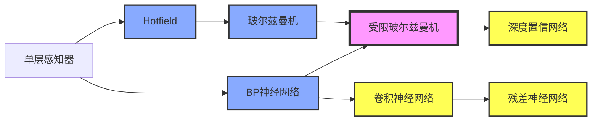

## 第一章 神经网络与深度学习

- **神经网络基础**：单层感知器，线性神经网络，BP神经网络，Hopfield神经网络，径向基神经网络，PCA与SVM神经网络
- **神经网络进阶**：自编码器，秲疏自编码器，玻尔兹曼机，受限玻尔兹曼机，递归神经网络，自组细竞争神经网络
- **深度学习网络**：深度置信网络，卷积神经网络，深度残差网络    

### 参考文献

[^1]: deep learning by bengio
[^2]: 神经网络设计 . 美国 Hagan
[^3]: 神经网络与机器学习. 原书第3版
[^4]: 人工神经网络理论、设计及应用. 第2版
[^5]: THE PERCEPTRON A PROBABILISTIC MODEL FOR INFORMATION STORAGE AND ORGANIZATION  IN THE BRAIN

