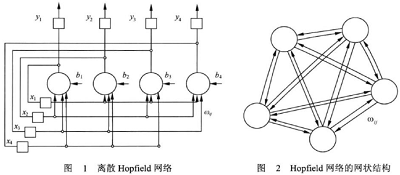

##第三章 Hopfield神经网络

Hopfield人工神经网络能模拟联想记忆功能，曾被誉为人工神经网络方法的革命和再生。Hopfield网络中所有节点全连接，没有分层结构，按动力学方式运行 ，这样能够实现类似人类的联想记忆能力。  

###1. 离散Hopfield神经网络

**工作原理**

HopField神经网络没有分层，也称为反馈神经网络，

HopField有两种工作方式：同步更新方式、异步更新方式

###参考文献

[^1]: Hopfield J J. Neural networks and physical systems with emergent collective computational abilities[J]. Proceedings of the national academy of sciences, 1982, 79(8): 2554-2558. 

