## 第二章 线性神经网络

###1. 线性神经网络

与单层感知器结构类似，感知器的传输函数只能输出两种可能的值，而线性神经网络的输出可以取任意值 ，不同的是**增加支持$purelin: y=x$激活函数**(线性函数)，除了二值输出外还可以支持模拟输出，因此除了充当分类器还可以实现类似回归的效果。训练时采用$purelilne：y=x$进行模型训练，其中y=x就是决策平面，而预测或分类结果时则采用符号函数输出结果。

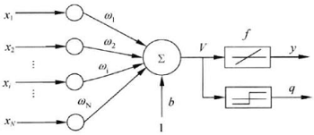

线性神经网络采用**Delta学习规则**即梯度下降法的一般性学习规则，目标函数是**最小化平方误差（MSE）**，学习规则为权值变化量(Delta)正比于负梯度，比例系数为学习率。

####1.1 LMS算法与Delta学习规则

 1959年，Widrow和Hoff在对自适应线性元素的方案一模式识别进行研究时，提出了最小均方算法（简称LMS算法）。LMS算法是基于维纳滤波，然后借助于最速下降算法发展起来的。通过维纳滤波所求解的维纳解，必须在已知输入信号与期望信号的先验统计信息，以及再对输入信号的自相关矩阵进行求逆运算的情况下才能得以确定。因此，这个维纳解仅仅是理论上的一种最优解。所以，又借助于最速下降算法，以递归的方式来逼近这个维纳解，从而避免了矩阵求逆运算，但仍然需要信号的先验信息，故而再使用瞬时误差的平方来代替均方误差，从而最终得出了LMS算法。  

线性神经网络采用Widrow-Hoff学习规则，即LMS(Least Mean Square )算法来调整网络的权值和偏置值，LMS算法又称为$\Delta$规则，LMS算法与单层感知器网络的学习算法在权值调整上都基于纠错学习规则，但LMS更容易实现。

 **Delta学习规则** 人工神经元的作用是对于输入向量$x=(x_1,x_2,...,x_n)$产生一个输出$y$。为了让神经元能够给出我们期望的输出，需要训练它，或者说让它学习到一个模型。训练的样本是一系列已知的x和$\hat{y}$，我们用$\hat{y}$表示期待得到的正确输出。 实际输出与期望输出之间的误差为$E = \frac{1}{2}(y - \hat{y})^2$，学习的过程就是最小化均方误差，神经元通过迭代的方式求得最小值，每次根据当前的状况做出一点修正，逐渐找到目标函数的最小值 。采用**梯度下降算法**最小化均方误差，梯度方向为$\Delta w_i = - \alpha \frac{\partial E}{\partial w_i}$，其中$\alpha$为学习率，则有Delta学习规则为
$$
\Delta w_i = \alpha (\hat{y} - y) y' x_i
$$
当激活函数为$pureline：y=x$时，LMS学习规则为$\Delta_i = a(\hat{y} - y) x_i$，因为LMS学习规则为Delta学习规则的一个特殊情况，LMS学习规则仅用于训练单层神经网络。

**LMS算法流程**

1. 初始化参数权重$w_i$，学习步长$\alpha$，迭代次数$k \leftarrow 1$；

2. 根据输入结果计算比更新参数：
   $$
   \hat{y} = w^T_k x_k  \qquad  \qquad  \\
   e_k = y - \hat{y}  \qquad  \qquad \\
   w_{k+1} = w_k + \alpha e_k x_k
   $$

3. 权重稳定或误差降低至足够小；

**性能分析**

- **收敛性**，收敛性就是指，当迭代次数趋向于无穷时，滤波器权矢量将达到最优值或处于其附近很小的邻域内，或者可以说在满足一定的收敛条件下，滤波器权矢量最终趋近于最优值。
- **收敛速度**，收敛速度是指滤波器权矢量从最初的初始值向其最优解收敛的快慢程度，它是判断LMS算法性能好坏的一个重要指标。
- **稳态误差**，稳态误差，是指当算法进入稳态后滤波器系数与最优解之间距离的远近情况。它也是一个衡量LMS算法性能好坏的重要指标。
- **计算复杂度**，计算复杂度，是指在更新一次滤波器权系数时所需的计算量。LMS算法的计算复杂度还是很低的，这也是它的一大特点。

LMS算法具有计算复杂程度低、在信号为平稳信号的环境中的收敛性好、其期望值无偏地收敛到维纳解和利用有限精度实现算法时的稳定性等特性，使LMS算法成为自适应算法中稳定性最好、应用最广泛的算法。 

####1.2 **线性神经网络和感知器对比** 

1. 网络传输函数，LMS算法将梯度下降法用于训练线性神经网络，这个思想后来发展成反向传播发，也是下一节我们要提到的BP神经网络，具备可以训练多层非线性网络的能力。感知器传输函数是一个二值阈值元件，而线性神经网络的传输函数是线性的。这就决定了感知器只能做简单的分类，而线性神经网络还可以实现拟合或逼近。

2. 学习算法，感知器的学习算法是最早提出的可收敛的算法，LMS算法与他关系密切，形式上也非常相似。在计算上LMS算法和感知器没什么两样，但注意，LMS算法得到的分类边界往往处于两类模型的正中间，而感知器学习算法在刚刚能正确分类的位置就停下来了，从而使分类边界离一些模式距离过近，使系统对误差更敏感。

3. 多输出，线性神经网络支持除了分类、回归外，使用多个输出/分离平面（Madaline网络）可以变相解决线性不可分问题，同时可以引入非线性成分（升维，类似SVM）一定程度上解决非线性问题。

   

感知器对异或问题是无法正确分类的。因为无法找到一条直线或者一个平面将异或数据划分开。但是可以构建如下神经网络结构来处理异或问题 

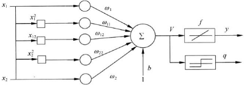

上图中在原有的X1和X2变量， 添加了非线性输入值：$x_1^2, x_1x_2, x_2^2$，这种算法的思路是既然运算中无法引入非线性特征，那么就是输入层添加非线性成分。

###2. BP神经网络

1986年由Rumelhart和McCelland为首的科学家小组提出误差反向传播算法(Error Back Propagation)，是一种学习算法。灵感来源于单层感知器学习规则有很多缺点而提出LMS算法去改进它，推广LMS算法到Delta算法，在Delta算法中将激活函数由$pureline$泛化为普通函数，再基于Delta学习规则推导出误差反向传播算法从而使得神经网络可以推广到多层。

人工神经网络拓扑结构即神经元连接方式：

- 层次型网络结构，同一层的节点不会连接，连接发生在相邻两层之间；信息流是从下往上而不能倒回去，每一层的节点仅和下一层节点相连(前馈)称之为**前馈网络**，若包含多个隐藏层则称之为**多层前馈网络**，BP神经网络采用的就是层次型网络结构。

  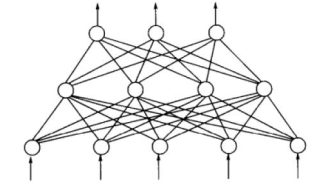

- 层内有互连的层次型网络结构

  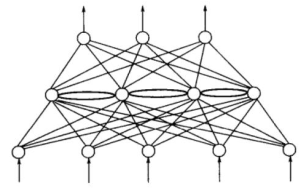

- 输出层到输入层有连接的层次型网络结构，输出时会有反馈回路流到输入层。

  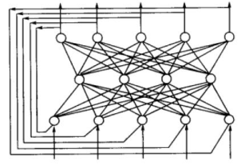

- 全互联型网络结构，每一个节点都取其他所有节点相连，同时信息流也能够流向其他任何节点，Hotfield神经网络就是这种结构的网络。

  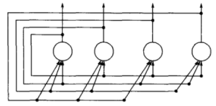

####2.1 BP神经网络概念

目前应用最广泛的神经网络模型之一，是多层前馈网络；多层，可以调整的权值很多，可以使用多种激活函数；能学习和存贮大量的输入-输出模式映射关系，而无需事前揭示描述这种映射关系的数学方程；学习规则使用最速下降法，通过反向传播来判断调整网络的权值和阈值，使网络的误差平方和最小；BP神经网络模型拓扑结构包括输入层（input）、隐层(hide layer)和输出层(output layer) 。

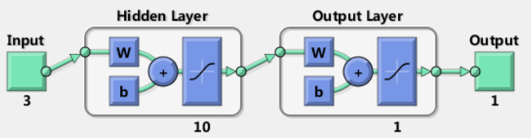

####2.2 BP学习算法理论

BP神经网络的学习规则计算采用最速下降BP算法，

####2.3 反向传播算法与梯度传递的链式法则

如何有最终的loss值得到最优的权重值呢？通过反向传播实现。有数据得到损失值得过程为前向传播，而由于损失值沿着相反方向计算什么样的权重参数最优。最优化过程就是在反向传播中体现。

**范例**：损失函数$L=f(x,y,z)=(x+y)z$，样本点为$x=-2，y=5，z=-4$，则可以得到损失值为$L=-12$

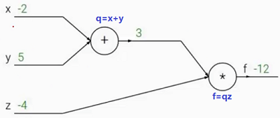

得到损失值后，需要计算$x,y,z$分别对损失函数做了多大贡献，需要得到权重参数$w$与损失函数$L$的关系，得到最优权重参数使得损失函数值最小。
$$
q = x + y \qquad 
\frac{\partial q}{\partial x} = 1 \quad \frac{\partial q}{\partial y} = 1 \\
f=qz \qquad \frac{\partial f}{\partial z} = q \quad \frac{\partial f}{\partial q} = z\\
$$
计算x对损失函数的贡献

1. 算q对f的贡献，$\frac{\partial f}{\partial q} = z = -4$ ，含义是q上升1倍，会使得f值下降4倍，则q应越大越好；
2. 计算x对q的贡献，$\frac{\partial q}{\partial x} = 1$ 

通过反向传播中的**链式法则** 得到x对f的贡献为$1 * -4 = - 4$，同理可以计算y对f的贡献为$-4$，z对f的贡献为$3$ 。

**梯度传递的链式法则** 

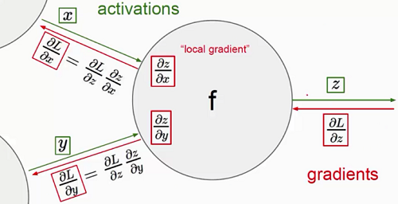

**范例**：链式法则求解权值参数

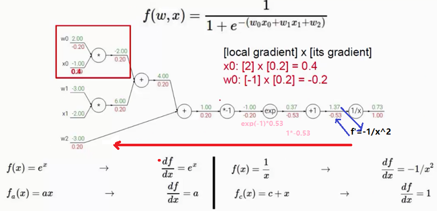

简化反向传播计算，直接对sigmoid函数求导，得到的结果也是一样的

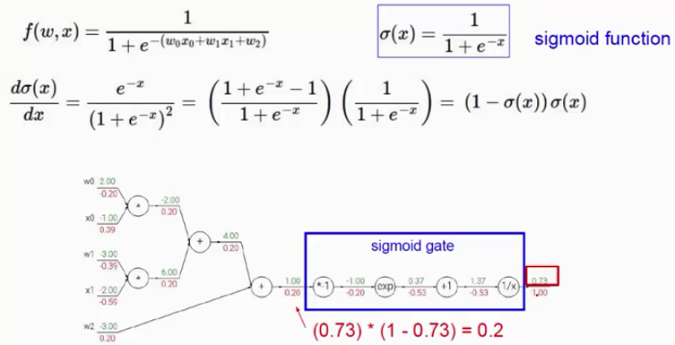

**范例：门单元简化计算**

- 加法门单元：梯度均等分配
- MAX门单元：梯度传递为给最大的
- 乘法门单元：梯度互换

####2.4反向传播算法实例

第一层是输入层，包含两个神经元i1，i2，和截距项b1；第二层是隐含层，包含两个神经元h1,h2和截距项b2，第三层是输出o1,o2，每条线上标的wi是层与层之间连接的权重，激活函数我们默认为sigmoid函数。 

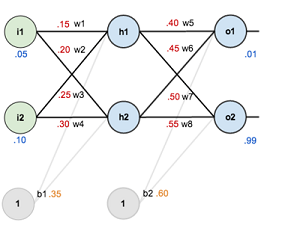

其中，输入数据  i1=0.05，i2=0.10;

　　　输出数据 o1=0.01,o2=0.99;

　　　初始权重  w1=0.15,w2=0.20,w3=0.25,w4=0.30;

　　　　　　　  w5=0.40,w6=0.45,w7=0.50,w8=0.88

目标：给出输入数据i1,i2(0.05和0.10)，使输出尽可能与原始输出o1,o2(0.01和0.99)接近。 

**Step 1 前向传播 **

1. 输入层 $\rightarrow$ 隐藏层

   计算神经元h1的输入加权和：
   $$
   net_{h1} = w_1 * i_1 + w_2 * i_2 + b_1*1 \qquad \qquad \ \ \ \quad\\
   =0.15*0.05+0.2*0.1+0.35*1 \\
   =0.03775 \qquad \qquad \qquad \qquad \qquad \ \
   $$
   神经元h1的输出o1，此处用激活函数sigmoid函数：
   $$
   out_{h1} = \frac{1}{1 + e^{-net_{h1}}} = \frac{1}{1 + e^{-0.03775}} = 0.59327
   $$
   同理可以计算出神经元h2的输出为：$out_{h2} = 0.59688$

2. 隐藏层 $\rightarrow$ 输出层

   计算输出层神经元o1和o2的值：
   $$
   net_{o1} = w^5*out_{h1} + w_6*out_{h2} + b_2 * 1 \qquad \qquad \quad \ \ \ \\
   =0.4 * 0.59327 + 0.45*0.59688 + 0.6*1 \\
   =1.10591 \qquad\qquad\qquad\qquad\qquad\qquad\quad \
   $$
   采用激活函数sigmoid函数计算o1的输出值为：
   $$
   out_{o1} = \frac{1}{1 + e^{-net_{o1}}} = \frac{1}{1 + e^{-1.10591}} = 0.75137
   $$
   同理可以计算出神经元o2的输出为：$out_{o2} = 0.77293$

前向传播的过程就结束，我们得到输出值为[0.75137, 0.77293]，与实际值[0.01 , 0.99]相差还很远，现在我们对误差进行反向传播，更新权值，重新计算输出。 

**Step 2 反向传播 **

1. 计算总误差

   误差公式为$E=\frac{1}{2}(target - output)^2$，应有这里有两个输出，所有总误差为各自输出误差之和，则有
   $$
   E_{o1} = \frac{1}{2}(0.01 - 0.75137)^2 = 0.27481 \\
   E_{o2} = \frac{1}{2}(0.99 - 0.77293)^2 = 0.02356 \\
   E_{total} = E_{o1} +E_{o2} =  0.27481 + 0.02356 = 0.29837
   $$

2. 隐含层 $\rightarrow$ 输出层的权值更新

   以权重参数w5为例，如果我们想知道w5对整体误差产生了多少影响，可以用整体误差对w5求偏导求出：（链式法则） 
   $$
   \frac{\partial E_{total}}{\partial w_5} = \frac{\partial E_{total}}{\partial out_{o1}} \cdot \frac{\partial out_{o1}}{\partial net_{o1}} \cdot \frac{\partial net_{o1}}{\partial out_{w_5}} \\
   $$
   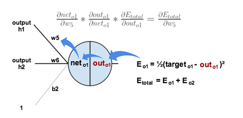

   上图可以更直观的看清楚误差是怎样反向传播的，则分别计算上式中微分的值，则计算出整体误差E(total)对w5的偏导值具体如下：

   - 计算$\frac{\partial E_{total}}{\partial out_{o1}}=-(target-out_{o2}) + 0=-(0.01-0.75137)=0.74137$
   - 计算$\frac{\partial out_{o2}}{\partial net_{o1}}=out_{o1}(1-out_{o1}) =0.75137(1-0.75137)=0.18682$
   - 计算$\frac{\partial net_{o1}}{\partial w_{5}}=out_{h1}*w_5^{1-1} + 0 + 0=out_{h1}=0.59327$，

   对于上述求解结果，用$\delta_{o1} = -(target - out_{o2})*out_{o1}*(1-out_{o1})*out_{h1}$表示输出层误差，则整体误差$E_{total}$对权值偏导函数为$\frac{\partial E_{total}}{\partial w_5}$。

   **权值更新**：$w_5^{+} = w_5 - \alpha * \frac{\partial E_{total}}{\partial w_5}$，则有$w^+_5 = 0.4 - 0.5 * 0.08216=0.35892$，同理对$w_6^+,w_7^+,w_8^+$进行更新可以得到$w_6^+=0.40867, x_7^+=0.51130,x_8^+=0.56137$

3. 隐含层 $\rightarrow$ 隐含层的权值更新

   方法其实与上面说的差不多，但是有个地方需要变一下，在上文计算总误差对w5的偏导时，是从out(o1)---->net(o1)---->w5，但是在隐含层之间的权值更新时，是out(h1)---->net(h1)---->w1，而out(h1)会接受E(o1)和E(o2)两个地方传来的误差，所以这个地方两个都要计算。 

   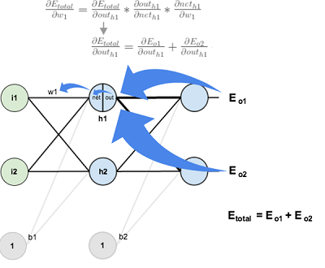

   - 计算$\frac{\partial E_{total}}{\partial out_{h1}} =\frac{\partial E_{o1}}{\partial out_{h1}}+\frac{\partial E_{o2}}{\partial out_{h1}} $，计算过程如下
     $$
     \frac{\partial E_{o_{1}}}{\partial out_{h1}} = \frac{\partial E_{o1}}{\partial net_{o1}} * \frac{\partial net_{o1}}{out_{h1}} \qquad \qquad \qquad \qquad \  \  \\
     = 0.714137*0.18681=0.1385\\
     \frac{\partial E_{o_{2}}}{\partial out_{h1}} = -0.01905 \qquad \qquad \qquad \qquad \qquad \qquad
     $$
     则计算$\frac{\partial E_{total}}{\partial out_{h1}} = \frac{\partial E_{o1}}{\partial out_{h1}}+\frac{\partial E_{o2}}{\partial out_{h1}}$=0.1385 - 0.01905 = 0.03635

   - 计算$\frac{\partial out_{h1}}{\partial net_{h1}}=out_{h1}(1-out_{h1})=0.2413 $

   - 计算$\frac{net_{h1}}{w_1} = i_1 = 0.05，其中net_{h1}=w_1*i_1+w_2*i_2 + b_1*1$

   最后三者相乘可以得到：$\frac{\partial E_{total}}{\partial w_{1}}=\frac{\partial E_{total}}{\partial out_{h1}} \cdot \frac{\partial out_{h1}}{\partial net_{h1}} \cdot \frac{net_{h1}}{w_1} =0.00044$

   **权值更新**：$w_1^{+} = w_1 - \alpha * \frac{\partial E_{total}}{\partial w_1}$，则有$w^+_1 = 0.4 - 0.5 * 0.00044=0.14978$，同理对$w_2^+,w_3^+,w_4^+$进行更新可以得到$w_2^+=0.19956, x_3^+=0.24975,x_4^+=0.29950$

最后我们再把更新的权值重新计算，不停地迭代，直到算法收敛或达到最大迭代次数为止。

https://blog.csdn.net/accumulate_zhang/article/details/53324165

#### 2.5 BP神经网络总结

**非线性映射能力**：由于有多层，可以容纳更多节点，权值，能储存更多信息，善于处理没有业务逻辑和数学方法可以描述，缺乏专家经验的问题，天生是面对非线性问题的通用逼近工具；

**容错能力**：个别样本的误差对权值的全局训练影响不大。正确的知识来自全体样本，是从大量样本中提取统计特性的过程；

**泛化能力**：训练完毕后的模型可以直接投入使用，速度很快，既可以用软件实现，也 可以用电子器件，甚至神经网络芯片实现；

**BP神经网络建模的局限性**：神经网络设计具有较高技巧；同时它也是一 个灰箱系统，容易掩盖某些业务背景绅节；容易产生过度拟合；BP神经网络也不能够支持太多的隐层数，原因：1. 激活函数选择不好，导致学习信号在反向传播过程会越变越弱，2. 容易陷入局部极小值。如下图所示，BP神经网络中的损失函数具有多个局部最小值，在训练时若取的处置不是太好的话，容易陷入局部最小值中无法跳出，那么神经网络训练出来的权值就不是很准确，这是梯度下降算法的弱点。激活函数有很多问题，要么是过度饱和(激活函数的曲线平行于坐标轴，此时神经元处于饱和状态，此时激活函数的梯度趋向于0)要么是反向传递时误差信号越来越小，由于根据传过来的误差改变权值，当信号越来越弱时，则学习到的东西就越来越少，例如当层数有1000层时信号可能趋近于0，就导致学习慢、收敛速度慢，很难进行学习。**因此BP神经网络通常使用三层()输入层、隐藏层、输出层**，虽然BP引入了非线性，但是由于层数过小，引入的权值过少，能够表现的逻辑也就比较少。BP神经网络发表后的一二十年间，只要就是针对如何改变BP神经网络容器支持更多的层，引入深度学习的概念就是为了扩展神经网络期望能够建立更深的层次。

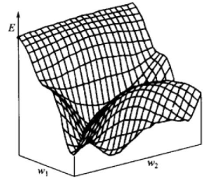    

**阅读作业**

为什么BP网络不能支持太多的隐藏层？精读《Understanding the difficulty of training deep feedforward neural networks》一文

书面作业
1 根据《Understanding the difficulty of training deep feedforward neural networks》回答下列问题
1）normalized的初始化权值和standard的初始化权值在定义上有何不同？
2）根据文中图11，比较一下几种激活函数的优劣，什么原因造成sigmoid效果比较差？而softsign效果相对较好？
2 用任何一种编程语言编程实现LMS学习算法，并将运行测试的结果抓图

##参考文献

[^1]: Glorot X, Bengio Y. Understanding the difficulty of training deep feedforward neural networks[C]//Proceedings of the thirteenth international conference on artificial intelligence and statistics. 2010: 249-256.
[^2]: [线性神经网络发明者](http://www-isl.stanford.edu/~widrow/)