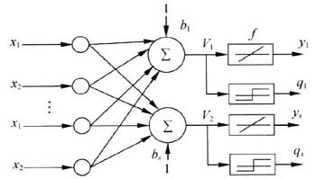
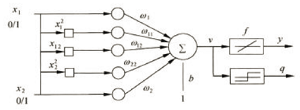

## 第二章 线性神经网络

###1. 线性神经网络

与单层感知器结构类似，感知器的传输函数只能输出两种可能的值，而线性神经网络的输出可以取任意值 ，不同的是**增加支持$purelin: y=x$激活函数**(线性函数)，除了二值输出外还可以支持模拟输出，因此除了充当分类器还可以实现类似回归的效果。训练时采用$purelilne：y=x$进行模型训练，其中y=x就是决策平面，而预测或分类结果时则采用符号函数输出结果。

线性神经网络支持除了分类、回归外，使用多个输出/分离平面（Madaline网络）可以变相解决线性不可分问题，同时可以引入非线性成分（升维，类似SVM）一定程度上解决非线性问题。

线性神经网络采用**Delta学习规则**即梯度下降法的一般性学习规则，目标函数是**最小化平方误差（MSE）**，学习规则为权值变化量(Delta)正比于负梯度，比例系数为学习率。

####1.1 LMS算法

 1959年，Widrow和Hoff在对自适应线性元素的方案一模式识别进行研究时，提出了最小均方算法（简称LMS算法）。LMS算法是基于维纳滤波，然后借助于最速下降算法发展起来的。通过维纳滤波所求解的维纳解，必须在已知输入信号与期望信号的先验统计信息，以及再对输入信号的自相关矩阵进行求逆运算的情况下才能得以确定。因此，这个维纳解仅仅是理论上的一种最优解。所以，又借助于最速下降算法，以递归的方式来逼近这个维纳解，从而避免了矩阵求逆运算，但仍然需要信号的先验信息，故而再使用瞬时误差的平方来代替均方误差，从而最终得出了LMS算法。  

线性神经网络采用Widrow-Hoff学习规则，即LMS(Least Mean Square )算法来调整网络的权值和偏置值，LMS算法又称为$\Delta$规则，LMS算法与单层感知器网络的学习算法在权值调整上都基于纠错学习规则，但LMS更容易实现。

 **Delta学习规则** 人工神经元的作用是对于输入向量$x=(x_1,x_2,...,x_n)$产生一个输出$y$。为了让神经元能够给出我们期望的输出，需要训练它，或者说让它学习到一个模型。训练的样本是一系列已知的x和$\hat{y}$，我们用$\hat{y}$表示期待得到的正确输出。 实际输出与期望输出之间的误差为$E = \frac{1}{2}(y - \hat{y})^2$，学习的过程就是最小化均方误差，神经元通过迭代的方式求得最小值，每次根据当前的状况做出一点修正，逐渐找到目标函数的最小值 。我们采用**梯度下降算法**最小化均方误差，梯度方向为$\Delta w_i = - \alpha \frac{\partial E}{\partial w_i}$，其中$\alpha$为学习率，则有Delta学习规则为
$$
\Delta w_i = \alpha (\hat{y} - y) x_i
$$
**LMS算法流程**

1. 初始化参数权重$w_i$，学习步长$\alpha$，迭代次数$k \leftarrow 1$；

2. 根据输入结果计算比更新参数：
   $$
   \hat{y} = w^T_k x_k  \qquad  \qquad  \\
   e_k = y - \hat{y}  \qquad  \qquad \\
   w_{k+1} = w_k + \alpha e_k x_k
   $$

3. 权重稳定或误差降低至足够小；

**性能分析**

- **收敛性**，收敛性就是指，当迭代次数趋向于无穷时，滤波器权矢量将达到最优值或处于其附近很小的邻域内，或者可以说在满足一定的收敛条件下，滤波器权矢量最终趋近于最优值。
- **收敛速度**，收敛速度是指滤波器权矢量从最初的初始值向其最优解收敛的快慢程度，它是判断LMS算法性能好坏的一个重要指标。
- **稳态误差**，稳态误差，是指当算法进入稳态后滤波器系数与最优解之间距离的远近情况。它也是一个衡量LMS算法性能好坏的重要指标。
- **计算复杂度**，计算复杂度，是指在更新一次滤波器权系数时所需的计算量。LMS算法的计算复杂度还是很低的，这也是它的一大特点。

LMS算法具有计算复杂程度低、在信号为平稳信号的环境中的收敛性好、其期望值无偏地收敛到维纳解和利用有限精度实现算法时的稳定性等特性，使LMS算法成为自适应算法中稳定性最好、应用最广泛的算法。 

####1.2 **线性神经网络和感知器对比** 

1. 网络传输函数，LMS算法将梯度下降法用于训练线性神经网络，这个思想后来发展成反向传播发，也是下一节我们要提到的BP神经网络，具备可以训练多层非线性网络的能力。感知器传输函数是一个二值阈值元件，而线性神经网络的传输函数是线性的。这就决定了感知器只能做简单的分类，而线性神经网络还可以实现拟合或逼近。
2. 学习算法，感知器的学习算法是最早提出的可收敛的算法，LMS算法与他关系密切，形式上也非常相似。在计算上LMS算法和感知器没什么两样，但注意，LMS算法得到的分类边界往往处于两类模型的正中间，而感知器学习算法在刚刚能正确分类的位置就停下来了，从而使分类边界离一些模式距离过近，使系统对误差更敏感。

感知器对异或问题是无法正确分类的。因为无法找到一条直线或者一个平面将异或数据划分开。但是可以构建如下神经网络结构来处理异或问题 

上图中在原有的X1和X2变量， 添加了非线性输入值：$x_1^2, x_1x_2, x_2^2$，这种算法的思路是既然运算中无法引入非线性特征，那么就是输入层添加非线性成分。

###2. BP神经网络

阅读作业
1 精读《Understanding the difficulty of training deep feedforward neural networks》一文

书面作业
1 根据《Understanding the difficulty of training deep feedforward neural networks》回答下列问题
1）normalized的初始化权值和standard的初始化权值在定义上有何不同？
2）根据文中图11，比较一下几种激活函数的优劣，什么原因造成sigmoid效果比较差？而softsign效果相对较好？
2 用任何一种编程语言编程实现LMS学习算法，并将运行测试的结果抓图

##参考文献

[^1]: Glorot X, Bengio Y. Understanding the difficulty of training deep feedforward neural networks[C]//Proceedings of the thirteenth international conference on artificial intelligence and statistics. 2010: 249-256. 
[^2]: [线性神经网络发明者](http://www-isl.stanford.edu/~widrow/)