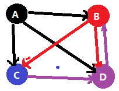

## 第五章 受限玻尔兹曼机

###1. 从马尔科夫链说起

彼得堡数学学派包括切比雪夫、马尔科夫和李雅普诺夫，学派主要贡献是复兴概率论，把概率论从濒临衰亡的境地挽救出来，恢复其作为一门 数学学科的地位，并把它推进到现代化的门槛。

**随机过程**

举例：掷骰子，掷3下，分别在t1、t2、t3 三个时刻记录结果。“A上”对应于实数1；“B上”对应于实数2；“C上”对应于实数3 ，以此类推。这是一个定义在三个时刻上的离散函数。因为这个函数有多种情况，你可以理解为好多人在和你一起且在同样的三个时刻掷骰子，所以会有不同的函数出现。 而这种情况，其实就对应了随机变量，我们把所有的函数情况的集合叫作样本空间，某一种函数叫作样本点，显然总共有6\*6\*6个不同的样本点。 每个样本点所做的映射不再是一个实数值，而是一个函数，一个随时间变化的函数，也就是我们在原来随机变量的基础上，由一个固定的实数值拓展到一个随时间变化的实数，即函数。所以此时这就不是一维的随机变量了，而是二维的一个“随机过程”。

如果我们去固定样本，在时间维度去观察这个随机过程：

- 若样本固定在ζ1 处，好比第一个人去掷骰子，则随机过程退化为函数1 。X（t1,ζ1）= 1；X（t2,ζ1）= 2；X（t3,ζ1）= 3； 
- 若样本固定在ζ2 处，好比第二个人去掷骰子，则随机过程退化为函数2 。X（t1,ζ2）= 2；X（t2,ζ2）= 2；X（t3,ζ2）= 5； 

如果我们去固定时间，在概率空间里去观察这个随机过程：

- 若时间固定在t1 处，则随机过程退化为随机变量1 。P（t1, "A上"） = 1/6；P（t1, "B上"） = 1/6；P（t1, "C上"） = 1/6  ...  P（t1, "F上"） = 1/6。 
- 　若时间固定在t2 处，则随机过程退化为随机变量2 。P（t2, "A上"） = 1/6；P（t2, "B上"） = 1/6；P（t2, "C上"） = 1/6  ...  P（t2, "F上"） = 1/6。 
- 若时间固定在t3 处，则随机过程退化为随机变量3 。P（t3, "A上"） = 1/6；P（t3, "B上"） = 1/6；P（t3, "C上"） = 1/6  ...  P（t3, "F上"） = 1/6。 

我们发现在固定时间时，退化的随机变量的样本和原来随机过程的样本是不一样的，前者是“A上”“B上”之类，映射到实数值，而后者是三次时刻的结果的一个排列，映射到一个随时间变化的实数值，即函数。 

随机过程的两层含义：

1.  随机过程是一个时间函数，其随着时间变化而变化；
2. 随机过程的每个时刻上函数值是不确定的、随机的，即每个时刻上函数值按照一定的概率进行分布；

**马尔科夫过程** 在独立链中，前面语言符号对后面的语言符号无影响，是无记忆没有后效的随机过程，在已知当前状态下，过程的未来状态与它的过去状态无关(只与现在状态有关)，这种形式就是马尔可夫过程。 

**马尔科夫链**：在随机过程中，每个语言符号的出现概率不相互独立，每个随机试验的当前状态依赖于此前状态，这种链就是马尔可夫链。 **时间和状态都是离散的马尔科夫过程称为马尔科夫链 ，而时间是连续的称为马尔科夫过程**

**Page Rank与马尔科夫过程**

PageRank算法计算每一个网页的PageRank值，然后根据这个值的大小对网页的重要性进行排序。它的思想是模拟一个悠闲的上网者，上网者首先随机选择一个网页打开，然后在这个网页上呆了几分钟后，跳转到该网页所指向的链接，这样无所事事、漫无目的地在网页上跳来跳去，PageRank就是估计这个悠闲的上网者分布在各个网页上的概率。 

这是Google最核心的算法，用于给每个网页价值评分，是Google“在垃圾中找黄金 ”的关键算法，这个算法成就了今天的Google。下图中，有个定点每个定点代表一个页面，其中有向边表示页面1有一个链接指向页面2。

在矩阵S中，每一列代表一个网页，例如第一列中$\frac{1}{3}$表示1号页面有$\frac{1}{3}$的概率跳转到网页2,3,4，这里矩阵G就是页面间的转移概率矩阵。
$$
S = \left[ \begin{matrix}
0 & 0 & 0 & 0\\
\frac{1}{3} & 0 & 0 & 1 \\
\frac{1}{3} & \frac{1}{2} & 0 & 0\\
\frac{1}{3} & \frac{1}{2} & 1 & 0
\end{matrix} \right ]
$$
为了防止矩阵S某些元素为零，导致矩阵S经过若干次幂后全为零，需要对齐进行修正，满足马尔科夫链的**便利性**定理：
$$
G = \alpha S +(1 - \alpha) \frac{1}{n} U
$$
其中S为destination-by-source构成的原始矩阵，U为全1的矩阵，n表示节点的数据，而$\alpha$表示用户对当前页面的粘度，即用户停留在当前页面的概率，范围在$[0, 1]$之间。

PageRank算法得到的向量$q$定义为：$\vec{q}_{next} = G \vec{q}_{cur}$，循环迭代求。初始时，假设上网者在每一个网页的概率都是相等的，即1/n，于是初始时的概率分布就是一个所有值都为1/n的n维列向量$q_0$，用$q_0$去右乘转移矩阵G，就得到了第一步之后上网者的概率分布向量$G*q_0$,$(n \times n) * (n \times1)$依然得到一个$nX1$的矩阵，如此循环反复直到收敛，Google内部采用的是MapReduce算法计算。
$$
\vec{q}_{next} = Gq_{cur} = 
\left[ \begin{matrix}
0 & 0 & 0 & 0\\
\frac{1}{3} & 0 & 0 & 1 \\
\frac{1}{3} & \frac{1}{2} & 0 & 0\\
\frac{1}{3} & \frac{1}{2} & 1 & 0
\end{matrix} \right ] * 
\left[ \begin{matrix}
\frac{1}{4}  \\
\frac{1}{4} \\
\frac{1}{4} \\
\frac{1}{4} 
\end{matrix} \right ] 
$$
NOTES：具体详细内容参见《机器学习笔记》中的马尔科夫链

### 2. MCMC与Metropolis算法[^3]

随机模拟也可以叫做蒙特卡罗模拟(Monte Carlo Simulation)。这个方法的发展始于20世纪40年代，和原子弹制造的曼哈顿计划密切相关，当时的几个大牛，包括乌拉姆、冯.诺依曼、费米、费曼、Nicholas Metropolis， 在美国洛斯阿拉莫斯国家实验室研究裂变物质的中子连锁反应的时候，开始使用统计模拟的方法,并在最早的计算机上进行编程实现[^3]。 

随机模拟中有一个重要的问题就是给定一个概率分布p(x)，我们如何在计算机中生成它的样本。一般而言均匀分布 Uniform(0,1)的样本是相对容易生成的。 通过线性同余发生器可以生成伪随机数，我们用确定性算法生成[0,1]之间的伪随机数序列后，这些序列的各种统计指标和均匀分布 Uniform(0,1) 的理论计算结果非常接近。这样的伪随机序列就有比较好的统计性质，可以被当成真实的随机数使用。 

### 3. 玻尔兹曼机Gibbs采样的联系

参见《神经网络与机器学习》中的第11章根植于统计力学的随机方法中相关小节。

### 4. 受限玻尔兹曼机[^5][^6]

### 5. CD学习算法[^4]

###参考文件

[^1]: An Introduction to MCMC for Machine Learning，2003
[^2]: Introduction to Monte Carlo Methods
[^3]: [LDA数学八卦](https://cosx.org/2013/01/lda-math-mcmc-and-gibbs-sampling)
[^4]: Training Products of Experts by Minimizing Contrastive Divergence
[^5]: An Introduction to Restricted Boltzmann Machines
[^6]: 受限波尔兹曼机简介