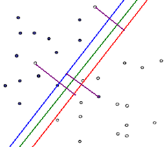
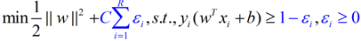

## 第六章 万能逼近器：径向基神经网络 PCA与SVM神经网络

**神经网络的几何解释？**假设输入X为N维空间的向量，隐层输出为Y为M维的空间的向量，W为权值矩阵，它可能是方阵也可能不是，若输入输出节点相同W为方阵$\square$，若隐层节点比较少则W为横长条矩阵$\square \square$，若隐藏层较输入多着W为竖长条矩阵$\square \\ \square$ ；则$Y=WX$相当于对X做了线性变换，线性变换可以是旋转、平移但不会改变向量的长度称之为`刚体变换`，线性变换也可以是仿射变换(倾斜、扭曲，某个方向压缩拉伸等)，线性变换这一列变换的累积效果。总体来说，`样本空间`集合经过$Y=WX$线性变换后，变成另外一个空间`(特征空间)`中的向量集合，而激活函数就是对`特征空间`中的每个维度做`非线性变换`，例如sigmoid函数会把特征空间映射到一个$1\times1$正方形空间中，而ReLu激活函数$f(x) = \begin{cases} 0  \ \ x <=0 \\ x \ \ x > 0 \end{cases}$会把特征空间映射到第一象限，原先在第一象限的数据保留，第二象限的数据被压缩到Y轴，第三象限的数据被直接压缩到原点，第四象限的数据被压缩到X轴上。 

###1. SVM神经网络

大部分情况都不是线性可分的，可以使用加惩罚函数的斱法解决。可以为分错的点加上一点惩罚，对一个分错的点的**惩罚函数**就是**这个点到其正确位置的距离：** 

 在上图中，蓝色、红色的直线分别为支持向量所在的边界，绿色的线为决策函数，那些紫色的线**表示分错的点到其相应的决策面的距离**，这样我们可以在原函数上面加上一个**惩罚函数**，并且带上其限制条件为：

公式中蓝色的部分为在线性可分问题的基础上加上的惩罚函数部分，当xi在正确一边的时候，ε=0，R为全部的点的数目，C是一个由用户去指定的系数称为**松弛因子**，表示对分错的点加入多少的惩罚，当C很大的时候，分错的点就会更少，但是过拟合的情况可能会比较严重，当C很小的时候，分错的点可能会很多，不过可能由此得到的模型也会不太正确，所以如何选择C是有很多学问的，不过在大部分情况下就是通过经验尝试得到的。 

**核方法[^4]**

把SVM中推核函数的使用技巧推广到向量机以外的其他类似模型中去的方法称为**核方法**。

**Mercer定理**：如果函数K是$R^n \times R^n \rightarrow R$上的映射(也就是从两个n维向量映射到实数域)，那么如果K是一个有效核函数(也称Mercer核函数)，那么当且仅当对于训练样本$\{x^{(1)},x^{(2)},...,x^{(m)} \}$，其相应的核函数矩阵是对称半正定的。(如何判定一个核函数的有效性！)

**构建核函数的规则[^2][^3]**

### 2. 径向基RBF神经网络

###3. PCA神经网络

### 参考文献

[^1]: Geometrical and Statistical Properties of Systems of Linear Inequalities with Applications in Pattern Recognition
[^2]: Kernel Methods for Pattern Analysis
[^3]: Learning with Kernels
[^4]: PRML：Pattern Recognition and Machine Learning，293
[^5]: 机器学习 周志华