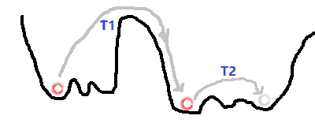

##第四章 随机神经网络之玻尔兹曼机

###1. 模拟退火算法

解释降温过程如何影响最小值的选取？如下图所示，温度$T1 < T2$逐渐下降，当温度较高$T1$时，小球会在“深坑”之间来回跳跃，容易跳离小坑进入更深的坑中；而当温度降低$T2$时，小球会在“深坑”中的“小坑”中来回跳跃，知道进入其中更深的“小坑”中。

###2. 玻尔兹曼分布

假设我们有一个包含宏观粒子总数为$N$ 、环境温度为$T$ 、容器达到热力平衡的封闭系统。假定系统中只有两种能级$\epsilon_0$ 、$\epsilon_1$ 其中$\epsilon_0$为低能级状，$\epsilon_1$为高能级，它们分别包含了$n_0$和$n_1$个微粒，则$n_0+n_1=N$。则在系统中不同粒子的组合状态数有$W = C_N^{n_0}=\frac{N!}{n_0 ! n_1!}$种，而系统的熵S与状态数之间的关系为：
$$
S = k ln W
$$
其中k为玻尔兹曼常数，W为状态数，该公式也称为玻尔兹曼公式，取$lnW$表示为若用二进制表示W种状态总共需要多少二进制位。将W带入上述公式可以得到：
$$
S = k [lnN! - ln n_0! - ln n_1 !]
$$
现在给系统增加少量的能量使得系统中有一个粒子的状态由$\epsilon_0 \rightarrow \epsilon_1$，则可以得到此时系统的熵为：
$$
S' = k [lnN! - ln (n_0-1)! - ln (n_1+1) !]
$$
由于下$n_0,n_1$的值很大，因此可以得到系统能量变化为：
$$
\Delta S = S' - S = k ln \frac{n_0}{n_1 + 1} \approx k ln \frac{n_0}{n_1}
$$
由物理学定律可以得到熵值与温度成反比，而与系统能量变化成正比，因此可以得到：
$$
\Delta S \propto \frac{\Delta E}{T} \\
k ln\frac{n_0}{n_1} = \frac{\Delta E}{T} \\
\frac{n_0}{n_1} = exp(\frac{\Delta E}{kT})
$$
因此我们称为$\frac{n_0}{n_1} = exp(\frac{\Delta E}{kT})$这种分布称为玻尔兹曼分布，它可以应用于任意两个两个能级之间。

###3. 玻尔兹曼机

### 参考文献

[^1]: Hinton G E, Sejnowski T J. Learning and releaming in boltzmann machines[J]. Parallel distributed processing: Explorations in the microstructure of cognition, 1986, 1(282-317): 2.